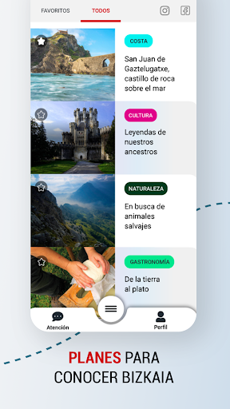
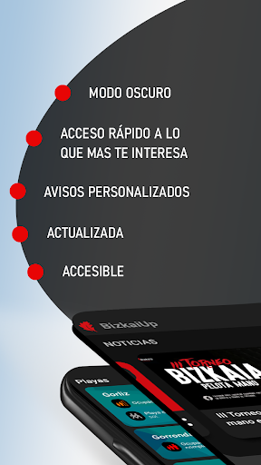
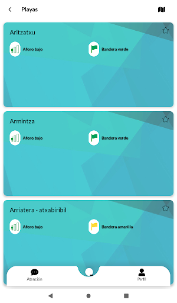
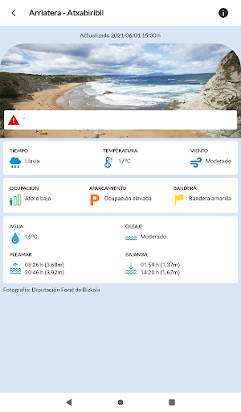
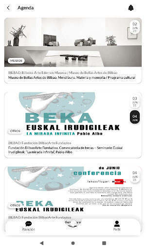
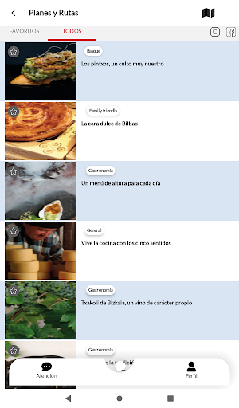
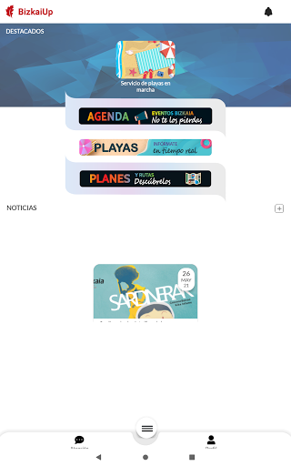
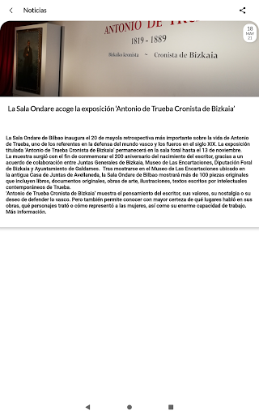
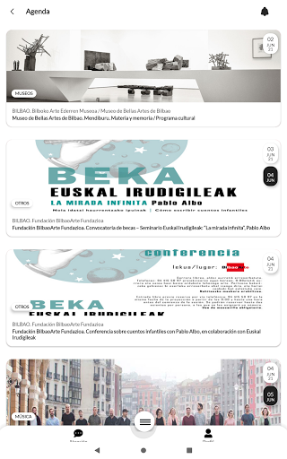

# BizkaiUp – Bizkaia en tu móvil. Playas, agenda...
App version ``2.0.1``

Analyzed with [covid-apps-observer](http://github.com/covid-apps-observer) project, version ``0.1``

## App overview
| | |
|-------------------------|-------------------------| 
| **Name**&nbsp;&nbsp;&nbsp;&nbsp;&nbsp;&nbsp;&nbsp;&nbsp;&nbsp;&nbsp;&nbsp;&nbsp;&nbsp;&nbsp;&nbsp;&nbsp;&nbsp;&nbsp;&nbsp;&nbsp;&nbsp;&nbsp;&nbsp;&nbsp;&nbsp;&nbsp;&nbsp;&nbsp;&nbsp;&nbsp;&nbsp;&nbsp;&nbsp;&nbsp;&nbsp;&nbsp;&nbsp;&nbsp;&nbsp;&nbsp;  | BizkaiUp – Bizkaia en tu móvil. Playas, agenda... |
| **Unique identifier** | com.lantik.bizkaiup |
| **Link to Google Play** | [https://play.google.com/store/apps/details?id=com.lantik.bizkaiup](https://play.google.com/store/apps/details?id=com.lantik.bizkaiup) |
| **Summary**  | BizkaiUp es vivir Bizkaia:playas,turismo,agenda, noticias, atención ciudadana |
| **Privacy policy** | [https://web.bizkaia.eus/documents/842933/0/Disclaimer+Legal.pdf/87b8dbc5-0606-4de9-9aa6-a25fbc5662a6?t=1585570249850](https://web.bizkaia.eus/documents/842933/0/Disclaimer+Legal.pdf/87b8dbc5-0606-4de9-9aa6-a25fbc5662a6?t=1585570249850) |
| **Latest version** | 2.0.1 |
| **Last update** | 2021-06-24 15:27:09 |
| **Recent changes** | ¡Llegó la hora de actualizarse!   BizkaiUp está en constante renovación y nos gusta ponernos guapos/as, como no podemos estar quietos/as hemos mejorado y cambiado algunas cosas en nuestra aplicación.   - El servicio de agenda totalmente mejorada y renovada, ya puedes empezar a usar nuestros nuevos filtros por categoría, localidad y lugares - Nuevo servicio de piscinas donde vas a poder consultar el aforo, los horarios, y recibir avisos   Acuérdate de mandarnos tu valoración. |
| **Installs**  | 10.000+ |
| **Category** | Comunicación |
| **First release** | 13 abr 2020 |
| **Size**  | 23M |
| **Supported Android version**  | 8.0 y versiones posteriores |

### Description
> Con <strong>BizkaiUp</strong> podrás disfrutar de Bizkaia: la <strong>agenda</strong> de actividades, <strong>planes de turismo y tus <strong>playas</strong> favoritas están en tu móvil. Además de <strong>noticias</strong>, donde tú decides qué contenidos te interesan.
 BizkaiUp es una aplicación de la <strong>Diputación Foral de Bizkaia</strong> que te permite acceder a información relevante de <strong>Bizkaia</strong>. Dispone de un servicio de notificaciones con el que estar al día de las novedades que se produzcan y un punto de contacto con <strong>Atención ciudadana</strong>. Ahora más que nunca, la actividad de Bizkaia está más cerca de quienes buscan disfrutar de nuestro territorio.
 El día a día de <strong>Bizkaia</strong> está en tu móvil con <strong>BizkaiUp</strong>:
 Dispones de la <strong>agenda de Bizkaia</strong> en el móvil, donde puedes consultar la oferta de eventos que se celebren en nuestro territorio. ¿Buscas inspiración para un día concreto? <strong>Filtra por fecha, localidad, espacio y categoría</strong>. ¡Déjate sorprender por las actividades que la Diputación Foral de Bizkaia tiene para ti!
 Si tienes previsto hacer <strong>turismo</strong> y quieres planificar tu próxima escapada, ahora es más fácil: BizkaiUP te propone <strong>planes de turismo en Bizkaia</strong>, con información útil para diseñar tu salida y disfrutarla. También podrás marcar como favoritos los planes y rutas que más te interesan y tenerlos a mano. Activa los avisos de esta sección para estar al tanto de los nuevos planes que te proponemos. ¡Descubre los <strong>rincones de Bizkaia</strong>!
 Este verano, tus playas favoritas están más cerca de ti. Con BizkaiUp puedes conocer el <strong>estado, ocupación, su bandera y muchas más cosas</strong> de todas las <strong>playas de Bizkaia</strong>. Selecciona este servicio para que aparezca en tu página de inicio y marca tus favoritas, y así podrás ver todos sus datos de forma más rápida.
 También es posible consultar las <strong>últimas noticias de Bizkaia</strong>. Marca este servicio y verás en la pantalla de inicio información sobre cultura, deporte, euskera y otros temas. Con el servicio de notificaciones, te avisamos cuando se publiquen nuevas noticias.
 ¿Necesitas solicitar cita previa o trasladarnos tu consulta? Desde BizkaiUp puedes acceder al servicio de <strong>Atención ciudadana de la Diputación Foral de Bizkaia</strong>.
 Con el servicio de notificaciones de BizkaiUp tú decides qué avisos te interesan sobre las <strong>noticias de Bizkaia</strong>, el estado de nuestras <strong>playas y los cambios de ocupación, nuevos <strong>planes de turismo en Bizkaia o la agenda de eventos de Bizkaia</strong>. En cualquier momento, desde la propia aplicación, puedes cambiar de opinión y actualizar tus preferencias. 
 BizkaiUp no requiere ni registra ninguna información personal y está disponible para Android y para iOS. Es gratuita y accesible para las personas que quieran <strong>conocer, disfrutar y vivir Bizkaia</strong>. </strong></strong>

### User interface
The developers of the app provide the following screenshots in the Google play store.
| | | |
|:-------------------------:|:-------------------------:|:-------------------------:|
 |   |   |   | 
 |   |   |   | 
 |   |   |   | 
 |   |   |   | 
 |   |   |   | 
 |   |   |   | 
 |  

## Development team
In the following we report the main information provided by the development team in the Google play store.

| | |
|-------------------------|-------------------------|
| **Developer**  | Bizkaiko Foru Aldundia–Diputación Foral de Bizkaia |
| **Website**  | [http://www.bizkaia.eus](http://www.bizkaia.eus) |
| **Email** | lantik@bizkaia.eus |
| **Physical address**  | - |
| **Other developed apps**  | [https://play.google.com/store/apps/developer?id=Bizkaiko+Foru+Aldundia%E2%80%93Diputaci%C3%B3n+Foral+de+Bizkaia](https://play.google.com/store/apps/developer?id=Bizkaiko+Foru+Aldundia%E2%80%93Diputaci%C3%B3n+Foral+de+Bizkaia) |

## Android support

| | |
|-------------------------|-------------------------|
| **Declared target Android version**  | Android10, version 10 (API level 29) |
| **Effective target Android version**  | Android10, version 10 (API level 29) |
| **Minimum supported Android version**  | Marshmallow, version 6.0 (API level 23) |
| **Maximum target Android version**  | - |

The larger the difference between the minimum and maximum supported Android versions, the better. A larger difference means a wider audience. For example, old phones have a very low Android version, so a high minimum supported Android version means that the app cannot be used by users with old phones, thus leading to accessibility problems. 

## Requested permissions

In the following we report the complete list of the permissions requested by the app. 

| **Permission** | **Protection level** | **Description** | 
|-------------------------|-------------------------|-------------------------|
 **android.permission ACCESS_NETWORK_STATE** | Normal | Allows applications to access information about networks. 
 **android.permission ACCESS_NOTIFICATION_POLICY** | Normal | Marker permission for applications that wish to access notification policy. 
 **android.permission CAMERA** | :warning:**Dangerous** | Required to be able to access the camera device. 
 **android.permission INTERNET** | Normal | Allows applications to open network sockets. 
 **android.permission QUERY_ALL_PACKAGES** | Upcoming | Allows query of any normal app on the device, regardless of manifest declarations. 
 **android.permission READ_EXTERNAL_STORAGE** | :warning:**Dangerous** | Allows an application to read from external storage. 
 **android.permission READ_PHONE_STATE** | :warning:**Dangerous** | Allows read only access to phone state, including the phone number of the device, current cellular network information, the status of any ongoing calls, and a list of any PhoneAccounts registered on the device. 
 **android.permission WAKE_LOCK** | Normal | Allows using PowerManager WakeLocks to keep processor from sleeping or screen from dimming. 
 **android.permission WRITE_EXTERNAL_STORAGE** | :warning:**Dangerous** | Allows an application to write to external storage. 
 **com.google.android.c2dm.permission RECEIVE** | - | - 
 **com.google.android.finsky.permission BIND_GET_INSTALL_REFERRER_SERVICE** | - | - 

## Mentioned servers

| **Server** | **Registrant** | **Registrant country** | **Creation date** | 
|-------------------------|-------------------------|-------------------------|-------------------------|
 | googlesyndication.com | Google LLC | :us: US | 2003-01-21 06:17:24 |
 | google.com | Google LLC | :us: US | 1997-09-15 04:00:00 |
 | app-measurement.com | Google LLC | :us: US | 2015-06-19 20:13:31 |
 | crashlytics.com | Google LLC | :us: US | 2011-01-21 15:30:40 |
 | googleapis.com | Google LLC | :us: US | 2005-01-25 17:52:26 |
 | googleadservices.com | Google LLC | :us: US | 2003-06-19 16:34:53 |
 | ibm.com | International Business Machines Corporation | :us: US | 1986-03-19 05:00:00 |
 | cloudant.com | Not Disclosed | :us: US | 2007-08-01 18:59:30 |
 | bluemix.net | International Business Machines Corporation | :us: US | 2013-04-19 18:31:24 |

## Security analysis 

Below we report the main security warnings raised by our execution of the [Androwarn](https://github.com/maaaaz/androwarn) security analysis tool.

**Connection interfaces exfiltration**
> - This application reads details about the currently active data network 
> - This application tries to find out if the currently active data network is metered 

**Telephony services abuse**
> - This application makes phone calls 

**Suspicious connection establishment**
> - This application opens a Socket and connects it to the remote address '' on the 'N/A' port  
> - This application opens a Socket and connects it to the remote address 'Ljava/lang/StringBuilder;->toString()Ljava/lang/String;' on the 'N/A' port  
> - This application opens a Socket and connects it to the remote address 'Ljava/net/Proxy;->type()Ljava/net/Proxy$Type;' on the 'N/A' port  
> - This application opens a Socket and connects it to the remote address 'timeout' on the 'N/A' port  

**Code execution**
> - This application loads a native library: 'arcore_sdk_jni' 
> - This application loads a native library: 'arsceneview_jni' 
> - This application loads a native library: 'filament-jni' 

## User ratings and reviews

Below we provide information about how end users are reacting to the app in terms of ratings and reviews in the Google Play store.

### Ratings

The BizkaiUp – Bizkaia en tu móvil. Playas, agenda... app has been installed by more than **10000** times. At this time, **49** rated the app and its average score is **3.8979592**. Below we show the distribution of the ratings across the usual star-based rating of Google Play

:star::star::star::star::star:: 25

:star::star::star::star:: 9

:star::star::star:: 7

:star::star:: 1

:star:: 7

### Reviews 

#### 5-star reviews

> Amazing!  :date: __2021-06-03 10:42:12__

> Información útil sobre las playas  :date: __2020-06-18 15:38:27__

> Buena aplicación  :date: __2020-06-17 13:08:50__

> Bueno, bueno puede haber algo mejor? Noooooo. Ni el Instagram tu ni el Instagram además divina y fluida lo mejor lo de las playas.  :date: __2020-06-13 21:44:00__

> Me encanta la app, es fluida, sencilla, y bonita. Y la parte de las playas es la caña!  :date: __2020-06-13 16:12:50__

#### 4-star reviews

> No sale el mapa de playas  :date: __2020-07-18 16:23:05__

#### 3-star reviews

> Porque me pone que no es compatible el dispositivo a la hora de medir la distancia?  :date: __2020-10-19 07:09:30__

> No la he probado a fondo, pero puede ser muy interesante, siempre y cuando se actualice cada muy poco tiempo. Si pasa una hora sin actualizar no sirve para nada, pues las distancias en Bizkaia son mucho menores de esa hora. Si se hace así perfecta y buena.  :date: __2020-06-19 12:17:45__

#### 2-star reviews

No recent reviews available with 2 stars.

#### 1-star reviews

> 5 de julio a las 4 de la tarde en Barinatxe. Media hora buscando aparcamiento por toda la zona, la playa hasta arriba de gente. Según la app, la playa con aforo bajo y el parking con baja ocupación. De que sirve esto?  :date: __2021-07-05 16:37:07__

> 29 de mayo. Playas cerradas y yo me entero por amigos. En la App no dicen nada del tema. Si la información no se actualiza no sirve para nada. Y me responden con un año e retraso!!!  :date: __2021-06-30 14:17:07__

> Es una porquería agan algo mejor  :date: __2021-06-13 13:59:13__

> He descargado la aplicación para consultar horarios y no me salen más que anuncios  :date: __2021-04-25 13:48:12__

> Un desastre la app de la renta; nos obligan a hacerla por Internet o por teléfono y no les funciona nada, en fin, un auténtico desastre.  :date: __2021-04-06 15:24:01__

