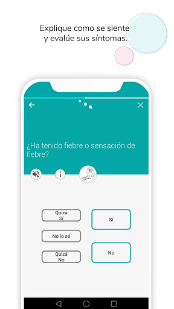
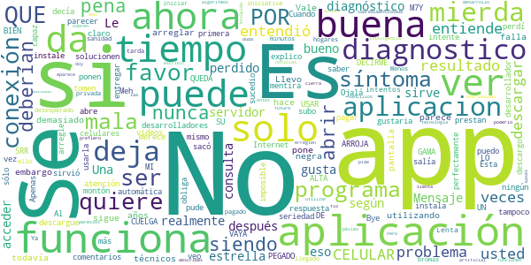

# Mediktor
App version ``5.7.9``

Analyzed with [covid-apps-observer](http://github.com/covid-apps-observer) project, version ``0.1``

## App overview
| | |
|-------------------------|-------------------------| 
| **Name**&nbsp;&nbsp;&nbsp;&nbsp;&nbsp;&nbsp;&nbsp;&nbsp;&nbsp;&nbsp;&nbsp;&nbsp;&nbsp;&nbsp;&nbsp;&nbsp;&nbsp;&nbsp;&nbsp;&nbsp;&nbsp;&nbsp;&nbsp;&nbsp;&nbsp;&nbsp;&nbsp;&nbsp;&nbsp;&nbsp;&nbsp;&nbsp;&nbsp;&nbsp;&nbsp;&nbsp;&nbsp;&nbsp;&nbsp;&nbsp;  | Mediktor |
| **Unique identifier** | com.teckelmedical.mediktor |
| **Link to Google Play** | [https://play.google.com/store/apps/details?id=com.teckelmedical.mediktor](https://play.google.com/store/apps/details?id=com.teckelmedical.mediktor) |
| **Summary**  | Resuelve tus dudas de salud |
| **Privacy policy** | [https://www.mediktor.com/en/legal-notice](https://www.mediktor.com/en/legal-notice) |
| **Latest version** | 5.7.9 |
| **Last update** | 2021-01-08 15:59:14 |
| **Recent changes** | Nuevo test de Coronavirus (COVID-19). Nuevo modo de interacción (Mediktor Original y Mediktor Chatbot). Corrección de errores y mejoras de rendimiento. |
| **Installs**  | 50.000+ |
| **Category** | Medicina |
| **First release** | 17 ene 2014 |
| **Size**  | 41M |
| **Supported Android version**  | 5.0 y versiones posteriores |

### Description
> Soluciona tus dudas de salud desde el primer síntoma.
 Evalúa tus síntomas GRATIS y comparte los resultados con un especialista para tomar la mejor decisión.
 Disponible el test de CORONAVIRUS que te indicará si tienes los síntomas de la enfermedad, la posibilidad de sufrirla y una recomendación basada en la urgencia del resultado.
 El evaluador de síntomas te permite introducir cómo te sientes con tus palabras. Su inteligencia artificial escoge las preguntas que haría un profesional para obtener una lista de posibles enfermedades y una recomendación.  
 Consulta la descripción de las enfermedades en nuestro diccionario.
 Puedes chatear con un médico en tiempo real y solucionar tus dudas en cualquier momento.
 La consulta es confidencial y totalmente segura. 
 Si te encuentras mal, un especialista te recomendará la mejor opción para tu problema de salud.
 Por favor, no dudes en enviarnos tus sugerencias o comentarios: info@mediktor.com
 Especificaciones:
 - Inteligencia artificial e interpretación de lenguaje natural.
 - Plataforma de Chat segura y a tiempo real entre médico y paciente.
 - Compatible con la App Salud de Apple para la integración de las constantes vitales.
 CE - Licencia 7074-PS
 Mediktor es un dispositivo médico con licencia sanitaria. Cumple con todos los requisitos esenciales y con los procedimientos de evaluación de la conformidad que le resultan de aplicación según la AEMPS y la normativa comunitaria.

### User interface
The developers of the app provide the following screenshots in the Google play store.
| | | |
|:-------------------------:|:-------------------------:|:-------------------------:|
 |   |   |   | 
 |   |  

## Development team
In the following we report the main information provided by the development team in the Google play store.

| | |
|-------------------------|-------------------------|
| **Developer**  | Teckel Medical s.l. |
| **Website**  | [https://www.mediktor.com](https://www.mediktor.com) |
| **Email** | info@mediktor.com |
| **Physical address**  | [Sant Antoni Maria Claret 167, 08025 Barcelona Barcelona Spain](https://www.google.com/maps/search/Sant%20Antoni%20Maria%20Claret%20167,%2008025%20Barcelona%20Barcelona%20Spain) (Google Maps) |
| **Other developed apps**  | [https://play.google.com/store/apps/developer?id=8208894107756492017](https://play.google.com/store/apps/developer?id=8208894107756492017) |

## Android support

| | |
|-------------------------|-------------------------|
| **Declared target Android version**  | Android10, version 10 (API level 29) |
| **Effective target Android version**  | Android10, version 10 (API level 29) |
| **Minimum supported Android version**  | Lollipop, version 5.0 (API level 21) |
| **Maximum target Android version**  | - |

The larger the difference between the minimum and maximum supported Android versions, the better. A larger difference means a wider audience. For example, old phones have a very low Android version, so a high minimum supported Android version means that the app cannot be used by users with old phones, thus leading to accessibility problems. 

## Requested permissions

In the following we report the complete list of the permissions requested by the app. 

| **Permission** | **Protection level** | **Description** | 
|-------------------------|-------------------------|-------------------------|
 **android.permission ACCESS_COARSE_LOCATION** | :warning:**Dangerous** | Allows an app to access approximate location. 
 **android.permission ACCESS_FINE_LOCATION** | :warning:**Dangerous** | Allows an app to access precise location. 
 **android.permission ACCESS_NETWORK_STATE** | Normal | Allows applications to access information about networks. 
 **android.permission ACCESS_WIFI_STATE** | Normal | Allows applications to access information about Wi-Fi networks. 
 **android.permission AUDIO** | - | - 
 **android.permission BLUETOOTH** | Normal | Allows applications to connect to paired bluetooth devices. 
 **android.permission BLUETOOTH_ADMIN** | Normal | Allows applications to discover and pair bluetooth devices. 
 **android.permission BODY_SENSORS** | :warning:**Dangerous** | Allows an application to access data from sensors that the user uses to measure what is happening inside his/her body, such as heart rate. 
 **android.permission CALL_PHONE** | :warning:**Dangerous** | Allows an application to initiate a phone call without going through the Dialer user interface for the user to confirm the call. 
 **android.permission CAMERA** | :warning:**Dangerous** | Required to be able to access the camera device. 
 **android.permission CHANGE_WIFI_STATE** | Normal | Allows applications to change Wi-Fi connectivity state. 
 **android.permission DISABLE_KEYGUARD** | Normal | Allows applications to disable the keyguard if it is not secure. 
 **android.permission GET_ACCOUNTS** | :warning:**Dangerous** | Allows access to the list of accounts in the Accounts Service. 
 **android.permission INTERNET** | Normal | Allows applications to open network sockets. 
 **android.permission MODIFY_AUDIO_SETTINGS** | Normal | Allows an application to modify global audio settings. 
 **android.permission READ_APP_BADGE** | - | - 
 **android.permission READ_EXTERNAL_STORAGE** | :warning:**Dangerous** | Allows an application to read from external storage. 
 **android.permission READ_PHONE_STATE** | :warning:**Dangerous** | Allows read only access to phone state, including the phone number of the device, current cellular network information, the status of any ongoing calls, and a list of any PhoneAccounts registered on the device. 
 **android.permission RECORD_AUDIO** | :warning:**Dangerous** | Allows an application to record audio. 
 **android.permission VIBRATE** | Normal | Allows access to the vibrator. 
 **android.permission WAKE_LOCK** | Normal | Allows using PowerManager WakeLocks to keep processor from sleeping or screen from dimming. 
 **android.permission WRITE_EXTERNAL_STORAGE** | :warning:**Dangerous** | Allows an application to write to external storage. 
 **com.anddoes.launcher.permission UPDATE_COUNT** | - | - 
 **com.android.vending BILLING** | - | - 
 **com.google.android.c2dm.permission RECEIVE** | - | - 
 **com.htc.launcher.permission READ_SETTINGS** | - | - 
 **com.htc.launcher.permission UPDATE_SHORTCUT** | - | - 
 **com.huawei.android.launcher.permission CHANGE_BADGE** | - | - 
 **com.huawei.android.launcher.permission READ_SETTINGS** | - | - 
 **com.huawei.android.launcher.permission WRITE_SETTINGS** | - | - 
 **com.majeur.launcher.permission UPDATE_BADGE** | - | - 
 **com.oppo.launcher.permission READ_SETTINGS** | - | - 
 **com.oppo.launcher.permission WRITE_SETTINGS** | - | - 
 **com.sec.android.provider.badge.permission READ** | - | - 
 **com.sec.android.provider.badge.permission WRITE** | - | - 
 **com.sonyericsson.home.permission BROADCAST_BADGE** | - | - 
 **com.sonymobile.home.permission PROVIDER_INSERT_BADGE** | - | - 
 **me.everything.badger.permission BADGE_COUNT_READ** | - | - 
 **me.everything.badger.permission BADGE_COUNT_WRITE** | - | - 

## Mentioned servers

| **Server** | **Registrant** | **Registrant country** | **Creation date** | 
|-------------------------|-------------------------|-------------------------|-------------------------|
 | facebook.com | Facebook, Inc. | :us: US | 1997-03-29 05:00:00 |
 | google.com | Google LLC | :us: US | 1997-09-15 04:00:00 |
 | f-droid.org | F-Droid Limited | GB | 2010-09-29 19:14:58 |
 | amazon.com | Amazon Technologies, Inc. | :us: US | 1994-11-01 05:00:00 |
 | github.com | GitHub, Inc. | :us: US | 2007-10-09 18:20:50 |
 | googlesyndication.com | Google LLC | :us: US | 2003-01-21 06:17:24 |
 | googleapis.com | Google LLC | :us: US | 2005-01-25 17:52:26 |
 | google-analytics.com | Google LLC | :us: US | 2005-07-18 19:24:32 |
 | googletagmanager.com | Google LLC | :us: US | 2011-11-11 23:39:05 |
 | ihealthlabs.com | REDACTED FOR PRIVACY | cn | 2011-10-13 07:43:43 |
 | twitter.com | Twitter, Inc. | :us: US | 2000-01-21 16:28:17 |
 | mopub.com | MoPub Inc. | :us: US | 2009-02-25 20:06:04 |
 | mediktor.com | REDACTED FOR PRIVACY | :es: ES | 2011-04-30 20:55:09 |
 | crashlytics.com | Google LLC | :us: US | 2011-01-21 15:30:40 |

## Security analysis 

Below we report the main security warnings raised by our execution of the [Androwarn](https://github.com/maaaaz/androwarn) security analysis tool.

**Telephony identifiers leakage**
> - This application reads the ISO country code equivalent for the SIM provider's country code 
> - This application reads the ISO country code equivalent of the current registered operator's MCC (Mobile Country Code) 
> - This application reads the MCC+MNC of the provider of the SIM 
> - This application reads the Service Provider Name (SPN) 
> - This application reads the constant indicating the state of the device SIM card 
> - This application reads the device phone type value 
> - This application reads the numeric name (MCC+MNC) of current registered operator 
> - This application reads the operator name 
> - This application reads the unique device ID, i.e the IMEI for GSM and the MEID or ESN for CDMA phones 

**Connection interfaces exfiltration**
> - This application reads details about the currently active data network 
> - This application tries to find out if the currently active data network is metered 

**Telephony services abuse**
> - This application makes phone calls 

**Suspicious connection establishment**
> - This application opens a Socket and connects it to the remote address '' on the 'N/A' port  
> - This application opens a Socket and connects it to the remote address 'Ljava/lang/StringBuilder;->toString()Ljava/lang/String;' on the 'N/A' port  
> - This application opens a Socket and connects it to the remote address 'Ljava/net/Proxy;->type()Ljava/net/Proxy$Type;' on the 'N/A' port  
> - This application opens a Socket and connects it to the remote address 'SSLSocketFactory was null. Unable to create socket.' on the 'N/A' port  
> - This application opens a Socket and connects it to the remote address 'timeout' on the 'N/A' port  

**Code execution**
> - This application loads a native library 
> - This application loads a native library: 'Ljava/lang/System;->load(Ljava/lang/String;)V' 
> - This application loads a native library: 'RSSupport' 
> - This application loads a native library: 'RSSupportIO' 
> - This application loads a native library: 'blasV8' 
> - This application loads a native library: 'gpuimage-library' 
> - This application loads a native library: 'iHealth' 
> - This application loads a native library: 'pl_droidsonroids_gif' 
> - This application executes a UNIX command containing this argument: '' 
> - This application executes a UNIX command containing this argument: 'Ljava/lang/StringBuilder;->toString()Ljava/lang/String;' 

## User ratings and reviews

Below we provide information about how end users are reacting to the app in terms of ratings and reviews in the Google Play store.

### Ratings

The Mediktor app has been installed by more than **50000** times. At this time, **1001** rated the app and its average score is **3.6237624**. Below we show the distribution of the ratings across the usual star-based rating of Google Play

:star::star::star::star::star:: 556

:star::star::star::star:: 69

:star::star::star:: 59

:star::star:: 79

:star:: 238

### Reviews 

#### 5-star reviews

> Buena opción para consultar nuestro estado salud ...  :date: __2020-10-12 22:25:51__

> Excelente, la recomiendo  :date: __2020-01-20 03:00:05__

> Muy buena, son los mismo diagnóstico que me dio el Dr cuando me vio. Los felicito.  :date: __2020-01-07 20:20:51__

> Antes de consultar a él doctor, use esta aplicación 2 veces y en las 2 veces acertó.  :date: __2019-12-19 01:37:43__

> Eficienciente  :date: __2019-11-08 20:13:40__

> Impecable  :date: __2019-08-29 20:03:53__

> No me deja especificar que no puedo andar y, cuando me pregunta si tengo dificultad para andar, me diagnostica un ictus...  :date: __2019-08-26 16:29:38__

> Aplicación muy interesante. Sirve para conocer las enfermedades más comunes. Recomendado al 100%  :date: __2019-03-09 22:29:10__

> buenísima app, el diagnóstico es regularmente acertado, muy buenas recomendaciones y muy buenas actuaciones.  :date: __2019-02-11 02:12:21__

> Muy buena app , genial para aclarar dudas  :date: __2018-11-07 22:02:14__

#### 4-star reviews

> Muy buena app para dar guías sobre salud y muy recomendable  :date: __2018-01-24 17:39:51__

> til  :date: __2016-11-12 23:01:11__

>   :date: __2016-09-21 10:33:58__

> Tenéis un problema de incompatibilidad con Android 5.0. En KitKat funciona perfecta.  :date: __2015-04-29 16:25:18__

> Solo 4 porque me dijo que tenía neumonía y solo tenía un poco de laringitis... jajajaja  :date: __2015-02-12 23:26:55__

> Muy útil para darse una idea de un posible diagnóstico.  Admirable el trabajo de los ingeniero q han desarrollado esta aplicación.  :date: __2015-02-06 23:33:13__

> Super bien solo que últimamente se traba -.-  :date: __2015-01-20 03:02:41__

> Buena  :date: __2014-11-16 06:20:38__

> Esta loka esta Aplicacion  :date: __2014-09-19 21:23:53__

> Me ha ayudado averiguar  verdaderamente lo que tengo y es mas ya no tengo que ir al medico a perder tiempo esta aplicación me ayudara bastante en mi salud buena App se los recomiendo  :date: __2014-09-04 08:10:52__

#### 3-star reviews

> Confusa  :date: __2020-11-23 07:51:11__

> Lenta  :date: __2017-05-05 02:35:49__

> Hay personas que no pueden pagar el precio de la consulta, entonces no estaría mal que den un par de consultas gratis.  :date: __2016-05-08 20:58:48__

> "Me duele el pie"= amputación inmediata jejeje. Naa! exagero jeje, pero la onda es esa =D  :date: __2015-02-20 07:44:02__

> Se bloquea de vez en cuando  :date: __2014-10-20 02:09:15__

> La app tiene una intención muy buena pero tiene muchos problemas  :date: __2014-10-04 02:20:25__

> Buena  :date: __2014-07-31 16:35:13__

> Se me hace q todos los que descargan esta app son hipocondriacos xD  :date: __2014-07-14 10:58:08__

> Se ve interesante  :date: __2014-05-16 15:04:03__

> No me convencio  :date: __2014-04-06 16:28:01__

#### 2-star reviews

> Soy médico. No conozco el algoritmo diagnóstico que hay detrás de la aplicación por lo que no opinaré sobre él. Pero la implementación es realmente mala. La mitad de las consultas que he hecho de prueba con diferentes cuadros clínicos no han sido capaces de arrojar un resultado final, ya que se cuelga y te devuelve a la pantalla principal. No admite multitarea y cuando te llaman o sales a otra aplicación en medio del proceso se borra todo. Sus resultados finales no son tampoco demasiado útiles, en el fondo es una forma un poco más elaborada de lograr que contactes con los médicos que tienen en cuadro (y pagues, claro). No la recomiendo.  :date: __2019-08-13 17:33:47__

> La app de verdad promete mucho, la apariencia es buena y el cuestionario es muy bueno, pero se detiene a cada rato, llevo usándola 10 minutos y se me ha detenido como 9 veces ya, y tengo que comenzar de nuevo a responder todo, no le pongo las 5 porque no está cumpliendo con lo que esta diseñada, arreglen eso y todo fino  :date: __2014-09-20 22:22:10__

> El app es bueno pero tiene que correjirse algunas funciones.  - Depasiadas preguntas. - No hace mixturas de diagnosticos Ejm. Dolor de cabeza seguido de vomitos y mareos picazón en el pie derecho. Solo analiza un diagnosticos y lo demas sintomas no lo toma en cuenta. - Cuando analiza el sintoma su respuesta es el diagnostico de la patologia te envia a google pero el problema es cuando hace clic con la dedo no se puede ver el contenido de la patologia por el google.  :date: __2014-05-19 08:35:06__

#### 1-star reviews

> Llevo utilizando esta aplicación desde hace 5 años y era muy buena, sigue siendo buena todavía pero deberían arreglar sus problemas técnicos, falla demasiado y se pone la pantalla negra. Vale la pena, sin embargo parece ser que sus desarrolladores no prestan atención a los comentarios y sólo ponen respuesta automática. Ojalá lo tomen con seriedad.  :date: __2020-04-24 17:06:06__

> No funciona .. Que mentira no abre nunca  :date: __2019-12-03 06:42:06__

> No se habré la app  :date: __2019-11-17 18:04:43__

> Es la primera vez que descargo la aplicación y no se quiere abrir , lo descargue en 3 celulares y sucedio lo mismo , me gustaria que solucionen el problema por favor.  :date: __2019-10-30 04:35:02__

> Nunca pude usarla, decía que no había conexión a Internet cuando perfectamente puedo ver videos y descargar otra app...  :date: __2019-10-23 06:47:43__

> Al parecer usted tampoco entendió, ya veo por qué no funciona el programa si usted siendo el desarrollador no entiende, es imposible que el programa sea capaz de entregar el resultado. Ahora se lo explico más claro a ver si entiende: SU PROGRAMA SE CUELGA, SE QUEDA PEGADO, NO ARROJA RESULTADO. POR FAVOR NO VAYA A DECIRME QUE PUEDE SRR MI CELULAR POR QUE ES UN CELULAR DE GAMA ALTA Y LO SE USAR M7Y BIEN. Entendió ahora? Cuando lo arregle le subo estrellas, por ahora tiene lo que se merece. Bye.  :date: __2019-10-08 16:44:15__

> Apenas que la instale no me sirvió se salía, y lo intente un montón de veces..  :date: __2019-09-11 00:39:52__

> Meh perdí mi tiempo  :date: __2019-08-22 18:16:38__

> Esta app no da buenos diagnosticos.  :date: __2019-07-22 20:49:35__

> No sacó ningún diagnóstico y te obliga a pagar si quieres saber más.  :date: __2019-04-05 20:30:33__

