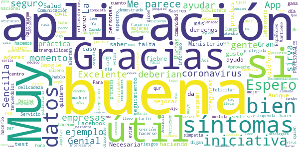
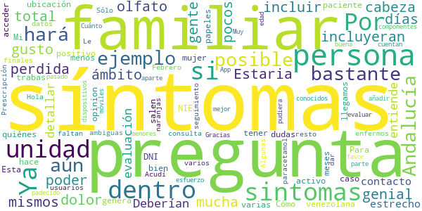
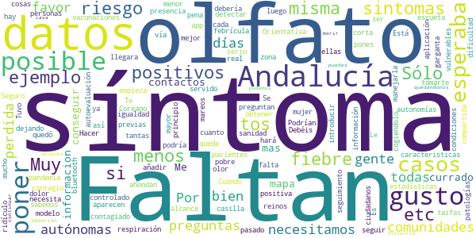
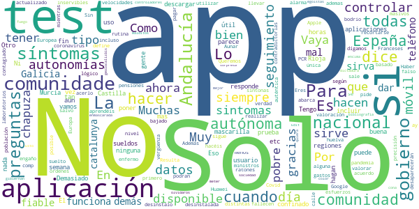

# Asistencia COVID-19
App version ``1.0.10``

Analyzed with [covid-apps-observer](http://github.com/covid-apps-observer) project, version ``0.1``

## App overview
| | |
|-------------------------|-------------------------| 
| **Name**&nbsp;&nbsp;&nbsp;&nbsp;&nbsp;&nbsp;&nbsp;&nbsp;&nbsp;&nbsp;&nbsp;&nbsp;&nbsp;&nbsp;&nbsp;&nbsp;&nbsp;&nbsp;&nbsp;&nbsp;&nbsp;&nbsp;&nbsp;&nbsp;&nbsp;&nbsp;&nbsp;&nbsp;&nbsp;&nbsp;&nbsp;&nbsp;&nbsp;&nbsp;&nbsp;&nbsp;&nbsp;&nbsp;&nbsp;&nbsp;  | Asistencia COVID-19 |
| **Unique identifier** | es.gob.asistenciacovid19 |
| **Link to Google Play** | [https://play.google.com/store/apps/details?id=es.gob.asistenciacovid19](https://play.google.com/store/apps/details?id=es.gob.asistenciacovid19) |
| **Summary**  | Aplicación para la auto-evaluación del COVID-19 y recomendaciones a seguir. |
| **Privacy policy** | [https://asistencia.covid19.gob.es/politica-de-privacidad](https://asistencia.covid19.gob.es/politica-de-privacidad) |
| **Latest version** | 1.0.10 |
| **Last update** | 2020-06-09 19:44:04 |
| **Recent changes** | - DNI/NIE opcional para las Islas Baleares - Se realizan correcciones y mejoras de rendimiento |
| **Installs**  | 10.000+ |
| **Category** | Salud y bienestar |
| **First release** | 5 abr. 2020 |
| **Size**  | 22M |
| **Supported Android version**  | 4.1 y versiones posteriores |

### Description
> Esta es una aplicación oficial del Gobierno de España en cooperación con las Comunidades Autónomas adheridas. Por favor, revisa la lista de Comunidades Adheridas en https://asistencia.covid19.gob.es/
  
 La aplicación Asistencia COVID-19 permite autoevaluarse sobre los posibles síntomas de la enfermedad infecciosa COVID-19 e informarse sobre las recomendaciones a seguir.
 La aplicación móvil Asistencia COVID-19 tiene como misión ayudar a la autoevaluación de los ciudadanos de la probabilidad de sufrir la enfermedad infecciosa COVID-19, con el objetivo de reducir el volumen de llamadas al número de emergencias sanitarias, informar a la población, permitir un triaje inicial de posibles casos y un seguimiento posterior por parte de las Autoridades Sanitarias.
  
 La utilización de la Aplicación no constituye un servicio de diagnóstico médico, de atención de urgencias o de prescripción de tratamientos farmacológicos. La utilización de la Aplicación no puede en ningún caso sustituir la consulta presencial personal frente a un profesional médico debidamente cualificado.

### User interface
The developers of the app provide the following screenshots in the Google play store.
| | | |
|:-------------------------:|:-------------------------:|:-------------------------:|
 |   |   |   | 
 |   |   |   | 
 |   |   |   | 
 |  

## Development team
In the following we report the main information provided by the development team in the Google play store.

| | |
|-------------------------|-------------------------|
| **Developer**  | Ministerio de Asuntos Económicos y Transf. Digital |
| **Website**  | [https://asistencia.covid19.gob.es](https://asistencia.covid19.gob.es) |
| **Email** | contacto@covid19.gob.es |
| **Physical address**  | - |
| **Other developed apps**  | [https://play.google.com/store/apps/developer?id=Ministerio+de+Asuntos+Econ%C3%B3micos+y+Transf.+Digital](https://play.google.com/store/apps/developer?id=Ministerio+de+Asuntos+Econ%C3%B3micos+y+Transf.+Digital) |

## Android support

| | |
|-------------------------|-------------------------|
| **Declared target Android version**  | Pie, version 9 (API level 28) |
| **Effective target Android version**  | Pie, version 9 (API level 28) |
| **Minimum supported Android version**  | Jelly Bean, version 4.1.x (API level 16) |
| **Maximum target Android version**  | - |

The larger the difference between the minimum and maximum supported Android versions, the better. A larger difference means a wider audience. For example, old phones have a very low Android version, so a high minimum supported Android version means that the app cannot be used by users with old phones, thus leading to accessibility problems. 

## Requested permissions

In the following we report the complete list of the permissions requested by the app. 

| **Permission** | **Protection level** | **Description** | 
|-------------------------|-------------------------|-------------------------|
 **android.permission ACCESS_COARSE_LOCATION** | :warning:**Dangerous** | Allows an app to access approximate location. 
 **android.permission ACCESS_FINE_LOCATION** | :warning:**Dangerous** | Allows an app to access precise location. 
 **android.permission ACCESS_NETWORK_STATE** | Normal | Allows applications to access information about networks. 
 **android.permission ACCESS_WIFI_STATE** | Normal | Allows applications to access information about Wi-Fi networks. 
 **android.permission INTERNET** | Normal | Allows applications to open network sockets. 
 **com.google.android.c2dm.permission RECEIVE** | - | - 
 **com.google.android.finsky.permission BIND_GET_INSTALL_REFERRER_SERVICE** | - | - 

## Mentioned servers

| **Server** | **Registrant** | **Registrant country** | **Creation date** | 
|-------------------------|-------------------------|-------------------------|-------------------------|
 | android.com | Google LLC | :us: US | 1997-06-23 04:00:00 |
 | googlesyndication.com | Google LLC | :us: US | 2003-01-21 06:17:24 |
 | google.com | Google LLC | :us: US | 1997-09-15 04:00:00 |
 | app-measurement.com | Google LLC | :us: US | 2015-06-19 20:13:31 |
 | facebook.com | Facebook, Inc. | :us: US | 1997-03-29 05:00:00 |
 | pinterest.com | DNStination Inc. | :us: US | 2009-11-26 19:21:23 |
 | twitter.com | Twitter, Inc. | :us: US | 2000-01-21 16:28:17 |
 | googleapis.com | Google LLC | :us: US | 2005-01-25 17:52:26 |
 | googleadservices.com | Google LLC | :us: US | 2003-06-19 16:34:53 |
 | crashlytics.com | Google LLC | :us: US | 2011-01-21 15:30:40 |

## Security analysis 

Below we report the main security warnings raised by our execution of the [Androwarn](https://github.com/maaaaz/androwarn) security analysis tool.

**Telephony identifiers leakage**
> - This application reads the numeric name (MCC+MNC) of current registered operator 
> - This application reads the operator name 
> - This application reads the phone number string for line 1, for example, the MSISDN for a GSM phone 

**Location lookup**
> - This application reads location information from all available providers (WiFi, GPS etc.) 

**Connection interfaces exfiltration**
> - This application reads details about the currently active data network 
> - This application tries to find out if the currently active data network is metered 

**Suspicious connection establishment**
> - This application opens a Socket and connects it to the remote address '' on the 'N/A' port  
> - This application opens a Socket and connects it to the remote address 'Ljava/lang/StringBuilder;->toString()Ljava/lang/String;' on the ': connect, resolve' port  
> - This application opens a Socket and connects it to the remote address 'Ljava/lang/StringBuilder;->toString()Ljava/lang/String;' on the 'N/A' port  
> - This application opens a Socket and connects it to the remote address 'Ljava/net/Proxy;->type()Ljava/net/Proxy$Type;' on the 'N/A' port  
> - This application opens a Socket and connects it to the remote address 'timeout' on the 'N/A' port  

**Pim data leakage**
> - This application accesses the downloads folder 
> - This application accesses data stored in the clipboard 

**Code execution**
> - This application loads a native library 
> - This application loads a native library: 'Ljava/util/Iterator;->next()Ljava/lang/Object;' 
> - This application loads a native library: 'crashlytics' 
> - This application executes a UNIX command containing this argument: '2' 

## User ratings and reviews

Below we provide information about how end users are reacting to the app in terms of ratings and reviews in the Google Play store.

### Ratings

The Asistencia COVID-19 app has been installed by more than **10000** times. At this time, **285** rated the app and its average score is **3.21**. Below we show the distribution of the ratings across the usual star-based rating of Google Play

:star::star::star::star::star:: 122

:star::star::star::star:: 28

:star::star::star:: 19

:star::star:: 14

:star:: 99

### Reviews 

#### 5-star reviews

> Aplicación estupenda para vivir con la tranquilidad de sentirse protegida. Aprovecho para felicitar al Servicio Canario de Salud, a la sección de Rastreo y Comunicación, en biblioteca nacional. Las mujeres encargadas de hacer las pruebas del COVID han demostrado, además de ser EXCELENTES PROFESIONALES, tener mucho tacto,. delicadeza además de simpatía. Así da gusto hacerse las pruebas. Me alegraron el día. Muchas gracias.  :date: __2020-06-15 09:35:08__

> Me parece bien qur nos alerten cpn esta app Para eviar riesgos  :date: __2020-05-20 00:35:27__

> Ya era hora que hiciesen esta medida felicidades haber si la hacemos todos los Españoles yo en mi centro de salud no quisieron hacerme PCR teniendolos en el laboratorio hablo del dia 14 de mayo .no les da la gana de hacerlo y luego dicen en la comunidad de madrid que lo estan haciendo .digan a quien.  :date: __2020-05-18 16:16:28__

> Rastrearme cuanto más mejor, más seguro estaré yo y a los que quiero.  :date: __2020-05-10 07:22:28__

> Muy Buena App  :date: __2020-05-08 23:22:03__

> Excelente  :date: __2020-04-29 14:55:42__

> Me parece muy buena. Aunque deberían ampliar el espectro de preguntas, como por ejemplo procesos inflamatorios.  :date: __2020-04-28 08:13:08__

> Mantiene informado puntualmente  :date: __2020-04-23 23:20:01__

> Interesante de momento falta Andalucía  :date: __2020-04-23 17:29:28__

> Recomendaciones oficiales en relación con el coronavirus.  :date: __2020-04-19 00:07:41__

#### 4-star reviews

> Estaria genial si incluyeran sintomas como perdida total de olfato y gusto y dolor de cabeza y poder incluir a personas dentro del ámbito familiar. Ya que hay mucha gente que hemos tenido sintomas y a los pocos días han tenido los mismos síntomas personas dentro de la unidad familiar.  :date: __2020-04-28 12:05:28__

> Deberían detallar algo más algunas preguntas de la evaluación. Por ejemplo que se entiende por contacto estrecho con un paciente positivo. Ya que en mi opinion genera bastantes dudas.  :date: __2020-04-27 21:37:59__

> Cómo se hará con quiénes aún no tienen NIE o DNI? Ejemplo mi mujer es venezolana llegamos hace 5 meses pero aún no salen sus papeles, en ese caso como se hará?  :date: __2020-04-24 00:08:24__

> Mi pregunta es tienes que tener la ubicación activo o algo ?  :date: __2020-04-13 09:01:46__

> Esta bastante bien pero con varias trabas para acceder.  :date: __2020-04-11 21:51:42__

> Para cuando en Andalucía??  :date: __2020-04-09 19:24:15__

> Preguntas, menos ambiguas. Algunas usuarios, estuvimos enfermos a finales de Febrero. Acudí a consulta, con varios síntomas. Prescripción de paracetamol y naranjas.  :date: __2020-04-09 12:30:29__

> Le faltan preguntas sobre otros posibles síntomas  :date: __2020-04-09 10:09:22__

> Hola. ¿Sólo es posible el seguimiento de una persona?. Y para dar los datos del resto de componentes de la unidad familiar menores de edad y que no cuentan con dispositivos móviles?. Gracias por el esfuerzo.  :date: __2020-04-08 18:29:03__

> Por favor ¡Cuánto antes en Andalucía!  :date: __2020-04-08 09:26:01__

#### 3-star reviews

> Me esperaba algo más currado (posibles contactos con casos positivos, un mapa, etc)  :date: __2020-05-28 23:32:43__

> Esperaba con ella conseguir mas datos e informacion como en otras de mismas caracteristicas, por ejemplo si en tu zona es mayor o menor el riesgo de contagio por presencia en ella de positivos.  :date: __2020-04-28 10:48:13__

> Cuando llegara a Andalucía???  :date: __2020-04-22 22:47:56__

> Sólo si pones que tienes fiebre, tos o dificultad de respiración empieza a tomarte en serio como posible contagiado, dejando otros sintomas que aparecen en estadísticas.  :date: __2020-04-20 00:01:35__

> Faltan autonomías y síntomas q habría q añadir, esto es ridículo q haya 17 reinos de taifas en sanidad cuanto menos los datos de los pacientes debería estar compartida y tantas otras cosas como las vacunaciones...etc  :date: __2020-04-13 02:04:34__

> Se queda un poco corta la app. Podrían poner una casilla donde cada uno podría introducir otros síntomas como dolor en la garganta o falta de olfato.  :date: __2020-04-12 16:22:18__

> Orientativa  :date: __2020-04-09 10:40:28__

> Muy escueta y la autoevaluación es la misma sean personas vulnerables o de menos riesgo. Te preguntan patologías previas y luego no ahondan en ellas. Muy pobre  :date: __2020-04-08 17:27:47__

> Le faltan preguntas ,hay gente que sólo tiene febrícula ,y faltan algunos síntomas que está teniendo gente positiva como lo del olfato,mareos ...  :date: __2020-04-08 13:30:38__

> Está bien, pero el modelo a seguir tendría que ser el Coreano vía bluetooth.  :date: __2020-04-07 08:13:05__

#### 2-star reviews

> Se entiende era libre de pagar y eso no és asį  :date: __2020-05-05 16:51:12__

> La veo muy encorsetada y poco actualizada a los síntomas...  :date: __2020-04-13 23:54:33__

#### 1-star reviews

> Eres una auténtica vergüenza que no haya una única app para controlar está pandemia a nivel nacional e incluso Europea. Lo lógico es utilizar la rutina de seguimiento de Google Apple y Huawei, lo demás sin chapuzas inservibles que desaparecerán en día días. Aunar esfuerzos y que Europa sirva para algo  :date: __2020-06-11 02:33:41__

> Galicia cuando???  :date: __2020-06-04 01:15:35__

> Sin test poco fiable, dar datos y valorar síntomas.  :date: __2020-06-02 08:04:16__

> Lo primero que te pide la aplicación es el teléfono móvil. Muy mal.  :date: __2020-05-30 23:20:04__

> No está disponible en catalunya  :date: __2020-05-30 22:06:01__

> Haber si aprendéis de los Franceses y hacéis una aplicación que de verdad sirva para algo  :date: __2020-05-28 09:05:18__

> Para descargar en huelva España no sale comp ay que acerlo  :date: __2020-05-24 14:29:24__

> App no responde, desinstalo  :date: __2020-05-15 12:45:58__

> No funciona en Andalucía, desinstalada.  :date: __2020-05-07 20:33:00__

> Queremos tests masivos para todos y no este bodrio de App  :date: __2020-05-06 19:48:02__

