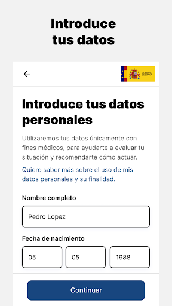
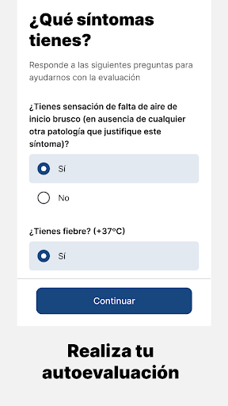
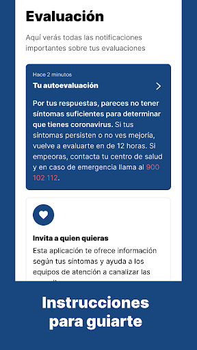
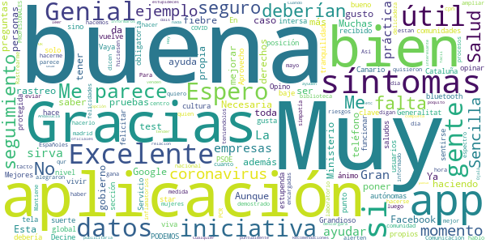
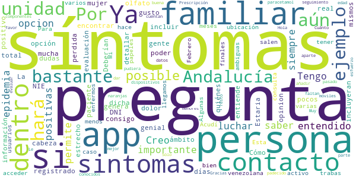
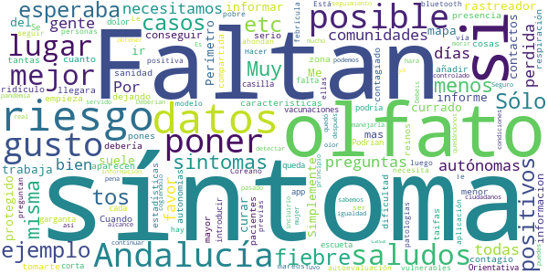
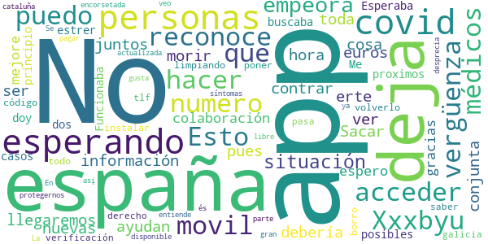
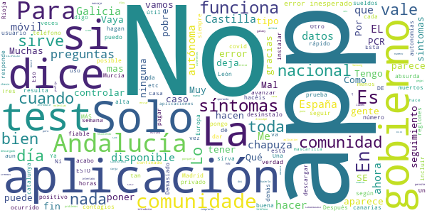

# Asistencia COVID-19
App version ``1.0.12``

Analyzed with [covid-apps-observer](http://github.com/covid-apps-observer) project, version ``0.1``

## App overview
| | |
|-------------------------|-------------------------| 
| **Name**&nbsp;&nbsp;&nbsp;&nbsp;&nbsp;&nbsp;&nbsp;&nbsp;&nbsp;&nbsp;&nbsp;&nbsp;&nbsp;&nbsp;&nbsp;&nbsp;&nbsp;&nbsp;&nbsp;&nbsp;&nbsp;&nbsp;&nbsp;&nbsp;&nbsp;&nbsp;&nbsp;&nbsp;&nbsp;&nbsp;&nbsp;&nbsp;&nbsp;&nbsp;&nbsp;&nbsp;&nbsp;&nbsp;&nbsp;&nbsp;  | Asistencia COVID-19 |
| **Unique identifier** | es.gob.asistenciacovid19 |
| **Link to Google Play** | [https://play.google.com/store/apps/details?id=es.gob.asistenciacovid19](https://play.google.com/store/apps/details?id=es.gob.asistenciacovid19) |
| **Summary**  | Aplicación para la auto-evaluación del COVID-19 y recomendaciones a seguir. |
| **Privacy policy** | [https://asistencia.covid19.gob.es/politica-de-privacidad](https://asistencia.covid19.gob.es/politica-de-privacidad) |
| **Latest version** | 1.0.12 |
| **Last update** | 2020-07-24 13:22:52 |
| **Recent changes** | - Mejoras en la accesibilidad - Correcciones y mejoras de rendimiento |
| **Installs**  | 50.000+ |
| **Category** | Salud y bienestar |
| **First release** | 5 abr. 2020 |
| **Size**  | 22M |
| **Supported Android version**  | 4.1 y versiones posteriores |

### Description
> Esta es una aplicación oficial del Gobierno de España en cooperación con las Comunidades Autónomas adheridas. Por favor, revisa la lista de Comunidades Adheridas en https://asistencia.covid19.gob.es/
  
 La aplicación Asistencia COVID-19 permite autoevaluarse sobre los posibles síntomas de la enfermedad infecciosa COVID-19 e informarse sobre las recomendaciones a seguir.
 La aplicación móvil Asistencia COVID-19 tiene como misión ayudar a la autoevaluación de los ciudadanos de la probabilidad de sufrir la enfermedad infecciosa COVID-19, con el objetivo de reducir el volumen de llamadas al número de emergencias sanitarias, informar a la población, permitir un triaje inicial de posibles casos y un seguimiento posterior por parte de las Autoridades Sanitarias.
  
 La utilización de la Aplicación no constituye un servicio de diagnóstico médico, de atención de urgencias o de prescripción de tratamientos farmacológicos. La utilización de la Aplicación no puede en ningún caso sustituir la consulta presencial personal frente a un profesional médico debidamente cualificado.

### User interface
The developers of the app provide the following screenshots in the Google play store.
| | | |
|:-------------------------:|:-------------------------:|:-------------------------:|
 |   |   |   | 
 |   |   |   | 
 |   |   |   | 
 |  

## Development team
In the following we report the main information provided by the development team in the Google play store.

| | |
|-------------------------|-------------------------|
| **Developer**  | Ministerio de Asuntos Económicos y Transf. Digital |
| **Website**  | [https://asistencia.covid19.gob.es](https://asistencia.covid19.gob.es) |
| **Email** | contacto@covid19.gob.es |
| **Physical address**  | - |
| **Other developed apps**  | [https://play.google.com/store/apps/developer?id=Ministerio+de+Asuntos+Econ%C3%B3micos+y+Transf.+Digital](https://play.google.com/store/apps/developer?id=Ministerio+de+Asuntos+Econ%C3%B3micos+y+Transf.+Digital) |

## Android support

| | |
|-------------------------|-------------------------|
| **Declared target Android version**  | Pie, version 9 (API level 28) |
| **Effective target Android version**  | Pie, version 9 (API level 28) |
| **Minimum supported Android version**  | Jelly Bean, version 4.1.x (API level 16) |
| **Maximum target Android version**  | - |

The larger the difference between the minimum and maximum supported Android versions, the better. A larger difference means a wider audience. For example, old phones have a very low Android version, so a high minimum supported Android version means that the app cannot be used by users with old phones, thus leading to accessibility problems. 

## Requested permissions

In the following we report the complete list of the permissions requested by the app. 

| **Permission** | **Protection level** | **Description** | 
|-------------------------|-------------------------|-------------------------|
 **android.permission ACCESS_COARSE_LOCATION** | :warning:**Dangerous** | Allows an app to access approximate location. 
 **android.permission ACCESS_FINE_LOCATION** | :warning:**Dangerous** | Allows an app to access precise location. 
 **android.permission ACCESS_NETWORK_STATE** | Normal | Allows applications to access information about networks. 
 **android.permission ACCESS_WIFI_STATE** | Normal | Allows applications to access information about Wi-Fi networks. 
 **android.permission INTERNET** | Normal | Allows applications to open network sockets. 
 **com.google.android.c2dm.permission RECEIVE** | - | - 
 **com.google.android.finsky.permission BIND_GET_INSTALL_REFERRER_SERVICE** | - | - 

## Mentioned servers

| **Server** | **Registrant** | **Registrant country** | **Creation date** | 
|-------------------------|-------------------------|-------------------------|-------------------------|
 | android.com | Google LLC | :us: US | 1997-06-23 04:00:00 |
 | googlesyndication.com | Google LLC | :us: US | 2003-01-21 06:17:24 |
 | google.com | Google LLC | :us: US | 1997-09-15 04:00:00 |
 | app-measurement.com | Google LLC | :us: US | 2015-06-19 20:13:31 |
 | facebook.com | Facebook, Inc. | :us: US | 1997-03-29 05:00:00 |
 | pinterest.com | DNStination Inc. | :us: US | 2009-11-26 19:21:23 |
 | twitter.com | Twitter, Inc. | :us: US | 2000-01-21 16:28:17 |
 | googleapis.com | Google LLC | :us: US | 2005-01-25 17:52:26 |
 | googleadservices.com | Google LLC | :us: US | 2003-06-19 16:34:53 |
 | crashlytics.com | Google LLC | :us: US | 2011-01-21 15:30:40 |

## Security analysis 

Below we report the main security warnings raised by our execution of the [Androwarn](https://github.com/maaaaz/androwarn) security analysis tool.

**Telephony identifiers leakage**
> - This application reads the numeric name (MCC+MNC) of current registered operator 
> - This application reads the operator name 
> - This application reads the phone number string for line 1, for example, the MSISDN for a GSM phone 

**Location lookup**
> - This application reads location information from all available providers (WiFi, GPS etc.) 

**Connection interfaces exfiltration**
> - This application reads details about the currently active data network 
> - This application tries to find out if the currently active data network is metered 

**Suspicious connection establishment**
> - This application opens a Socket and connects it to the remote address '' on the 'N/A' port  
> - This application opens a Socket and connects it to the remote address 'Ljava/lang/StringBuilder;->toString()Ljava/lang/String;' on the ': connect, resolve' port  
> - This application opens a Socket and connects it to the remote address 'Ljava/lang/StringBuilder;->toString()Ljava/lang/String;' on the 'N/A' port  
> - This application opens a Socket and connects it to the remote address 'Ljava/net/Proxy;->type()Ljava/net/Proxy$Type;' on the 'N/A' port  
> - This application opens a Socket and connects it to the remote address 'timeout' on the 'N/A' port  

**Pim data leakage**
> - This application accesses the downloads folder 
> - This application accesses data stored in the clipboard 

**Code execution**
> - This application loads a native library 
> - This application loads a native library: 'Ljava/util/Iterator;->next()Ljava/lang/Object;' 
> - This application loads a native library: 'crashlytics' 
> - This application executes a UNIX command containing this argument: '2' 

## User ratings and reviews

Below we provide information about how end users are reacting to the app in terms of ratings and reviews in the Google Play store.

### Ratings

The Asistencia COVID-19 app has been installed by more than **50000** times. At this time, **310** rated the app and its average score is **3.04**. Below we show the distribution of the ratings across the usual star-based rating of Google Play

:star::star::star::star::star:: 114

:star::star::star::star:: 37

:star::star::star:: 21

:star::star:: 18

:star:: 117

### Reviews 

#### 5-star reviews

> Genial gracias  :date: __2020-09-06 15:59:33__

> Muy Bien  :date: __2020-08-31 10:19:26__

> Me gusta  :date: __2020-08-28 01:13:31__

> Excelente  :date: __2020-08-26 10:07:35__

> 5-star para opinar 9⁰ posición de app, ¿obligatoria? y no tiene todas las comunidades autónomas. saludos suerte cultura y gracias  :date: __2020-08-25 15:41:11__

> Opino como otros usuarios, debería ser una app que fuera a nivel más global. En Cataluña la app propia de la Generalitat no hace rastreo por bluetooth sino un seguimiento de tus propios síntomas y punto. Vaya tela!  :date: __2020-08-25 09:45:20__

> muy buenas todo lo que sea bueno para todos  :date: __2020-08-24 18:32:36__

> Esta muy bien  :date: __2020-08-23 22:49:53__

> Mejores Salud  :date: __2020-08-20 14:17:21__

> Grandioso  :date: __2020-08-20 00:35:06__

#### 4-star reviews

> Creo que es una opcion importante para luchar contra esta epidemia  :date: __2020-08-29 18:40:13__

> Tengo entendido que esta app te permite saber si has estado en contacto con personas positivas, siempre que esté registrado en la app pero no consigo encontrar dicha opción. La información que tenía no es real?  :date: __2020-08-25 20:20:50__

> Estaria genial si incluyeran sintomas como perdida total de olfato y gusto y dolor de cabeza y poder incluir a personas dentro del ámbito familiar. Ya que hay mucha gente que hemos tenido sintomas y a los pocos días han tenido los mismos síntomas personas dentro de la unidad familiar.  :date: __2020-04-28 12:05:28__

> Deberían detallar algo más algunas preguntas de la evaluación. Por ejemplo que se entiende por contacto estrecho con un paciente positivo. Ya que en mi opinion genera bastantes dudas.  :date: __2020-04-27 21:37:59__

> Cómo se hará con quiénes aún no tienen NIE o DNI? Ejemplo mi mujer es venezolana llegamos hace 5 meses pero aún no salen sus papeles, en ese caso como se hará?  :date: __2020-04-24 00:08:24__

> Mi pregunta es tienes que tener la ubicación activo o algo ?  :date: __2020-04-13 09:01:46__

> Esta bastante bien pero con varias trabas para acceder.  :date: __2020-04-11 21:51:42__

> Para cuando en Andalucía??  :date: __2020-04-09 19:24:15__

> Preguntas, menos ambiguas. Algunas usuarios, estuvimos enfermos a finales de Febrero. Acudí a consulta, con varios síntomas. Prescripción de paracetamol y naranjas.  :date: __2020-04-09 12:30:29__

> Le faltan preguntas sobre otros posibles síntomas  :date: __2020-04-09 10:09:22__

#### 3-star reviews

> Voy a tener que desinstalarla porque mi comunidad no está comunicada con ésta, lo lógico es que estuvieran todas conectadas, COMUNIDAD VALENCIANA  :date: __2020-09-01 21:09:54__

> Bueno tienes  :date: __2020-08-30 21:49:13__

> Aparte de los descritos hay síntomas como erupciones cutáneas que no aparecen en la encuesta  :date: __2020-08-30 04:31:24__

> Le doy 3 estrellas ✨ porque no me deja probarla, y me dice que hay un error.  :date: __2020-08-21 22:46:18__

> Como hago para saber de posibles asintomáticos o contagiados, tenía entendido que esta aplicación aparte de evaluarme también me advertía de posibles contagiados  :date: __2020-08-10 18:08:55__

> BIEN ,O NORMAL,intento introducir código que me enviaron y la aplicación me envía a la siguiente página,intento terminar y no puedo, INTENTO AYUDAR AL FILTRADO,de persona descargando sta apli y na de na,ALA POSS AY LO DEJO saludos desde aguimes cruce arinaga , BUEN DIA A TOITOS !!!! NADA lo he vuelto a intentar y nada.intento introducir el código después de tres minutos, y me lleva al siguiente página IMPOSIBLE... Q PUEDO HACER ,programador ??? ANIMO a seguir mejorándolo por FAVOR ! ! !  :date: __2020-08-10 09:24:49__

> Queremos q sea la app para toda España, no entiendo xq no funciona en algunas comunidades  :date: __2020-08-08 15:39:31__

> Simplemente es para informar si uno tiene los síntomas ,no es un rastreador que te informe del. Perímetro de riesgo en tu lugar donde trabaja o lugar donde suele ir saludos y protegido serás mejor que curar saludos  :date: __2020-08-01 09:57:36__

> Me esperaba algo más currado (posibles contactos con casos positivos, un mapa, etc)  :date: __2020-05-28 23:32:43__

> Esperaba con ella conseguir mas datos e informacion como en otras de mismas caracteristicas, por ejemplo si en tu zona es mayor o menor el riesgo de contagio por presencia en ella de positivos.  :date: __2020-04-28 10:48:13__

#### 2-star reviews

> No funciona en casi ninguna comunidad autónoma. En Madrid NO FUNCIONA  :date: __2020-08-25 14:27:01__

> Xxxbyu  :date: __2020-08-22 13:50:46__

> No me reconoce mi numero movil y no me deja acceder a la app, ¿que puedo hacer?  :date: __2020-08-11 21:19:08__

> Esto es una vergüenza, no hay médicos y esperando esperando se empeora la situación y llegaremos a morir por otra cosa que no tiene que ver nada con el covid...y estas app no ayudan a nada pues debería de ser en españa todos juntos .....información conjunta a toda españa. Sacar las personas en erte y no contrar a nuevas personas por 4 euros la hora... colaboración entre todos .gracias por la app poco a poco espero que mejore.  :date: __2020-08-10 10:31:20__

> Esperaba que me de posibles casos proximos de Covid-19. No es lo que yo buscaba  :date: __2020-08-07 22:58:03__

> Me doy dos estrer al principio Funcionaba lo limpiando el tlf de borro todo, al volverlo instalar no me deja poner código de verificación  :date: __2020-08-06 13:56:40__

> que pasa con galicia,no tenemos derecho a saber y protegernos?ya no me gusta se desprecia gran parte de España  :date: __2020-07-20 21:15:06__

> En cataluña porque no esta disponible  :date: __2020-07-01 20:37:46__

> Se entiende era libre de pagar y eso no és asį  :date: __2020-05-05 16:51:12__

> La veo muy encorsetada y poco actualizada a los síntomas...  :date: __2020-04-13 23:54:33__

#### 1-star reviews

> En la aplicación pone que no está activa en Andalucía,pero según el SAS si lo está¿a quien creemos?  :date: __2020-09-01 12:26:05__

> No funciona  :date: __2020-08-27 21:32:43__

> No me carga  :date: __2020-08-26 09:48:09__

> Es una porquería...no la recomiendo.  :date: __2020-08-25 01:01:36__

> Lo acabo de instalar y no me funciona. Tengo un Samsung galaxy J3 y no puedo comprarme otro nuevo. Un chasco  :date: __2020-08-21 21:08:41__

> No funciona  :date: __2020-08-19 23:33:40__

> La app no funciona. En cuanto pongo el número de móvil, aparece un mensaje que dice "error inesperado" y no deja avanzar.  :date: __2020-08-19 18:55:08__

> Basura de aplicación da error como todo lo que hacéis.... Mal  :date: __2020-08-19 03:51:51__

> Tres veces lo e intentado y las tres veces dice q a ocurrido un error inesperado en dos días diferentes,stoy sperando q m llamen para una pcr. No m estraña q tengamos la tasa mas alta d contagios,haces todo lo posible x hacerlo bien y todo son pegas y problemas.  :date: __2020-08-18 22:13:45__

> No permite entrar en canarias introduzco mi numero de movil con el prefijo +34 y me aparece error  :date: __2020-08-18 12:19:17__

