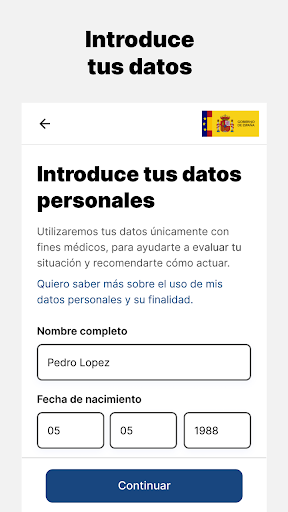
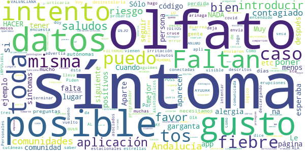
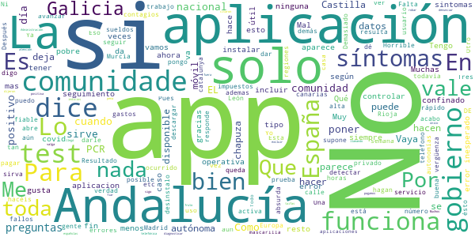

# Asistencia COVID-19
App version ``1.3.1``

Analyzed with [covid-apps-observer](http://github.com/covid-apps-observer) project, version ``0.1``

## App overview
| | |
|-------------------------|-------------------------| 
| **Name**&nbsp;&nbsp;&nbsp;&nbsp;&nbsp;&nbsp;&nbsp;&nbsp;&nbsp;&nbsp;&nbsp;&nbsp;&nbsp;&nbsp;&nbsp;&nbsp;&nbsp;&nbsp;&nbsp;&nbsp;&nbsp;&nbsp;&nbsp;&nbsp;&nbsp;&nbsp;&nbsp;&nbsp;&nbsp;&nbsp;&nbsp;&nbsp;&nbsp;&nbsp;&nbsp;&nbsp;&nbsp;&nbsp;&nbsp;&nbsp;  | Asistencia COVID-19 |
| **Unique identifier** | es.gob.asistenciacovid19 |
| **Link to Google Play** | [https://play.google.com/store/apps/details?id=es.gob.asistenciacovid19](https://play.google.com/store/apps/details?id=es.gob.asistenciacovid19) |
| **Summary**  | Aplicación para la auto-evaluación del COVID-19 y recomendaciones a seguir. |
| **Privacy policy** | [https://asistencia.covid19.gob.es/politica-de-privacidad](https://asistencia.covid19.gob.es/politica-de-privacidad) |
| **Latest version** | 1.3.1 |
| **Last update** | 2020-10-07 10:32:47 |
| **Recent changes** | Mejoras de rendimiento y corrección de bugs |
| **Installs**  | 100.000+ |
| **Category** | Salud y bienestar |
| **First release** | 5 abr. 2020 |
| **Size**  | 5,4M |
| **Supported Android version**  | 6.0 y versiones posteriores |

### Description
> Esta es una aplicación oficial del Gobierno de España en cooperación con las Comunidades Autónomas adheridas. Por favor, revisa la lista de Comunidades Adheridas en https://asistencia.covid19.gob.es/
  
 La aplicación Asistencia COVID-19 permite autoevaluarse sobre los posibles síntomas de la enfermedad infecciosa COVID-19 e informarse sobre las recomendaciones a seguir.
 La aplicación móvil Asistencia COVID-19 tiene como misión ayudar a la autoevaluación de los ciudadanos de la probabilidad de sufrir la enfermedad infecciosa COVID-19, con el objetivo de reducir el volumen de llamadas al número de emergencias sanitarias, informar a la población, permitir un triaje inicial de posibles casos y un seguimiento posterior por parte de las Autoridades Sanitarias.
  
 La utilización de la Aplicación no constituye un servicio de diagnóstico médico, de atención de urgencias o de prescripción de tratamientos farmacológicos. La utilización de la Aplicación no puede en ningún caso sustituir la consulta presencial personal frente a un profesional médico debidamente cualificado.

### User interface
The developers of the app provide the following screenshots in the Google play store.
| | | |
|:-------------------------:|:-------------------------:|:-------------------------:|
 |   |   |   | 
 |   |   |   | 
 |   |   |   | 
 |  

## Development team
In the following we report the main information provided by the development team in the Google play store.

| | |
|-------------------------|-------------------------|
| **Developer**  | Ministerio de Asuntos Económicos y Transf. Digital |
| **Website**  | [https://asistencia.covid19.gob.es](https://asistencia.covid19.gob.es) |
| **Email** | contacto@covid19.gob.es |
| **Physical address**  | - |
| **Other developed apps**  | [https://play.google.com/store/apps/developer?id=Ministerio+de+Asuntos+Econ%C3%B3micos+y+Transf.+Digital](https://play.google.com/store/apps/developer?id=Ministerio+de+Asuntos+Econ%C3%B3micos+y+Transf.+Digital) |

## Android support

| | |
|-------------------------|-------------------------|
| **Declared target Android version**  | Android10, version 10 (API level 29) |
| **Effective target Android version**  | Android10, version 10 (API level 29) |
| **Minimum supported Android version**  | Marshmallow, version 6.0 (API level 23) |
| **Maximum target Android version**  | - |

The larger the difference between the minimum and maximum supported Android versions, the better. A larger difference means a wider audience. For example, old phones have a very low Android version, so a high minimum supported Android version means that the app cannot be used by users with old phones, thus leading to accessibility problems. 

## Requested permissions

In the following we report the complete list of the permissions requested by the app. 

| **Permission** | **Protection level** | **Description** | 
|-------------------------|-------------------------|-------------------------|
 **android.permission ACCESS_FINE_LOCATION** | :warning:**Dangerous** | Allows an app to access precise location. 
 **android.permission ACCESS_NETWORK_STATE** | Normal | Allows applications to access information about networks. 
 **android.permission CALL_PHONE** | :warning:**Dangerous** | Allows an application to initiate a phone call without going through the Dialer user interface for the user to confirm the call. 
 **android.permission FOREGROUND_SERVICE** | Normal | Allows a regular application to use Service.startForeground. 
 **android.permission INTERNET** | Normal | Allows applications to open network sockets. 
 **android.permission READ_EXTERNAL_STORAGE** | :warning:**Dangerous** | Allows an application to read from external storage. 
 **android.permission READ_PHONE_STATE** | :warning:**Dangerous** | Allows read only access to phone state, including the phone number of the device, current cellular network information, the status of any ongoing calls, and a list of any PhoneAccounts registered on the device. 
 **android.permission WAKE_LOCK** | Normal | Allows using PowerManager WakeLocks to keep processor from sleeping or screen from dimming. 
 **android.permission WRITE_EXTERNAL_STORAGE** | :warning:**Dangerous** | Allows an application to write to external storage. 
 **com.google.android.c2dm.permission RECEIVE** | - | - 
 **com.google.android.finsky.permission BIND_GET_INSTALL_REFERRER_SERVICE** | - | - 

## Mentioned servers

| **Server** | **Registrant** | **Registrant country** | **Creation date** | 
|-------------------------|-------------------------|-------------------------|-------------------------|
 | googlesyndication.com | Google LLC | :us: US | 2003-01-21 06:17:24 |
 | google.com | Google LLC | :us: US | 1997-09-15 04:00:00 |
 | googleadservices.com | Google LLC | :us: US | 2003-06-19 16:34:53 |
 | app-measurement.com | Google LLC | :us: US | 2015-06-19 20:13:31 |
 | crashlytics.com | Google LLC | :us: US | 2011-01-21 15:30:40 |

## Security analysis 

Below we report the main security warnings raised by our execution of the [Androwarn](https://github.com/maaaaz/androwarn) security analysis tool.

**Connection interfaces exfiltration**
> - This application reads details about the currently active data network 

**Telephony services abuse**
> - This application makes phone calls 

**Suspicious connection establishment**
> - This application opens a Socket and connects it to the remote address 'Ljava/net/Proxy;->type()Ljava/net/Proxy$Type;' on the 'N/A' port  
> - This application opens a Socket and connects it to the remote address 'Lt/a/a/a/a;->g(Ljava/lang/String;)Ljava/lang/StringBuilder;' on the 'N/A' port  
> - This application opens a Socket and connects it to the remote address 'hostname == null ' on the 'N/A' port  
> - This application opens a Socket and connects it to the remote address 'timeout' on the 'N/A' port  

## User ratings and reviews

Below we provide information about how end users are reacting to the app in terms of ratings and reviews in the Google Play store.

### Ratings

The Asistencia COVID-19 app has been installed by more than **100000** times. At this time, **435** rated the app and its average score is **3.235294**. Below we show the distribution of the ratings across the usual star-based rating of Google Play

:star::star::star::star::star:: 175

:star::star::star::star:: 47

:star::star::star:: 55

:star::star:: 21

:star:: 137

### Reviews 

#### 5-star reviews

> A mi me gusta mucho más que una aplicación qué no te preocupes porque tengo la sensación de ser una persona muy sensata y más vale prevenir que curar, según mi COVI-19 lo estoy haciendo bien y yo no arriesgo mí salud habiendo tenido en mi mano el Radar que me avisa si tengo un riesgo a 1m, y alejarme sin arrepentimiento.  :date: __2020-10-11 21:17:42__

> Funciona  :date: __2020-09-28 14:25:24__

> Como puedo saber si tengo el coronavirus pues no tengo síntomas de coronavirus  :date: __2020-09-21 19:32:12__

> Por qué una aplicación como ésta, k puede ser útil no la implementan en todo el territorio obligatoriamente. Ya está bien de perjuicios territoriales y politequeo  :date: __2020-09-19 10:54:02__

> Perfecto 👌 gracias  :date: __2020-09-18 21:29:37__

> Eso esta bien  :date: __2020-09-11 21:20:08__

> Genial gracias  :date: __2020-09-06 15:59:33__

> Muy Bien  :date: __2020-08-31 10:19:26__

> Me gusta  :date: __2020-08-28 01:13:31__

> Excelente  :date: __2020-08-26 10:07:35__

#### 4-star reviews

> Creo que es una opcion importante para luchar contra esta epidemia  :date: __2020-08-29 18:40:13__

> Tengo entendido que esta app te permite saber si has estado en contacto con personas positivas, siempre que esté registrado en la app pero no consigo encontrar dicha opción. La información que tenía no es real?  :date: __2020-08-25 20:20:50__

> Estaria genial si incluyeran sintomas como perdida total de olfato y gusto y dolor de cabeza y poder incluir a personas dentro del ámbito familiar. Ya que hay mucha gente que hemos tenido sintomas y a los pocos días han tenido los mismos síntomas personas dentro de la unidad familiar.  :date: __2020-04-28 12:05:28__

> Deberían detallar algo más algunas preguntas de la evaluación. Por ejemplo que se entiende por contacto estrecho con un paciente positivo. Ya que en mi opinion genera bastantes dudas.  :date: __2020-04-27 21:37:59__

> Cómo se hará con quiénes aún no tienen NIE o DNI? Ejemplo mi mujer es venezolana llegamos hace 5 meses pero aún no salen sus papeles, en ese caso como se hará?  :date: __2020-04-24 00:08:24__

> Mi pregunta es tienes que tener la ubicación activo o algo ?  :date: __2020-04-13 09:01:46__

> Esta bastante bien pero con varias trabas para acceder.  :date: __2020-04-11 21:51:42__

> Para cuando en Andalucía??  :date: __2020-04-09 19:24:15__

> Preguntas, menos ambiguas. Algunas usuarios, estuvimos enfermos a finales de Febrero. Acudí a consulta, con varios síntomas. Prescripción de paracetamol y naranjas.  :date: __2020-04-09 12:30:29__

> Le faltan preguntas sobre otros posibles síntomas  :date: __2020-04-09 10:09:22__

#### 3-star reviews

> Cómo puedo tener el logo en visible.?  :date: __2020-10-08 11:36:07__

> Muchos de esos síntomas vienen asociados con alergias estacionales y es mi caso muchas veces con tos seca falta de gusto y olfato y la misma irritación de garganta da fiebre urticaria y diarrea por los mocos. Cuando alergia y cuando covid?  :date: __2020-09-14 16:33:20__

> Piden muchos datos Personales.  :date: __2020-09-12 08:18:28__

> Voy a tener que desinstalarla porque mi comunidad no está comunicada con ésta, lo lógico es que estuvieran todas conectadas, COMUNIDAD VALENCIANA  :date: __2020-09-01 21:09:54__

> Bueno tienes  :date: __2020-08-30 21:49:13__

> Aparte de los descritos hay síntomas como erupciones cutáneas que no aparecen en la encuesta  :date: __2020-08-30 04:31:24__

> Le doy 3 estrellas ✨ porque no me deja probarla, y me dice que hay un error.  :date: __2020-08-21 22:46:18__

> Como hago para saber de posibles asintomáticos o contagiados, tenía entendido que esta aplicación aparte de evaluarme también me advertía de posibles contagiados  :date: __2020-08-10 18:08:55__

> BIEN ,O NORMAL,intento introducir código que me enviaron y la aplicación me envía a la siguiente página,intento terminar y no puedo, INTENTO AYUDAR AL FILTRADO,de persona descargando sta apli y na de na,ALA POSS AY LO DEJO saludos desde aguimes cruce arinaga , BUEN DIA A TOITOS !!!! NADA lo he vuelto a intentar y nada.intento introducir el código después de tres minutos, y me lleva al siguiente página IMPOSIBLE... Q PUEDO HACER ,programador ??? ANIMO a seguir mejorándolo por FAVOR ! ! !  :date: __2020-08-10 09:24:49__

> Queremos q sea la app para toda España, no entiendo xq no funciona en algunas comunidades  :date: __2020-08-08 15:39:31__

#### 2-star reviews

> Porqué en Galicia no la hay????  :date: __2020-10-04 22:49:36__

> No funciona en casi ninguna comunidad autónoma. En Madrid NO FUNCIONA  :date: __2020-08-25 14:27:01__

> Xxxbyu  :date: __2020-08-22 13:50:46__

> No me reconoce mi numero movil y no me deja acceder a la app, ¿que puedo hacer?  :date: __2020-08-11 21:19:08__

> Esto es una vergüenza, no hay médicos y esperando esperando se empeora la situación y llegaremos a morir por otra cosa que no tiene que ver nada con el covid...y estas app no ayudan a nada pues debería de ser en españa todos juntos .....información conjunta a toda españa. Sacar las personas en erte y no contrar a nuevas personas por 4 euros la hora... colaboración entre todos .gracias por la app poco a poco espero que mejore.  :date: __2020-08-10 10:31:20__

> Esperaba que me de posibles casos proximos de Covid-19. No es lo que yo buscaba  :date: __2020-08-07 22:58:03__

> Me doy dos estrer al principio Funcionaba lo limpiando el tlf de borro todo, al volverlo instalar no me deja poner código de verificación  :date: __2020-08-06 13:56:40__

> que pasa con galicia,no tenemos derecho a saber y protegernos?ya no me gusta se desprecia gran parte de España  :date: __2020-07-20 21:15:06__

> En cataluña porque no esta disponible  :date: __2020-07-01 20:37:46__

> Se entiende era libre de pagar y eso no és asį  :date: __2020-05-05 16:51:12__

#### 1-star reviews

> Falta de información en la provincia de Coruña Galicia  :date: __2020-10-19 14:06:39__

> No funciona  :date: __2020-10-08 22:26:52__

> Mi aplicación se queda pillada en las preguntas de ¿Que enfermedades tienes? Y de hay no s abre más .  :date: __2020-09-29 19:36:44__

> A ver si me explicais esto.si la aplicacion es para detectar positivos,me pregunto.se supone que cuando uno da positivo tiene que estar confinado,como me va a detectar por la calle que hay positivos cerca?  :date: __2020-09-23 21:10:55__

> No se puede instalar  :date: __2020-09-19 22:14:20__

> Horrible.  :date: __2020-09-19 22:07:49__

> La aplicacion no se instala tiene errores  :date: __2020-09-18 14:46:03__

> No se abre al  :date: __2020-09-15 14:01:30__

> No se descarga  :date: __2020-09-13 09:09:24__

> No me manda el codigo por sms,lo solicite varias veces  :date: __2020-09-11 15:21:15__

