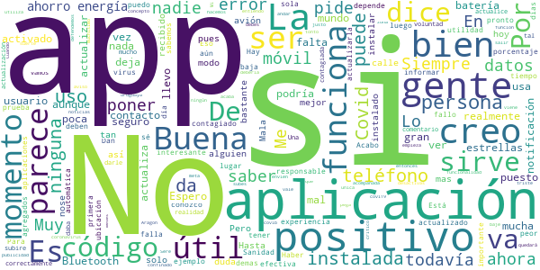

# Radar COVID
App version ``1.1.0``

Analyzed with [covid-apps-observer](http://github.com/covid-apps-observer) project, version ``0.1``

## App overview
| | |
|-------------------------|-------------------------| 
| **Name**&nbsp;&nbsp;&nbsp;&nbsp;&nbsp;&nbsp;&nbsp;&nbsp;&nbsp;&nbsp;&nbsp;&nbsp;&nbsp;&nbsp;&nbsp;&nbsp;&nbsp;&nbsp;&nbsp;&nbsp;&nbsp;&nbsp;&nbsp;&nbsp;&nbsp;&nbsp;&nbsp;&nbsp;&nbsp;&nbsp;&nbsp;&nbsp;&nbsp;&nbsp;&nbsp;&nbsp;&nbsp;&nbsp;&nbsp;&nbsp;  | Radar COVID |
| **Unique identifier** | es.gob.radarcovid |
| **Link to Google Play** | [https://play.google.com/store/apps/details?id=es.gob.radarcovid](https://play.google.com/store/apps/details?id=es.gob.radarcovid) |
| **Summary**  | Radar COVID, app oficial de prevención del COVID-19 del Gobierno de España |
| **Privacy policy** | [https://radarcovid.covid19.gob.es/terms-of-service/privacy-policy.html](https://radarcovid.covid19.gob.es/terms-of-service/privacy-policy.html) |
| **Latest version** | 1.1.0 |
| **Last update** | 2020-10-29 16:59:07 |
| **Recent changes** | - Implementación de funcionalidades para la interoperabilidad con otras aplicaciones europeas. - Implementación de funcionalidad de cambio de idioma.  - Implementación de funcionalidad de revisión de nuevas políticas de privacidad y/o términos de uso. - Mejoras de accesibilidad y seguridad. - Corrección de bugs. |
| **Installs**  | 1.000.000+ |
| **Category** | Medicina |
| **First release** | 7 ago. 2020 |
| **Size**  | 19M |
| **Supported Android version**  | 6.0 y versiones posteriores |

### Description
> Radar COVID es la aplicación diseñada y dirigida por la Secretaría de Estado de Digitalización e Inteligencia Artificial del Gobierno de España para ayudar a evitar la propagación del coronavirus (COVID-19). 
 Radar COVID te avisa de manera anónima del posible contacto que has podido tener en los últimos 14 días con una persona que haya resultado infectada utilizando la tecnología Bluetooth de bajo consumo.
 Radar COVID además permite:
 -	Comunicar de forma anónima tu diagnóstico positivo.
 -	Comunicar la exposición de forma anónima a las personas con las que has estado en contacto 
 Radar COVID garantiza la seguridad y privacidad y es 100% anónimo. Por ello no solicitamos ni tu nombre, ni tu teléfono, ni tu correo electrónico. 
 Esta aplicación usa ilustraciones de licencia gratuita y que pertenecen a www.freepik.es

### User interface
The developers of the app provide the following screenshots in the Google play store.
| | | |
|:-------------------------:|:-------------------------:|:-------------------------:|
 |   |   |   | 
 |  

## Development team
In the following we report the main information provided by the development team in the Google play store.

| | |
|-------------------------|-------------------------|
| **Developer**  | Ministerio de Asuntos Económicos y Transf. Digital |
| **Website**  | - |
| **Email** | soporte.radarcovid@economia.gob.es |
| **Physical address**  | - |
| **Other developed apps**  | [https://play.google.com/store/apps/developer?id=Ministerio+de+Asuntos+Econ%C3%B3micos+y+Transf.+Digital](https://play.google.com/store/apps/developer?id=Ministerio+de+Asuntos+Econ%C3%B3micos+y+Transf.+Digital) |

## Android support

| | |
|-------------------------|-------------------------|
| **Declared target Android version**  | Android10, version 10 (API level 29) |
| **Effective target Android version**  | Android10, version 10 (API level 29) |
| **Minimum supported Android version**  | Marshmallow, version 6.0 (API level 23) |
| **Maximum target Android version**  | - |

The larger the difference between the minimum and maximum supported Android versions, the better. A larger difference means a wider audience. For example, old phones have a very low Android version, so a high minimum supported Android version means that the app cannot be used by users with old phones, thus leading to accessibility problems. 

## Requested permissions

In the following we report the complete list of the permissions requested by the app. 

| **Permission** | **Protection level** | **Description** | 
|-------------------------|-------------------------|-------------------------|
 **android.permission ACCESS_NETWORK_STATE** | Normal | Allows applications to access information about networks. 
 **android.permission BLUETOOTH** | Normal | Allows applications to connect to paired bluetooth devices. 
 **android.permission FOREGROUND_SERVICE** | Normal | Allows a regular application to use Service.startForeground. 
 **android.permission INTERNET** | Normal | Allows applications to open network sockets. 
 **android.permission RECEIVE_BOOT_COMPLETED** | Normal | Allows an application to receive the Intent.ACTION_BOOT_COMPLETED that is broadcast after the system finishes booting. 
 **android.permission REQUEST_IGNORE_BATTERY_OPTIMIZATIONS** | Normal | Permission an application must hold in order to use Settings.ACTION_REQUEST_IGNORE_BATTERY_OPTIMIZATIONS. 
 **android.permission WAKE_LOCK** | Normal | Allows using PowerManager WakeLocks to keep processor from sleeping or screen from dimming. 

## Mentioned servers

| **Server** | **Registrant** | **Registrant country** | **Creation date** | 
|-------------------------|-------------------------|-------------------------|-------------------------|
 | google.com | Google LLC | :us: US | 1997-09-15 04:00:00 |
 | ietf.org | IETF Trust | :us: US | 1995-03-11 05:00:00 |

## Security analysis 

Below we report the main security warnings raised by our execution of the [Androwarn](https://github.com/maaaaz/androwarn) security analysis tool.

**Connection interfaces exfiltration**
> - This application reads details about the currently active data network 
> - This application tries to find out if the currently active data network is metered 

**Telephony services abuse**
> - This application makes phone calls 

**Suspicious connection establishment**
> - This application opens a Socket and connects it to the remote address '; port is out of range' on the 'N/A' port  
> - This application opens a Socket and connects it to the remote address 'Lcom/android/tools/r8/GeneratedOutlineSupport;->outline14(Ljava/lang/String;)Ljava/lang/StringBuilder;' on the 'N/A' port  
> - This application opens a Socket and connects it to the remote address 'Ljava/net/Proxy;->type()Ljava/net/Proxy$Type;' on the 'N/A' port  
> - This application opens a Socket and connects it to the remote address 'timeout' on the 'N/A' port  

## User ratings and reviews

Below we provide information about how end users are reacting to the app in terms of ratings and reviews in the Google Play store.

### Ratings

The Radar COVID app has been installed by more than **1000000** times. At this time, **12165** rated the app and its average score is **3.4765956**. Below we show the distribution of the ratings across the usual star-based rating of Google Play

:star::star::star::star::star:: 5548

:star::star::star::star:: 1665

:star::star::star:: 1130

:star::star:: 681

:star:: 3141

### Reviews 

#### 5-star reviews

> La idea es estupenda, otra cosa es que la gente lo use  :date: __2020-11-15 13:52:49__

> Totalmente necesaria. Te avisa si has tenido contacto con una persona que luego resulta que da positivo.  :date: __2020-11-15 08:42:52__

> Ojalá todos la usáramos. Acabaríamos antes con las infecciones.  :date: __2020-11-15 00:45:49__

> Por mi experiencia, me libera estrés ver k no me he cruzado con nadie declarado enfermo de Covid..  :date: __2020-11-14 12:35:30__

> Falta pulir un poco la app,, pero es una gran idea,deberia ir ,preinstalada de serie en todos los dispositivos, al igual que otras apps que de nada sirver , esta es importante por y para tod@s  :date: __2020-11-14 10:55:10__

> Me parece una apps, muy beneficiosa, tu la tienes? Si no es así descargarla, nos beneficiamos todos!  :date: __2020-11-13 22:26:10__

> Si hay sinceridad y civismo, esta aplicacion es un gran apoyo para combatir el Covid.  :date: __2020-11-13 20:45:51__

> Hasta el momento ningun problema.  :date: __2020-11-13 16:57:53__

> Como a mucha gente, me daba error de ahorro de batería antes. Pero tras desinstalar y volver a instalar ya funciona correctamente.  :date: __2020-11-13 11:12:09__

> Muy buena aplicación es una herramienta muchísimo mejor que cualquier red social  :date: __2020-11-13 00:18:13__

#### 4-star reviews

> Deseo y espero que dé resultados positivos,para bien dé todos y cada uno proceda como se debe. ❤  :date: __2020-11-14 21:52:03__

> A mí siempre me marca que estoy fuera del contacto pienso que no la tiene instalada casi nadie un tanto por ciento muy bajo por lo tanto no sirve de casi nada es una pena 😔😔😔  :date: __2020-11-13 19:20:19__

> En un principio la app es muy prometedora. No te pide info personal, solo tú ubicación y bluetooth así que por el momento confiaré en ella a ver qué pasa. Si me salva el qlo de alguien contagiado, le pondré 5 estrellas.  :date: __2020-11-13 15:29:36__

> Una aplicación que puede salvar vidas y resulta que la gente lo rechaza. Así nos va.  :date: __2020-11-11 15:17:01__

> Me encanta pero ojalá se la instalara más gente pq si no , no hacemos nada...  :date: __2020-11-10 12:28:28__

> La aplicación me parece muy interesante. Sobretodo si funcionara más rápido. Quiero decir, el domingo me han diagnosticado positivo de covid 19 y todavía sigo esperando código. Son muchas horas perdidas que podían estar alertando a gente que haya podido estar cerca de mi. Por favor hagan algo.  :date: __2020-11-10 00:12:34__

> Buena  :date: __2020-11-09 16:42:12__

> Está poco extendido, por desgracia, pero me parece muy interesante y debiera impulsarse su uso generalizado.  :date: __2020-11-08 14:46:24__

> Aplicación necesaria para los tiempos que corren Buena y no invasiva.  :date: __2020-11-07 14:13:33__

> Me da seguridad  :date: __2020-11-06 09:07:51__

#### 3-star reviews

> No es seguro que te pueda avisar con seguridad  :date: __2020-11-13 22:50:26__

> No estas mal  :date: __2020-11-12 21:47:29__

> No siver para nada si la gente no notificar su positivo  :date: __2020-11-12 18:37:51__

> Va un poco garbanzo  :date: __2020-11-12 17:34:31__

> De momento no he experimentado nada  :date: __2020-11-11 12:28:23__

> No ,e recibido nada ,será que va bien  :date: __2020-11-10 21:29:39__

> No se por qué da falla tanto  :date: __2020-11-10 12:57:49__

> Activa automáticamente el ahorro de energía, y aunque lo desactivo vuelve otra vez.  :date: __2020-11-10 07:58:45__

> El ciudadano ha de ser mas responsable. Es incomprensible que haya gente incredula ante este virus  :date: __2020-11-09 11:40:55__

> Muy interesante  :date: __2020-11-09 03:09:06__

#### 2-star reviews

> Siempre me llega mensaje de que la app no funciona correctamente. Ya lo he comunicado varias veces al teléfono de información COVID de mi comunidad, donde toman dato para supuestamente resolver la incidencia, pero sigue pasando lo mismo.  :date: __2020-11-16 07:41:15__

> Hasta el momento no me ha servido para nada.  :date: __2020-11-15 22:44:30__

> Llevo 5 días en casa autoconfianza esperando que un sanitario o rastreado me contacte después de reportar una alerta de contacto con un positivo. La app no sirve si no hay rastreo y seguimiento posterior. ¿Puedo salir, trabajar, contagiar, pido una baja, cuando vuelvo al trabajo...? En fin, un desastre de coordinación y seguimiento. 15 Dias despues nadie ha contactado conmigo  :date: __2020-11-15 08:12:08__

> La tengo instalada desde agosto,y siempre me da el mismo aviso ( no funciona correctamente). Dan ganas de desinstalar  :date: __2020-11-13 21:08:54__

> Tengo la aplicación desde hace algunos meses, sinceramente no sé si sirve para algo. Gracias  :date: __2020-11-13 21:08:52__

> La tengo por solidaridad pero nunca, en ningún sitio desde hace meses he pasado cerca de un positivo Debe hacerse de alguna manera obligatoria su descarga por los positivos, sino de poco sirve  :date: __2020-11-13 16:00:22__

> He pasado el COVID hace dos semanas y ningún profesional me ha mencionado la aplicación ni me han facilitado número para meter en radar COVID. Ni a ninguna persona que conozco de las que han pasado la infección. Deficiente implementación de una buena idea.  :date: __2020-11-13 15:51:53__

> Creo que es una buena idea, pero le falta pulir. La tengo desde agosto y cada semana hacia como un recuento de datos y me informaba de las veces que había pasado los datos. Llevo como dos semanas que no me da el aviso, a la hora de abrirla veo que me pide que acepte las condiciones de nuevo, le doy a aceptar y no me deja pasar de ahi, se ve que ha hecho una actualización automática, no ha dado parte de ello y esta pendiente de aceptación, que no responde, por lo que imagino que no hace su funcio  :date: __2020-11-12 07:46:03__

> creo que no funciona me entero de personas con covi por los vecinos y no me ha saltado nunca una alarma en la aplicacion  :date: __2020-11-11 11:27:48__

> No sé si funciona o no  :date: __2020-11-10 21:39:15__

#### 1-star reviews

> No se ha podido comunicar y hemos ido al centro de salud y no saben nada Y no ha venido ningun SM del ministerio  :date: __2020-11-16 09:50:51__

> El consumo de batería es tan desorbitado que apenas llegaba a medio día con esta app cuando en mi uso normal llegó con un 40% a la noche, hasta que no arreglen ese gran defecto, se vuelve inusable  :date: __2020-11-16 09:14:29__

> De que sirve si el contacto no lo ha notificado y se supone que si es positivo, no debe salir de casa.....  :date: __2020-11-15 22:10:02__

> Me dice que el virus ese tal llamado Covid-19 no existe. Muertos muchos, pero ni rastro de Covid.. Desinstalado.  :date: __2020-11-15 21:59:13__

> No le he visto su utilidad, poca gente la usa  :date: __2020-11-15 21:42:38__

> Está app se actualiza cada 2 días. Encima necesitas la última versión de Google Play Services que te inuliza la mitad del dispositivo  :date: __2020-11-15 19:38:40__

> Como dicen la mitad de la gente no la tiene y las q la tenemos no nos sirve para nada  :date: __2020-11-15 19:21:09__

> Dice que tengo el ahorro de energia puesto, y que no funciona bien por eso. Es mentira.  :date: __2020-11-15 18:29:55__

> No funciona en cataluña  :date: __2020-11-15 14:29:45__

> Si la gente no se lo instala es una aplicación poco util  :date: __2020-11-15 12:52:17__

