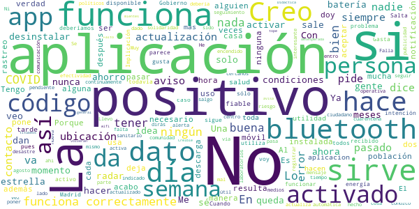

# Radar COVID
App version ``1.1.0``

Analyzed with [covid-apps-observer](http://github.com/covid-apps-observer) project, version ``0.1``

## App overview
| | |
|-------------------------|-------------------------| 
| **Name**&nbsp;&nbsp;&nbsp;&nbsp;&nbsp;&nbsp;&nbsp;&nbsp;&nbsp;&nbsp;&nbsp;&nbsp;&nbsp;&nbsp;&nbsp;&nbsp;&nbsp;&nbsp;&nbsp;&nbsp;&nbsp;&nbsp;&nbsp;&nbsp;&nbsp;&nbsp;&nbsp;&nbsp;&nbsp;&nbsp;&nbsp;&nbsp;&nbsp;&nbsp;&nbsp;&nbsp;&nbsp;&nbsp;&nbsp;&nbsp;  | Radar COVID |
| **Unique identifier** | es.gob.radarcovid |
| **Link to Google Play** | [https://play.google.com/store/apps/details?id=es.gob.radarcovid](https://play.google.com/store/apps/details?id=es.gob.radarcovid) |
| **Summary**  | Radar COVID, app oficial de prevención del COVID-19 del Gobierno de España |
| **Privacy policy** | [https://radarcovid.covid19.gob.es/terms-of-service/privacy-policy.html](https://radarcovid.covid19.gob.es/terms-of-service/privacy-policy.html) |
| **Latest version** | 1.1.0 |
| **Last update** | 2020-10-29 16:59:07 |
| **Recent changes** | - Implementación de funcionalidades para la interoperabilidad con otras aplicaciones europeas. - Implementación de funcionalidad de cambio de idioma.  - Implementación de funcionalidad de revisión de nuevas políticas de privacidad y/o términos de uso. - Mejoras de accesibilidad y seguridad. - Corrección de bugs. |
| **Installs**  | 1.000.000+ |
| **Category** | Medicina |
| **First release** | 7 ago. 2020 |
| **Size**  | 19M |
| **Supported Android version**  | 6.0 y versiones posteriores |

### Description
> Radar COVID es la aplicación diseñada y dirigida por la Secretaría de Estado de Digitalización e Inteligencia Artificial del Gobierno de España para ayudar a evitar la propagación del coronavirus (COVID-19). 
 Radar COVID te avisa de manera anónima del posible contacto que has podido tener en los últimos 14 días con una persona que haya resultado infectada utilizando la tecnología Bluetooth de bajo consumo.
 Radar COVID además permite:
 -	Comunicar de forma anónima tu diagnóstico positivo.
 -	Comunicar la exposición de forma anónima a las personas con las que has estado en contacto 
 Radar COVID garantiza la seguridad y privacidad y es 100% anónimo. Por ello no solicitamos ni tu nombre, ni tu teléfono, ni tu correo electrónico. 
 Esta aplicación usa ilustraciones de licencia gratuita y que pertenecen a www.freepik.es

### User interface
The developers of the app provide the following screenshots in the Google play store.
| | | |
|:-------------------------:|:-------------------------:|:-------------------------:|
 |   |   |   | 
 |  

## Development team
In the following we report the main information provided by the development team in the Google play store.

| | |
|-------------------------|-------------------------|
| **Developer**  | Ministerio de Asuntos Económicos y Transf. Digital |
| **Website**  | - |
| **Email** | soporte.radarcovid@economia.gob.es |
| **Physical address**  | - |
| **Other developed apps**  | [https://play.google.com/store/apps/developer?id=Ministerio+de+Asuntos+Econ%C3%B3micos+y+Transf.+Digital](https://play.google.com/store/apps/developer?id=Ministerio+de+Asuntos+Econ%C3%B3micos+y+Transf.+Digital) |

## Android support

| | |
|-------------------------|-------------------------|
| **Declared target Android version**  | Android10, version 10 (API level 29) |
| **Effective target Android version**  | Android10, version 10 (API level 29) |
| **Minimum supported Android version**  | Marshmallow, version 6.0 (API level 23) |
| **Maximum target Android version**  | - |

The larger the difference between the minimum and maximum supported Android versions, the better. A larger difference means a wider audience. For example, old phones have a very low Android version, so a high minimum supported Android version means that the app cannot be used by users with old phones, thus leading to accessibility problems. 

## Requested permissions

In the following we report the complete list of the permissions requested by the app. 

| **Permission** | **Protection level** | **Description** | 
|-------------------------|-------------------------|-------------------------|
 **android.permission ACCESS_NETWORK_STATE** | Normal | Allows applications to access information about networks. 
 **android.permission BLUETOOTH** | Normal | Allows applications to connect to paired bluetooth devices. 
 **android.permission FOREGROUND_SERVICE** | Normal | Allows a regular application to use Service.startForeground. 
 **android.permission INTERNET** | Normal | Allows applications to open network sockets. 
 **android.permission RECEIVE_BOOT_COMPLETED** | Normal | Allows an application to receive the Intent.ACTION_BOOT_COMPLETED that is broadcast after the system finishes booting. 
 **android.permission REQUEST_IGNORE_BATTERY_OPTIMIZATIONS** | Normal | Permission an application must hold in order to use Settings.ACTION_REQUEST_IGNORE_BATTERY_OPTIMIZATIONS. 
 **android.permission WAKE_LOCK** | Normal | Allows using PowerManager WakeLocks to keep processor from sleeping or screen from dimming. 

## Mentioned servers

| **Server** | **Registrant** | **Registrant country** | **Creation date** | 
|-------------------------|-------------------------|-------------------------|-------------------------|
 | google.com | Google LLC | :us: US | 1997-09-15 04:00:00 |
 | ietf.org | IETF Trust | :us: US | 1995-03-11 05:00:00 |

## Security analysis 

Below we report the main security warnings raised by our execution of the [Androwarn](https://github.com/maaaaz/androwarn) security analysis tool.

**Connection interfaces exfiltration**
> - This application reads details about the currently active data network 
> - This application tries to find out if the currently active data network is metered 

**Telephony services abuse**
> - This application makes phone calls 

**Suspicious connection establishment**
> - This application opens a Socket and connects it to the remote address '; port is out of range' on the 'N/A' port  
> - This application opens a Socket and connects it to the remote address 'Lcom/android/tools/r8/GeneratedOutlineSupport;->outline14(Ljava/lang/String;)Ljava/lang/StringBuilder;' on the 'N/A' port  
> - This application opens a Socket and connects it to the remote address 'Ljava/net/Proxy;->type()Ljava/net/Proxy$Type;' on the 'N/A' port  
> - This application opens a Socket and connects it to the remote address 'timeout' on the 'N/A' port  

## User ratings and reviews

Below we provide information about how end users are reacting to the app in terms of ratings and reviews in the Google Play store.

### Ratings

The Radar COVID app has been installed by more than **1000000** times. At this time, **12165** rated the app and its average score is **3.4765956**. Below we show the distribution of the ratings across the usual star-based rating of Google Play

:star::star::star::star::star:: 5548

:star::star::star::star:: 1665

:star::star::star:: 1130

:star::star:: 681

:star:: 3141

### Reviews 

#### 5-star reviews

> Muy buenas  :date: __2020-11-22 08:56:59__

> Me gusta saberlo  :date: __2020-11-22 00:54:31__

> ME ENCANTAN TODAS LAS COSAS DE LA TABLET  :date: __2020-11-21 17:30:50__

> Estaba asustada me costipe y me hicieron la PCR me salió negativa pero estaba muy asustada  :date: __2020-11-21 14:48:16__

> Muy buena, todo el mundo debería instalarla  :date: __2020-11-21 12:33:27__

> Buena  :date: __2020-11-20 03:36:35__

> Pienso que es una buena idea  :date: __2020-11-19 22:26:19__

> VIVA EL GOBIERNO  :date: __2020-11-19 15:52:29__

> He recibido una alerta y ha sido correcta.  :date: __2020-11-19 13:28:32__

> Todo el mundo la tenía que tener ya instalada.,.  :date: __2020-11-19 11:02:26__

#### 4-star reviews

> La tengo instalada, pero cada vez que la miró se desactivo porque necesita una actualización.  :date: __2020-11-23 08:04:13__

> Supongo  :date: __2020-11-22 00:19:13__

> Amigable y comoda de usar. Ahora se vera ,si es util o no  :date: __2020-11-22 00:13:42__

> Bien la aplicación aunque en mi redmi 7 tengo que desactivarla para que me funcione el Waze y Google Maps porque no deja que se conecten a la vez al GPS del móvil.  :date: __2020-11-16 21:16:29__

> Es una buena idea, pero si solo lo tenemos muy pocos, esto no sirve para nada  :date: __2020-11-16 11:41:07__

> Deseo y espero que dé resultados positivos,para bien dé todos y cada uno proceda como se debe. ❤  :date: __2020-11-14 21:52:03__

> A mí siempre me marca que estoy fuera del contacto pienso que no la tiene instalada casi nadie un tanto por ciento muy bajo por lo tanto no sirve de casi nada es una pena 😔😔😔  :date: __2020-11-13 19:20:19__

> En un principio la app es muy prometedora. No te pide info personal, solo tú ubicación y bluetooth así que por el momento confiaré en ella a ver qué pasa. Si me salva el qlo de alguien contagiado, le pondré 5 estrellas.  :date: __2020-11-13 15:29:36__

> Una aplicación que puede salvar vidas y resulta que la gente lo rechaza. Así nos va.  :date: __2020-11-11 15:17:01__

> Me encanta pero ojalá se la instalara más gente pq si no , no hacemos nada...  :date: __2020-11-10 12:28:28__

#### 3-star reviews

> Está muy bien esta app del Covid-19, pero creo que el gran fallo e inconveniente que tiene esta aplicación, es que lo tiene que tener todo el mundo (y seguramente habrán muchos que ni se les han ocurrido descargárselo). ¿De qué puede servir esta app, si cuando has estado en contacto con un positivo, este no tiene ni el app? Nunca te va llegar la notificación de que has estado junto a un contagiado.  :date: __2020-11-22 16:45:16__

> Es mi primera vez,  :date: __2020-11-21 12:41:25__

> Muy buena y útil la aplicación, pero creo que es importante que la descargaramos todos y para ello tiene que poder descargarla todo el mundo, ya que quién tiene versiones antiguas de teléfono no deja instalarlo, en iPhone por ejemplo, en versión anterior a iOS 13.5 no deja y conozco gente que aunque han querido y actualizado los teléfonos aún no han podido instalarla.  :date: __2020-11-19 18:30:42__

> De momento da fallo  :date: __2020-11-19 13:46:36__

> De nada sirve la app si luego cuando detectan un positivo nadie les da los códigos a introducir en la app. 😞Dan ganas de desinstalar la app...  :date: __2020-11-19 08:05:29__

> Buena intención pero mala ejecución. Muy poca gente conoce esta app, falpa promoción de una medida que podría ser efectiva. Pd: la traducción al catalán es nefasta  :date: __2020-11-18 23:08:39__

> No funciona. Dice que está activado el ahorro de energía, pero no es cierto.  :date: __2020-11-16 21:32:20__

> No es seguro que te pueda avisar con seguridad  :date: __2020-11-13 22:50:26__

> No estas mal  :date: __2020-11-12 21:47:29__

> No siver para nada si la gente no notificar su positivo  :date: __2020-11-12 18:37:51__

#### 2-star reviews

> Me dice continuamente"no funciona correctamente"  :date: __2020-11-22 20:02:12__

> Esta aplicación es solo para los que tienen covid?? Porque yo no tengo y me pide un código para seguir, alguien me lo explica  :date: __2020-11-18 22:56:04__

> Acabo de instalarla,, aver ktal  :date: __2020-11-18 21:07:39__

> Una vez has indicado que eres positivo la aplicación deja de registrar datos. ¿No tiene alguna manera de hacer un reset para que vuelva a registrar después del alta médica o transcurridas unas semanas?  :date: __2020-11-18 05:45:04__

> Siempre me llega mensaje de que la app no funciona correctamente. Ya lo he comunicado varias veces al teléfono de información COVID de mi comunidad, donde toman dato para supuestamente resolver la incidencia, pero sigue pasando lo mismo.  :date: __2020-11-16 07:41:15__

> Hasta el momento no me ha servido para nada.  :date: __2020-11-15 22:44:30__

> Llevo 5 días en casa autoconfianza esperando que un sanitario o rastreado me contacte después de reportar una alerta de contacto con un positivo. La app no sirve si no hay rastreo y seguimiento posterior. ¿Puedo salir, trabajar, contagiar, pido una baja, cuando vuelvo al trabajo...? En fin, un desastre de coordinación y seguimiento. 15 Dias despues nadie ha contactado conmigo  :date: __2020-11-15 08:12:08__

> La tengo instalada desde agosto,y siempre me da el mismo aviso ( no funciona correctamente). Dan ganas de desinstalar  :date: __2020-11-13 21:08:54__

> Tengo la aplicación desde hace algunos meses, sinceramente no sé si sirve para algo. Gracias  :date: __2020-11-13 21:08:52__

> La tengo por solidaridad pero nunca, en ningún sitio desde hace meses he pasado cerca de un positivo Debe hacerse de alguna manera obligatoria su descarga por los positivos, sino de poco sirve  :date: __2020-11-13 16:00:22__

#### 1-star reviews

> Mi vecina estuvo contagiada y no aparecía nada en la app si no la tiene todo el mundo descargada es para nada  :date: __2020-11-23 00:47:37__

> Nuca pita ni dentro del hospital  :date: __2020-11-22 18:46:57__

> Muy compleja y poco intuitiva  :date: __2020-11-22 07:54:07__

> Es la segunda vez que me la instalo y constantemente me sale una notificación de que no funciona bien porque tengo desconectada la ubicación, dijeron que funciona solo con bluetooth, pero no parece ser así  :date: __2020-11-21 23:44:49__

> No sirve para nada si no te dan un código en caso de positivo y si no hay un mínimo de usuarios. Ambas cosas suceden ahora mismo. Buena idea pero No sirve.  :date: __2020-11-21 20:57:19__

> No funciona....  :date: __2020-11-21 18:32:16__

> No se para que vale no notifica nada.  :date: __2020-11-21 15:59:37__

> La instalé por solidaridad pero creo que no vale para nada... En mi círculo próximo he estado con contagiados que no les han dado nunca el código para meter en la app...  :date: __2020-11-20 23:36:46__

> No funciona en Huawei P40 5G Una aplicación para controlar una pandemia sanitaria que no puedes utilizar en todos los teléfonos que se venden por las "operadoras españolas" . Prefiero no decir mi opinión....  :date: __2020-11-20 20:46:57__

> No va nada bien  :date: __2020-11-20 15:37:35__

