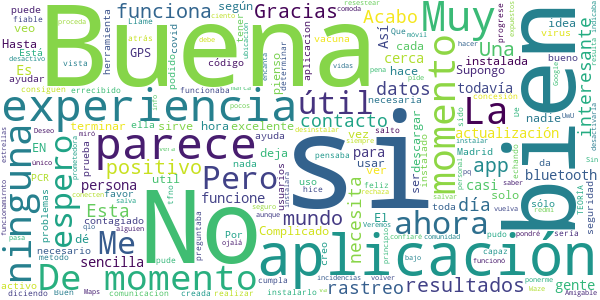

# Radar COVID
App version ``1.1.0``

Analyzed with [covid-apps-observer](http://github.com/covid-apps-observer) project, version ``0.1``

## App overview
| | |
|-------------------------|-------------------------| 
| **Name**&nbsp;&nbsp;&nbsp;&nbsp;&nbsp;&nbsp;&nbsp;&nbsp;&nbsp;&nbsp;&nbsp;&nbsp;&nbsp;&nbsp;&nbsp;&nbsp;&nbsp;&nbsp;&nbsp;&nbsp;&nbsp;&nbsp;&nbsp;&nbsp;&nbsp;&nbsp;&nbsp;&nbsp;&nbsp;&nbsp;&nbsp;&nbsp;&nbsp;&nbsp;&nbsp;&nbsp;&nbsp;&nbsp;&nbsp;&nbsp;  | Radar COVID |
| **Unique identifier** | es.gob.radarcovid |
| **Link to Google Play** | [https://play.google.com/store/apps/details?id=es.gob.radarcovid](https://play.google.com/store/apps/details?id=es.gob.radarcovid) |
| **Summary**  | Radar COVID, app oficial de prevención del COVID-19 del Gobierno de España |
| **Privacy policy** | [https://radarcovid.covid19.gob.es/terms-of-service/privacy-policy.html](https://radarcovid.covid19.gob.es/terms-of-service/privacy-policy.html) |
| **Latest version** | 1.1.0 |
| **Last update** | 2020-10-29 16:59:07 |
| **Recent changes** | - Implementación de funcionalidades para la interoperabilidad con otras aplicaciones europeas. - Implementación de funcionalidad de cambio de idioma.  - Implementación de funcionalidad de revisión de nuevas políticas de privacidad y/o términos de uso. - Mejoras de accesibilidad y seguridad. - Corrección de bugs. |
| **Installs**  | 1.000.000+ |
| **Category** | Medicina |
| **First release** | 7 ago. 2020 |
| **Size**  | 19M |
| **Supported Android version**  | 6.0 y versiones posteriores |

### Description
> Radar COVID es la aplicación diseñada y dirigida por la Secretaría de Estado de Digitalización e Inteligencia Artificial del Gobierno de España para ayudar a evitar la propagación del coronavirus (COVID-19). 
 Radar COVID te avisa de manera anónima del posible contacto que has podido tener en los últimos 14 días con una persona que haya resultado infectada utilizando la tecnología Bluetooth de bajo consumo.
 Radar COVID además permite:
 -	Comunicar de forma anónima tu diagnóstico positivo.
 -	Comunicar la exposición de forma anónima a las personas con las que has estado en contacto 
 Radar COVID garantiza la seguridad y privacidad y es 100% anónimo. Por ello no solicitamos ni tu nombre, ni tu teléfono, ni tu correo electrónico. 
 Esta aplicación usa ilustraciones de licencia gratuita y que pertenecen a www.freepik.es

### User interface
The developers of the app provide the following screenshots in the Google play store.
| | | |
|:-------------------------:|:-------------------------:|:-------------------------:|
 |   |   |   | 
 |  

## Development team
In the following we report the main information provided by the development team in the Google play store.

| | |
|-------------------------|-------------------------|
| **Developer**  | Ministerio de Asuntos Económicos y Transf. Digital |
| **Website**  | - |
| **Email** | soporte.radarcovid@economia.gob.es |
| **Physical address**  | - |
| **Other developed apps**  | [https://play.google.com/store/apps/developer?id=Ministerio+de+Asuntos+Econ%C3%B3micos+y+Transf.+Digital](https://play.google.com/store/apps/developer?id=Ministerio+de+Asuntos+Econ%C3%B3micos+y+Transf.+Digital) |

## Android support

| | |
|-------------------------|-------------------------|
| **Declared target Android version**  | Android10, version 10 (API level 29) |
| **Effective target Android version**  | Android10, version 10 (API level 29) |
| **Minimum supported Android version**  | Marshmallow, version 6.0 (API level 23) |
| **Maximum target Android version**  | - |

The larger the difference between the minimum and maximum supported Android versions, the better. A larger difference means a wider audience. For example, old phones have a very low Android version, so a high minimum supported Android version means that the app cannot be used by users with old phones, thus leading to accessibility problems. 

## Requested permissions

In the following we report the complete list of the permissions requested by the app. 

| **Permission** | **Protection level** | **Description** | 
|-------------------------|-------------------------|-------------------------|
 **android.permission ACCESS_NETWORK_STATE** | Normal | Allows applications to access information about networks. 
 **android.permission BLUETOOTH** | Normal | Allows applications to connect to paired bluetooth devices. 
 **android.permission FOREGROUND_SERVICE** | Normal | Allows a regular application to use Service.startForeground. 
 **android.permission INTERNET** | Normal | Allows applications to open network sockets. 
 **android.permission RECEIVE_BOOT_COMPLETED** | Normal | Allows an application to receive the Intent.ACTION_BOOT_COMPLETED that is broadcast after the system finishes booting. 
 **android.permission REQUEST_IGNORE_BATTERY_OPTIMIZATIONS** | Normal | Permission an application must hold in order to use Settings.ACTION_REQUEST_IGNORE_BATTERY_OPTIMIZATIONS. 
 **android.permission WAKE_LOCK** | Normal | Allows using PowerManager WakeLocks to keep processor from sleeping or screen from dimming. 

## Mentioned servers

| **Server** | **Registrant** | **Registrant country** | **Creation date** | 
|-------------------------|-------------------------|-------------------------|-------------------------|
 | google.com | Google LLC | :us: US | 1997-09-15 04:00:00 |
 | ietf.org | IETF Trust | :us: US | 1995-03-11 05:00:00 |

## Security analysis 

Below we report the main security warnings raised by our execution of the [Androwarn](https://github.com/maaaaz/androwarn) security analysis tool.

**Connection interfaces exfiltration**
> - This application reads details about the currently active data network 
> - This application tries to find out if the currently active data network is metered 

**Telephony services abuse**
> - This application makes phone calls 

**Suspicious connection establishment**
> - This application opens a Socket and connects it to the remote address '; port is out of range' on the 'N/A' port  
> - This application opens a Socket and connects it to the remote address 'Lcom/android/tools/r8/GeneratedOutlineSupport;->outline14(Ljava/lang/String;)Ljava/lang/StringBuilder;' on the 'N/A' port  
> - This application opens a Socket and connects it to the remote address 'Ljava/net/Proxy;->type()Ljava/net/Proxy$Type;' on the 'N/A' port  
> - This application opens a Socket and connects it to the remote address 'timeout' on the 'N/A' port  

## User ratings and reviews

Below we provide information about how end users are reacting to the app in terms of ratings and reviews in the Google Play store.

### Ratings

The Radar COVID app has been installed by more than **1000000** times. At this time, **12165** rated the app and its average score is **3.4765956**. Below we show the distribution of the ratings across the usual star-based rating of Google Play

:star::star::star::star::star:: 5548

:star::star::star::star:: 1665

:star::star::star:: 1130

:star::star:: 681

:star:: 3141

### Reviews 

#### 5-star reviews

> No tengo ninguna  :date: __2020-11-30 11:25:35__

> Sin experiencia  :date: __2020-11-30 01:50:06__

> Esta bien pero si alguien lo tiene y no informa? Muchos me dicen que eso nada que son tonterias cosa que me parece peligroso😬  :date: __2020-11-28 11:04:49__

> Es una aplicación muy efectiva  :date: __2020-11-28 00:22:27__

> No lo sé aún  :date: __2020-11-27 23:35:21__

> Aún no he visto la realidad de este sistema de tecnología tan avanzada como ustedes predican he informan al pueblo aquí en cataluña que detecte un posible contagio . Lo que quiere decir que mientras no observe algo positivo no creo en esta aplicación  :date: __2020-11-27 19:51:24__

> No tengo experiencia porque no lo he usado  :date: __2020-11-27 18:16:52__

> Acabo de instalarla  :date: __2020-11-26 13:45:43__

> Amilcar danilo Castaño Pechené  :date: __2020-11-26 11:14:33__

> Podria ser más exhaustiva.  :date: __2020-11-26 09:26:53__

#### 4-star reviews

> Hasta ahora pensaba que no funcionaba o me preguntaba si sería fiable. Pero me salto hace unos días diciendo: has tenido un contacto con un positivo hace X días. No se quien sería, pero echando la vista atrás pude determinar que hice ese día y donde pudo ser. Llame al tfno de mi comunidad según me indicaba la app y todo funcionó bien. El único pero es que para resestear y que vuelva a ponerme q no he estado en contacto con nadie, tengo q desinstalar y volver a instalar.  :date: __2020-11-30 12:03:34__

> Veremos su funcionamirnto  :date: __2020-11-30 07:35:16__

> Una excelente aplicación para estar más seguro, a la hora de estar expuestos y saber que hacer.  :date: __2020-11-29 15:50:11__

> Esta bien UwU  :date: __2020-11-27 20:45:36__

> Muy interesante.  :date: __2020-11-25 12:56:37__

> Sin incidencias  :date: __2020-11-24 20:25:33__

> La tengo instalada, pero cada vez que la miró se desactivo porque necesita una actualización.  :date: __2020-11-23 08:04:13__

> Supongo  :date: __2020-11-22 00:19:13__

> Amigable y comoda de usar. Ahora se vera ,si es util o no  :date: __2020-11-22 00:13:42__

> Bien la aplicación aunque en mi redmi 7 tengo que desactivarla para que me funcione el Waze y Google Maps porque no deja que se conecten a la vez al GPS del móvil.  :date: __2020-11-16 21:16:29__

#### 3-star reviews

> No lo se empieza hoy  :date: __2020-11-29 19:08:29__

> La única pega el bluetooth.  :date: __2020-11-28 21:52:28__

> Hasta mucha batería  :date: __2020-11-28 13:40:04__

> Me parece buena aplicación, pero la debería de instalar más gente,ahora acaba de salir en las noticias que en Aragon solo se la han instalado 316 personas,que triste....así no hacemos nada  :date: __2020-11-27 20:49:21__

> Cuando subes a un avión y debes poner el modo avión desactivas la funcionalidad, justo en un momento crítico.  :date: __2020-11-26 12:12:58__

> Por favor alguien me podría decir como funciona está aplicación.. ya que nose como se Usa?  :date: __2020-11-26 07:59:05__

> Deberia ser mas c completa y obligatoria  :date: __2020-11-26 06:07:43__

> De momento no tengo ninguna experiencia. Creo,por referencias, que puede ser útil.  :date: __2020-11-25 14:56:08__

> Es curioso que ninguna de estas aplicaciones pregunte y/o permita registrar el uso del trasporte público.  :date: __2020-11-24 22:23:50__

> Quisqueya  :date: __2020-11-23 18:53:37__

#### 2-star reviews

> Gasta mucha bateria  :date: __2020-11-28 16:03:14__

> Buena intención pero ahí se queda. Al menos en Asturias no sirve de nada puesto que no se da el codigo necesario para comunicar el positivo.  :date: __2020-11-27 22:10:30__

> Con todo mi corazón la instalé,si nadie la utiliza para bien de todos,pues sirve de poco,cuestión de mentalidad española,conciencia,no es para chivarse de nadie,es para salvar a muchos,,,  :date: __2020-11-27 14:02:44__

> En personas mayores no es fácil entenderla  :date: __2020-11-27 10:47:25__

> No sirbe para nada  :date: __2020-11-25 09:44:33__

> Es una app que es muy necesaria para la situación que vivimos, y no entiedo porque en Madrid no funciona.  :date: __2020-11-24 13:35:45__

> Me la he bajado por aquello de ser buena persona. En las condiciones de uso pone que "lo único que tienes que hacer es tener el bluetooth activado, y que nunca se tomarán datos de tu ubicación", pero LA PRIMERA EN LA FRENTE, no funciona sólo com bluetooth, me pide la ubicación  :date: __2020-11-23 21:01:16__

> No lo sé todavía  :date: __2020-11-23 17:44:46__

> Me dice continuamente"no funciona correctamente"  :date: __2020-11-22 20:02:12__

> Esta aplicación es solo para los que tienen covid?? Porque yo no tengo y me pide un código para seguir, alguien me lo explica  :date: __2020-11-18 22:56:04__

#### 1-star reviews

> No entiendo cual es el fin de la aplicación, te indica riesgo alto por un contacto estrecho y tras notificarlo no te hacen prueba, ni seguimiento ni cuarentena? Me explican para qué la tengo que tener instalada? Gracias.  :date: __2020-11-30 05:30:45__

> Esto no funciona  :date: __2020-11-28 22:05:05__

> No sirve para nada , tienes que decir tu sí eres positivo, así que si no lo comunicas no sirve .  :date: __2020-11-28 21:33:04__

> Llevo el bluetooth siempre encendido y no hace rastreos. Sigue sin funcionar, al final será como el gobierno, funcionará tarde y ya veremos.  :date: __2020-11-28 21:14:44__

> No la veo útil ni operativa, no sirve para nada.  :date: __2020-11-27 19:00:49__

> Si no nos facilitan el código es imposible que podamos hacer que funcione la aplicación.... Asi no se avisa de posibles contactos  :date: __2020-11-27 17:58:36__

> En mi Samsung ni arranca. Lamentable.  :date: __2020-11-26 19:49:26__

> No lo está utilizando la gente. Lo tenemos todo el día consumiendo batería por el bluetooth para nada. Nació con unas grandes expectativas pero ahí se quedó. Deberían ser las administraciones las que insertarán el positivos.  :date: __2020-11-26 17:34:56__

> No funciona, o no quieren que funcione, 2 contagiados en mi entorno y ni una notificación, ellos también tienen la app  :date: __2020-11-26 14:01:41__

> Siempre manda notificaciones de error y no sé por qué.  :date: __2020-11-26 13:07:01__

