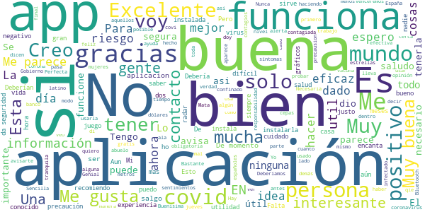
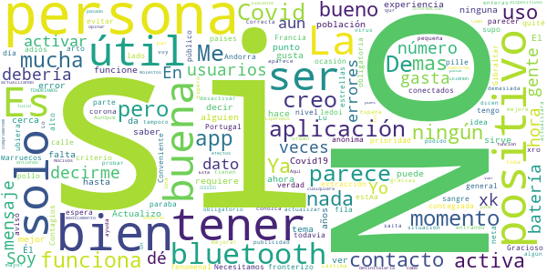
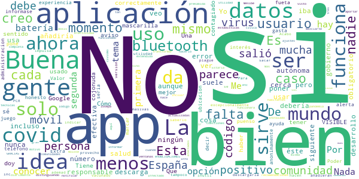
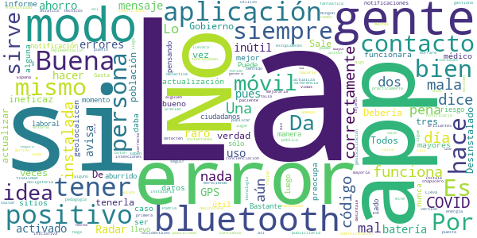
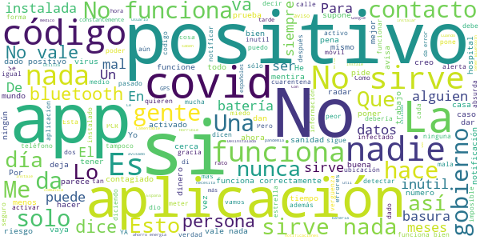

# Radar COVID
App version ``1.2.0``

Analyzed with [covid-apps-observer](http://github.com/covid-apps-observer) project, version ``0.1``

## App overview
| | |
|-------------------------|-------------------------| 
| **Name**&nbsp;&nbsp;&nbsp;&nbsp;&nbsp;&nbsp;&nbsp;&nbsp;&nbsp;&nbsp;&nbsp;&nbsp;&nbsp;&nbsp;&nbsp;&nbsp;&nbsp;&nbsp;&nbsp;&nbsp;&nbsp;&nbsp;&nbsp;&nbsp;&nbsp;&nbsp;&nbsp;&nbsp;&nbsp;&nbsp;&nbsp;&nbsp;&nbsp;&nbsp;&nbsp;&nbsp;&nbsp;&nbsp;&nbsp;&nbsp;  | Radar COVID |
| **Unique identifier** | es.gob.radarcovid |
| **Link to Google Play** | [https://play.google.com/store/apps/details?id=es.gob.radarcovid](https://play.google.com/store/apps/details?id=es.gob.radarcovid) |
| **Summary**  | Radar COVID, app oficial de prevención del COVID-19 del Gobierno de España |
| **Privacy policy** | [https://radarcovid.covid19.gob.es/terms-of-service/privacy-policy.html](https://radarcovid.covid19.gob.es/terms-of-service/privacy-policy.html) |
| **Latest version** | 1.2.0 |
| **Last update** | 2020-12-17 18:27:09 |
| **Recent changes** | - Actualización versión DP-3T. - Vista de Estadísticas Radar COVID. - Vista de información del estado de la aplicación. - Recordatorio de apertura de la aplicación. - Contador confinamiento. - Compartir enlace para facilitar descarga. - Añadido idioma Francés. - Introducción de código desde SMS. - Mejoras de accesibilidad:    Aumento de tamaño de texto y contraste.    Cambio en el estilo de los enlaces.    Etiquetado de elementos en pantalla.    Incorporación de encabezados. |
| **Installs**  | 1.000.000+ |
| **Category** | Medicina |
| **First release** | 7 ago 2020 |
| **Size**  | 22M |
| **Supported Android version**  | 6.0 y versiones posteriores |

### Description
> Radar COVID es la aplicación diseñada y dirigida por la Secretaría de Estado de Digitalización e Inteligencia Artificial del Gobierno de España para ayudar a evitar la propagación del coronavirus (COVID-19). 
 Radar COVID te avisa de manera anónima del posible contacto que has podido tener en los últimos 14 días con una persona que haya resultado infectada utilizando la tecnología Bluetooth de bajo consumo.
 Radar COVID además permite:
 -	Comunicar de forma anónima tu diagnóstico positivo.
 -	Comunicar la exposición de forma anónima a las personas con las que has estado en contacto 
 Radar COVID garantiza la seguridad y privacidad y es 100% anónimo. Por ello no solicitamos ni tu nombre, ni tu teléfono, ni tu correo electrónico. 
 Esta aplicación usa ilustraciones de licencia gratuita y que pertenecen a www.freepik.es

### User interface
The developers of the app provide the following screenshots in the Google play store.
| | | |
|:-------------------------:|:-------------------------:|:-------------------------:|
 |   |   |   | 
 |  

## Development team
In the following we report the main information provided by the development team in the Google play store.

| | |
|-------------------------|-------------------------|
| **Developer**  | Ministerio de Asuntos Económicos y Transf. Digital |
| **Website**  | - |
| **Email** | soporte.radarcovid@economia.gob.es |
| **Physical address**  | - |
| **Other developed apps**  | [https://play.google.com/store/apps/developer?id=Ministerio+de+Asuntos+Econ%C3%B3micos+y+Transf.+Digital](https://play.google.com/store/apps/developer?id=Ministerio+de+Asuntos+Econ%C3%B3micos+y+Transf.+Digital) |

## Android support

| | |
|-------------------------|-------------------------|
| **Declared target Android version**  | Android10, version 10 (API level 29) |
| **Effective target Android version**  | Android10, version 10 (API level 29) |
| **Minimum supported Android version**  | Marshmallow, version 6.0 (API level 23) |
| **Maximum target Android version**  | - |

The larger the difference between the minimum and maximum supported Android versions, the better. A larger difference means a wider audience. For example, old phones have a very low Android version, so a high minimum supported Android version means that the app cannot be used by users with old phones, thus leading to accessibility problems. 

## Requested permissions

In the following we report the complete list of the permissions requested by the app. 

| **Permission** | **Protection level** | **Description** | 
|-------------------------|-------------------------|-------------------------|
 **android.permission ACCESS_NETWORK_STATE** | Normal | Allows applications to access information about networks. 
 **android.permission BLUETOOTH** | Normal | Allows applications to connect to paired bluetooth devices. 
 **android.permission FOREGROUND_SERVICE** | Normal | Allows a regular application to use Service.startForeground. 
 **android.permission INTERNET** | Normal | Allows applications to open network sockets. 
 **android.permission RECEIVE_BOOT_COMPLETED** | Normal | Allows an application to receive the Intent.ACTION_BOOT_COMPLETED that is broadcast after the system finishes booting. 
 **android.permission REQUEST_IGNORE_BATTERY_OPTIMIZATIONS** | Normal | Permission an application must hold in order to use Settings.ACTION_REQUEST_IGNORE_BATTERY_OPTIMIZATIONS. 
 **android.permission WAKE_LOCK** | Normal | Allows using PowerManager WakeLocks to keep processor from sleeping or screen from dimming. 

## Mentioned servers

| **Server** | **Registrant** | **Registrant country** | **Creation date** | 
|-------------------------|-------------------------|-------------------------|-------------------------|
 | google.com | Google LLC | :us: US | 1997-09-15 04:00:00 |
 | ietf.org | IETF Trust | :us: US | 1995-03-11 05:00:00 |

## Security analysis 

Below we report the main security warnings raised by our execution of the [Androwarn](https://github.com/maaaaz/androwarn) security analysis tool.

**Connection interfaces exfiltration**
> - This application reads details about the currently active data network 
> - This application tries to find out if the currently active data network is metered 

**Telephony services abuse**
> - This application makes phone calls 

**Suspicious connection establishment**
> - This application opens a Socket and connects it to the remote address '; port is out of range' on the 'N/A' port  
> - This application opens a Socket and connects it to the remote address 'Lcom/android/tools/r8/GeneratedOutlineSupport;->outline15(Ljava/lang/String;)Ljava/lang/StringBuilder;' on the 'N/A' port  
> - This application opens a Socket and connects it to the remote address 'Ljava/net/Proxy;->type()Ljava/net/Proxy$Type;' on the 'N/A' port  
> - This application opens a Socket and connects it to the remote address 'timeout' on the 'N/A' port  

## User ratings and reviews

Below we provide information about how end users are reacting to the app in terms of ratings and reviews in the Google Play store.

### Ratings

The Radar COVID app has been installed by more than **1000000** times. At this time, **13257** rated the app and its average score is **3.0216258**. Below we show the distribution of the ratings across the usual star-based rating of Google Play

:star::star::star::star::star:: 5171

:star::star::star::star:: 1156

:star::star::star:: 1038

:star::star:: 573

:star:: 5319

### Reviews 

#### 5-star reviews

> Concuerdo con Jorge, el juego es excelente, como el plague Inc pero gratis, el único inconveniente es que no te deja mezclar las cepas de virus y que el nivel 15, el penúltimo, es demasiado difícil, yo rebajaría la dificultad y pondría como misión final infectar al mundo entero , en resumen juegazo y seguid asi  :date: __2021-01-16 16:05:00__

> De buena.esta  :date: __2021-01-16 12:05:20__

> De momento, me funciona correctamente. Nunca he tenido los problemas que se señalan por aquí. Actualmente ya he recibido notificación de que estuve en contacto con persona que dio positivo. Funciona.  :date: __2021-01-16 11:51:04__

> Es importante gracias  :date: __2021-01-15 14:06:26__

> Sencilla.  :date: __2021-01-15 11:07:57__

> Hola mira unas personas en mi trabajo me están chantajeando con mis sentimientos 2 rut y Jesús coche me umillan cada segundo soy trabajador de tansubinsa villatuerta y me están aisndo daño con las mujeres por mis sentimientos y no me voy a dejar soy joven y quiero tener mis cosas y la chica en mi casa soy latino y nacidad de España tengo contrato y voy hacer fijo dentro de 6 meses o menos un saludo feliz Navidad  :date: __2021-01-14 19:34:50__

> Me perece muy interesante  :date: __2021-01-14 18:18:12__

> Muy bien está imformacion  :date: __2021-01-14 09:21:53__

> Buena  :date: __2021-01-13 21:37:12__

> Buena  :date: __2021-01-13 18:42:15__

#### 4-star reviews

> Gracioso que haya países conectados a la aplicación pero ni uno fronterizo que tendrían que ser la prioridad a mi parecer. Marruecos no creo que fuera muy útil pero Portugal, Gibraltar, Andorra y Francia tendrían que estar si o si.  :date: __2021-01-15 09:42:06__

> Me parece fenomenal  :date: __2021-01-14 18:28:12__

> Soy de alto nivel  :date: __2021-01-14 11:42:17__

> En una ocasión en una fila de espera, en la calle, para una extracción de sangre, me avisó del día y hora en que había una persona contagiada.  :date: __2021-01-13 18:00:32__

> Necesitamos más usuarios  :date: __2021-01-13 15:09:28__

> Conveniente  :date: __2021-01-11 18:08:40__

> Es muy buena idea para evitar Contagios Covid 19  :date: __2021-01-11 14:07:24__

> No tengo criterio todavia pero debería ser obligatoria al ser anónima para el público en general  :date: __2021-01-10 08:43:31__

> No..tengo..de momento...!!!  :date: __2021-01-08 14:11:45__

> La neta esta bien pero: no ledoi 5 estrellas porque funciona el 99% porque cuando pille, el corona no supo decirme que estaba con un positivo o si,no Lu ubiera pollo la verdad a parte cuando lo tenía no paraba de decirme estAa en un positivo al lado i me arto, i gasta batería mucha adiós(◍•ᴗ•◍)❤  :date: __2021-01-07 22:43:33__

#### 3-star reviews

> Para impulsar su uso y sacar provecho a la app, estaría bien que añadieran la opción de indicar si el usuario se ha vacunado o no, distinguiendo entre primera y segunda dosis. Creo que es de gran utilidad para conocer la efectividad de la misma.  :date: __2021-01-16 18:51:02__

> nadie hace caso a las recomendaciones,hay transformar enOBLIGACIONES.  :date: __2021-01-16 13:49:58__

> Esta muy bien GRACIAS  :date: __2021-01-15 21:13:36__

> Nada mas que hay tres ventanas la de ajustes, la de info y la de informar casos del covid. No es completa.  :date: __2021-01-12 16:02:59__

> Mesibe para estar prekabida  :date: __2021-01-11 23:37:53__

> No la e tenido  :date: __2021-01-11 12:37:34__

> Está todo bien configurado y ya he desactivado cualquier restricción de energía a la aplicación, pero sigo recibiendo una notificación pidiendo que la desactive...  :date: __2021-01-10 22:28:43__

> Más o menos  :date: __2021-01-10 21:19:54__

> Me he instalado la aplicación unas 2 semanas y no ha funcionado. Y no por cuestiones técnicas sino por falta de civismo. Por el mismo motivo por el que la pandemia está tan extendida. Si no eres responsable de no ir donde debes y no mezclarte con quien no tienes que hacerlo ¿vas a notificar por aquí si estás infectado o no? Esta aplicación funcionará bien si la gente es cívica y responsable, cosa que por lo que he visto hasta ahora, no lo es.  :date: __2021-01-09 11:19:52__

> Estaría bien aportar estadísticas actualizadas diariamente. Incluir el número de afectados cada 100.000 habitantes, datos sobre las comunidades autónomas, etc...  :date: __2021-01-08 22:29:12__

#### 2-star reviews

> La aplicación muy bien, pero si no dan el código que tienen que dar cuando das positivo, no sirve para nada. Tengo tres familiares con positivo y a ninguno les dieron el código.  :date: __2021-01-15 13:08:21__

> No sé actualiza a tiempo ...no merece la pena tenerla recibes información mejor por otros medios.  :date: __2021-01-14 15:52:42__

> Yo di positivo pero nadie me dio tal código por lo q no pude ingresarlo en la app. Siempre pone baja exposición supongo q ese será un motivo. Poco éxito me parece a mí  :date: __2021-01-14 09:55:19__

> Tendria que mejorar. Poner noticias de donde estes. Pero esta aplicación no te da mucha información. Tiene que entrar mas gente para que en teoria fuera eficaz.  :date: __2021-01-13 21:18:39__

> No se puede actualizar, y no cumple con las respectivas de una plicación de el gobierno de España. Se podría poner un nombre con un aviso de que todas las personas con las que has estado más de 15 minutos podrán verte. He puesto 2 estrellas porque no está a la altura.  :date: __2021-01-13 16:41:37__

> La desinstalé ya dos veces. La finalidad es fantástica, pero seguro que existen mentes más brillantes, técnicos y científicos de verdad, para mejorarla. Lo digo porque todo lo que gestiona ESTE Gobierno de España es ineficaz y chapucero. Gracias.  :date: __2021-01-13 09:19:55__

> Me obliga a usar el bluetooth todo el rato y luego no puedo usarlo para escuchar música ni con otras aplicaciones, una porquería vamos.  :date: __2021-01-12 12:00:02__

> No funciona, la instalé varias veces y continuamente da #error# Así qué al final la desinstalé definitivamente porque no sirve para nada.  :date: __2021-01-11 15:28:12__

> Buena idea, pero inútil por malfuncionamiento, no registra nada nunca y, hace más de 6 meses que la instalé.  :date: __2021-01-11 12:58:51__

> Saltan mensajes continuos de que no funciona correctamente porque se ha activado el sistema de ahorro de energía, eso no es cierto. No se activa nunca. ¿De qué sirve tenerlo instalado si no funciona nunca?  :date: __2021-01-10 15:53:44__

#### 1-star reviews

> Nunca me ha dado una alerta, y he estado en grandes ciudades y barrios populosos. O no funciona, o la gente no la usa.  :date: __2021-01-16 17:09:42__

> Lo puse una semana y no me alert aba de nada ,es fiasco está aplicación y el gobierno PSOE otro chasco.  :date: __2021-01-16 13:44:22__

> Mala, no funciona para nada😠😠😠😠😠  :date: __2021-01-16 12:26:32__

> Va fatal por no decir que funciona  :date: __2021-01-16 10:19:57__

> Mensajes de error constantes. Una basura  :date: __2021-01-16 01:45:26__

> No me deja activar las notificaciones, desinstalo ya mismo.  :date: __2021-01-16 00:04:32__

> No funciona  :date: __2021-01-15 23:40:32__

> Decepcionante, inservible, una perdida de tiempo.  :date: __2021-01-15 23:01:37__

> He querido comunicar mi positivo y te piden un código del que no dispongo ni han dado facilidades para conocerlo. Contando de que cuando das positivo en la mayoría de casos estás enfermo, no lo ponen nada fácil para que haya un número importante de gente que la vaya a usar. La desinstalo 😞  :date: __2021-01-15 22:50:31__

> Desastroso  :date: __2021-01-15 22:41:47__

