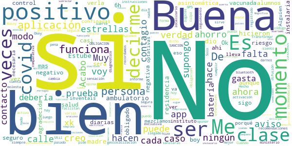
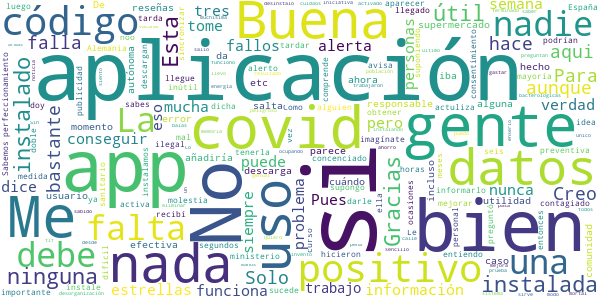
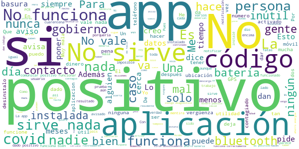

# Radar COVID
App version ``1.2.0``

Analyzed with [covid-apps-observer](http://github.com/covid-apps-observer) project, version ``0.1``

## App overview
| | |
|-------------------------|-------------------------| 
| **Name**&nbsp;&nbsp;&nbsp;&nbsp;&nbsp;&nbsp;&nbsp;&nbsp;&nbsp;&nbsp;&nbsp;&nbsp;&nbsp;&nbsp;&nbsp;&nbsp;&nbsp;&nbsp;&nbsp;&nbsp;&nbsp;&nbsp;&nbsp;&nbsp;&nbsp;&nbsp;&nbsp;&nbsp;&nbsp;&nbsp;&nbsp;&nbsp;&nbsp;&nbsp;&nbsp;&nbsp;&nbsp;&nbsp;&nbsp;&nbsp;  | Radar COVID |
| **Unique identifier** | es.gob.radarcovid |
| **Link to Google Play** | [https://play.google.com/store/apps/details?id=es.gob.radarcovid](https://play.google.com/store/apps/details?id=es.gob.radarcovid) |
| **Summary**  | Radar COVID, app oficial de prevención del COVID-19 del Gobierno de España |
| **Privacy policy** | [https://radarcovid.covid19.gob.es/terms-of-service/privacy-policy.html](https://radarcovid.covid19.gob.es/terms-of-service/privacy-policy.html) |
| **Latest version** | 1.2.0 |
| **Last update** | 2020-12-17 18:27:09 |
| **Recent changes** | - Actualización versión DP-3T. - Vista de Estadísticas Radar COVID. - Vista de información del estado de la aplicación. - Recordatorio de apertura de la aplicación. - Contador confinamiento. - Compartir enlace para facilitar descarga. - Añadido idioma Francés. - Introducción de código desde SMS. - Mejoras de accesibilidad:    Aumento de tamaño de texto y contraste.    Cambio en el estilo de los enlaces.    Etiquetado de elementos en pantalla.    Incorporación de encabezados. |
| **Installs**  | 1.000.000+ |
| **Category** | Medicina |
| **First release** | 7 ago 2020 |
| **Size**  | 22M |
| **Supported Android version**  | 6.0 y versiones posteriores |

### Description
> Radar COVID es la aplicación diseñada y dirigida por la Secretaría de Estado de Digitalización e Inteligencia Artificial del Gobierno de España para ayudar a evitar la propagación del coronavirus (COVID-19). 
 Radar COVID te avisa de manera anónima del posible contacto que has podido tener en los últimos 14 días con una persona que haya resultado infectada utilizando la tecnología Bluetooth de bajo consumo.
 Radar COVID además permite:
 -	Comunicar de forma anónima tu diagnóstico positivo.
 -	Comunicar la exposición de forma anónima a las personas con las que has estado en contacto 
 Radar COVID garantiza la seguridad y privacidad y es 100% anónimo. Por ello no solicitamos ni tu nombre, ni tu teléfono, ni tu correo electrónico. 
 Esta aplicación usa ilustraciones de licencia gratuita y que pertenecen a www.freepik.es

### User interface
The developers of the app provide the following screenshots in the Google play store.
| | | |
|:-------------------------:|:-------------------------:|:-------------------------:|
 |   |   |   | 
 |  

## Development team
In the following we report the main information provided by the development team in the Google play store.

| | |
|-------------------------|-------------------------|
| **Developer**  | Ministerio de Asuntos Económicos y Transf. Digital |
| **Website**  | - |
| **Email** | soporte.radarcovid@economia.gob.es |
| **Physical address**  | - |
| **Other developed apps**  | [https://play.google.com/store/apps/developer?id=Ministerio+de+Asuntos+Econ%C3%B3micos+y+Transf.+Digital](https://play.google.com/store/apps/developer?id=Ministerio+de+Asuntos+Econ%C3%B3micos+y+Transf.+Digital) |

## Android support

| | |
|-------------------------|-------------------------|
| **Declared target Android version**  | Android10, version 10 (API level 29) |
| **Effective target Android version**  | Android10, version 10 (API level 29) |
| **Minimum supported Android version**  | Marshmallow, version 6.0 (API level 23) |
| **Maximum target Android version**  | - |

The larger the difference between the minimum and maximum supported Android versions, the better. A larger difference means a wider audience. For example, old phones have a very low Android version, so a high minimum supported Android version means that the app cannot be used by users with old phones, thus leading to accessibility problems. 

## Requested permissions

In the following we report the complete list of the permissions requested by the app. 

| **Permission** | **Protection level** | **Description** | 
|-------------------------|-------------------------|-------------------------|
 **android.permission ACCESS_NETWORK_STATE** | Normal | Allows applications to access information about networks. 
 **android.permission BLUETOOTH** | Normal | Allows applications to connect to paired bluetooth devices. 
 **android.permission FOREGROUND_SERVICE** | Normal | Allows a regular application to use Service.startForeground. 
 **android.permission INTERNET** | Normal | Allows applications to open network sockets. 
 **android.permission RECEIVE_BOOT_COMPLETED** | Normal | Allows an application to receive the Intent.ACTION_BOOT_COMPLETED that is broadcast after the system finishes booting. 
 **android.permission REQUEST_IGNORE_BATTERY_OPTIMIZATIONS** | Normal | Permission an application must hold in order to use Settings.ACTION_REQUEST_IGNORE_BATTERY_OPTIMIZATIONS. 
 **android.permission WAKE_LOCK** | Normal | Allows using PowerManager WakeLocks to keep processor from sleeping or screen from dimming. 

## Mentioned servers

| **Server** | **Registrant** | **Registrant country** | **Creation date** | 
|-------------------------|-------------------------|-------------------------|-------------------------|
 | google.com | Google LLC | :us: US | 1997-09-15 04:00:00 |
 | ietf.org | IETF Trust | :us: US | 1995-03-11 05:00:00 |

## Security analysis 

Below we report the main security warnings raised by our execution of the [Androwarn](https://github.com/maaaaz/androwarn) security analysis tool.

**Connection interfaces exfiltration**
> - This application reads details about the currently active data network 
> - This application tries to find out if the currently active data network is metered 

**Telephony services abuse**
> - This application makes phone calls 

**Suspicious connection establishment**
> - This application opens a Socket and connects it to the remote address '; port is out of range' on the 'N/A' port  
> - This application opens a Socket and connects it to the remote address 'Lcom/android/tools/r8/GeneratedOutlineSupport;->outline15(Ljava/lang/String;)Ljava/lang/StringBuilder;' on the 'N/A' port  
> - This application opens a Socket and connects it to the remote address 'Ljava/net/Proxy;->type()Ljava/net/Proxy$Type;' on the 'N/A' port  
> - This application opens a Socket and connects it to the remote address 'timeout' on the 'N/A' port  

## User ratings and reviews

Below we provide information about how end users are reacting to the app in terms of ratings and reviews in the Google Play store.

### Ratings

The Radar COVID app has been installed by more than **1000000** times. At this time, **13257** rated the app and its average score is **3.0216258**. Below we show the distribution of the ratings across the usual star-based rating of Google Play

:star::star::star::star::star:: 5171

:star::star::star::star:: 1156

:star::star::star:: 1038

:star::star:: 573

:star:: 5319

### Reviews 

#### 5-star reviews

> 0 Esperiencias  :date: __2021-02-06 16:04:40__

> Buenas tardes  :date: __2021-02-06 15:58:06__

> Me párese muy buena ideas  :date: __2021-02-06 12:32:49__

> Lo lleva muy poca gente e España..debía ser obligatorio como es e Asia y Australia..salvaría muchos contagios y muertos..tenían q acerlo obligatorio..a mi no me importa q me controlen.ai es p mi bien.. España y Europa mu mal e too.. Australia way.. tenían pocos muertos .y llevan u mes sin ningún contagio..q envidia me da..y a mascarilla..q es lo peor q ay..p lo menos para mí..me quita vida....soy discapacidad..si pudiera me marchaba mañana.. Australia y Japón son mis países favoritos..y no covi  :date: __2021-02-06 11:30:19__

> Muy muy necesaria, espero que arreglen pronto lo de la ubicación porque a algunos (los mismos que tienen todo tipo de redes sociales) les desincentiva a tenerla  :date: __2021-02-06 10:57:03__

> Nigunas  :date: __2021-02-06 09:37:30__

> Io Mejor  :date: __2021-02-05 19:07:03__

> Todavia no se de que va  :date: __2021-02-05 14:33:08__

> Perfeckt  :date: __2021-02-05 07:08:01__

> Es muy necesario el seguimiento, para el bien de la humanidad  :date: __2021-02-05 05:32:18__

#### 4-star reviews

> Buena  :date: __2021-02-04 22:11:06__

> Buena  :date: __2021-02-03 15:31:52__

> Bien  :date: __2021-02-01 14:45:13__

> Es. Muy. Util. Okey. Makey  :date: __2021-02-01 07:46:54__

> A dia de hoy no me ha llegado ningún aviso, la culpa no es de la app pero hace que se tenga la sensación de que no sirve de nada....  :date: __2021-02-01 00:37:16__

> Buena  :date: __2021-01-31 06:16:29__

> Cuando ya se han seguido las instrucciones del centro sanitario por positivo covid y ya se ha pasado el covid, 쯖omo se cambia para que no estés registrado como positivo?  :date: __2021-01-29 12:54:33__

> nadie hace caso a las recomendaciones,hay que transformar "recomendación" en OBLIGACION.. (no cumplir obligación..SANCION).  :date: __2021-01-27 14:10:35__

> Me siento un poco más segura.😘😘  :date: __2021-01-27 11:35:14__

> No puedo opinar por suerte no me hizo falta hasta ahora  :date: __2021-01-26 13:32:01__

#### 3-star reviews

> No funciona, siempre me dice que tengo el modo ahorro de energía activado y no es verdad. Me funciono una semana y ya nada.  :date: __2021-02-06 19:21:07__

> Gracias por la app una iniciativa genial pero la desinstalo por que si soy el unico k la tiene no me sirve de nada,desde que salió la llevo instalada y nada , trabajo en un supermercado y por aqui pasa muchisima gente y solo tengo la app ocupando memoria en tlf,siento mucho que la gente no se lo tome enserio , cuidaos todos 😘  :date: __2021-02-05 12:53:39__

> Sin noticia alguna  :date: __2021-02-04 20:29:45__

> Quiero saber cuando me puedo vacunar  :date: __2021-02-03 12:58:59__

> Un invento peligroso y mortal, que se le fue de las manos a unos que trabajaron en armas bacterologicas, para eliminar la población sin gastar balas  :date: __2021-02-02 02:11:30__

> Lo estoy instalando ahora.  :date: __2021-02-01 15:25:12__

> 3 estrellas ,salta y no me dice nada cuándo me salta en los supermercados calle,etc,mejora en esta aplicación y más sencillo para todos.  :date: __2021-01-31 01:19:01__

> No he sabido cuando había terminado, lo último me preguntan si mi resultado es positivo, No me hecho ninguna prueba pues estoy bien y salgo muy poco, espero q se haya quedado instalado y me sea útil, gracias  :date: __2021-01-29 10:55:38__

> Me iba a bajar la aplicación, pero leyendo las reseñas no es que anime mucho, la verdad... De todas formas, habría que ver si los problemas que describe la gente en las reseñas de no notificación se deben a que no llevan activo el bluetooth o a que no meten el código. Si, por el contrario, es por error de la aplicación o porque no dan el código en el hospital, arregladlo, por favor. Me parece una app muy útil, pero para eso, tanto usuarios como administradores, debemos estar atentos.  :date: __2021-01-26 21:20:52__

> El concepto de la aplicación es muy bueno, pero la puesta en marcha sin la coordinación necesaria, ni voluntad, ni medios dedicados de las administraciones públicas de este país han hecho que la desinstale por ineficaz. He tenido un caso de Covid cercano con la aplicación instalada y nadie le ha facilitado el código necesario para activar la utilidad de esta aplicación.  :date: __2021-01-24 12:28:22__

#### 2-star reviews

> Lo instalé en dos ocasiones, pero me sigue dando error, no entiendo el motivo.  :date: __2021-02-06 15:05:33__

> ,todo anónimo y con esta aplicación puedes saber si hay exposición baja o alta y si hay contacto de riesgo.En caso de ser positivo , te informan y escribes código que te envían,de manera segura para que se use con responsabilidad.El problema que no funciona  :date: __2021-02-04 16:17:34__

> Creo que no sirve para nada creo que si imperan cambios seria mejor le doy 2 estrellas para que lo arregle  :date: __2021-02-04 15:33:50__

> Si no se da el código a los contagiados esta aplicación es inútil  :date: __2021-02-04 10:07:21__

> Una PM.no vale para nada  :date: __2021-02-02 01:47:12__

> Sí quienes tienen covi no lo notifican. Como lo sé yo?  :date: __2021-02-01 19:08:53__

> hay q mejorar todo  :date: __2021-02-01 00:25:36__

> Consume demasiada batería esta aplicación, al tener obligatoriamente que activar la Bluetooth y además hay que desactivar el modo de ahorro de batería. Sugiero que se contrate y se utilicen rastreadores enteramente humanos en lugar de esta app con las desventajas dichas.  :date: __2021-01-30 19:14:20__

> Esta app no sirve si no se la instala un porcentaje elevado de la población. Para ello hay que darle valor al usuario. Si esta app nos diese diariamente las estadísticas COVID o nos dijese las restricciones de movilidad que nos aplican en función de nuestra ubicación, seguro que se la bajaría muchisima más gente  :date: __2021-01-29 17:04:37__

> No está bien planteada,,, no es muy útil, una lástima.  :date: __2021-01-29 07:50:41__

#### 1-star reviews

> Muy mala aplicación, no te deja la opción de quitar el positivo, incluso te sigue poniendo positivo varios días después de que te hayan dado el alta  :date: __2021-02-06 20:31:29__

> No funciona para nada. No te señala los contactos positivos puesto que muy pocos pueden comunicar el positivo en la aplicación. No consigues el código de confirmación ni por activa ni por pasiva.  :date: __2021-02-06 17:36:36__

> No sirve de nada,ninguno de mis contactos la usa,solo consume energía y hay que tener el GPS encendido....  :date: __2021-02-06 17:22:15__

> No informa nunca de nada a pesar de vivir en un lugar con más de 1000 positivos/100.000 habitantes  :date: __2021-02-06 15:32:19__

> No funciona, da fallos inexistestes como que tienes el ahorro de batería activado o el Bluetooth desconectado, le doy una estrella porque no se pueden dar menos  :date: __2021-02-06 14:57:52__

> Totalmente inútil. No sirve absolutamente para nada. Perdón, sí que sirve y ha servido para algo. Para gastar un buen montón de dinero público en algo que no hace lo que promete, que es inservible porque los propios equipos Covid no te dan código ninguno, ya que desconocen su existencia. Encima tienes que estar geolocalizado por amor al arte. " Estupendo gasto e iniciativa" por parte de las cabezas pensantes.  :date: __2021-02-06 13:43:47__

> Tres positivos en la familia y nada, señores del gobierno inviertan mejor en sanidad.  :date: __2021-02-06 12:42:22__

> La gente se cree que con esta aplicacion esta seguro del virus y se confía, no os la descargueis confiad en vosotros mismos  :date: __2021-02-06 10:57:54__

> Esto no ha funcionado nunca  :date: __2021-02-06 10:30:16__

> Nunca he recibido un aviso en 8 meses  :date: __2021-02-06 09:51:25__

