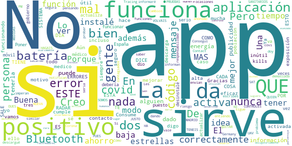

# Radar COVID
App version ``1.2.0``

Analyzed with [covid-apps-observer](http://github.com/covid-apps-observer) project, version ``0.1``

## App overview
| | |
|-------------------------|-------------------------| 
| **Name**&nbsp;&nbsp;&nbsp;&nbsp;&nbsp;&nbsp;&nbsp;&nbsp;&nbsp;&nbsp;&nbsp;&nbsp;&nbsp;&nbsp;&nbsp;&nbsp;&nbsp;&nbsp;&nbsp;&nbsp;&nbsp;&nbsp;&nbsp;&nbsp;&nbsp;&nbsp;&nbsp;&nbsp;&nbsp;&nbsp;&nbsp;&nbsp;&nbsp;&nbsp;&nbsp;&nbsp;&nbsp;&nbsp;&nbsp;&nbsp;  | Radar COVID |
| **Unique identifier** | es.gob.radarcovid |
| **Link to Google Play** | [https://play.google.com/store/apps/details?id=es.gob.radarcovid](https://play.google.com/store/apps/details?id=es.gob.radarcovid) |
| **Summary**  | Radar COVID, app oficial de prevención del COVID-19 del Gobierno de España |
| **Privacy policy** | [https://radarcovid.covid19.gob.es/terms-of-service/privacy-policy.html](https://radarcovid.covid19.gob.es/terms-of-service/privacy-policy.html) |
| **Latest version** | 1.2.0 |
| **Last update** | 2020-12-17 18:27:09 |
| **Recent changes** | - Actualización versión DP-3T. - Vista de Estadísticas Radar COVID. - Vista de información del estado de la aplicación. - Recordatorio de apertura de la aplicación. - Contador confinamiento. - Compartir enlace para facilitar descarga. - Añadido idioma Francés. - Introducción de código desde SMS. - Mejoras de accesibilidad:    Aumento de tamaño de texto y contraste.    Cambio en el estilo de los enlaces.    Etiquetado de elementos en pantalla.    Incorporación de encabezados. |
| **Installs**  | 1.000.000+ |
| **Category** | Medicina |
| **First release** | 7 ago 2020 |
| **Size**  | 22M |
| **Supported Android version**  | 6.0 y versiones posteriores |

### Description
> Radar COVID es la aplicación diseñada y dirigida por la Secretaría de Estado de Digitalización e Inteligencia Artificial del Gobierno de España para ayudar a evitar la propagación del coronavirus (COVID-19). 
 Radar COVID te avisa de manera anónima del posible contacto que has podido tener en los últimos 14 días con una persona que haya resultado infectada utilizando la tecnología Bluetooth de bajo consumo.
 Radar COVID además permite:
 -	Comunicar de forma anónima tu diagnóstico positivo.
 -	Comunicar la exposición de forma anónima a las personas con las que has estado en contacto 
 Radar COVID garantiza la seguridad y privacidad y es 100% anónimo. Por ello no solicitamos ni tu nombre, ni tu teléfono, ni tu correo electrónico. 
 Esta aplicación usa ilustraciones de licencia gratuita y que pertenecen a www.freepik.es

### User interface
The developers of the app provide the following screenshots in the Google play store.
| | | |
|:-------------------------:|:-------------------------:|:-------------------------:|
 |   |   |   | 
 |  

## Development team
In the following we report the main information provided by the development team in the Google play store.

| | |
|-------------------------|-------------------------|
| **Developer**  | Ministerio de Asuntos Económicos y Transf. Digital |
| **Website**  | - |
| **Email** | soporte.radarcovid@economia.gob.es |
| **Physical address**  | - |
| **Other developed apps**  | [https://play.google.com/store/apps/developer?id=Ministerio+de+Asuntos+Econ%C3%B3micos+y+Transf.+Digital](https://play.google.com/store/apps/developer?id=Ministerio+de+Asuntos+Econ%C3%B3micos+y+Transf.+Digital) |

## Android support

| | |
|-------------------------|-------------------------|
| **Declared target Android version**  | Android10, version 10 (API level 29) |
| **Effective target Android version**  | Android10, version 10 (API level 29) |
| **Minimum supported Android version**  | Marshmallow, version 6.0 (API level 23) |
| **Maximum target Android version**  | - |

The larger the difference between the minimum and maximum supported Android versions, the better. A larger difference means a wider audience. For example, old phones have a very low Android version, so a high minimum supported Android version means that the app cannot be used by users with old phones, thus leading to accessibility problems. 

## Requested permissions

In the following we report the complete list of the permissions requested by the app. 

| **Permission** | **Protection level** | **Description** | 
|-------------------------|-------------------------|-------------------------|
 **android.permission ACCESS_NETWORK_STATE** | Normal | Allows applications to access information about networks. 
 **android.permission BLUETOOTH** | Normal | Allows applications to connect to paired bluetooth devices. 
 **android.permission FOREGROUND_SERVICE** | Normal | Allows a regular application to use Service.startForeground. 
 **android.permission INTERNET** | Normal | Allows applications to open network sockets. 
 **android.permission RECEIVE_BOOT_COMPLETED** | Normal | Allows an application to receive the Intent.ACTION_BOOT_COMPLETED that is broadcast after the system finishes booting. 
 **android.permission REQUEST_IGNORE_BATTERY_OPTIMIZATIONS** | Normal | Permission an application must hold in order to use Settings.ACTION_REQUEST_IGNORE_BATTERY_OPTIMIZATIONS. 
 **android.permission WAKE_LOCK** | Normal | Allows using PowerManager WakeLocks to keep processor from sleeping or screen from dimming. 

## Mentioned servers

| **Server** | **Registrant** | **Registrant country** | **Creation date** | 
|-------------------------|-------------------------|-------------------------|-------------------------|
 | google.com | Google LLC | :us: US | 1997-09-15 04:00:00 |
 | ietf.org | IETF Trust | :us: US | 1995-03-11 05:00:00 |

## Security analysis 

Below we report the main security warnings raised by our execution of the [Androwarn](https://github.com/maaaaz/androwarn) security analysis tool.

**Connection interfaces exfiltration**
> - This application reads details about the currently active data network 
> - This application tries to find out if the currently active data network is metered 

**Telephony services abuse**
> - This application makes phone calls 

**Suspicious connection establishment**
> - This application opens a Socket and connects it to the remote address '; port is out of range' on the 'N/A' port  
> - This application opens a Socket and connects it to the remote address 'Lcom/android/tools/r8/GeneratedOutlineSupport;->outline15(Ljava/lang/String;)Ljava/lang/StringBuilder;' on the 'N/A' port  
> - This application opens a Socket and connects it to the remote address 'Ljava/net/Proxy;->type()Ljava/net/Proxy$Type;' on the 'N/A' port  
> - This application opens a Socket and connects it to the remote address 'timeout' on the 'N/A' port  

## User ratings and reviews

Below we provide information about how end users are reacting to the app in terms of ratings and reviews in the Google Play store.

### Ratings

The Radar COVID app has been installed by more than **1000000** times. At this time, **13257** rated the app and its average score is **3.0216258**. Below we show the distribution of the ratings across the usual star-based rating of Google Play

:star::star::star::star::star:: 5171

:star::star::star::star:: 1156

:star::star::star:: 1038

:star::star:: 573

:star:: 5319

### Reviews 

#### 5-star reviews

> Quiero la vacuna  :date: __2020-12-28 11:05:55__

> Excelente  :date: __2020-12-28 01:36:51__

> Se nesesita !!!  :date: __2020-12-27 20:58:12__

> Me gusta la iniciativa de este pograma  :date: __2020-12-27 20:12:57__

> Me gusta está aplicación  :date: __2020-12-27 18:46:06__

> R A D A R C O V I D  :date: __2020-12-27 17:43:22__

> He ganado 1000 dólares en 6 días. Cuando entre pensaba que era otro de tantos juegos falsos que te dicen que puedes ganar dinero jugando a el, pero es cierto, el primer día me lleve 100 dólares!! Y el según 250!!! Es increíble!!! Se lo recomiendo a todo el mundo!!!!!!! Ahora voy ha pagar a unas mujeres para que me limpien mi casa!!!!! Lo que no saben es la sorpresa que les tengo preparado!!!!!!!! Saludos desde Guadalajara!!!!!!!!!!  :date: __2020-12-27 17:36:11__

> Necesaria y sin trampas ni cartón.  :date: __2020-12-27 17:24:28__

> Confio en su eficacia  :date: __2020-12-27 16:06:00__

> Buena  :date: __2020-12-27 15:34:45__

#### 4-star reviews

> Yo solo me lo istale porque creia que era para crear skins del minecraft  :date: __2020-12-27 15:32:21__

> Útil pero poco difundida por administraciones. No funciona si la arrancas o activas Bluetooth en el metro o sin cobertura. (Es una pena ver opiniones negativas sin ningún fundamento, sino solo prejuicios.)  :date: __2020-12-26 18:51:17__

> Punto número 1 para saber si has entrado en contacto con alguien positivo se tiene que dar la circunstancia que esa persona tenga instalada la app y lo comunique a través de ella que si no es lo mismo que si tengo tos y me rasco la barriga, no sirve. Después de esto si comunicar que a mí me está fallando a la hora de hacer el resumen, me da error teniendo todo como se requiere. El fallo lleva como 3 semanas dándolo.  :date: __2020-12-26 17:01:05__

> Importante  :date: __2020-12-26 14:10:49__

> Actualizo: errores desaparecieron tras actualización. Es necesario que la tengan muchas personas para que sea efectiva. Requiere tener permisos de inicio automático y ninguna restricción para que esté constantemente activa. Problema: su uso no está generalizado ni cerca de estarlo por lo que resulta inútil sin ese mínimo de personas con la app en uso; al SAS parece que no le gusta. ¡Ojalá la sociedad tuviese algo de conciencia colectiva!. Actualizo: vuelven los mensajes de error. La desinstalo.  :date: __2020-12-26 07:48:30__

> De mucho probecho  :date: __2020-12-25 23:46:01__

> Buena  :date: __2020-12-25 21:31:13__

> Afortunadamente no he tenido la enfermedad y creo en esta aplicacion para mas psivilidad de contener esta pandemia  :date: __2020-12-25 09:56:06__

> Me parece bien que yo me entere de que alguien que esté cerca de mí yo enterarme genial  :date: __2020-12-24 08:10:19__

> No puedo decir si es eficaz.Ya que no ha llegado el momento de avisarme. Si he estado en contacto con x usuarios positivos...  :date: __2020-12-23 07:27:09__

#### 3-star reviews

> La llevó usando desde que salió nunca me ha llegado una notificación, no sé si eso es bueno o malo  :date: __2020-12-28 11:44:31__

> I 92 the ltrrb  :date: __2020-12-27 11:20:44__

> No tengo experienci en el tema  :date: __2020-12-27 11:11:44__

> No sirve de nada si la gente no generaliza su uso  :date: __2020-12-27 10:24:49__

> No lo sé manejar  :date: __2020-12-27 00:49:37__

> No funciona correctamente y da muchos errores  :date: __2020-12-27 00:27:42__

> Yo la he tenido meses y ni un solo aviso cosa que veo dificil no haya tenido cerca contactos dado que tengo familiares que ya han superado el covid si que es cierto que si no se da el aviso del positivo por la app es imposible controlar nada yo creo que nosotros mismos en lugar de quejarnos deberiamos dar a conocer esta app a traves de redes sociales que suele ser lo que mejor funciona pero en españa nos quejamos y no ponemos remedio.conpartid app y solidarizaros ya españoles  :date: __2020-12-27 00:22:10__

> No funciona en mi en mi móvil, es posible sea hora de cambiar de móvil tengo un ZTE A6  :date: __2020-12-26 19:09:23__

> En un mundo sin analfabetos digitales esta aplicación sería muy util. La idea de la aplicación es cojonuda si todos el mundo la hubiera usado correctamente.  :date: __2020-12-26 17:07:16__

> La app pide que mantengamos el bluetooth activado pero no dice nada de tenerlo VISIBLE. Si dos terminales no VEN sus señales Bluetooth es como si no estuvieran próximos. La app debe de forzar a tener el bluetooth visible en todo momento. Es algo básico no entiendo que no lo digán. Seguro que la mayoría de los usuarios tienen la señal oculta.  :date: __2020-12-26 11:13:21__

#### 2-star reviews

> Últimamente solo me sale un mensaje de error de la app, aún teniendo Bluetooth y GPS activados todo el día, no sé a qué se debe este error. De momento he decidido desinstalarla.  :date: __2020-12-28 10:41:22__

> La he instalado y desinstalado 2 veces, cuando salió y hace poco para ver si habían corregido los errores, pero no. Aparece el mismo error: desactivar modo ahorro batería para su correcto funcionamiento. Sin tener ese modo activado. Una lástima porque era una buena idea.  :date: __2020-12-28 01:12:49__

> Todos sabemos los fallos de esta App  :date: __2020-12-27 12:08:50__

> No funciona  :date: __2020-12-27 09:25:51__

> Yttririky  :date: __2020-12-26 12:19:19__

> Para mí está aplicación no es una mala idea pero yo en horario laboral no uso el móvil y fuera del ámbito laboral es muy raro que visite sitios concurridos en esta situación, por eso mismo tras unos meses de uso lo desinstalare pues lo veo inservible  :date: __2020-12-25 13:40:19__

> Es mala en el sentido de que las personas que deberían de tenerla instalada, ya que son positivos, para los que no, pues cuidarnos y nos salga la notificación.... Pues es gente no la tiene, y dices pa que tener esta aplicación si no te avisa de nada por eso😅🤣🤣es absurdo  :date: __2020-12-25 11:33:19__

> Esta bien pensando pero tiene que darse de alta uno mismo mucha gente no querrá aún que sea anónimo más la gente que no sepa usar bien las app del móvil luego llevar siempre bluetooth tu y la otra persona, nose está bien pensando pero creo que la utilidad que tiene que hacer no la hace  :date: __2020-12-25 00:27:30__

> Da un error de carga de datos continua Y ahora me dice que no puedo usarla sin actualizar, pero no hay actualización. Por otro lado dice que no funciona correctamente porque tengo el ahorro de batería activado, aunque esta desactivado.  :date: __2020-12-24 16:46:32__

> absoluta basura, he estado en contacto con un infectado que también tenía la aplicación y no me notificó  :date: __2020-12-24 14:49:40__

#### 1-star reviews

> Ahora que han empezado a vacunar este sta aplicación disponible? Que han hecho estos DIEZ meses anteriores?  :date: __2020-12-28 12:18:30__

> La instale para probarla pero no me inspiro confianza ya que me aseguraba que no tenía nadie al rededor y estaba en un hospital..  :date: __2020-12-28 10:36:20__

> Hay que ser muy borrego para instalarse esta herramienta de la PLANDEMIA.  :date: __2020-12-28 10:20:20__

> 💩  :date: __2020-12-28 09:39:25__

> No la veo nada util , quien va a poner que tiene covid, y sobre todo, quien va a salir de casa estando infectado y va a poner bluetooth, en activo, para que le detecten?. Si una vez contagiado, sanidad lo pusiera obligatorio , sería más útil, pero hay esta la ley de protección de datos... es una app, con buena intención, pero imposible desarrollarla...es mi opinion...  :date: __2020-12-28 08:03:54__

> Hace unos meses pase el covid y no pude activar lo, me pedía un código que desconocía y no sabía a quién pedirlo  :date: __2020-12-28 06:10:59__

> No es funcional, su éxito dependerá de que cada usuario con el que nos crucemos cuente con la aplicación instalada en su dispositivo, tenga el Bluetooth encendido y de que los usuarios que la usen efectivamente reporten si están contagiados.  :date: __2020-12-28 06:07:55__

> Mala ...muy mala ...ELIMINADA .no me creo que moviendome por centros comerciales ,metro etc....aun no haya sonado ....muy raro  :date: __2020-12-28 05:45:04__

> Es malísima no la descarguéis siendo valorado por España va fatal como el gobierno una miserable aplicación  :date: __2020-12-28 04:44:50__

> No sirve para nada si solamente la usan cuatro gatos.  :date: __2020-12-28 02:02:50__

