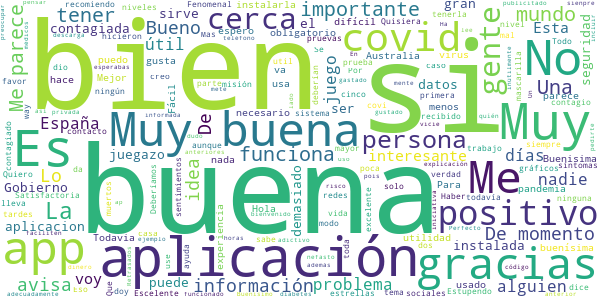

# Radar COVID
App version ``1.2.0``

Analyzed with [covid-apps-observer](http://github.com/covid-apps-observer) project, version ``0.1``

## App overview
| | |
|-------------------------|-------------------------| 
| **Name**&nbsp;&nbsp;&nbsp;&nbsp;&nbsp;&nbsp;&nbsp;&nbsp;&nbsp;&nbsp;&nbsp;&nbsp;&nbsp;&nbsp;&nbsp;&nbsp;&nbsp;&nbsp;&nbsp;&nbsp;&nbsp;&nbsp;&nbsp;&nbsp;&nbsp;&nbsp;&nbsp;&nbsp;&nbsp;&nbsp;&nbsp;&nbsp;&nbsp;&nbsp;&nbsp;&nbsp;&nbsp;&nbsp;&nbsp;&nbsp;  | Radar COVID |
| **Unique identifier** | es.gob.radarcovid |
| **Link to Google Play** | [https://play.google.com/store/apps/details?id=es.gob.radarcovid](https://play.google.com/store/apps/details?id=es.gob.radarcovid) |
| **Summary**  | Radar COVID, app oficial de prevención del COVID-19 del Gobierno de España |
| **Privacy policy** | [https://radarcovid.covid19.gob.es/terms-of-service/privacy-policy.html](https://radarcovid.covid19.gob.es/terms-of-service/privacy-policy.html) |
| **Latest version** | 1.2.0 |
| **Last update** | 2020-12-17 18:27:09 |
| **Recent changes** | - Actualización versión DP-3T. - Vista de Estadísticas Radar COVID. - Vista de información del estado de la aplicación. - Recordatorio de apertura de la aplicación. - Contador confinamiento. - Compartir enlace para facilitar descarga. - Añadido idioma Francés. - Introducción de código desde SMS. - Mejoras de accesibilidad:    Aumento de tamaño de texto y contraste.    Cambio en el estilo de los enlaces.    Etiquetado de elementos en pantalla.    Incorporación de encabezados. |
| **Installs**  | 1.000.000+ |
| **Category** | Medicina |
| **First release** | 7 ago 2020 |
| **Size**  | 22M |
| **Supported Android version**  | 6.0 y versiones posteriores |

### Description
> Radar COVID es la aplicación diseñada y dirigida por la Secretaría de Estado de Digitalización e Inteligencia Artificial del Gobierno de España para ayudar a evitar la propagación del coronavirus (COVID-19). 
 Radar COVID te avisa de manera anónima del posible contacto que has podido tener en los últimos 14 días con una persona que haya resultado infectada utilizando la tecnología Bluetooth de bajo consumo.
 Radar COVID además permite:
 -	Comunicar de forma anónima tu diagnóstico positivo.
 -	Comunicar la exposición de forma anónima a las personas con las que has estado en contacto 
 Radar COVID garantiza la seguridad y privacidad y es 100% anónimo. Por ello no solicitamos ni tu nombre, ni tu teléfono, ni tu correo electrónico. 
 Esta aplicación usa ilustraciones de licencia gratuita y que pertenecen a www.freepik.es

### User interface
The developers of the app provide the following screenshots in the Google play store.
| | | |
|:-------------------------:|:-------------------------:|:-------------------------:|
 |   |   |   | 
 |  

## Development team
In the following we report the main information provided by the development team in the Google play store.

| | |
|-------------------------|-------------------------|
| **Developer**  | Ministerio de Asuntos Económicos y Transf. Digital |
| **Website**  | - |
| **Email** | soporte.radarcovid@economia.gob.es |
| **Physical address**  | - |
| **Other developed apps**  | [https://play.google.com/store/apps/developer?id=Ministerio+de+Asuntos+Econ%C3%B3micos+y+Transf.+Digital](https://play.google.com/store/apps/developer?id=Ministerio+de+Asuntos+Econ%C3%B3micos+y+Transf.+Digital) |

## Android support

| | |
|-------------------------|-------------------------|
| **Declared target Android version**  | Android10, version 10 (API level 29) |
| **Effective target Android version**  | Android10, version 10 (API level 29) |
| **Minimum supported Android version**  | Marshmallow, version 6.0 (API level 23) |
| **Maximum target Android version**  | - |

The larger the difference between the minimum and maximum supported Android versions, the better. A larger difference means a wider audience. For example, old phones have a very low Android version, so a high minimum supported Android version means that the app cannot be used by users with old phones, thus leading to accessibility problems. 

## Requested permissions

In the following we report the complete list of the permissions requested by the app. 

| **Permission** | **Protection level** | **Description** | 
|-------------------------|-------------------------|-------------------------|
 **android.permission ACCESS_NETWORK_STATE** | Normal | Allows applications to access information about networks. 
 **android.permission BLUETOOTH** | Normal | Allows applications to connect to paired bluetooth devices. 
 **android.permission FOREGROUND_SERVICE** | Normal | Allows a regular application to use Service.startForeground. 
 **android.permission INTERNET** | Normal | Allows applications to open network sockets. 
 **android.permission RECEIVE_BOOT_COMPLETED** | Normal | Allows an application to receive the Intent.ACTION_BOOT_COMPLETED that is broadcast after the system finishes booting. 
 **android.permission REQUEST_IGNORE_BATTERY_OPTIMIZATIONS** | Normal | Permission an application must hold in order to use Settings.ACTION_REQUEST_IGNORE_BATTERY_OPTIMIZATIONS. 
 **android.permission WAKE_LOCK** | Normal | Allows using PowerManager WakeLocks to keep processor from sleeping or screen from dimming. 

## Mentioned servers

| **Server** | **Registrant** | **Registrant country** | **Creation date** | 
|-------------------------|-------------------------|-------------------------|-------------------------|
 | google.com | Google LLC | :us: US | 1997-09-15 04:00:00 |
 | ietf.org | IETF Trust | :us: US | 1995-03-11 05:00:00 |

## Security analysis 

Below we report the main security warnings raised by our execution of the [Androwarn](https://github.com/maaaaz/androwarn) security analysis tool.

**Connection interfaces exfiltration**
> - This application reads details about the currently active data network 
> - This application tries to find out if the currently active data network is metered 

**Telephony services abuse**
> - This application makes phone calls 

**Suspicious connection establishment**
> - This application opens a Socket and connects it to the remote address '; port is out of range' on the 'N/A' port  
> - This application opens a Socket and connects it to the remote address 'Lcom/android/tools/r8/GeneratedOutlineSupport;->outline15(Ljava/lang/String;)Ljava/lang/StringBuilder;' on the 'N/A' port  
> - This application opens a Socket and connects it to the remote address 'Ljava/net/Proxy;->type()Ljava/net/Proxy$Type;' on the 'N/A' port  
> - This application opens a Socket and connects it to the remote address 'timeout' on the 'N/A' port  

## User ratings and reviews

Below we provide information about how end users are reacting to the app in terms of ratings and reviews in the Google Play store.

### Ratings

The Radar COVID app has been installed by more than **1000000** times. At this time, **13257** rated the app and its average score is **3.0216258**. Below we show the distribution of the ratings across the usual star-based rating of Google Play

:star::star::star::star::star:: 5171

:star::star::star::star:: 1156

:star::star::star:: 1038

:star::star:: 573

:star:: 5319

### Reviews 

#### 5-star reviews

> Me encanta porque si tiene algún el cocido lo puedo saber😜😜😜  :date: __2020-12-20 20:48:07__

> Yo estuve el jueves con un positivo que se dio el viernes  :date: __2020-12-20 17:01:38__

> Actualizo: errores desaparecieron tras actualización. Es necesario que la tengan muchas personas para que sea efectiva. Requiere tener permisos de inicio automático y ninguna restricción para que esté constantemente activa. Tras meses de uso creo que la desinstalaré: su uso no está generalizado ni cerca de estarlo y, por tanto, no compensa que esté 24 horas funcionando ya que resulta inútil sin ese mínimo de personas con la app en uso. ¡Ojalá la sociedad tuviese algo de conciencia colectiva!  :date: __2020-12-20 09:23:20__

> No tengo tarjeta SIM y no puedo utilizar vuestra aplicación.  :date: __2020-12-19 19:54:18__

> Es la mejor aplicacion la recomiendo mucho  :date: __2020-12-19 11:08:12__

> Creo q es una buena herramienta ojala la ubise tenido antes, si todos la tenemos, acabremos con los contagios cuanto antes.  :date: __2020-12-19 09:15:09__

> Funciona perfectamente, prácticamente no gasta batería (gasta más mi teclado que la app). Deberían descargársela todos para que sea más eficaz.  :date: __2020-12-19 01:39:59__

> Mi opinión es buena aplicación  :date: __2020-12-18 22:42:40__

> NO DUDES EN INSTALARLA. Esta aplicación no sirve para nada si no se la instala nadie, cuanta más gente la tenga más efectiva será  :date: __2020-12-18 20:48:53__

> Si no funciona aún en mi comunidad, de que me vale tenerla en el móvil?? Para que el bluetooth gaste batería  :date: __2020-12-18 20:42:55__

#### 4-star reviews

> Siento más seguridad  :date: __2020-12-19 22:07:05__

> La aplicación ha mwjorado, incluso las fuentes de letra están mejor contrastadas, pero... 쯇or qué seguimos con ese tema claro? Soy desarrollador y se que no es difícil añadir la opción de tema oscuro. El fondo blanco es DA칌INO para la retina, y además hace imposible su uso a las personas con retinopatías, discriminando de facto al colectivo de discapaciatados visuales. Buen trabajo, pero aun le falta.  :date: __2020-12-19 19:44:09__

> Si quieren que funcione deben darle mas propaganda y que mas personas la usen... Pero tener el gps y el usb encendido todo el tiempo nos deja a muchos sin bateria, lamentablemente.  :date: __2020-12-18 23:00:37__

> No tengo ninguna, pero necesito saber quién puede tener Él Covid19.Asi cuando pasé por alguna persona que lo tenga,me suene Él Radar Covid19....  :date: __2020-12-18 16:16:08__

> Muy bueno 😃  :date: __2020-12-17 20:19:25__

> No me funciona correctamente.  :date: __2020-12-16 20:27:09__

> Buenos gráficos y buena jugabilidas. Ayer me hice 5 kills😎  :date: __2020-12-15 14:50:30__

> Sería bueno que se animara a muchas más personas a que la usaran, pues la llevo usando desde el principio y no veo que tenga mucho sentido si solo somos unos pocos los que la usamos, además cuando la tengo activa el Bluetooth no me funciona el manos libre en el coche.  :date: __2020-12-15 14:01:37__

> De momento no ,errecibido ninguna ,comunicacion  :date: __2020-12-13 14:16:41__

> Buena  :date: __2020-12-13 10:30:09__

#### 3-star reviews

> Una app que está bien, podría ayudar mucho ha hacer unos rastreos útiles pero las CCAA no quieren utilizarlas... Da pena que no puedan obligar a utilizarla.  :date: __2020-12-18 11:25:57__

> A ver yo pienso que la app es buena si nos la descargamos todos, y si en los centros de salud dieran el código, si no la app no vale para nada. Es que no puedo comprobar si da resultados si mi entorno no la tiene descargada. Y mira que la envíe para que la descargarán pero pasan así que es una pena.  :date: __2020-12-17 20:27:23__

> Si todos se la instalan haría algo pero se supone que ha registrado una sola vez bien desde hace 4 meses  :date: __2020-12-16 21:46:53__

> No he tenido ninguna experiencia  :date: __2020-12-16 13:46:04__

> Poco eficaz debido a que hay poca gente que la tenga instalada  :date: __2020-12-16 12:47:32__

> cuando tuve covid lo notifiqué en la aplicación y ahora que ya mo tengo no hay manera de decirle a la aplicación que ya no tengo  :date: __2020-12-16 06:50:44__

> 쯉irve para algo ?  :date: __2020-12-15 22:27:50__

> Los gráficos son muy buenos y lo que más me gusta es cuando te sale la palabra kill y puedes matar a todo el mundo que querías pero lo malo esq solo dura 37 segundos por eso no le doy 5 estrellas  :date: __2020-12-15 18:36:32__

> 27557 Esgumer  :date: __2020-12-15 08:53:50__

> Es un poco royo la aplicación, supuestamente la tendríamos que tener todos y escribir cuando estás en contacto con alguien infectado y si te acercas a una persona infectada te avisa o algo así  :date: __2020-12-13 23:32:53__

#### 2-star reviews

> No realiza las actualizaciones desde el 25 de noviembre  :date: __2020-12-18 18:45:19__

> Ki  :date: __2020-12-18 17:40:01__

> Desde hace tres días, envía notificaciones de noche ( sobre las 4 h).por tener el modo avión y no hay manera de impedirlo  :date: __2020-12-16 06:12:28__

> Es muy molesto tener siempre el bluetooth encendido y la notificación permanente.  :date: __2020-12-15 18:07:53__

> Gasta tanto GPS como Bluetooth, dice laa app que no es necesario el GPS pero luego te lo exige para funcionar por lo que gasta la batería en un momento y la hace inútil. Una pena la verdad, me costó convencerme, me la baje y al pasarme esto acabe desinstalandola.  :date: __2020-12-15 16:43:20__

> La llevo siempre por colaborar en esta pandemia, pero tengo la intuición de que no avisa de nada. He conocido personas con covid y nunca les dieron el codigo  :date: __2020-12-14 22:14:59__

> No avisa. Porque no lo usa la población en general. Faltó Didactica e Implicación. Con titubeos no se es Creible. Y si mientes. No te volverán a hacer caso.  :date: __2020-12-13 14:01:18__

> Cuando le doy a activar el radar me pone que no esta disponible, ni con wifi a tope ni con datos.  :date: __2020-12-12 14:17:29__

> Me tenía desesperada que no funcionaba por tener el ahorro de energía activado (sin estar), encontré la solución leyendo otras reseñas. Lo he tenido ok hasta ahora, que me pide de repente activar la ubicación y lo voy a desinstalar. Ya me gustaba poco el bluetooth siempre activo y ahora además la ubicación, cuando el Gobierno anuncia otro estudio de movilidad basado en acceder a las ubicaciones móviles. No me gusta.  :date: __2020-12-11 18:28:19__

> Una aplicación que deberíamos tener todos instalada en el móvil, pero luego resulta que doy positivo y no me dan en ningún momento el código que me pide la aplicación cuando tengo mi resultado. No le pongo una estrella porque la aplicación sí que me parece muy importante.  :date: __2020-12-08 02:58:28__

#### 1-star reviews

> el pvp está mal implementado, la creación de personajes tiene pocas opciones y el looteo se hace muy escaso para que compres las lootboxes, aunque la historia es bastante original  :date: __2020-12-20 19:23:32__

> Y una estrella es dar mucho...  :date: __2020-12-20 19:22:57__

> 쮸lguien conoce a alguien que conozca a alguien que conozca a alguien a quien esta aplicación le haya informado de algún posible contacto de riesgo?  :date: __2020-12-20 16:07:32__

> No funciona, acabo de dar positivo y no me coje el código varias veces. Así nos va...  :date: __2020-12-20 13:41:42__

> Mientras exista una ley de protección de datos para cosas como esta, la gente no sea más responsable, solo haya una voz desde el punto de vista de Autoridad. Estas apps no valen para nada. Observar China, un QR para toda la población y obligatoria, Control total y una sola voz gobernante.  :date: __2020-12-20 12:15:27__

> No vale absolutamente para nada  :date: __2020-12-20 12:02:57__

> Es una engañifa  :date: __2020-12-20 09:48:58__

> Pues sepan que casi nadie la instala porque consume mucha energía de la y así no hay quien la instale... Y si esto es el refuerzo del Estado... vaya tela...  :date: __2020-12-20 09:26:14__

> A tomar viento, me la quito, no funciona ni sirve para nada. Creo que la tenía instalada yo y Fernando Simón!  :date: __2020-12-20 09:19:09__

> No funciona. Una compañera de trabajo nuestra metio el codigo que le dieron al notificarle su positivo pero a nadie de su entorno de trabajo nos ha llegado ninguna notificación de que hayamos tenido un contacto. Es una pena que no funcione.  :date: __2020-12-20 08:35:58__

