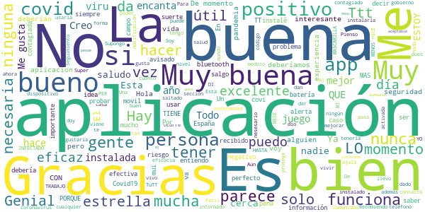

# Radar COVID
App version ``1.3.0``

Analyzed with [covid-apps-observer](http://github.com/covid-apps-observer) project, version ``0.1``

## App overview
| | |
|-------------------------|-------------------------| 
| **Name**&nbsp;&nbsp;&nbsp;&nbsp;&nbsp;&nbsp;&nbsp;&nbsp;&nbsp;&nbsp;&nbsp;&nbsp;&nbsp;&nbsp;&nbsp;&nbsp;&nbsp;&nbsp;&nbsp;&nbsp;&nbsp;&nbsp;&nbsp;&nbsp;&nbsp;&nbsp;&nbsp;&nbsp;&nbsp;&nbsp;&nbsp;&nbsp;&nbsp;&nbsp;&nbsp;&nbsp;&nbsp;&nbsp;&nbsp;&nbsp;  | Radar COVID |
| **Unique identifier** | es.gob.radarcovid |
| **Link to Google Play** | [https://play.google.com/store/apps/details?id=es.gob.radarcovid](https://play.google.com/store/apps/details?id=es.gob.radarcovid) |
| **Summary**  | Radar COVID, app oficial de prevención del COVID-19 del Gobierno de España |
| **Privacy policy** | [https://radarcovid.covid19.gob.es/terms-of-service/privacy-policy.html](https://radarcovid.covid19.gob.es/terms-of-service/privacy-policy.html) |
| **Latest version** | 1.3.0 |
| **Last update** | 2021-02-17 13:20:51 |
| **Recent changes** | - Modificaciones en política de privacidad. - Reporte de métrica anónima para medir eficiencia de la aplicación. - Se añade idioma rumano. - Corrección de errores. - Mejoras de accesibilidad: 	--  Corregido encabezado de “Cambio de estado” en el pop up de 14 días que el lector de pantalla no leía. 	-- Incorporación de iconos de cierre en los ventanas emergentes. |
| **Installs**  | 5.000.000+ |
| **Category** | Medicina |
| **First release** | 7 ago 2020 |
| **Size**  | 22M |
| **Supported Android version**  | 6.0 y versiones posteriores |

### Description
> Radar COVID es la aplicación diseñada y dirigida por la Secretaría de Estado de Digitalización e Inteligencia Artificial del Gobierno de España para ayudar a evitar la propagación del coronavirus (COVID-19). 
 Radar COVID te avisa de manera anónima del posible contacto que has podido tener en los últimos 14 días con una persona que haya resultado infectada utilizando la tecnología Bluetooth de bajo consumo.
 Radar COVID además permite:
 -	Comunicar de forma anónima tu diagnóstico positivo.
 -	Comunicar la exposición de forma anónima a las personas con las que has estado en contacto 
 Radar COVID garantiza la seguridad y privacidad y es 100% anónimo. Por ello no solicitamos ni tu nombre, ni tu teléfono, ni tu correo electrónico. 
 Esta aplicación usa ilustraciones de licencia gratuita y que pertenecen a www.freepik.es

### User interface
The developers of the app provide the following screenshots in the Google play store.
| | | |
|:-------------------------:|:-------------------------:|:-------------------------:|
 |   |   |   | 
 |  

## Development team
In the following we report the main information provided by the development team in the Google play store.

| | |
|-------------------------|-------------------------|
| **Developer**  | Ministerio de Asuntos Económicos y Transf. Digital |
| **Website**  | - |
| **Email** | soporte.radarcovid@economia.gob.es |
| **Physical address**  | - |
| **Other developed apps**  | [https://play.google.com/store/apps/developer?id=Ministerio+de+Asuntos+Econ%C3%B3micos+y+Transf.+Digital](https://play.google.com/store/apps/developer?id=Ministerio+de+Asuntos+Econ%C3%B3micos+y+Transf.+Digital) |

## Android support

| | |
|-------------------------|-------------------------|
| **Declared target Android version**  | Android10, version 10 (API level 29) |
| **Effective target Android version**  | Android10, version 10 (API level 29) |
| **Minimum supported Android version**  | Marshmallow, version 6.0 (API level 23) |
| **Maximum target Android version**  | - |

The larger the difference between the minimum and maximum supported Android versions, the better. A larger difference means a wider audience. For example, old phones have a very low Android version, so a high minimum supported Android version means that the app cannot be used by users with old phones, thus leading to accessibility problems. 

## Requested permissions

In the following we report the complete list of the permissions requested by the app. 

| **Permission** | **Protection level** | **Description** | 
|-------------------------|-------------------------|-------------------------|
 **android.permission ACCESS_NETWORK_STATE** | Normal | Allows applications to access information about networks. 
 **android.permission BLUETOOTH** | Normal | Allows applications to connect to paired bluetooth devices. 
 **android.permission FOREGROUND_SERVICE** | Normal | Allows a regular application to use Service.startForeground. 
 **android.permission INTERNET** | Normal | Allows applications to open network sockets. 
 **android.permission RECEIVE_BOOT_COMPLETED** | Normal | Allows an application to receive the Intent.ACTION_BOOT_COMPLETED that is broadcast after the system finishes booting. 
 **android.permission REQUEST_IGNORE_BATTERY_OPTIMIZATIONS** | Normal | Permission an application must hold in order to use Settings.ACTION_REQUEST_IGNORE_BATTERY_OPTIMIZATIONS. 
 **android.permission WAKE_LOCK** | Normal | Allows using PowerManager WakeLocks to keep processor from sleeping or screen from dimming. 

## Mentioned servers

| **Server** | **Registrant** | **Registrant country** | **Creation date** | 
|-------------------------|-------------------------|-------------------------|-------------------------|
 | google.com | Google LLC | :us: US | 1997-09-15 04:00:00 |
 | ietf.org | IETF Trust | :us: US | 1995-03-11 05:00:00 |

## Security analysis 

Below we report the main security warnings raised by our execution of the [Androwarn](https://github.com/maaaaz/androwarn) security analysis tool.

**Connection interfaces exfiltration**
> - This application reads details about the currently active data network 
> - This application tries to find out if the currently active data network is metered 

**Telephony services abuse**
> - This application makes phone calls 

**Suspicious connection establishment**
> - This application opens a Socket and connects it to the remote address '; port is out of range' on the 'N/A' port  
> - This application opens a Socket and connects it to the remote address 'Lcom/android/tools/r8/GeneratedOutlineSupport;->outline15(Ljava/lang/String;)Ljava/lang/StringBuilder;' on the 'N/A' port  
> - This application opens a Socket and connects it to the remote address 'Ljava/net/Proxy;->type()Ljava/net/Proxy$Type;' on the 'N/A' port  
> - This application opens a Socket and connects it to the remote address 'timeout' on the 'N/A' port  

## User ratings and reviews

Below we provide information about how end users are reacting to the app in terms of ratings and reviews in the Google Play store.

### Ratings

The Radar COVID app has been installed by more than **5000000** times. At this time, **17370** rated the app and its average score is **2.716753**. Below we show the distribution of the ratings across the usual star-based rating of Google Play

:star::star::star::star::star:: 5520

:star::star::star::star:: 1620

:star::star::star:: 1050

:star::star:: 780

:star:: 8400

### Reviews 

#### 5-star reviews

> Muy necesaria para poder tener buena información  :date: __2021-02-26 20:48:12__

> Muí buenas  :date: __2021-02-26 19:37:07__

> Hay que instalarla. Imprescindible. Es la única forma de hacer seguimiento de los positivos, ya que las AAPP no han querido hacer las labores de rastreo necesarias. Le vida de muchas personas está en juego.  :date: __2021-02-26 09:22:19__

> Instalé esta app y la cobertura de 5G a mejorado mucho! Gracias Bill Gates!  :date: __2021-02-26 07:36:00__

> Supongo que es buena  :date: __2021-02-26 02:05:43__

> Pues de momento la e activado hoy espero que sirva para algo bueno 👍  :date: __2021-02-25 19:47:59__

> Tiene muy buenos graficos y el gefe final es de lo más currado también las pantallas de carga y eso de ir te pida los seis dígitos de tu target de crédito le da un toque a ciberpunk tremenda aplicación ojalá sacen la 2 saga  :date: __2021-02-25 18:50:33__

> Al  :date: __2021-02-25 13:35:39__

> Es la mejor aplicación para hacer tests de covid  :date: __2021-02-24 20:55:39__

> Positiva , buena Muy importante ,,me siento un poco más protegida  :date: __2021-02-24 12:58:29__

#### 4-star reviews

> Chachy  :date: __2021-02-25 16:49:34__

> Regular  :date: __2021-02-25 12:20:14__

> Buena  :date: __2021-02-24 22:20:01__

> Estoy en residencia de mayores. Vacunada con 2 dosis y controles frecuentes siempre negativos 78 años  :date: __2021-02-24 01:35:15__

> Parece que ya va bien.  :date: __2021-02-23 18:28:27__

> Bien hasta hasta hora  :date: __2021-02-23 07:46:54__

> Bien  :date: __2021-02-22 15:49:33__

> El juego un poco difícil si no mezclas el virus con la plaga porque es una combinación bastante chetada. El boss final no tiene muchos ataques pero te infectan con vacunas y te dejan veneno y sangrado. Un juego mediocre 4 estrellas se merece.  :date: __2021-02-22 12:58:14__

> Buena. Si tiene Efectos!  :date: __2021-02-21 20:11:27__

> Necesaria  :date: __2021-02-21 18:36:59__

#### 3-star reviews

> Aparentemente funciona bien, pero si intento abrir la pestaña «como actuar si tengo sintomas», aparece error «no ae puede abrir pdf». ¿Se puede solucionar ese error? Gracias  :date: __2021-02-23 12:21:10__

> Poca aceptacion ciudadana, debido a poca pedagogia  :date: __2021-02-22 10:42:26__

> De momento no me habran tenido que avisar creo yo.Asi que no se como funciona aun.  :date: __2021-02-21 20:56:50__

> Con la última actualización se ha quedado colgado y no termina  :date: __2021-02-21 11:38:42__

> Porque hay mantener el bluetooth  :date: __2021-02-21 11:00:19__

> Me parece buena idea la app, pero deberían arreglar los fallos. Me sale continuamente un mensaje diciendo que no funciona correctamente, que quite el ahorro de datos (cosa que nunca está puesto) y me desespera. Ojalá la gente la usase de verdad.  :date: __2021-02-21 08:11:01__

> La verdad es que no sé como valorarla; no he recibido ningún aviso...  :date: __2021-02-20 17:24:31__

> No me gusta pero es un poco útil,enhorabuena!!!!  :date: __2021-02-20 12:10:20__

> Nuca me avisa si tengo alguien con covid a mi lado  :date: __2021-02-20 01:08:53__

> La tengo desde el principio, y creo que en ningún momento ha sido útil.  :date: __2021-02-20 01:02:22__

#### 2-star reviews

> Si el que da covid+ no tiene esta app abierta, puedo pasar al lado de 20 covi sin tener conocimiento de ello, es decir, con una patata no se hace el caldo  :date: __2021-02-26 18:40:18__

> La aplicación está muy bien. El problema es que los positivos no lo comunican. No quieren que les controlen donde estan NOMBRE  :date: __2021-02-24 17:53:49__

> Losiento ¿govierno pero vamos pudiese no atacar ala privacidad?? Graciaaas  :date: __2021-02-23 17:34:11__

> La idea es buena, pero la ejecución ha sido nefasta. La tasa de contagios declarada con la aplicación ha sido ínfima,y su coste no habrá sido pequeño.  :date: __2021-02-23 07:53:03__

> No me gusta no lo veo fiable  :date: __2021-02-21 00:03:08__

> No es de utilidad  :date: __2021-02-20 19:45:06__

> Muy bien  :date: __2021-02-20 19:29:06__

> De momento no es útil.La gente no está concienciada para usarla. Veo que la única opción es que sea obligatoria.  :date: __2021-02-20 18:45:28__

> La aplicación no es efectiva si se tarda mas de 4 dias en que te den el código para confirmar un positivo.  :date: __2021-02-20 14:31:52__

> La gente no lo usa y siempre da fuera de riesgo  :date: __2021-02-20 10:52:58__

#### 1-star reviews

> No sirve para nada  :date: __2021-02-27 11:31:22__

> No sirve de mucho puesto que no es muy usual.  :date: __2021-02-27 10:38:57__

> Coñito  :date: __2021-02-27 05:47:16__

> Funciona?  :date: __2021-02-26 19:55:46__

> Malísima! No funciona nunca!  :date: __2021-02-26 19:46:36__

> Desastre de aplicación que juegan con las vidas y encima cobran. Resumen.  :date: __2021-02-26 16:58:49__

> Creó, qué no sirve ni para qué nos controlen cómo dijeron!! Totalmente nefasta.  :date: __2021-02-26 14:55:10__

> Lamentable. No sirve para nada. Ninguna notificación en todos estos meses cuando he estado en contacto con varios casos positivos. No conozco a nadie que le haya notificado nada.  :date: __2021-02-26 14:01:17__

> Solo sirve para pcrs realizadas en la seguridad social ya q pide un numero al inicio y si la pcr esta hecha en la privada no te dan numero por lo que esta herramienta solo serviria para el q tenga nunero de pcr q pueda poner al inicio de la aplicación y para la poblacion que utilice la aplicación por lo q la eficacia se reduce al 15%  :date: __2021-02-26 07:17:52__

> No funciona, un sin sentido, gasto inútil del estado  :date: __2021-02-26 04:33:25__

