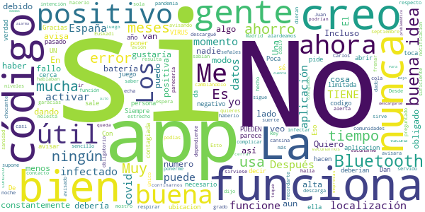

# Radar COVID
App version ``1.3.0``

Analyzed with [covid-apps-observer](http://github.com/covid-apps-observer) project, version ``0.1``

## App overview
| | |
|-------------------------|-------------------------| 
| **Name**&nbsp;&nbsp;&nbsp;&nbsp;&nbsp;&nbsp;&nbsp;&nbsp;&nbsp;&nbsp;&nbsp;&nbsp;&nbsp;&nbsp;&nbsp;&nbsp;&nbsp;&nbsp;&nbsp;&nbsp;&nbsp;&nbsp;&nbsp;&nbsp;&nbsp;&nbsp;&nbsp;&nbsp;&nbsp;&nbsp;&nbsp;&nbsp;&nbsp;&nbsp;&nbsp;&nbsp;&nbsp;&nbsp;&nbsp;&nbsp;  | Radar COVID |
| **Unique identifier** | es.gob.radarcovid |
| **Link to Google Play** | [https://play.google.com/store/apps/details?id=es.gob.radarcovid](https://play.google.com/store/apps/details?id=es.gob.radarcovid) |
| **Summary**  | Radar COVID, app oficial de prevención del COVID-19 del Gobierno de España |
| **Privacy policy** | [https://radarcovid.covid19.gob.es/terms-of-service/privacy-policy.html](https://radarcovid.covid19.gob.es/terms-of-service/privacy-policy.html) |
| **Latest version** | 1.3.0 |
| **Last update** | 2021-02-17 13:20:51 |
| **Recent changes** | - Modificaciones en política de privacidad. - Reporte de métrica anónima para medir eficiencia de la aplicación. - Se añade idioma rumano. - Corrección de errores. - Mejoras de accesibilidad: 	--  Corregido encabezado de “Cambio de estado” en el pop up de 14 días que el lector de pantalla no leía. 	-- Incorporación de iconos de cierre en los ventanas emergentes. |
| **Installs**  | 5.000.000+ |
| **Category** | Medicina |
| **First release** | 7 ago 2020 |
| **Size**  | 22M |
| **Supported Android version**  | 6.0 y versiones posteriores |

### Description
> Radar COVID es la aplicación diseñada y dirigida por la Secretaría de Estado de Digitalización e Inteligencia Artificial del Gobierno de España para ayudar a evitar la propagación del coronavirus (COVID-19). 
 Radar COVID te avisa de manera anónima del posible contacto que has podido tener en los últimos 14 días con una persona que haya resultado infectada utilizando la tecnología Bluetooth de bajo consumo.
 Radar COVID además permite:
 -	Comunicar de forma anónima tu diagnóstico positivo.
 -	Comunicar la exposición de forma anónima a las personas con las que has estado en contacto 
 Radar COVID garantiza la seguridad y privacidad y es 100% anónimo. Por ello no solicitamos ni tu nombre, ni tu teléfono, ni tu correo electrónico. 
 Esta aplicación usa ilustraciones de licencia gratuita y que pertenecen a www.freepik.es

### User interface
The developers of the app provide the following screenshots in the Google play store.
| | | |
|:-------------------------:|:-------------------------:|:-------------------------:|
 |   |   |   | 
 |  

## Development team
In the following we report the main information provided by the development team in the Google play store.

| | |
|-------------------------|-------------------------|
| **Developer**  | Ministerio de Asuntos Económicos y Transf. Digital |
| **Website**  | - |
| **Email** | soporte.radarcovid@economia.gob.es |
| **Physical address**  | - |
| **Other developed apps**  | [https://play.google.com/store/apps/developer?id=Ministerio+de+Asuntos+Econ%C3%B3micos+y+Transf.+Digital](https://play.google.com/store/apps/developer?id=Ministerio+de+Asuntos+Econ%C3%B3micos+y+Transf.+Digital) |

## Android support

| | |
|-------------------------|-------------------------|
| **Declared target Android version**  | Android10, version 10 (API level 29) |
| **Effective target Android version**  | Android10, version 10 (API level 29) |
| **Minimum supported Android version**  | Marshmallow, version 6.0 (API level 23) |
| **Maximum target Android version**  | - |

The larger the difference between the minimum and maximum supported Android versions, the better. A larger difference means a wider audience. For example, old phones have a very low Android version, so a high minimum supported Android version means that the app cannot be used by users with old phones, thus leading to accessibility problems. 

## Requested permissions

In the following we report the complete list of the permissions requested by the app. 

| **Permission** | **Protection level** | **Description** | 
|-------------------------|-------------------------|-------------------------|
 **android.permission ACCESS_NETWORK_STATE** | Normal | Allows applications to access information about networks. 
 **android.permission BLUETOOTH** | Normal | Allows applications to connect to paired bluetooth devices. 
 **android.permission FOREGROUND_SERVICE** | Normal | Allows a regular application to use Service.startForeground. 
 **android.permission INTERNET** | Normal | Allows applications to open network sockets. 
 **android.permission RECEIVE_BOOT_COMPLETED** | Normal | Allows an application to receive the Intent.ACTION_BOOT_COMPLETED that is broadcast after the system finishes booting. 
 **android.permission REQUEST_IGNORE_BATTERY_OPTIMIZATIONS** | Normal | Permission an application must hold in order to use Settings.ACTION_REQUEST_IGNORE_BATTERY_OPTIMIZATIONS. 
 **android.permission WAKE_LOCK** | Normal | Allows using PowerManager WakeLocks to keep processor from sleeping or screen from dimming. 

## Mentioned servers

| **Server** | **Registrant** | **Registrant country** | **Creation date** | 
|-------------------------|-------------------------|-------------------------|-------------------------|
 | google.com | Google LLC | :us: US | 1997-09-15 04:00:00 |
 | ietf.org | IETF Trust | :us: US | 1995-03-11 05:00:00 |

## Security analysis 

Below we report the main security warnings raised by our execution of the [Androwarn](https://github.com/maaaaz/androwarn) security analysis tool.

**Connection interfaces exfiltration**
> - This application reads details about the currently active data network 
> - This application tries to find out if the currently active data network is metered 

**Telephony services abuse**
> - This application makes phone calls 

**Suspicious connection establishment**
> - This application opens a Socket and connects it to the remote address '; port is out of range' on the 'N/A' port  
> - This application opens a Socket and connects it to the remote address 'Lcom/android/tools/r8/GeneratedOutlineSupport;->outline15(Ljava/lang/String;)Ljava/lang/StringBuilder;' on the 'N/A' port  
> - This application opens a Socket and connects it to the remote address 'Ljava/net/Proxy;->type()Ljava/net/Proxy$Type;' on the 'N/A' port  
> - This application opens a Socket and connects it to the remote address 'timeout' on the 'N/A' port  

## User ratings and reviews

Below we provide information about how end users are reacting to the app in terms of ratings and reviews in the Google Play store.

### Ratings

The Radar COVID app has been installed by more than **5000000** times. At this time, **17370** rated the app and its average score is **2.716753**. Below we show the distribution of the ratings across the usual star-based rating of Google Play

:star::star::star::star::star:: 5520

:star::star::star::star:: 1620

:star::star::star:: 1050

:star::star:: 780

:star:: 8400

### Reviews 

#### 5-star reviews

> Excelente App para avisarte cuando el Bluetooth de tu celular está apagado, le doy 5 estrellas porque no hay más y además soy fun de la Mahou 5 estrellas. Desde que la instalé no puedo vivir sin ella.  :date: __2021-04-28 21:34:38__

> Excelente  :date: __2021-04-28 05:13:00__

> Me ha encantado el juego me encanta que hayan sacado Plague Inc 2.0 tiene sistema de detección increíble y me encanta que ya venga una enfermedad gratis incluida porcierto me encanta que la cuarentena se tan efectiva que pena que la vacuna cueste tanto de sacar en España, Gracias  :date: __2021-04-27 11:13:30__

> Muy buena idea si la gente la usase  :date: __2021-04-26 21:27:58__

> Interesante ojala salga todo bien  :date: __2021-04-25 22:40:27__

> Es una a plicasion para qne noynforme der Covi y Deotras En Fermedade Co O Viru y Dendevienen Coma La Calentura Marta y La Fiebres Der Palodirmo y La Paperas y La Viruela Er Salanpion y La tuberculosis y Munhas más publica en Facebook Carmela RomeroMartin, Crm @ gomeil . CON.  :date: __2021-04-25 14:46:28__

> Lo tienen que llevar todos en el movil  :date: __2021-04-25 10:28:27__

> Pido ayuda me han quitado un mi soy María estrella  :date: __2021-04-24 14:02:12__

> Muy útil  :date: __2021-04-23 16:15:52__

> Wanderful  :date: __2021-04-21 15:15:45__

#### 4-star reviews

> Menudos sustos mete la "notificación semanal" de la última versión. Francamente ¿es necesario que avisen cada semana de que tienes las notificaciones de exposición activadadas? Eso ya lo sé, de hecho ¿para qué iba a quererlas desactivar si la finalidad de esta aplicación es que te notifique si has estado expuesto o notificar tú si has dado positivo? Francamente o el mensaje está equivocado o que te notifique de que la app funciona es no solamente innecesario sino alarmante. Por favor, revisenlo.  :date: __2021-04-15 12:58:24__

> Super  :date: __2021-04-13 15:10:01__

> Lo veo muy bien me gusta mucho estar informada  :date: __2021-04-11 16:24:14__

> Buena Si  :date: __2021-04-09 21:55:34__

> Esta muy bien  :date: __2021-03-29 10:06:36__

> Buena aplicación, como la mayoría de las dedicadas al fin del control de la epidemia. Su problema, la dejadez e ineptitud de una gran mayoría de la población.  :date: __2021-03-28 15:04:45__

> es intere sante  :date: __2021-03-26 04:33:17__

> Muy útil como idea, la pega, la escasa implantación... por tanto, dudoso resultado  :date: __2021-03-24 09:17:28__

> La APP muy bien. Di positivo y lo puse. Tardaron un par de días en mandarme el código. Eso debería ser más rápido. Al día siguiente les avisaron a mis contactos. Pero ahora ya no soy positivo y no se como quitarlo para que no me salga en rojo como si siguiera dando positivo. No es mala idea, pero debería ser más rápida y sencilla. Gracias  :date: __2021-03-22 09:03:26__

> Es muy util  :date: __2021-03-21 00:46:23__

#### 3-star reviews

> Me parecería muy útil si desde sanidad se dieran los códigos a la gente positiva. No conozco a nadie a quien le hayan dado un código,; y algunos que han preguntado por el código, no sabían ni de qué les hablaban  :date: __2021-04-30 16:56:19__

> Nunca he debido de estar el tiempo suficiente con un positivo con la app para que me avisara. Si que es muy cansina, creo que su función era recordarte constantemente que te podías infectar.  :date: __2021-04-25 10:16:36__

> Esto habría q haberlo hecho obligatorio para que sirviese para algo. Si nos han obligado a confinarnos, cerrar empresas y luego a toque de queda podrían haber obligado a descargarse una app q es mucho menos problemático. Para eso estamos en estado d alarma.  :date: __2021-04-22 22:12:42__

> El numero de personas con covid - 19 dadas de alta en esta aplicacion es muy bajo, teniendo en cuenta el alto numero de contagiados que ha habido en el pasado y que hay en el presente en España, hacen de esta aplicacion que su accion de avisar de que uno este cerca o proximo a una persona contagiada de covid es muy limitada y su influencia para limitar los contagios es muy limitada y precaria. Es una buena idea pero depende de la capacidad social, empatica y sentido de la solidaridad de España  :date: __2021-04-21 15:22:42__

> Después de bastante tienpo usándolo me acaba de decir que ahora tengo que darle permiso de ubicación, que antes no era necesario ¿Ha habido algún cambio en la aplicación? ¿Por qué es necesario ahora si antes no lo era porque usaba el Bluetooth?  :date: __2021-04-20 17:36:00__

> Dudo que funcione, tengo mis dudas.  :date: __2021-04-19 13:41:32__

> Siempre está que no funciona bien  :date: __2021-04-13 22:50:42__

> Bb  :date: __2021-04-11 12:42:12__

> Soy nuevo o novato, y acabo de descubrir esta aplicación, incluso no sé si lo he activado bien, espero que sí, me gustaría que me contestaran.  :date: __2021-04-11 11:26:01__

> Regular o muy pobre. De casos.  :date: __2021-04-07 13:56:47__

#### 2-star reviews

> No es muy buena app. No notifica NADA. Esto no va.  :date: __2021-05-01 13:18:25__

> Solo vale para ocupa espacio en el teléfono...Así q no merece la pena tenerla  :date: __2021-04-26 17:58:14__

> Si no tenemos todos la aplicacion,sirve poco  :date: __2021-04-24 16:50:52__

> No encuentro la forma de activarlo en POCO X3 PRO  :date: __2021-04-23 21:45:07__

> Cuando te pones a hacer las misiones finales es imposible conseguir el radar que te pone en la 5 fecha esque no es normal porfavor arreglen eso  :date: __2021-04-17 22:19:03__

> Lamentablemente no sirve para nada. Con tanta seguridad no hace su función ya que no es obligatoria tenerla instalada y menos aún activarla si alguien está infectado, además de que las personas asintomáticas no activarian el "modo infectado" al no saber su infección por lo que resta eficacia a la App. Deberían darle una solución más eficaz. La mejor protección es la prevención y sentido común.  :date: __2021-04-17 13:59:02__

> Poco útil  :date: __2021-04-15 10:36:07__

> S.i pusieran todos los demás seria mejor que ahora  :date: __2021-04-09 11:08:50__

> Lleva unas semanas con "Error al cargar nuevos datos de contactos de infección (LOST)" o "... (AGAEN 10.-2)." Antes funcionaba bien aunque tira mucho de la batería por el bluetooth encendido continuamente.  :date: __2021-04-08 18:13:57__

> Se puede mejorar y mucho  :date: __2021-04-07 23:43:04__

#### 1-star reviews

> Esta aplicación es una mentira como la existencia del sars-2  :date: __2021-05-01 19:11:11__

> No te avisa de nada  :date: __2021-05-01 18:35:05__

> Ehhhhh espera un momento no serás un smoke  :date: __2021-05-01 17:52:54__

> Horrible. No funciona nada. Estuve ingresado en una planta Covid 10 días y no me avisó mi una vez. Muy rara esa App.  :date: __2021-04-30 23:35:58__

> Nada, no vale para nada  :date: __2021-04-30 22:39:50__

> A que juegan?,dejen de gastar recursos sin motivo gobierno de España ,muere más gente de cáncer  :date: __2021-04-30 20:42:13__

> No existe el covid por que lo pones en tu cuenta  :date: __2021-04-30 20:13:47__

> No vale para nada  :date: __2021-04-30 09:12:20__

> Desinstalada no hay avisos ni ninguna información valiosa  :date: __2021-04-29 16:04:59__

> La desinstalo. Totalmente innecesaria  :date: __2021-04-29 15:57:10__

