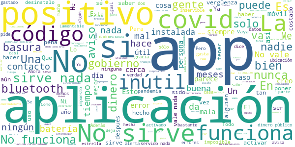

# Radar COVID
App version ``1.3.0``

Analyzed with [covid-apps-observer](http://github.com/covid-apps-observer) project, version ``0.1``

## App overview
| | |
|-------------------------|-------------------------| 
| **Name**&nbsp;&nbsp;&nbsp;&nbsp;&nbsp;&nbsp;&nbsp;&nbsp;&nbsp;&nbsp;&nbsp;&nbsp;&nbsp;&nbsp;&nbsp;&nbsp;&nbsp;&nbsp;&nbsp;&nbsp;&nbsp;&nbsp;&nbsp;&nbsp;&nbsp;&nbsp;&nbsp;&nbsp;&nbsp;&nbsp;&nbsp;&nbsp;&nbsp;&nbsp;&nbsp;&nbsp;&nbsp;&nbsp;&nbsp;&nbsp;  | Radar COVID |
| **Unique identifier** | es.gob.radarcovid |
| **Link to Google Play** | [https://play.google.com/store/apps/details?id=es.gob.radarcovid](https://play.google.com/store/apps/details?id=es.gob.radarcovid) |
| **Summary**  | Radar COVID, app oficial de prevención del COVID-19 del Gobierno de España |
| **Privacy policy** | [https://radarcovid.covid19.gob.es/terms-of-service/privacy-policy.html](https://radarcovid.covid19.gob.es/terms-of-service/privacy-policy.html) |
| **Latest version** | 1.3.0 |
| **Last update** | 2021-02-17 13:20:51 |
| **Recent changes** | - Modificaciones en política de privacidad. - Reporte de métrica anónima para medir eficiencia de la aplicación. - Se añade idioma rumano. - Corrección de errores. - Mejoras de accesibilidad: 	--  Corregido encabezado de “Cambio de estado” en el pop up de 14 días que el lector de pantalla no leía. 	-- Incorporación de iconos de cierre en los ventanas emergentes. |
| **Installs**  | 5.000.000+ |
| **Category** | Medicina |
| **First release** | 7 ago 2020 |
| **Size**  | 22M |
| **Supported Android version**  | 6.0 y versiones posteriores |

### Description
> Radar COVID es la aplicación diseñada y dirigida por la Secretaría de Estado de Digitalización e Inteligencia Artificial del Gobierno de España para ayudar a evitar la propagación del coronavirus (COVID-19). 
 Radar COVID te avisa de manera anónima del posible contacto que has podido tener en los últimos 14 días con una persona que haya resultado infectada utilizando la tecnología Bluetooth de bajo consumo.
 Radar COVID además permite:
 -	Comunicar de forma anónima tu diagnóstico positivo.
 -	Comunicar la exposición de forma anónima a las personas con las que has estado en contacto 
 Radar COVID garantiza la seguridad y privacidad y es 100% anónimo. Por ello no solicitamos ni tu nombre, ni tu teléfono, ni tu correo electrónico. 
 Esta aplicación usa ilustraciones de licencia gratuita y que pertenecen a www.freepik.es

### User interface
The developers of the app provide the following screenshots in the Google play store.
| | | |
|:-------------------------:|:-------------------------:|:-------------------------:|
 |   |   |   | 
 |  

## Development team
In the following we report the main information provided by the development team in the Google play store.

| | |
|-------------------------|-------------------------|
| **Developer**  | Ministerio de Asuntos Económicos y Transf. Digital |
| **Website**  | - |
| **Email** | soporte.radarcovid@economia.gob.es |
| **Physical address**  | - |
| **Other developed apps**  | [https://play.google.com/store/apps/developer?id=Ministerio+de+Asuntos+Econ%C3%B3micos+y+Transf.+Digital](https://play.google.com/store/apps/developer?id=Ministerio+de+Asuntos+Econ%C3%B3micos+y+Transf.+Digital) |

## Android support

| | |
|-------------------------|-------------------------|
| **Declared target Android version**  | Android10, version 10 (API level 29) |
| **Effective target Android version**  | Android10, version 10 (API level 29) |
| **Minimum supported Android version**  | Marshmallow, version 6.0 (API level 23) |
| **Maximum target Android version**  | - |

The larger the difference between the minimum and maximum supported Android versions, the better. A larger difference means a wider audience. For example, old phones have a very low Android version, so a high minimum supported Android version means that the app cannot be used by users with old phones, thus leading to accessibility problems. 

## Requested permissions

In the following we report the complete list of the permissions requested by the app. 

| **Permission** | **Protection level** | **Description** | 
|-------------------------|-------------------------|-------------------------|
 **android.permission ACCESS_NETWORK_STATE** | Normal | Allows applications to access information about networks. 
 **android.permission BLUETOOTH** | Normal | Allows applications to connect to paired bluetooth devices. 
 **android.permission FOREGROUND_SERVICE** | Normal | Allows a regular application to use Service.startForeground. 
 **android.permission INTERNET** | Normal | Allows applications to open network sockets. 
 **android.permission RECEIVE_BOOT_COMPLETED** | Normal | Allows an application to receive the Intent.ACTION_BOOT_COMPLETED that is broadcast after the system finishes booting. 
 **android.permission REQUEST_IGNORE_BATTERY_OPTIMIZATIONS** | Normal | Permission an application must hold in order to use Settings.ACTION_REQUEST_IGNORE_BATTERY_OPTIMIZATIONS. 
 **android.permission WAKE_LOCK** | Normal | Allows using PowerManager WakeLocks to keep processor from sleeping or screen from dimming. 

## Mentioned servers

| **Server** | **Registrant** | **Registrant country** | **Creation date** | 
|-------------------------|-------------------------|-------------------------|-------------------------|
 | google.com | Google LLC | :us: US | 1997-09-15 04:00:00 |
 | ietf.org | IETF Trust | :us: US | 1995-03-11 05:00:00 |

## Security analysis 

Below we report the main security warnings raised by our execution of the [Androwarn](https://github.com/maaaaz/androwarn) security analysis tool.

**Connection interfaces exfiltration**
> - This application reads details about the currently active data network 
> - This application tries to find out if the currently active data network is metered 

**Telephony services abuse**
> - This application makes phone calls 

**Suspicious connection establishment**
> - This application opens a Socket and connects it to the remote address '; port is out of range' on the 'N/A' port  
> - This application opens a Socket and connects it to the remote address 'Lcom/android/tools/r8/GeneratedOutlineSupport;->outline15(Ljava/lang/String;)Ljava/lang/StringBuilder;' on the 'N/A' port  
> - This application opens a Socket and connects it to the remote address 'Ljava/net/Proxy;->type()Ljava/net/Proxy$Type;' on the 'N/A' port  
> - This application opens a Socket and connects it to the remote address 'timeout' on the 'N/A' port  

## User ratings and reviews

Below we provide information about how end users are reacting to the app in terms of ratings and reviews in the Google Play store.

### Ratings

The Radar COVID app has been installed by more than **5000000** times. At this time, **17370** rated the app and its average score is **2.716753**. Below we show the distribution of the ratings across the usual star-based rating of Google Play

:star::star::star::star::star:: 5520

:star::star::star::star:: 1620

:star::star::star:: 1050

:star::star:: 780

:star:: 8400

### Reviews 

#### 5-star reviews

> Es muy interesante lo qie ocurre es que muchas personas no comunican que tienen el virus  :date: __2021-03-05 18:28:16__

> En mi opinión todos debieran tener instalada esta aplicación Es super interesante  :date: __2021-03-05 12:31:13__

> NO LO SE  :date: __2021-03-05 00:27:33__

> Es buena aplicacion 🤭😇  :date: __2021-03-04 17:19:05__

> Correcta  :date: __2021-03-04 09:34:30__

> El aviso oportuna ante una peligrosa pandemia  :date: __2021-03-03 22:25:27__

> Genial  :date: __2021-03-03 18:15:03__

> Es lo q debemos de usar todos esta perfecto  :date: __2021-03-02 22:47:45__

> Buena interfaz y funciona bien, pero la gente debería de usarla más y tomársela enserio..  :date: __2021-03-02 15:55:23__

> Es muy simple de usar, y la idea es genial!!! Si la gente fuese más responsable y disciplinada...ya estaríamos haciendo vida normal y la economía no se resentiría tanto. Las apps no solo sirven para la diversión, también son buenas aliadas para combatir pandemias. La gente debería de empezar a tomar esto en serio y darle prioridad a lo que de verdad importa. Además funciona entre países y de forma anónima  :date: __2021-03-02 15:32:06__

#### 4-star reviews

> Acabo de descargármela. Me parece estupendo la iniciativa, así podremos detectar más casos y de forma más rápida.  :date: __2021-03-06 04:58:49__

> Me gustaría que también pusieran desde donde se reporta cada caso de COVID-19  :date: __2021-03-05 20:15:51__

> Seria muy util si todo enfermo de COVID comunicara su estado de contagiado. De no ser asi, su eficacia se reduce y deja de cumplir su mision al 100x100. Mas colaboracion del ciudadano.  :date: __2021-03-04 19:19:30__

> Cuando el código sea abierto le podré dar una puntuación objetiva. Mientras tanto, dinero público, código público.  :date: __2021-03-04 08:39:23__

> Un poco decepcionada. No recibo mucha información. Esperaba más la verdad  :date: __2021-03-02 12:35:01__

> es buena en su orientación muy ambigua pero correcta  :date: __2021-02-28 17:42:24__

> Muy buena  :date: __2021-02-27 14:47:19__

> Chachy  :date: __2021-02-25 16:49:34__

> Regular  :date: __2021-02-25 12:20:14__

> Buena  :date: __2021-02-24 22:20:01__

#### 3-star reviews

> LA APP TIENE UN VIRUS NO LA DESCARGUES Y SI LA TIENES DESINSTALALA YA ES MUY PELIGROSO PUEDEN RASTREARTE ATENCIÓN TIENE UN VIRUS  :date: __2021-03-04 04:33:13__

> No tengo experiencia  :date: __2021-03-03 23:53:27__

> Eso de que no te pide ubicacion... A mi si me pide activarla, por lo visto porque el bluetooh se lo exige, creo que en iphones no. Seguramente no use datos de ubicacion ni otroas datoa, pero es que son ya entonces dos funciones que hay que tener activas, y funde la bateria que no veas  :date: __2021-03-03 11:41:32__

> Al final es un problema si no se notifican los positivos y todo eso...yo creo que con el código que te dan cuando te hacen los pcr... Ellos deberían notificar el positivo y hasta que no se obtenga un negativo no se cambiaría en la app pero bueno  :date: __2021-03-03 01:03:15__

> bien  :date: __2021-03-02 22:58:39__

> Los gráficos del juego pueden mejorar. En el nivel 1 la misión es activar el Bluetooth. Después del tutorial, tienes que pasar un código a tus amigos y ellos te lo pasan a ti si les toca de infectado. Yo jugué muchas y nunca me toca de infectado. Pero no se preocupen. Los códigos llegarán en 2030. Y las skins están en 2D pero messirve para ser un juego español. Ahora en serio: Los códigos de los positivos van con retraso, la app consume mucho y la usan 5 de los 47 millones que hay en España  :date: __2021-03-01 20:12:25__

> Funcionaría si el codigo que hay que poner se facilitara con el resultado del positivo... no se da tal codigo al paciente, no se promociona la app y ni los centros de salud están al tanto de ella. Después de tantos meses estamos así, es imposible que funcione...  :date: __2021-03-01 12:15:23__

> O resto de idiomas cooficiais do estado onde están, polo menos respetade iso??  :date: __2021-02-28 20:40:08__

> Aparentemente funciona bien, pero si intento abrir la pestaña «como actuar si tengo sintomas», aparece error «no ae puede abrir pdf». ¿Se puede solucionar ese error? Gracias  :date: __2021-02-23 12:21:10__

> Poca aceptacion ciudadana, debido a poca pedagogia  :date: __2021-02-22 10:42:26__

#### 2-star reviews

> Mi experiencia con está aplicación es nula  :date: __2021-03-04 13:47:50__

> Yo la eh descargado ase un mes y de momento no tengo ninguna notificación. Y ve q el el barrio donde vivo ay muchos pocitivos no se si, funciona o no , a quien le a funcionado,.  :date: __2021-03-03 17:57:42__

> Por favor, añadan integración con Portugal y Francia. No tiene ningún sentido que la aplicación no funcione con nuestros países vecinos.  :date: __2021-03-02 18:53:40__

> Me da pena en realidad, que una aplicación pueda funcionar y que la gente no se la instale y que las comunidades no la usen para nada. Llevo con la aplicación desde septiembre del 2020 y no he recibido nada. Tiene que mejorar drásticamente y que todo el mundo la use para lograr el funcionamiento óptimo.  :date: __2021-03-02 00:14:26__

> Buena iniciativa pero no vale para nada.  :date: __2021-03-01 15:04:49__

> Cada días trabajo cerca de muchas gentes distintas y nunca me ha saltado ninguna alarma desde que la sacaron prácticamente.  :date: __2021-02-28 12:04:43__

> Si el que da covid+ no tiene esta app abierta, puedo pasar al lado de 20 covi sin tener conocimiento de ello, es decir, con una patata no se hace el caldo  :date: __2021-02-26 18:40:18__

> La aplicación está muy bien. El problema es que los positivos no lo comunican. No quieren que les controlen donde estan NOMBRE  :date: __2021-02-24 17:53:49__

> Losiento ¿govierno pero vamos pudiese no atacar ala privacidad?? Graciaaas  :date: __2021-02-23 17:34:11__

> La idea es buena, pero la ejecución ha sido nefasta. La tasa de contagios declarada con la aplicación ha sido ínfima,y su coste no habrá sido pequeño.  :date: __2021-02-23 07:53:03__

#### 1-star reviews

> Un desastre no sirve para nada.  :date: __2021-03-06 10:43:00__

> No funciona  :date: __2021-03-06 04:38:39__

> Ya de poner una app para un tema tan serio estaría bien que no diera error por absolutamente todo, que si el bluetooth está apagado cuando en realidad está encendido, que si no funciona porque está activado el modo ahorro y es mentira. No sé, como idea está muy bien, ahora falta que funcione de verdad.  :date: __2021-03-06 02:47:23__

> Debo de pasar por sitios donde no hay nadie con COVID. En seis meses ningún solo aviso...  :date: __2021-03-05 19:22:58__

> No vale para nada. Además, te obliga a tener encendido el bluetooth y está activada en segundo plano, haciendo que se te gaste más rápido la batería  :date: __2021-03-05 15:34:07__

> Va muy mal y en esto se gasta el dinero el gobierno, penoso  :date: __2021-03-05 12:51:34__

> Me da fallo prácticamente a diario. Un desastre  :date: __2021-03-05 04:25:47__

> El mayor éxito español desde que le ganamos a los franceses a principios del siglo XIX  :date: __2021-03-05 00:43:54__

> No sirve de nada si la gente no da aviso de su situación  :date: __2021-03-04 23:46:03__

> Dicen que sólo necesita conexión Bluetooth y creo que también necesita tener activada la ubicación. Si es así, el consumo de batería es enorme. Donde està la verdad?  :date: __2021-03-04 18:20:20__

