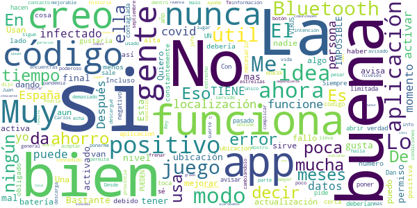

# Radar COVID
App version ``1.4.0``

Analyzed with [covid-apps-observer](http://github.com/covid-apps-observer) project, version ``0.1``

## App overview
| | |
|-------------------------|-------------------------| 
| **Name**&nbsp;&nbsp;&nbsp;&nbsp;&nbsp;&nbsp;&nbsp;&nbsp;&nbsp;&nbsp;&nbsp;&nbsp;&nbsp;&nbsp;&nbsp;&nbsp;&nbsp;&nbsp;&nbsp;&nbsp;&nbsp;&nbsp;&nbsp;&nbsp;&nbsp;&nbsp;&nbsp;&nbsp;&nbsp;&nbsp;&nbsp;&nbsp;&nbsp;&nbsp;&nbsp;&nbsp;&nbsp;&nbsp;&nbsp;&nbsp;  | Radar COVID |
| **Unique identifier** | es.gob.radarcovid |
| **Link to Google Play** | [https://play.google.com/store/apps/details?id=es.gob.radarcovid](https://play.google.com/store/apps/details?id=es.gob.radarcovid) |
| **Summary**  | Radar COVID, app oficial de prevención del COVID-19 del Gobierno de España |
| **Privacy policy** | [https://radarcovid.covid19.gob.es/terms-of-service/privacy-policy.html](https://radarcovid.covid19.gob.es/terms-of-service/privacy-policy.html) |
| **Latest version** | 1.4.0 |
| **Last update** | 2021-06-15 11:06:50 |
| **Recent changes** | Resolución de incidencias |
| **Installs**  | 5.000.000+ |
| **Category** | Medicina |
| **First release** | 7 ago 2020 |
| **Size**  | 29M |
| **Supported Android version**  | 6.0 y versiones posteriores |

### Description
> Radar COVID es la aplicación diseñada y dirigida por la Secretaría de Estado de Digitalización e Inteligencia Artificial del Gobierno de España para ayudar a evitar la propagación del coronavirus (COVID-19). 
 Radar COVID te avisa de manera anónima del posible contacto que has podido tener en los últimos 14 días con una persona que haya resultado infectada utilizando la tecnología Bluetooth de bajo consumo.
 Radar COVID además permite:
 -	Comunicar de forma anónima tu diagnóstico positivo.
 -	Comunicar la exposición de forma anónima a las personas con las que has estado en contacto 
 Radar COVID garantiza la seguridad y privacidad y es 100% anónimo. Por ello no solicitamos ni tu nombre, ni tu teléfono, ni tu correo electrónico. 
 Esta aplicación usa ilustraciones de licencia gratuita y que pertenecen a www.freepik.es

### User interface
The developers of the app provide the following screenshots in the Google play store.
| | | |
|:-------------------------:|:-------------------------:|:-------------------------:|
 |   |   |   | 
 |  

## Development team
In the following we report the main information provided by the development team in the Google play store.

| | |
|-------------------------|-------------------------|
| **Developer**  | Ministerio de Asuntos Económicos y Transf. Digital |
| **Website**  | - |
| **Email** | soporte.radarcovid@economia.gob.es |
| **Physical address**  | - |
| **Other developed apps**  | [https://play.google.com/store/apps/developer?id=Ministerio+de+Asuntos+Econ%C3%B3micos+y+Transf.+Digital](https://play.google.com/store/apps/developer?id=Ministerio+de+Asuntos+Econ%C3%B3micos+y+Transf.+Digital) |

## Android support

| | |
|-------------------------|-------------------------|
| **Declared target Android version**  | Android10, version 10 (API level 29) |
| **Effective target Android version**  | Android10, version 10 (API level 29) |
| **Minimum supported Android version**  | Marshmallow, version 6.0 (API level 23) |
| **Maximum target Android version**  | - |

The larger the difference between the minimum and maximum supported Android versions, the better. A larger difference means a wider audience. For example, old phones have a very low Android version, so a high minimum supported Android version means that the app cannot be used by users with old phones, thus leading to accessibility problems. 

## Requested permissions

In the following we report the complete list of the permissions requested by the app. 

| **Permission** | **Protection level** | **Description** | 
|-------------------------|-------------------------|-------------------------|
 **android.permission ACCESS_NETWORK_STATE** | Normal | Allows applications to access information about networks. 
 **android.permission BLUETOOTH** | Normal | Allows applications to connect to paired bluetooth devices. 
 **android.permission FOREGROUND_SERVICE** | Normal | Allows a regular application to use Service.startForeground. 
 **android.permission INTERNET** | Normal | Allows applications to open network sockets. 
 **android.permission RECEIVE_BOOT_COMPLETED** | Normal | Allows an application to receive the Intent.ACTION_BOOT_COMPLETED that is broadcast after the system finishes booting. 
 **android.permission REQUEST_IGNORE_BATTERY_OPTIMIZATIONS** | Normal | Permission an application must hold in order to use Settings.ACTION_REQUEST_IGNORE_BATTERY_OPTIMIZATIONS. 
 **android.permission WAKE_LOCK** | Normal | Allows using PowerManager WakeLocks to keep processor from sleeping or screen from dimming. 

## Mentioned servers

| **Server** | **Registrant** | **Registrant country** | **Creation date** | 
|-------------------------|-------------------------|-------------------------|-------------------------|
 | google.com | Google LLC | :us: US | 1997-09-15 04:00:00 |
 | ietf.org | IETF Trust | :us: US | 1995-03-11 05:00:00 |

## Security analysis 

Below we report the main security warnings raised by our execution of the [Androwarn](https://github.com/maaaaz/androwarn) security analysis tool.

**Connection interfaces exfiltration**
> - This application reads details about the currently active data network 
> - This application tries to find out if the currently active data network is metered 

**Telephony services abuse**
> - This application makes phone calls 

**Suspicious connection establishment**
> - This application opens a Socket and connects it to the remote address '; port is out of range' on the 'N/A' port  
> - This application opens a Socket and connects it to the remote address 'Lcom/android/tools/r8/GeneratedOutlineSupport;->outline14(Ljava/lang/String;)Ljava/lang/StringBuilder;' on the 'N/A' port  
> - This application opens a Socket and connects it to the remote address 'Ljava/net/Proxy;->type()Ljava/net/Proxy$Type;' on the 'N/A' port  
> - This application opens a Socket and connects it to the remote address 'timeout' on the 'N/A' port  

## User ratings and reviews

Below we provide information about how end users are reacting to the app in terms of ratings and reviews in the Google Play store.

### Ratings

The Radar COVID app has been installed by more than **5000000** times. At this time, **19428** rated the app and its average score is **2.675827**. Below we show the distribution of the ratings across the usual star-based rating of Google Play

:star::star::star::star::star:: 6130

:star::star::star::star:: 1502

:star::star::star:: 1236

:star::star:: 1058

:star:: 9502

### Reviews 

#### 5-star reviews

> De momento no la he usado. No puedo opinar.  :date: __2021-07-03 22:36:46__

> Ya lo tengo descargado Radar cobid19. Y tengo puesto el Bluetooth y además tengo puesto la primera vacuna pfaiser el día 6 de este mes el martes que viene voy ya para ponerme la segunda vacuna y cómo funciona lo de Radar Cobid19 tengo puesto el Bluetooth y qué es lo que hace Radar cobid19 no lo entiendo  :date: __2021-07-02 22:36:31__

> Mi parecer bien está aplicación pois tomando los cuidados debidos com esta aplicación tu puedes salir tranquilo se te acercas a alguien com el virus serás avisado en el momento  :date: __2021-07-01 22:23:09__

> Alguno habrá puesto que tiene el covid a mi no me señala nada.  :date: __2021-07-01 15:32:15__

> Muy buena aplicación para localizar si hay alguna persona con posibilidad de tener el covi  :date: __2021-07-01 00:09:00__

> Parece bastante útil aunque no sé si te puedes fiar de los resultados  :date: __2021-06-30 22:38:48__

> Covid mis huesos... комплимент Calcio Ca Cádiz  :date: __2021-06-30 20:31:47__

> g7bñ  :date: __2021-06-28 10:39:31__

> Necesaria  :date: __2021-06-24 23:11:25__

> No ha sido útil  :date: __2021-06-24 15:15:17__

#### 4-star reviews

> Gracias a Dios. El Covid19 NO TUBE NI TENGO ME HICE UNA PRUEVA BIEN.Y TUBE QUE REALIZARME UNA CIRUGIA TUBE DOS VECES MAS .U YO TODAS LAS MEDIDAS HIGIENE POR MI PROPIA SALUD .LAS CUMPLO Y LAS DE MI HIJO.  :date: __2021-07-03 15:47:01__

> A mí me funciona a la perfección.Muchas gracias.  :date: __2021-06-29 08:29:53__

> Te da una gran tranquilidad  :date: __2021-06-20 11:32:02__

> Jamás tuve notificación de contacto, creo que no deben haberse conectado mucha gente. Ami me pareció una buena APP. Gracias  :date: __2021-06-20 11:15:23__

> Lo veo fácil  :date: __2021-06-19 00:40:26__

> La musica es increible, lo malo es que si te pasas el modo historia no puedes hacer nada mas y eso molesta porque me lo pasé todo en un día porque me encantaba el juego, pero seguro que lo metereis en una nueva actualización  :date: __2021-06-14 20:50:13__

> En resumen: Estaria bien que se pudiese jugar con amigos en batallas multijador así más competividad. El modo historia de lo mejor bastante entretenido y con muchos momentos épicos que le dan el toque. Y molaria que metiesen eventos como el sida, ébola, covid1234 nueva plaga, etc  :date: __2021-06-04 22:57:48__

> Pocaexpefiencia  :date: __2021-05-25 22:55:36__

> Es un adelanto estar adelantado k sin solicitarlo ya hay app k detecte problemas d x igual indole pal resto d la humanidad k da tiempo a ponerce a salvo, gracias...  :date: __2021-05-25 08:23:11__

> Bamos.amirar.sida.resultado.. Esperemos.que.trabaje.vien. Nosenada.de.la.aplicacion.  :date: __2021-05-20 17:02:26__

#### 3-star reviews

> Muy poca gente lo lleva activado. 😞  :date: __2021-07-02 16:53:49__

> Bastante mejorable. Te da la información de la provincia no del lugar donde te encuentras dentro de ella, a pesar de tener concedido permiso de la ubicación.  :date: __2021-07-01 18:11:23__

> El juego no esta mal, la parte del juego que mas me gusta es el modo zen y el modo online. Lo malo es que en el modo historia es que en el nivel 28 el jefe final es demasiado poderoso, es decir 2400 de vida ? Eso es IMPOSIBLE DE VENCER. En general no esta mal, 3/5 estrellas.  :date: __2021-06-26 16:00:07__

> Muy buena muy buena  :date: __2021-06-20 21:20:49__

> Esta muy bien  :date: __2021-06-19 16:28:01__

> Muy bien  :date: __2021-06-19 00:42:15__

> La nueva actualización no permite usar la aplicación. El botón de "aceptar" las condiciones de uso no funciona, y la aplicación no se activa.  :date: __2021-06-18 15:16:20__

> Podría mejorar con mas info si las personas no la. Usan no sirve de ayuda  :date: __2021-06-17 16:47:26__

> La he usado muy poco.  :date: __2021-06-16 21:35:54__

> En su tiempo fue echa con muy buena intención pero no creo que halla servido de mucho para frenar la pandemia  :date: __2021-06-03 15:50:25__

#### 2-star reviews

> Como idea era buena, pero que la gente notifique su positivo voluntariamente, todavía no somos tan responsables. A ver si aprendemos de la pandemia.  :date: __2021-06-24 19:11:49__

> Muy mala, no ha funcionado nunca  :date: __2021-06-23 14:58:04__

> Más inútil que una nube de algodón sin palo.  :date: __2021-06-22 07:36:43__

> 🤩🥳😚  :date: __2021-06-16 07:23:14__

> No funciona del todo bien...  :date: __2021-06-14 20:08:59__

> Pésima  :date: __2021-06-11 23:42:49__

> Gavilan  :date: __2021-06-07 10:30:33__

> Consume toda mi batería. La idea era muy buena, pero teniendo que usar GPS y bluetooth de esa manera no me dura nada. Demasiado esfuerzo para llevarla activa.  :date: __2021-06-04 16:45:38__

> La aplicación está bien, pero la veo algo limitada para la situación actual, sería conveniente añadir una opción para declarar si tienes síntomas, ya que la aplicación solo sirve si oficialmente has dado positivo (cosa que está perfecto) pero hay muchas personas que aún no se han hecho una pcr y padecen síntomas de covid, pues opino que por prevención, sería útil añadir esta opción  :date: __2021-06-02 15:12:57__

> Antes me funcionaba bien. Pero hace unos 10 días me dice que no funciona correctamente, la llevo usando desde el principio y nunca me había pasado. La desistalé y volví a instalar. Pero me sigue pasando.  :date: __2021-05-21 21:38:41__

#### 1-star reviews

> Esta aplicación ha resultado ser completamente inútil. Nadie la usa, y ni siquiera en los centros de salud te dan los datos para informar de positivos (cosa que tenía que ser prioritaria). Me gustaría que informasen alguna vez de cuántos casos ha detectado. Apuesto que no llegan ni a 10 en toda España. Y creo que me he pasado. Un gasto inútil de dinero del contribuyente, y de recursos del móvil. Tras tenerla desde que la sacaron, la he desinstalado.  :date: __2021-07-04 13:30:54__

> Muy mal organizado, difundido y el desarrollo de la app es de un nivel muy facil como si lo hubiera hecho un niño y no un grupo de informáticos. No funciona y para que deberian añadir que estas vacunado cuando no sirve para nada porque te tendras que volver a vacunar y de todos modos aunque estes vacunado no estas protegido del todo y yo pienso vacunarme no soy uno de esos idiotas sin neuronas diciendo chorradas sobre vacunas  :date: __2021-07-03 21:40:08__

> Mala  :date: __2021-07-03 11:05:18__

> Le daría cero estrellas pero no se puede  :date: __2021-07-02 21:13:26__

> No funciona  :date: __2021-07-02 08:57:19__

> Cada vez que quitas el modo avión la app se queda colgada teniendo que restaurar los permisos para que vuelva a funcionar  :date: __2021-07-01 12:11:15__

> No sirve  :date: __2021-06-30 21:27:43__

> Si la gente contagiada no comunica la aplicación no sirve de nada  :date: __2021-06-28 20:32:53__

> No sirve para nada, la instalé cuando la sacó el gobierno, la he tenido siempre puesta por si acaso y cuando he estado expuesto no me ha avisado. No funciona, no sirve para nada. No perdais el tiempo instalandola, poneros mascarilla FPP2.  :date: __2021-06-27 21:05:49__

> No funciona casi nunca . Ni detecta nada.  :date: __2021-06-27 20:06:13__

