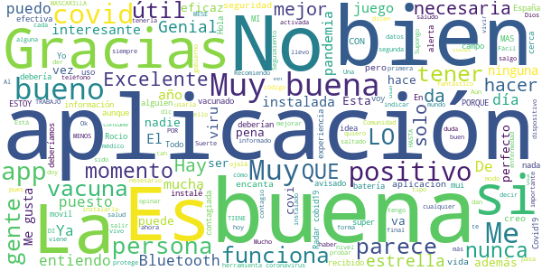
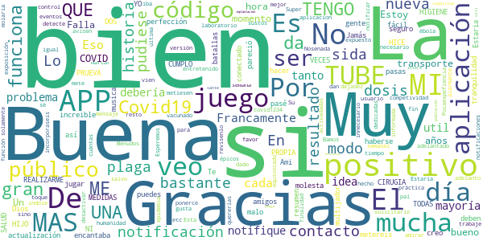
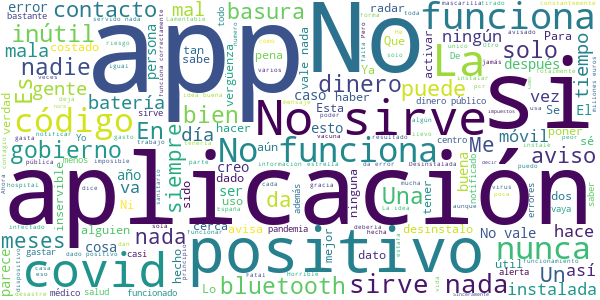

# Radar COVID
App version ``1.4.0``

Analyzed with [covid-apps-observer](http://github.com/covid-apps-observer) project, version ``0.1``

## App overview
| | |
|-------------------------|-------------------------| 
| **Name**&nbsp;&nbsp;&nbsp;&nbsp;&nbsp;&nbsp;&nbsp;&nbsp;&nbsp;&nbsp;&nbsp;&nbsp;&nbsp;&nbsp;&nbsp;&nbsp;&nbsp;&nbsp;&nbsp;&nbsp;&nbsp;&nbsp;&nbsp;&nbsp;&nbsp;&nbsp;&nbsp;&nbsp;&nbsp;&nbsp;&nbsp;&nbsp;&nbsp;&nbsp;&nbsp;&nbsp;&nbsp;&nbsp;&nbsp;&nbsp;  | Radar COVID |
| **Unique identifier** | es.gob.radarcovid |
| **Link to Google Play** | [https://play.google.com/store/apps/details?id=es.gob.radarcovid](https://play.google.com/store/apps/details?id=es.gob.radarcovid) |
| **Summary**  | Radar COVID, app oficial de prevención del COVID-19 del Gobierno de España |
| **Privacy policy** | [https://radarcovid.covid19.gob.es/terms-of-service/privacy-policy.html](https://radarcovid.covid19.gob.es/terms-of-service/privacy-policy.html) |
| **Latest version** | 1.4.0 |
| **Last update** | 2021-06-15 11:06:50 |
| **Recent changes** | Resolución de incidencias |
| **Installs**  | 5.000.000+ |
| **Category** | Medicina |
| **First release** | 7 ago 2020 |
| **Size**  | 29M |
| **Supported Android version**  | 6.0 y versiones posteriores |

### Description
> Radar COVID es la aplicación diseñada y dirigida por la Secretaría de Estado de Digitalización e Inteligencia Artificial del Gobierno de España para ayudar a evitar la propagación del coronavirus (COVID-19). 
 Radar COVID te avisa de manera anónima del posible contacto que has podido tener en los últimos 14 días con una persona que haya resultado infectada utilizando la tecnología Bluetooth de bajo consumo.
 Radar COVID además permite:
 -	Comunicar de forma anónima tu diagnóstico positivo.
 -	Comunicar la exposición de forma anónima a las personas con las que has estado en contacto 
 Radar COVID garantiza la seguridad y privacidad y es 100% anónimo. Por ello no solicitamos ni tu nombre, ni tu teléfono, ni tu correo electrónico. 
 Esta aplicación usa ilustraciones de licencia gratuita y que pertenecen a www.freepik.es

### User interface
The developers of the app provide the following screenshots in the Google play store.
| | | |
|:-------------------------:|:-------------------------:|:-------------------------:|
 |   |   |   | 
 |  

## Development team
In the following we report the main information provided by the development team in the Google play store.

| | |
|-------------------------|-------------------------|
| **Developer**  | Ministerio de Asuntos Económicos y Transf. Digital |
| **Website**  | - |
| **Email** | soporte.radarcovid@economia.gob.es |
| **Physical address**  | - |
| **Other developed apps**  | [https://play.google.com/store/apps/developer?id=Ministerio+de+Asuntos+Econ%C3%B3micos+y+Transf.+Digital](https://play.google.com/store/apps/developer?id=Ministerio+de+Asuntos+Econ%C3%B3micos+y+Transf.+Digital) |

## Android support

| | |
|-------------------------|-------------------------|
| **Declared target Android version**  | Android10, version 10 (API level 29) |
| **Effective target Android version**  | Android10, version 10 (API level 29) |
| **Minimum supported Android version**  | Marshmallow, version 6.0 (API level 23) |
| **Maximum target Android version**  | - |

The larger the difference between the minimum and maximum supported Android versions, the better. A larger difference means a wider audience. For example, old phones have a very low Android version, so a high minimum supported Android version means that the app cannot be used by users with old phones, thus leading to accessibility problems. 

## Requested permissions

In the following we report the complete list of the permissions requested by the app. 

| **Permission** | **Protection level** | **Description** | 
|-------------------------|-------------------------|-------------------------|
 **android.permission ACCESS_NETWORK_STATE** | Normal | Allows applications to access information about networks. 
 **android.permission BLUETOOTH** | Normal | Allows applications to connect to paired bluetooth devices. 
 **android.permission FOREGROUND_SERVICE** | Normal | Allows a regular application to use Service.startForeground. 
 **android.permission INTERNET** | Normal | Allows applications to open network sockets. 
 **android.permission RECEIVE_BOOT_COMPLETED** | Normal | Allows an application to receive the Intent.ACTION_BOOT_COMPLETED that is broadcast after the system finishes booting. 
 **android.permission REQUEST_IGNORE_BATTERY_OPTIMIZATIONS** | Normal | Permission an application must hold in order to use Settings.ACTION_REQUEST_IGNORE_BATTERY_OPTIMIZATIONS. 
 **android.permission WAKE_LOCK** | Normal | Allows using PowerManager WakeLocks to keep processor from sleeping or screen from dimming. 

## Mentioned servers

| **Server** | **Registrant** | **Registrant country** | **Creation date** | 
|-------------------------|-------------------------|-------------------------|-------------------------|
 | google.com | Google LLC | :us: US | 1997-09-15 04:00:00 |
 | ietf.org | IETF Trust | :us: US | 1995-03-11 05:00:00 |

## Security analysis 

Below we report the main security warnings raised by our execution of the [Androwarn](https://github.com/maaaaz/androwarn) security analysis tool.

**Connection interfaces exfiltration**
> - This application reads details about the currently active data network 
> - This application tries to find out if the currently active data network is metered 

**Telephony services abuse**
> - This application makes phone calls 

**Suspicious connection establishment**
> - This application opens a Socket and connects it to the remote address '; port is out of range' on the 'N/A' port  
> - This application opens a Socket and connects it to the remote address 'Lcom/android/tools/r8/GeneratedOutlineSupport;->outline14(Ljava/lang/String;)Ljava/lang/StringBuilder;' on the 'N/A' port  
> - This application opens a Socket and connects it to the remote address 'Ljava/net/Proxy;->type()Ljava/net/Proxy$Type;' on the 'N/A' port  
> - This application opens a Socket and connects it to the remote address 'timeout' on the 'N/A' port  

## User ratings and reviews

Below we provide information about how end users are reacting to the app in terms of ratings and reviews in the Google Play store.

### Ratings

The Radar COVID app has been installed by more than **5000000** times. At this time, **19428** rated the app and its average score is **2.675827**. Below we show the distribution of the ratings across the usual star-based rating of Google Play

:star::star::star::star::star:: 6130

:star::star::star::star:: 1502

:star::star::star:: 1236

:star::star:: 1058

:star:: 9502

### Reviews 

#### 5-star reviews

> muy buena  :date: __2021-06-19 06:15:29__

> Perfecto  :date: __2021-06-19 01:22:34__

> Muy buena  :date: __2021-06-18 22:24:24__

> Muy buena  :date: __2021-06-18 20:05:15__

> Ting la segona vacuna afortunadament  :date: __2021-06-18 15:08:08__

> Buena y válida.  :date: __2021-06-17 19:53:39__

> ¿Cómo es posible que no haya un uso masivo de la aplicación sabiendo que no hay suficientes rastreadores y conociendo que se trata de una aplicación segura? A veces no me identifico con los ciudadanos. Somos privilegiados también por disponer de esta herramienta.  :date: __2021-06-17 18:38:50__

> Y para los que estamos vacunados,que? No hay radar?  :date: __2021-06-17 10:32:49__

> Muy.bueno.  :date: __2021-06-16 09:28:07__

> Ok.ok.  :date: __2021-06-15 20:14:10__

#### 4-star reviews

> Te da una gran tranquilidad  :date: __2021-06-20 11:32:02__

> Jamás tuve notificación de contacto, creo que no deben haberse conectado mucha gente. Ami me pareció una buena APP. Gracias  :date: __2021-06-20 11:15:23__

> Lo veo fácil  :date: __2021-06-19 00:40:26__

> La musica es increible, lo malo es que si te pasas el modo historia no puedes hacer nada mas y eso molesta porque me lo pasé todo en un día porque me encantaba el juego, pero seguro que lo metereis en una nueva actualización  :date: __2021-06-14 20:50:13__

> En resumen: Estaria bien que se pudiese jugar con amigos en batallas multijador así más competividad. El modo historia de lo mejor bastante entretenido y con muchos momentos épicos que le dan el toque. Y molaria que metiesen eventos como el sida, ébola, covid1234 nueva plaga, etc  :date: __2021-06-04 22:57:48__

> Pocaexpefiencia  :date: __2021-05-25 22:55:36__

> Es un adelanto estar adelantado k sin solicitarlo ya hay app k detecte problemas d x igual indole pal resto d la humanidad k da tiempo a ponerce a salvo, gracias...  :date: __2021-05-25 08:23:11__

> Bamos.amirar.sida.resultado.. Esperemos.que.trabaje.vien. Nosenada.de.la.aplicacion.  :date: __2021-05-20 17:02:26__

> Estaría bien que incorporaseis una función para que el usuario pudiese marcar que ya está vacunado, cuántas dosis y de qué laboratorio.  :date: __2021-05-17 17:13:34__

> Muy poco práctica  :date: __2021-05-10 14:37:25__

#### 3-star reviews

> Muy buena muy buena  :date: __2021-06-20 21:20:49__

> Esta muy bien  :date: __2021-06-19 16:28:01__

> Muy bien  :date: __2021-06-19 00:42:15__

> La nueva actualización no permite usar la aplicación. El botón de "aceptar" las condiciones de uso no funciona, y la aplicación no se activa.  :date: __2021-06-18 15:16:20__

> Podría mejorar con mas info si las personas no la. Usan no sirve de ayuda  :date: __2021-06-17 16:47:26__

> La he usado muy poco.  :date: __2021-06-16 21:35:54__

> En su tiempo fue echa con muy buena intención pero no creo que halla servido de mucho para frenar la pandemia  :date: __2021-06-03 15:50:25__

> Muy buenas  :date: __2021-06-02 21:12:28__

> Nunca me dijo nada o me.mostro algo.  :date: __2021-05-28 13:22:06__

> Desde que me la descargué en septiembre no me ha avisado de ningún contacto estrecho. Es más, de lo único que me avisa es del error del ahorro de batería, pero aun cambiándolo me sigue dando ese fallo. Una de dos, o he tenido mucha suerte todos estos meses o no funciona.  :date: __2021-05-15 17:00:54__

#### 2-star reviews

> 🤩🥳😚  :date: __2021-06-16 07:23:14__

> No funciona del todo bien...  :date: __2021-06-14 20:08:59__

> Pésima  :date: __2021-06-11 23:42:49__

> Gavilan  :date: __2021-06-07 10:30:33__

> Consume toda mi batería. La idea era muy buena, pero teniendo que usar GPS y bluetooth de esa manera no me dura nada. Demasiado esfuerzo para llevarla activa.  :date: __2021-06-04 16:45:38__

> La aplicación está bien, pero la veo algo limitada para la situación actual, sería conveniente añadir una opción para declarar si tienes síntomas, ya que la aplicación solo sirve si oficialmente has dado positivo (cosa que está perfecto) pero hay muchas personas que aún no se han hecho una pcr y padecen síntomas de covid, pues opino que por prevención, sería útil añadir esta opción  :date: __2021-06-02 15:12:57__

> Antes me funcionaba bien. Pero hace unos 10 días me dice que no funciona correctamente, la llevo usando desde el principio y nunca me había pasado. La desistalé y volví a instalar. Pero me sigue pasando.  :date: __2021-05-21 21:38:41__

> No ha sido útil al estar basada en ser utilizada por mucha gente y no haberse cumplido esta premisa  :date: __2021-05-18 18:39:49__

> Un tirar el dinero de los ciudadanos. Inútil total. Al final la borré.  :date: __2021-05-16 09:24:04__

> Cuando tuve covid no había forma de ponerlo en la aplicación, te pide un código que nunca tuve  :date: __2021-05-16 09:22:07__

#### 1-star reviews

> Gastaba mucha batería, por otro lado tendrían que haber promovido su uso, no recibí ni una sola notificación.  :date: __2021-06-21 11:17:08__

> Trabajo en un hospital y aún no me ha detectado ni un contacto. Es una aplicación inútil. Da error siempre  :date: __2021-06-21 00:26:48__

> una pesima jugabilidad ensima sacaron un nuevo dlc yme lo compre pero me ponia que conpra fallida estoy desepcionado con esta aplicacion ademas sus controles son pesimos y graficos orribles ademas ta muy dificil  :date: __2021-06-20 17:53:19__

> Ya estoy vacunada  :date: __2021-06-20 14:05:24__

> Solo funciona con modo ahorro de energía, y no funciona.  :date: __2021-06-19 22:41:32__

> Nunca ha funcionado, siempre da error  :date: __2021-06-19 22:22:16__

> En casi dos años ni una sola advertencia, a pesar de que han dado aviso perdonas cercanas de estar contaminados. Así que ya ne diréis como se come eso.  :date: __2021-06-19 17:20:52__

> La app más absurda después de la vida de brian  :date: __2021-06-19 14:00:39__

> No le interesa al gobierno  :date: __2021-06-19 11:21:29__

> Una gran idea que no ha sido aprovechada. Menos de 65.000 casos notificados es ridículamente bajo...  :date: __2021-06-18 20:18:50__

