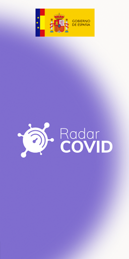
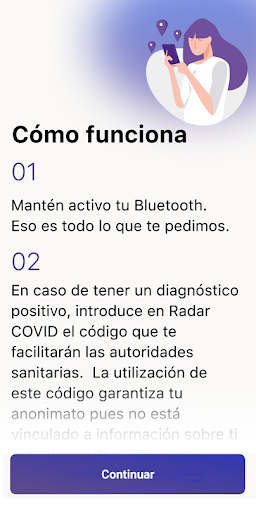
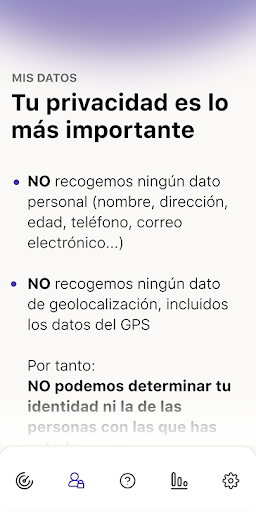
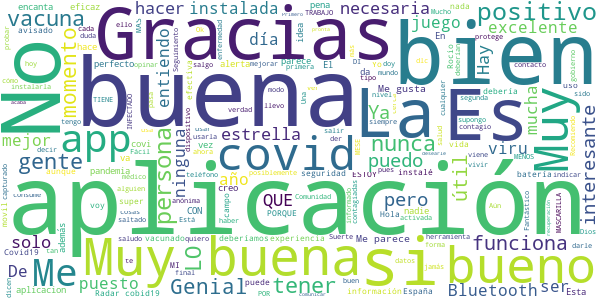
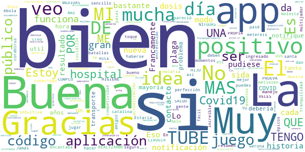
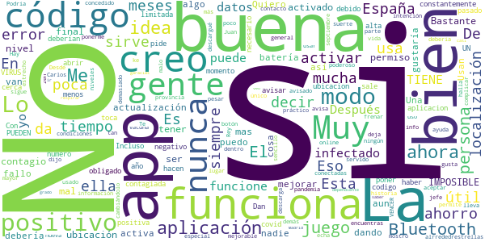
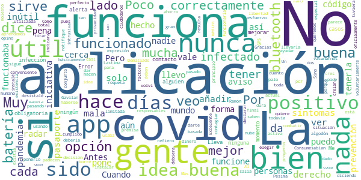
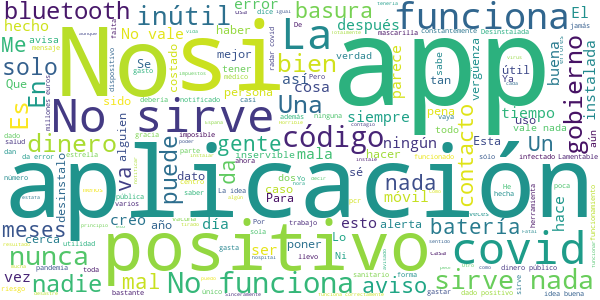

# Radar COVID
App version ``1.4.1``

Analyzed with [covid-apps-observer](http://github.com/covid-apps-observer) project, version ``0.1``

## App overview
| | |
|-------------------------|-------------------------| 
| **Name**&nbsp;&nbsp;&nbsp;&nbsp;&nbsp;&nbsp;&nbsp;&nbsp;&nbsp;&nbsp;&nbsp;&nbsp;&nbsp;&nbsp;&nbsp;&nbsp;&nbsp;&nbsp;&nbsp;&nbsp;&nbsp;&nbsp;&nbsp;&nbsp;&nbsp;&nbsp;&nbsp;&nbsp;&nbsp;&nbsp;&nbsp;&nbsp;&nbsp;&nbsp;&nbsp;&nbsp;&nbsp;&nbsp;&nbsp;&nbsp;  | Radar COVID |
| **Unique identifier** | es.gob.radarcovid |
| **Link to Google Play** | [https://play.google.com/store/apps/details?id=es.gob.radarcovid](https://play.google.com/store/apps/details?id=es.gob.radarcovid) |
| **Summary**  | Radar COVID, app oficial de prevención del COVID-19 del Gobierno de España |
| **Privacy policy** | [https://radarcovid.covid19.gob.es/terms-of-service/privacy-policy.html](https://radarcovid.covid19.gob.es/terms-of-service/privacy-policy.html) |
| **Latest version** | 1.4.1 |
| **Last update** | 2021-07-14 15:15:15 |
| **Recent changes** | Registro de fechas de exposición |
| **Installs**  | 5.000.000+ |
| **Category** | Medicina |
| **First release** | 7 ago 2020 |
| **Size**  | 29M |
| **Supported Android version**  | 6.0 y versiones posteriores |

### Description
> Radar COVID es la aplicación diseñada y dirigida por la Secretaría de Estado de Digitalización e Inteligencia Artificial del Gobierno de España para ayudar a evitar la propagación del coronavirus (COVID-19). 
 Radar COVID te avisa de manera anónima del posible contacto que has podido tener en los últimos 14 días con una persona que haya resultado infectada utilizando la tecnología Bluetooth de bajo consumo.
 Radar COVID además permite:
 -	Comunicar de forma anónima tu diagnóstico positivo.
 -	Comunicar la exposición de forma anónima a las personas con las que has estado en contacto 
 Radar COVID garantiza la seguridad y privacidad y es 100% anónimo. Por ello no solicitamos ni tu nombre, ni tu teléfono, ni tu correo electrónico. 
 Esta aplicación usa ilustraciones de licencia gratuita y que pertenecen a www.freepik.es

### User interface
The developers of the app provide the following screenshots in the Google play store.
| | | |
|:-------------------------:|:-------------------------:|:-------------------------:|
 |   |   |   | 
 |  

## Development team
In the following we report the main information provided by the development team in the Google play store.

| | |
|-------------------------|-------------------------|
| **Developer**  | Ministerio de Asuntos Económicos y Transf. Digital |
| **Website**  | - |
| **Email** | soporte.radarcovid@economia.gob.es |
| **Physical address**  | - |
| **Other developed apps**  | [https://play.google.com/store/apps/developer?id=Ministerio+de+Asuntos+Econ%C3%B3micos+y+Transf.+Digital](https://play.google.com/store/apps/developer?id=Ministerio+de+Asuntos+Econ%C3%B3micos+y+Transf.+Digital) |

## Android support

| | |
|-------------------------|-------------------------|
| **Declared target Android version**  | Android10, version 10 (API level 29) |
| **Effective target Android version**  | Android10, version 10 (API level 29) |
| **Minimum supported Android version**  | Marshmallow, version 6.0 (API level 23) |
| **Maximum target Android version**  | - |

The larger the difference between the minimum and maximum supported Android versions, the better. A larger difference means a wider audience. For example, old phones have a very low Android version, so a high minimum supported Android version means that the app cannot be used by users with old phones, thus leading to accessibility problems. 

## Requested permissions

In the following we report the complete list of the permissions requested by the app. 

| **Permission** | **Protection level** | **Description** | 
|-------------------------|-------------------------|-------------------------|
 **android.permission ACCESS_NETWORK_STATE** | Normal | Allows applications to access information about networks. 
 **android.permission BLUETOOTH** | Normal | Allows applications to connect to paired bluetooth devices. 
 **android.permission FOREGROUND_SERVICE** | Normal | Allows a regular application to use Service.startForeground. 
 **android.permission INTERNET** | Normal | Allows applications to open network sockets. 
 **android.permission RECEIVE_BOOT_COMPLETED** | Normal | Allows an application to receive the Intent.ACTION_BOOT_COMPLETED that is broadcast after the system finishes booting. 
 **android.permission REQUEST_IGNORE_BATTERY_OPTIMIZATIONS** | Normal | Permission an application must hold in order to use Settings.ACTION_REQUEST_IGNORE_BATTERY_OPTIMIZATIONS. 
 **android.permission WAKE_LOCK** | Normal | Allows using PowerManager WakeLocks to keep processor from sleeping or screen from dimming. 

## Mentioned servers

| **Server** | **Registrant** | **Registrant country** | **Creation date** | 
|-------------------------|-------------------------|-------------------------|-------------------------|
 | google.com | Google LLC | :us: US | 1997-09-15 04:00:00 |
 | ietf.org | IETF Trust | :us: US | 1995-03-11 05:00:00 |

## Security analysis 

Below we report the main security warnings raised by our execution of the [Androwarn](https://github.com/maaaaz/androwarn) security analysis tool.

**Connection interfaces exfiltration**
> - This application reads details about the currently active data network 
> - This application tries to find out if the currently active data network is metered 

**Telephony services abuse**
> - This application makes phone calls 

**Suspicious connection establishment**
> - This application opens a Socket and connects it to the remote address '; port is out of range' on the 'N/A' port  
> - This application opens a Socket and connects it to the remote address 'Lcom/android/tools/r8/GeneratedOutlineSupport;->outline14(Ljava/lang/String;)Ljava/lang/StringBuilder;' on the 'N/A' port  
> - This application opens a Socket and connects it to the remote address 'Ljava/net/Proxy;->type()Ljava/net/Proxy$Type;' on the 'N/A' port  
> - This application opens a Socket and connects it to the remote address 'timeout' on the 'N/A' port  

## User ratings and reviews

Below we provide information about how end users are reacting to the app in terms of ratings and reviews in the Google Play store.

### Ratings

The Radar COVID app has been installed by more than **5000000** times. At this time, **19683** rated the app and its average score is **2.6429293**. Below we show the distribution of the ratings across the usual star-based rating of Google Play

:star::star::star::star::star:: 6074

:star::star::star::star:: 1511

:star::star::star:: 1212

:star::star:: 1083

:star:: 9803

### Reviews 

#### 5-star reviews

> Me acaba de comunicar un contacto, Primero desearle una pronta y buena recuperación a esta persona anónima, así como darle las gracias y felicitarla por su responsabilidad y solidaridad, GRACIAS  :date: __2021-07-23 15:11:51__

> Magnifica  :date: __2021-07-23 00:54:49__

> Me parece genial y todo es poco tal y como está la situación del virus, de nuevo,en éste momento. Gracias!!  :date: __2021-07-21 03:54:46__

> Ninguna alerta por covid. Nos exponemos poco, sólo por variadas compras.  :date: __2021-07-20 10:34:05__

> Muy interesante  :date: __2021-07-19 13:44:11__

> Excepcional,es como Pokémon Go,pero encuentras gente posiblemente a punto de ser hospitalizada y supongo que esos pueden ser o legendarios o shinys,pero estoy orgulloso de haber "capturado" a 0 infectados Pd:nunca jamás la usaré  :date: __2021-07-18 01:41:03__

> Ya me a dado covid :)  :date: __2021-07-16 14:26:27__

> Si la usáramos todos no habría problema. A mí la app me parece una idea estupenda.  :date: __2021-07-15 22:57:04__

> Me parece una muy buena aplicación la verdad no me puedo quejar  :date: __2021-07-13 16:16:05__

> Yo lo que quiero es estar informada de los contagios y muertes en Algeciras, yo no tengo ningún tipo de síntomas gracias a Dios y además tengo la vacuna puesta faiser  :date: __2021-07-10 11:50:13__

#### 4-star reviews

> Buena idea y app de sencillo manejo, muy intuitiva.  :date: __2021-07-21 19:50:50__

> Muy bueno  :date: __2021-07-19 23:28:18__

> Estoy ingresado por el corabirus en el hospital de santa catalina de Gerona  :date: __2021-07-19 18:21:08__

> @@g  :date: __2021-07-06 12:21:39__

> Gracias a Dios. El Covid19 NO TUBE NI TENGO ME HICE UNA PRUEVA BIEN.Y TUBE QUE REALIZARME UNA CIRUGIA TUBE DOS VECES MAS .U YO TODAS LAS MEDIDAS HIGIENE POR MI PROPIA SALUD .LAS CUMPLO Y LAS DE MI HIJO.  :date: __2021-07-03 15:47:01__

> A mí me funciona a la perfección.Muchas gracias.  :date: __2021-06-29 08:29:53__

> Te da una gran tranquilidad  :date: __2021-06-20 11:32:02__

> Jamás tuve notificación de contacto, creo que no deben haberse conectado mucha gente. Ami me pareció una buena APP. Gracias  :date: __2021-06-20 11:15:23__

> Lo veo fácil  :date: __2021-06-19 00:40:26__

> La musica es increible, lo malo es que si te pasas el modo historia no puedes hacer nada mas y eso molesta porque me lo pasé todo en un día porque me encantaba el juego, pero seguro que lo metereis en una nueva actualización  :date: __2021-06-14 20:50:13__

#### 3-star reviews

> Creo ke es práctico siempre y cuando las demás personas estén conectadas si no deja de ser tan útil como deberia  :date: __2021-07-23 17:46:38__

> Hay mucho contagio a mi alrrededr  :date: __2021-07-18 10:31:06__

> Esta app es muy especial para mi  :date: __2021-07-15 23:50:57__

> No sirve de mucho  :date: __2021-07-11 15:45:32__

> Esta mayor  :date: __2021-07-07 20:17:49__

> Muy poca gente lo lleva activado. 😞  :date: __2021-07-02 16:53:49__

> Bastante mejorable. Te da la información de la provincia no del lugar donde te encuentras dentro de ella, a pesar de tener concedido permiso de la ubicación.  :date: __2021-07-01 18:11:23__

> El juego no esta mal, la parte del juego que mas me gusta es el modo zen y el modo online. Lo malo es que en el modo historia es que en el nivel 28 el jefe final es demasiado poderoso, es decir ¿2400 de vida ? Eso es IMPOSIBLE DE VENCER. En general no esta mal, 3/5 estrellas.  :date: __2021-06-26 16:00:07__

> Muy buena muy buena  :date: __2021-06-20 21:20:49__

> Esta muy bien  :date: __2021-06-19 16:28:01__

#### 2-star reviews

> A ver básicamente Ramón roqueta estás diciendo que el pasaporte covid debería estar en esta aplicación,para mí esta aplicación sin el pasaporte covid,está bien,porque nos deben dar derecho a elegir si queremos vacunarnos del covid o no,la libertad de expresión y decisión es un derecho humano,...  :date: __2021-07-22 14:14:59__

> No funciona  :date: __2021-07-21 22:33:00__

> Funciona cuando quiere  :date: __2021-07-20 15:18:49__

> Como idea era buena, pero que la gente notifique su positivo voluntariamente, todavía no somos tan responsables. A ver si aprendemos de la pandemia.  :date: __2021-06-24 19:11:49__

> Muy mala, no ha funcionado nunca  :date: __2021-06-23 14:58:04__

> Más inútil que una nube de algodón sin palo.  :date: __2021-06-22 07:36:43__

> 🤩🥳😚  :date: __2021-06-16 07:23:14__

> No funciona del todo bien...  :date: __2021-06-14 20:08:59__

> Pésima  :date: __2021-06-11 23:42:49__

> Gavilan  :date: __2021-06-07 10:30:33__

#### 1-star reviews

> Inútil esa aplicación, al dejar a la voluntad del posible afectado el hacerlo publico  :date: __2021-07-23 21:12:52__

> Esto es una muerda engaña vovo  :date: __2021-07-23 19:12:58__

> Esto es otro engaño para tontos... Otro kerer y no poder .. La app no funciona... La tengo instalada hace un año.. Ni suena, ni hace nada de nada.. Solo gastar batería y mas bateria..valla 🚮.  :date: __2021-07-23 07:12:41__

> Una falsa , no vale ni nadie te da código para activar en caso de covid ni nada.  :date: __2021-07-22 18:18:14__

> No lo usa nadie. El gobierno no lo ha potenciado.  :date: __2021-07-22 12:50:08__

> Me quitan el comentario, porqué? Aplicación falsa. Totalmente, han de eliminarla. Primero que todo la privacidad de la gente.  :date: __2021-07-22 12:16:55__

> No me dejaactuvarla  :date: __2021-07-22 03:24:27__

> Si no tienes el virus no te deja utilizarlo  :date: __2021-07-21 18:58:56__

> Sinceramente no ha funcionado y la tengo desde el primer día que se empezó a utilizar, en casa hace exactamente 12 días, tememos un positivo en casa, esta aplicación, en ningún momento la detectó 😡😡😡.  :date: __2021-07-21 13:58:23__

> No sirve para absolutamente nada. Al menos no lo hizo en su momento. Quise notificar que era positiva y no me dejaba. De eso hace 8 meses y 8 meses después sigue funcionando mal.  :date: __2021-07-21 01:10:27__

