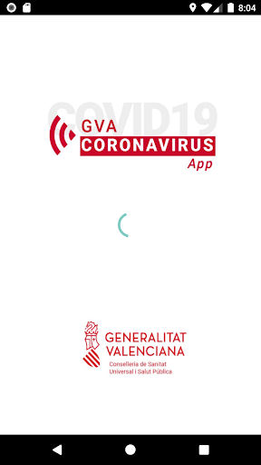
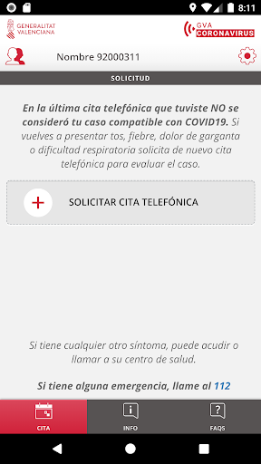
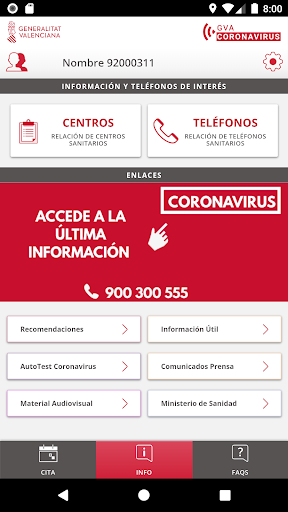
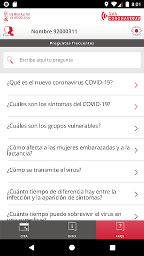
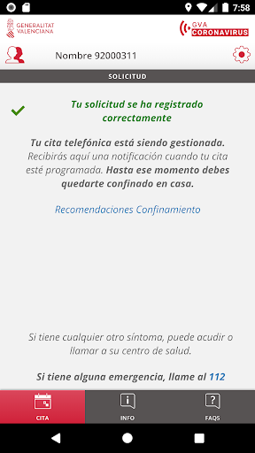
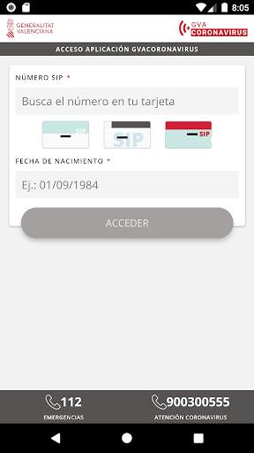
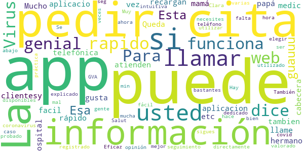
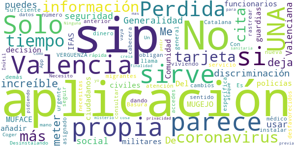

# GVA Coronavirus
App version ``1.0.0``

Analyzed with [covid-apps-observer](http://github.com/covid-apps-observer) project, version ``0.1``

## App overview
| | |
|-------------------------|-------------------------| 
| **Name**&nbsp;&nbsp;&nbsp;&nbsp;&nbsp;&nbsp;&nbsp;&nbsp;&nbsp;&nbsp;&nbsp;&nbsp;&nbsp;&nbsp;&nbsp;&nbsp;&nbsp;&nbsp;&nbsp;&nbsp;&nbsp;&nbsp;&nbsp;&nbsp;&nbsp;&nbsp;&nbsp;&nbsp;&nbsp;&nbsp;&nbsp;&nbsp;&nbsp;&nbsp;&nbsp;&nbsp;&nbsp;&nbsp;&nbsp;&nbsp;  | GVA Coronavirus |
| **Unique identifier** | es.gva.coronavirus |
| **Link to Google Play** | [https://play.google.com/store/apps/details?id=es.gva.coronavirus](https://play.google.com/store/apps/details?id=es.gva.coronavirus) |
| **Summary**  | APP de la Conselleria de Sanitat Universal i Salut Pública sobre COVID-19. |
| **Privacy policy** | [http://coronavirusautotest.san.gva.es/proteccion-datos-es.html](http://coronavirusautotest.san.gva.es/proteccion-datos-es.html) |
| **Latest version** | 1.0.0 |
| **Last update** | 2020-04-07 12:18:48 |
| **Recent changes** | Aplicación móvil oficial de la Conselleria de Sanitat Universal i Salut Pública para solicitar cita con tu centro de salud en caso de presentar síntomas clínicos compatibles con infección por COVID-19. |
| **Installs**  | 10.000+ |
| **Category** | Salud y bienestar |
| **First release** | 7 abr. 2020 |
| **Size**  | 5,9M |
| **Supported Android version**  | 4.4 y versiones posteriores |

### Description
> Aplicación móvil oficial de la Conselleria de Sanitat Universal i Salut Pública para solicitar cita con tu centro de salud en caso de presentar síntomas clínicos compatibles con infección por COVID-19.
 A través de la APP también se puede acceder a una amplia información sobre la infección causada por coronavirus COVID-19. 
 Los síntomas compatibles con infección por COVID-19 son síntomas de infección de vías respiratorias, estando presente uno o más de los siguientes: 
 - fiebre (más de 37º)
 - tos
 - estornudos
 - dolor de garganta 
 - dificultad respiratoria
 Si se han presentado estos síntomas en los últimos 14 días debes solicitar la cita mediante esta App.
 Si los síntomas que padeces revisten gravedad o tienes una emergencia llama al teléfono 112.
 Las citas a través de esta App están dirigidas a los casos posibles de infección COVID-19.
 La cita se solicita mediante la introducción de tu número SIP y la fecha de nacimiento, y realizando la confirmación del teléfono de contacto. 
 Recibirás una llamada en el plazo máximo de 24 horas desde la confirmación de la creación de la cita. En el caso de no recibirse la llamada en el plazo de 24 horas se puede volver a realizar la petición mediante la App o mediante llamada al teléfono 900 300 555.
 A través de la App se te informará del estado de la cita: solicitada, confirmada, realizada. 
 Si durante la primera llamada telefónica el profesional sanitario de tu centro de salud identifica tu caso como posible de COVID-19, el resto de citas telefónicas para efectuar el seguimiento de tu caso serán programadas por el profesional sanitario. A partir de ese momento, recibirás llamadas periódicas para verificar tu estado de salud y ayudarte en todas las dudas y necesidades que puedas presentar.
 Si presentas otros síntomas diferentes a los indicados, ponte en contacto con tu centro de salud a través de los teléfonos de cita previa habituales. 
 La Conselleria de Sanidad Universal y salud Pública  es la responsable y autora de la información que se muestra en la aplicación, además, garantiza la privacidad y protección de tus datos (http://coronavirusautotest.san.gva.es/proteccion-datos-es.html). Asimismo, la Conselleria garantiza que se almacenará y utilizará la información personal de un modo suficientemente seguro, durante el tiempo necesario y solo para proporcionarte los servicios personalizados anteriormente descritos.
 Para salvaguardar la información de la persona usuaria/paciente, esta aplicación usa el protocolo seguro HTTPS para todas las comunicaciones con los servidores.

### User interface
The developers of the app provide the following screenshots in the Google play store.
| | | |
|:-------------------------:|:-------------------------:|:-------------------------:|
 |   |   |   | 
 |   |   |   | 

## Development team
In the following we report the main information provided by the development team in the Google play store.

| | |
|-------------------------|-------------------------|
| **Developer**  | Generalitat Valenciana |
| **Website**  | [http://infocoronavirus.gva.es/](http://infocoronavirus.gva.es/) |
| **Email** | appsanitatcoronavirus@gva.es |
| **Physical address**  | [Calle Democracia, Nº 77 Valencia (España)  CP: 46018](https://www.google.com/maps/search/Calle%20Democracia,%20Nº%2077%20Valencia%20(España)%20CP:%2046018) (Google Maps) |
| **Other developed apps**  | [https://play.google.com/store/apps/developer?id=6787972071287437379](https://play.google.com/store/apps/developer?id=6787972071287437379) |

## Android support

| | |
|-------------------------|-------------------------|
| **Declared target Android version**  | Pie, version 9 (API level 28) |
| **Effective target Android version**  | Pie, version 9 (API level 28) |
| **Minimum supported Android version**  | KitKat, version 4.4 - 4.4.4 (API level 19) |
| **Maximum target Android version**  | - |

The larger the difference between the minimum and maximum supported Android versions, the better. A larger difference means a wider audience. For example, old phones have a very low Android version, so a high minimum supported Android version means that the app cannot be used by users with old phones, thus leading to accessibility problems. 

## Requested permissions

In the following we report the complete list of the permissions requested by the app. 

| **Permission** | **Protection level** | **Description** | 
|-------------------------|-------------------------|-------------------------|
 **android.permission CAMERA** | :warning:**Dangerous** | Required to be able to access the camera device. 
 **android.permission FLASHLIGHT** | - | - 
 **android.permission INTERNET** | Normal | Allows applications to open network sockets. 
 **android.permission READ_CALENDAR** | :warning:**Dangerous** | Allows an application to read the user's calendar data. 
 **android.permission WRITE_CALENDAR** | :warning:**Dangerous** | Allows an application to write the user's calendar data. 
 **android.permission WRITE_EXTERNAL_STORAGE** | :warning:**Dangerous** | Allows an application to write to external storage. 

## Mentioned servers

| **Server** | **Registrant** | **Registrant country** | **Creation date** | 
|-------------------------|-------------------------|-------------------------|-------------------------|
 | appspot.com | Google LLC | :us: US | 2005-03-10 02:27:55 |
 | google.com | Google LLC | :us: US | 1997-09-15 04:00:00 |
 | gstatic.com | Google LLC | :us: US | 2008-02-11 15:31:25 |
 | googleapis.com | Google LLC | :us: US | 2005-01-25 17:52:26 |

## Security analysis 

Below we report the main security warnings raised by our execution of the [Androwarn](https://github.com/maaaaz/androwarn) security analysis tool.

**Connection interfaces exfiltration**
> - This application reads details about the currently active data network 
> - This application tries to find out if the currently active data network is metered 

**Telephony services abuse**
> - This application makes phone calls 

**Pim data leakage**
> - This application accesses the calendar 
> - This application accesses data stored in the clipboard 

## User ratings and reviews

Below we provide information about how end users are reacting to the app in terms of ratings and reviews in the Google Play store.

### Ratings

The GVA Coronavirus app has been installed by more than **10000** times. At this time, **25** rated the app and its average score is **3.24**. Below we show the distribution of the ratings across the usual star-based rating of Google Play

:star::star::star::star::star:: 14

:star::star::star::star:: 0

:star::star::star:: 0

:star::star:: 0

:star:: 11

### Reviews 

#### 5-star reviews

> Esta guauuu  :date: __2020-05-29 12:25:10__

> Esa aplicacion me gusta porque recargan a todos sus clientesy tambien por que esa aplicacio. Queda muy facil si usted o su papá o su mamá o su hermano etc. Usted puede llamar rapido al ospital y lo atienden rapido  :date: __2020-05-16 18:05:00__

> La app funciona genial, puedes pedir cita telefónica para que te llame tu medic@ de cabecera. Mucho mucho mucho más rápido que por la web, una vez registrado, puedes pedir cita en 2 seg, y cuando lo necesites, en la web no. También te dice si sigues en seguimiento o no. Hay mucha información sobre covid que está genial. La gente que ha valorado mal la app no le ha dedicado ni 1 min.  :date: __2020-04-23 11:48:11__

> Para información sobre el Virus funciona bien. Para pedir cita en caso de no ser para el virus, no hace falta llamar por teléfono como dice una opinión de más abajo, se puede pedir cita directamente desde la app GVA Salut, está explicado en la app y la he utilizado bastantes veces. Se puede elegir hora entre varias disponibles  :date: __2020-04-14 09:34:40__

> Clara y fácil de utilizar  :date: __2020-04-13 12:42:52__

> Eficaz  :date: __2020-04-11 15:20:29__

> La mejor App que he probado hasta ahora sobre el coronavirus. Muy intuitiva y con información muy práctica.  :date: __2020-04-08 14:26:12__

#### 4-star reviews

> Buenas noches. ¿Hay alguna posibilidad de acceder de una manera comoda a los datos de incidencia por municipios? Gracias.  :date: __2020-05-29 01:59:33__

#### 3-star reviews

No recent reviews available with 3 stars.

#### 2-star reviews

No recent reviews available with 2 stars.

#### 1-star reviews

> No me deja meter el sip  :date: __2020-04-21 11:26:17__

> Me parece increíble la discriminación. De la Generalidad Valenciana que si no eres de seguridad social no puedes usar esta aplicación funcionarios, policías y militares guardias civiles todos estos que que por decisión. Del estado y no propia tienen tarjetas de MUFACE MUGEJO IFAS todos estos también somos ciudadanos de la Comunidad Valencia y a esto añadir I migrantes y demás desfavorecidos, viviendo en valencia me está dando servicio la aplicación Catalana UNA VERGUENZA  :date: __2020-04-20 20:34:22__

> Solo sirve para rastrear  :date: __2020-04-19 10:25:21__

> Es que está aplicación no tiene sentido... Con la propia anterior era suficiente, obligan a todos a instalar una nueva. Perdida de dinero y tiempo  :date: __2020-04-16 19:29:40__

> Parece que sea una atención específica de coronavirus y es tu médico de cabecera. Una perdida de tiempo. Si necesitas algo urgente llama al número asignado al coronavirus.  :date: __2020-04-16 13:07:28__

> Basura. Solo accedes con SIP, no sirve para consultar información general y seguir los cambios. Desinstalando  :date: __2020-04-12 18:43:13__

> Necesito información rápida en una App, y no que me vaya pidiendo datos que no tengo a mano  :date: __2020-04-12 18:20:45__

> Inútil.. Coger cita y nada más. Un ataque más a la privacidad,  :date: __2020-04-12 10:44:26__

> Como el sip la tarjeta sanitaria,no tiene mas misterio..yo creia era otra cosa.  :date: __2020-04-11 15:21:22__

> Ninguna finalidad,para pedir cita previa y nada más.  :date: __2020-04-10 18:44:06__

