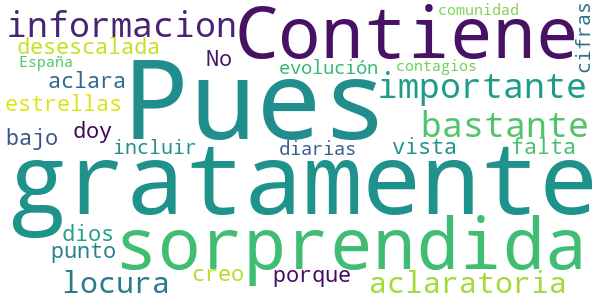
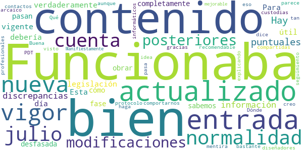
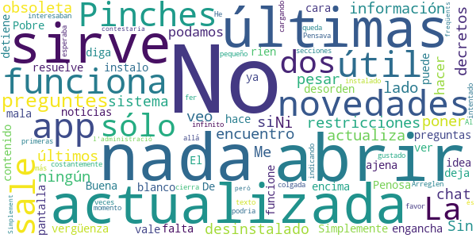

# GVA Responde
App version ``1.0.10``

Analyzed with [covid-apps-observer](http://github.com/covid-apps-observer) project, version ``0.1``

## App overview
| | |
|-------------------------|-------------------------| 
| **Name**&nbsp;&nbsp;&nbsp;&nbsp;&nbsp;&nbsp;&nbsp;&nbsp;&nbsp;&nbsp;&nbsp;&nbsp;&nbsp;&nbsp;&nbsp;&nbsp;&nbsp;&nbsp;&nbsp;&nbsp;&nbsp;&nbsp;&nbsp;&nbsp;&nbsp;&nbsp;&nbsp;&nbsp;&nbsp;&nbsp;&nbsp;&nbsp;&nbsp;&nbsp;&nbsp;&nbsp;&nbsp;&nbsp;&nbsp;&nbsp;  | GVA Responde |
| **Unique identifier** | es.gva.responde |
| **Link to Google Play** | [https://play.google.com/store/apps/details?id=es.gva.responde](https://play.google.com/store/apps/details?id=es.gva.responde) |
| **Summary**  | DUDAS FRECUENTES NO SANITARIAS SOBRE EL CORONAVIRUS |
| **Privacy policy** | [https://www.gva.es/es/inicio/nota_legal](https://www.gva.es/es/inicio/nota_legal) |
| **Latest version** | 1.0.10 |
| **Last update** | 2020-07-28 13:23:45 |
| **Recent changes** | Nuevo contenido. |
| **Installs**  | 10.000+ |
| **Category** | Comunicación |
| **First release** | 3 abr. 2020 |
| **Size**  | 3,7M |
| **Supported Android version**  | 4.4 y versiones posteriores |

### Description
> INFO VIVIENDA PÚBLICA: GUIA DE ACTUACIÓN DECRETO LEY 6/2020
 DUDAS FRECUENTES APLICACIÓN DECRETO LEY 2/2020 AMPLIACIÓN DE VIVIENDA PÚBLICA EN LA COMUNIDAD VALENCIANA
 La Conselleria de Vivienda, presenta la guía INFO VIVIENDA PÚBLICA que recoge la respuesta oficial a las dudas más frecuentes generadas por la aplicación del decreto de ampliación de vivienda pública en la Comunidad Valenciana mediante los derechos de tanteo y retracto.
 INFO COVID-19 GVA:GUIA DE ACTUACIÓN FRENTE AL COVID 19
 DUDAS FRECUENTES NO SANITARIAS SOBRE EL CORONAVIRUS
 La epidemia del Covid 19 , ha generado una crisis global sin precedentes con un impacto inmenso para la sociedad en muy diversos ámbitos: económico, social, educativo,...
 La Consellería de Justicia, Interior y Administración Pública presenta la guía Info Covid19 GVA, que recoge las dudas más frecuentes no sanitarias generadas  por la ciudadanía, clasificadas por el ámbito de su impacto, y con las respuestas adaptadas al contexto de la Comunidad Valenciana.
 Esta información , de carácter meramente informativo, está en continua revisión.

### User interface
The developers of the app provide the following screenshots in the Google play store.
| | | |
|:-------------------------:|:-------------------------:|:-------------------------:|
 |   |   |   | 
 |   |   |   | 
 |   |   |   | 
 |   |   |   | 
 |   |   |   | 
 |   |   |   | 

## Development team
In the following we report the main information provided by the development team in the Google play store.

| | |
|-------------------------|-------------------------|
| **Developer**  | Generalitat Valenciana |
| **Website**  | [http://www.gva.es](http://www.gva.es) |
| **Email** | responde-app@gva.es |
| **Physical address**  | [Calle Democracia, Nº 77 Valencia (España)  CP: 46018](https://www.google.com/maps/search/Calle%20Democracia,%20Nº%2077%20Valencia%20(España)%20CP:%2046018) (Google Maps) |
| **Other developed apps**  | [https://play.google.com/store/apps/developer?id=6787972071287437379](https://play.google.com/store/apps/developer?id=6787972071287437379) |

## Android support

| | |
|-------------------------|-------------------------|
| **Declared target Android version**  | Android10, version 10 (API level 29) |
| **Effective target Android version**  | Android10, version 10 (API level 29) |
| **Minimum supported Android version**  | KitKat, version 4.4 - 4.4.4 (API level 19) |
| **Maximum target Android version**  | - |

The larger the difference between the minimum and maximum supported Android versions, the better. A larger difference means a wider audience. For example, old phones have a very low Android version, so a high minimum supported Android version means that the app cannot be used by users with old phones, thus leading to accessibility problems. 

## Requested permissions

In the following we report the complete list of the permissions requested by the app. 

| **Permission** | **Protection level** | **Description** | 
|-------------------------|-------------------------|-------------------------|
 **android.permission ACCESS_NETWORK_STATE** | Normal | Allows applications to access information about networks. 
 **android.permission CALL_PHONE** | :warning:**Dangerous** | Allows an application to initiate a phone call without going through the Dialer user interface for the user to confirm the call. 
 **android.permission INTERNET** | Normal | Allows applications to open network sockets. 
 **android.permission WAKE_LOCK** | Normal | Allows using PowerManager WakeLocks to keep processor from sleeping or screen from dimming. 
 **com.google.android.c2dm.permission RECEIVE** | - | - 
 **com.google.android.finsky.permission BIND_GET_INSTALL_REFERRER_SERVICE** | - | - 

## Mentioned servers

| **Server** | **Registrant** | **Registrant country** | **Creation date** | 
|-------------------------|-------------------------|-------------------------|-------------------------|
 | facebook.com | Facebook, Inc. | :us: US | 1997-03-29 05:00:00 |
 | google.com | Google LLC | :us: US | 1997-09-15 04:00:00 |
 | googlesyndication.com | Google LLC | :us: US | 2003-01-21 06:17:24 |
 | app-measurement.com | Google LLC | :us: US | 2015-06-19 20:13:31 |
 | googleapis.com | Google LLC | :us: US | 2005-01-25 17:52:26 |
 | googleadservices.com | Google LLC | :us: US | 2003-06-19 16:34:53 |

## Security analysis 

Below we report the main security warnings raised by our execution of the [Androwarn](https://github.com/maaaaz/androwarn) security analysis tool.

**Telephony identifiers leakage**
> - This application reads the numeric name (MCC+MNC) of current registered operator 
> - This application reads the operator name 

**Connection interfaces exfiltration**
> - This application reads details about the currently active data network 
> - This application tries to find out if the currently active data network is metered 

**Telephony services abuse**
> - This application makes phone calls 

**Pim data leakage**
> - This application accesses the contacts list 

## User ratings and reviews

Below we provide information about how end users are reacting to the app in terms of ratings and reviews in the Google Play store.

### Ratings

The GVA Responde app has been installed by more than **10000** times. At this time, **97** rated the app and its average score is **4.010309**. Below we show the distribution of the ratings across the usual star-based rating of Google Play

:star::star::star::star::star:: 63

:star::star::star::star:: 9

:star::star::star:: 3

:star::star:: 7

:star:: 15

### Reviews 

#### 5-star reviews

> Excelente  :date: __2020-05-29 07:43:47__

> Muy completa y útil.  :date: __2020-05-20 16:38:14__

> Información fiable y actualizada. Excelente aplicación  :date: __2020-05-19 19:28:45__

> Actualización completa y diaria de todo lo que nos afecta como ciudadanos. Muy útil.  :date: __2020-05-14 16:20:01__

> Interesante  :date: __2020-05-10 15:43:13__

> Muy útil y completa  :date: __2020-05-05 13:08:36__

> Muy útil  :date: __2020-04-30 14:33:02__

> Molta claredat en la informació  :date: __2020-04-30 11:16:38__

> Fácil de usar y de entender. Enhorabuena  :date: __2020-04-20 01:25:39__

> Be  :date: __2020-04-14 15:03:50__

#### 4-star reviews

> Pues gratamente sorprendida. Contiene informacion importante y bastante aclaratoria en esta locura de desescalada en la que no se aclara ni dios .... No le doy las 5 estrellas porque, bajo mi punto de vista, creo que le falta incluir las cifras diarias con la evolución de los contagios tanto de España como de la comunidad.  :date: __2020-05-24 13:47:13__

#### 3-star reviews

> Una pregunta:¿Se puede ir a las escuelas de bailes de salón? ahora que han terminado las fases. En el decreto del 19/06/2020, no aparece ninguna referencia.Y escuelas ya han empezado a funcionar.  :date: __2020-06-21 20:22:58__

#### 2-star reviews

> Funcionaba bien pero el contenido no está actualizado desde la entrada en vigor de la nueva normalidad en julio 2020, no han tenido en cuenta las modificaciones posteriores, puntuales o no. Hay discrepancias entre la información y la legislación vigente. Para que sea verdaderamente útil debería está al día.  :date: __2020-11-14 10:54:21__

> Esta completamente desfasada, los que pasan a la fase 1 no sabemos cómo obrar y comportarnos.  :date: __2020-05-10 18:59:19__

> Dónde está el seguimiento de contactos como dice el protocolo PDT-3 creo que sería bastante recomendable, gracias.  :date: __2020-05-01 10:04:18__

> ¿Qué pasa con las custodias compartidas? No he visto nada explicando eso.  :date: __2020-04-19 16:04:41__

> Buena idea aunque parece mentira que con los profesionales informáticos y diseñadores que tenemos se haga algo tan arcaico. Manifiestamente mejorable.  :date: __2020-04-04 10:40:59__

#### 1-star reviews

> Simplemente no funciona  :date: __2020-09-02 17:02:50__

> Pobre, mala y encima se engancha. De vergüenza ajena.  :date: __2020-07-24 23:54:32__

> El desorden de su contenido hace que sea poco útil  :date: __2020-07-19 13:20:03__

> Penosa app, se rien en tu cara  :date: __2020-07-01 10:51:54__

> Ineficaz, las respuestas son confusas, ó, ineficaces.  :date: __2020-05-15 07:20:04__

> No me resuelve nada que no me diga las noticias ya....  :date: __2020-05-06 18:45:25__

> Pinches donde pinches no sale nada, sólo una pantalla en blanco. Buena idea sólo falta que funcione  :date: __2020-04-30 22:54:24__

> La instalo y no me deja ver nada .  :date: __2020-04-28 16:46:16__

> No se puede abrir, se detiene costantemente y se cierra  :date: __2020-04-14 23:21:05__

> He intentado abrir dos secciones, las primeras que me interesaban y se queda colgada cargando hasta el infinito y más allá. Arreglen esto por favor.  :date: __2020-04-14 12:28:21__

