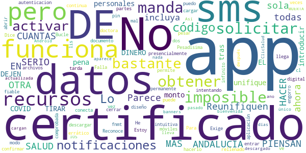

# Salud Andalucía
App version ``2.2.2``

Analyzed with [covid-apps-observer](http://github.com/covid-apps-observer) project, version ``0.1``

## App overview
| | |
|-------------------------|-------------------------| 
| **Name**&nbsp;&nbsp;&nbsp;&nbsp;&nbsp;&nbsp;&nbsp;&nbsp;&nbsp;&nbsp;&nbsp;&nbsp;&nbsp;&nbsp;&nbsp;&nbsp;&nbsp;&nbsp;&nbsp;&nbsp;&nbsp;&nbsp;&nbsp;&nbsp;&nbsp;&nbsp;&nbsp;&nbsp;&nbsp;&nbsp;&nbsp;&nbsp;&nbsp;&nbsp;&nbsp;&nbsp;&nbsp;&nbsp;&nbsp;&nbsp;  | Salud Andalucía |
| **Unique identifier** | es.juntadeandalucia.msspa.saludandalucia |
| **Link to Google Play** | [https://play.google.com/store/apps/details?id=es.juntadeandalucia.msspa.saludandalucia](https://play.google.com/store/apps/details?id=es.juntadeandalucia.msspa.saludandalucia) |
| **Summary**  | Acceso a toda información del Sistema Sanitario Público de Andalucía (SSPA) |
| **Privacy policy** | [https://www.sspa.juntadeandalucia.es/servicioandaluzdesalud/politica-de-privacidad](https://www.sspa.juntadeandalucia.es/servicioandaluzdesalud/politica-de-privacidad) |
| **Latest version** | 2.2.2 |
| **Last update** | 2021-03-12 17:06:20 |
| **Recent changes** | Corrección de errores y mejoras de rendimiento de la aplicación. |
| **Installs**  | 50.000+ |
| **Category** | Salud y bienestar |
| **First release** | 7 abr 2020 |
| **Size**  | 11M |
| **Supported Android version**  | 5.0 y versiones posteriores |

### Description
> Salud Andalucía es una aplicación que le da acceso a toda información del Sistema Sanitario Público de Andalucía (SSPA) y agrupa las apps que el SSPA dispone para el conjunto de los usuarios. La aplicación incluye una sección específica sobre el coronavirus COVID-19.
 El uso de esta aplicación no sustituye la relación médico-paciente.
 Para cualquier consulta sobre el funcionamiento de la aplicación puede ponerse en contacto con el área de mHealth del Sistema Sanitario Público de Andalucía, en el correo: msspa.sc.sspa@juntadeandalucia.es 
 Política de privacidad
 https://www.sspa.juntadeandalucia.es/servicioandaluzdesalud/politica-de-privacidad
 Aviso legal
 https://www.sspa.juntadeandalucia.es/servicioandaluzdesalud/aviso-legal

### User interface
The developers of the app provide the following screenshots in the Google play store.
| | | |
|:-------------------------:|:-------------------------:|:-------------------------:|
 |   |   |   | 
 |   |   |   | 
 |   |  

## Development team
In the following we report the main information provided by the development team in the Google play store.

| | |
|-------------------------|-------------------------|
| **Developer**  | Sistema Sanitario Público de Andalucía |
| **Website**  | [https://www.sspa.juntadeandalucia.es/servicioandaluzdesalud/contacto/sugerencias/registro?idp=4A36EE9174873%7C2BB345%7C146AD2&ctrl=[51531361359229]](https://www.sspa.juntadeandalucia.es/servicioandaluzdesalud/contacto/sugerencias/registro?idp=4A36EE9174873%7C2BB345%7C146AD2&ctrl=[51531361359229]) |
| **Email** | msspa.sc.sspa@juntadeandalucia.es |
| **Physical address**  | - |
| **Other developed apps**  | [https://play.google.com/store/apps/developer?id=Sistema+Sanitario+P%C3%BAblico+de+Andaluc%C3%ADa](https://play.google.com/store/apps/developer?id=Sistema+Sanitario+P%C3%BAblico+de+Andaluc%C3%ADa) |

## Android support

| | |
|-------------------------|-------------------------|
| **Declared target Android version**  | Android10, version 10 (API level 29) |
| **Effective target Android version**  | Android10, version 10 (API level 29) |
| **Minimum supported Android version**  | Lollipop, version 5.0 (API level 21) |
| **Maximum target Android version**  | - |

The larger the difference between the minimum and maximum supported Android versions, the better. A larger difference means a wider audience. For example, old phones have a very low Android version, so a high minimum supported Android version means that the app cannot be used by users with old phones, thus leading to accessibility problems. 

## Requested permissions

In the following we report the complete list of the permissions requested by the app. 

| **Permission** | **Protection level** | **Description** | 
|-------------------------|-------------------------|-------------------------|
 **android.permission ACCESS_NETWORK_STATE** | Normal | Allows applications to access information about networks. 
 **android.permission CAMERA** | :warning:**Dangerous** | Required to be able to access the camera device. 
 **android.permission FOREGROUND_SERVICE** | Normal | Allows a regular application to use Service.startForeground. 
 **android.permission INTERNET** | Normal | Allows applications to open network sockets. 
 **android.permission RECEIVE_BOOT_COMPLETED** | Normal | Allows an application to receive the Intent.ACTION_BOOT_COMPLETED that is broadcast after the system finishes booting. 
 **android.permission REQUEST_IGNORE_BATTERY_OPTIMIZATIONS** | Normal | Permission an application must hold in order to use Settings.ACTION_REQUEST_IGNORE_BATTERY_OPTIMIZATIONS. 
 **android.permission USE_BIOMETRIC** | Normal | Allows an app to use device supported biometric modalities. 
 **android.permission USE_FINGERPRINT** | Normal | This constant was deprecated in API level 28. Applications should request USE_BIOMETRIC instead 
 **android.permission WAKE_LOCK** | Normal | Allows using PowerManager WakeLocks to keep processor from sleeping or screen from dimming. 
 **android.permission WRITE_EXTERNAL_STORAGE** | :warning:**Dangerous** | Allows an application to write to external storage. 
 **com.google.android.c2dm.permission RECEIVE** | - | - 
 **com.google.android.finsky.permission BIND_GET_INSTALL_REFERRER_SERVICE** | - | - 

## Mentioned servers

| **Server** | **Registrant** | **Registrant country** | **Creation date** | 
|-------------------------|-------------------------|-------------------------|-------------------------|
 | googlesyndication.com | Google LLC | :us: US | 2003-01-21 06:17:24 |
 | google.com | Google LLC | :us: US | 1997-09-15 04:00:00 |
 | app-measurement.com | Google LLC | :us: US | 2015-06-19 20:13:31 |
 | crashlytics.com | Google LLC | :us: US | 2011-01-21 15:30:40 |
 | googleapis.com | Google LLC | :us: US | 2005-01-25 17:52:26 |
 | googleadservices.com | Google LLC | :us: US | 2003-06-19 16:34:53 |

## Security analysis 

Below we report the main security warnings raised by our execution of the [Androwarn](https://github.com/maaaaz/androwarn) security analysis tool.

**Connection interfaces exfiltration**
> - This application reads details about the currently active data network 
> - This application tries to find out if the currently active data network is metered 

**Suspicious connection establishment**
> - This application opens a Socket and connects it to the remote address ' returned no addresses for  ; port is out of range' on the 'N/A' port  
> - This application opens a Socket and connects it to the remote address '' on the 'N/A' port  
> - This application opens a Socket and connects it to the remote address 'Ljava/lang/StringBuilder;->toString()Ljava/lang/String;' on the 'N/A' port  
> - This application opens a Socket and connects it to the remote address 'Ljava/net/Proxy;->type()Ljava/net/Proxy$Type;' on the 'N/A' port  
> - This application opens a Socket and connects it to the remote address 'timeout' on the 'N/A' port  

**Code execution**
> - This application loads a native library 

## User ratings and reviews

Below we provide information about how end users are reacting to the app in terms of ratings and reviews in the Google Play store.

### Ratings

The Salud Andalucía app has been installed by more than **50000** times. At this time, **124** rated the app and its average score is **2.71**. Below we show the distribution of the ratings across the usual star-based rating of Google Play

:star::star::star::star::star:: 46

:star::star::star::star:: 6

:star::star::star:: 2

:star::star:: 5

:star:: 65

### Reviews 

#### 5-star reviews

> Una página donde puedes consultar tus datos de salud ,como si tienes citas médicas pendientes, muy buena  :date: __2021-06-05 23:01:33__

> Buena  :date: __2021-06-03 23:20:36__

> Muy FACIL TODO  :date: __2021-05-31 15:52:27__

> Muy buena, una apps que ayuda a la ciudadanía a estar mejor informado y modo más rápido dé interactuar con la Administración.  :date: __2021-05-30 10:27:05__

> Muy rápido y facil  :date: __2021-05-27 12:38:07__

> La primera vez que la uso para pedir el certificado de vacunacion y todo muy bien  :date: __2021-05-25 15:02:31__

> Bien.  :date: __2021-05-25 11:47:07__

> Funciona muy bien, sólo hay que estar muy pendiente de que los todos los datos aportados son correctos.  :date: __2021-05-24 19:03:24__

> Pocitiba  :date: __2021-05-22 18:54:16__

> Buena  :date: __2021-05-21 20:11:52__

#### 4-star reviews

> En general esta muy bien y facil de usar, referente a las vacunas covid tiene muchos fallos, no reconoce que la vacuna de Janssen es monodosis, en consequencia no de permite tener el certificado covid. Con la vacuna de Pfizer despues de la primera dosis te dice que la segunda toca en tres meses y es a las 3 semanas. Si esto se puede rectificar seria ya para dar las 5 estrellas.  :date: __2021-05-29 15:51:03__

> Ponerlo más fácil para los mayores  :date: __2021-05-23 21:24:48__

> Me da error tras error para registrarme y sacar el certificado de vacunación...?  :date: __2021-05-21 16:01:21__

> Me gusta  :date: __2021-05-20 14:25:43__

> Es bastante útil y segura. De facil manejo.  :date: __2021-05-19 18:42:12__

> Cuesta conectar  :date: __2021-05-19 16:49:22__

> La aplicación se sierra aunque no termines la sesión.  :date: __2021-04-29 14:28:43__

> Muy buena App  :date: __2021-03-19 11:19:43__

> No consigo enterarme  :date: __2020-11-27 13:53:31__

#### 3-star reviews

> Es buena, pero no da opcion donde pone AN a poner los dos primeros números de la tarjeta sanitaria  :date: __2021-06-03 16:38:27__

> Sería de agradecer que al identificarse, los datos introducidos se viesen más oscuros. Actualmente el texto se transparenta y a veces cuesta verlo.  :date: __2021-05-06 16:42:17__

> Cuesta coger cita  :date: __2021-04-22 19:12:36__

> Poned modo oscuro y subiré las estrellas  :date: __2020-06-19 10:17:54__

#### 2-star reviews

> Parece que ahora ya funciona pero, EN SERIO OTRA APP MAS DE SALUD ANDALUCIA?????? CUANTAS PIENSAN HACER??? 2000 o 3000?? Reunifiquen todas las apps en una sola app que lo incluya todo y unifique recursos. DEJEN DE TIRAR EL DINERO Y LOS RECURSOS!!!  :date: __2021-05-27 13:08:55__

> De pena, es imposible obtener el certificado COVID con los datos personales. tras introducir un monto de datos te manda a solicitar presencialmente un certificado digital. ..  :date: __2021-05-19 23:42:53__

> Estoy intentando obtener el certificado. He rellenado lis datos una y otra vez y no se conecta.  :date: __2021-05-14 12:04:31__

> app muy poco fiable. Reconoce de modo muy errático el certificado de fnmt. Exige continua autenticacion. Pesadisima  :date: __2021-05-12 17:38:57__

> No es muy intuitiva y tarda bastante en cargar , algunas veces no se puede abrir los archivos y es un engorro  :date: __2021-05-12 10:52:10__

> No me permite entrar con mi cl@ve pin permanente a pesar de estar comprobada.  :date: __2021-05-07 22:37:39__

> Falla al solicitar activar notificaciones. Imposible confirmar código sms  :date: __2021-02-27 07:15:23__

> Para activar notificaciones por sms tienes que cerrar la aplicación cuando te llega el sms del código... Bucle infinito o hacerlo con dos móviles... Pero mal diseño  :date: __2020-10-29 15:13:10__

> No puedo descargar los partes que me manda mi doctora. Dice documento descargado pero nada, no aparece nada  :date: __2020-09-08 08:54:21__

> No se cargan los banners. Lo único que funciona es la bienvenida, después MUERTA. Así lleva bastantes días, tanto en IOS como en Android.  :date: __2020-07-23 15:41:29__

#### 1-star reviews

> Mala, anula el altavoz. Después de descargarla me anuló el sonido como si hubiera conectado unos auriculares, incluso salía el icono de los mismos, hasta que la borré y se solucionó el problema.  :date: __2021-06-06 09:25:03__

> Da error todo el rato, lo suficiente para que no te deje hacer nada  :date: __2021-06-05 14:26:03__

> Aplicación...... inexistente.  :date: __2021-06-05 13:30:19__

> Inútil para obtener certificado de vacunación COVIP, Otro gasto mas a nuestros bolsillos que no funciona y que nadie se responsabiliza, como se ve en el historial de reseñas no es un fallo puntual ya lleva tiempo sin funcionar como debe. Tal vez tenga que pedir disculpa, porque esta aplicación la haya hecho alguien que no ha cobrado nada.  :date: __2021-06-05 07:45:35__

> Esta app no funciona es más mala que una escopeta de caña  :date: __2021-06-04 19:15:08__

> Horrible no carga y no hay manera de que de él certificado digital de estar vacunado. Contra el covid. Piensa, piensa y no sale de ahí. Por aburrimiento lo cierras.  :date: __2021-06-04 16:36:28__

> Es una aplicación que le queda aún mucho por mejorar.De momento no sirve absolutamente para nada.  :date: __2021-06-04 16:29:07__

> Aplicación repleta de fallos, da varios avisos falsos al abrirla. Luego, no se puede configurar porque no contempla tarjetas antiguas y dice que mi número de SS es incorrecto. No voy a renovar mi tarjeta mientras la anterior funcione, no voy a generar un gasto porque sí.  :date: __2021-06-04 15:20:30__

> Bajarse el certificado de vacunación covid, misión imposible  :date: __2021-06-04 13:28:13__

> He instalado la aplicación y no hay manera humana de registrarse,¿para que sirve esta aplicación pués?  :date: __2021-06-04 12:03:39__

