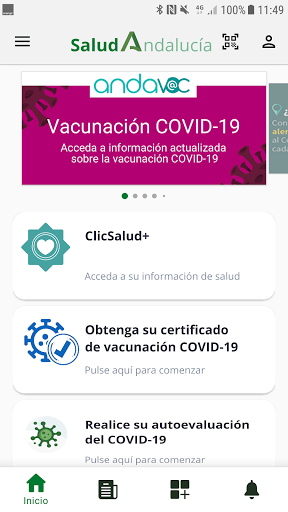
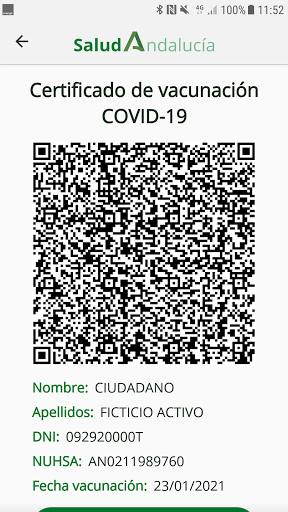

# Salud Andalucía
App version ``2.2.2``

Analyzed with [covid-apps-observer](http://github.com/covid-apps-observer) project, version ``0.1``

## App overview
| | |
|-------------------------|-------------------------| 
| **Name**&nbsp;&nbsp;&nbsp;&nbsp;&nbsp;&nbsp;&nbsp;&nbsp;&nbsp;&nbsp;&nbsp;&nbsp;&nbsp;&nbsp;&nbsp;&nbsp;&nbsp;&nbsp;&nbsp;&nbsp;&nbsp;&nbsp;&nbsp;&nbsp;&nbsp;&nbsp;&nbsp;&nbsp;&nbsp;&nbsp;&nbsp;&nbsp;&nbsp;&nbsp;&nbsp;&nbsp;&nbsp;&nbsp;&nbsp;&nbsp;  | Salud Andalucía |
| **Unique identifier** | es.juntadeandalucia.msspa.saludandalucia |
| **Link to Google Play** | [https://play.google.com/store/apps/details?id=es.juntadeandalucia.msspa.saludandalucia](https://play.google.com/store/apps/details?id=es.juntadeandalucia.msspa.saludandalucia) |
| **Summary**  | Acceso a toda información del Sistema Sanitario Público de Andalucía (SSPA) |
| **Privacy policy** | [https://www.sspa.juntadeandalucia.es/servicioandaluzdesalud/politica-de-privacidad](https://www.sspa.juntadeandalucia.es/servicioandaluzdesalud/politica-de-privacidad) |
| **Latest version** | 2.2.2 |
| **Last update** | 2021-03-12 17:06:20 |
| **Recent changes** | Corrección de errores y mejoras de rendimiento de la aplicación. |
| **Installs**  | 50.000+ |
| **Category** | Salud y bienestar |
| **First release** | 7 abr 2020 |
| **Size**  | 11M |
| **Supported Android version**  | 5.0 y versiones posteriores |

### Description
> Salud Andalucía es una aplicación que le da acceso a toda información del Sistema Sanitario Público de Andalucía (SSPA) y agrupa las apps que el SSPA dispone para el conjunto de los usuarios. La aplicación incluye una sección específica sobre el coronavirus COVID-19.
 El uso de esta aplicación no sustituye la relación médico-paciente.
 Para cualquier consulta sobre el funcionamiento de la aplicación puede ponerse en contacto con el área de mHealth del Sistema Sanitario Público de Andalucía, en el correo: msspa.sc.sspa@juntadeandalucia.es 
 Política de privacidad
 https://www.sspa.juntadeandalucia.es/servicioandaluzdesalud/politica-de-privacidad
 Aviso legal
 https://www.sspa.juntadeandalucia.es/servicioandaluzdesalud/aviso-legal

### User interface
The developers of the app provide the following screenshots in the Google play store.
| | | |
|:-------------------------:|:-------------------------:|:-------------------------:|
 |   |   |   | 
 |   |   |   | 
 |   |  

## Development team
In the following we report the main information provided by the development team in the Google play store.

| | |
|-------------------------|-------------------------|
| **Developer**  | Sistema Sanitario Público de Andalucía |
| **Website**  | [https://www.sspa.juntadeandalucia.es/servicioandaluzdesalud/contacto/sugerencias/registro?idp=4A36EE9174873%7C2BB345%7C146AD2&ctrl=[51531361359229]](https://www.sspa.juntadeandalucia.es/servicioandaluzdesalud/contacto/sugerencias/registro?idp=4A36EE9174873%7C2BB345%7C146AD2&ctrl=[51531361359229]) |
| **Email** | msspa.sc.sspa@juntadeandalucia.es |
| **Physical address**  | - |
| **Other developed apps**  | [https://play.google.com/store/apps/developer?id=Sistema+Sanitario+P%C3%BAblico+de+Andaluc%C3%ADa](https://play.google.com/store/apps/developer?id=Sistema+Sanitario+P%C3%BAblico+de+Andaluc%C3%ADa) |

## Android support

| | |
|-------------------------|-------------------------|
| **Declared target Android version**  | Android10, version 10 (API level 29) |
| **Effective target Android version**  | Android10, version 10 (API level 29) |
| **Minimum supported Android version**  | Lollipop, version 5.0 (API level 21) |
| **Maximum target Android version**  | - |

The larger the difference between the minimum and maximum supported Android versions, the better. A larger difference means a wider audience. For example, old phones have a very low Android version, so a high minimum supported Android version means that the app cannot be used by users with old phones, thus leading to accessibility problems. 

## Requested permissions

In the following we report the complete list of the permissions requested by the app. 

| **Permission** | **Protection level** | **Description** | 
|-------------------------|-------------------------|-------------------------|
 **android.permission ACCESS_NETWORK_STATE** | Normal | Allows applications to access information about networks. 
 **android.permission CAMERA** | :warning:**Dangerous** | Required to be able to access the camera device. 
 **android.permission FOREGROUND_SERVICE** | Normal | Allows a regular application to use Service.startForeground. 
 **android.permission INTERNET** | Normal | Allows applications to open network sockets. 
 **android.permission RECEIVE_BOOT_COMPLETED** | Normal | Allows an application to receive the Intent.ACTION_BOOT_COMPLETED that is broadcast after the system finishes booting. 
 **android.permission REQUEST_IGNORE_BATTERY_OPTIMIZATIONS** | Normal | Permission an application must hold in order to use Settings.ACTION_REQUEST_IGNORE_BATTERY_OPTIMIZATIONS. 
 **android.permission USE_BIOMETRIC** | Normal | Allows an app to use device supported biometric modalities. 
 **android.permission USE_FINGERPRINT** | Normal | This constant was deprecated in API level 28. Applications should request USE_BIOMETRIC instead 
 **android.permission WAKE_LOCK** | Normal | Allows using PowerManager WakeLocks to keep processor from sleeping or screen from dimming. 
 **android.permission WRITE_EXTERNAL_STORAGE** | :warning:**Dangerous** | Allows an application to write to external storage. 
 **com.google.android.c2dm.permission RECEIVE** | - | - 
 **com.google.android.finsky.permission BIND_GET_INSTALL_REFERRER_SERVICE** | - | - 

## Mentioned servers

| **Server** | **Registrant** | **Registrant country** | **Creation date** | 
|-------------------------|-------------------------|-------------------------|-------------------------|
 | googlesyndication.com | Google LLC | :us: US | 2003-01-21 06:17:24 |
 | google.com | Google LLC | :us: US | 1997-09-15 04:00:00 |
 | app-measurement.com | Google LLC | :us: US | 2015-06-19 20:13:31 |
 | crashlytics.com | Google LLC | :us: US | 2011-01-21 15:30:40 |
 | googleapis.com | Google LLC | :us: US | 2005-01-25 17:52:26 |
 | googleadservices.com | Google LLC | :us: US | 2003-06-19 16:34:53 |

## Security analysis 

Below we report the main security warnings raised by our execution of the [Androwarn](https://github.com/maaaaz/androwarn) security analysis tool.

**Connection interfaces exfiltration**
> - This application reads details about the currently active data network 
> - This application tries to find out if the currently active data network is metered 

**Suspicious connection establishment**
> - This application opens a Socket and connects it to the remote address ' returned no addresses for  ; port is out of range' on the 'N/A' port  
> - This application opens a Socket and connects it to the remote address '' on the 'N/A' port  
> - This application opens a Socket and connects it to the remote address 'Ljava/lang/StringBuilder;->toString()Ljava/lang/String;' on the 'N/A' port  
> - This application opens a Socket and connects it to the remote address 'Ljava/net/Proxy;->type()Ljava/net/Proxy$Type;' on the 'N/A' port  
> - This application opens a Socket and connects it to the remote address 'timeout' on the 'N/A' port  

**Code execution**
> - This application loads a native library 

## User ratings and reviews

Below we provide information about how end users are reacting to the app in terms of ratings and reviews in the Google Play store.

### Ratings

The Salud Andalucía app has been installed by more than **50000** times. At this time, **124** rated the app and its average score is **2.71**. Below we show the distribution of the ratings across the usual star-based rating of Google Play

:star::star::star::star::star:: 46

:star::star::star::star:: 6

:star::star::star:: 2

:star::star:: 5

:star:: 65

### Reviews 

#### 5-star reviews

> Práctico y veraz  :date: __2021-03-12 18:50:55__

> Buena  :date: __2021-03-08 18:36:51__

> Buenos  :date: __2021-02-27 14:06:30__

> No me deja registrarme con cl@ve. No me redirige al navegador.  :date: __2021-02-23 11:31:35__

> Esta bien funciona  :date: __2020-12-03 11:13:29__

> Funciona bien  :date: __2020-11-21 00:04:00__

> En menos de un minuto das de alta el teléfono y ya se activan las notificaciones en la app. Funciona normal, no da fallo.  :date: __2020-10-29 10:15:15__

> Muy mal. Tengo que mandar una foto al médico y no sé cómo. No sé si la ha mandado o no, no me lo confirma  :date: __2020-08-27 14:24:26__

> Extraordinaria. Muy intuitiva y completa.  :date: __2020-06-17 13:30:37__

> Una aplicación prometedora. A ver cómo evoluciona. Revisión. La nueva versión incluye mejoras muy interesantes. El siguiente paso debería sustituir la obsoleta Salud Responde.  :date: __2020-06-14 13:49:06__

#### 4-star reviews

> No consigo enterarme  :date: __2020-11-27 13:53:31__

#### 3-star reviews

> Poned modo oscuro y subiré las estrellas  :date: __2020-06-19 10:17:54__

#### 2-star reviews

> Falla al solicitar activar notificaciones. Imposible confirmar código sms  :date: __2021-02-27 07:15:23__

> Para activar notificaciones por sms tienes que cerrar la aplicación cuando te llega el sms del código... Bucle infinito o hacerlo con dos móviles... Pero mal diseño  :date: __2020-10-29 15:13:10__

> No puedo descargar los partes que me manda mi doctora. Dice documento descargado pero nada, no aparece nada  :date: __2020-09-08 08:54:21__

> No se cargan los banners. Lo único que funciona es la bienvenida, después MUERTA. Así lleva bastantes días, tanto en IOS como en Android.  :date: __2020-07-23 15:41:29__

> ClicSalud no esta actualizada desde el año pasado  :date: __2020-06-23 09:00:52__

#### 1-star reviews

> No se descarga certificado covid de vacunacion así que no puedo obtener mi certificado. Pero además de ser sanitario con mis dosis las cuales me pusieron muy enfermos ya que la segunda me provocó u a bronquitis aguda grave, 1 mes de bajay cual es mi sorpresa al hacerme u a serlogia no tengo anticuerpo ni rastro de virus. Que medicamento.me.inyectaro? Que consecuencias para mi salud xorre... nadie me explica nada  :date: __2021-03-12 23:08:33__

> Ahora da la opción de poner los datos personales, pero no sale la opción de iniciar sesión, dos semanas con la aplicación instalada para nada  :date: __2021-03-12 18:36:59__

> No me deja entrar cuando meto todos mis datos  :date: __2021-03-12 15:12:49__

> No se puede entrar, ni con certificado, ni con los datos, no hay forma.  :date: __2021-03-12 12:58:11__

> Malisima  :date: __2021-03-12 12:08:21__

> La APP descargada No reconoce el certificado digital aunque este en memoria, y no da datos,  :date: __2021-03-09 21:46:09__

> El acceso con clave no funciona!!!! Haced el favor de arreglarlo  :date: __2021-03-09 21:08:37__

> Al intentar autenticar el usuario con el clave permanente y no permite acceder. El Userid y password está verificado que son correctos. Los apellidos con Ñ pueden ser el problema al intercambiar información con la pasarela de autentificación.  :date: __2021-03-06 11:44:07__

> No puedes acceder a nada todo da error  :date: __2021-03-05 15:35:14__

> No conecta la autenticación con clave pin con la app de clave pin, con lo que no sirve para nada.  :date: __2021-03-04 12:53:13__

