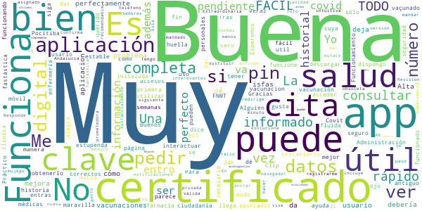
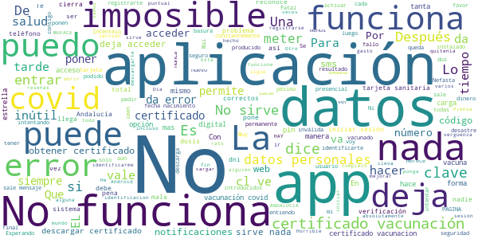

# Salud Andalucía
App version ``2.2.2``

Analyzed with [covid-apps-observer](http://github.com/covid-apps-observer) project, version ``0.1``

## App overview
| | |
|-------------------------|-------------------------| 
| **Name**&nbsp;&nbsp;&nbsp;&nbsp;&nbsp;&nbsp;&nbsp;&nbsp;&nbsp;&nbsp;&nbsp;&nbsp;&nbsp;&nbsp;&nbsp;&nbsp;&nbsp;&nbsp;&nbsp;&nbsp;&nbsp;&nbsp;&nbsp;&nbsp;&nbsp;&nbsp;&nbsp;&nbsp;&nbsp;&nbsp;&nbsp;&nbsp;&nbsp;&nbsp;&nbsp;&nbsp;&nbsp;&nbsp;&nbsp;&nbsp;  | Salud Andalucía |
| **Unique identifier** | es.juntadeandalucia.msspa.saludandalucia |
| **Link to Google Play** | [https://play.google.com/store/apps/details?id=es.juntadeandalucia.msspa.saludandalucia](https://play.google.com/store/apps/details?id=es.juntadeandalucia.msspa.saludandalucia) |
| **Summary**  | Acceso a toda información del Sistema Sanitario Público de Andalucía (SSPA) |
| **Privacy policy** | [https://www.sspa.juntadeandalucia.es/servicioandaluzdesalud/politica-de-privacidad](https://www.sspa.juntadeandalucia.es/servicioandaluzdesalud/politica-de-privacidad) |
| **Latest version** | 2.2.2 |
| **Last update** | 2021-03-12 17:06:20 |
| **Recent changes** | Corrección de errores y mejoras de rendimiento de la aplicación. |
| **Installs**  | 50.000+ |
| **Category** | Salud y bienestar |
| **First release** | 7 abr 2020 |
| **Size**  | 11M |
| **Supported Android version**  | 5.0 y versiones posteriores |

### Description
> Salud Andalucía es una aplicación que le da acceso a toda información del Sistema Sanitario Público de Andalucía (SSPA) y agrupa las apps que el SSPA dispone para el conjunto de los usuarios. La aplicación incluye una sección específica sobre el coronavirus COVID-19.
 El uso de esta aplicación no sustituye la relación médico-paciente.
 Para cualquier consulta sobre el funcionamiento de la aplicación puede ponerse en contacto con el área de mHealth del Sistema Sanitario Público de Andalucía, en el correo: msspa.sc.sspa@juntadeandalucia.es 
 Política de privacidad
 https://www.sspa.juntadeandalucia.es/servicioandaluzdesalud/politica-de-privacidad
 Aviso legal
 https://www.sspa.juntadeandalucia.es/servicioandaluzdesalud/aviso-legal

### User interface
The developers of the app provide the following screenshots in the Google play store.
| | | |
|:-------------------------:|:-------------------------:|:-------------------------:|
 |   |   |   | 
 |   |   |   | 
 |   |  

## Development team
In the following we report the main information provided by the development team in the Google play store.

| | |
|-------------------------|-------------------------|
| **Developer**  | Sistema Sanitario Público de Andalucía |
| **Website**  | [https://www.sspa.juntadeandalucia.es/servicioandaluzdesalud/contacto/sugerencias/registro?idp=4A36EE9174873%7C2BB345%7C146AD2&ctrl=[51531361359229]](https://www.sspa.juntadeandalucia.es/servicioandaluzdesalud/contacto/sugerencias/registro?idp=4A36EE9174873%7C2BB345%7C146AD2&ctrl=[51531361359229]) |
| **Email** | msspa.sc.sspa@juntadeandalucia.es |
| **Physical address**  | - |
| **Other developed apps**  | [https://play.google.com/store/apps/developer?id=Sistema+Sanitario+P%C3%BAblico+de+Andaluc%C3%ADa](https://play.google.com/store/apps/developer?id=Sistema+Sanitario+P%C3%BAblico+de+Andaluc%C3%ADa) |

## Android support

| | |
|-------------------------|-------------------------|
| **Declared target Android version**  | Android10, version 10 (API level 29) |
| **Effective target Android version**  | Android10, version 10 (API level 29) |
| **Minimum supported Android version**  | Lollipop, version 5.0 (API level 21) |
| **Maximum target Android version**  | - |

The larger the difference between the minimum and maximum supported Android versions, the better. A larger difference means a wider audience. For example, old phones have a very low Android version, so a high minimum supported Android version means that the app cannot be used by users with old phones, thus leading to accessibility problems. 

## Requested permissions

In the following we report the complete list of the permissions requested by the app. 

| **Permission** | **Protection level** | **Description** | 
|-------------------------|-------------------------|-------------------------|
 **android.permission ACCESS_NETWORK_STATE** | Normal | Allows applications to access information about networks. 
 **android.permission CAMERA** | :warning:**Dangerous** | Required to be able to access the camera device. 
 **android.permission FOREGROUND_SERVICE** | Normal | Allows a regular application to use Service.startForeground. 
 **android.permission INTERNET** | Normal | Allows applications to open network sockets. 
 **android.permission RECEIVE_BOOT_COMPLETED** | Normal | Allows an application to receive the Intent.ACTION_BOOT_COMPLETED that is broadcast after the system finishes booting. 
 **android.permission REQUEST_IGNORE_BATTERY_OPTIMIZATIONS** | Normal | Permission an application must hold in order to use Settings.ACTION_REQUEST_IGNORE_BATTERY_OPTIMIZATIONS. 
 **android.permission USE_BIOMETRIC** | Normal | Allows an app to use device supported biometric modalities. 
 **android.permission USE_FINGERPRINT** | Normal | This constant was deprecated in API level 28. Applications should request USE_BIOMETRIC instead 
 **android.permission WAKE_LOCK** | Normal | Allows using PowerManager WakeLocks to keep processor from sleeping or screen from dimming. 
 **android.permission WRITE_EXTERNAL_STORAGE** | :warning:**Dangerous** | Allows an application to write to external storage. 
 **com.google.android.c2dm.permission RECEIVE** | - | - 
 **com.google.android.finsky.permission BIND_GET_INSTALL_REFERRER_SERVICE** | - | - 

## Mentioned servers

| **Server** | **Registrant** | **Registrant country** | **Creation date** | 
|-------------------------|-------------------------|-------------------------|-------------------------|
 | googlesyndication.com | Google LLC | :us: US | 2003-01-21 06:17:24 |
 | google.com | Google LLC | :us: US | 1997-09-15 04:00:00 |
 | app-measurement.com | Google LLC | :us: US | 2015-06-19 20:13:31 |
 | crashlytics.com | Google LLC | :us: US | 2011-01-21 15:30:40 |
 | googleapis.com | Google LLC | :us: US | 2005-01-25 17:52:26 |
 | googleadservices.com | Google LLC | :us: US | 2003-06-19 16:34:53 |

## Security analysis 

Below we report the main security warnings raised by our execution of the [Androwarn](https://github.com/maaaaz/androwarn) security analysis tool.

**Connection interfaces exfiltration**
> - This application reads details about the currently active data network 
> - This application tries to find out if the currently active data network is metered 

**Suspicious connection establishment**
> - This application opens a Socket and connects it to the remote address ' returned no addresses for  ; port is out of range' on the 'N/A' port  
> - This application opens a Socket and connects it to the remote address '' on the 'N/A' port  
> - This application opens a Socket and connects it to the remote address 'Ljava/lang/StringBuilder;->toString()Ljava/lang/String;' on the 'N/A' port  
> - This application opens a Socket and connects it to the remote address 'Ljava/net/Proxy;->type()Ljava/net/Proxy$Type;' on the 'N/A' port  
> - This application opens a Socket and connects it to the remote address 'timeout' on the 'N/A' port  

**Code execution**
> - This application loads a native library 

## User ratings and reviews

Below we provide information about how end users are reacting to the app in terms of ratings and reviews in the Google Play store.

### Ratings

The Salud Andalucía app has been installed by more than **50000** times. At this time, **124** rated the app and its average score is **2.71**. Below we show the distribution of the ratings across the usual star-based rating of Google Play

:star::star::star::star::star:: 46

:star::star::star::star:: 6

:star::star::star:: 2

:star::star:: 5

:star:: 65

### Reviews 

#### 5-star reviews

> Me parece muy útil pero he querido descargar el certificado Covit y me dice que no dispongo de certificado y estoy vaçunado desde el 28 de marzo. Alguien me puede dar información como obtenerlo?, Gracias  :date: __2021-05-13 00:54:47__

> Me gusta y es fácil de utilizar  :date: __2021-05-12 11:21:49__

> Buena  :date: __2021-05-09 18:29:44__

> Muy util  :date: __2021-05-06 12:30:01__

> Es fastástica 👏👏❤️❤️  :date: __2021-05-05 16:52:50__

> Tras usarlo un par de semanas me alegra que por fin una app salud funcione; ojo yo a Clip Salud+ entro con clave pin (24h), cuya app tengo en el móvil instalada con seguridad huella, de esta manera la clave me llega a la app, además de ser seguro,(se pueden ver historial, citas y datos personales) si entras con clave pin hay cero problemas, con certificado digital no se porque es antiguo y no tengo ; se puede consultar, pedir cita, ... la app va estable y fluida. Esperemos que siga funcionando.  :date: __2021-05-04 12:35:59__

> Muy Útil y necesaria  :date: __2021-05-03 20:39:20__

> Funciona perfectamente con todos los accesos a tu historial, pedir citas, vacunaciones, enfermería, ect.. muy completa. Para acceder a todo hay que tener Certificado Digital.  :date: __2021-04-28 12:01:04__

> Buena  :date: __2021-04-27 17:29:42__

> Me ha funcionado perfectamente  :date: __2021-04-09 15:55:01__

#### 4-star reviews

> La aplicación se sierra aunque no termines la sesión.  :date: __2021-04-29 14:28:43__

> Muy buena App  :date: __2021-03-19 11:19:43__

> No consigo enterarme  :date: __2020-11-27 13:53:31__

#### 3-star reviews

> Sería de agradecer que al identificarse, los datos introducidos se viesen más oscuros. Actualmente el texto se transparenta y a veces cuesta verlo.  :date: __2021-05-06 16:42:17__

> Cuesta coger cita  :date: __2021-04-22 19:12:36__

> Poned modo oscuro y subiré las estrellas  :date: __2020-06-19 10:17:54__

#### 2-star reviews

> app muy poco fiable. Reconoce de modo muy errático el certificado de fnmt. Exige continua autenticacion. Pesadisima  :date: __2021-05-12 17:38:57__

> No es muy intuitiva y tarda bastante en cargar , algunas veces no se puede abrir los archivos y es un engorro  :date: __2021-05-12 10:52:10__

> No me permite entrar con mi cl@ve pin permanente a pesar de estar comprobada.  :date: __2021-05-07 22:37:39__

> Falla al solicitar activar notificaciones. Imposible confirmar código sms  :date: __2021-02-27 07:15:23__

> Para activar notificaciones por sms tienes que cerrar la aplicación cuando te llega el sms del código... Bucle infinito o hacerlo con dos móviles... Pero mal diseño  :date: __2020-10-29 15:13:10__

> No puedo descargar los partes que me manda mi doctora. Dice documento descargado pero nada, no aparece nada  :date: __2020-09-08 08:54:21__

> No se cargan los banners. Lo único que funciona es la bienvenida, después MUERTA. Así lleva bastantes días, tanto en IOS como en Android.  :date: __2020-07-23 15:41:29__

> ClicSalud no esta actualizada desde el año pasado  :date: __2020-06-23 09:00:52__

#### 1-star reviews

> No puedo sacar el certificado de vacunacion al final tendre que ir al mi centro de salud  :date: __2021-05-13 00:46:37__

> No funciona. No me deja entrar con mis datos, me pone información inválida...  :date: __2021-05-12 21:33:02__

> Si hubiera cero o menos 10, se lo pondría. Quién habrá hecho la aplicación???? No vale ni para forraje!!!!  :date: __2021-05-12 20:03:19__

> Dice que los datos introducidos no son validos  :date: __2021-05-12 19:01:15__

> Vaya una basura, sois una panda de ratas que no merece perdón  :date: __2021-05-12 13:58:09__

> No funciona ,no puedo entrar ni por Clave ,ni por datos personales , siempre da error  :date: __2021-05-12 12:58:03__

> Para el usuario normal es el Laberinto de Teseo ....Ni el Banco te pone tantas pegas.... Para llevarlos al Museo Británico....Digno de estudio.  :date: __2021-05-12 04:30:57__

> Por favor, que dejen vacunar en las farmacias. Con 63 años, y aún no me han llamado.  :date: __2021-05-11 06:38:56__

> No funciona, es imposible acceder al certificado de vacunación.  :date: __2021-05-10 23:53:18__

> Aunque aparece la opción de registrarte con datos no te permite hacerlo y por lo tanto no puedes usarla  :date: __2021-05-10 08:48:33__

