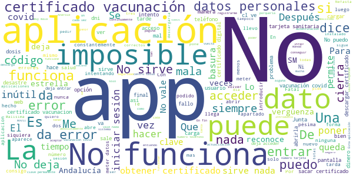

# Salud Andalucía
App version ``2.3.0``

Analyzed with [covid-apps-observer](http://github.com/covid-apps-observer) project, version ``0.1``

## App overview
| | |
|-------------------------|-------------------------| 
| **Name**&nbsp;&nbsp;&nbsp;&nbsp;&nbsp;&nbsp;&nbsp;&nbsp;&nbsp;&nbsp;&nbsp;&nbsp;&nbsp;&nbsp;&nbsp;&nbsp;&nbsp;&nbsp;&nbsp;&nbsp;&nbsp;&nbsp;&nbsp;&nbsp;&nbsp;&nbsp;&nbsp;&nbsp;&nbsp;&nbsp;&nbsp;&nbsp;&nbsp;&nbsp;&nbsp;&nbsp;&nbsp;&nbsp;&nbsp;&nbsp;  | Salud Andalucía |
| **Unique identifier** | es.juntadeandalucia.msspa.saludandalucia |
| **Link to Google Play** | [https://play.google.com/store/apps/details?id=es.juntadeandalucia.msspa.saludandalucia](https://play.google.com/store/apps/details?id=es.juntadeandalucia.msspa.saludandalucia) |
| **Summary**  | Acceso a toda información del Sistema Sanitario Público de Andalucía (SSPA) |
| **Privacy policy** | [https://www.sspa.juntadeandalucia.es/servicioandaluzdesalud/politica-de-privacidad](https://www.sspa.juntadeandalucia.es/servicioandaluzdesalud/politica-de-privacidad) |
| **Latest version** | 2.3.0 |
| **Last update** | 2021-06-08 20:48:55 |
| **Recent changes** | Se incorpora a la App el Certificado Digital COVID UE para los ciudadanos de Andalucía, donde se recoge el certificado de recuperación, pruebas y/o vacunación. |
| **Installs**  | 100.000+ |
| **Category** | Salud y bienestar |
| **First release** | 7 abr 2020 |
| **Size**  | 11M |
| **Supported Android version**  | 5.0 y versiones posteriores |

### Description
> Salud Andalucía es una aplicación que le da acceso a toda información del Sistema Sanitario Público de Andalucía (SSPA) y agrupa las apps que el SSPA dispone para el conjunto de los usuarios. La aplicación incluye una sección específica sobre el coronavirus COVID-19.
 El uso de esta aplicación no sustituye la relación médico-paciente.
 Para cualquier consulta sobre el funcionamiento de la aplicación puede ponerse en contacto con el área de mHealth del Sistema Sanitario Público de Andalucía, en el correo: msspa.sc.sspa@juntadeandalucia.es 
 Política de privacidad
 https://www.sspa.juntadeandalucia.es/servicioandaluzdesalud/politica-de-privacidad
 Aviso legal
 https://www.sspa.juntadeandalucia.es/servicioandaluzdesalud/aviso-legal

### User interface
The developers of the app provide the following screenshots in the Google play store.
| | | |
|:-------------------------:|:-------------------------:|:-------------------------:|
 |   |   |   | 
 |   |   |   | 
 |   |  

## Development team
In the following we report the main information provided by the development team in the Google play store.

| | |
|-------------------------|-------------------------|
| **Developer**  | Sistema Sanitario Público de Andalucía |
| **Website**  | [https://www.sspa.juntadeandalucia.es/servicioandaluzdesalud/contacto/sugerencias/registro?idp=4A36EE9174873%7C2BB345%7C146AD2&ctrl=[51531361359229]](https://www.sspa.juntadeandalucia.es/servicioandaluzdesalud/contacto/sugerencias/registro?idp=4A36EE9174873%7C2BB345%7C146AD2&ctrl=[51531361359229]) |
| **Email** | msspa.sc.sspa@juntadeandalucia.es |
| **Physical address**  | - |
| **Other developed apps**  | [https://play.google.com/store/apps/developer?id=Sistema+Sanitario+P%C3%BAblico+de+Andaluc%C3%ADa](https://play.google.com/store/apps/developer?id=Sistema+Sanitario+P%C3%BAblico+de+Andaluc%C3%ADa) |

## Android support

| | |
|-------------------------|-------------------------|
| **Declared target Android version**  | Android10, version 10 (API level 29) |
| **Effective target Android version**  | Android10, version 10 (API level 29) |
| **Minimum supported Android version**  | Lollipop, version 5.0 (API level 21) |
| **Maximum target Android version**  | - |

The larger the difference between the minimum and maximum supported Android versions, the better. A larger difference means a wider audience. For example, old phones have a very low Android version, so a high minimum supported Android version means that the app cannot be used by users with old phones, thus leading to accessibility problems. 

## Requested permissions

In the following we report the complete list of the permissions requested by the app. 

| **Permission** | **Protection level** | **Description** | 
|-------------------------|-------------------------|-------------------------|
 **android.permission ACCESS_NETWORK_STATE** | Normal | Allows applications to access information about networks. 
 **android.permission CAMERA** | :warning:**Dangerous** | Required to be able to access the camera device. 
 **android.permission FOREGROUND_SERVICE** | Normal | Allows a regular application to use Service.startForeground. 
 **android.permission INTERNET** | Normal | Allows applications to open network sockets. 
 **android.permission RECEIVE_BOOT_COMPLETED** | Normal | Allows an application to receive the Intent.ACTION_BOOT_COMPLETED that is broadcast after the system finishes booting. 
 **android.permission REQUEST_IGNORE_BATTERY_OPTIMIZATIONS** | Normal | Permission an application must hold in order to use Settings.ACTION_REQUEST_IGNORE_BATTERY_OPTIMIZATIONS. 
 **android.permission USE_BIOMETRIC** | Normal | Allows an app to use device supported biometric modalities. 
 **android.permission USE_FINGERPRINT** | Normal | This constant was deprecated in API level 28. Applications should request USE_BIOMETRIC instead 
 **android.permission WAKE_LOCK** | Normal | Allows using PowerManager WakeLocks to keep processor from sleeping or screen from dimming. 
 **android.permission WRITE_EXTERNAL_STORAGE** | :warning:**Dangerous** | Allows an application to write to external storage. 
 **com.google.android.c2dm.permission RECEIVE** | - | - 
 **com.google.android.finsky.permission BIND_GET_INSTALL_REFERRER_SERVICE** | - | - 

## Mentioned servers

| **Server** | **Registrant** | **Registrant country** | **Creation date** | 
|-------------------------|-------------------------|-------------------------|-------------------------|
 | googlesyndication.com | Google LLC | :us: US | 2003-01-21 06:17:24 |
 | google.com | Google LLC | :us: US | 1997-09-15 04:00:00 |
 | app-measurement.com | Google LLC | :us: US | 2015-06-19 20:13:31 |
 | crashlytics.com | Google LLC | :us: US | 2011-01-21 15:30:40 |
 | googleapis.com | Google LLC | :us: US | 2005-01-25 17:52:26 |
 | googleadservices.com | Google LLC | :us: US | 2003-06-19 16:34:53 |

## Security analysis 

Below we report the main security warnings raised by our execution of the [Androwarn](https://github.com/maaaaz/androwarn) security analysis tool.

**Connection interfaces exfiltration**
> - This application reads details about the currently active data network 
> - This application tries to find out if the currently active data network is metered 

**Suspicious connection establishment**
> - This application opens a Socket and connects it to the remote address ' returned no addresses for  ; port is out of range' on the 'N/A' port  
> - This application opens a Socket and connects it to the remote address '' on the 'N/A' port  
> - This application opens a Socket and connects it to the remote address 'Ljava/lang/StringBuilder;->toString()Ljava/lang/String;' on the 'N/A' port  
> - This application opens a Socket and connects it to the remote address 'Ljava/net/Proxy;->type()Ljava/net/Proxy$Type;' on the 'N/A' port  
> - This application opens a Socket and connects it to the remote address 'timeout' on the 'N/A' port  

**Code execution**
> - This application loads a native library 

## User ratings and reviews

Below we provide information about how end users are reacting to the app in terms of ratings and reviews in the Google Play store.

### Ratings

The Salud Andalucía app has been installed by more than **100000** times. At this time, **744** rated the app and its average score is **3.4439251**. Below we show the distribution of the ratings across the usual star-based rating of Google Play

:star::star::star::star::star:: 366

:star::star::star::star:: 94

:star::star::star:: 27

:star::star:: 20

:star:: 237

### Reviews 

#### 5-star reviews

> Buena  :date: __2021-06-20 08:55:41__

> No tengo  :date: __2021-06-19 21:22:56__

> Ok  :date: __2021-06-19 14:18:08__

> La app funciona perfectamente siempre y cuando tengas el certificado digital instalado en el dispositivo antes. Todo lo que necesitas es eso.  :date: __2021-06-18 19:09:12__

> Funciona de forma correcta. Sin problemas. El certificado lo pude ver al siguiente día de vacunarse. Si abres el pdf con una aplicación adecuada se puede guardar por ejemplo en drive. Buen trabajo.  :date: __2021-06-18 18:22:51__

> Buena app para todos!!!!  :date: __2021-06-18 14:18:50__

> Funciona perfectamente excelente, a aquellos que al introducir el número de seguridad social les da error, decirles que si tienen la app de Salud Responde viene el numero correcto para poner, digo esto porque cuando metes el numero que viene en tu tarjeta sanitaria da error y eso es x que tu numero de seguridad social es otro, o llamar a seguridad social para que te digan tu numero.  :date: __2021-06-18 13:44:45__

> Estoy perfectamente de acuerdo con todo y espero que todos el mundo la tenga muchas gracias  :date: __2021-06-18 10:38:10__

> Muy bien  :date: __2021-06-17 17:37:37__

> La app está muy bien certificado de vacunación historial clínico medicación analíticas  :date: __2021-06-17 12:15:46__

#### 4-star reviews

> Toda la información sanitaria en un click. Aunque presenta fallos de vez en cuando.  :date: __2021-06-19 12:29:27__

> Algunos errores al intentar acceder, pero tras obtener el código de identificación, todo perfecto.  :date: __2021-06-18 00:30:37__

> Le doy por buena  :date: __2021-06-15 22:24:55__

> Buena  :date: __2021-06-13 22:27:06__

> Perfecta.En Andalucía ya puedes tener tu certificado de vacunación covid en tu móvil. Es fácil de usar y tienes acceso a tus datos. Contiene noticias también sobre salud.Sigan así  :date: __2021-06-12 14:16:52__

> Buena  :date: __2021-06-11 19:39:20__

> Buena  :date: __2021-06-10 19:30:29__

> App muy buena y completa  :date: __2021-06-10 13:59:57__

> En la nueva versión ya no aparece el lector QR que te ofrecía la posibilidad de verificar el certificado de otro usuario.  :date: __2021-06-09 23:13:58__

> La verdad que es una app útil, lo de poder descargarse el certificado COVID es una pasada, no le doy 5 estrellas porque aún hay que mejorar muchas cosas.  :date: __2021-06-09 21:13:17__

#### 3-star reviews

> Útil, lo malo es tener que abrir el navegador para hacer algunas gestiones  :date: __2021-06-09 18:12:00__

> No se puede acceder a todas las prestaciones que se ofrecen .  :date: __2021-06-09 08:02:08__

> Es buena, pero no da opcion donde pone AN a poner los dos primeros números de la tarjeta sanitaria  :date: __2021-06-03 16:38:27__

> Sería de agradecer que al identificarse, los datos introducidos se viesen más oscuros. Actualmente el texto se transparenta y a veces cuesta verlo.  :date: __2021-05-06 16:42:17__

> Cuesta coger cita  :date: __2021-04-22 19:12:36__

> Poned modo oscuro y subiré las estrellas  :date: __2020-06-19 10:17:54__

#### 2-star reviews

> Pongo todos mi datos y en el apartado teléfono me sale un circulo verde i como información y no me sale cuadro para poner el numero de teléfono. Espero que lo arregleis q tengo prisa para sacar mi certificado de vacuna.  :date: __2021-06-18 14:25:59__

> No hay forma de entrar con DNIe,imposible ,en el ordenador regular , en el.movil un bodrio  :date: __2021-06-16 18:25:40__

> No funciona correctamente y quiero sacar el serteficado de la vacuna ya la tengo las dos puestas y no me deja  :date: __2021-06-16 13:31:55__

> A mi no me deja introducir mi DNI completo, que puedo hacer?  :date: __2021-06-14 14:04:07__

> No deja entrar a las tarjetas naranjas (12 digitos sin letras), es decir sino tienes el famoso AN que aparece en la nueva tarjeta verde y que aquí se marca por defecto en la aplicación no deja identificarse.  :date: __2021-06-12 04:00:00__

> Muy mala.No acepta los datos que pide  :date: __2021-06-10 18:53:16__

> Falla mucho la aplicacion o llo no la entiendo  :date: __2021-06-09 10:50:17__

> No puedo abrir  :date: __2021-06-08 20:46:27__

> Se me cierra justo al abrirla  :date: __2021-06-08 20:11:56__

> Da bastantes errores. El certificado de vacunación lo he podido descargar en Clic Salud pero, luego me he descargado esta APP para validar el QR, y no escanea. No sé qué ocurre.  :date: __2021-06-07 22:45:43__

#### 1-star reviews

> Me pasa lo que a muchos usuarios, no me reconoce la clave permanente pero tampoco me da opción a registrarme con los datos personales porque se me queda fija la pantalla en el campo teléfono y no puedo seguir. El certificado me lo han tenido que sacar desde otro dispositivo. No es entendible ...  :date: __2021-06-21 09:45:52__

> Una auténtica basura, al igual que otro usuario pones los datos y dice que la tarjeta sanitaria no es correcta, y con la clave permanente tampoco va, basura,basura,basura  :date: __2021-06-21 09:38:47__

> Sencillamente no funciona, da error constante  :date: __2021-06-21 09:37:38__

> Me da erro en el proceso de autenticación, constantemente.  :date: __2021-06-20 21:42:47__

> A mi no me funciona,no me deja abrir sección  :date: __2021-06-20 19:28:45__

> La página para el certificado de vacunación está mal hecha, no deja darle a aceptar. De hecho, está tan mal hecha que ni siquiera en vuestras capturas para las instrucciones podéis ver la opción de aceptar completa...  :date: __2021-06-20 16:12:33__

> Cuando pongo el número de la seguridad social me da inválido  :date: __2021-06-20 13:42:15__

> Como funcionan los organismos aquí en Andalucía, te exigen para iniciar sesión, una cl@ve pin PRESENCIAL, si no se molestan en descolgar el teléfono de los centros de salud, van a darte cita para la clave..... En fin, suma y sigue.  :date: __2021-06-20 10:02:55__

> No puedo acceder  :date: __2021-06-20 00:22:15__

> No abre ninguna opción para poder descargar el certificado de vacunacion. Ni ninguna otra. La App no sirve para nada.  :date: __2021-06-19 22:53:14__

