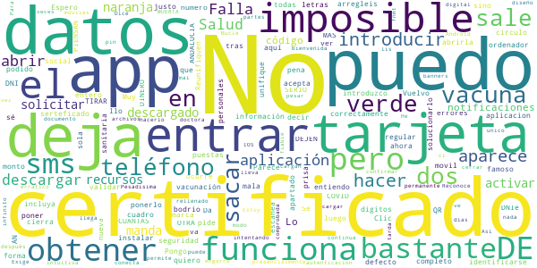

# Salud Andalucía
App version ``2.3.0``

Analyzed with [covid-apps-observer](http://github.com/covid-apps-observer) project, version ``0.1``

## App overview
| | |
|-------------------------|-------------------------| 
| **Name**&nbsp;&nbsp;&nbsp;&nbsp;&nbsp;&nbsp;&nbsp;&nbsp;&nbsp;&nbsp;&nbsp;&nbsp;&nbsp;&nbsp;&nbsp;&nbsp;&nbsp;&nbsp;&nbsp;&nbsp;&nbsp;&nbsp;&nbsp;&nbsp;&nbsp;&nbsp;&nbsp;&nbsp;&nbsp;&nbsp;&nbsp;&nbsp;&nbsp;&nbsp;&nbsp;&nbsp;&nbsp;&nbsp;&nbsp;&nbsp;  | Salud Andalucía |
| **Unique identifier** | es.juntadeandalucia.msspa.saludandalucia |
| **Link to Google Play** | [https://play.google.com/store/apps/details?id=es.juntadeandalucia.msspa.saludandalucia](https://play.google.com/store/apps/details?id=es.juntadeandalucia.msspa.saludandalucia) |
| **Summary**  | Acceso a toda información del Sistema Sanitario Público de Andalucía (SSPA) |
| **Privacy policy** | [https://www.sspa.juntadeandalucia.es/servicioandaluzdesalud/politica-de-privacidad](https://www.sspa.juntadeandalucia.es/servicioandaluzdesalud/politica-de-privacidad) |
| **Latest version** | 2.3.0 |
| **Last update** | 2021-06-08 20:48:55 |
| **Recent changes** | Se incorpora a la App el Certificado Digital COVID UE para los ciudadanos de Andalucía, donde se recoge el certificado de recuperación, pruebas y/o vacunación. |
| **Installs**  | 100.000+ |
| **Category** | Salud y bienestar |
| **First release** | 7 abr 2020 |
| **Size**  | 11M |
| **Supported Android version**  | 5.0 y versiones posteriores |

### Description
> Salud Andalucía es una aplicación que le da acceso a toda información del Sistema Sanitario Público de Andalucía (SSPA) y agrupa las apps que el SSPA dispone para el conjunto de los usuarios. La aplicación incluye una sección específica sobre el coronavirus COVID-19.
 El uso de esta aplicación no sustituye la relación médico-paciente.
 Para cualquier consulta sobre el funcionamiento de la aplicación puede ponerse en contacto con el área de mHealth del Sistema Sanitario Público de Andalucía, en el correo: msspa.sc.sspa@juntadeandalucia.es 
 Política de privacidad
 https://www.sspa.juntadeandalucia.es/servicioandaluzdesalud/politica-de-privacidad
 Aviso legal
 https://www.sspa.juntadeandalucia.es/servicioandaluzdesalud/aviso-legal

### User interface
The developers of the app provide the following screenshots in the Google play store.
| | | |
|:-------------------------:|:-------------------------:|:-------------------------:|
 |   |   |   | 
 |   |   |   | 
 |   |  

## Development team
In the following we report the main information provided by the development team in the Google play store.

| | |
|-------------------------|-------------------------|
| **Developer**  | Sistema Sanitario Público de Andalucía |
| **Website**  | [https://www.sspa.juntadeandalucia.es/servicioandaluzdesalud/contacto/sugerencias/registro?idp=4A36EE9174873%7C2BB345%7C146AD2&ctrl=[51531361359229]](https://www.sspa.juntadeandalucia.es/servicioandaluzdesalud/contacto/sugerencias/registro?idp=4A36EE9174873%7C2BB345%7C146AD2&ctrl=[51531361359229]) |
| **Email** | msspa.sc.sspa@juntadeandalucia.es |
| **Physical address**  | - |
| **Other developed apps**  | [https://play.google.com/store/apps/developer?id=Sistema+Sanitario+P%C3%BAblico+de+Andaluc%C3%ADa](https://play.google.com/store/apps/developer?id=Sistema+Sanitario+P%C3%BAblico+de+Andaluc%C3%ADa) |

## Android support

| | |
|-------------------------|-------------------------|
| **Declared target Android version**  | Android10, version 10 (API level 29) |
| **Effective target Android version**  | Android10, version 10 (API level 29) |
| **Minimum supported Android version**  | Lollipop, version 5.0 (API level 21) |
| **Maximum target Android version**  | - |

The larger the difference between the minimum and maximum supported Android versions, the better. A larger difference means a wider audience. For example, old phones have a very low Android version, so a high minimum supported Android version means that the app cannot be used by users with old phones, thus leading to accessibility problems. 

## Requested permissions

In the following we report the complete list of the permissions requested by the app. 

| **Permission** | **Protection level** | **Description** | 
|-------------------------|-------------------------|-------------------------|
 **android.permission ACCESS_NETWORK_STATE** | Normal | Allows applications to access information about networks. 
 **android.permission CAMERA** | :warning:**Dangerous** | Required to be able to access the camera device. 
 **android.permission FOREGROUND_SERVICE** | Normal | Allows a regular application to use Service.startForeground. 
 **android.permission INTERNET** | Normal | Allows applications to open network sockets. 
 **android.permission RECEIVE_BOOT_COMPLETED** | Normal | Allows an application to receive the Intent.ACTION_BOOT_COMPLETED that is broadcast after the system finishes booting. 
 **android.permission REQUEST_IGNORE_BATTERY_OPTIMIZATIONS** | Normal | Permission an application must hold in order to use Settings.ACTION_REQUEST_IGNORE_BATTERY_OPTIMIZATIONS. 
 **android.permission USE_BIOMETRIC** | Normal | Allows an app to use device supported biometric modalities. 
 **android.permission USE_FINGERPRINT** | Normal | This constant was deprecated in API level 28. Applications should request USE_BIOMETRIC instead 
 **android.permission WAKE_LOCK** | Normal | Allows using PowerManager WakeLocks to keep processor from sleeping or screen from dimming. 
 **android.permission WRITE_EXTERNAL_STORAGE** | :warning:**Dangerous** | Allows an application to write to external storage. 
 **com.google.android.c2dm.permission RECEIVE** | - | - 
 **com.google.android.finsky.permission BIND_GET_INSTALL_REFERRER_SERVICE** | - | - 

## Mentioned servers

| **Server** | **Registrant** | **Registrant country** | **Creation date** | 
|-------------------------|-------------------------|-------------------------|-------------------------|
 | googlesyndication.com | Google LLC | :us: US | 2003-01-21 06:17:24 |
 | google.com | Google LLC | :us: US | 1997-09-15 04:00:00 |
 | app-measurement.com | Google LLC | :us: US | 2015-06-19 20:13:31 |
 | crashlytics.com | Google LLC | :us: US | 2011-01-21 15:30:40 |
 | googleapis.com | Google LLC | :us: US | 2005-01-25 17:52:26 |
 | googleadservices.com | Google LLC | :us: US | 2003-06-19 16:34:53 |

## Security analysis 

Below we report the main security warnings raised by our execution of the [Androwarn](https://github.com/maaaaz/androwarn) security analysis tool.

**Connection interfaces exfiltration**
> - This application reads details about the currently active data network 
> - This application tries to find out if the currently active data network is metered 

**Suspicious connection establishment**
> - This application opens a Socket and connects it to the remote address ' returned no addresses for  ; port is out of range' on the 'N/A' port  
> - This application opens a Socket and connects it to the remote address '' on the 'N/A' port  
> - This application opens a Socket and connects it to the remote address 'Ljava/lang/StringBuilder;->toString()Ljava/lang/String;' on the 'N/A' port  
> - This application opens a Socket and connects it to the remote address 'Ljava/net/Proxy;->type()Ljava/net/Proxy$Type;' on the 'N/A' port  
> - This application opens a Socket and connects it to the remote address 'timeout' on the 'N/A' port  

**Code execution**
> - This application loads a native library 

## User ratings and reviews

Below we provide information about how end users are reacting to the app in terms of ratings and reviews in the Google Play store.

### Ratings

The Salud Andalucía app has been installed by more than **100000** times. At this time, **744** rated the app and its average score is **3.4439251**. Below we show the distribution of the ratings across the usual star-based rating of Google Play

:star::star::star::star::star:: 366

:star::star::star::star:: 94

:star::star::star:: 27

:star::star:: 20

:star:: 237

### Reviews 

#### 5-star reviews

> Muy bueno  :date: __2021-06-11 13:45:07__

> estupenda  :date: __2021-06-11 12:46:58__

> Gracias por estos momentos 💯💯❤️🇪🇸  :date: __2021-06-11 09:57:22__

> Buenas  :date: __2021-06-10 18:54:05__

> Muy comodo todo  :date: __2021-06-10 17:41:48__

> Perfecta para mi...y creo para todos los usuarios.  :date: __2021-06-10 17:28:01__

> Arreglados los problemas con una actualización. Gracias.  :date: __2021-06-10 13:02:59__

> Buena  :date: __2021-06-10 12:33:36__

> Ok  :date: __2021-06-10 11:53:00__

> Estupenda  :date: __2021-06-09 19:55:45__

#### 4-star reviews

> Buena  :date: __2021-06-10 19:30:29__

> App muy buena y completa  :date: __2021-06-10 13:59:57__

> En la nueva versión ya no aparece el lector QR que te ofrecía la posibilidad de verificar el certificado de otro usuario.  :date: __2021-06-09 23:13:58__

> La verdad que es una app útil, lo de poder descargarse el certificado COVID es una pasada, no le doy 5 estrellas porque aún hay que mejorar muchas cosas.  :date: __2021-06-09 21:13:17__

> Me resultó muy facil conseguir el certificado de covid, creo q es útil esta aplicación  :date: __2021-06-09 21:09:27__

> Ha mejorado bastante a lo largo del tiempo, eso sí requiere un móvil medio decente  :date: __2021-06-09 19:54:18__

> Un buzón de sugerencias, consultas, quejas y felicitaciones estaría bien.  :date: __2021-06-09 12:38:04__

> Satisfecho  :date: __2021-06-09 07:50:10__

> Mala noerecr la pena da errored por todos no vale para nada como casi todo lo que hacen  :date: __2021-06-08 15:25:59__

> En general esta muy bien y facil de usar, referente a las vacunas covid tiene muchos fallos, no reconoce que la vacuna de Janssen es monodosis, en consequencia no de permite tener el certificado covid. Con la vacuna de Pfizer despues de la primera dosis te dice que la segunda toca en tres meses y es a las 3 semanas. Si esto se puede rectificar seria ya para dar las 5 estrellas.  :date: __2021-05-29 15:51:03__

#### 3-star reviews

> Útil, lo malo es tener que abrir el navegador para hacer algunas gestiones  :date: __2021-06-09 18:12:00__

> No se puede acceder a todas las prestaciones que se ofrecen .  :date: __2021-06-09 08:02:08__

> Es buena, pero no da opcion donde pone AN a poner los dos primeros números de la tarjeta sanitaria  :date: __2021-06-03 16:38:27__

> Sería de agradecer que al identificarse, los datos introducidos se viesen más oscuros. Actualmente el texto se transparenta y a veces cuesta verlo.  :date: __2021-05-06 16:42:17__

> Cuesta coger cita  :date: __2021-04-22 19:12:36__

> Poned modo oscuro y subiré las estrellas  :date: __2020-06-19 10:17:54__

#### 2-star reviews

> Muy mala.No acepta los datos que pide  :date: __2021-06-10 18:53:16__

> Falla mucho la aplicacion o llo no la entiendo  :date: __2021-06-09 10:50:17__

> No puedo abrir  :date: __2021-06-08 20:46:27__

> Se me cierra justo al abrirla  :date: __2021-06-08 20:11:56__

> Da bastantes errores. El certificado de vacunación lo he podido descargar en Clic Salud pero, luego me he descargado esta APP para validar el QR, y no escanea. No sé qué ocurre.  :date: __2021-06-07 22:45:43__

> No va. Vuelvo a instalar a ver que....  :date: __2021-06-07 13:39:45__

> No puedo obtener certificado ya que cuando introduzco mi n.seguridad social de la tarjeta sanitaria no puedo ponerlo entero (( tarjeta naranja )) como puedo solucionarlo??  :date: __2021-06-06 19:22:58__

> Parece que ahora ya funciona pero, EN SERIO OTRA APP MAS DE SALUD ANDALUCIA?????? CUANTAS PIENSAN HACER??? 2000 o 3000?? Reunifiquen todas las apps en una sola app que lo incluya todo y unifique recursos. DEJEN DE TIRAR EL DINERO Y LOS RECURSOS!!!  :date: __2021-05-27 13:08:55__

> De pena, es imposible obtener el certificado COVID con los datos personales. tras introducir un monto de datos te manda a solicitar presencialmente un certificado digital. ..  :date: __2021-05-19 23:42:53__

> Estoy intentando obtener el certificado. He rellenado lis datos una y otra vez y no se conecta.  :date: __2021-05-14 12:04:31__

#### 1-star reviews

> No se puede guardar los datos personales no abajo la pajina del todo para aceptar  :date: __2021-06-11 13:19:19__

> He intentado muchas veces sacar mi certificado de vacunación y se queda la aplicación comida y no me permite dar para arriba y poder rellenar los campos de mis datos personales, así que no me sirve para nada más que ver algunas noticias...  :date: __2021-06-11 13:14:17__

> Otra aplicación que vende humo como radar covid....intento sacar el certificado de haber pasado el covid y no se puede....otro rollo propagandístico político....  :date: __2021-06-11 13:07:53__

> Error al intentar iniciar sesión vía cl@ve  :date: __2021-06-11 12:47:32__

> No me deja introducir el número de tarjeta sanitaria  :date: __2021-06-11 12:12:22__

> No se para qué se gastan el dinero en una nueva APP que NO FUNCIONA. IMPOSIBLE ACCEDER AL CERTIFICADO DE VACUNACIÓN. En Salud Responde, sin problema  :date: __2021-06-10 21:46:00__

> Tan mala, como los gestores de la pandemia en la Junta de Andalucia. App borrada y listo.  :date: __2021-06-10 19:53:40__

> Imposible entrar en la app porque da error de parámetros, así es imposible obtener el certificado digital de vacunación. Una basura  :date: __2021-06-10 18:48:38__

> Malisima esto no hsy quien habra esta aplicacion  :date: __2021-06-10 18:06:23__

> Es malísima, no se puede ingresar a la app, continuamente te dice:error, así por horas. Por favor mejoren la app. Es muy necesaria.  :date: __2021-06-10 17:19:27__

