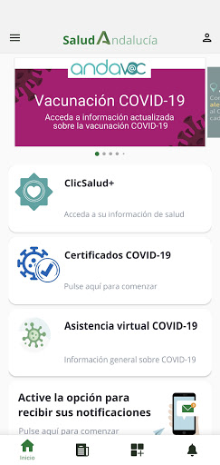

# Salud Andalucía
App version ``2.3.1``

Analyzed with [covid-apps-observer](http://github.com/covid-apps-observer) project, version ``0.1``

## App overview
| | |
|-------------------------|-------------------------| 
| **Name**&nbsp;&nbsp;&nbsp;&nbsp;&nbsp;&nbsp;&nbsp;&nbsp;&nbsp;&nbsp;&nbsp;&nbsp;&nbsp;&nbsp;&nbsp;&nbsp;&nbsp;&nbsp;&nbsp;&nbsp;&nbsp;&nbsp;&nbsp;&nbsp;&nbsp;&nbsp;&nbsp;&nbsp;&nbsp;&nbsp;&nbsp;&nbsp;&nbsp;&nbsp;&nbsp;&nbsp;&nbsp;&nbsp;&nbsp;&nbsp;  | Salud Andalucía |
| **Unique identifier** | es.juntadeandalucia.msspa.saludandalucia |
| **Link to Google Play** | [https://play.google.com/store/apps/details?id=es.juntadeandalucia.msspa.saludandalucia](https://play.google.com/store/apps/details?id=es.juntadeandalucia.msspa.saludandalucia) |
| **Summary**  | Acceso a toda información del Sistema Sanitario Público de Andalucía (SSPA) |
| **Privacy policy** | [https://www.sspa.juntadeandalucia.es/servicioandaluzdesalud/politica-de-privacidad](https://www.sspa.juntadeandalucia.es/servicioandaluzdesalud/politica-de-privacidad) |
| **Latest version** | 2.3.1 |
| **Last update** | 2021-06-23 19:15:33 |
| **Recent changes** | Corrección de errores y mejoras de rendimiento de la aplicación. |
| **Installs**  | 500.000+ |
| **Category** | Salud y bienestar |
| **First release** | 7 abr 2020 |
| **Size**  | 11M |
| **Supported Android version**  | 5.0 y versiones posteriores |

### Description
> Salud Andalucía es una aplicación que le da acceso a toda información del Sistema Sanitario Público de Andalucía (SSPA) y agrupa las apps que el SSPA dispone para el conjunto de los usuarios. La aplicación incluye una sección específica sobre el coronavirus COVID-19.
 El uso de esta aplicación no sustituye la relación médico-paciente.
 Para cualquier consulta sobre el funcionamiento de la aplicación puede ponerse en contacto con el área de mHealth del Sistema Sanitario Público de Andalucía, en el correo: msspa.sc.sspa@juntadeandalucia.es 
 Política de privacidad
 https://www.sspa.juntadeandalucia.es/servicioandaluzdesalud/politica-de-privacidad
 Aviso legal
 https://www.sspa.juntadeandalucia.es/servicioandaluzdesalud/aviso-legal

### User interface
The developers of the app provide the following screenshots in the Google play store.
| | | |
|:-------------------------:|:-------------------------:|:-------------------------:|
 |   |   |   | 
 |   |   |   | 
 |   |  

## Development team
In the following we report the main information provided by the development team in the Google play store.

| | |
|-------------------------|-------------------------|
| **Developer**  | Sistema Sanitario Público de Andalucía |
| **Website**  | [https://www.sspa.juntadeandalucia.es/servicioandaluzdesalud/contacto/sugerencias/registro?idp=4A36EE9174873%7C2BB345%7C146AD2&ctrl=[51531361359229]](https://www.sspa.juntadeandalucia.es/servicioandaluzdesalud/contacto/sugerencias/registro?idp=4A36EE9174873%7C2BB345%7C146AD2&ctrl=[51531361359229]) |
| **Email** | msspa.sc.sspa@juntadeandalucia.es |
| **Physical address**  | - |
| **Other developed apps**  | [https://play.google.com/store/apps/developer?id=Sistema+Sanitario+P%C3%BAblico+de+Andaluc%C3%ADa](https://play.google.com/store/apps/developer?id=Sistema+Sanitario+P%C3%BAblico+de+Andaluc%C3%ADa) |

## Android support

| | |
|-------------------------|-------------------------|
| **Declared target Android version**  | Android10, version 10 (API level 29) |
| **Effective target Android version**  | Android10, version 10 (API level 29) |
| **Minimum supported Android version**  | Lollipop, version 5.0 (API level 21) |
| **Maximum target Android version**  | - |

The larger the difference between the minimum and maximum supported Android versions, the better. A larger difference means a wider audience. For example, old phones have a very low Android version, so a high minimum supported Android version means that the app cannot be used by users with old phones, thus leading to accessibility problems. 

## Requested permissions

In the following we report the complete list of the permissions requested by the app. 

| **Permission** | **Protection level** | **Description** | 
|-------------------------|-------------------------|-------------------------|
 **android.permission ACCESS_NETWORK_STATE** | Normal | Allows applications to access information about networks. 
 **android.permission CAMERA** | :warning:**Dangerous** | Required to be able to access the camera device. 
 **android.permission FOREGROUND_SERVICE** | Normal | Allows a regular application to use Service.startForeground. 
 **android.permission INTERNET** | Normal | Allows applications to open network sockets. 
 **android.permission RECEIVE_BOOT_COMPLETED** | Normal | Allows an application to receive the Intent.ACTION_BOOT_COMPLETED that is broadcast after the system finishes booting. 
 **android.permission REQUEST_IGNORE_BATTERY_OPTIMIZATIONS** | Normal | Permission an application must hold in order to use Settings.ACTION_REQUEST_IGNORE_BATTERY_OPTIMIZATIONS. 
 **android.permission USE_BIOMETRIC** | Normal | Allows an app to use device supported biometric modalities. 
 **android.permission USE_FINGERPRINT** | Normal | This constant was deprecated in API level 28. Applications should request USE_BIOMETRIC instead 
 **android.permission WAKE_LOCK** | Normal | Allows using PowerManager WakeLocks to keep processor from sleeping or screen from dimming. 
 **android.permission WRITE_EXTERNAL_STORAGE** | :warning:**Dangerous** | Allows an application to write to external storage. 
 **com.google.android.c2dm.permission RECEIVE** | - | - 
 **com.google.android.finsky.permission BIND_GET_INSTALL_REFERRER_SERVICE** | - | - 

## Mentioned servers

| **Server** | **Registrant** | **Registrant country** | **Creation date** | 
|-------------------------|-------------------------|-------------------------|-------------------------|
 | googlesyndication.com | Google LLC | :us: US | 2003-01-21 06:17:24 |
 | google.com | Google LLC | :us: US | 1997-09-15 04:00:00 |
 | app-measurement.com | Google LLC | :us: US | 2015-06-19 20:13:31 |
 | crashlytics.com | Google LLC | :us: US | 2011-01-21 15:30:40 |
 | googleapis.com | Google LLC | :us: US | 2005-01-25 17:52:26 |
 | googleadservices.com | Google LLC | :us: US | 2003-06-19 16:34:53 |

## Security analysis 

Below we report the main security warnings raised by our execution of the [Androwarn](https://github.com/maaaaz/androwarn) security analysis tool.

**Connection interfaces exfiltration**
> - This application reads details about the currently active data network 
> - This application tries to find out if the currently active data network is metered 

**Suspicious connection establishment**
> - This application opens a Socket and connects it to the remote address ' returned no addresses for  ; port is out of range' on the 'N/A' port  
> - This application opens a Socket and connects it to the remote address '' on the 'N/A' port  
> - This application opens a Socket and connects it to the remote address 'Ljava/lang/StringBuilder;->toString()Ljava/lang/String;' on the 'N/A' port  
> - This application opens a Socket and connects it to the remote address 'Ljava/net/Proxy;->type()Ljava/net/Proxy$Type;' on the 'N/A' port  
> - This application opens a Socket and connects it to the remote address 'timeout' on the 'N/A' port  

**Code execution**
> - This application loads a native library 

## User ratings and reviews

Below we provide information about how end users are reacting to the app in terms of ratings and reviews in the Google Play store.

### Ratings

The Salud Andalucía app has been installed by more than **500000** times. At this time, **1100** rated the app and its average score is **3.7771084**. Below we show the distribution of the ratings across the usual star-based rating of Google Play

:star::star::star::star::star:: 617

:star::star::star::star:: 132

:star::star::star:: 73

:star::star:: 46

:star:: 232

### Reviews 

#### 5-star reviews

> Estoy satisfecha  :date: __2021-06-27 21:55:42__

> Muy buena  :date: __2021-06-27 20:10:17__

> Aceptable  :date: __2021-06-27 20:03:16__

> La aplicación muy útil. He detectado que algún informe médico no lo cargan en la aplicación pero a pesar de eso merece 5 estrellas. Bien por la sanidad pública  :date: __2021-06-26 17:21:35__

> Fenomenal  :date: __2021-06-26 12:38:23__

> Esta aplicación sea rápida gusta mucho gracias amigaos de salud Andalucía España GENERAL 🙏💯😎❤🍀🏕🚵‍♂️🕊🕊🕊😇 deseo feliz día salud súper suerte todasdos OKI CAMPEÓNASNES ❤❤❤🌟⭐  :date: __2021-06-25 22:22:55__

> Excelente  :date: __2021-06-25 18:25:54__

> Falta alguna información pero le damos un voto de confianza y falta cuando se vacunaram los de 20 años  :date: __2021-06-25 16:28:15__

> Muy bien 👌🏼  :date: __2021-06-25 16:01:15__

> Una página donde puedes consultar tus datos de salud ,como si tienes citas médicas pendientes, muy buena  :date: __2021-06-25 16:00:16__

#### 4-star reviews

> Efectiva y fácil de usar  :date: __2021-06-25 12:21:14__

> Cómoda y rápida  :date: __2021-06-24 18:18:33__

> Buena  :date: __2021-06-24 13:33:06__

> La veo buena pero a mí no me deja iniciar sesión porque no sale el último recuadro verde para validar los datos personales.  :date: __2021-06-21 18:39:39__

> Toda la información sanitaria en un click. Aunque presenta fallos de vez en cuando.  :date: __2021-06-19 12:29:27__

> Algunos errores al intentar acceder, pero tras obtener el código de identificación, todo perfecto.  :date: __2021-06-18 00:30:37__

> Le doy por buena  :date: __2021-06-15 22:24:55__

> Buena  :date: __2021-06-13 22:27:06__

> Perfecta.En Andalucía ya puedes tener tu certificado de vacunación covid en tu móvil. Es fácil de usar y tienes acceso a tus datos. Contiene noticias también sobre salud.Sigan así  :date: __2021-06-12 14:16:52__

> Buena  :date: __2021-06-11 19:39:20__

#### 3-star reviews

> Parece que va mejorando  :date: __2021-06-24 14:43:41__

> Útil, lo malo es tener que abrir el navegador para hacer algunas gestiones  :date: __2021-06-09 18:12:00__

> No se puede acceder a todas las prestaciones que se ofrecen .  :date: __2021-06-09 08:02:08__

> Es buena, pero no da opcion donde pone AN a poner los dos primeros números de la tarjeta sanitaria  :date: __2021-06-03 16:38:27__

> Sería de agradecer que al identificarse, los datos introducidos se viesen más oscuros. Actualmente el texto se transparenta y a veces cuesta verlo.  :date: __2021-05-06 16:42:17__

> Cuesta coger cita  :date: __2021-04-22 19:12:36__

> Poned modo oscuro y subiré las estrellas  :date: __2020-06-19 10:17:54__

#### 2-star reviews

> No puedo descargar el certificado  :date: __2021-06-25 21:47:09__

> No me reconoce la tarjeta sanitaria dando error continuamente.  :date: __2021-06-25 15:56:25__

> En mi teléfono no me deja poner el DNI  :date: __2021-06-25 11:02:14__

> Muy mal no me deja entrar para pedir el sertificado digital y carnet covid meto los datos y vuelta a empezar no se como hacerlo  :date: __2021-06-24 16:29:54__

> Falla queda gusto. Todavía no he conseguido verificar mi identidad tras introducir el código que me mandan por SMS. Cada vez que lo introduzco, la aplicación se cierra  :date: __2021-06-22 15:34:49__

> Pongo todos mi datos y en el apartado teléfono me sale un circulo verde i como información y no me sale cuadro para poner el numero de teléfono. Espero que lo arregleis q tengo prisa para sacar mi certificado de vacuna.  :date: __2021-06-18 14:25:59__

> No hay forma de entrar con DNIe,imposible ,en el ordenador regular , en el.movil un bodrio  :date: __2021-06-16 18:25:40__

> No funciona correctamente y quiero sacar el serteficado de la vacuna ya la tengo las dos puestas y no me deja  :date: __2021-06-16 13:31:55__

> A mi no me deja introducir mi DNI completo, que puedo hacer?  :date: __2021-06-14 14:04:07__

> No deja entrar a las tarjetas naranjas (12 digitos sin letras), es decir sino tienes el famoso AN que aparece en la nueva tarjeta verde y que aquí se marca por defecto en la aplicación no deja identificarse.  :date: __2021-06-12 04:00:00__

#### 1-star reviews

> Imposible acceder. Al intentar registrarme pone q hay un error en el sistema y se sale  :date: __2021-06-27 22:12:42__

> Al intentar acceder con los datos personales aparece el campo de teléfono cortado por la mitad y ahí se queda parado sin hacer nada más bloqueado, desinstalada esta porquería sufragada con dinero público que no sirve para nada.  :date: __2021-06-27 21:47:09__

> Da error al entrar. Y al registrarse no deja aceptar porque no sale en pantalla, el botón de aceptar  :date: __2021-06-27 19:50:56__

> Siempre me sale el mismo mensaje al intentar entrar con clave permanente, muy mala app. Mensaje: Los datos recibidos en el mensaje de Cl@ve no son válidos  :date: __2021-06-27 19:45:55__

> No vale para nada ,lo he intentado ,muchas veces ,y es imposible ,rellenas todos los datos ,y te dice q tu fecha de nacimiento es mentira ,o q el móvil no existe ,total una perdida de tiempo ,iré a mi centro de salud ,no hay más remedio !!  :date: __2021-06-27 18:54:16__

> Todos mis datos están actualizados y correctos en mi centro de salud pero no hay manera de que funcione. No sé si será porqué tengo puesto el pasaporte y el sistema reconoce mejor el dni..pero muy mal..tendré que viajar con el certificado de papel..más incómodo  :date: __2021-06-27 16:57:59__

> Desastre total. Nos exigen certificados para poder hacer una vida medio normal y nos facilitan "herramientas" que lo que hacen es complicarnos más las coss . Chapuza como todo lo que venimos soportando. A ver señores de la "Junta", espabilen y hagan buen uso de nuestros impuestos. Además de complicada, la aplicación defectuosa. Hagan bien las cosas que para eso les pagamos!!. Si me resulta complicado a mi que me manejo bien en las nuevas tecnologías no quiero ni pensar en nuestros mayores...  :date: __2021-06-27 14:37:43__

> No hay manera de verificar el número de tarjeta sanitaria. No la reconoce  :date: __2021-06-27 14:23:39__

> La app se cuelga continuamente o simplemente no se carga. Para iniciar sesión tienes que tener mucha paciencia y a mano tu número de la seguridad social, tu DNI, si eres extranjero tu tarjeta de residencia o carta verde, tu número de seguridad... Tu número de teléfono, te pide tu fecha de nacim iento y cuando ya lo tienes todo introducido, se cuelga la app....  :date: __2021-06-27 13:32:11__

> Desgraciadamente a los Andaluces nos queda mucho por superar y no a los curritos de apie esos luchan y luchan par sacar adelante a sus familias  :date: __2021-06-27 11:40:12__

