# Salud Andalucía
App version ``3.0.1``

Analyzed with [covid-apps-observer](http://github.com/covid-apps-observer) project, version ``0.1``

## App overview
| | |
|-------------------------|-------------------------| 
| **Name**&nbsp;&nbsp;&nbsp;&nbsp;&nbsp;&nbsp;&nbsp;&nbsp;&nbsp;&nbsp;&nbsp;&nbsp;&nbsp;&nbsp;&nbsp;&nbsp;&nbsp;&nbsp;&nbsp;&nbsp;&nbsp;&nbsp;&nbsp;&nbsp;&nbsp;&nbsp;&nbsp;&nbsp;&nbsp;&nbsp;&nbsp;&nbsp;&nbsp;&nbsp;&nbsp;&nbsp;&nbsp;&nbsp;&nbsp;&nbsp;  | Salud Andalucía |
| **Unique identifier** | es.juntadeandalucia.msspa.saludandalucia |
| **Link to Google Play** | [https://play.google.com/store/apps/details?id=es.juntadeandalucia.msspa.saludandalucia](https://play.google.com/store/apps/details?id=es.juntadeandalucia.msspa.saludandalucia) |
| **Summary**  | Acceso a toda información del Sistema Sanitario Público de Andalucía (SSPA) |
| **Privacy policy** | [https://www.sspa.juntadeandalucia.es/servicioandaluzdesalud/politica-de-privacidad](https://www.sspa.juntadeandalucia.es/servicioandaluzdesalud/politica-de-privacidad) |
| **Latest version** | 3.0.1 |
| **Last update** | 2021-07-16 08:08:08 |
| **Recent changes** | Mejoras en el diseño y guardado de perfiles. Acceso a su historia clínica digital del SSPA para: -Solicitar cita de vacunación de COVID-19 y atención primaria, así como realizar gestiones sobre citas hospitalarias y de pruebas diagnósticas. -Consultar su inscripción en la lista de espera quirúrgica. -Consultar datos de salud. -Realizar gestiones con los servicios sanitarios. -Actualizar su información de contacto. Acceso al Certificado COVID digital de la UE para sus beneficiarios. |
| **Installs**  | 500.000+ |
| **Category** | Salud y bienestar |
| **First release** | 7 abr 2020 |
| **Size**  | 9,4M |
| **Supported Android version**  | 5.0 y versiones posteriores |

### Description
> Salud Andalucía es una aplicación que le da acceso a toda información del Sistema Sanitario Público de Andalucía (SSPA) y agrupa las apps que el SSPA dispone para el conjunto de los usuarios. La aplicación incluye una sección específica sobre el coronavirus COVID-19.
 El uso de esta aplicación no sustituye la relación médico-paciente.
 Para cualquier consulta de la información ofrecida por la aplicación puede ponerse en contacto a través del siguiente enlace: https://www.sspa.juntadeandalucia.es/servicioandaluzdesalud/ciudadania/reclamaciones-sugerencias-y-agradecimientos
 Política de privacidad
 https://www.sspa.juntadeandalucia.es/servicioandaluzdesalud/politica-de-privacidad
 Aviso legal
 https://www.sspa.juntadeandalucia.es/servicioandaluzdesalud/aviso-legal

### User interface
The developers of the app provide the following screenshots in the Google play store.
| | | |
|:-------------------------:|:-------------------------:|:-------------------------:|
 | 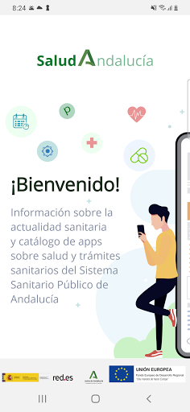  | 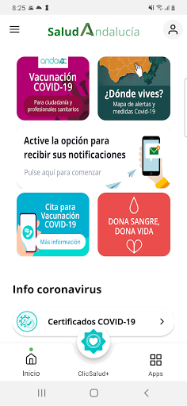  | 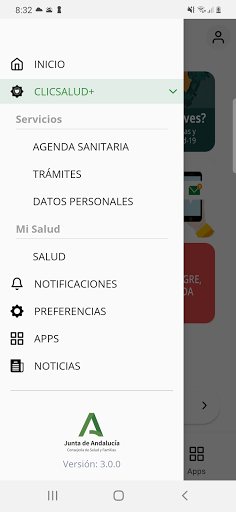  | 
 | 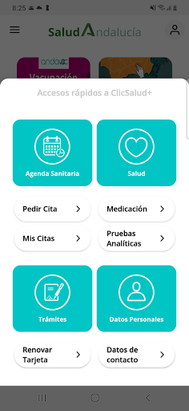  | 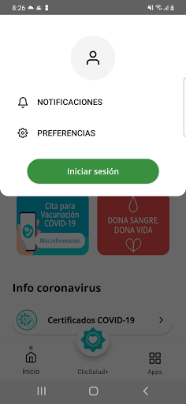  | 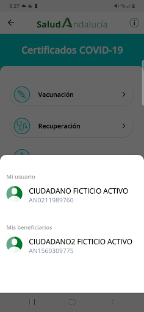  | 
 | 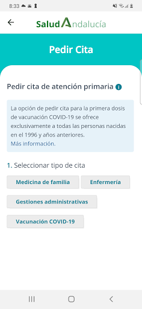 

## Development team
In the following we report the main information provided by the development team in the Google play store.

| | |
|-------------------------|-------------------------|
| **Developer**  | Sistema Sanitario Público de Andalucía |
| **Website**  | [https://www.sspa.juntadeandalucia.es/servicioandaluzdesalud/contacto/sugerencias/registro?idp=4A36EE9174873%7C2BB345%7C146AD2&ctrl=[51531361359229]](https://www.sspa.juntadeandalucia.es/servicioandaluzdesalud/contacto/sugerencias/registro?idp=4A36EE9174873%7C2BB345%7C146AD2&ctrl=[51531361359229]) |
| **Email** | msspa.sc.sspa@juntadeandalucia.es |
| **Physical address**  | - |
| **Other developed apps**  | [https://play.google.com/store/apps/developer?id=Sistema+Sanitario+P%C3%BAblico+de+Andaluc%C3%ADa](https://play.google.com/store/apps/developer?id=Sistema+Sanitario+P%C3%BAblico+de+Andaluc%C3%ADa) |

## Android support

| | |
|-------------------------|-------------------------|
| **Declared target Android version**  | Android10, version 10 (API level 29) |
| **Effective target Android version**  | Android10, version 10 (API level 29) |
| **Minimum supported Android version**  | Lollipop, version 5.0 (API level 21) |
| **Maximum target Android version**  | - |

The larger the difference between the minimum and maximum supported Android versions, the better. A larger difference means a wider audience. For example, old phones have a very low Android version, so a high minimum supported Android version means that the app cannot be used by users with old phones, thus leading to accessibility problems. 

## Requested permissions

In the following we report the complete list of the permissions requested by the app. 

| **Permission** | **Protection level** | **Description** | 
|-------------------------|-------------------------|-------------------------|
 **android.permission ACCESS_NETWORK_STATE** | Normal | Allows applications to access information about networks. 
 **android.permission CAMERA** | :warning:**Dangerous** | Required to be able to access the camera device. 
 **android.permission FOREGROUND_SERVICE** | Normal | Allows a regular application to use Service.startForeground. 
 **android.permission INTERNET** | Normal | Allows applications to open network sockets. 
 **android.permission RECEIVE_BOOT_COMPLETED** | Normal | Allows an application to receive the Intent.ACTION_BOOT_COMPLETED that is broadcast after the system finishes booting. 
 **android.permission REQUEST_IGNORE_BATTERY_OPTIMIZATIONS** | Normal | Permission an application must hold in order to use Settings.ACTION_REQUEST_IGNORE_BATTERY_OPTIMIZATIONS. 
 **android.permission USE_BIOMETRIC** | Normal | Allows an app to use device supported biometric modalities. 
 **android.permission USE_FINGERPRINT** | Normal | This constant was deprecated in API level 28. Applications should request USE_BIOMETRIC instead 
 **android.permission WAKE_LOCK** | Normal | Allows using PowerManager WakeLocks to keep processor from sleeping or screen from dimming. 
 **android.permission WRITE_EXTERNAL_STORAGE** | :warning:**Dangerous** | Allows an application to write to external storage. 
 **com.google.android.c2dm.permission RECEIVE** | - | - 
 **com.google.android.finsky.permission BIND_GET_INSTALL_REFERRER_SERVICE** | - | - 

## Mentioned servers

| **Server** | **Registrant** | **Registrant country** | **Creation date** | 
|-------------------------|-------------------------|-------------------------|-------------------------|
 | googlesyndication.com | Google LLC | :us: US | 2003-01-21 06:17:24 |
 | google.com | Google LLC | :us: US | 1997-09-15 04:00:00 |
 | app-measurement.com | Google LLC | :us: US | 2015-06-19 20:13:31 |
 | crashlytics.com | Google LLC | :us: US | 2011-01-21 15:30:40 |
 | googleapis.com | Google LLC | :us: US | 2005-01-25 17:52:26 |
 | googleadservices.com | Google LLC | :us: US | 2003-06-19 16:34:53 |

## Security analysis 

Below we report the main security warnings raised by our execution of the [Androwarn](https://github.com/maaaaz/androwarn) security analysis tool.

**Connection interfaces exfiltration**
> - This application reads details about the currently active data network 
> - This application tries to find out if the currently active data network is metered 

**Suspicious connection establishment**
> - This application opens a Socket and connects it to the remote address ' returned no addresses for  ; port is out of range' on the 'N/A' port  
> - This application opens a Socket and connects it to the remote address '' on the 'N/A' port  
> - This application opens a Socket and connects it to the remote address 'Ljava/lang/StringBuilder;->toString()Ljava/lang/String;' on the 'N/A' port  
> - This application opens a Socket and connects it to the remote address 'Ljava/net/Proxy;->type()Ljava/net/Proxy$Type;' on the 'N/A' port  
> - This application opens a Socket and connects it to the remote address 'timeout' on the 'N/A' port  

**Code execution**
> - This application loads a native library 

## User ratings and reviews

Below we provide information about how end users are reacting to the app in terms of ratings and reviews in the Google Play store.

### Ratings

The Salud Andalucía app has been installed by more than **500000** times. At this time, **1609** rated the app and its average score is **3.9770114**. Below we show the distribution of the ratings across the usual star-based rating of Google Play

:star::star::star::star::star:: 935

:star::star::star::star:: 268

:star::star::star:: 92

:star::star:: 64

:star:: 250

### Reviews 

#### 5-star reviews

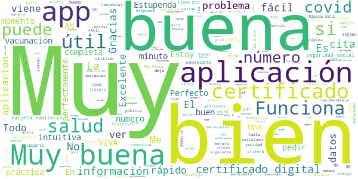

> Estupenda aplicacion. Muy práctica  :date: __2021-07-19 08:26:36__

> Útil,  :date: __2021-07-19 03:35:22__

> Muy buen app  :date: __2021-07-18 22:07:08__

> Muy buena aplicación, sobre todo de cara a la vacunación.  :date: __2021-07-18 15:00:28__

> Una app de categoría. Felicidades, un saludo cordial.  :date: __2021-07-18 13:17:35__

> Buenas  :date: __2021-07-17 22:39:23__

> Muy buena  :date: __2021-07-17 17:07:05__

> Guena  :date: __2021-07-17 16:32:57__

> Muy bien  :date: __2021-07-17 16:20:18__

> Buen servicio.  :date: __2021-07-17 15:35:51__

#### 4-star reviews

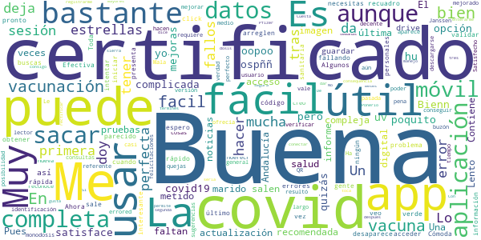

> Puedes oopoo opción l yo, b ni uv h hu ospññ lo  :date: __2021-07-19 08:50:27__

> Buena  :date: __2021-07-19 07:39:57__

> Muy útil.  :date: __2021-07-18 09:07:21__

> Buena  :date: __2021-07-17 23:39:53__

> Me satisface  :date: __2021-07-17 18:47:46__

> Es bastante completa,pero poquito a poco se le puede hacer mejoras,quizás para algunos muy compleja,  :date: __2021-07-17 10:09:03__

> Buena app pero en la última actualización no salen las pruebas de imagen  :date: __2021-07-16 16:20:59__

> Una aplicación muy completa aunque a veces faltan informe  :date: __2021-07-15 16:18:05__

> Pues a la primera !!perfecta!he metido mis datos y ya tengo el certificado.Lo q no me deja es sacar el de mi marido ...lo tiene q hacer en su móvil?  :date: __2021-07-12 10:00:26__

> Fácil de usar.  :date: __2021-07-12 01:20:26__

#### 3-star reviews

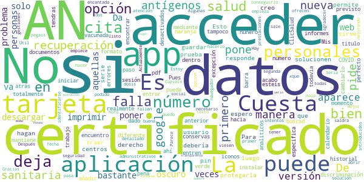

> Algunas veces fallan  :date: __2021-07-16 22:55:29__

> Estoy encantada con la atencion  :date: __2021-07-16 22:24:55__

> Solo me aparece la fecha de mi primer dosis de la vacuna que pasa con la segunda ?  :date: __2021-07-07 01:22:31__

> Mejor hacerlo por web, no es necesario una app.  :date: __2021-06-28 09:22:08__

> Parece que va mejorando  :date: __2021-06-24 14:43:41__

> Útil, lo malo es tener que abrir el navegador para hacer algunas gestiones  :date: __2021-06-09 18:12:00__

> No se puede acceder a todas las prestaciones que se ofrecen .  :date: __2021-06-09 08:02:08__

> Es buena, pero no da opcion donde pone AN a poner los dos primeros números de la tarjeta sanitaria  :date: __2021-06-03 16:38:27__

> Sería de agradecer que al identificarse, los datos introducidos se viesen más oscuros. Actualmente el texto se transparenta y a veces cuesta verlo.  :date: __2021-05-06 16:42:17__

> Cuesta coger cita  :date: __2021-04-22 19:12:36__

#### 2-star reviews

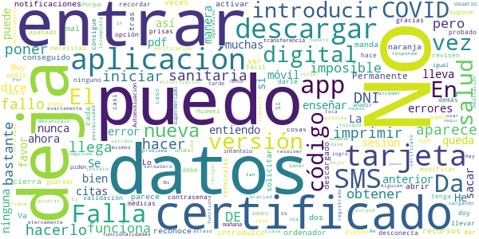

> Da mucho fallo  :date: __2021-07-17 15:30:51__

> Alguien sabe porqué no me deja poner mi número de la SS??  :date: __2021-07-17 12:07:19__

> Es un verdadero atraso que cada vez que quieras usar la aplicación haya que introducir todos tus datos. No me parece muy operativo  :date: __2021-07-17 09:44:48__

> Hay muchas veces que falla, tienes que volver a iniciar todo de nuevo, una y otra vez.  :date: __2021-07-17 09:14:27__

> Incompleta  :date: __2021-07-16 16:07:25__

> No puedo acceder.... No functiona.... No logro descargar el cerificato digital... Por que es tan complicado????? Tantos pasos a sequir y en final falla y tienes que enpesar de nuevoo  :date: __2021-07-04 21:00:59__

> Va fatal la aplicación,no me deja entrar  :date: __2021-07-03 23:40:41__

> Creo k si  :date: __2021-07-02 14:43:18__

> No puedo descargar el certificado  :date: __2021-06-25 21:47:09__

> No me reconoce la tarjeta sanitaria dando error continuamente.  :date: __2021-06-25 15:56:25__

#### 1-star reviews

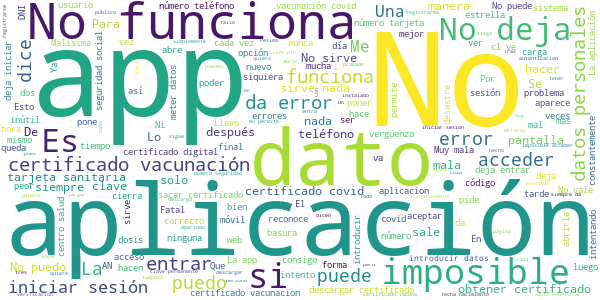

> Se me ha actualizado la app y ahora no me deja poner el número de la tarjeta sanitaria, vamos cada vez peor.  :date: __2021-07-19 12:58:32__

> No funciona nunca. Cada vez que intentó acceder me pide que inicie sesión una y otra vez y no hay manera.  :date: __2021-07-19 12:17:36__

> Desde que la he actualizado no me deja iniciar sesión  :date: __2021-07-19 10:23:40__

> Si antes era engorroso, ahora actualizado es imposible sacar certificado. Ya verifique tfno con primera dosis, y conseguí con mucha dificultad sacar certificado. Ahora con la segunda dosis puesta, intento y da error diciendo que he superado el número máximo de verificaciones del tfno, o algo parecido, intento verificarlo y no hay manera con datos personales. Con clave permanente da error, mientras que si me sirve en otros organismos.  :date: __2021-07-19 00:53:48__

> Muy mala, falla como el propio Sistema Andaluz de Salud.  :date: __2021-07-19 00:37:01__

> Llevo mas de medio mes para que me deje iniciar sesión y no me deja,esto que es?  :date: __2021-07-19 00:21:39__

> Tras la última actualización, ya no se ven las pruebas de imagen. Pesima app.  :date: __2021-07-18 19:12:43__

> Soy de muface y no me acepta el número de tarjeta para padir el certificado  :date: __2021-07-18 15:46:03__

> No consigo el certificado covid habiendo pasado el covid junto a mi mujer, he de decir que ella lo consiguió sin problema, por favor actualicen sus bases de datos  :date: __2021-07-18 15:08:56__

> La aplicación siempre da error!!!  :date: __2021-07-18 13:44:18__

