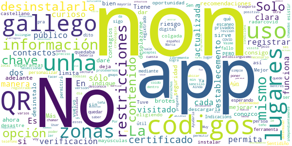

# PassCOVID.gal
App version ``1.0.1``

Analyzed with [covid-apps-observer](http://github.com/covid-apps-observer) project, version ``0.1``

## App overview
| | |
|-------------------------|-------------------------| 
| **Name**&nbsp;&nbsp;&nbsp;&nbsp;&nbsp;&nbsp;&nbsp;&nbsp;&nbsp;&nbsp;&nbsp;&nbsp;&nbsp;&nbsp;&nbsp;&nbsp;&nbsp;&nbsp;&nbsp;&nbsp;&nbsp;&nbsp;&nbsp;&nbsp;&nbsp;&nbsp;&nbsp;&nbsp;&nbsp;&nbsp;&nbsp;&nbsp;&nbsp;&nbsp;&nbsp;&nbsp;&nbsp;&nbsp;&nbsp;&nbsp;  | PassCOVID.gal |
| **Unique identifier** | gal.xunta.covidpass |
| **Link to Google Play** | [https://play.google.com/store/apps/details?id=gal.xunta.covidpass](https://play.google.com/store/apps/details?id=gal.xunta.covidpass) |
| **Summary**  | Información y servicios sobre la Covid-19 de la Xunta de Galicia |
| **Privacy policy** | [https://passcovid.xunta.gal/politica-de-privacidade](https://passcovid.xunta.gal/politica-de-privacidade) |
| **Latest version** | 1.0.1 |
| **Last update** | 2020-11-20 20:41:38 |
| **Recent changes** | [GL] Nova funcionalidade de  autodeclaración de contacto estreito. Melloras xerais en contidos, deseño e usabilidade. Corrección de diversos erros.  [ES] Nueva funcionalidad de autodeclaración de contacto estrecho. Mejoras generales en contenidos, diseño y usabilidad. Corrección de diversos errores. |
| **Installs**  | 5.000+ |
| **Category** | Salud y bienestar |
| **First release** | 15 oct 2020 |
| **Size**  | 18M |
| **Supported Android version**  | 5.0 y versiones posteriores |

### Description
> [GL]
 PassCOVID é unha app da Xunta de Galicia para axudar a coidarnos da COVID-19.
 Permite recibir avisos, estar informado das restricións, recomendacións e novidades, así como informar si estiveches nun local con concentración de contaxios, si es un contacto estreito ou si fuches diagnosticado/a da COVID-19.
 Neste último caso, poderás colaborar coa Xunta de Galicia na xestión da pandemia, informando voluntariamente dos teus contactos estreitos e dos establecementos onde estiveches.
 PassCOVID poderá comprobar a existencia de aplicacións xa instaladas no teu dispositivo e/ou acceder á información das mesmas nos seguintes casos:
  — PassCovid poderá acceder ao dispositivo do usuario para obter información das aplicacións instaladas.
  — PassCovid poderá acceder á aplicación da cámara do dispositivo, co fin de capturar os  QR dos establecementos visitados.
  — PassCovid poderá acceder á aplicación da axenda de contactos, no caso de que se queira utilizar para cargar os datos dos contactos na aplicación de maneira automática.
  — PassCovid poderá acceder ao teléfono, para realizar chamadas aos números de teléfono de contacto presentados na aplicación.
  — PassCovid poderá acceder a ligazóns de contidos e aplicacións de terceiros na internet para proporcionar información e servizos relacionados coa COVID-19.
 Condiciones de uso: https://passcovid.xunta.gal/condicions-de-uso?langId=gl_ES
 Política de privacidad: https://passcovid.xunta.gal/politica-de-privacidade?langId=gl_ES
 [ES]
 PassCOVID es una app de la Xunta de Galicia para ayudar a cuidarnos de la COVID-19.
 Permite recibir avisos, estar informado de las restricciones, recomendaciones y novedades, así como informarte si estuviste en un local con concentración de contagios, si eres un contacto estrecho o si has sido diagnosticado/a de la COVID-19.
 En este último caso, podrás colaborar con la Xunta de Galicia en la gestión de la pandemia, informando voluntariamente de tus contactos estrechos y de los establecimientos donde hayas estado.
 PassCOVID podrá comprobar la existencia de aplicaciones ya instaladas en tu dispositivo y/o acceder a la información de las mismas en los siguientes casos:
 — PassCovid podrá acceder al dispositivo del usuario para obtener información de las aplicaciones instaladas.
 — PassCovid podrá acceder a la aplicación de la cámara del dispositivo, con el fin de capturar los QR de los establecimientos visitados.
 — PassCovid podrá acceder a la aplicación de la agenda de contactos, en el caso de que se quiera utilizar para cargar los datos de los contactos en la aplicación de manera automática.
 — PassCovid podrá acceder al teléfono, para realizar llamadas a los números de teléfono de contacto presentados en la aplicación
 — PassCovid podrá acceder a enlaces de contenidos y aplicaciones de terceros en internet para proporcionar información y servicios relacionados con la COVID-19.
 Condiciones de uso: https://passcovid.xunta.gal/condicions-de-uso?langId=es_ES
 Política de privacidad: https://passcovid.xunta.gal/politica-de-privacidade?langId=es_ES

### User interface
The developers of the app provide the following screenshots in the Google play store.
| | | |
|:-------------------------:|:-------------------------:|:-------------------------:|
 |   |   |   | 
 |   |   |   | 
 |   |  

## Development team
In the following we report the main information provided by the development team in the Google play store.

| | |
|-------------------------|-------------------------|
| **Developer**  | Xunta de Galicia |
| **Website**  | [https://passcovid.xunta.gal](https://passcovid.xunta.gal) |
| **Email** | 012@xunta.gal |
| **Physical address**  | - |
| **Other developed apps**  | [https://play.google.com/store/apps/developer?id=Xunta+de+Galicia](https://play.google.com/store/apps/developer?id=Xunta+de+Galicia) |

## Android support

| | |
|-------------------------|-------------------------|
| **Declared target Android version**  | Android10, version 10 (API level 29) |
| **Effective target Android version**  | Android10, version 10 (API level 29) |
| **Minimum supported Android version**  | Lollipop, version 5.0 (API level 21) |
| **Maximum target Android version**  | - |

The larger the difference between the minimum and maximum supported Android versions, the better. A larger difference means a wider audience. For example, old phones have a very low Android version, so a high minimum supported Android version means that the app cannot be used by users with old phones, thus leading to accessibility problems. 

## Requested permissions

In the following we report the complete list of the permissions requested by the app. 

| **Permission** | **Protection level** | **Description** | 
|-------------------------|-------------------------|-------------------------|
 **android.permission ACCESS_NETWORK_STATE** | Normal | Allows applications to access information about networks. 
 **android.permission CAMERA** | :warning:**Dangerous** | Required to be able to access the camera device. 
 **android.permission FLASHLIGHT** | - | - 
 **android.permission INTERNET** | Normal | Allows applications to open network sockets. 
 **android.permission READ_APP_BADGE** | - | - 
 **android.permission RECEIVE_BOOT_COMPLETED** | Normal | Allows an application to receive the Intent.ACTION_BOOT_COMPLETED that is broadcast after the system finishes booting. 
 **android.permission USE_BIOMETRIC** | Normal | Allows an app to use device supported biometric modalities. 
 **android.permission USE_FINGERPRINT** | Normal | This constant was deprecated in API level 28. Applications should request USE_BIOMETRIC instead 
 **android.permission WAKE_LOCK** | Normal | Allows using PowerManager WakeLocks to keep processor from sleeping or screen from dimming. 
 **android.permission WRITE_EXTERNAL_STORAGE** | :warning:**Dangerous** | Allows an application to write to external storage. 
 **com.anddoes.launcher.permission UPDATE_COUNT** | - | - 
 **com.google.android.c2dm.permission RECEIVE** | - | - 
 **com.htc.launcher.permission READ_SETTINGS** | - | - 
 **com.htc.launcher.permission UPDATE_SHORTCUT** | - | - 
 **com.huawei.android.launcher.permission CHANGE_BADGE** | - | - 
 **com.huawei.android.launcher.permission READ_SETTINGS** | - | - 
 **com.huawei.android.launcher.permission WRITE_SETTINGS** | - | - 
 **com.majeur.launcher.permission UPDATE_BADGE** | - | - 
 **com.oppo.launcher.permission READ_SETTINGS** | - | - 
 **com.oppo.launcher.permission WRITE_SETTINGS** | - | - 
 **com.sec.android.provider.badge.permission READ** | - | - 
 **com.sec.android.provider.badge.permission WRITE** | - | - 
 **com.sonyericsson.home.permission BROADCAST_BADGE** | - | - 
 **com.sonymobile.home.permission PROVIDER_INSERT_BADGE** | - | - 
 **me.everything.badger.permission BADGE_COUNT_READ** | - | - 
 **me.everything.badger.permission BADGE_COUNT_WRITE** | - | - 

## Mentioned servers

| **Server** | **Registrant** | **Registrant country** | **Creation date** | 
|-------------------------|-------------------------|-------------------------|-------------------------|
 | adobe.com | Adobe Inc. | :us: US | 1986-11-17 05:00:00 |
 | google.com | Google LLC | :us: US | 1997-09-15 04:00:00 |
 | appspot.com | Google LLC | :us: US | 2005-03-10 02:27:55 |
 | gstatic.com | Google LLC | :us: US | 2008-02-11 15:31:25 |
 | googleapis.com | Google LLC | :us: US | 2005-01-25 17:52:26 |
 | whatsapp.com | Whatsapp Inc. | :us: US | 2008-09-04 12:39:12 |

## Security analysis 

Below we report the main security warnings raised by our execution of the [Androwarn](https://github.com/maaaaz/androwarn) security analysis tool.

**Connection interfaces exfiltration**
> - This application reads details about the currently active data network 
> - This application tries to find out if the currently active data network is metered 

**Telephony services abuse**
> - This application makes phone calls 

**Suspicious connection establishment**
> - This application opens a Socket and connects it to the remote address '' on the 'N/A' port  
> - This application opens a Socket and connects it to the remote address 'Ljava/lang/StringBuilder;->toString()Ljava/lang/String;' on the ': connect, resolve' port  
> - This application opens a Socket and connects it to the remote address 'Ljava/lang/StringBuilder;->toString()Ljava/lang/String;' on the 'N/A' port  
> - This application opens a Socket and connects it to the remote address 'Ljava/net/Proxy;->type()Ljava/net/Proxy$Type;' on the 'N/A' port  
> - This application opens a Socket and connects it to the remote address 'timeout' on the 'N/A' port  

**Pim data leakage**
> - This application accesses the downloads folder 
> - This application accesses data stored in the clipboard 

**Code execution**
> - This application loads a native library: 'sqlc-native-driver' 

## User ratings and reviews

Below we provide information about how end users are reacting to the app in terms of ratings and reviews in the Google Play store.

### Ratings

The PassCOVID.gal app has been installed by more than **5000** times. At this time, **36** rated the app and its average score is **2.5833333**. Below we show the distribution of the ratings across the usual star-based rating of Google Play

:star::star::star::star::star:: 9

:star::star::star::star:: 3

:star::star::star:: 2

:star::star:: 8

:star:: 14

### Reviews 

#### 5-star reviews

> Bien la información ofrecida.  :date: __2020-11-27 16:04:04__

> Esta aplicación va muy bien felicito al SERGAS por la excelente aplicación.  :date: __2020-11-26 10:09:08__

> acceso instantáneo con chave. Sencilla de utilizar con información de la situación y avisos de restricciones.  :date: __2020-10-30 23:50:41__

#### 4-star reviews

> Aparte de lo invasiva que resulta (llama la atención porque la propone el partido que acusaba a Radar Covid de serlo), cuando quiero introducir el QR de algún establecimiento resulta que los establecimientos NO TIENEN CÓDIGO QR que escanear. Ni cafeterías, ni supermercados, farmacias, bancos, ferreterías, tiendas de ropa....  :date: __2020-11-08 18:47:18__

> Salen textos cortados o superpuestos y en la pantalla de registro finalizado sale cortado el botón (apenas se puede pulsar) y no hay scroll. Por lo demás no pinta mal.  :date: __2020-10-27 20:57:05__

#### 3-star reviews

> Me parece bien.  :date: __2020-11-28 15:32:17__

> Decepcionante, soy ciudadano de la UE y no puedo iniciar sesión con mi NIE, no acepta poner letra delante de los números. Estoy a la espera de nuevas actualizaciones para resolver el problema de inicio de sesión con NIE y clavé 365. Hay que darle una nueva oportunidad.  :date: __2020-11-26 15:24:48__

> Bueno  :date: __2020-11-13 13:58:28__

#### 2-star reviews

> Ya la tuve y era un desastre...la vuelvo a instalar pero ....sin esperanzas ...  :date: __2020-11-30 12:40:33__

> Solo me deja personalizar con chave pero no con certificado digital, por qué?  :date: __2020-11-30 11:12:47__

> Códigos de verificación sigo esperando,fallo  :date: __2020-11-29 21:08:21__

> Non permitirá ser unha útil ferramenta , mediante o escaneo dos códigos QR por non esistir dito QR nos establecementos, públicos e privados . Sen quedar regixtrado que unha persoa a visitado ese establecemento. Sentidiño Indicacións pra protexernos contra a COVID-19.  :date: __2020-11-29 01:47:38__

> Es poco clara y "le cuesta" poner todo en bilingüe, español y gallego. En varios contenidos no da opción y sólo sale la versión en gallego... Otra enfermedad, el antibilingüismo.  :date: __2020-11-28 12:57:27__

> Es curioso que me permita registrar a qué bares voy pero que no pregunte y/o permita registrar el uso del trasporte público... Muy curioso...  :date: __2020-11-24 22:26:27__

> Debería permitir independientemente si eres positivo o no, poder determinar libremente que lugares y contactos has tenido de manera cronológica dentro de la app. Seleccionar los lugares visitados de una manera simple, no solo con un QR que la mayoría desconoce cual es de cada local. Usar gmaps para ubicar los lugares sería más preciso y que quede registrado el día de visita del lugar y lo mismo para mis contactos estrechos. Ayudaría y sería más sencillo el uso.  :date: __2020-11-21 10:53:40__

> No funciona la lectura de códigos QR.  :date: __2020-11-06 20:41:22__

> ¿Por que é necesario que teña acceso a saber tódalas app que teño instaladas no teléfono ou facer chamadas? ¿Vaime ler o Marca e chamar a sogra por min? Aínda non aceptei as condicións de uso polo que non sei como funciona, pero coido que mentres non revisen estes requisitos non o farei.  :date: __2020-11-06 15:47:23__

> Molestan enormemente los códigos de verificación vía SMS cada dos por tres y eso a pesar de entrar con la huella dactilar (como si eso no fuese suficiente!!!) Además falta información clara, detallada y actualizada del estado actúal y las restricciones.. En fin, parece hecha por estudiantes de programación..  :date: __2020-11-05 19:29:11__

#### 1-star reviews

> De vergüenza tener que meter la tarjeta de crédito LADRONES  :date: __2020-11-28 18:22:54__

> Anónima si, pero teslle que conceder permiso ata para acceder á axenda do teléfono...!! Desinstalada antes de acabar de instalala.  :date: __2020-11-28 12:05:23__

> Me parecen demasiados permisos, para que necesita acceder a mis aplicaciones instaladas?? Muy invasiva... seguiré usando radar covid...  :date: __2020-11-28 11:50:18__

> No reconoce la chave 365 dice que formato incorrecto  :date: __2020-11-27 19:40:27__

> La aplicación pide demasiados permisos, diametralmente opuesto a radar covid que si tengo instalada  :date: __2020-11-27 15:39:13__

> Después de leer todos los comentarios de los cuales sólo 1 era positivo, prefiero esperar a que mejore la app para instalarla  :date: __2020-11-27 11:43:32__

> Otra chapuza, la app Sergas funcionaba bien y la quitaron, en su lugar una app con publicidad, de verguenza y ahora jugamos a ser mejores que radarcovid, se nota que lo PAGAMOS TODOS. Seriedad por favor  :date: __2020-11-26 22:24:28__

> Desinstalada a los 3 segundos. La primera pantalla te pide permisos para ¡ver los contactos de la agenda! ¡¡Llamar por teléfono!! (entre bastantes más) si no no puedes hacer nada ¡¿estamos locos o qué?!  :date: __2020-11-26 19:07:08__

> Debería ser más simple. No enredarse en pedir información, registrase, etc. La de radar es mucho más sencilla.  :date: __2020-11-26 11:08:16__

> Es invasiva de tu privacidad. No doy crédito  :date: __2020-11-26 09:07:23__

