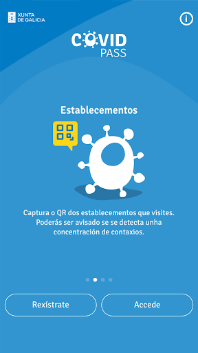
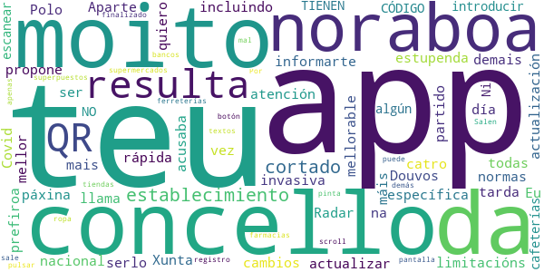

# PassCOVID.gal
App version ``1.0.2``

Analyzed with [covid-apps-observer](http://github.com/covid-apps-observer) project, version ``0.1``

## App overview
| | |
|-------------------------|-------------------------| 
| **Name**&nbsp;&nbsp;&nbsp;&nbsp;&nbsp;&nbsp;&nbsp;&nbsp;&nbsp;&nbsp;&nbsp;&nbsp;&nbsp;&nbsp;&nbsp;&nbsp;&nbsp;&nbsp;&nbsp;&nbsp;&nbsp;&nbsp;&nbsp;&nbsp;&nbsp;&nbsp;&nbsp;&nbsp;&nbsp;&nbsp;&nbsp;&nbsp;&nbsp;&nbsp;&nbsp;&nbsp;&nbsp;&nbsp;&nbsp;&nbsp;  | PassCOVID.gal |
| **Unique identifier** | gal.xunta.covidpass |
| **Link to Google Play** | [https://play.google.com/store/apps/details?id=gal.xunta.covidpass](https://play.google.com/store/apps/details?id=gal.xunta.covidpass) |
| **Summary**  | Información y servicios sobre la Covid-19 de la Xunta de Galicia |
| **Privacy policy** | [https://passcovid.xunta.gal/politica-de-privacidade](https://passcovid.xunta.gal/politica-de-privacidade) |
| **Latest version** | 1.0.2 |
| **Last update** | 2020-12-12 15:20:06 |
| **Recent changes** | [GL] Maior simplicidade e rapidez no acceso para utilizar a App de xeito anónimo Visualización das restricións de maneira máis sinxela e completa Outras melloras menores e corrección de diversos erros.  [ES] Mayor simplicidad y rapidez en el acceso para utilizar la App de manera anónima Visualización de las restricciones de manera más sencilla y completa Otras mejoras menores y corrección de diversos errores. |
| **Installs**  | 10.000+ |
| **Category** | Salud y bienestar |
| **First release** | 15 oct 2020 |
| **Size**  | 13M |
| **Supported Android version**  | 5.0 y versiones posteriores |

### Description
> [GL]
 PassCOVID é unha app da Xunta de Galicia para axudar a coidarnos da COVID-19.
 Permite recibir avisos, estar informado das restricións, recomendacións e novidades, así como informar si estiveches nun local con concentración de contaxios, si es un contacto estreito ou si fuches diagnosticado/a da COVID-19.
 Neste último caso, poderás colaborar coa Xunta de Galicia na xestión da pandemia, informando voluntariamente dos teus contactos estreitos e dos establecementos onde estiveches.
 PassCOVID poderá comprobar a existencia de aplicacións xa instaladas no teu dispositivo e/ou acceder á información das mesmas nos seguintes casos:
  — PassCovid poderá acceder ao dispositivo do usuario para obter información das aplicacións instaladas.
  — PassCovid poderá acceder á aplicación da cámara do dispositivo, co fin de capturar os  QR dos establecementos visitados.
  — PassCovid poderá acceder á aplicación da axenda de contactos, no caso de que se queira utilizar para cargar os datos dos contactos na aplicación de maneira automática.
  — PassCovid poderá acceder ao teléfono, para realizar chamadas aos números de teléfono de contacto presentados na aplicación.
  — PassCovid poderá acceder a ligazóns de contidos e aplicacións de terceiros na internet para proporcionar información e servizos relacionados coa COVID-19.
 Condiciones de uso: https://passcovid.xunta.gal/condicions-de-uso?langId=gl_ES
 Política de privacidad: https://passcovid.xunta.gal/politica-de-privacidade?langId=gl_ES
 [ES]
 PassCOVID es una app de la Xunta de Galicia para ayudar a cuidarnos de la COVID-19.
 Permite recibir avisos, estar informado de las restricciones, recomendaciones y novedades, así como informarte si estuviste en un local con concentración de contagios, si eres un contacto estrecho o si has sido diagnosticado/a de la COVID-19.
 En este último caso, podrás colaborar con la Xunta de Galicia en la gestión de la pandemia, informando voluntariamente de tus contactos estrechos y de los establecimientos donde hayas estado.
 PassCOVID podrá comprobar la existencia de aplicaciones ya instaladas en tu dispositivo y/o acceder a la información de las mismas en los siguientes casos:
 — PassCovid podrá acceder al dispositivo del usuario para obtener información de las aplicaciones instaladas.
 — PassCovid podrá acceder a la aplicación de la cámara del dispositivo, con el fin de capturar los QR de los establecimientos visitados.
 — PassCovid podrá acceder a la aplicación de la agenda de contactos, en el caso de que se quiera utilizar para cargar los datos de los contactos en la aplicación de manera automática.
 — PassCovid podrá acceder al teléfono, para realizar llamadas a los números de teléfono de contacto presentados en la aplicación
 — PassCovid podrá acceder a enlaces de contenidos y aplicaciones de terceros en internet para proporcionar información y servicios relacionados con la COVID-19.
 Condiciones de uso: https://passcovid.xunta.gal/condicions-de-uso?langId=es_ES
 Política de privacidad: https://passcovid.xunta.gal/politica-de-privacidade?langId=es_ES

### User interface
The developers of the app provide the following screenshots in the Google play store.
| | | |
|:-------------------------:|:-------------------------:|:-------------------------:|
 |   |   |   | 
 |   |   |   | 
 |   |  

## Development team
In the following we report the main information provided by the development team in the Google play store.

| | |
|-------------------------|-------------------------|
| **Developer**  | Xunta de Galicia |
| **Website**  | [https://passcovid.xunta.gal](https://passcovid.xunta.gal) |
| **Email** | 012@xunta.gal |
| **Physical address**  | - |
| **Other developed apps**  | [https://play.google.com/store/apps/developer?id=Xunta+de+Galicia](https://play.google.com/store/apps/developer?id=Xunta+de+Galicia) |

## Android support

| | |
|-------------------------|-------------------------|
| **Declared target Android version**  | Android10, version 10 (API level 29) |
| **Effective target Android version**  | Android10, version 10 (API level 29) |
| **Minimum supported Android version**  | Lollipop, version 5.0 (API level 21) |
| **Maximum target Android version**  | - |

The larger the difference between the minimum and maximum supported Android versions, the better. A larger difference means a wider audience. For example, old phones have a very low Android version, so a high minimum supported Android version means that the app cannot be used by users with old phones, thus leading to accessibility problems. 

## Requested permissions

In the following we report the complete list of the permissions requested by the app. 

| **Permission** | **Protection level** | **Description** | 
|-------------------------|-------------------------|-------------------------|
 **android.permission ACCESS_NETWORK_STATE** | Normal | Allows applications to access information about networks. 
 **android.permission CAMERA** | :warning:**Dangerous** | Required to be able to access the camera device. 
 **android.permission FLASHLIGHT** | - | - 
 **android.permission INTERNET** | Normal | Allows applications to open network sockets. 
 **android.permission READ_APP_BADGE** | - | - 
 **android.permission RECEIVE_BOOT_COMPLETED** | Normal | Allows an application to receive the Intent.ACTION_BOOT_COMPLETED that is broadcast after the system finishes booting. 
 **android.permission USE_BIOMETRIC** | Normal | Allows an app to use device supported biometric modalities. 
 **android.permission USE_FINGERPRINT** | Normal | This constant was deprecated in API level 28. Applications should request USE_BIOMETRIC instead 
 **android.permission WAKE_LOCK** | Normal | Allows using PowerManager WakeLocks to keep processor from sleeping or screen from dimming. 
 **android.permission WRITE_EXTERNAL_STORAGE** | :warning:**Dangerous** | Allows an application to write to external storage. 
 **com.anddoes.launcher.permission UPDATE_COUNT** | - | - 
 **com.google.android.c2dm.permission RECEIVE** | - | - 
 **com.htc.launcher.permission READ_SETTINGS** | - | - 
 **com.htc.launcher.permission UPDATE_SHORTCUT** | - | - 
 **com.huawei.android.launcher.permission CHANGE_BADGE** | - | - 
 **com.huawei.android.launcher.permission READ_SETTINGS** | - | - 
 **com.huawei.android.launcher.permission WRITE_SETTINGS** | - | - 
 **com.majeur.launcher.permission UPDATE_BADGE** | - | - 
 **com.oppo.launcher.permission READ_SETTINGS** | - | - 
 **com.oppo.launcher.permission WRITE_SETTINGS** | - | - 
 **com.sec.android.provider.badge.permission READ** | - | - 
 **com.sec.android.provider.badge.permission WRITE** | - | - 
 **com.sonyericsson.home.permission BROADCAST_BADGE** | - | - 
 **com.sonymobile.home.permission PROVIDER_INSERT_BADGE** | - | - 
 **me.everything.badger.permission BADGE_COUNT_READ** | - | - 
 **me.everything.badger.permission BADGE_COUNT_WRITE** | - | - 

## Mentioned servers

| **Server** | **Registrant** | **Registrant country** | **Creation date** | 
|-------------------------|-------------------------|-------------------------|-------------------------|
 | adobe.com | Adobe Inc. | :us: US | 1986-11-17 05:00:00 |
 | google.com | Google LLC | :us: US | 1997-09-15 04:00:00 |
 | appspot.com | Google LLC | :us: US | 2005-03-10 02:27:55 |
 | gstatic.com | Google LLC | :us: US | 2008-02-11 15:31:25 |
 | googleapis.com | Google LLC | :us: US | 2005-01-25 17:52:26 |
 | whatsapp.com | Whatsapp Inc. | :us: US | 2008-09-04 12:39:12 |

## Security analysis 

Below we report the main security warnings raised by our execution of the [Androwarn](https://github.com/maaaaz/androwarn) security analysis tool.

**Connection interfaces exfiltration**
> - This application reads details about the currently active data network 
> - This application tries to find out if the currently active data network is metered 

**Telephony services abuse**
> - This application makes phone calls 

**Suspicious connection establishment**
> - This application opens a Socket and connects it to the remote address '' on the 'N/A' port  
> - This application opens a Socket and connects it to the remote address 'Ljava/lang/StringBuilder;->toString()Ljava/lang/String;' on the ': connect, resolve' port  
> - This application opens a Socket and connects it to the remote address 'Ljava/lang/StringBuilder;->toString()Ljava/lang/String;' on the 'N/A' port  
> - This application opens a Socket and connects it to the remote address 'Ljava/net/Proxy;->type()Ljava/net/Proxy$Type;' on the 'N/A' port  
> - This application opens a Socket and connects it to the remote address 'timeout' on the 'N/A' port  

**Pim data leakage**
> - This application accesses the downloads folder 
> - This application accesses data stored in the clipboard 

**Code execution**
> - This application loads a native library: 'sqlc-native-driver' 

## User ratings and reviews

Below we provide information about how end users are reacting to the app in terms of ratings and reviews in the Google Play store.

### Ratings

The PassCOVID.gal app has been installed by more than **10000** times. At this time, **94** rated the app and its average score is **2.6595745**. Below we show the distribution of the ratings across the usual star-based rating of Google Play

:star::star::star::star::star:: 27

:star::star::star::star:: 5

:star::star::star:: 8

:star::star:: 17

:star:: 37

### Reviews 

#### 5-star reviews

> Muy buena y útil si vives en Galicia. Lo que más me ha gustado es que están bien explicadas y organizadas las restricciones por concello con datos actualizados y oficiales de la propia Xunta. No hay información más actualizada y veraz que esta. Además si tu resultado es positivo aquí te mostrará tu código para introducir en Radar Covid, a parte de hacer listas con contactos estrechos o declarar un contacto de riesgo para que te hagan la prueba entre otras funciones. Muy buena.  :date: __2021-01-07 22:08:33__

> Quizás debería ser un poco mas sencilla su forma de uso  :date: __2021-01-03 10:23:05__

> Después de esta actualización funciona muy bien. Gracias.  :date: __2021-01-02 18:50:17__

> Buena  :date: __2020-12-09 00:02:20__

> Me parece muy útil  :date: __2020-12-03 21:34:44__

> Bien la información ofrecida.  :date: __2020-11-27 16:04:04__

> Esta aplicación va muy bien felicito al SERGAS por la excelente aplicación.  :date: __2020-11-26 10:09:08__

> acceso instantáneo con chave. Sencilla de utilizar con información de la situación y avisos de restricciones.  :date: __2020-10-30 23:50:41__

#### 4-star reviews

> A app e estupenda para informarte de todas as limitacións do teu concello pero o día dos cambios de normas tarda moito en actualizar. Eu prefiroa en vez da páxina da Xunta porque e máis rápida incluindo o teu concello. Polo demais noraboa porque e moito mellor e mais específica que a app nacional. Douvos un catro por ser mellorable na actualización. Noraboa  :date: __2021-01-09 02:14:35__

> Aparte de lo invasiva que resulta (llama la atención porque la propone el partido que acusaba a Radar Covid de serlo), cuando quiero introducir el QR de algún establecimiento resulta que los establecimientos NO TIENEN CÓDIGO QR que escanear. Ni cafeterías, ni supermercados, farmacias, bancos, ferreterías, tiendas de ropa....  :date: __2020-11-08 18:47:18__

> Salen textos cortados o superpuestos y en la pantalla de registro finalizado sale cortado el botón (apenas se puede pulsar) y no hay scroll. Por lo demás no pinta mal.  :date: __2020-10-27 20:57:05__

#### 3-star reviews

> HAY GRAVE PROBLEMA HAY BARES ESOS CODIGOS A ESCANEAR ,OURENSE MUCHOS NO LO TIENEN ES ILEGALIDAD,ESTA APP SE BASA CON ESA, INFORMACIÓN,VERAZ,XUNTA DEBE OBLIGAR,COLOQUEN LAS PUERTAS DE LOS NEGOCIOS,DISCRECION,SI VAS NO LO HAY NO TE LO VAN DAR SI NO ESTA A LA VISTA,HAY BARES BARRIO COVADONGA,NO PONEN MASCARILLA,EL TABERNERO,Y MUCHOS,O ESTO NO ES SERIO,CP,32001Y NO ESTA AL DIA CON LOS CAMBIOS,RESTRINCCIONES,HACERME CASO BARES BARRIO COVADONGA,CREEN SE CONOCEN SON VECINOS NO PASA NADA,NO ES JUSTO PO  :date: __2021-01-02 01:37:17__

> Yo no veo ningún local donde tengan el código QR, lo único que tienen en los bares es el QR de la carta y en otros sitios tampoco lo veo me imagino que tendría que estar a la vista en los supermercados etc..  :date: __2020-12-04 19:15:25__

> Me parece bien.  :date: __2020-11-28 15:32:17__

> Decepcionante, soy ciudadano de la UE y no puedo iniciar sesión con mi NIE, no acepta poner letra delante de los números. Estoy a la espera de nuevas actualizaciones para resolver el problema de inicio de sesión con NIE y clavé 365. Hay que darle una nueva oportunidad.  :date: __2020-11-26 15:24:48__

> Bueno  :date: __2020-11-13 13:58:28__

#### 2-star reviews

> Las restricciones cambiaron esta noche a las 12, y a pesar de haber recibido una notificación diciendo que había cambios en la app, al entrar sigue apareciendo la info de ayer 🤔  :date: __2020-12-23 08:30:25__

> Tiene que mejorar No consigo que la app me indique zonas en las que hay brotes de contagios o zonas de riesgo, se limita a dar información sobre restricciones y recomendaciones que ya conozco muy bien. La desinstalo ahora mismo, esta app no me sirve para desplazarme con seguridad. Más adelante le daré una oportunidad  :date: __2020-12-01 00:01:22__

> Tuve que desinstalarla se quedaba colgada nada más descargarla.....  :date: __2020-11-30 19:20:30__

> Mejor que radarcovid, pero tiene un PERO en mayúsculas. Aún eligiendo la opción en castellano, el 95% del contenido está en gallego, así que tendré que desinstalarla..  :date: __2020-11-30 18:38:05__

> Ya la tuve y era un desastre...la vuelvo a instalar pero ....sin esperanzas ...  :date: __2020-11-30 12:40:33__

> Solo me deja personalizar con chave pero no con certificado digital, por qué?  :date: __2020-11-30 11:12:47__

> Códigos de verificación sigo esperando,fallo  :date: __2020-11-29 21:08:21__

> Non permitirá ser unha útil ferramenta , mediante o escaneo dos códigos QR por non esistir dito QR nos establecementos, públicos e privados . Sen quedar regixtrado que unha persoa a visitado ese establecemento. Sentidiño Indicacións pra protexernos contra a COVID-19.  :date: __2020-11-29 01:47:38__

> Es poco clara y "le cuesta" poner todo en bilingüe, español y gallego. En varios contenidos no da opción y sólo sale la versión en gallego... Otra enfermedad, el antibilingüismo.  :date: __2020-11-28 12:57:27__

> Es curioso que me permita registrar a qué bares voy pero que no pregunte y/o permita registrar el uso del trasporte público... Muy curioso...  :date: __2020-11-24 22:26:27__

#### 1-star reviews

> Pide clave 365 eso es un error que garantiza que muy pocos la van a utilizar cuantas mas restricciones peor esto sólo funciona si la instala todo el mundo, cusntos más mejor, si se ponen restricciones no va . La administracion a su bola para obtener la 365 ir s ventanilla n 11 del capitulo de Axterix.  :date: __2021-01-03 10:58:26__

> Desexo saber si esta aplicación ten coste algún, sexa polo que sexa, avisos, descarga...  :date: __2020-12-06 17:27:13__

> No actualizan los datos, no coinciden las restricciones que indica la aplicación con la realidad  :date: __2020-12-04 08:43:32__

> Voy a ajustes y pongo idioma castellano y toda la información está en gallego. Si tengo la opción de castellano, esa opción no existe?. Soy gallega y tengo el derecho de elegir. Sin comentarios.  :date: __2020-12-03 22:40:10__

> Lo de la llave es algo complicado sacr lo de llave y que la persona se pueda rejistrar  :date: __2020-12-01 21:17:42__

> Terrible. Después de una eternidad para sacar la chave365 porque los sms tardan un siglo en llegar, resulta que no me entra. Sale un cartelito de "entrando en passcovid.gal", otro de "cargando" y se vuelve al formulario de ingresar el DNI y la chave365. Patata de leira.  :date: __2020-12-01 14:36:12__

> Decepcionante ! A mí no me sirve de nada.La información que me da ya la tengo cada dia en los informativos(pongo una estrella porque no me deja no dar ninguna)  :date: __2020-11-30 23:50:29__

> Es mala y Liosa. Demasiados apartados. Con lo fácil que es, simplemente notificar si eres positivo o que te notifiquen si entre tus contactos hay alguno... Así, sin más.  :date: __2020-11-30 19:53:56__

> De vergüenza tener que meter la tarjeta de crédito LADRONES  :date: __2020-11-28 18:22:54__

> Anónima si, pero teslle que conceder permiso ata para acceder á axenda do teléfono...!! Desinstalada antes de acabar de instalala.  :date: __2020-11-28 12:05:23__

