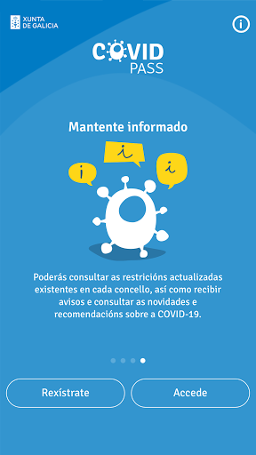
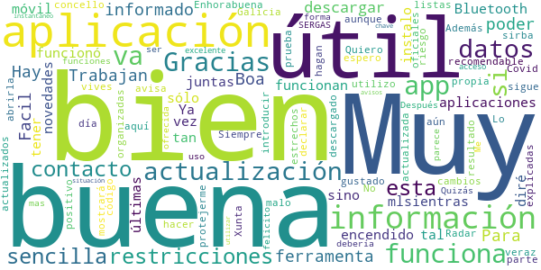
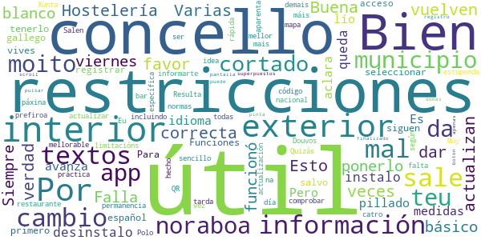
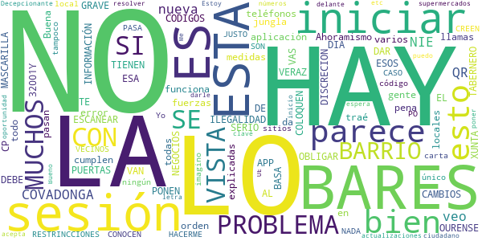

# PassCOVID.gal
App version ``1.0.5``

Analyzed with [covid-apps-observer](http://github.com/covid-apps-observer) project, version ``0.1``

## App overview
| | |
|-------------------------|-------------------------| 
| **Name**                                          | PassCOVID.gal |
| **Unique identifier** | gal.xunta.covidpass |
| **Link to Google Play** | [https://play.google.com/store/apps/details?id=gal.xunta.covidpass](https://play.google.com/store/apps/details?id=gal.xunta.covidpass) |
| **Summary**  | Información y servicios sobre la Covid-19 de la Xunta de Galicia |
| **Privacy policy** | [https://passcovid.xunta.gal/politica-de-privacidade](https://passcovid.xunta.gal/politica-de-privacidade) |
| **Latest version** | 1.0.5 |
| **Last update** | 2021-06-15 08:20:02 |
| **Recent changes** | [GL] Acceso aos certificados europeos de vacinación, resultados de probas e de recuperación de COVID-19  [ES] Acceso a los certificados europeos de vacunación, resultados de pruebas y de recuperación de COVID-19 |
| **Installs**  | 100.000+ |
| **Category** | Salud y bienestar |
| **First release** | 15 oct 2020 |
| **Size**  | 13M |
| **Supported Android version**  | 5.0 y versiones posteriores |

### Description
> [GL]
 PassCOVID é unha app da Xunta de Galicia para axudar a coidarnos da COVID-19.
 Permite recibir avisos, estar informado das restricións, recomendacións e novidades, así como informar si estiveches nun local con concentración de contaxios, si es un contacto estreito ou si fuches diagnosticado/a da COVID-19.
 Neste último caso, poderás colaborar coa Xunta de Galicia na xestión da pandemia, informando voluntariamente dos teus contactos estreitos e dos establecementos onde estiveches.
 PassCOVID poderá comprobar a existencia de aplicacións xa instaladas no teu dispositivo e/ou acceder á información das mesmas nos seguintes casos:
 •	PassCovid poderá acceder á aplicación da cámara do dispositivo, co fin de capturar os  QR dos establecementos visitados.
 •	PassCovid poderá acceder á aplicación da axenda de contactos, no caso de que se queira utilizar para cargar os datos dos contactos na aplicación de maneira automática.
 •	PassCovid poderá acceder ao teléfono, para realizar chamadas aos números de teléfono de contacto presentados na aplicación.
 •	PassCovid poderá acceder a ligazóns de contidos e aplicacións de terceiros na internet para proporcionar información e servizos relacionados coa COVID-19.
 •	PassCOVID poderá ter acceso de lectura e escritura ao almacenamento no dispositivo para ler e escribir arquivos, fotos, vídeos e audio. Devanditos permisos son necesarios para poder descargar, abrir e visualizar o certificado de vacinación.
 Condiciones de uso: https://passcovid.xunta.gal/condicions-de-uso?langId=gl_ES
 Política de privacidad: https://passcovid.xunta.gal/politica-de-privacidade?langId=gl_ES
 [ES]
 PassCOVID es una app de la Xunta de Galicia para ayudar a cuidarnos de la COVID-19.
 Permite recibir avisos, estar informado de las restricciones, recomendaciones y novedades, así como informarte si estuviste en un local con concentración de contagios, si eres un contacto estrecho o si has sido diagnosticado/a de la COVID-19.
 En este último caso, podrás colaborar con la Xunta de Galicia en la gestión de la pandemia, informando voluntariamente de tus contactos estrechos y de los establecimientos donde hayas estado.
 PassCOVID podrá comprobar la existencia de aplicaciones ya instaladas en tu dispositivo y/o acceder a la información de las mismas en los siguientes casos:
 •	PassCovid podrá acceder a la aplicación de la cámara del dispositivo, con el fin de capturar los QR de los establecimientos visitados.
 •	PassCovid podrá acceder a la aplicación de la agenda de contactos, en el caso de que se quiera utilizar para cargar los datos de los contactos en la aplicación de manera automática.
 •	PassCovid podrá acceder al teléfono, para realizar llamadas a los números de teléfono de contacto presentados en la aplicación
 •	PassCovid podrá acceder a enlaces de contenidos y aplicaciones de terceros en internet para proporcionar información y servicios relacionados con la COVID-19.
 •	PassCovid podrá tener acceso de lectura y escritura al almacenamiento en el dispositivo para leer y escribir archivos, fotos, vídeos y audio. Dichos permisos son necesarios para poder descargar, abrir y visualizar el certificado de vacunación.
 Condiciones de uso: https://passcovid.xunta.gal/condicions-de-uso?langId=es_ES
 Política de privacidad: https://passcovid.xunta.gal/politica-de-privacidade?langId=es_ES

### User interface
The developers of the app provide the following screenshots in the Google play store.
| | | |
|:-------------------------:|:-------------------------:|:-------------------------:|
 |   |   |   | 
 |   |   |   | 
 |   |  

## Development team
In the following we report the main information provided by the development team in the Google play store.

| | |
|-------------------------|-------------------------|
| **Developer**  | Xunta de Galicia |
| **Website**  | [https://passcovid.xunta.gal](https://passcovid.xunta.gal) |
| **Email** | 012@xunta.gal |
| **Physical address**  | - |
| **Other developed apps**  | [https://play.google.com/store/apps/developer?id=Xunta+de+Galicia](https://play.google.com/store/apps/developer?id=Xunta+de+Galicia) |

## Android support

| | |
|-------------------------|-------------------------|
| **Declared target Android version**  | Android10, version 10 (API level 29) |
| **Effective target Android version**  | Android10, version 10 (API level 29) |
| **Minimum supported Android version**  | Lollipop, version 5.0 (API level 21) |
| **Maximum target Android version**  | - |

The larger the difference between the minimum and maximum supported Android versions, the better. A larger difference means a wider audience. For example, old phones have a very low Android version, so a high minimum supported Android version means that the app cannot be used by users with old phones, thus leading to accessibility problems. 

## Requested permissions

In the following we report the complete list of the permissions requested by the app. 

| **Permission** | **Protection level** | **Description** | 
|-------------------------|-------------------------|-------------------------|
 **android.permission ACCESS_NETWORK_STATE** | Normal | Allows applications to access information about networks. 
 **android.permission CALL_PHONE** | :warning:**Dangerous** | Allows an application to initiate a phone call without going through the Dialer user interface for the user to confirm the call. 
 **android.permission CAMERA** | :warning:**Dangerous** | Required to be able to access the camera device. 
 **android.permission FLASHLIGHT** | - | - 
 **android.permission GET_ACCOUNTS** | :warning:**Dangerous** | Allows access to the list of accounts in the Accounts Service. 
 **android.permission INTERNET** | Normal | Allows applications to open network sockets. 
 **android.permission READ_APP_BADGE** | - | - 
 **android.permission READ_CONTACTS** | :warning:**Dangerous** | Allows an application to read the user's contacts data. 
 **android.permission READ_EXTERNAL_STORAGE** | :warning:**Dangerous** | Allows an application to read from external storage. 
 **android.permission RECEIVE_BOOT_COMPLETED** | Normal | Allows an application to receive the Intent.ACTION_BOOT_COMPLETED that is broadcast after the system finishes booting. 
 **android.permission REQUEST_INSTALL_PACKAGES** | Signature | Allows an application to request installing packages. 
 **android.permission USE_BIOMETRIC** | Normal | Allows an app to use device supported biometric modalities. 
 **android.permission USE_FINGERPRINT** | Normal | This constant was deprecated in API level 28. Applications should request USE_BIOMETRIC instead 
 **android.permission WAKE_LOCK** | Normal | Allows using PowerManager WakeLocks to keep processor from sleeping or screen from dimming. 
 **android.permission WRITE_CONTACTS** | :warning:**Dangerous** | Allows an application to write the user's contacts data. 
 **android.permission WRITE_EXTERNAL_STORAGE** | :warning:**Dangerous** | Allows an application to write to external storage. 
 **com.anddoes.launcher.permission UPDATE_COUNT** | - | - 
 **com.google.android.c2dm.permission RECEIVE** | - | - 
 **com.htc.launcher.permission READ_SETTINGS** | - | - 
 **com.htc.launcher.permission UPDATE_SHORTCUT** | - | - 
 **com.huawei.android.launcher.permission CHANGE_BADGE** | - | - 
 **com.huawei.android.launcher.permission READ_SETTINGS** | - | - 
 **com.huawei.android.launcher.permission WRITE_SETTINGS** | - | - 
 **com.majeur.launcher.permission UPDATE_BADGE** | - | - 
 **com.oppo.launcher.permission READ_SETTINGS** | - | - 
 **com.oppo.launcher.permission WRITE_SETTINGS** | - | - 
 **com.sec.android.provider.badge.permission READ** | - | - 
 **com.sec.android.provider.badge.permission WRITE** | - | - 
 **com.sonyericsson.home.permission BROADCAST_BADGE** | - | - 
 **com.sonymobile.home.permission PROVIDER_INSERT_BADGE** | - | - 
 **me.everything.badger.permission BADGE_COUNT_READ** | - | - 
 **me.everything.badger.permission BADGE_COUNT_WRITE** | - | - 

## Mentioned servers

| **Server** | **Registrant** | **Registrant country** | **Creation date** | 
|-------------------------|-------------------------|-------------------------|-------------------------|
 | adobe.com | Adobe Inc. | :us: US | 1986-11-17 05:00:00 |
 | google.com | Google LLC | :us: US | 1997-09-15 04:00:00 |
 | appspot.com | Google LLC | :us: US | 2005-03-10 02:27:55 |
 | gstatic.com | Google LLC | :us: US | 2008-02-11 15:31:25 |
 | googleapis.com | Google LLC | :us: US | 2005-01-25 17:52:26 |
 | whatsapp.com | WhatsApp LLC | :us: US | 2008-09-04 12:39:12 |

## Security analysis 

Below we report the main security warnings raised by our execution of the [Androwarn](https://github.com/maaaaz/androwarn) security analysis tool.

**Telephony identifiers leakage**
> - This application reads the device phone type value 

**Connection interfaces exfiltration**
> - This application reads details about the currently active data network 
> - This application tries to find out if the currently active data network is metered 

**Telephony services abuse**
> - This application makes phone calls 

**Suspicious connection establishment**
> - This application opens a Socket and connects it to the remote address '' on the 'N/A' port  
> - This application opens a Socket and connects it to the remote address 'Ljava/lang/StringBuilder;->toString()Ljava/lang/String;' on the ': connect, resolve' port  
> - This application opens a Socket and connects it to the remote address 'Ljava/lang/StringBuilder;->toString()Ljava/lang/String;' on the 'N/A' port  
> - This application opens a Socket and connects it to the remote address 'Ljava/net/Proxy;->type()Ljava/net/Proxy$Type;' on the 'N/A' port  
> - This application opens a Socket and connects it to the remote address 'timeout' on the 'N/A' port  

**Pim data leakage**
> - This application accesses the downloads folder 
> - This application accesses data stored in the clipboard 

**Code execution**
> - This application loads a native library: 'sqlc-native-driver' 

## User ratings and reviews

Below we provide information about how end users are reacting to the app in terms of ratings and reviews in the Google Play store.

### Ratings

The PassCOVID.gal app has been installed by more than **100000** times. At this time, **207** rated the app and its average score is **3.372549**. Below we show the distribution of the ratings across the usual star-based rating of Google Play

:star::star::star::star::star:: 88

:star::star::star::star:: 24

:star::star::star:: 24

:star::star:: 20

:star:: 51

### Reviews 

#### 5-star reviews

> Boa ferramenta  :date: __2021-07-22 14:13:35__

> Facil  :date: __2021-07-02 12:04:49__

> Muy útil. Para poder estar informado.  :date: __2021-06-23 20:52:58__

> Trabajan muy bien  :date: __2021-06-22 18:13:07__

> Hay que descargar las 2 aplicaciones juntas sino no funcionan y hay que tener encendido el Bluetooth (o no funciona otra vez). A mí me funcionó tan bien mlsientras la tuve un el móvil que sólo por estar al tanto de las últimas novedades me la instalo. Ya os diré qué tal me va .…..…...…Enhorabuena¡!¡!¡!!!👠 :date: __2021-06-03 23:59:02__

> Muy bien yo la utilizo  :date: __2021-04-28 13:01:04__

> Buena app, muy recomendable. Gracias por la app  :date: __2021-03-20 20:59:24__

> Muy buena aplicación, lo malo es que aunque se ha descargado la actualización del día 21/02, al abrirla, aún sigue con los datos del 17/02  :date: __2021-02-24 22:46:40__

> Siempre avisa de los cambios  :date: __2021-02-13 01:57:35__

> Quiero protejerme espero que me sirba de algo  :date: __2021-02-08 19:41:42__

#### 4-star reviews

> Buena  :date: __2021-07-18 18:49:51__

> Hostelería interior al 30% y exterior al 50%. Por favor dar la información correcta. Esto no es verdad. Interior al 50 y exterior al 75. Varias veces que lo actualizan y vuelven a ponerlo mal. Falla en lo básico.  :date: __2021-06-26 08:47:11__

> Útil  :date: __2021-04-20 16:53:06__

> Siempre funcionó bien pero desde el viernes me sale todo en blanco, desinstalo e instalo y se queda pillado en cambio de idioma y no avanza  :date: __2021-03-08 18:09:59__

> Es útil y aclara todo el lío de medidas. Pero al seleccionar tenerlo en español, los textos (salvo el primero) siguen estando en gallego.  :date: __2021-03-01 11:44:23__

> Funciones e información de restricciones del concello donde vives. Para registrar el acceso o permanencia en un bar ó restaurante. Muy útil.  :date: __2021-02-26 20:20:43__

> Resulta muy sencillo comprobar las restricciones de tu municipio. Y la idea del código QR aparenta muy práctica. Quizás hecho en falta el mapa con los municipios según restricciones  :date: __2021-02-26 11:57:16__

> A app e estupenda para informarte de todas as limitacións do teu concello pero o día dos cambios de normas tarda moito en actualizar. Eu prefiroa en vez da páxina da Xunta porque e máis rápida incluindo o teu concello. Polo demais noraboa porque e moito mellor e mais específica que a app nacional. Douvos un catro por ser mellorable na actualización. Noraboa  :date: __2021-01-09 02:14:35__

> Salen textos cortados o superpuestos y en la pantalla de registro finalizado sale cortado el botón (apenas se puede pulsar) y no hay scroll. Por lo demás no pinta mal.  :date: __2020-10-27 20:57:05__

#### 3-star reviews

> Buena  :date: __2021-07-20 19:34:25__

> Ahoramismo da error al iniciar sesión (en varios teléfonos)  :date: __2021-03-31 14:40:32__

> La aplicación parece qué funciona bien, traé todas las medidas explicadas,la pena es que ni la gente ni los locales las cumplen.y llamas a las fuerzas del orden y pasan de todo.esto es la jungla.  :date: __2021-03-04 11:03:31__

> HAY GRAVE PROBLEMA HAY BARES ESOS CODIGOS A ESCANEAR ,OURENSE MUCHOS NO LO TIENEN ES ILEGALIDAD,ESTA APP SE BASA CON ESA, INFORMACIÓN,VERAZ,XUNTA DEBE OBLIGAR,COLOQUEN LAS PUERTAS DE LOS NEGOCIOS,DISCRECION,SI VAS NO LO HAY NO TE LO VAN DAR SI NO ESTA A LA VISTA,HAY BARES BARRIO COVADONGA,NO PONEN MASCARILLA,EL TABERNERO,Y MUCHOS,O ESTO NO ES SERIO,CP,32001Y NO ESTA AL DIA CON LOS CAMBIOS,RESTRINCCIONES,HACERME CASO BARES BARRIO COVADONGA,CREEN SE CONOCEN SON VECINOS NO PASA NADA,NO ES JUSTO PO  :date: __2021-01-02 01:37:17__

> Yo no veo ningún local donde tengan el código QR, lo único que tienen en los bares es el QR de la carta y en otros sitios tampoco lo veo me imagino que tendría que estar a la vista en los supermercados etc..  :date: __2020-12-04 19:15:25__

> Me parece bien.  :date: __2020-11-28 15:32:17__

> Decepcionante, soy ciudadano de la UE y no puedo iniciar sesión con mi NIE, no acepta poner letra delante de los números. Estoy a la espera de nuevas actualizaciones para resolver el problema de inicio de sesión con NIE y clavé 365. Hay que darle una nueva oportunidad.  :date: __2020-11-26 15:24:48__

> Bueno  :date: __2020-11-13 13:58:28__

#### 2-star reviews

> He intentado acceder con Chave 365, pero no encuentro la manera de registrarme. Quizá lo hice mal la primera vez que la instalé, pero la he desistalado y vuelto a instalar no sé cuántas veces, y sólo me permite acceder, pero no registrarme. De esa manera, accedo como usuario anónimo, y no puedo descargar el certificado de vacunación (por ejemplo). Hay enlaces que te explican las ventajas de acceder con Chave 365, pero en ninguna parte te explican cómo hacerlo.  :date: __2021-07-09 20:20:09__

> Pasa a estado anónimo constantemente.  :date: __2021-05-09 20:00:56__

> La aplicación va cuando quiere siempre da problemas para registrarse en los locales  :date: __2021-03-26 19:41:21__

> Los desplegables para seleccionar el Ayuntamiento me salen vacíos y no puedo hacer nada.ni reinstalando se soluciona  :date: __2021-03-09 03:08:06__

> En Lugo, según la aplicación el interior de los locales de hostelería CERRADO, cuando según el DOG también en interior al 30%. Y los establecimientos NO TIENEN CÓDIGO QR que escanear. Ni cafeterías, ni supermercados, farmacias, bancos, ferreterías, tiendas de ropa....  :date: __2021-02-27 09:00:56__

> Mal elaborada, me parece que dar como opción de identificación solo chave 365 es un error, en mi caso tengo certificado digital y no es posible registrarse con el.  :date: __2021-02-25 16:20:44__

> No te puedes fiar de las restricciones. De nada sirve informarse de las restricciones de tu ciudad en la aplicación si después cada concello pone las suyas propias. Consulté una restricción relativa a presenciar un evento deportivo en la app, llamé al número de atención Covid, me confirmaron que podía ir y cuando llegué al pabellón no me dejaron entrar por la normativa que puso el concello. En la aplicación no se puede poner una normativa en un concello determinado y que realmente no sea así.  :date: __2021-01-17 12:22:05__

> No publican las actualizaciones es lenta sin información actualizada.  :date: __2021-01-14 15:54:11__

> Las restricciones cambiaron esta noche a las 12, y a pesar de haber recibido una notificación diciendo que había cambios en la app, al entrar sigue apareciendo la info de ayer 🤔  :date: __2020-12-23 08:30:25__

> Tiene que mejorar No consigo que la app me indique zonas en las que hay brotes de contagios o zonas de riesgo, se limita a dar información sobre restricciones y recomendaciones que ya conozco muy bien. La desinstalo ahora mismo, esta app no me sirve para desplazarme con seguridad. Más adelante le daré una oportunidad  :date: __2020-12-01 00:01:22__

#### 1-star reviews

> Perda de tempo  :date: __2021-07-23 13:21:00__

> No me permite loguearme, se queda continuamente en "accediendo".  :date: __2021-07-23 10:10:15__

> No he conseguido descargar el certificado. Seria bueno si funcionara bien  :date: __2021-07-22 22:25:04__

> ğš‚ğš’ ğšğšğšœğšŒğšŠğš›ğšğšŠğšœ ğšğš ğšğšœğšğš˜ ğš™ğšŠğš›ğšŠ ğšœğš˜ğš•ğš’ğšŒğš’ğšğšŠğš› ğšğš• ğšŒğšğš›ğšğš’ğšğš’ğšŒğšŠğšğš˜ ğšğš ğšŸğšŠğšŒğšğš—ğšŠğšğš˜, ğš˜ğš•ğšŸğš’ğšğšŠğšğš, ğšŸğšğšğš 𚊠ğšğš ğšŠğš–ğš‹ğšğš•ğšŠğšğš˜ğš›ğš’𚘠𚢠ğš™ğš’ğšğš ğš•ğšŠ ğšŒğš•ğšŠğšŸğš ğšŠğš•ğš•Ã­, ğšğšœğšğš˜ ğšœğš˜ğš•ğš˜ ğšŸğšŠğš•ğš ğš™ğšŠğš›ğšŠ ğš™ğšğš›ğšğšğš› ğšğš• ğšğš’ğšğš–ğš™ğš˜.  :date: __2021-07-22 17:40:33__

> Sería muy difícil que la hicieran más inútil y complicada . Imposible descargar el certificado de vacunación Covid . Mala, mala , mala .  :date: __2021-07-22 11:54:30__

> Bastante inútil  :date: __2021-07-18 00:11:15__

> Poucas veces vin app máis inútil. E o de conseguir o certificado covid a través dela, simplemente mentira.  :date: __2021-07-13 13:11:41__

> Mala no, lo siguiente  :date: __2021-07-13 12:02:43__

> Unha merda  :date: __2021-07-10 00:17:42__

> Pésima, soy de muface con clave365 y no me funcionó jamás. ¿Quien diseñó la aplicación? Porfavor contraten gente competente, que tenemos un 20% de paro....  :date: __2021-07-06 21:24:30__

