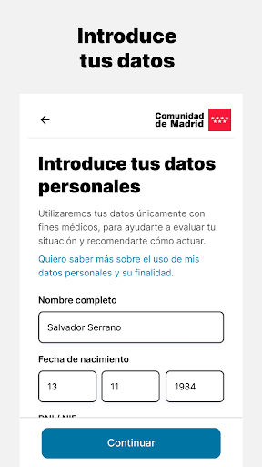
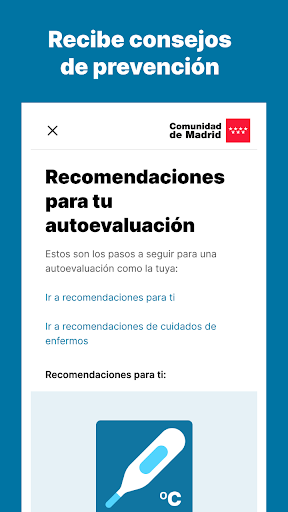
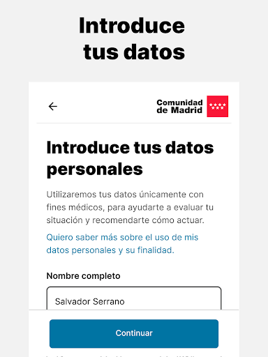
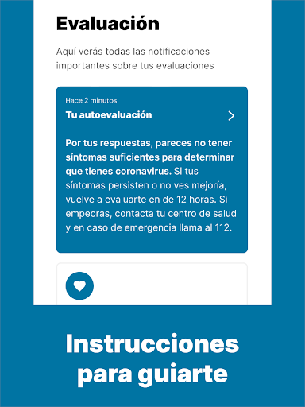
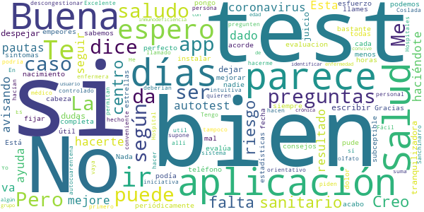
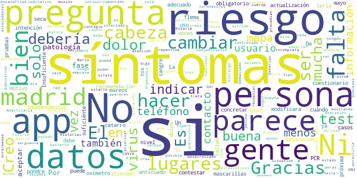
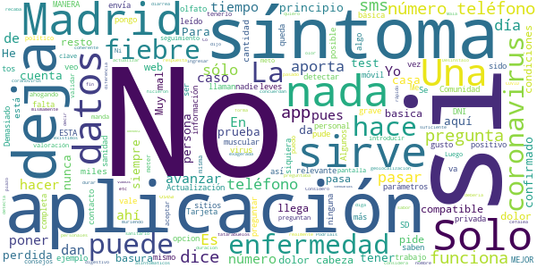

# CoronaMadrid
App version ``1.0.10``

Analyzed with [covid-apps-observer](http://github.com/covid-apps-observer) project, version ``0.1``

## App overview
| | |
|-------------------------|-------------------------| 
| **Name**&nbsp;&nbsp;&nbsp;&nbsp;&nbsp;&nbsp;&nbsp;&nbsp;&nbsp;&nbsp;&nbsp;&nbsp;&nbsp;&nbsp;&nbsp;&nbsp;&nbsp;&nbsp;&nbsp;&nbsp;&nbsp;&nbsp;&nbsp;&nbsp;&nbsp;&nbsp;&nbsp;&nbsp;&nbsp;&nbsp;&nbsp;&nbsp;&nbsp;&nbsp;&nbsp;&nbsp;&nbsp;&nbsp;&nbsp;&nbsp;  | CoronaMadrid |
| **Unique identifier** | org.madrid.CoronaMadrid |
| **Link to Google Play** | [https://play.google.com/store/apps/details?id=org.madrid.CoronaMadrid](https://play.google.com/store/apps/details?id=org.madrid.CoronaMadrid) |
| **Summary**  | Aplicación para la detección y auto-evaluación del Coronavirus, o COVID-19 |
| **Privacy policy** | [https://www.coronamadrid.com/proteccion-de-datos](https://www.coronamadrid.com/proteccion-de-datos) |
| **Latest version** | 1.0.10 |
| **Last update** | 2020-05-07 09:44:40 |
| **Recent changes** | Correcciones de UI y de errores menores |
| **Installs**  | 50.000+ |
| **Category** | Medicina |
| **First release** | 23 mar. 2020 |
| **Size**  | 22M |
| **Supported Android version**  | 4.1 y versiones posteriores |

### Description
> La aplicación móvil CoronaMadrid permite a sus usuarios poder detectar, informarse y contactar con las autoridades en cualquier fase de la concepción de la enfermedad COVID-19.
 El virus SARS-CoV-2, también conocido como Coronavirus está en fase de pandemia global y por esta razón nace CoronaMadrid, una aplicación que tiene la misión de ayudar a los ciudadanos a poder detectar si están siendo afectados por la enfermedad y obtener las mejores recomendaciones dependiendo de su estado. En caso de estado grave las autoridades serán conocedoras de la situación y podrán comunicarse directamente con el afectado.

### User interface
The developers of the app provide the following screenshots in the Google play store.
| | | |
|:-------------------------:|:-------------------------:|:-------------------------:|
 |   |   |   | 
 |   |   |   | 
 |   |   |   | 
 |  

## Development team
In the following we report the main information provided by the development team in the Google play store.

| | |
|-------------------------|-------------------------|
| **Developer**  | Comunidad de Madrid |
| **Website**  | - |
| **Email** | support@forcemanager.net |
| **Physical address**  | - |
| **Other developed apps**  | [https://play.google.com/store/apps/developer?id=Comunidad+de+Madrid](https://play.google.com/store/apps/developer?id=Comunidad+de+Madrid) |

## Android support

| | |
|-------------------------|-------------------------|
| **Declared target Android version**  | Pie, version 9 (API level 28) |
| **Effective target Android version**  | Pie, version 9 (API level 28) |
| **Minimum supported Android version**  | Jelly Bean, version 4.1.x (API level 16) |
| **Maximum target Android version**  | - |

The larger the difference between the minimum and maximum supported Android versions, the better. A larger difference means a wider audience. For example, old phones have a very low Android version, so a high minimum supported Android version means that the app cannot be used by users with old phones, thus leading to accessibility problems. 

## Requested permissions

In the following we report the complete list of the permissions requested by the app. 

| **Permission** | **Protection level** | **Description** | 
|-------------------------|-------------------------|-------------------------|
 **android.permission ACCESS_COARSE_LOCATION** | :warning:**Dangerous** | Allows an app to access approximate location. 
 **android.permission ACCESS_FINE_LOCATION** | :warning:**Dangerous** | Allows an app to access precise location. 
 **android.permission ACCESS_NETWORK_STATE** | Normal | Allows applications to access information about networks. 
 **android.permission ACCESS_WIFI_STATE** | Normal | Allows applications to access information about Wi-Fi networks. 
 **android.permission INTERNET** | Normal | Allows applications to open network sockets. 
 **com.google.android.c2dm.permission RECEIVE** | - | - 
 **com.google.android.finsky.permission BIND_GET_INSTALL_REFERRER_SERVICE** | - | - 

## Mentioned servers

| **Server** | **Registrant** | **Registrant country** | **Creation date** | 
|-------------------------|-------------------------|-------------------------|-------------------------|
 | android.com | Google LLC | :us: US | 1997-06-23 04:00:00 |
 | googlesyndication.com | Google LLC | :us: US | 2003-01-21 06:17:24 |
 | google.com | Google LLC | :us: US | 1997-09-15 04:00:00 |
 | app-measurement.com | Google LLC | :us: US | 2015-06-19 20:13:31 |
 | facebook.com | Facebook, Inc. | :us: US | 1997-03-29 05:00:00 |
 | pinterest.com | DNStination Inc. | :us: US | 2009-11-26 19:21:23 |
 | twitter.com | Twitter, Inc. | :us: US | 2000-01-21 16:28:17 |
 | googleapis.com | Google LLC | :us: US | 2005-01-25 17:52:26 |
 | googleadservices.com | Google LLC | :us: US | 2003-06-19 16:34:53 |
 | crashlytics.com | Google LLC | :us: US | 2011-01-21 15:30:40 |

## Security analysis 

Below we report the main security warnings raised by our execution of the [Androwarn](https://github.com/maaaaz/androwarn) security analysis tool.

**Telephony identifiers leakage**
> - This application reads the numeric name (MCC+MNC) of current registered operator 
> - This application reads the operator name 
> - This application reads the phone number string for line 1, for example, the MSISDN for a GSM phone 

**Location lookup**
> - This application reads location information from all available providers (WiFi, GPS etc.) 

**Connection interfaces exfiltration**
> - This application reads details about the currently active data network 
> - This application tries to find out if the currently active data network is metered 

**Suspicious connection establishment**
> - This application opens a Socket and connects it to the remote address '' on the 'N/A' port  
> - This application opens a Socket and connects it to the remote address 'Ljava/lang/StringBuilder;->toString()Ljava/lang/String;' on the ': connect, resolve' port  
> - This application opens a Socket and connects it to the remote address 'Ljava/lang/StringBuilder;->toString()Ljava/lang/String;' on the 'N/A' port  
> - This application opens a Socket and connects it to the remote address 'Ljava/net/Proxy;->type()Ljava/net/Proxy$Type;' on the 'N/A' port  
> - This application opens a Socket and connects it to the remote address 'timeout' on the 'N/A' port  

**Pim data leakage**
> - This application accesses the downloads folder 
> - This application accesses data stored in the clipboard 

**Code execution**
> - This application loads a native library 
> - This application loads a native library: 'Ljava/util/Iterator;->next()Ljava/lang/Object;' 
> - This application loads a native library: 'crashlytics' 
> - This application executes a UNIX command containing this argument: '2' 

## User ratings and reviews

Below we provide information about how end users are reacting to the app in terms of ratings and reviews in the Google Play store.

### Ratings

The CoronaMadrid app has been installed by more than **50000** times. At this time, **300** rated the app and its average score is **3.31**. Below we show the distribution of the ratings across the usual star-based rating of Google Play

:star::star::star::star::star:: 123

:star::star::star::star:: 36

:star::star::star:: 33

:star::star:: 27

:star:: 81

### Reviews 

#### 5-star reviews

> Mejorarla, meter más opciones de diagnóstico.  :date: __2020-05-09 17:01:13__

> Es una app estupenda para este momento  :date: __2020-05-01 13:22:48__

> Aplicación de control del virus, correcta  :date: __2020-04-29 14:49:30__

> Muy buena  :date: __2020-04-25 14:05:02__

> Me parece muy útil y de gran ayuda  :date: __2020-04-15 11:23:15__

> Muy buena aplicación Me han llamado un par de veces por tfno  :date: __2020-04-14 01:45:02__

> Poco a poco se va mejorando, seguid trabajando en esta aplicación. Una duda: En la última pregunta hay que contestar SI o NO, si por ejemplo cambia una de las respuestas de una autoevaluación a otra ¿la respuesta sería NO, verdad? Porque la nueva situación hace que no lleves 20 días...  :date: __2020-04-13 11:53:25__

> Deberíamos hacer todos este seguimiento voluntario, creo que podría ser beneficioso para toda la población y para la investigación.  :date: __2020-04-13 00:53:49__

> Perfecto gracias  :date: __2020-04-12 22:01:18__

> Madrid unida. Siempre fuertes  :date: __2020-04-12 19:22:18__

#### 4-star reviews

> Te va avisando de cuando puedes ir haciéndote el test de las preguntas. Te da pautas a seguir según el resultado que te haya dado  :date: __2020-04-23 17:45:23__

> Buena  :date: __2020-04-13 09:25:49__

> Me ayuda a despejar las dudas  :date: __2020-04-12 14:47:41__

> Buena y tranquilizadora  :date: __2020-04-12 11:18:14__

> Me parece muy bien, pero no es un juicio si no si no, tienen que dejar escribir algo periódicamente, porque puede ser que haya tenido dolor de cabeza 2 días no 15 días. Pero el esfuerzo está bien, entre todos podemos. Aplicación se podía un saludo  :date: __2020-04-09 13:09:58__

> No pude fijar fecha de nacimiento  :date: __2020-04-07 11:23:47__

> No esta mal, bastante completa  :date: __2020-04-06 19:24:20__

> La acabo de instalar y espero que este acorde al menos con mi evaluacion.  :date: __2020-04-04 17:06:30__

> Está muy bien. No le pongo todas las estrellas porque siempre es subceptible de mejorar.Nada ni nadie es perfecto. Salud y saludos.Gracias  :date: __2020-04-04 06:56:52__

> La app es útil para estadísticas, me parece bien, te evalúa según los síntomas que tienes cada 12 horas y te da los consejos que todos sabemos y en caso que empeores te dice que llames al teléfono 900, me parece bien para descongestionar el sistema sanitario, todo suma.  :date: __2020-03-30 12:23:10__

#### 3-star reviews

> De qué me atiendan lo pondre  :date: __2020-05-06 13:23:50__

> El contestar Sí o No, no es suficiénte. A veces hay concretar algo  :date: __2020-04-16 21:04:02__

> Insuficiente.Faltan síntomas como dolor de cabeza, mareos,, conjuntivitis , mucha gente lo está pasando sin los síntomas que aparecen en esta App.  :date: __2020-04-16 08:17:52__

> Creo que deberian modificarla para incluir la pregunta: "¿Has sufrido una repentina perdida de olfato?" Segun parece esto se esta mostrando bastante indicativo de posible contagio por coronavirus.  :date: __2020-04-15 08:06:01__

> Deberían sacarla para toda españa...ni que el virus solo estuviera en madrid. Es buena pero incompleta.  :date: __2020-04-07 09:46:43__

> Estaria bien que pudieses cambiar en vez de madrid de donde tu seas  :date: __2020-04-06 17:04:21__

> donde te pregunta de escalofrios o el dolor del cuerop/muslos.......muy pesima la aplicacion...otra vez enganados por el estado.....verguenza ....en estta situation se burlean de la population....  :date: __2020-04-02 10:22:37__

> Echo en falta poder indicar si se trata de una persona que vive sola y no tiene red de apoyo en Madrid  :date: __2020-03-30 13:46:22__

> Hola, me han comentado que los datos que metemos, sensibles como DNI, edad o teléfono, luego los van a usar la empresa que ha desarrollado la app. Es verdad?  :date: __2020-03-29 14:02:58__

> Solo vale si estás infectado o crees estarlo para mandar tus datos y que te tengan controlado pero no da información de ningún tipo. Ni mapa, ni estadísticas ni nada. Si no tienes síntomas ni la abras porque no te sirve.  :date: __2020-03-28 22:09:48__

#### 2-star reviews

> No vale para mucho, no permite hacer un seguimiento real de la evolución de los síntomas. Muy limitado. Y quienes te llaman ni siquiera son sanitarios a los que se puedan consultarles dudas.  :date: __2020-05-04 22:58:45__

> El día 2/4/20 tuve unas alteraciones en mi salud que me inducen a pensar que tuve Covid19 empece a tomar paracetamol y me fue bajando la fiebre y los escalofríos, a todo esto me dijeron que con los datos que les di no podían evaluar si estaba contagiado.¿ porque no hacen test masivos? a lo mejor lo he tenido de forma leve y he podido estar contagiando sin saberlo.  :date: __2020-05-04 10:59:47__

> Me parece que hacen muy pocas preguntas... Por ejemplo, no está el tema de los sarpullidos y picor en la piel, la diarrea, etc. El covid tiene más síntomas que la tos, fiebre y la falta de aire.  :date: __2020-04-25 23:27:59__

> La idea de la app es buena. Pero sabiéndose que hay otros síntomas de la enfermedad y que estos no se encuentran en las opciones, se resulta un tanto ineficaz para un real control.  :date: __2020-04-11 20:34:07__

> Por qué no aparece la anosmia como un sintoma si la incidencia es muy alta?  :date: __2020-04-11 18:25:41__

> No es Científica  :date: __2020-04-07 21:13:10__

> Incompleta, no te pregunta ciertos síntomas importantes como falta de olfato, mareo, dolor de cabeza que parece que son muy comunes  :date: __2020-04-06 15:12:43__

> Solo vale para la comunidad de Madrid.  :date: __2020-04-05 20:51:20__

> Te hace algunas preguntas muy genéricas y no acordes con todos los síntomas que se han reportado de tener el COVID19. La app de la Generalitat de Cataluña es bastante más completa. En esta siempre me sale negativo y en la de la Generalitat me sale posible caso. Está app es como los test que el gobierno compró, te sirve cuando es más que obvio que lo tienes.  :date: __2020-04-03 11:48:04__

> Incompleta. Faltan opciones de más síntomas confirmados del covid-19. Cansancio, dolor de cabeza...  :date: __2020-03-26 17:36:15__

#### 1-star reviews

> No me Dan una respuesta coherente, pues los síntomas no concuerdan con las preguntas.  :date: __2020-05-07 11:53:54__

> Podríais actualizar los síntomas, porque tener diarrea y fiebre es síntoma de coronavirus, aquí es coranovirus si te estás muriendo, así nos va asintomáticos o Co algunos síntomas no son lo suficiente para decir que coronavirus, está aplicación sólo detecta si estas muy grave con el virus pero vamos que eso no hace falta que lo diga una aplicación, de eso uno se da cuenta mismamente  :date: __2020-05-01 21:16:16__

> La aplicación pregunta si se ha estado en contacto con una persona con coronavirus confirmado, lo que deja fuera a los miles de posibles casos leves a los que no se les hace la prueba. La diferencia entre ser o no caso confirmado no debería ser realmente relevante, cuando en Madrid sólo se hace la prueba a casos graves, personal sanitario y políticos. Actualización: siempre me dijo que mis síntomas no eran de coronavirus. Me hicieron un test rápido en el trabajo y he pasado el COVID... En fin  :date: __2020-04-30 23:49:39__

> Nunca pude ingresar y cuando entre me preguntaba hasta el nombre de mis tatarabuelos  :date: __2020-04-30 19:08:10__

> Una forma de detectar los síntomas penosa, apenas una preguntas simples y de vez en cuando te llaman para verificar datos y lo único que hace es pasar las mismas preguntas. He tenido que recurrir a la sanidad privada para que efectivamente me hicieran la prueba y he dado positivo. Gracias a que he sido cauteloso y me he mantenido en cuarentena, si es por ellos podría salir perfectamente. ESTA ES LA MEJOR MANERA DE USAR LA TECNOLOGÍA PARA ESTA PANDEMIA. que triste  :date: __2020-04-30 18:40:06__

> Yo ni siquiera pude entrar no me deja poner el pasaporte solo NIE y DNI  :date: __2020-04-26 00:10:52__

> No la veo completa... He leído en sitios toda la cantidad de síntomas que hay de la enfermedad, y aquí solo se basan en 3 o 4. Yo por ejemplo de repente he empezado a vomitar ( que he leído en sitios que es un síntoma) incluso, con restos de sangre, y aquí no viene nada de vómitos por lo tanto ya me dice esto que no es... Y si si? Deberían de hacer una encuesta más completa!  :date: __2020-04-25 07:15:36__

> Es fiable poner nuestro número de teléfono? No me fío ya de nadie  :date: __2020-04-24 07:13:43__

> Tengo el virus y la aplicación dice que no, sólo sirve para dar largas y que te quedes en tu casa....  :date: __2020-04-22 22:21:25__

> En realidad que hace esta aplicación?  :date: __2020-04-21 17:49:03__

