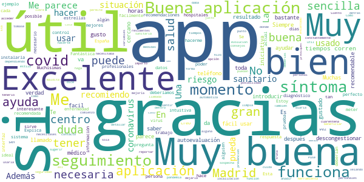

# CoronaMadrid
App version ``1.1.0``

Analyzed with [covid-apps-observer](http://github.com/covid-apps-observer) project, version ``0.1``

## App overview
| | |
|-------------------------|-------------------------| 
| **Name**&nbsp;&nbsp;&nbsp;&nbsp;&nbsp;&nbsp;&nbsp;&nbsp;&nbsp;&nbsp;&nbsp;&nbsp;&nbsp;&nbsp;&nbsp;&nbsp;&nbsp;&nbsp;&nbsp;&nbsp;&nbsp;&nbsp;&nbsp;&nbsp;&nbsp;&nbsp;&nbsp;&nbsp;&nbsp;&nbsp;&nbsp;&nbsp;&nbsp;&nbsp;&nbsp;&nbsp;&nbsp;&nbsp;&nbsp;&nbsp;  | CoronaMadrid |
| **Unique identifier** | org.madrid.CoronaMadrid |
| **Link to Google Play** | [https://play.google.com/store/apps/details?id=org.madrid.CoronaMadrid](https://play.google.com/store/apps/details?id=org.madrid.CoronaMadrid) |
| **Summary**  | Aplicación para la detección y auto-evaluación del Coronavirus, o COVID-19 |
| **Privacy policy** | [https://www.coronamadrid.com/proteccion-de-datos](https://www.coronamadrid.com/proteccion-de-datos) |
| **Latest version** | 1.1.0 |
| **Last update** | 2020-06-25 19:53:43 |
| **Recent changes** | Posibilidad de realizar pruebas a familiares desde el mismo dispositivo |
| **Installs**  | 50.000+ |
| **Category** | Medicina |
| **First release** | 23 mar. 2020 |
| **Size**  | 3,3M |
| **Supported Android version**  | 5.1 y versiones posteriores |

### Description
> La aplicación móvil CoronaMadrid permite a sus usuarios poder detectar, informarse y contactar con las autoridades en cualquier fase de la concepción de la enfermedad COVID-19.
 El virus SARS-CoV-2, también conocido como Coronavirus está en fase de pandemia global y por esta razón nace CoronaMadrid, una aplicación que tiene la misión de ayudar a los ciudadanos a poder detectar si están siendo afectados por la enfermedad y obtener las mejores recomendaciones dependiendo de su estado. En caso de estado grave las autoridades serán conocedoras de la situación y podrán comunicarse directamente con el afectado.

### User interface
The developers of the app provide the following screenshots in the Google play store.
| | | |
|:-------------------------:|:-------------------------:|:-------------------------:|
 |   |   |   | 
 |   |   |   | 
 |   |   |   | 
 |  

## Development team
In the following we report the main information provided by the development team in the Google play store.

| | |
|-------------------------|-------------------------|
| **Developer**  | Comunidad de Madrid |
| **Website**  | [https://coronavirus.comunidad.madrid](https://coronavirus.comunidad.madrid) |
| **Email** | sanidadinforma@salud.madrid.org |
| **Physical address**  | - |
| **Other developed apps**  | [https://play.google.com/store/apps/developer?id=Comunidad+de+Madrid](https://play.google.com/store/apps/developer?id=Comunidad+de+Madrid) |

## Android support

| | |
|-------------------------|-------------------------|
| **Declared target Android version**  | Pie, version 9 (API level 28) |
| **Effective target Android version**  | Pie, version 9 (API level 28) |
| **Minimum supported Android version**  | Jelly Bean, version 4.1.x (API level 16) |
| **Maximum target Android version**  | - |

The larger the difference between the minimum and maximum supported Android versions, the better. A larger difference means a wider audience. For example, old phones have a very low Android version, so a high minimum supported Android version means that the app cannot be used by users with old phones, thus leading to accessibility problems. 

## Requested permissions

In the following we report the complete list of the permissions requested by the app. 

| **Permission** | **Protection level** | **Description** | 
|-------------------------|-------------------------|-------------------------|
 **android.permission ACCESS_COARSE_LOCATION** | :warning:**Dangerous** | Allows an app to access approximate location. 
 **android.permission ACCESS_FINE_LOCATION** | :warning:**Dangerous** | Allows an app to access precise location. 
 **android.permission ACCESS_NETWORK_STATE** | Normal | Allows applications to access information about networks. 
 **android.permission ACCESS_WIFI_STATE** | Normal | Allows applications to access information about Wi-Fi networks. 
 **android.permission INTERNET** | Normal | Allows applications to open network sockets. 
 **com.google.android.c2dm.permission RECEIVE** | - | - 
 **com.google.android.finsky.permission BIND_GET_INSTALL_REFERRER_SERVICE** | - | - 

## Mentioned servers

| **Server** | **Registrant** | **Registrant country** | **Creation date** | 
|-------------------------|-------------------------|-------------------------|-------------------------|
 | android.com | Google LLC | :us: US | 1997-06-23 04:00:00 |
 | googlesyndication.com | Google LLC | :us: US | 2003-01-21 06:17:24 |
 | google.com | Google LLC | :us: US | 1997-09-15 04:00:00 |
 | app-measurement.com | Google LLC | :us: US | 2015-06-19 20:13:31 |
 | facebook.com | Facebook, Inc. | :us: US | 1997-03-29 05:00:00 |
 | pinterest.com | DNStination Inc. | :us: US | 2009-11-26 19:21:23 |
 | twitter.com | Twitter, Inc. | :us: US | 2000-01-21 16:28:17 |
 | googleapis.com | Google LLC | :us: US | 2005-01-25 17:52:26 |
 | googleadservices.com | Google LLC | :us: US | 2003-06-19 16:34:53 |
 | crashlytics.com | Google LLC | :us: US | 2011-01-21 15:30:40 |

## Security analysis 

Below we report the main security warnings raised by our execution of the [Androwarn](https://github.com/maaaaz/androwarn) security analysis tool.

**Telephony identifiers leakage**
> - This application reads the numeric name (MCC+MNC) of current registered operator 
> - This application reads the operator name 
> - This application reads the phone number string for line 1, for example, the MSISDN for a GSM phone 

**Location lookup**
> - This application reads location information from all available providers (WiFi, GPS etc.) 

**Connection interfaces exfiltration**
> - This application reads details about the currently active data network 
> - This application tries to find out if the currently active data network is metered 

**Suspicious connection establishment**
> - This application opens a Socket and connects it to the remote address '' on the 'N/A' port  
> - This application opens a Socket and connects it to the remote address 'Ljava/lang/StringBuilder;->toString()Ljava/lang/String;' on the ': connect, resolve' port  
> - This application opens a Socket and connects it to the remote address 'Ljava/lang/StringBuilder;->toString()Ljava/lang/String;' on the 'N/A' port  
> - This application opens a Socket and connects it to the remote address 'Ljava/net/Proxy;->type()Ljava/net/Proxy$Type;' on the 'N/A' port  
> - This application opens a Socket and connects it to the remote address 'timeout' on the 'N/A' port  

**Pim data leakage**
> - This application accesses the downloads folder 
> - This application accesses data stored in the clipboard 

**Code execution**
> - This application loads a native library 
> - This application loads a native library: 'Ljava/util/Iterator;->next()Ljava/lang/Object;' 
> - This application loads a native library: 'crashlytics' 
> - This application executes a UNIX command containing this argument: '2' 

## User ratings and reviews

Below we provide information about how end users are reacting to the app in terms of ratings and reviews in the Google Play store.

### Ratings

The CoronaMadrid app has been installed by more than **50000** times. At this time, **339** rated the app and its average score is **3.0**. Below we show the distribution of the ratings across the usual star-based rating of Google Play

:star::star::star::star::star:: 118

:star::star::star::star:: 33

:star::star::star:: 37

:star::star:: 27

:star:: 122

### Reviews 

#### 5-star reviews

> Excelente, si hubiese más estrellas os las daba. Puse mis datos y síntomas en la App y me han llamado todos los días para saber como estoy y cómo va mi cuarentena. Esa llamada diaria me hizo sentir menos sola y que le importo a alguien. También sugerir alguna opción dentro de la App dónde se pueda detallar la mejoría o reportar el comienzo del seguimiento del centro de salud para dejarla libre y que otros se puedan beneficiar del sistema. Muchísimas gracias❤️  :date: __2021-06-21 01:52:56__

> App muy útil para los residentes de Madrid!!  :date: __2021-05-27 00:33:27__

> Buena aplicación, muy útil.  :date: __2021-05-16 04:38:48__

> Esta bien porque te dice si tienes posibilidad de tenerlo o no dependiendo de los síntomas  :date: __2021-05-12 11:04:15__

> Muy buena app, fácil de usar y muy útil. La recomiendo.  :date: __2021-05-06 21:06:20__

> Muy útil, todos deberíamos usarla  :date: __2021-03-24 19:24:04__

> Una herramienta sanitaria excelente  :date: __2021-03-03 22:26:30__

> App muy recomendada en este momento de pandemia. Además de poder hacer una autoevaluación en función de tus síntomas, te permite ver consejos y medidas de prevencion, asi como la localización de los hospitales más cercanos si los necesitases. Además sirve de ayuda para descongestionar el sistema sanitario. Como punto a añadir, al introducir los datos personales estaría bien que tomase si eres o no persona de riesgo, y variables del estilo.  :date: __2021-02-23 18:29:57__

> Una interfaz muy limpia. Aplicación intuitiva. Es una buena forma de saber si puedes tener covid-19 o si deberías hacerte una prueba. Estoy encantado con la aplicación!  :date: __2021-02-20 06:00:19__

> Me ha gustado mucho la APP, es justo lo que necesitaba, además es muy fácil de usar.  :date: __2021-02-19 12:37:16__

#### 4-star reviews

> Me ha funcionado muy bien aunque la verificación telefónica fue un engorro.  :date: __2021-06-24 19:00:05__

> No sirve, si no te han detectado el virus, yo no lo tengo y piden fecha q ye lo detectaron  :date: __2021-06-24 16:27:36__

> Si eres de edad avanzada tienes que ir mes a mes lo que se hace aburrido a la hora de tener que poner tu fecha de nacimiento si es antigua. Aún así muy buena app  :date: __2021-06-09 11:27:27__

> No la preciso porque casi no me ralaciono con nadie y estoy vacunado. Pero es una ayuda el tener una app que evalúe mi situación. Gracias.  :date: __2021-06-04 20:00:18__

> App intuitiva fácil de manejar e imprescindible en los tiempos que corren.  :date: __2021-05-20 01:27:36__

> La aplicación es muy útil, permite hacer un auto reconocimiento de los síntomas y así poder determinar si pudieras portar el virus, además es muy bueno que puedas hacérselo a un familiar también y que pongan recomendaciones sobre los cuidados que se deben tener y una ubicación de los centros de salud a los que se pueda acudir en caso de sospechas.  :date: __2021-02-25 18:25:34__

> Funciona correctamente  :date: __2021-02-01 18:58:33__

> Excelente app que cumple con lo indicado. Fácil de navegar por ella con buen diseño y sobretodo una app que te ayuda a controlar tus síntomas de covid. También da información de los hospitales más cercanos según tu ubicación.  :date: __2021-01-10 19:05:33__

> Bien, estaba tranquilo y confiado en las pautas, gracias Javier  :date: __2020-07-04 11:22:48__

> Parece ser que la aplicación es buena pero cuando introduces o intenta introducir tu fecha de nacimiento no lo puede hacer correctamente por lo menos los que han nacido antes del 2007  :date: __2020-07-01 16:59:45__

#### 3-star reviews

> Bastante basica, pero cumple con las expectativas. Facil de utilizar.  :date: __2021-01-04 02:28:20__

> Quizás en marzo resultaba más útil. Ahora no está mal, pero no sirve realmente de mucho sin un sistema de rastreo.  :date: __2020-08-30 08:19:54__

> Deberían actualizar las recomendaciones. Según la aplicación la mascarilla no es obligatoria....  :date: __2020-08-16 16:37:20__

> Debería actualizarse la información relacionada con la obligatoriedad de llevar mascarilla en todos los casos desde el pasado 30 de agosto.  :date: __2020-08-02 14:27:19__

> La fecha de nacimiento debería poder teclearse. Podria dejar incluir resultado de una prueba de Covid.  :date: __2020-07-23 00:49:34__

> Sería más que adecuado, que en la próxima actualización se modificara la recomendación sobre las mascarillas (ya que desde el 21 de mayo su uso es obligatorio en muchos lugares, con independencia de si se tiene o no síntomas). Gracias.  :date: __2020-05-21 12:01:07__

> De qué me atiendan lo pondre  :date: __2020-05-06 13:23:50__

> El contestar Sí o No, no es suficiénte. A veces hay concretar algo  :date: __2020-04-16 21:04:02__

> Insuficiente.Faltan síntomas como dolor de cabeza, mareos,, conjuntivitis , mucha gente lo está pasando sin los síntomas que aparecen en esta App.  :date: __2020-04-16 08:17:52__

> Creo que deberian modificarla para incluir la pregunta: "¿Has sufrido una repentina perdida de olfato?" Segun parece esto se esta mostrando bastante indicativo de posible contagio por coronavirus.  :date: __2020-04-15 08:06:01__

#### 2-star reviews

> Poco práctica  :date: __2021-04-10 20:22:50__

> La app en si no está mal sirve de ayuda, tiene mucho que mejorar,para salir de la app muy mal,y para poner el año un desastre .  :date: __2021-03-08 00:00:11__

> La verdad es que no me extraña que no se descarguen la app, es fatal tener que ingresar la fecha de nacimiento dando para atrás mes a mes (la mía 1954). Tienen que actualizar la forma de ingresarla, con las tecnologías que hay hoy en día es ¡¡¡INCREÍBLE!!!  :date: __2021-02-21 20:26:05__

> Es muy mala, te hace unas preguntas obvias para que puedas pensar que tienes covid. Pero es lo sabido por todos, tienes fiebre, tos, dificultad respiratoria,... Si dices que si, pues puedes tener la enfermedad. Obvio, como decía, lo siento pero no aporta  :date: __2020-11-03 15:51:48__

> Selección de fecha nacimiento muy ineficiente. ¿Búsqueda mes a mes? Revisen la app.  :date: __2020-09-01 08:52:10__

> Que para empezar te pidan fecha de nacimiento y haya que ir mes a mes hasta encontrarla puede desanimar a cualquier persona mayor de 1 año. La aplicacion consiste básicamente en hacerte unas pocas preguntas. Buena iniciativa pero mejorable.  :date: __2020-08-31 20:09:18__

> No la veo ninguna utilidad, pero espero que alguien le valga para algo  :date: __2020-08-05 13:11:10__

> Necesita una mejora para facilitar el rastreo: una simple agenda donde podamos anotar, cada noche ( que notifique), dónde y con quien hemos estado. A falta de una app dedicada con tecnología GPS y Bluetooth, podría ayuda mucho  :date: __2020-07-26 09:34:13__

> Hacer introducir mes a mes la fecha de nacimiento a alguien que haya nacido por ejemplo hace 50 años (no quiero pensar si se está muriendo, o tiene 80 años) me parece una idea maravillosa.  :date: __2020-07-11 20:35:49__

> No se conecta con los servicios de Android de Covid para mandar alertas a los posibles contactos cercanos. Es algo que apenas cuesta y sirve para la trazabilidad de rebrotes... Que en la CCAA de Madrid los hay (aunque pequeños), y no se están trazando por falta de personal cualificado. Por favor Ayuso, aprovéchate de la tecnología que te hace el trabajo y además quedas bien... Si pudiste llevar el Twitter de un perro es lo menos que puedes hacer.  :date: __2020-06-27 17:03:46__

#### 1-star reviews

> Una tontería de aplicación  :date: __2021-06-06 22:09:40__

> La experiencia ha sido desastrosa. Pese a haber introducido la sintomatología, la aplicación me decía que estaba todo en orden y hemos tardado más tiempo en avisar a sanidad para que nos hagan los test. Y en nuestro caso la tos no ha sido seca, sino productiva...  :date: __2021-04-30 09:40:26__

> Imposible introducir la fecha nacimiento escribiendo los datos. Solo sale un desplegable. Hay que ir pasando, nes a mes. ¿Cuántas veces tengo que ir pasando hasta alcanzar mi año de nacimiento de 1943? He desistido de registrarme  :date: __2021-04-14 13:13:52__

> Hasta 10 llamadas al día desde la Consejería de Sanidad para verificar lo que indico en la aplicación y yo agotado de hablar. No agiliza nada administrativo. No le veo utilidad :(  :date: __2021-03-17 10:42:55__

> Para poner fecha nacimiento tengo que recorrer mes a mes desde ahora.  :date: __2021-02-20 11:11:05__

> No me enviaba el código de registro. Después de 55 minutos, me han llegado 4. Al ir a meterlos, no me acepta ninguno y cuando intento pedir uno nuevo, me dice que he superado el máximo de intentos. La desinstalo ahora mismo, porque vaya basura.  :date: __2021-02-15 19:24:26__

> Mal no sirve  :date: __2021-02-06 23:32:08__

> No tiene aviso de zonas confinadas. Entonces no me sirve para nada  :date: __2021-02-03 23:09:26__

> Leo que están retrasando la introducción de Radar Covid por culpa de esta app.  :date: __2021-02-02 13:13:29__

> Desistalarla es lo unico positivo que tiene la APP.  :date: __2021-01-27 13:45:34__

