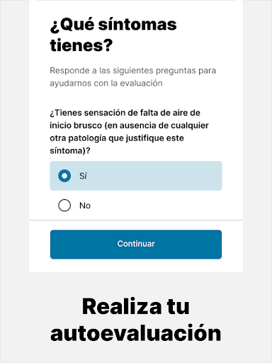
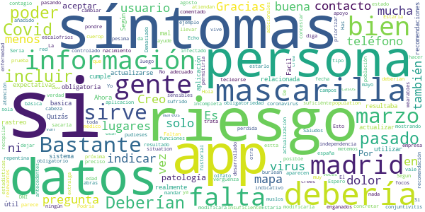

# CoronaMadrid
App version ``1.1.0``

Analyzed with [covid-apps-observer](http://github.com/covid-apps-observer) project, version ``0.1``

## App overview
| | |
|-------------------------|-------------------------| 
| **Name**&nbsp;&nbsp;&nbsp;&nbsp;&nbsp;&nbsp;&nbsp;&nbsp;&nbsp;&nbsp;&nbsp;&nbsp;&nbsp;&nbsp;&nbsp;&nbsp;&nbsp;&nbsp;&nbsp;&nbsp;&nbsp;&nbsp;&nbsp;&nbsp;&nbsp;&nbsp;&nbsp;&nbsp;&nbsp;&nbsp;&nbsp;&nbsp;&nbsp;&nbsp;&nbsp;&nbsp;&nbsp;&nbsp;&nbsp;&nbsp;  | CoronaMadrid |
| **Unique identifier** | org.madrid.CoronaMadrid |
| **Link to Google Play** | [https://play.google.com/store/apps/details?id=org.madrid.CoronaMadrid](https://play.google.com/store/apps/details?id=org.madrid.CoronaMadrid) |
| **Summary**  | Aplicación para la detección y auto-evaluación del Coronavirus, o COVID-19 |
| **Privacy policy** | [https://www.coronamadrid.com/proteccion-de-datos](https://www.coronamadrid.com/proteccion-de-datos) |
| **Latest version** | 1.1.0 |
| **Last update** | 2020-06-25 19:53:43 |
| **Recent changes** | Posibilidad de realizar pruebas a familiares desde el mismo dispositivo |
| **Installs**  | 50.000+ |
| **Category** | Medicina |
| **First release** | 23 mar. 2020 |
| **Size**  | 3,3M |
| **Supported Android version**  | 5.1 y versiones posteriores |

### Description
> La aplicación móvil CoronaMadrid permite a sus usuarios poder detectar, informarse y contactar con las autoridades en cualquier fase de la concepción de la enfermedad COVID-19.
 El virus SARS-CoV-2, también conocido como Coronavirus está en fase de pandemia global y por esta razón nace CoronaMadrid, una aplicación que tiene la misión de ayudar a los ciudadanos a poder detectar si están siendo afectados por la enfermedad y obtener las mejores recomendaciones dependiendo de su estado. En caso de estado grave las autoridades serán conocedoras de la situación y podrán comunicarse directamente con el afectado.

### User interface
The developers of the app provide the following screenshots in the Google play store.
| | | |
|:-------------------------:|:-------------------------:|:-------------------------:|
 |   |   |   | 
 |   |   |   | 
 |   |   |   | 
 |  

## Development team
In the following we report the main information provided by the development team in the Google play store.

| | |
|-------------------------|-------------------------|
| **Developer**  | Comunidad de Madrid |
| **Website**  | [https://coronavirus.comunidad.madrid](https://coronavirus.comunidad.madrid) |
| **Email** | sanidadinforma@salud.madrid.org |
| **Physical address**  | - |
| **Other developed apps**  | [https://play.google.com/store/apps/developer?id=Comunidad+de+Madrid](https://play.google.com/store/apps/developer?id=Comunidad+de+Madrid) |

## Android support

| | |
|-------------------------|-------------------------|
| **Declared target Android version**  | Pie, version 9 (API level 28) |
| **Effective target Android version**  | Pie, version 9 (API level 28) |
| **Minimum supported Android version**  | Jelly Bean, version 4.1.x (API level 16) |
| **Maximum target Android version**  | - |

The larger the difference between the minimum and maximum supported Android versions, the better. A larger difference means a wider audience. For example, old phones have a very low Android version, so a high minimum supported Android version means that the app cannot be used by users with old phones, thus leading to accessibility problems. 

## Requested permissions

In the following we report the complete list of the permissions requested by the app. 

| **Permission** | **Protection level** | **Description** | 
|-------------------------|-------------------------|-------------------------|
 **android.permission ACCESS_COARSE_LOCATION** | :warning:**Dangerous** | Allows an app to access approximate location. 
 **android.permission ACCESS_FINE_LOCATION** | :warning:**Dangerous** | Allows an app to access precise location. 
 **android.permission ACCESS_NETWORK_STATE** | Normal | Allows applications to access information about networks. 
 **android.permission ACCESS_WIFI_STATE** | Normal | Allows applications to access information about Wi-Fi networks. 
 **android.permission INTERNET** | Normal | Allows applications to open network sockets. 
 **com.google.android.c2dm.permission RECEIVE** | - | - 
 **com.google.android.finsky.permission BIND_GET_INSTALL_REFERRER_SERVICE** | - | - 

## Mentioned servers

| **Server** | **Registrant** | **Registrant country** | **Creation date** | 
|-------------------------|-------------------------|-------------------------|-------------------------|
 | android.com | Google LLC | :us: US | 1997-06-23 04:00:00 |
 | googlesyndication.com | Google LLC | :us: US | 2003-01-21 06:17:24 |
 | google.com | Google LLC | :us: US | 1997-09-15 04:00:00 |
 | app-measurement.com | Google LLC | :us: US | 2015-06-19 20:13:31 |
 | facebook.com | Facebook, Inc. | :us: US | 1997-03-29 05:00:00 |
 | pinterest.com | DNStination Inc. | :us: US | 2009-11-26 19:21:23 |
 | twitter.com | Twitter, Inc. | :us: US | 2000-01-21 16:28:17 |
 | googleapis.com | Google LLC | :us: US | 2005-01-25 17:52:26 |
 | googleadservices.com | Google LLC | :us: US | 2003-06-19 16:34:53 |
 | crashlytics.com | Google LLC | :us: US | 2011-01-21 15:30:40 |

## Security analysis 

Below we report the main security warnings raised by our execution of the [Androwarn](https://github.com/maaaaz/androwarn) security analysis tool.

**Telephony identifiers leakage**
> - This application reads the numeric name (MCC+MNC) of current registered operator 
> - This application reads the operator name 
> - This application reads the phone number string for line 1, for example, the MSISDN for a GSM phone 

**Location lookup**
> - This application reads location information from all available providers (WiFi, GPS etc.) 

**Connection interfaces exfiltration**
> - This application reads details about the currently active data network 
> - This application tries to find out if the currently active data network is metered 

**Suspicious connection establishment**
> - This application opens a Socket and connects it to the remote address '' on the 'N/A' port  
> - This application opens a Socket and connects it to the remote address 'Ljava/lang/StringBuilder;->toString()Ljava/lang/String;' on the ': connect, resolve' port  
> - This application opens a Socket and connects it to the remote address 'Ljava/lang/StringBuilder;->toString()Ljava/lang/String;' on the 'N/A' port  
> - This application opens a Socket and connects it to the remote address 'Ljava/net/Proxy;->type()Ljava/net/Proxy$Type;' on the 'N/A' port  
> - This application opens a Socket and connects it to the remote address 'timeout' on the 'N/A' port  

**Pim data leakage**
> - This application accesses the downloads folder 
> - This application accesses data stored in the clipboard 

**Code execution**
> - This application loads a native library 
> - This application loads a native library: 'Ljava/util/Iterator;->next()Ljava/lang/Object;' 
> - This application loads a native library: 'crashlytics' 
> - This application executes a UNIX command containing this argument: '2' 

## User ratings and reviews

Below we provide information about how end users are reacting to the app in terms of ratings and reviews in the Google Play store.

### Ratings

The CoronaMadrid app has been installed by more than **50000** times. At this time, **339** rated the app and its average score is **3.0**. Below we show the distribution of the ratings across the usual star-based rating of Google Play

:star::star::star::star::star:: 118

:star::star::star::star:: 33

:star::star::star:: 37

:star::star:: 27

:star:: 122

### Reviews 

#### 5-star reviews

> Me gustaria hacerme la prueba  :date: __2020-08-28 20:39:45__

> Yo no sé que están valorando aquí porque no es verdad que no puedas cerrar sesión o que no puedas meter fechas o que no puedas localizar centro sanitarios,totalmente falso parece una campaña para fastidiar la app y a los desarrolladores. Toda va perfecto y cada 12 horas puedes volver a evaluar tu salud. Además las recomendaciones son muy buenas respecto al covid-19. App excelente,rápida y facilísima. Gracias  :date: __2020-08-27 09:58:52__

> 5-star para opinar otra copia más Arriba los impuestos saludos suerte cultura y gracias  :date: __2020-08-25 15:59:03__

> Me la acabo de instalar  :date: __2020-08-10 11:40:23__

> Aún no le he usado, pero parece efectiva.  :date: __2020-08-08 18:45:23__

> Muy controlado  :date: __2020-07-24 00:04:41__

> Sencilla de utilizar y muy útil  :date: __2020-07-13 15:36:55__

> Te indica fácilmente si puedes tener coronavirus  :date: __2020-07-13 15:31:42__

> Ha sido muy facil de usar y muy práctica.  :date: __2020-07-08 21:14:07__

> Excelente, buen seguimiento.  :date: __2020-07-01 16:47:36__

#### 4-star reviews

> Bien, estaba tranquilo y confiado en las pautas, gracias Javier  :date: __2020-07-04 11:22:48__

> Parece ser que la aplicación es buena pero cuando introduces o intenta introducir tu fecha de nacimiento no lo puede hacer correctamente por lo menos los que han nacido antes del 2007  :date: __2020-07-01 16:59:45__

> Buena  :date: __2020-07-01 16:28:31__

> Muy util  :date: __2020-06-23 17:50:47__

> Esta bien la aplicación para hacerte autotest de coronavirus pero espero que mejore más está aplicación  :date: __2020-05-29 01:23:56__

> Te va avisando de cuando puedes ir haciéndote el test de las preguntas. Te da pautas a seguir según el resultado que te haya dado  :date: __2020-04-23 17:45:23__

> Buena  :date: __2020-04-13 09:25:49__

> Me ayuda a despejar las dudas  :date: __2020-04-12 14:47:41__

> Buena y tranquilizadora  :date: __2020-04-12 11:18:14__

> Me parece muy bien, pero no es un juicio si no si no, tienen que dejar escribir algo periódicamente, porque puede ser que haya tenido dolor de cabeza 2 días no 15 días. Pero el esfuerzo está bien, entre todos podemos. Aplicación se podía un saludo  :date: __2020-04-09 13:09:58__

#### 3-star reviews

> Quizás en marzo resultaba más útil. Ahora no está mal, pero no sirve realmente de mucho sin un sistema de rastreo.  :date: __2020-08-30 08:19:54__

> Deberían actualizar las recomendaciones. Según la aplicación la mascarilla no es obligatoria....  :date: __2020-08-16 16:37:20__

> Debería actualizarse la información relacionada con la obligatoriedad de llevar mascarilla en todos los casos desde el pasado 30 de agosto.  :date: __2020-08-02 14:27:19__

> La fecha de nacimiento debería poder teclearse. Podria dejar incluir resultado de una prueba de Covid.  :date: __2020-07-23 00:49:34__

> Sería más que adecuado, que en la próxima actualización se modificara la recomendación sobre las mascarillas (ya que desde el 21 de mayo su uso es obligatorio en muchos lugares, con independencia de si se tiene o no síntomas). Gracias.  :date: __2020-05-21 12:01:07__

> De qué me atiendan lo pondre  :date: __2020-05-06 13:23:50__

> El contestar Sí o No, no es suficiénte. A veces hay concretar algo  :date: __2020-04-16 21:04:02__

> Insuficiente.Faltan síntomas como dolor de cabeza, mareos,, conjuntivitis , mucha gente lo está pasando sin los síntomas que aparecen en esta App.  :date: __2020-04-16 08:17:52__

> Creo que deberian modificarla para incluir la pregunta: "쮿as sufrido una repentina perdida de olfato?" Segun parece esto se esta mostrando bastante indicativo de posible contagio por coronavirus.  :date: __2020-04-15 08:06:01__

> Deberían sacarla para toda españa...ni que el virus solo estuviera en madrid. Es buena pero incompleta.  :date: __2020-04-07 09:46:43__

#### 2-star reviews

> Selección de fecha nacimiento muy ineficiente. 쮹칰squeda mes a mes? Revisen la app.  :date: __2020-09-01 08:52:10__

> Que para empezar te pidan fecha de nacimiento y haya que ir mes a mes hasta encontrarla puede desanimar a cualquier persona mayor de 1 año. La aplicacion consiste básicamente en hacerte unas pocas preguntas. Buena iniciativa pero mejorable.  :date: __2020-08-31 20:09:18__

> No la veo ninguna utilidad, pero espero que alguien le valga para algo  :date: __2020-08-05 13:11:10__

> Necesita una mejora para facilitar el rastreo: una simple agenda donde podamos anotar, cada noche ( que notifique), dónde y con quien hemos estado. A falta de una app dedicada con tecnología GPS y Bluetooth, podría ayuda mucho  :date: __2020-07-26 09:34:13__

> Hacer introducir mes a mes la fecha de nacimiento a alguien que haya nacido por ejemplo hace 50 años (no quiero pensar si se está muriendo, o tiene 80 años) me parece una idea maravillosa.  :date: __2020-07-11 20:35:49__

> No se conecta con los servicios de Android de Covid para mandar alertas a los posibles contactos cercanos. Es algo que apenas cuesta y sirve para la trazabilidad de rebrotes... Que en la CCAA de Madrid los hay (aunque pequeños), y no se están trazando por falta de personal cualificado. Por favor Ayuso, aprovéchate de la tecnología que te hace el trabajo y además quedas bien... Si pudiste llevar el Twitter de un perro es lo menos que puedes hacer.  :date: __2020-06-27 17:03:46__

> Lo que te dice lo sabes de antemano  :date: __2020-05-12 16:01:06__

> No vale para mucho, no permite hacer un seguimiento real de la evolución de los síntomas. Muy limitado. Y quienes te llaman ni siquiera son sanitarios a los que se puedan consultarles dudas.  :date: __2020-05-04 22:58:45__

> El día 2/4/20 tuve unas alteraciones en mi salud que me inducen a pensar que tuve Covid19 empece a tomar paracetamol y me fue bajando la fiebre y los escalofríos, a todo esto me dijeron que con los datos que les di no podían evaluar si estaba contagiado. porque no hacen test masivos? a lo mejor lo he tenido de forma leve y he podido estar contagiando sin saberlo.  :date: __2020-05-04 10:59:47__

> Me parece que hacen muy pocas preguntas... Por ejemplo, no está el tema de los sarpullidos y picor en la piel, la diarrea, etc. El covid tiene más síntomas que la tos, fiebre y la falta de aire.  :date: __2020-04-25 23:27:59__

#### 1-star reviews

> Creo que tengo el virus. Y la solución que me dan, es llamar a mi ambulatorio. Para eso una app? Para que te remitan a tu ambulatorio. Lo de siempre. Algún amigo de .... que se está forrando con los resultado para no hacer nada. Y con dinero público. Una vergüenza más de la comunidad de Madrid.  :date: __2020-09-04 11:50:08__

> No entiendo porque necesitan mis datos. No tiene xq ser necesario, la elimino.  :date: __2020-09-03 20:27:45__

> No incluye sintomatología tan variada como lo es la de la Covid-19 y reduce su evaluación a un margen limitado de síntomas y deja de lado síntomas que también pueden repercutir gravemente en la salud de una persona, no te dice nada nuevo a lo que ya has visto en la tv y no tiene coneccion ninguna con los centros de diagnóstico y control de enfermedades.  :date: __2020-09-03 08:21:44__

> En la app se mezclan los datos de varias personas al realizar varios diagnósticos. Luego te llama un operador de la consejería muy desagradable echándote la bronca porque no has grabado bien los datos y diciéndote que para que usas la app si te han hecho pcr(precisamente para eso, para ver si me la tengo que hacer o no) y luego te cuelga. De vergüenza. La app es una mi... Pero la gestión es peor aún.  :date: __2020-09-01 18:34:52__

> 쮼n serio pensáis que una persona de 70 años va a recorrer todos los meses desde el 2020 hasta llegar a su fecha de nacimiento? Usabilidad por los suelos. Utilidad poca. Debería incluir los teléfonos de contacto de los centros de salud según la dirección suministrada. Tambien entre otras cosas es absurdo que pida DNI a menores de edad y no te deje seguir si no lo pones. Y para colmo no está conectada con radar covid. Pues tú dirás  :date: __2020-08-31 12:47:56__

> La autoevaluación genera notificaciones sin parar y genera un efecto contrario al deseado. Lo lógico sería usar sólo Radar COVID  :date: __2020-08-31 09:41:14__

> No vale para nada. No registra los contactos. Solamente da recomendaciones básicas. Para cuando el Radar covid no pierdan en tiempo con esta app. Es inútil en cuanto a detección y prevención y propagación .. un 0. Pena de esfuerzos para nada.. Políticos de pacotilla Radar COVID Ya!!! Hagan algo por todos de una vez...vagos🤔.  :date: __2020-08-30 22:51:49__

> No aporta el nivel de riesgo según mi ubicación Deberíamos tener una única aplicación , que la integren en la aplicación radar covid  :date: __2020-08-29 23:08:55__

> Chapuza, una más.  :date: __2020-08-29 22:45:00__

> No vale para nada, asi nos va, activar radar covid ya.  :date: __2020-08-29 22:39:25__

