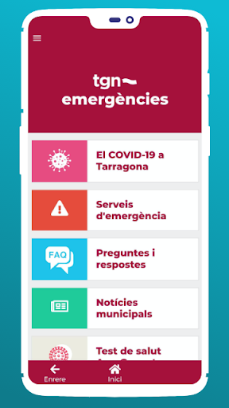
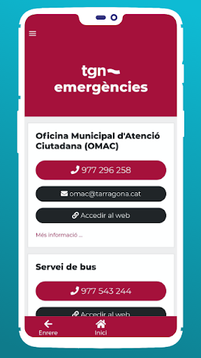
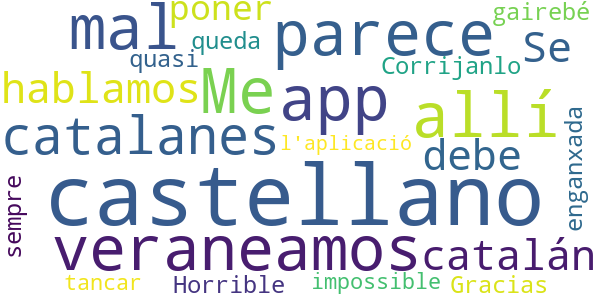

# TGN Emergències
App version ``1.0.6``

Analyzed with [covid-apps-observer](http://github.com/covid-apps-observer) project, version ``0.1``

## App overview
| | |
|-------------------------|-------------------------| 
| **Name**&nbsp;&nbsp;&nbsp;&nbsp;&nbsp;&nbsp;&nbsp;&nbsp;&nbsp;&nbsp;&nbsp;&nbsp;&nbsp;&nbsp;&nbsp;&nbsp;&nbsp;&nbsp;&nbsp;&nbsp;&nbsp;&nbsp;&nbsp;&nbsp;&nbsp;&nbsp;&nbsp;&nbsp;&nbsp;&nbsp;&nbsp;&nbsp;&nbsp;&nbsp;&nbsp;&nbsp;&nbsp;&nbsp;&nbsp;&nbsp;  | TGN Emergències |
| **Unique identifier** | studiogenesis.es.emergenciatarragona |
| **Link to Google Play** | [https://play.google.com/store/apps/details?id=studiogenesis.es.emergenciatarragona](https://play.google.com/store/apps/details?id=studiogenesis.es.emergenciatarragona) |
| **Summary**  | Información sobre los servicios del Ayuntamiento de Tarragona en caso de emerge. |
| **Privacy policy** | [https://emergencia.tarragona.cat/](https://emergencia.tarragona.cat/) |
| **Latest version** | 1.0.6 |
| **Last update** | 2021-01-27 13:28:32 |
| **Recent changes** | Actualización d&#39;información |
| **Installs**  | 5.000+ |
| **Category** | Educación |
| **First release** | 20 mar 2020 |
| **Size**  | 6,8M |
| **Supported Android version**  | 4.1 y versiones posteriores |

### Description
> El Ayuntamiento de Tarragona pone a disposición de las ciudadanas y los ciudadanos una aplicación gratuita que ofrece información actualizada sobre las emergencias en Tarragona y sobre las medidas de seguridad y protección que se deben tomar en cada caso.

### User interface
The developers of the app provide the following screenshots in the Google play store.
| | | |
|:-------------------------:|:-------------------------:|:-------------------------:|
 |   |   |   | 
 |  

## Development team
In the following we report the main information provided by the development team in the Google play store.

| | |
|-------------------------|-------------------------|
| **Developer**  | Ajuntament de Tarragona |
| **Website**  | [https://emergencia.tarragona.cat/](https://emergencia.tarragona.cat/) |
| **Email** | android@tarragona.cat |
| **Physical address**  | - |
| **Other developed apps**  | [https://play.google.com/store/apps/developer?id=Ajuntament+de+Tarragona](https://play.google.com/store/apps/developer?id=Ajuntament+de+Tarragona) |

## Android support

| | |
|-------------------------|-------------------------|
| **Declared target Android version**  | Pie, version 9 (API level 28) |
| **Effective target Android version**  | Pie, version 9 (API level 28) |
| **Minimum supported Android version**  | Jelly Bean, version 4.1.x (API level 16) |
| **Maximum target Android version**  | - |

The larger the difference between the minimum and maximum supported Android versions, the better. A larger difference means a wider audience. For example, old phones have a very low Android version, so a high minimum supported Android version means that the app cannot be used by users with old phones, thus leading to accessibility problems. 

## Requested permissions

In the following we report the complete list of the permissions requested by the app. 

| **Permission** | **Protection level** | **Description** | 
|-------------------------|-------------------------|-------------------------|
 **android.permission ACCESS_NETWORK_STATE** | Normal | Allows applications to access information about networks. 
 **android.permission INTERNET** | Normal | Allows applications to open network sockets. 
 **android.permission WAKE_LOCK** | Normal | Allows using PowerManager WakeLocks to keep processor from sleeping or screen from dimming. 
 **com.google.android.c2dm.permission RECEIVE** | - | - 

## Mentioned servers

| **Server** | **Registrant** | **Registrant country** | **Creation date** | 
|-------------------------|-------------------------|-------------------------|-------------------------|
 | google.com | Google LLC | :us: US | 1997-09-15 04:00:00 |

## Security analysis 

Below we report the main security warnings raised by our execution of the [Androwarn](https://github.com/maaaaz/androwarn) security analysis tool.

**Connection interfaces exfiltration**
> - This application reads details about the currently active data network 

**Pim data leakage**
> - This application accesses data stored in the clipboard 

**Code execution**
> - This application loads a native library: 'flutter' 

## User ratings and reviews

Below we provide information about how end users are reacting to the app in terms of ratings and reviews in the Google Play store.

### Ratings

The TGN Emergències app has been installed by more than **5000** times. At this time, **10** rated the app and its average score is **2.5**. Below we show the distribution of the ratings across the usual star-based rating of Google Play

:star::star::star::star::star:: 3

:star::star::star::star:: 1

:star::star::star:: 0

:star::star:: 0

:star:: 6

### Reviews 

#### 5-star reviews

> Información confiable y actualizada para el uso de las playas, además de la ocupación también informa sobre las condiciones meteorologicas, excelente aplicacion  :date: __2020-07-29 13:32:33__

> Muy buena gracias . Abrazitos  :date: __2020-05-11 19:39:10__

#### 4-star reviews

No recent reviews available with 4 stars.

#### 3-star reviews

No recent reviews available with 3 stars.

#### 2-star reviews

No recent reviews available with 2 stars.

#### 1-star reviews

> Me parece muy mal que esta app no esté en castellano, porque todos los que veraneamos allí no somos catalanes, ni hablamos catalán. Se debe poner en castellano. Corrijanlo. Gracias  :date: __2020-07-10 10:21:48__

> Horrible, es queda enganxada gairebé sempre i es quasi impossible tancar l'aplicació  :date: __2020-03-25 15:33:35__

