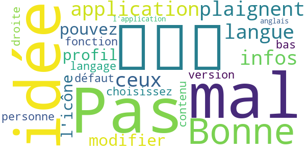
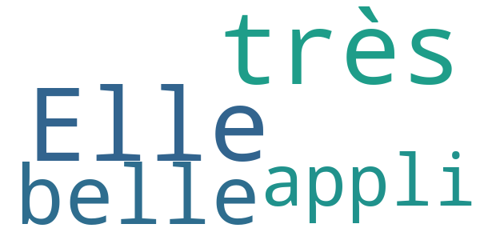

# COVID-related Android apps in France

Author: `Ivano Malavolta` (ivanomalavolta@gmail.com)

Created at: `2020/10/18`

Report generated by the [covid-apps-observer](http://github.com/covid-apps-observer) project, version 0.1

# Table of contents 

- [Background](#background)
    * [Data sources and analyses](#data-sources-and-analyses)
        * [App metadata](#app-metadata)
        * [Requested permissions](#requested-permissions)
        * [Mentioned servers](#mentioned_servers)
        * [Security analysis](#security_analysis)
        * [User ratings and reviews](#user-ratings-and-reviews)
    * [Disclaimer](#disclaimer)
- [WHO Info](#who-info)
- [Minutis Mobile](#minutis-mobile)
- [OpenWHO](#openwho)
- [Covidom Patient](#covidom-patient)
- [COVID AP-HM](#covid-ap-hm)
- [StopCovid France](#stopcovid-france)

- [Credits](#credits)

# How to read this report

This report has been generated by the [covid-apps-observer](http://github.com/covid-apps-observer) project. The project automatically analyzes the apps by extracting information which is already publicly available either on the web or in the apps binary files. 

Our analysis covers the following apps:
| | |
|-------------------------|-------------------------| 
|  | WHO Info
|  | Minutis Mobile
|  | OpenWHO
|  | Covidom Patient
|  | COVID AP-HM
|  | StopCovid France

The details of our analysis are presented in the remainder of this report.

For independent verification, the raw data and the source code of the project is publicly available in its GitHub repository [http://github.com/covid-apps-observer](http://github.com/covid-apps-observer) and its source code has been thoroughly commented in order to provide all the details about how the information provided in this report has been extracted. 

Any feedback, questions, and improvements about the project are very welcome, feel free to create an issue or pull request directly in its GitHub repository: [http://github.com/covid-apps-observer](http://github.com/covid-apps-observer).

## Data sources and analyses

The analysis of each app is structured around five main dimensions: 
* App metadata  
* Requested permissions
* Mentioned servers
* Androwarn analysis
* User ratings and reviews

In the following we describe the data sources and analysis performed for each dimension.

### App metadata

App metadata includes an overview of the main information about the app (for example, its name, releases, privacy policy, etc.), contact information of the development team, and the various Android versions supported by the app. This information is extracted from two main data sources:
* _Google Play store_: we automatically mined the web page of the Google Play store showing the basic information about the app and we parsed it in order to extract information about the app and development team 
* _Android Manifest file_: in our analysis we decompiled the binary file of the app (it is similar to a Zip archive but it contains the code of the app instead of normal files) and we extracted information about the supported Android versions, as it has been listed by its development team.

The extracted app metadata feeds the _App overview_, _Development team_, and _Android support_ sections of this report.
We make use of the [google-play-scraper](https://github.com/JoMingyu/google-play-scraper) tool for extracting the raw data related to this dimension of the project.

### Requested permissions

The Android operating system has a permission model which allows users to grant access to potentially privacy-related information. Every Android app has to explictly declare the permissions it needs to properly function in the Android Manifest file.  

In this report we also show the protection level of each permission, which is a key information for understanding how the requested permissions related to the user's privacy. We carefully analyzed the [official Android documentation (v. 29)](https://developer.android.com/reference/android/Manifest.permission), and it resulted that a permission requested by an Android app can belong to the following protection levels:
* **Dangerous**: higher-risk permissions that would give a requesting app access to private user data or control over the device that can negatively impact the user. Because this type of permission introduces potential risk, the system usually does not automatically grant it to the requesting app. For example, any dangerous permissions requested by an app may be displayed to the user and require confirmation before proceeding.
* **Normal**: this is the default and most common level in Android; normal permissions are lower-risk and give access to isolated app-level features, with minimal risk to other apps, the system, or the user. 
* **Signature**: permissions granted only if the requesting app is signed with the same certificate as the app that declared the permission
* **Appop**: old permission level, a reminiscence of the App Ops tool that Google introduced in Android 4.3.
* **Development**: optional permissions which can be granted to development-oriented apps.
* **Privileged**: permissions who give higher power to mobile apps w.r.t. other apps, such as binding to incoming calls, interacting via bluetooth with other devices without user interaction, etc.
* **Preinstalled**: reserved only for preinstalled apps
* **Installer**: allow the holder to start the permission usage screen for an app
* **RetailDemo**: permissions related to devices used in demonstrations in shops.
* **Pre23**: permissions automatically granted to apps targeting devices running pre-6.0 Android.
* **Upcoming**: permissions which will be released in the next version of the Android platform. 
* **Deprecated**: permissions belonging to old releases of the Android platform, they should not be used by developers since they will not be supported in the near future.
* **Not for use by third-party applications**: permissions which can be requested only by apps developed by Google.
* **Undefined**: this protection level is not documented by Google.

The permissions dimension of this project is based on the [Androguard](https://github.com/androguard/androguard) static analysis tool.

### Mentioned servers

We decompiled each app in order to look for all possible mentions of remote URLs. The mentioned URLs can refer to remote servers the the app is using for either sending or receiving information, web addresses for directing the user to an information website, and so on. 

:warning: It is important to note that this analysis is not meant to be complete and it is very prone to obfuscation. The servers reported here are simply _mentioned_ somewhere in the code of the app and are meant to just give an indication about the "hooks" of the app towards external resources. For example, for an Android app it is normal to contact Google services in order to send/receive push notifications, or to contact the servers of analytics services for having real-time diagnostics about crashes of the app or bugs.

This part of the analysis is based on the [Androguard](https://github.com/androguard/androguard) static analysis tool for identfying the raw URLs mentioned in the app; then, the information about each mentioned server is collected by performing a _whois_ lookup on the first-level domain present in the URL.

### Security analysis

This dimension is based on the [Androwarn](https://github.com/maaaaz/androwarn) structural and data flow analysis of Android bytecode. Androwarn is developed by the University of Lyon/INSA (France) and it has been used in several academic studies. According to its documentation, Androwarn targets the following categories of potential security issues:
* **Telephony identifiers exfiltration**: IMEI, IMSI, MCC, MNC, LAC, CID, operator's name, etc.
* **Device settings exfiltration**: software version, usage statistics, system settings, logs, etc.
* **Geolocation information leakage**: GPS/WiFi geolocation, etc.
* **Connection interfaces information exfiltration**: WiFi credentials, Bluetooth MAC adress, etc.
* **Telephony services abuse**: premium SMS sending, phone call composition, etc.
* **Audio/video flow interception**: call recording, video capture, etc.
* **Remote connection establishment**: socket open call, Bluetooth pairing, APN settings edit, etc.
* **PIM data leakage**: contacts, calendar, SMS, mails, clipboard, etc.
* **External memory operations**: file access on SD card, etc.
* **PIM data modification**: add/delete contacts, calendar events, etc.
* **Arbitrary code execution**: native code using JNI, UNIX command, privilege escalation, etc.
* **Denial of Service**: event notification deactivation, file deletion, process killing, virtual keyboard disable, terminal shutdown/reboot, etc.

Note: We do not consider this data point in the current version of our analyzers since it is too verbose for our purposes.

:warning: It is important to note that Androwarn is a static analysis tool, and as such it performs a variety of heuristics and approximations in its analyses. Said that, the results shown in this report are meant to provide an indication of _potential_ security issues and should be by no means treated as complete and correct.   

### User ratings and reviews

For this dimension we turn again to the web interface of the Google Play store. Firstly, we automatically mine summary statistics about user ratings from the web page of the app under analysis; then, we automatically download the newest 1000 reviews of the app under analysis. For each level of rating (5 stars, 4 stars, , etc., 1 star) we show:
- a word cloud presenting the main terms used by end users in their reviews in the Google Play store
- the last 10 reviews provided by app users in the Google Play store. 

This purposefully simple analysis is meant to help both future users and the development team of the app in understanding what are the main positive and negative points of the app under analysis.

We make use of the [google-play-scraper](https://github.com/JoMingyu/google-play-scraper) tool for extracting the raw data related to this dimension of the project.

## Disclaimer 

This report has been produced independently of any parties and its only objective is to help anybody in better understanding how COVID-related apps work in practice (and compare to each other). The results of this report are limited to the specific version of the software used for running the analyses and on the various heuristics implemented in there. In other words, the results of the analyzers may differ depending on the time and modalities in which they are executed. We do not guarantee that the results of the analyses and the corresponding contents of this report are fully complete or correct. The analysis software is licensed under the [MIT License](https://github.com/iivanoo/covid-apps-observer/blob/master/LICENSE).

# WHO Info
App version ``3.1``

Analyzed with [covid-apps-observer](http://github.com/covid-apps-observer) project, version ``0.1``

## App overview
| | |
|-------------------------|-------------------------| 
| **Name**&nbsp;&nbsp;&nbsp;&nbsp;&nbsp;&nbsp;&nbsp;&nbsp;&nbsp;&nbsp;&nbsp;&nbsp;&nbsp;&nbsp;&nbsp;&nbsp;&nbsp;&nbsp;&nbsp;&nbsp;&nbsp;&nbsp;&nbsp;&nbsp;&nbsp;&nbsp;&nbsp;&nbsp;&nbsp;&nbsp;&nbsp;&nbsp;&nbsp;&nbsp;&nbsp;&nbsp;&nbsp;&nbsp;&nbsp;&nbsp;  | WHO Info |
| **Unique identifier** | org.who.infoapp |
| **Link to Google Play** | [https://play.google.com/store/apps/details?id=org.who.infoapp](https://play.google.com/store/apps/details?id=org.who.infoapp) |
| **Summary**  | L&#39;application d&#39;information officielle de l&#39;Organisation mondiale de la santé. |
| **Privacy policy** | [https://www.who.int/about/who-we-are/privacy-policy](https://www.who.int/about/who-we-are/privacy-policy) |
| **Latest version** | 3.1 |
| **Last update** | 2020-10-15 16:46:21 |
| **Recent changes** | Update for localized Covid-19 reporting per selected edition. |
| **Installs**  | 100 000+ |
| **Category** | Actualités et magazines |
| **First release** | 13 avr. 2020 |
| **Size**  | 11M |
| **Supported Android version**  | 4.2 ou version ultérieure |

### Description
> Have the latest health information at your fingertips with the official World Health Organization Information App. This app displays the latest news, events, features and breaking updates on outbreaks. 
  
 WHO works worldwide to promote health, keep the world safe, and serve the vulnerable. 
 Our goal is to ensure that a billion more people have universal health coverage, to protect a billion more people from health emergencies, and provide a further billion people with better health and well-being.

### User interface
The developers of the app provide the following screenshots in the Google play store.
| | | |
|:-------------------------:|:-------------------------:|:-------------------------:|
 |   |   |   | 
 |   |   |   | 
 |   |   |   | 
 |   |   |   | 
 |   |   |   | 
 |   |   |   | 
 |   |   |   | 
 |   |   |   | 

## Development team
In the following we report the main information provided by the development team in the Google play store.

| | |
|-------------------------|-------------------------|
| **Developer**  | World Health Organization |
| **Website**  | [https://www.who.int/](https://www.who.int/) |
| **Email** | dcx@who.int |
| **Physical address**  | [Avenu Appia 20 1211 Geneva Switzerland](https://www.google.com/maps/search/Avenu%20Appia%2020%201211%20Geneva%20Switzerland) (Google Maps) |
| **Other developed apps**  | [https://play.google.com/store/apps/developer?id=World+Health+Organization](https://play.google.com/store/apps/developer?id=World+Health+Organization) |

## Android support

| | |
|-------------------------|-------------------------|
| **Declared target Android version**  | - |
| **Effective target Android version**  | - |
| **Minimum supported Android version**  | Jelly Bean, version 4.2.x (API level 17) |
| **Maximum target Android version**  | - |

The larger the difference between the minimum and maximum supported Android versions, the better. A larger difference means a wider audience. For example, old phones have a very low Android version, so a high minimum supported Android version means that the app cannot be used by users with old phones, thus leading to accessibility problems. 

## Requested permissions

In the following we report the complete list of the permissions requested by the app. 

| **Permission** | **Protection level** | **Description** | 
|-------------------------|-------------------------|-------------------------|
 **android.permission ACCESS_NETWORK_STATE** | Normal | Allows applications to access information about networks. 
 **android.permission INTERNET** | Normal | Allows applications to open network sockets. 
 **android.permission READ_CALENDAR** | :warning:**Dangerous** | Allows an application to read the user's calendar data. 
 **android.permission READ_EXTERNAL_STORAGE** | :warning:**Dangerous** | Allows an application to read from external storage. 
 **android.permission WAKE_LOCK** | Normal | Allows using PowerManager WakeLocks to keep processor from sleeping or screen from dimming. 
 **android.permission WRITE_CALENDAR** | :warning:**Dangerous** | Allows an application to write the user's calendar data. 
 **android.permission WRITE_EXTERNAL_STORAGE** | :warning:**Dangerous** | Allows an application to write to external storage. 
 **com.google.android.c2dm.permission RECEIVE** | - | - 
 **com.google.android.finsky.permission BIND_GET_INSTALL_REFERRER_SERVICE** | - | - 

## Mentioned servers

| **Server** | **Registrant** | **Registrant country** | **Creation date** | 
|-------------------------|-------------------------|-------------------------|-------------------------|
 | adobe.com | Adobe Inc. | :us: US | 1986-11-17 05:00:00 |
 | googlesyndication.com | Google LLC | :us: US | 2003-01-21 06:17:24 |
 | google.com | Google LLC | :us: US | 1997-09-15 04:00:00 |
 | app-measurement.com | Google LLC | :us: US | 2015-06-19 20:13:31 |
 | googleapis.com | Google LLC | :us: US | 2005-01-25 17:52:26 |
 | googleadservices.com | Google LLC | :us: US | 2003-06-19 16:34:53 |

## Security analysis 

Below we report the main security warnings raised by our execution of the [Androwarn](https://github.com/maaaaz/androwarn) security analysis tool.

**Connection interfaces exfiltration**
> - This application reads details about the currently active data network 
> - This application tries to find out if the currently active data network is metered 

**Suspicious connection establishment**
> - This application opens a Socket and connects it to the remote address 'Lfi/iki/elonen/NanoHTTPD$ResponseException;' on the 'N/A' port  
> - This application opens a Socket and connects it to the remote address 'NanoHttpd Shutdown' on the 'N/A' port  

**Code execution**
> - This application loads a native library: 'NativeScript' 
> - This application executes a UNIX command containing this argument: '2' 

## User ratings and reviews

Below we provide information about how end users are reacting to the app in terms of ratings and reviews in the Google Play store.

### Ratings

The WHO Info app has been installed by more than **100000** times. At this time, **1003** rated the app and its average score is **3.57**. Below we show the distribution of the ratings across the usual star-based rating of Google Play

:star::star::star::star::star:: 532

:star::star::star::star:: 70

:star::star::star:: 100

:star::star:: 40

:star:: 261

### Reviews 

#### 5-star reviews

> Très pratique merci  :date: __2020-10-02 14:25:04__

> J adore et j aime  :date: __2020-09-23 21:59:13__

> Rien à dire très super  :date: __2020-08-28 23:34:43__

> Bonne application donne des informations sur covid 19  :date: __2020-07-23 20:58:40__

> L'application est cool mais il faudra faire pour le français  :date: __2020-07-10 00:12:24__

> bien  :date: __2020-07-07 05:20:29__

> تلفازبيدونيقتيطاع  :date: __2020-06-24 12:05:48__

> ممتاز  :date: __2020-06-17 14:06:27__

> J'aime  :date: __2020-06-14 12:30:05__

> Oui elle peut elle fornit également des actualités  :date: __2020-06-13 12:20:30__

#### 4-star reviews

> Pas mal votre idée  :date: __2020-08-11 14:31:55__

> Bonne application pour les infos, pour ceux qui se plaignent pour la langue vous pouvez modifier dans le profil, l'icône "personne " en bas à droite en fonction de votre version vous choisissez votre langage, par défaut le contenu l'application est en anglais.  :date: __2020-07-13 14:39:13__

#### 3-star reviews

> Elle est une très belle appli  :date: __2020-05-17 05:36:47__

#### 2-star reviews

> ركنا  :date: __2020-06-14 04:12:29__

> Impossible de télécharger l'application  :date: __2020-06-08 19:28:39__

> Les infos devraient être en français  :date: __2020-04-19 19:07:09__

> Je vais ouvrir cet application,après son i nstallation en vain...  :date: __2020-04-17 23:24:24__

#### 1-star reviews

> Pas de version en français.  :date: __2020-07-21 12:19:38__

> Une application pour des francophones DOIT être en français ! Merci  :date: __2020-06-20 13:12:11__

> Nul👎 ou est le français il faudrait peut-être écrire en français😔 pour qu'on puisse comprendre ce qui est écrit ça devient pénible car à chaque fois c'est le même problème 👎😔😔  :date: __2020-06-02 14:38:38__

> L'application autorisée par le dictateur mondial Google.  :date: __2020-05-27 07:43:39__

> Nul 👎👎👎👎  :date: __2020-05-25 20:34:13__

> Ca sevrai etre en francais  :date: __2020-05-01 21:04:21__

# Minutis Mobile
App version ``2.0.3``

Analyzed with [covid-apps-observer](http://github.com/covid-apps-observer) project, version ``0.1``

## App overview
| | |
|-------------------------|-------------------------| 
| **Name**&nbsp;&nbsp;&nbsp;&nbsp;&nbsp;&nbsp;&nbsp;&nbsp;&nbsp;&nbsp;&nbsp;&nbsp;&nbsp;&nbsp;&nbsp;&nbsp;&nbsp;&nbsp;&nbsp;&nbsp;&nbsp;&nbsp;&nbsp;&nbsp;&nbsp;&nbsp;&nbsp;&nbsp;&nbsp;&nbsp;&nbsp;&nbsp;&nbsp;&nbsp;&nbsp;&nbsp;&nbsp;&nbsp;&nbsp;&nbsp;  | Minutis Mobile |
| **Unique identifier** | org.crf.minutis |
| **Link to Google Play** | [https://play.google.com/store/apps/details?id=org.crf.minutis](https://play.google.com/store/apps/details?id=org.crf.minutis) |
| **Summary**  | Pour un meilleur suivi des intervenants en opérations |
| **Privacy policy** | [https://minutis.croix-rouge.fr/cgu](https://minutis.croix-rouge.fr/cgu) |
| **Latest version** | 2.0.3 |
| **Last update** | 2020-04-24 19:45:32 |
| **Recent changes** | Merci d’utiliser Minutis Mobile ! Cette mise à jour apporte des corrections de bugs et optimisations, afin de permettre une meilleure utilisation de l’application sur le terrain. Envie de contribuer ? Vous pouvez nous remonter les bugs rencontrés et suggestions d’améliorations par mail à support.minutis@croix-rouge.fr |
| **Installs**  | 10 000+ |
| **Category** | Outils |
| **First release** | 20 oct. 2018 |
| **Size**  | 10M |
| **Supported Android version**  | 6.0 ou version ultérieure |

### Description
> ATTENTION : Minutis Mobile est à destination des intervenants de la Croix-Rouge et ses partenaires externes engagés sur le terrain d’opérations de secours et d’aide à la population. La connexion à l’application nécessite des identifiants fournis par la Croix-Rouge. Si besoin de plus d’informations, contactez-nous en envoyant un mail à support.minutis@croix-rouge.fr
 En lien permanent avec la solution de gestion des opérations <b>Minutis</b>, l'application mobile Minutis permet un suivi en temps-réel des intervenants engagés sur une opération.
 Chaque intervenant authentifié peut ainsi informer les différents maillons de la chaîne de commandement d'une opération:
 • Sur sa position (grâce à la géolocalisation GPS du téléphone);
 • Sur son statut au cours d'une intervention (sur place, disponible...)
 Ces informations permettent une meilleur coordination des moyens engagés et constituent une aide précieuse à la prise de décision.

### User interface
The developers of the app provide the following screenshots in the Google play store.
| | | |
|:-------------------------:|:-------------------------:|:-------------------------:|
 |   |   |   | 
 |   |   |   | 
 |   |   |   | 
 |   |   |   | 
 |   |   |   | 
 |   |   |   | 

## Development team
In the following we report the main information provided by the development team in the Google play store.

| | |
|-------------------------|-------------------------|
| **Developer**  | Croix-Rouge française |
| **Website**  | [https://minutis.croix-rouge.fr/](https://minutis.croix-rouge.fr/) |
| **Email** | support.minutis@croix-rouge.fr |
| **Physical address**  | - |
| **Other developed apps**  | [https://play.google.com/store/apps/developer?id=Croix-Rouge+fran%C3%A7aise](https://play.google.com/store/apps/developer?id=Croix-Rouge+fran%C3%A7aise) |

## Android support

| | |
|-------------------------|-------------------------|
| **Declared target Android version**  | Pie, version 9 (API level 28) |
| **Effective target Android version**  | Pie, version 9 (API level 28) |
| **Minimum supported Android version**  | Marshmallow, version 6.0 (API level 23) |
| **Maximum target Android version**  | - |

The larger the difference between the minimum and maximum supported Android versions, the better. A larger difference means a wider audience. For example, old phones have a very low Android version, so a high minimum supported Android version means that the app cannot be used by users with old phones, thus leading to accessibility problems. 

## Requested permissions

In the following we report the complete list of the permissions requested by the app. 

| **Permission** | **Protection level** | **Description** | 
|-------------------------|-------------------------|-------------------------|
 **android.permission ACCESS_BACKGROUND_LOCATION** | :warning:**Dangerous** | Allows an app to access location in the background. 
 **android.permission ACCESS_COARSE_LOCATION** | :warning:**Dangerous** | Allows an app to access approximate location. 
 **android.permission ACCESS_FINE_LOCATION** | :warning:**Dangerous** | Allows an app to access precise location. 
 **android.permission ACCESS_LOCATION_EXTRA_COMMANDS** | Normal | Allows an application to access extra location provider commands. 
 **android.permission ACCESS_NETWORK_STATE** | Normal | Allows applications to access information about networks. 
 **android.permission ACTIVITY_RECOGNITION** | :warning:**Dangerous** | Allows an application to recognize physical activity. 
 **android.permission BLUETOOTH** | Normal | Allows applications to connect to paired bluetooth devices. 
 **android.permission CALL_PHONE** | :warning:**Dangerous** | Allows an application to initiate a phone call without going through the Dialer user interface for the user to confirm the call. 
 **android.permission CAMERA** | :warning:**Dangerous** | Required to be able to access the camera device. 
 **android.permission FLASHLIGHT** | - | - 
 **android.permission FOREGROUND_SERVICE** | Normal | Allows a regular application to use Service.startForeground. 
 **android.permission GET_TASKS** | Deprecated | This constant was deprecated in API level 21. No longer enforced. 
 **android.permission INTERNET** | Normal | Allows applications to open network sockets. 
 **android.permission READ_APP_BADGE** | - | - 
 **android.permission RECEIVE_BOOT_COMPLETED** | Normal | Allows an application to receive the Intent.ACTION_BOOT_COMPLETED that is broadcast after the system finishes booting. 
 **android.permission USE_FINGERPRINT** | Normal | This constant was deprecated in API level 28. Applications should request USE_BIOMETRIC instead 
 **android.permission WAKE_LOCK** | Normal | Allows using PowerManager WakeLocks to keep processor from sleeping or screen from dimming. 
 **com.anddoes.launcher.permission UPDATE_COUNT** | - | - 
 **com.google.android.c2dm.permission RECEIVE** | - | - 
 **com.google.android.finsky.permission BIND_GET_INSTALL_REFERRER_SERVICE** | - | - 
 **com.google.android.gms.permission ACTIVITY_RECOGNITION** | - | - 
 **com.google.android.providers.gsf.permission READ_GSERVICES** | - | - 
 **com.htc.launcher.permission READ_SETTINGS** | - | - 
 **com.htc.launcher.permission UPDATE_SHORTCUT** | - | - 
 **com.huawei.android.launcher.permission CHANGE_BADGE** | - | - 
 **com.huawei.android.launcher.permission READ_SETTINGS** | - | - 
 **com.huawei.android.launcher.permission WRITE_SETTINGS** | - | - 
 **com.huawei.permission.external_app_settings USE_COMPONENT** | - | - 
 **com.majeur.launcher.permission UPDATE_BADGE** | - | - 
 **com.oppo.launcher.permission READ_SETTINGS** | - | - 
 **com.oppo.launcher.permission WRITE_SETTINGS** | - | - 
 **com.sec.android.provider.badge.permission READ** | - | - 
 **com.sec.android.provider.badge.permission WRITE** | - | - 
 **com.sonyericsson.home.permission BROADCAST_BADGE** | - | - 
 **com.sonymobile.home.permission PROVIDER_INSERT_BADGE** | - | - 
 **me.everything.badger.permission BADGE_COUNT_READ** | - | - 
 **me.everything.badger.permission BADGE_COUNT_WRITE** | - | - 
 **oppo.permission OPPO_COMPONENT_SAFE** | - | - 

## Mentioned servers

| **Server** | **Registrant** | **Registrant country** | **Creation date** | 
|-------------------------|-------------------------|-------------------------|-------------------------|
 | googlesyndication.com | Google LLC | :us: US | 2003-01-21 06:17:24 |
 | google.com | Google LLC | :us: US | 1997-09-15 04:00:00 |
 | facebook.com | Facebook, Inc. | :us: US | 1997-03-29 05:00:00 |
 | app-measurement.com | Google LLC | :us: US | 2015-06-19 20:13:31 |
 | xml.org | OASIS Open | :us: US | 1997-02-03 05:00:00 |
 | googleapis.com | Google LLC | :us: US | 2005-01-25 17:52:26 |
 | googleadservices.com | Google LLC | :us: US | 2003-06-19 16:34:53 |
 | googleapis.com | Google LLC | :us: US | 2005-01-25 17:52:26 |
 | appspot.com | Google LLC | :us: US | 2005-03-10 02:27:55 |
 | crashlytics.com | Google LLC | :us: US | 2011-01-21 15:30:40 |
 | gstatic.com | Google LLC | :us: US | 2008-02-11 15:31:25 |
 | citymapper.com | REDACTED FOR PRIVACY | GB | 2004-04-08 18:56:04 |
 | here.com | HERE Global B.V. | :netherlands: NL | 1995-06-11 04:00:00 |

## Security analysis 

Below we report the main security warnings raised by our execution of the [Androwarn](https://github.com/maaaaz/androwarn) security analysis tool.

**Telephony identifiers leakage**
> - This application reads the device phone type value 

**Connection interfaces exfiltration**
> - This application reads details about the currently active data network 
> - This application tries to find out if the currently active data network is metered 

**Telephony services abuse**
> - This application makes phone calls 

**Suspicious connection establishment**
> - This application opens a Socket and connects it to the remote address '' on the 'N/A' port  
> - This application opens a Socket and connects it to the remote address 'Ljava/lang/StringBuilder;->toString()Ljava/lang/String;' on the 'N/A' port  
> - This application opens a Socket and connects it to the remote address 'Ljava/net/Proxy;->type()Ljava/net/Proxy$Type;' on the 'N/A' port  
> - This application opens a Socket and connects it to the remote address 'timeout' on the 'N/A' port  

**Pim data leakage**
> - This application accesses data stored in the clipboard 

**Code execution**
> - This application loads a native library: 'crashlytics' 
> - This application loads a native library: 'pbkdf2' 
> - This application executes a UNIX command 

## User ratings and reviews

Below we provide information about how end users are reacting to the app in terms of ratings and reviews in the Google Play store.

### Ratings

The Minutis Mobile app has been installed by more than **10000** times. At this time, **37** rated the app and its average score is **3.9189188**. Below we show the distribution of the ratings across the usual star-based rating of Google Play

:star::star::star::star::star:: 21

:star::star::star::star:: 4

:star::star::star:: 5

:star::star:: 2

:star:: 5

### Reviews 

#### 5-star reviews

> Déconnecté régulièrement obliger de se reconnecter pendant le poste plusieurs fois c'est très gênant  :date: __2020-04-25 17:49:00__

> Très belle appli  :date: __2019-05-02 18:00:33__

> application à très fort potentiel, elle est très utile. en espérant que l'on puisse un jour remplir des fiches d'intervention.  :date: __2019-01-17 00:35:33__

> Super pour localiser les équipages crf  :date: __2018-12-17 14:21:28__

> Je suis bénévole  :date: __2018-10-22 18:54:50__

#### 4-star reviews

> super appli. petit problème lors de l'affichage de ma position. je ne me voyais pas à certains moment. peux être liée à la faible connexion internet? sachant que j'avais la carte bien détaillé et la position gps activée.  :date: __2019-06-01 22:28:00__

#### 3-star reviews

> J'ai téléchargé cette appli dans le but d'aider "médicalement" la population dans un cas d'urgence étant donné que j'ai un diplôme secourisme, hors il faut un identifiant "CROIX ROUGE" je ne sais pas ou en crée un  :date: __2020-04-02 20:19:15__

> Des bugs d'interface, notamment au niveau de la connexion où il est impossible d'entrer dans le textfield avant de cliquer une fois sur se connecter. Belle application sinon.  :date: __2020-02-22 15:03:51__

> Problème ce matin où il n'y avait pas la cartographie :(  :date: __2019-10-20 20:52:34__

#### 2-star reviews

> Comment on fait pour se connecter à l'application quand on a pas de compte  :date: __2020-03-25 20:48:46__

#### 1-star reviews

> Je vous conseille de ne pas installer cette appli!!!!!!  :date: __2020-08-03 23:00:35__

> Quand en ouvre l application on nous demande de se connecter mais moi je n ais pas se compte et il y a pas créé un compte  :date: __2020-04-07 22:28:21__

> L'application ne fonctionne pas du tout elle reste bloquée sur la première page avec le choix de la langue et on ne peut rien faire d'autre.  :date: __2020-03-27 09:51:28__

# OpenWHO
App version ``3.6``

Analyzed with [covid-apps-observer](http://github.com/covid-apps-observer) project, version ``0.1``

## App overview
| | |
|-------------------------|-------------------------| 
| **Name**&nbsp;&nbsp;&nbsp;&nbsp;&nbsp;&nbsp;&nbsp;&nbsp;&nbsp;&nbsp;&nbsp;&nbsp;&nbsp;&nbsp;&nbsp;&nbsp;&nbsp;&nbsp;&nbsp;&nbsp;&nbsp;&nbsp;&nbsp;&nbsp;&nbsp;&nbsp;&nbsp;&nbsp;&nbsp;&nbsp;&nbsp;&nbsp;&nbsp;&nbsp;&nbsp;&nbsp;&nbsp;&nbsp;&nbsp;&nbsp;  | OpenWHO |
| **Unique identifier** | de.xikolo.openwho |
| **Link to Google Play** | [https://play.google.com/store/apps/details?id=de.xikolo.openwho](https://play.google.com/store/apps/details?id=de.xikolo.openwho) |
| **Summary**  | Des connaissances en cas d’Urgences Sanitaires |
| **Privacy policy** | [https://openwho.org/pages/privacy](https://openwho.org/pages/privacy) |
| **Latest version** | 3.6 |
| **Last update** | 2020-10-08 13:10:39 |
| **Recent changes** | - Bug fixes and performance improvements |
| **Installs**  | 1 000 000+ |
| **Category** | Enseignement |
| **First release** | 17 mai 2017 |
| **Size**  | 18M |
| **Supported Android version**  | 5.0 ou version ultérieure |

### Description
> OpenWHO est la plateforme interactive de transmission de connaissance de l’Organisation Mondiale de la Santé (OMS) proposant des cours pour améliorer la réponse aux urgences sanitaires. OpenWHO permet à l’Organisation et à ses partenaires clés de transmettre des connaissances pouvant sauver des vies à un grand nombre d’intervenants de première ligne.
 Avec OpenWHO, vous avez la possibilité d’apprendre à votre rythme. Visionnez les courtes vidéos de cours et testez vos connaissances grâce à des auto-évaluations où et quand vous le désirez. Le forum du cours et l’espace de collaboration vous permet d’être en contact avec d’autres participants et experts du monde entier.
 Conçu en premier lieux pour les travailleurs de la santé, les intervenants de première ligne et les décideurs, l’application est aussi une source d’information destinée à ceux touchés par les flambées épidémiques et les urgences sanitaires, ou encore à ceux qui s’intéressent de manière générale au travail de l’OMS en matière d’urgences sanitaires. 
 L’application présente 6 chaînes : 
 - La chaîne Épidémie aborde la gestion des maladies infectieuses et fournit des informations scientifiques pouvant sauver des vies.
 - La chaîne Prêt à Intervenir permet de préparer le personnel qui s’entraîne en vue d’un déploiement à travailler dans des situations d’épidémies et d’urgences sanitaires.
 - La chaîne Faites dans le Social se concentre sur les interventions fondées sur les sciences sociales et aide à communiquer avec les communautés affectées. 
 - La chaîne Préparation en cas de Pandémies rassemble des cours sur divers aspects de la préparation parmi lesquels la surveillance, les mesures de santé publique et la communication sur les risques pendant une pandémie.
 - La chaîne COVID-19 offre des ressources d’apprentissage relatives à l’épidémie de la coronavirus (COVID-19) destinées aux professionnels de la santé, aux décideurs, et au public dans les 6 langues officielles de l’OMS (arabe, chinois, français, russe et espagnol). 
 - La chaîne COVID-19 Langues Nationales offre les mêmes ressources d’apprentissage que celles disponibles sur la chaîne COVID-19 mais dans des langues nationales, telles que l’indonésien, le japonais et le portugais. 
 Les cours sur OpenWHO sont disponibles dans de nombreuses langues, y compris les 6 langues officielles de l’OMS.
 Téléchargez l’application maintenant, et rejoignez la communauté OpenWHO.
 L’application est développée en partenariat avec l’Institut Hasso Plattner et l’OMS. Le contenu d’apprentissage est entièrement géré par l’OMS.

### User interface
The developers of the app provide the following screenshots in the Google play store.
| | | |
|:-------------------------:|:-------------------------:|:-------------------------:|
 |   |   |   | 
 |   |   |   | 

## Development team
In the following we report the main information provided by the development team in the Google play store.

| | |
|-------------------------|-------------------------|
| **Developer**  | HPI Knowledge Engineering Team |
| **Website**  | [https://openwho.org/](https://openwho.org/) |
| **Email** | openwho-support@hpi.de |
| **Physical address**  | [Prof.-Dr.-Helmert-Str.2-3 14482 Potsdam](https://www.google.com/maps/search/Prof.-Dr.-Helmert-Str.2-3%2014482%20Potsdam) (Google Maps) |
| **Other developed apps**  | [https://play.google.com/store/apps/developer?id=7185448023325736337](https://play.google.com/store/apps/developer?id=7185448023325736337) |

## Android support

| | |
|-------------------------|-------------------------|
| **Declared target Android version**  | - |
| **Effective target Android version**  | - |
| **Minimum supported Android version**  | Lollipop, version 5.0 (API level 21) |
| **Maximum target Android version**  | - |

The larger the difference between the minimum and maximum supported Android versions, the better. A larger difference means a wider audience. For example, old phones have a very low Android version, so a high minimum supported Android version means that the app cannot be used by users with old phones, thus leading to accessibility problems. 

## Requested permissions

In the following we report the complete list of the permissions requested by the app. 

| **Permission** | **Protection level** | **Description** | 
|-------------------------|-------------------------|-------------------------|
 **android.permission ACCESS_NETWORK_STATE** | Normal | Allows applications to access information about networks. 
 **android.permission ACCESS_WIFI_STATE** | Normal | Allows applications to access information about Wi-Fi networks. 
 **android.permission DOWNLOAD_WITHOUT_NOTIFICATION** | - | - 
 **android.permission FOREGROUND_SERVICE** | Normal | Allows a regular application to use Service.startForeground. 
 **android.permission INTERNET** | Normal | Allows applications to open network sockets. 
 **android.permission RECEIVE_BOOT_COMPLETED** | Normal | Allows an application to receive the Intent.ACTION_BOOT_COMPLETED that is broadcast after the system finishes booting. 
 **android.permission WAKE_LOCK** | Normal | Allows using PowerManager WakeLocks to keep processor from sleeping or screen from dimming. 
 **android.permission WRITE_EXTERNAL_STORAGE** | :warning:**Dangerous** | Allows an application to write to external storage. 
 **com.google.android.c2dm.permission RECEIVE** | - | - 
 **com.google.android.finsky.permission BIND_GET_INSTALL_REFERRER_SERVICE** | - | - 

## Mentioned servers

| **Server** | **Registrant** | **Registrant country** | **Creation date** | 
|-------------------------|-------------------------|-------------------------|-------------------------|
 | googlesyndication.com | Google LLC | :us: US | 2003-01-21 06:17:24 |
 | google.com | Google LLC | :us: US | 1997-09-15 04:00:00 |
 | apple.com | Apple Inc. | :us: US | 1987-02-19 05:00:00 |
 | aomedia.org | Contact Privacy Inc. Customer 1243324949 | :canada: CA | 2015-08-24 14:07:31 |
 | dashif.org | VTM Group | :us: US | 2012-04-27 13:02:46 |
 | app-measurement.com | Google LLC | :us: US | 2015-06-19 20:13:31 |
 | w3.org | W3C | :us: US | 1994-07-06 04:00:00 |
 | googleapis.com | Google LLC | :us: US | 2005-01-25 17:52:26 |
 | psdev.de | - | - | - |
 | xmlpull.org | WhoisGuard, Inc. | PA | 2001-11-26 20:33:08 |
 | someurl.com | WhoisGuard, Inc. | PA | 2000-02-08 15:50:35 |
 | crashlytics.com | Google LLC | :us: US | 2011-01-21 15:30:40 |
 | apache.org | The Apache Software Foundation | :us: US | 1995-04-11 04:00:00 |
 | opensource.org | Open Source Initiative | :us: US | 1998-02-11 05:00:00 |
 | creativecommons.org | Creative Commons Corporation | :canada: CA | 2001-01-15 16:51:44 |
 | eclipse.org | Eclipse.org Foundation, Inc. | :canada: CA | 1997-04-14 04:00:00 |
 | gnu.org | Free Software Foundation | :us: US | 1995-11-24 05:00:00 |
 | mozilla.org | Mozilla Corporation | :us: US | 1998-01-24 05:00:00 |
 | googleadservices.com | Google LLC | :us: US | 2003-06-19 16:34:53 |

## Security analysis 

Below we report the main security warnings raised by our execution of the [Androwarn](https://github.com/maaaaz/androwarn) security analysis tool.

**Telephony identifiers leakage**
> - This application reads the ISO country code equivalent of the current registered operator's MCC (Mobile Country Code) 

**Connection interfaces exfiltration**
> - This application reads details about the currently active data network 
> - This application tries to find out if the currently active data network is metered 

**Suspicious connection establishment**
> - This application opens a Socket and connects it to the remote address ' returned no addresses for  ; port is out of range' on the 'N/A' port  
> - This application opens a Socket and connects it to the remote address '' on the 'N/A' port  
> - This application opens a Socket and connects it to the remote address 'Ljava/lang/StringBuilder;->toString()Ljava/lang/String;' on the 'N/A' port  
> - This application opens a Socket and connects it to the remote address 'Ljava/net/Proxy;->type()Ljava/net/Proxy$Type;' on the 'N/A' port  
> - This application opens a Socket and connects it to the remote address 'timeout' on the 'N/A' port  

**Code execution**
> - This application loads a native library 

## User ratings and reviews

Below we provide information about how end users are reacting to the app in terms of ratings and reviews in the Google Play store.

### Ratings

The OpenWHO app has been installed by more than **1000000** times. At this time, **3293** rated the app and its average score is **4.2636366**. Below we show the distribution of the ratings across the usual star-based rating of Google Play

:star::star::star::star::star:: 2297

:star::star::star::star:: 359

:star::star::star:: 169

:star::star:: 149

:star:: 319

### Reviews 

#### 5-star reviews

> Ouverture  :date: __2020-10-15 21:57:46__

> Très spécial WHO  :date: __2020-10-03 01:58:38__

> Super cool  :date: __2020-09-18 15:30:22__

> Je l'aime  :date: __2020-08-29 13:17:38__

> Excellent  :date: __2020-08-24 23:15:20__

> Je suis content de cette application  :date: __2020-08-16 14:08:38__

> Good  :date: __2020-06-02 10:54:02__

> Ce bon  :date: __2020-05-29 05:54:46__

> Meilleurs façons d'apprentissage Merci aux concepteurs  :date: __2020-05-22 15:49:15__

> Très intéressant  :date: __2020-05-20 21:42:01__

#### 4-star reviews

> OK.Bien  :date: __2020-07-02 03:23:46__

> Je ne comprend pas qu'il fait écrit  :date: __2020-04-16 19:36:27__

> Je viens de m'inscrire et commence a suivre des cours, format et contenu très intéressant. Si on pouvait avoir encore plus de contenu en Français ce serait top. L'application crash parfois... A voir...  :date: __2020-04-08 17:22:54__

#### 3-star reviews

> Médecin de carrière  :date: __2020-05-29 23:52:47__

> Pensez pour ceux qui parlent exclusivement en français, les documents sont a l'origine en Anglais c'est vrai mais. Les francophones peuvent aussi, éditer des textes à la rédaction pour ne pas avoir des confusions entre la langue Française et l'Anglais. Bravo aux développeurs.  :date: __2020-03-29 17:13:41__

#### 2-star reviews

> Je regrette de cette application est en anglais.Que feront ceux qui ne comprennent que le français.Donc revoir la langue mais aussi regrouper les maladies sous surveillance afin de mieux informer les utilisateurs de l'application.  :date: __2020-04-15 18:23:39__

> Pas satisfais de mesure de couvre feu et de fermeture de lieu de culte  :date: __2020-04-13 15:42:22__

> كان بإمكانكم ترجمتها بالعربية ومع ذالك ساضع لكم نجمتين  :date: __2020-04-10 11:18:37__

> Serais t'il possible s'ils-vous-plais d'avoir à la page d'accueil en langage Français sans l'avoir en anglais ..?!  :date: __2020-03-27 09:09:48__

#### 1-star reviews

> Bien cool  :date: __2020-04-25 18:22:49__

> 🙏🏼Taiwan🙏🏼  :date: __2020-04-14 05:19:51__

> Maove  :date: __2020-04-10 00:09:19__

> Quel est la fontion de cette aplication S.v.p expliqué nous qui non pas compris ce aplication  :date: __2020-04-09 22:04:23__

> C bon  :date: __2020-04-08 22:23:53__

> L englais c'est pas la seule langue au monde  :date: __2020-04-03 00:29:50__

> Nul  :date: __2020-04-02 22:27:28__

> Application après créé compte ne fonctionnait pas même vérifie par moi.  :date: __2020-04-01 17:31:40__

> كلتب وعلاش محيتو لعبة فيروس كورونا  :date: __2020-04-01 13:56:52__

> Inutile , elle n'est qu'en version anglaise !!!! Pour les autres, tapper votre tete sur le mur !!!!  :date: __2020-03-28 08:53:50__

# Covidom Patient
App version ``1.5.21``

Analyzed with [covid-apps-observer](http://github.com/covid-apps-observer) project, version ``0.1``

## App overview
| | |
|-------------------------|-------------------------| 
| **Name**&nbsp;&nbsp;&nbsp;&nbsp;&nbsp;&nbsp;&nbsp;&nbsp;&nbsp;&nbsp;&nbsp;&nbsp;&nbsp;&nbsp;&nbsp;&nbsp;&nbsp;&nbsp;&nbsp;&nbsp;&nbsp;&nbsp;&nbsp;&nbsp;&nbsp;&nbsp;&nbsp;&nbsp;&nbsp;&nbsp;&nbsp;&nbsp;&nbsp;&nbsp;&nbsp;&nbsp;&nbsp;&nbsp;&nbsp;&nbsp;  | Covidom Patient |
| **Unique identifier** | fr.aphp.covidom |
| **Link to Google Play** | [https://play.google.com/store/apps/details?id=fr.aphp.covidom](https://play.google.com/store/apps/details?id=fr.aphp.covidom) |
| **Summary**  | L’assistant de suivi médical pour les patients porteurs du virus COVID-19 |
| **Privacy policy** | [https://www.covidom.fr/politique-confidentialite](https://www.covidom.fr/politique-confidentialite) |
| **Latest version** | 1.5.21 |
| **Last update** | 2020-05-07 11:24:53 |
| **Recent changes** | Vous pouvez désormais activer votre compte Covidom, à l&#39;aide de votre identifiant et du code d&#39;activation transmis, directement sur l&#39;application Android |
| **Installs**  | 10 000+ |
| **Category** | Médecine |
| **First release** | 10 mars 2020 |
| **Size**  | 4,1M |
| **Supported Android version**  | 4.3 ou version ultérieure |

### Description
> *** La solution COVIDOM n'est pas en libre accès et est UNIQUEMENT disponible pour les patients suivis par des services hospitaliers utilisateurs de la plateforme.*** 
 Covidom est une application qui permet aux patients porteurs du virus COVID-19 de bénéficier d’un suivi à distance (ou télésuivi) quotidien. Il peut répondre à des questionnaires médicaux qui sont analysés en temps réel. De son côté, l’équipe soignante sait comment le patient vit au quotidien et est alertée si le patient a besoin d’une attention plus particulière. En cas de besoin, le personnel soignant prend le relais et rentre en contact directement avec le patient pour lui donner ses consignes.

### User interface
The developers of the app provide the following screenshots in the Google play store.
| | | |
|:-------------------------:|:-------------------------:|:-------------------------:|
 |   |   |   | 

## Development team
In the following we report the main information provided by the development team in the Google play store.

| | |
|-------------------------|-------------------------|
| **Developer**  | Assistance Publique - Hôpitaux de paris (AP-HP) |
| **Website**  | [https://www.covidom.fr](https://www.covidom.fr) |
| **Email** | contact.devmobile@aphp.fr |
| **Physical address**  | [AP-HP / DSI / WIND 33 bd de Picpus 75012 Paris France](https://www.google.com/maps/search/AP-HP%20/%20DSI%20/%20WIND%2033%20bd%20de%20Picpus%2075012%20Paris%20France) (Google Maps) |
| **Other developed apps**  | [https://play.google.com/store/apps/developer?id=Assistance+Publique+-+H%C3%B4pitaux+de+paris+(AP-HP)](https://play.google.com/store/apps/developer?id=Assistance+Publique+-+H%C3%B4pitaux+de+paris+(AP-HP)) |

## Android support

| | |
|-------------------------|-------------------------|
| **Declared target Android version**  | Pie, version 9 (API level 28) |
| **Effective target Android version**  | Pie, version 9 (API level 28) |
| **Minimum supported Android version**  | Jelly Bean, version 4.1.x (API level 16) |
| **Maximum target Android version**  | - |

The larger the difference between the minimum and maximum supported Android versions, the better. A larger difference means a wider audience. For example, old phones have a very low Android version, so a high minimum supported Android version means that the app cannot be used by users with old phones, thus leading to accessibility problems. 

## Requested permissions

In the following we report the complete list of the permissions requested by the app. 

| **Permission** | **Protection level** | **Description** | 
|-------------------------|-------------------------|-------------------------|
 **android.permission ACCESS_NETWORK_STATE** | Normal | Allows applications to access information about networks. 
 **android.permission INTERNET** | Normal | Allows applications to open network sockets. 
 **android.permission READ_EXTERNAL_STORAGE** | :warning:**Dangerous** | Allows an application to read from external storage. 
 **android.permission WAKE_LOCK** | Normal | Allows using PowerManager WakeLocks to keep processor from sleeping or screen from dimming. 
 **android.permission WRITE_EXTERNAL_STORAGE** | :warning:**Dangerous** | Allows an application to write to external storage. 
 **com.google.android.c2dm.permission RECEIVE** | - | - 
 **com.google.android.finsky.permission BIND_GET_INSTALL_REFERRER_SERVICE** | - | - 

## Mentioned servers

| **Server** | **Registrant** | **Registrant country** | **Creation date** | 
|-------------------------|-------------------------|-------------------------|-------------------------|
 | google.com | Google LLC | :us: US | 1997-09-15 04:00:00 |
 | googleadservices.com | Google LLC | :us: US | 2003-06-19 16:34:53 |
 | app-measurement.com | Google LLC | :us: US | 2015-06-19 20:13:31 |
 | googleapis.com | Google LLC | :us: US | 2005-01-25 17:52:26 |
 | googlesyndication.com | Google LLC | :us: US | 2003-01-21 06:17:24 |
 | covidom.fr | Nouveal | - | 2020-03-06 20:03:16 |
 | crashlytics.com | Google LLC | :us: US | 2011-01-21 15:30:40 |
 | googleapis.com | Google LLC | :us: US | 2005-01-25 17:52:26 |
 | e-fitback.com | Nouveal | :fr: FR | 2015-11-16 13:24:32 |

## Security analysis 

Below we report the main security warnings raised by our execution of the [Androwarn](https://github.com/maaaaz/androwarn) security analysis tool.

**Connection interfaces exfiltration**
> - This application reads details about the currently active data network 
> - This application tries to find out if the currently active data network is metered 

**Telephony services abuse**
> - This application makes phone calls 

**Suspicious connection establishment**
> - This application opens a Socket and connects it to the remote address ': ; port is out of range' on the 'N/A' port  
> - This application opens a Socket and connects it to the remote address 'Lf/a;->a(Ljava/lang/String;)Ljava/lang/StringBuilder;' on the 'N/A' port  
> - This application opens a Socket and connects it to the remote address 'Ljava/lang/StringBuilder;->toString()Ljava/lang/String;' on the 'N/A' port  
> - This application opens a Socket and connects it to the remote address 'Ljava/net/Proxy;->type()Ljava/net/Proxy$Type;' on the 'N/A' port  
> - This application opens a Socket and connects it to the remote address 'timeout' on the 'N/A' port  

## User ratings and reviews

Below we provide information about how end users are reacting to the app in terms of ratings and reviews in the Google Play store.

### Ratings

The Covidom Patient app has been installed by more than **10000** times. At this time, **100** rated the app and its average score is **3.17**. Below we show the distribution of the ratings across the usual star-based rating of Google Play

:star::star::star::star::star:: 45

:star::star::star::star:: 7

:star::star::star:: 6

:star::star:: 4

:star:: 38

### Reviews 

#### 5-star reviews

> Cette application m'as énormément été utile  :date: __2020-09-24 17:23:04__

> Je félicite et remercie tout le personnel du covidom . Ils m'ont suivis durant toute cette difficile période ,sans oublier mon médecin traitant . Ils m'ont aidés physiquement et moralement, bravo à vous tous.  :date: __2020-05-26 14:43:58__

> Tres bien  :date: __2020-05-10 22:51:16__

> Super application je remercie sincèrement toute l équipe qui m a suivi et qui m a beaucoup aidé par leur écoute leur gentillesse et leur bonne humeur  :date: __2020-05-08 14:38:35__

> Bonne  :date: __2020-05-02 16:55:43__

> Très pratique il suffit de penser à rentrer le code fourni par son médecin  :date: __2020-04-24 11:44:22__

> Bonne appli, j'ai bien reçu mes identifiants envoyés par le médecin. Le questonnaire quotidien est facile à compléter et c'est rassurant d'être suivi et sous surveillance.  :date: __2020-04-23 14:50:40__

> Je n'ai pu accéder au service que après avoir reçu un code et un identifiant Uns fois connecté c'est facile et ça a l'air de bien marcher Faites attention à vous !  :date: __2020-04-23 12:32:15__

> Un jeu d'enfant avec l'identifiant communiqué par mon medecin. Tres rassurant de se sentir suivi.  :date: __2020-04-23 12:17:18__

> Personnel au top à l écoute et rassurant merci pour tout  :date: __2020-04-21 14:18:36__

#### 4-star reviews

> Super  :date: __2020-10-06 06:51:47__

> C'est trés bien , très bonne initiative Mille mercis encore On vous soutient tous !!!!!!!!  :date: __2020-05-28 00:30:08__

> J'habite en Bretagne Ilya pas la Bretagne  :date: __2020-04-05 20:24:42__

> Bonjour , Une application je me sens en surveillance mais c'est dommage personne vous appelle seulement votre médecin traitant après peut être qu'ils sont débordés avec les autres personnes malades.  :date: __2020-04-03 09:02:14__

> Fonctionne bien quand on s'aperçoit au bout de plusieurs jours que les liens arrivent en courrier indésirable. Quand on est malade c'est difficile d'être réactif  :date: __2020-04-02 20:00:23__

> ! A télécharger seulement si le centre de dépistage a envoyé le code ! ... Et réservé pour nous les covid+. Les autres, ne soyez pas jaloux, votre tour viendra. Seul bémol, 24h00 pour envoyer le code ( soit J+5 post symptômes ) ... et déjà plus de fièvre. Dommage. En attendant je reste chez moi.  :date: __2020-03-26 11:43:51__

#### 3-star reviews

> Très pratique et simple d'utilisation. Mais depuis 16/05 ne peut plus entres mes constante.  :date: __2020-05-17 15:13:38__

> Je reçois des SMS alors que je ne suis pas inclus dans le suivi  :date: __2020-04-08 09:06:01__

> Bonjour je pense que tout le monde devrait pouvoir se connecter à cette application, pour ma part je voudrais savoir si nous avons un moyen pour signaler que j'ai été malade avec en partie les mêmes symptômes en date du 7 mars avec des tempet à plus de 40° et qu'au bout de 1 semaine j'allais mieux, à qui pouvons nous nous retourner, et est ce que mon information peut permettre à faire avancer les recherches?!? Cordialement.  :date: __2020-04-07 22:50:00__

> Très bonne idée d'application, sauf que les questionnaires s'arrêtent a 17h. Alors que ma fièvre augmente très largement le soir, plus de 39 et du coup ça on peut pas le dire.  :date: __2020-03-25 07:42:42__

> Pour arriver à me connecter sur l'application je suis allée sur mon compte AP-HP et j'ai envoyé un mail depuis mon espace pour demander l'activation de mon compte, service très réactif dans l'heure j'ai reçu un SMS avec mon identifiant et un lien de première connexion. Bravo à tous ceux qui œuvrent au quotidien dans la lutte contre le virus. J'espère que mon avis aidera d'autres personnes.  :date: __2020-03-21 21:53:30__

#### 2-star reviews

> Même chose ma date de naissance ne passe pas.Mais déjà au tel une dame de la caisse assurance maladie avait pour moi dans son logiciel 1935 pour ma date de naissance alors que je suis née en 1959...ma fille m a indiquée cas contact en donnant mon tel portable .Elle 24 ans..Si j étais née 1935 je l aurais eue à quel âge? Ça fait peur....bonjour la logistique....  :date: __2020-10-16 10:01:11__

> C'est nul on ne peut pas changer la date ni quoi que ce soit pas pratique  :date: __2020-08-11 02:13:59__

> Je veux  :date: __2020-05-29 16:29:13__

> J'essaie d'inscrire pour le suivi mon père de 78 ans et de l'aider comme je peux avec son téléphone, un identifiant lui a été communiqué à l'oral, mais impossible de procéder à l'activation. C'est très compliqué. Idem , j'ai essayé de lui créer un compte sur l'AP-HP, sans succès. Du coup, je ne sais même pas à qui m'adresser pour demander la redemander le n° d'identification. Dommage...  :date: __2020-04-04 19:45:01__

#### 1-star reviews

> Impossible de me connecter : me demande ma date de naissance pour confirmer et me dit qu'elle ne correspond pas !!!  :date: __2020-10-16 13:42:32__

> Le système est très nul on ne comprend rien c'est horrible  :date: __2020-10-13 09:58:32__

> Dommage, j ai beau mettre ma date de naissance pour activer , on me répond que ce n est pas la bonne. Du coup on est privé de la aide qui devait nous être proposée concernant le covid  :date: __2020-10-09 19:35:30__

> Utilité de l'application ? ...  :date: __2020-09-20 20:35:22__

> Application très mal finie , web et Android. Par un pré-apprenti stagiaire ? Impossible d'ajouter un document PDF, seules les photos sont acceptées. Pas moyen d'enlever un document envoyé par erreur ! Sur la version web, je suis de sexe indéterminé, je ne peux pas corriger. Sur Android, je suis une femme. Depuis quand ? Je suis né avec un zizi il y a un peu plus de 59 ans, je l'ai toujours et n'ai jamais voulu m'en défaire. Merci de corriger.  :date: __2020-09-02 00:04:31__

> J'ai activé mon compte mais je n'arrive pas a faire le questionnaire de suivi. Comment dois-je faire ?  :date: __2020-09-01 00:20:57__

> Aussitôt installée aussitôt desinstallee, ne fonctionne pas avec les codes reçus par SMS, APPLI totalement inutile donc. Pas de temps à perdre àvec un truc qui ne fonctionne pas  :date: __2020-08-25 10:17:58__

> J'ai été en contact avec une personne testée positive, j'ai reçu mes codes, mais à aucun moment il y a la question: avez vous fait le dépistage ? Je l'ai fait je suis négative et je dois remplir le questionnaire comme si j'étais positive... Incohérent !  :date: __2020-08-18 10:48:21__

> Impossible d'avoir une connexion malgré une création d'un comte.  :date: __2020-08-14 13:41:35__

> Plante régulièrement et vous déloggue, nécessité de mettre le mdp a chaque fois, fait double emploi avec les SMS et mails qu'on reçoit... cette app ne sert à rien.  :date: __2020-08-14 12:40:12__

# COVID AP-HM
App version ``1.2.0``

Analyzed with [covid-apps-observer](http://github.com/covid-apps-observer) project, version ``0.1``

## App overview
| | |
|-------------------------|-------------------------| 
| **Name**&nbsp;&nbsp;&nbsp;&nbsp;&nbsp;&nbsp;&nbsp;&nbsp;&nbsp;&nbsp;&nbsp;&nbsp;&nbsp;&nbsp;&nbsp;&nbsp;&nbsp;&nbsp;&nbsp;&nbsp;&nbsp;&nbsp;&nbsp;&nbsp;&nbsp;&nbsp;&nbsp;&nbsp;&nbsp;&nbsp;&nbsp;&nbsp;&nbsp;&nbsp;&nbsp;&nbsp;&nbsp;&nbsp;&nbsp;&nbsp;  | COVID AP-HM |
| **Unique identifier** | com.ambulis.aphm.covid |
| **Link to Google Play** | [https://play.google.com/store/apps/details?id=com.ambulis.aphm.covid](https://play.google.com/store/apps/details?id=com.ambulis.aphm.covid) |
| **Summary**  | Suivi COVID-19 de l&#39;AP-HM |
| **Privacy policy** | [http://domicalis.com/legal/cgu-covid_aphm-android.pdf](http://domicalis.com/legal/cgu-covid_aphm-android.pdf) |
| **Latest version** | 1.2.0 |
| **Last update** | 2020-03-15 02:24:44 |
| **Recent changes** | Corrections de bugs et amélioration des performances. |
| **Installs**  | 10 000+ |
| **Category** | Médecine |
| **First release** | 14 mars 2020 |
| **Size**  | 4,1M |
| **Supported Android version**  | 4.1 ou version ultérieure |

### Description
> *** L'application COVID AP-HM est réservée aux patients suivis par l'AP-HM 
  Assistance Publique - Hôpitaux de Marseille ***
 L’application de l’AP-HM pour visualiser et compléter son suivi COVID-19 directement depuis un mobile pour les personnes confirmées ou co-exposées au coronavirus et dont l'état ne présente pas de danger immédiat.
 RAPPEL - Un numéro vert répond à vos questions sur le Coronavirus COVID-19 en permanence, 24h/24 et 7j/7 : 
 => 0 800 130 000 (appel gratuit) <=
 Solution sécurisée pour garantir la protection des données à caractère personnel, l’application COVID AP-HM repose sur une technologie de l’information et de la communication sans fil au profit des personnes nécessitant un suivi médical après un contact potentiel avec le coronavirus SARS-CoV-2.
 En tant que personnes confirmées ou co-exposées au COVID-19, vous pouvez ainsi mieux appréhender votre suivi en toute autonomie grâce à la prise de constantes, aux conseils et aux formulaires mis au point par les équipes de l’AP-HM .
 COVID AP-HM, c'est :
 - Un outil pour améliorer votre prise en charge en facilitant la communication avec l’établissement
 - Des mesures et un suivi 100% numériques
 - Une interface moderne, rapide et intuitive, facile à prendre en main

### User interface
The developers of the app provide the following screenshots in the Google play store.
| | | |
|:-------------------------:|:-------------------------:|:-------------------------:|
 |   |   |   | 
 |   |   |   | 
 |   |  

## Development team
In the following we report the main information provided by the development team in the Google play store.

| | |
|-------------------------|-------------------------|
| **Developer**  | RADHIUS |
| **Website**  | [http://www.domicalis.com](http://www.domicalis.com) |
| **Email** | contact@domicalis.com |
| **Physical address**  | - |
| **Other developed apps**  | [https://play.google.com/store/apps/developer?id=RADHIUS](https://play.google.com/store/apps/developer?id=RADHIUS) |

## Android support

| | |
|-------------------------|-------------------------|
| **Declared target Android version**  | Pie, version 9 (API level 28) |
| **Effective target Android version**  | Pie, version 9 (API level 28) |
| **Minimum supported Android version**  | Jelly Bean, version 4.1.x (API level 16) |
| **Maximum target Android version**  | - |

The larger the difference between the minimum and maximum supported Android versions, the better. A larger difference means a wider audience. For example, old phones have a very low Android version, so a high minimum supported Android version means that the app cannot be used by users with old phones, thus leading to accessibility problems. 

## Requested permissions

In the following we report the complete list of the permissions requested by the app. 

| **Permission** | **Protection level** | **Description** | 
|-------------------------|-------------------------|-------------------------|
 **android.permission ACCESS_NETWORK_STATE** | Normal | Allows applications to access information about networks. 
 **android.permission INTERNET** | Normal | Allows applications to open network sockets. 
 **android.permission WAKE_LOCK** | Normal | Allows using PowerManager WakeLocks to keep processor from sleeping or screen from dimming. 
 **android.permission WRITE_EXTERNAL_STORAGE** | :warning:**Dangerous** | Allows an application to write to external storage. 
 **com.google.android.c2dm.permission RECEIVE** | - | - 
 **com.google.android.finsky.permission BIND_GET_INSTALL_REFERRER_SERVICE** | - | - 
 **com.google.android.providers.gsf.permission READ_GSERVICES** | - | - 

## Mentioned servers

| **Server** | **Registrant** | **Registrant country** | **Creation date** | 
|-------------------------|-------------------------|-------------------------|-------------------------|
 | google.com | Google LLC | :us: US | 1997-09-15 04:00:00 |
 | app-measurement.com | Google LLC | :us: US | 2015-06-19 20:13:31 |
 | googlesyndication.com | Google LLC | :us: US | 2003-01-21 06:17:24 |
 | googleapis.com | Google LLC | :us: US | 2005-01-25 17:52:26 |

## Security analysis 

Below we report the main security warnings raised by our execution of the [Androwarn](https://github.com/maaaaz/androwarn) security analysis tool.

**Connection interfaces exfiltration**
> - This application reads details about the currently active data network 
> - This application tries to find out if the currently active data network is metered 

**Telephony services abuse**
> - This application makes phone calls 

## User ratings and reviews

Below we provide information about how end users are reacting to the app in terms of ratings and reviews in the Google Play store.

### Ratings

The COVID AP-HM app has been installed by more than **10000** times. At this time, **23** rated the app and its average score is **3.2173913**. Below we show the distribution of the ratings across the usual star-based rating of Google Play

:star::star::star::star::star:: 11

:star::star::star::star:: 0

:star::star::star:: 3

:star::star:: 1

:star:: 8

### Reviews 

#### 5-star reviews

> Très bien  :date: __2020-07-28 11:28:23__

> Troger noel  :date: __2020-07-05 14:03:49__

> dd  :date: __2020-05-09 21:36:25__

> Très bien  :date: __2020-04-10 20:58:40__

#### 4-star reviews

> Les gens n'ont pas compris que cette application ne sert qu'au suivi des patients de l'APHM. Si vous ne savez pas ce que c'est c'est que vous n'êtes pas concerné par cette application.  :date: __2020-09-21 22:23:01__

> OOOOoooo i'm A cArOtTe  :date: __2020-09-10 14:14:34__

#### 3-star reviews

> C'est Bon  :date: __2020-06-02 14:26:24__

> À voir  :date: __2020-04-05 23:13:29__

#### 2-star reviews

> Pareil que l'autre  :date: __2020-08-11 02:14:19__

> Tres nul pour le chargement  :date: __2020-05-25 20:36:22__

#### 1-star reviews

> C'est que des quons .ils veulent toute les infos même le compte banquere pour remplire les poches de macron .  :date: __2020-07-19 10:47:24__

> rien ne marche . pas adapté à mon appareil. On me demande un numéro de dossier sans explication derrière...? Bref c'est nul  :date: __2020-06-02 22:14:05__

> J'ai pas de numéro de dossier?  :date: __2020-06-02 16:38:05__

> Trop nnuuulll il seire à rien il fait sa pour tuer les personnes trop nul je vous le déconseille de téléchargé l'application qui d'accord avec 🙂il et trop nul👎🏻👎🏻  :date: __2020-05-31 11:45:24__

> Ou se trouve le numéro de dossier ?  :date: __2020-05-31 08:00:02__

> Bonjour, vous pouvez m expliquer quelle est le numéro de dossier svp  :date: __2020-05-28 17:58:01__

> Zéro cela ne vaut absolument rien aucunes confiances cest juste du blabla et prendre le peuple pour des naifs sa ne vaut rien car rien nest fiable juste un gadget ni plus ,ni moins et comme dautres sites bidon okay d'accord  :date: __2020-05-26 23:10:02__

> Il n'y a même pas qq mots la présentant!!! 2 ou 3 phrases ne seraint pas superflues! But ? Moyens utilisés ? Opensource ? Un minimum pour un app santé et sécurité amha!  :date: __2020-05-26 11:26:44__

> Tres nul nul  :date: __2020-04-30 20:06:11__

> Nul  :date: __2020-04-16 20:04:52__

# StopCovid France
App version ``1.1.4``

Analyzed with [covid-apps-observer](http://github.com/covid-apps-observer) project, version ``0.1``

## App overview
| | |
|-------------------------|-------------------------| 
| **Name**&nbsp;&nbsp;&nbsp;&nbsp;&nbsp;&nbsp;&nbsp;&nbsp;&nbsp;&nbsp;&nbsp;&nbsp;&nbsp;&nbsp;&nbsp;&nbsp;&nbsp;&nbsp;&nbsp;&nbsp;&nbsp;&nbsp;&nbsp;&nbsp;&nbsp;&nbsp;&nbsp;&nbsp;&nbsp;&nbsp;&nbsp;&nbsp;&nbsp;&nbsp;&nbsp;&nbsp;&nbsp;&nbsp;&nbsp;&nbsp;  | StopCovid France |
| **Unique identifier** | fr.gouv.android.stopcovid |
| **Link to Google Play** | [https://play.google.com/store/apps/details?id=fr.gouv.android.stopcovid](https://play.google.com/store/apps/details?id=fr.gouv.android.stopcovid) |
| **Summary**  | Protégeons nos proches, protégeons-nous et protégeons les autres |
| **Privacy policy** | [https://bonjour.stopcovid.gouv.fr/privacy.html](https://bonjour.stopcovid.gouv.fr/privacy.html) |
| **Latest version** | 1.1.4 |
| **Last update** | 2020-09-15 15:47:01 |
| **Recent changes** | Améliorations et corrections. |
| **Installs**  | 1 000 000+ |
| **Category** | Médecine |
| **First release** | 29 mai 2020 |
| **Size**  | 20M |
| **Supported Android version**  | 5.0 ou version ultérieure |

### Description
> L'application StopCovid est destinée au territoire français.
 Avec StopCovid, participez à la protection de vos proches, de vous-même et de tous en étant alerté si vous avez été à proximité d’un utilisateur testé positif.
 Protégeons nos proches, protégeons-nous et protégeons les autres. 
 StopCovid, c’est simple :
 # J'active l'application
 En utilisant le Bluetooth de votre téléphone, StopCovid détecte les téléphones des autres utilisateurs qui restent à proximité du vôtre.
 # Je reste informé
 Vous serez informé si vous avez été à proximité d’un utilisateur testé positif au COVID-19.
 # Je protège mes proches et les autres
 Si vous effectuez un test COVID-19 et qu’il est positif, votre laboratoire vous donnera un code à scanner ou à saisir pour avertir anonymement les utilisateurs que vous avez rencontrés.
 #  Mes données sont protégées
 L’application n’utilise à aucun moment la localisation des personnes, et il est impossible de connaître l’identité des utilisateurs.
 Cette application de suivi de chaîne de transmission de la Covid-19 a été réalisée par l'équipe StopCovid, sous la supervision du Ministère des Solidarités et de la Santé et du Secrétariat d'Etat chargé du Numérique.

### User interface
The developers of the app provide the following screenshots in the Google play store.
| | | |
|:-------------------------:|:-------------------------:|:-------------------------:|
 |   |   |   | 
 |   |   |   | 

## Development team
In the following we report the main information provided by the development team in the Google play store.

| | |
|-------------------------|-------------------------|
| **Developer**  | Gouvernement |
| **Website**  | [https://stopcovid.gouv.fr](https://stopcovid.gouv.fr) |
| **Email** | contact@stopcovid.gouv.fr |
| **Physical address**  | [20 avenue de Ségur 75007 Paris](https://www.google.com/maps/search/20%20avenue%20de%20Ségur%2075007%20Paris) (Google Maps) |
| **Other developed apps**  | [https://play.google.com/store/apps/developer?id=Gouvernement](https://play.google.com/store/apps/developer?id=Gouvernement) |

## Android support

| | |
|-------------------------|-------------------------|
| **Declared target Android version**  | Android10, version 10 (API level 29) |
| **Effective target Android version**  | Android10, version 10 (API level 29) |
| **Minimum supported Android version**  | Lollipop, version 5.0 (API level 21) |
| **Maximum target Android version**  | - |

The larger the difference between the minimum and maximum supported Android versions, the better. A larger difference means a wider audience. For example, old phones have a very low Android version, so a high minimum supported Android version means that the app cannot be used by users with old phones, thus leading to accessibility problems. 

## Requested permissions

In the following we report the complete list of the permissions requested by the app. 

| **Permission** | **Protection level** | **Description** | 
|-------------------------|-------------------------|-------------------------|
 **android.permission ACCESS_COARSE_LOCATION** | :warning:**Dangerous** | Allows an app to access approximate location. 
 **android.permission ACCESS_FINE_LOCATION** | :warning:**Dangerous** | Allows an app to access precise location. 
 **android.permission ACCESS_NETWORK_STATE** | Normal | Allows applications to access information about networks. 
 **android.permission BLUETOOTH** | Normal | Allows applications to connect to paired bluetooth devices. 
 **android.permission BLUETOOTH_ADMIN** | Normal | Allows applications to discover and pair bluetooth devices. 
 **android.permission CAMERA** | :warning:**Dangerous** | Required to be able to access the camera device. 
 **android.permission FOREGROUND_SERVICE** | Normal | Allows a regular application to use Service.startForeground. 
 **android.permission INTERNET** | Normal | Allows applications to open network sockets. 
 **android.permission RECEIVE_BOOT_COMPLETED** | Normal | Allows an application to receive the Intent.ACTION_BOOT_COMPLETED that is broadcast after the system finishes booting. 
 **android.permission REQUEST_IGNORE_BATTERY_OPTIMIZATIONS** | Normal | Permission an application must hold in order to use Settings.ACTION_REQUEST_IGNORE_BATTERY_OPTIMIZATIONS. 
 **android.permission WAKE_LOCK** | Normal | Allows using PowerManager WakeLocks to keep processor from sleeping or screen from dimming. 

## Mentioned servers

| **Server** | **Registrant** | **Registrant country** | **Creation date** | 
|-------------------------|-------------------------|-------------------------|-------------------------|
 | stopcovid.gouv.fr | Etat francais represente par le Ministere de l Economie et des Finances de l Action et des Comptes publics | - | 2020-04-15 12:02:42 |

## Security analysis 

Below we report the main security warnings raised by our execution of the [Androwarn](https://github.com/maaaaz/androwarn) security analysis tool.

**Connection interfaces exfiltration**
> - This application reads details about the currently active data network 
> - This application tries to find out if the currently active data network is metered 

**Telephony services abuse**
> - This application makes phone calls 

**Suspicious connection establishment**
> - This application opens a Socket and connects it to the remote address '; port is out of range' on the 'N/A' port  
> - This application opens a Socket and connects it to the remote address 'Lcom/android/tools/r8/GeneratedOutlineSupport;->outline18(Ljava/lang/String;)Ljava/lang/StringBuilder;' on the 'N/A' port  
> - This application opens a Socket and connects it to the remote address 'Ljava/net/Proxy;->type()Ljava/net/Proxy$Type;' on the 'N/A' port  
> - This application opens a Socket and connects it to the remote address 'Only InetSocketAddress is supported.' on the 'N/A' port  
> - This application opens a Socket and connects it to the remote address 'Wrapped socket should already be bound' on the 'N/A' port  
> - This application opens a Socket and connects it to the remote address 'Wrapped socket should already be connected' on the 'N/A' port  
> - This application opens a Socket and connects it to the remote address 'timeout' on the 'N/A' port  

## User ratings and reviews

Below we provide information about how end users are reacting to the app in terms of ratings and reviews in the Google Play store.

### Ratings

The StopCovid France app has been installed by more than **1000000** times. At this time, **9728** rated the app and its average score is **2.7793815**. Below we show the distribution of the ratings across the usual star-based rating of Google Play

:star::star::star::star::star:: 2999

:star::star::star::star:: 832

:star::star::star:: 842

:star::star:: 1133

:star:: 3922

### Reviews 

#### 5-star reviews

> De la vraie daube façon Macron  :date: __2020-10-17 22:08:06__

> Rien à signaler, c'est gratuit, ça peut sauver des vies. Pourquoi s'en priver ?  :date: __2020-10-16 01:17:27__

> Top de mon côté ça ne plantes pas  :date: __2020-10-15 12:55:04__

> Très bien  :date: __2020-10-15 07:32:12__

> Excellente idée d'appli ! Continuez vos efforts  :date: __2020-10-14 21:35:20__

> Installée, opérationnelle. Acte citoyen : check !  :date: __2020-10-14 20:48:43__

> Top j'ai vraiment aimer ce jeux de tir rpg qui s'appelle fortnite 😐  :date: __2020-10-14 20:35:09__

> Pour que ça fonctionne il aurait fallu qu'il y ai des pubs sur internet et surtout à la TV pour l'appli  :date: __2020-10-14 20:34:52__

> Merci au gouvernement de mettre en place des moyens d'actions  :date: __2020-10-14 20:33:39__

> Grosse amélioration sur cette version (1.1.4#48) : J'avais tenté par 2 fois l'installation depuis sa sortie, mais l'appli était inutilisable : il fallait la réactiver sans arrêt... Lorsque l'on se rend compte après une balade que l'appli a planté, on se dit que l'intérêt est limité. Bref, une horreur qui ne valait même pas son étoile. Cela ne semble plus être la cas. Enfin! L'appli est réinstallée depuis 1 semaine. Elle fait le job en ce qui me concerne. (Je me méfie quand même)  :date: __2020-10-14 19:51:59__

#### 4-star reviews

> Appli pour avertir si on est atteint de l'épidémie  :date: __2020-10-15 17:53:52__

> Dans la prochaine version, il serait bien de pouvoir programmer à l'avance l'activation parce que parfois on oublie au moment même. Je m'en sers mais souvent je le désactive pour économiser la batterie.  :date: __2020-10-15 09:17:56__

> Utile  :date: __2020-10-14 20:36:00__

> Ça fait ce qu'on lui demande  :date: __2020-10-14 13:25:36__

> L'application s'arrête régulièrement toute seule au bout de qq semaines, il faut alors y penser pour la relancer lorsque sa notification de présence disparait  :date: __2020-10-13 06:50:37__

> L'appli utilise pas mal de batterie, c'est dommage. Mais contrairement aux autres avis que j'ai pu lire, je n'ai aucun problème d'arrêt inopinée de l'application. J'utilise un Samsung S7.  :date: __2020-10-12 11:24:07__

> Simple et tellement utile qu'elle devrait etre obligatoire !. Mais elle refuse de s'ouvrir regulierement: je suis obligee de la desinstaller puis de la reinstaller...  :date: __2020-10-10 07:51:35__

> Apparemment la mise à jour du 15 09 2020 a désactivé l'application ! Que ce soit un bug ou un choix volontaire, c'est scandaleux s'agissant de santé publique. Combien de personnes se sont rendu compte à ce jour qu'elles ont une application supposée les protéger qui est désactivée à leur insu ? Pas étonnant que peu de gens l'utilisent...  :date: __2020-10-06 14:29:53__

> Bonjour, Je retrouve parfois l'application arrêtée ou "désactivée". Ill suffit de la réactiver, mais combien de temps a été perdu ? Il semble que cela soit arrivé après sortie du mode avion. J'espère aussi que la désactivation ne fait pas perdre l'historique des deux dernières semaines, sinon, tout cela devient assez inutile. Et cette interrogation n'aide pas à avoir confiance. Il manque drastiquement un affichage statistique, par exemple un histogramme du nombre de contacts par jour. Merci  :date: __2020-10-04 15:39:17__

> Je peux enfin l'activer..... Elle n'était même pas opérationnelle à son lancement.... Mieux vaut tard que jamais.  :date: __2020-10-03 09:50:53__

#### 3-star reviews

> Il manque une notification à chaque fois qu'on quitte notre domicile par ex pour penser à la lancer  :date: __2020-10-15 09:10:59__

> Ma batterie meirt trop vite avec l appli malheureusement (15min -60%)  :date: __2020-10-14 21:24:52__

> Ce qui serait plus simple serait de généralisé dans chaque établissement, restaurants etc... Un flash code contenant les coordonnées de l'établissement dans lequel on se trouve. Ces flash code pourrait être apposé sur un coin de table ou de comptoir ou à l'entrée pour des tabacs et chaque client pourrait d'un geste flasher celui-ci afin de déclarer sa position ainsi que l'heure et la date etc.... Merci aux devs pour votre Taf... Nous battrons ensemble ce microbe.  :date: __2020-10-14 20:48:19__

> Pendant la configuration de l'application celle-ci est passée en anglais au moment où les gestes sanitaires sont expliqués. Depuis impossible de la repasser en français. Une idée de comment faire ?  :date: __2020-10-14 20:46:34__

> Mais pourquoi ne pas avoir utilisé l'API de traçage de Google & Apple comme dans les autres pays de l'UE ? Leur devise : Pourquoi faire simple quand on peut faire compliqué.  :date: __2020-10-12 22:10:52__

> J'ai installé cette application il y a plusieurs semaines et je me rends compte seulement aujourd'hui qu'elle n'était pas activée. Sur mon smartphone, un One+ 5T sous Android 10, le bouton d'aide pour l'activation ne renvoie pas vers le bon menu. Il faut aller dans paramètres > bluetooth > re-clicker sur bluetooth même si celui-ci est activé > activer option : "visible par appareils bluetooth à proximité"  :date: __2020-10-12 20:26:18__

> Je viens de l'installer sans aucun problème, mais je reçois des alertes fréquentes ( toutes les 2~3 min ) lorsque j'utilise mon smartphone pour me dire que StopCovid est activé, j'avoue c'est un peu usant à force. Y a t- il moyen de supprimer cette notification ? Mise à jour avis le 11/10/2020 Le défaut des alertes fréquentes avait été résolu, en revanche ces derniers jours il était impossible d'activer l 'appli. Le bouton était grisé. J'ai du désintaller puis réinstaller l'appli.  :date: __2020-10-11 09:14:23__

> De nouveau après MAJ 1.1.4 du 15/09 .. Se désactive seule en permanence malgré toutes les autorisations voulues. Version précédente le problème était déjà présent. Et version encore précédente le problème était résolu.. Le tout sur le même téléphone et installé depuis la première version dispo.  :date: __2020-10-10 22:34:56__

> Bizarre, l'application s'arrête sans crier gare, depuis plusieurs mois ce genre de Blague arrive régulièrement. Et là cette semaine, c'est le pompon : elle ne démarre plus du tout. J'ai du désinstaller puis réinstaller, je me demande si cette application est franchement utile...  :date: __2020-10-10 19:17:59__

> Je voulais savoir si l application fonctionne bien pour qu'il détecte si il y a une personne a le virus covid 19  :date: __2020-10-10 16:20:24__

#### 2-star reviews

> Après des soucis de désactivation lors de mon 1er essai, nouvel essai 1h le temps d'un passage en ville. Impossible d'activer le bluetooth demandé par l'app, ok après avoir redémarré le téléphone. Batterie vidée en 5-6h dans ma poche alors que j'avais désactivé le suivi en rentrant. Je venais de le charger et j'ai habituellement 2 jours d'autonomie... Impossible de rallumer le bluetooth j'ai encore dû redémarrer le téléphone. Bref, des anomalies trop handicapantes, désinstallation.  :date: __2020-10-18 01:16:48__

> Personne de mes connaissances l'a téléchargé  :date: __2020-10-16 13:07:30__

> Ca mange toute la batterie  :date: __2020-10-16 10:26:47__

> Incompatibilité avec le système Google sur les téléphones Google Pixel 4a. Que fait l'état ?  :date: __2020-10-14 15:22:48__

> L'application Stop Covid se désactive toute seule... Quel intérêt ?  :date: __2020-10-14 11:25:00__

> L'application n'est jamais active, je suis obligé de vérifier si elle est activée. Un icône est affiché en permanence sur l'écran de mon téléphone. Ce fonctionnement n'est pas très clair ...  :date: __2020-10-14 08:37:50__

> Bluetooth obligatoire trop gourmand en énergie  :date: __2020-10-14 00:07:31__

> Se désactive sans arrêt et sans raison apparente  :date: __2020-10-12 23:25:17__

> Des que le téléphone est en mode avion l application doit être réactivée à l allumage du portable. C'est vraiment dommage.  :date: __2020-10-12 20:11:21__

> Après un fonctionnement erratique les premiers jours avec des désactivations sans raison évidente et plantages lors de la réactivation, l'application semble plus stable. Manque une alerte plus claire lorsqu'elle est désactivée : je m'aperçois régulièrement qu'elle n'est plus activée, sans savoir depuis combien de temps (remplacer la notification d'activation par une une notification de désactivation ?). Et comment ça se passe en avion, où le Bluetooth est censé être désactivé ?  :date: __2020-10-12 17:00:41__

#### 1-star reviews

> Nul elle ne sert à rien car inefficace  :date: __2020-10-17 23:31:36__

> Extrêmement nul. Je veux être payer si j'utilise cette application  :date: __2020-10-17 23:09:01__

> La cpam ne vous donne même pas les elts pour vous déclarer dans stop covid quand vous êtes testés positif. A quoi sert donc cette application ?  :date: __2020-10-17 20:54:14__

> Trop nul elle ne fonctionne pas  :date: __2020-10-17 16:55:44__

> Bon, j'etais super motivé, mais il plante mon téléphone. Bref, ça marche pas. Je j'essaierai à nouveau plus tard.  :date: __2020-10-17 10:04:11__

> Inutile. J'ai eu le covid. Impossible de me déclarer sur l'application car il faut y saisir un code. Ni mon labo, ni mon médecin, ni la secsoc n'ont été en mesure de me donner ce numéro. Impossible donc d'activer LA fonctionnalité principale de l'application.  :date: __2020-10-17 09:32:32__

> Consomme trop de batterie Juste un conseil au développeur / gouvernement, pensez à placer un lien avec la position GPS et de définir une activation auto en cas de sortie de zone un peu comme en domotique...  :date: __2020-10-16 20:17:38__

> N'ai pas compatible avec tous les portables. C'est nul.  :date: __2020-10-16 14:36:09__

> NUL le gouvernement se sert de cette app pour ESPIONNER les gens : ouvrer les yeux, pour que l'app fonctionne, il faut que tout le monde aille se faire tester. Or ce n'est pas le cas. Donc arrêter de nous espionner !  :date: __2020-10-16 12:21:50__

> Ne se réactive pas automatiquement après une suspension du Bluetooth. Inutile si on ne pense pas à vérifier régulièrement l'état d'activation de l'appli.  :date: __2020-10-16 08:54:09__

# Credits

This project makes use of the following main third-party projects:
* Androguard: [https://github.com/androguard/androguard](https://github.com/androguard/androguard)
* Androwarn: [https://github.com/maaaaz/androwarn](https://github.com/maaaaz/androwarn)
* google_play_scraper: [https://github.com/JoMingyu/google-play-scraper](https://github.com/JoMingyu/google-play-scraper)
* whois: [https://github.com/DannyCork/python-whois](https://github.com/DannyCork/python-whois)
* BeautifulSoup: [https://www.crummy.com/software/BeautifulSoup](https://www.crummy.com/software/BeautifulSoup)

Other open-source projects used in this project include: 

- androguard==3.3.5
- appnope==0.1.0
- asn1crypto==1.3.0
- backcall==0.1.0
- beautifulsoup4==4.9.0
- bs4==0.0.1
- certifi==2020.4.5.1
- cffi==1.14.0
- chardet==3.0.4
- click==7.1.2
- colorama==0.4.3
- cryptography==2.9.2
- cycler==0.10.0
- decorator==4.4.2
- future==0.18.2
- google-play-scraper==0.1.1
- idna==2.9
- ipython==7.13.0
- ipython-genutils==0.2.0
- jedi==0.17.0
- Jinja2==2.11.2
- joblib==0.14.1
- kiwisolver==1.2.0
- lxml==4.5.0
- MarkupSafe==1.1.1
- matplotlib==3.2.1
- networkx==2.4
- nltk==3.5
- numpy==1.18.3
- parso==0.7.0
- pexpect==4.8.0
- pickleshare==0.7.5
- Pillow==7.1.2
- play-scraper==0.6.0
- prompt-toolkit==3.0.5
- ptyprocess==0.6.0
- pycountry==19.8.18
- pycparser==2.20
- pydot==1.4.1
- Pygments==2.6.1
- pyOpenSSL==19.1.0
- pyparsing==2.4.7
- python-dateutil==2.8.1
- regex==2020.4.4
- requests==2.23.0
- requests-futures==1.0.0
- six==1.14.0
- soupsieve==2.0
- tld==0.12.1
- tqdm==4.45.0
- traitlets==4.3.3
- urllib3==1.25.9
- wcwidth==0.1.9
- wordcloud==1.7.0

