# COVID-related Android apps in France

Author: `Ivano Malavolta` (ivanomalavolta@gmail.com)

Created at: `2021/6/21`

Report generated by the [covid-apps-observer](http://github.com/covid-apps-observer) project, version 0.1

# Table of contents 

- [Background](#background)
    * [Data sources and analyses](#data-sources-and-analyses)
        * [App metadata](#app-metadata)
        * [Requested permissions](#requested-permissions)
        * [Mentioned servers](#mentioned_servers)
        * [Security analysis](#security_analysis)
        * [User ratings and reviews](#user-ratings-and-reviews)
    * [Disclaimer](#disclaimer)
- [WHO Info](#who-info)
- [Minutis Mobile](#minutis-mobile)
- [OpenWHO](#openwho)
- [Covidom Patient](#covidom-patient)
- [COVID AP-HM](#covid-ap-hm)
- [TousAntiCovid](#tousanticovid)
- [Alerte COVID-19 Sénégal](#alerte-covid-19-sénégal)
- [Coronapp-HUG](#coronapp-hug)
- [eSanté BFC](#esanté-bfc)
- [KANOPEE](#kanopee)

- [Credits](#credits)

# How to read this report

This report has been generated by the [covid-apps-observer](http://github.com/covid-apps-observer) project. The project automatically analyzes the apps by extracting information which is already publicly available either on the web or in the apps binary files. 

Our analysis covers the following apps:
| | |
|-------------------------|-------------------------| 
|  | WHO Info
|  | Minutis Mobile
|  | OpenWHO
|  | Covidom Patient
|  | COVID AP-HM
|  | TousAntiCovid
|  | Alerte COVID-19 Sénégal
|  | Coronapp-HUG
|  | eSanté BFC
|  | KANOPEE

The details of our analysis are presented in the remainder of this report.

For independent verification, the raw data and the source code of the project is publicly available in its GitHub repository [http://github.com/covid-apps-observer](http://github.com/covid-apps-observer) and its source code has been thoroughly commented in order to provide all the details about how the information provided in this report has been extracted. 

Any feedback, questions, and improvements about the project are very welcome, feel free to create an issue or pull request directly in its GitHub repository: [http://github.com/covid-apps-observer](http://github.com/covid-apps-observer).

## Data sources and analyses

The analysis of each app is structured around five main dimensions: 
* App metadata  
* Requested permissions
* Mentioned servers
* Androwarn analysis
* User ratings and reviews

In the following we describe the data sources and analysis performed for each dimension.

### App metadata

App metadata includes an overview of the main information about the app (for example, its name, releases, privacy policy, etc.), contact information of the development team, and the various Android versions supported by the app. This information is extracted from two main data sources:
* _Google Play store_: we automatically mined the web page of the Google Play store showing the basic information about the app and we parsed it in order to extract information about the app and development team 
* _Android Manifest file_: in our analysis we decompiled the binary file of the app (it is similar to a Zip archive but it contains the code of the app instead of normal files) and we extracted information about the supported Android versions, as it has been listed by its development team.

The extracted app metadata feeds the _App overview_, _Development team_, and _Android support_ sections of this report.
We make use of the [google-play-scraper](https://github.com/JoMingyu/google-play-scraper) tool for extracting the raw data related to this dimension of the project.

### Requested permissions

The Android operating system has a permission model which allows users to grant access to potentially privacy-related information. Every Android app has to explictly declare the permissions it needs to properly function in the Android Manifest file.  

In this report we also show the protection level of each permission, which is a key information for understanding how the requested permissions related to the user's privacy. We carefully analyzed the [official Android documentation (v. 29)](https://developer.android.com/reference/android/Manifest.permission), and it resulted that a permission requested by an Android app can belong to the following protection levels:
* **Dangerous**: higher-risk permissions that would give a requesting app access to private user data or control over the device that can negatively impact the user. Because this type of permission introduces potential risk, the system usually does not automatically grant it to the requesting app. For example, any dangerous permissions requested by an app may be displayed to the user and require confirmation before proceeding.
* **Normal**: this is the default and most common level in Android; normal permissions are lower-risk and give access to isolated app-level features, with minimal risk to other apps, the system, or the user. 
* **Signature**: permissions granted only if the requesting app is signed with the same certificate as the app that declared the permission
* **Appop**: old permission level, a reminiscence of the App Ops tool that Google introduced in Android 4.3.
* **Development**: optional permissions which can be granted to development-oriented apps.
* **Privileged**: permissions who give higher power to mobile apps w.r.t. other apps, such as binding to incoming calls, interacting via bluetooth with other devices without user interaction, etc.
* **Preinstalled**: reserved only for preinstalled apps
* **Installer**: allow the holder to start the permission usage screen for an app
* **RetailDemo**: permissions related to devices used in demonstrations in shops.
* **Pre23**: permissions automatically granted to apps targeting devices running pre-6.0 Android.
* **Upcoming**: permissions which will be released in the next version of the Android platform. 
* **Deprecated**: permissions belonging to old releases of the Android platform, they should not be used by developers since they will not be supported in the near future.
* **Not for use by third-party applications**: permissions which can be requested only by apps developed by Google.
* **Undefined**: this protection level is not documented by Google.

The permissions dimension of this project is based on the [Androguard](https://github.com/androguard/androguard) static analysis tool.

### Mentioned servers

We decompiled each app in order to look for all possible mentions of remote URLs. The mentioned URLs can refer to remote servers the the app is using for either sending or receiving information, web addresses for directing the user to an information website, and so on. 

:warning: It is important to note that this analysis is not meant to be complete and it is very prone to obfuscation. The servers reported here are simply _mentioned_ somewhere in the code of the app and are meant to just give an indication about the "hooks" of the app towards external resources. For example, for an Android app it is normal to contact Google services in order to send/receive push notifications, or to contact the servers of analytics services for having real-time diagnostics about crashes of the app or bugs.

This part of the analysis is based on the [Androguard](https://github.com/androguard/androguard) static analysis tool for identfying the raw URLs mentioned in the app; then, the information about each mentioned server is collected by performing a _whois_ lookup on the first-level domain present in the URL.

### Security analysis

This dimension is based on the [Androwarn](https://github.com/maaaaz/androwarn) structural and data flow analysis of Android bytecode. Androwarn is developed by the University of Lyon/INSA (France) and it has been used in several academic studies. According to its documentation, Androwarn targets the following categories of potential security issues:
* **Telephony identifiers exfiltration**: IMEI, IMSI, MCC, MNC, LAC, CID, operator's name, etc.
* **Device settings exfiltration**: software version, usage statistics, system settings, logs, etc.
* **Geolocation information leakage**: GPS/WiFi geolocation, etc.
* **Connection interfaces information exfiltration**: WiFi credentials, Bluetooth MAC adress, etc.
* **Telephony services abuse**: premium SMS sending, phone call composition, etc.
* **Audio/video flow interception**: call recording, video capture, etc.
* **Remote connection establishment**: socket open call, Bluetooth pairing, APN settings edit, etc.
* **PIM data leakage**: contacts, calendar, SMS, mails, clipboard, etc.
* **External memory operations**: file access on SD card, etc.
* **PIM data modification**: add/delete contacts, calendar events, etc.
* **Arbitrary code execution**: native code using JNI, UNIX command, privilege escalation, etc.
* **Denial of Service**: event notification deactivation, file deletion, process killing, virtual keyboard disable, terminal shutdown/reboot, etc.

Note: We do not consider this data point in the current version of our analyzers since it is too verbose for our purposes.

:warning: It is important to note that Androwarn is a static analysis tool, and as such it performs a variety of heuristics and approximations in its analyses. Said that, the results shown in this report are meant to provide an indication of _potential_ security issues and should be by no means treated as complete and correct.   

### User ratings and reviews

For this dimension we turn again to the web interface of the Google Play store. Firstly, we automatically mine summary statistics about user ratings from the web page of the app under analysis; then, we automatically download the newest 1000 reviews of the app under analysis. For each level of rating (5 stars, 4 stars, , etc., 1 star) we show:
- a word cloud presenting the main terms used by end users in their reviews in the Google Play store
- the last 10 reviews provided by app users in the Google Play store. 

This purposefully simple analysis is meant to help both future users and the development team of the app in understanding what are the main positive and negative points of the app under analysis.

We make use of the [google-play-scraper](https://github.com/JoMingyu/google-play-scraper) tool for extracting the raw data related to this dimension of the project.

## Disclaimer 

This report has been produced independently of any parties and its only objective is to help anybody in better understanding how COVID-related apps work in practice (and compare to each other). The results of this report are limited to the specific version of the software used for running the analyses and on the various heuristics implemented in there. In other words, the results of the analyzers may differ depending on the time and modalities in which they are executed. We do not guarantee that the results of the analyses and the corresponding contents of this report are fully complete or correct. The analysis software is licensed under the [MIT License](https://github.com/iivanoo/covid-apps-observer/blob/master/LICENSE).

# WHO Info
App version ``4.1.0``

Analyzed with [covid-apps-observer](http://github.com/covid-apps-observer) project, version ``0.1``

## App overview
| | |
|-------------------------|-------------------------| 
| **Name**&nbsp;&nbsp;&nbsp;&nbsp;&nbsp;&nbsp;&nbsp;&nbsp;&nbsp;&nbsp;&nbsp;&nbsp;&nbsp;&nbsp;&nbsp;&nbsp;&nbsp;&nbsp;&nbsp;&nbsp;&nbsp;&nbsp;&nbsp;&nbsp;&nbsp;&nbsp;&nbsp;&nbsp;&nbsp;&nbsp;&nbsp;&nbsp;&nbsp;&nbsp;&nbsp;&nbsp;&nbsp;&nbsp;&nbsp;&nbsp;  | WHO Info |
| **Unique identifier** | org.who.infoapp |
| **Link to Google Play** | [https://play.google.com/store/apps/details?id=org.who.infoapp](https://play.google.com/store/apps/details?id=org.who.infoapp) |
| **Summary**  | L&#39;application d&#39;information officielle de l&#39;Organisation mondiale de la santé. |
| **Privacy policy** | [https://www.who.int/about/who-we-are/privacy-policy](https://www.who.int/about/who-we-are/privacy-policy) |
| **Latest version** | 4.1.0 |
| **Last update** | 2021-01-14 10:10:28 |
| **Recent changes** | This release introduces &quot;Health Topics&quot;. &quot;Health Topics&quot; provide additional information about favourite health topics. |
| **Installs**  | 500 000+ |
| **Category** | Actualités et magazines |
| **First release** | 13 avr. 2020 |
| **Size**  | 12M |
| **Supported Android version**  | 4.2 ou version ultérieure |

### Description
> Have the latest health information at your fingertips with the official World Health Organization Information App. This app displays the latest news, events, features and breaking updates on outbreaks. 
  
 WHO works worldwide to promote health, keep the world safe, and serve the vulnerable. 
 Our goal is to ensure that a billion more people have universal health coverage, to protect a billion more people from health emergencies, and provide a further billion people with better health and well-being.

### User interface
The developers of the app provide the following screenshots in the Google play store.
| | | |
|:-------------------------:|:-------------------------:|:-------------------------:|
 |   |   |   | 
 |   |   |   | 
 |   |   |   | 
 |   |   |   | 
 |   |   |   | 
 |   |   |   | 
 |   |   |   | 
 |   |   |   | 

## Development team
In the following we report the main information provided by the development team in the Google play store.

| | |
|-------------------------|-------------------------|
| **Developer**  | World Health Organization |
| **Website**  | [https://www.who.int/](https://www.who.int/) |
| **Email** | dcx@who.int |
| **Physical address**  | [Avenu Appia 20 1211 Geneva Switzerland](https://www.google.com/maps/search/Avenu%20Appia%2020%201211%20Geneva%20Switzerland) (Google Maps) |
| **Other developed apps**  | [https://play.google.com/store/apps/developer?id=World+Health+Organization](https://play.google.com/store/apps/developer?id=World+Health+Organization) |

## Android support

| | |
|-------------------------|-------------------------|
| **Declared target Android version**  | - |
| **Effective target Android version**  | - |
| **Minimum supported Android version**  | Jelly Bean, version 4.2.x (API level 17) |
| **Maximum target Android version**  | - |

The larger the difference between the minimum and maximum supported Android versions, the better. A larger difference means a wider audience. For example, old phones have a very low Android version, so a high minimum supported Android version means that the app cannot be used by users with old phones, thus leading to accessibility problems. 

## Requested permissions

In the following we report the complete list of the permissions requested by the app. 

| **Permission** | **Protection level** | **Description** | 
|-------------------------|-------------------------|-------------------------|
 **android.permission ACCESS_NETWORK_STATE** | Normal | Allows applications to access information about networks. 
 **android.permission INTERNET** | Normal | Allows applications to open network sockets. 
 **android.permission READ_CALENDAR** | :warning:**Dangerous** | Allows an application to read the user's calendar data. 
 **android.permission READ_EXTERNAL_STORAGE** | :warning:**Dangerous** | Allows an application to read from external storage. 
 **android.permission WAKE_LOCK** | Normal | Allows using PowerManager WakeLocks to keep processor from sleeping or screen from dimming. 
 **android.permission WRITE_CALENDAR** | :warning:**Dangerous** | Allows an application to write the user's calendar data. 
 **android.permission WRITE_EXTERNAL_STORAGE** | :warning:**Dangerous** | Allows an application to write to external storage. 
 **com.google.android.c2dm.permission RECEIVE** | - | - 
 **com.google.android.finsky.permission BIND_GET_INSTALL_REFERRER_SERVICE** | - | - 

## Mentioned servers

| **Server** | **Registrant** | **Registrant country** | **Creation date** | 
|-------------------------|-------------------------|-------------------------|-------------------------|
 | adobe.com | Adobe Inc. | :us: US | 1986-11-17 05:00:00 |
 | googlesyndication.com | Google LLC | :us: US | 2003-01-21 06:17:24 |
 | google.com | Google LLC | :us: US | 1997-09-15 04:00:00 |
 | app-measurement.com | Google LLC | :us: US | 2015-06-19 20:13:31 |
 | googleapis.com | Google LLC | :us: US | 2005-01-25 17:52:26 |
 | googleadservices.com | Google LLC | :us: US | 2003-06-19 16:34:53 |

## Security analysis 

Below we report the main security warnings raised by our execution of the [Androwarn](https://github.com/maaaaz/androwarn) security analysis tool.

**Connection interfaces exfiltration**
> - This application reads details about the currently active data network 
> - This application tries to find out if the currently active data network is metered 

**Suspicious connection establishment**
> - This application opens a Socket and connects it to the remote address 'Lfi/iki/elonen/NanoHTTPD$ResponseException;' on the 'N/A' port  
> - This application opens a Socket and connects it to the remote address 'NanoHttpd Shutdown' on the 'N/A' port  

**Code execution**
> - This application loads a native library: 'NativeScript' 
> - This application executes a UNIX command containing this argument: '2' 

## User ratings and reviews

Below we provide information about how end users are reacting to the app in terms of ratings and reviews in the Google Play store.

### Ratings

The WHO Info app has been installed by more than **500000** times. At this time, **1114** rated the app and its average score is **4.108108**. Below we show the distribution of the ratings across the usual star-based rating of Google Play

:star::star::star::star::star:: 754

:star::star::star::star:: 90

:star::star::star:: 60

:star::star:: 60

:star:: 150

### Reviews 

#### 5-star reviews

> La langue française est sur application. Superbe application.  :date: __2021-01-07 20:50:23__

> Très pratique merci  :date: __2020-10-02 14:25:04__

> J adore et j aime  :date: __2020-09-23 21:59:13__

> Rien à dire très super  :date: __2020-08-28 23:34:43__

> Bonne application donne des informations sur covid 19  :date: __2020-07-23 20:58:40__

> L'application est cool mais il faudra faire pour le français  :date: __2020-07-10 00:12:24__

> bien  :date: __2020-07-07 05:20:29__

> تلفازبيدونيقتيطاع  :date: __2020-06-24 12:05:48__

> ممتاز  :date: __2020-06-17 14:06:27__

> J'aime  :date: __2020-06-14 12:30:05__

#### 4-star reviews

> جيد  :date: __2020-10-18 21:38:38__

> Pas mal votre idée  :date: __2020-08-11 14:31:55__

> Bonne application pour les infos, pour ceux qui se plaignent pour la langue vous pouvez modifier dans le profil, l'icône "personne " en bas à droite en fonction de votre version vous choisissez votre langage, par défaut le contenu l'application est en anglais.  :date: __2020-07-13 14:39:13__

#### 3-star reviews

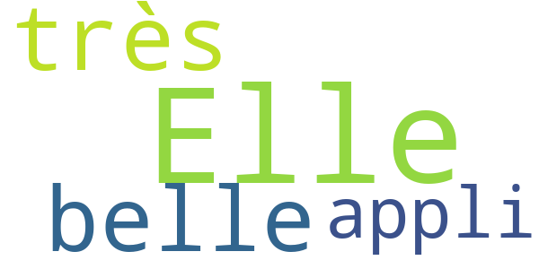

> Elle est une très belle appli  :date: __2020-05-17 05:36:47__

#### 2-star reviews

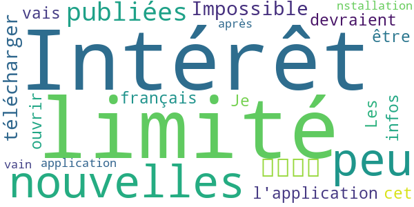

> Intérêt limité, peu de nouvelles publiées  :date: __2020-11-02 21:15:54__

> ركنا  :date: __2020-06-14 04:12:29__

> Impossible de télécharger l'application  :date: __2020-06-08 19:28:39__

> Les infos devraient être en français  :date: __2020-04-19 19:07:09__

> Je vais ouvrir cet application,après son i nstallation en vain...  :date: __2020-04-17 23:24:24__

#### 1-star reviews

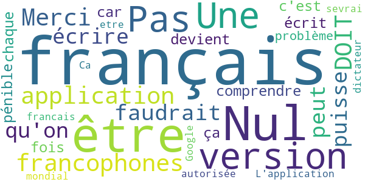

> Pas de version en français.  :date: __2020-07-21 12:19:38__

> Une application pour des francophones DOIT être en français ! Merci  :date: __2020-06-20 13:12:11__

> Nul👎 ou est le français il faudrait peut-être écrire en français😔 pour qu'on puisse comprendre ce qui est écrit ça devient pénible car à chaque fois c'est le même problème 👎😔😔  :date: __2020-06-02 14:38:38__

> L'application autorisée par le dictateur mondial Google.  :date: __2020-05-27 07:43:39__

> Nul 👎👎👎👎  :date: __2020-05-25 20:34:13__

> Ca sevrai etre en francais  :date: __2020-05-01 21:04:21__

# Minutis Mobile
App version ``2.0.3``

Analyzed with [covid-apps-observer](http://github.com/covid-apps-observer) project, version ``0.1``

## App overview
| | |
|-------------------------|-------------------------| 
| **Name**&nbsp;&nbsp;&nbsp;&nbsp;&nbsp;&nbsp;&nbsp;&nbsp;&nbsp;&nbsp;&nbsp;&nbsp;&nbsp;&nbsp;&nbsp;&nbsp;&nbsp;&nbsp;&nbsp;&nbsp;&nbsp;&nbsp;&nbsp;&nbsp;&nbsp;&nbsp;&nbsp;&nbsp;&nbsp;&nbsp;&nbsp;&nbsp;&nbsp;&nbsp;&nbsp;&nbsp;&nbsp;&nbsp;&nbsp;&nbsp;  | Minutis Mobile |
| **Unique identifier** | org.crf.minutis |
| **Link to Google Play** | [https://play.google.com/store/apps/details?id=org.crf.minutis](https://play.google.com/store/apps/details?id=org.crf.minutis) |
| **Summary**  | Pour un meilleur suivi des intervenants en opérations |
| **Privacy policy** | [https://minutis.croix-rouge.fr/cgu](https://minutis.croix-rouge.fr/cgu) |
| **Latest version** | 2.0.3 |
| **Last update** | 2020-04-24 19:45:32 |
| **Recent changes** | Merci d’utiliser Minutis Mobile ! Cette mise à jour apporte des corrections de bugs et optimisations, afin de permettre une meilleure utilisation de l’application sur le terrain. Envie de contribuer ? Vous pouvez nous remonter les bugs rencontrés et suggestions d’améliorations par mail à support.minutis@croix-rouge.fr |
| **Installs**  | 10 000+ |
| **Category** | Outils |
| **First release** | 20 oct. 2018 |
| **Size**  | 10M |
| **Supported Android version**  | 6.0 ou version ultérieure |

### Description
> ATTENTION : Minutis Mobile est à destination des intervenants de la Croix-Rouge et ses partenaires externes engagés sur le terrain d’opérations de secours et d’aide à la population. La connexion à l’application nécessite des identifiants fournis par la Croix-Rouge. Si besoin de plus d’informations, contactez-nous en envoyant un mail à support.minutis@croix-rouge.fr
 En lien permanent avec la solution de gestion des opérations <b>Minutis</b>, l'application mobile Minutis permet un suivi en temps-réel des intervenants engagés sur une opération.
 Chaque intervenant authentifié peut ainsi informer les différents maillons de la chaîne de commandement d'une opération:
 • Sur sa position (grâce à la géolocalisation GPS du téléphone);
 • Sur son statut au cours d'une intervention (sur place, disponible...)
 Ces informations permettent une meilleur coordination des moyens engagés et constituent une aide précieuse à la prise de décision.

### User interface
The developers of the app provide the following screenshots in the Google play store.
| | | |
|:-------------------------:|:-------------------------:|:-------------------------:|
 |   |   |   | 
 |   |   |   | 
 |   |   |   | 
 |   |   |   | 
 |   |   |   | 
 |   |   |   | 

## Development team
In the following we report the main information provided by the development team in the Google play store.

| | |
|-------------------------|-------------------------|
| **Developer**  | Croix-Rouge française |
| **Website**  | [https://minutis.croix-rouge.fr/](https://minutis.croix-rouge.fr/) |
| **Email** | support.minutis@croix-rouge.fr |
| **Physical address**  | - |
| **Other developed apps**  | [https://play.google.com/store/apps/developer?id=Croix-Rouge+fran%C3%A7aise](https://play.google.com/store/apps/developer?id=Croix-Rouge+fran%C3%A7aise) |

## Android support

| | |
|-------------------------|-------------------------|
| **Declared target Android version**  | Pie, version 9 (API level 28) |
| **Effective target Android version**  | Pie, version 9 (API level 28) |
| **Minimum supported Android version**  | Marshmallow, version 6.0 (API level 23) |
| **Maximum target Android version**  | - |

The larger the difference between the minimum and maximum supported Android versions, the better. A larger difference means a wider audience. For example, old phones have a very low Android version, so a high minimum supported Android version means that the app cannot be used by users with old phones, thus leading to accessibility problems. 

## Requested permissions

In the following we report the complete list of the permissions requested by the app. 

| **Permission** | **Protection level** | **Description** | 
|-------------------------|-------------------------|-------------------------|
 **android.permission ACCESS_BACKGROUND_LOCATION** | :warning:**Dangerous** | Allows an app to access location in the background. 
 **android.permission ACCESS_COARSE_LOCATION** | :warning:**Dangerous** | Allows an app to access approximate location. 
 **android.permission ACCESS_FINE_LOCATION** | :warning:**Dangerous** | Allows an app to access precise location. 
 **android.permission ACCESS_LOCATION_EXTRA_COMMANDS** | Normal | Allows an application to access extra location provider commands. 
 **android.permission ACCESS_NETWORK_STATE** | Normal | Allows applications to access information about networks. 
 **android.permission ACTIVITY_RECOGNITION** | :warning:**Dangerous** | Allows an application to recognize physical activity. 
 **android.permission BLUETOOTH** | Normal | Allows applications to connect to paired bluetooth devices. 
 **android.permission CALL_PHONE** | :warning:**Dangerous** | Allows an application to initiate a phone call without going through the Dialer user interface for the user to confirm the call. 
 **android.permission CAMERA** | :warning:**Dangerous** | Required to be able to access the camera device. 
 **android.permission FLASHLIGHT** | - | - 
 **android.permission FOREGROUND_SERVICE** | Normal | Allows a regular application to use Service.startForeground. 
 **android.permission GET_TASKS** | Deprecated | This constant was deprecated in API level 21. No longer enforced. 
 **android.permission INTERNET** | Normal | Allows applications to open network sockets. 
 **android.permission READ_APP_BADGE** | - | - 
 **android.permission RECEIVE_BOOT_COMPLETED** | Normal | Allows an application to receive the Intent.ACTION_BOOT_COMPLETED that is broadcast after the system finishes booting. 
 **android.permission USE_FINGERPRINT** | Normal | This constant was deprecated in API level 28. Applications should request USE_BIOMETRIC instead 
 **android.permission WAKE_LOCK** | Normal | Allows using PowerManager WakeLocks to keep processor from sleeping or screen from dimming. 
 **com.anddoes.launcher.permission UPDATE_COUNT** | - | - 
 **com.google.android.c2dm.permission RECEIVE** | - | - 
 **com.google.android.finsky.permission BIND_GET_INSTALL_REFERRER_SERVICE** | - | - 
 **com.google.android.gms.permission ACTIVITY_RECOGNITION** | - | - 
 **com.google.android.providers.gsf.permission READ_GSERVICES** | - | - 
 **com.htc.launcher.permission READ_SETTINGS** | - | - 
 **com.htc.launcher.permission UPDATE_SHORTCUT** | - | - 
 **com.huawei.android.launcher.permission CHANGE_BADGE** | - | - 
 **com.huawei.android.launcher.permission READ_SETTINGS** | - | - 
 **com.huawei.android.launcher.permission WRITE_SETTINGS** | - | - 
 **com.huawei.permission.external_app_settings USE_COMPONENT** | - | - 
 **com.majeur.launcher.permission UPDATE_BADGE** | - | - 
 **com.oppo.launcher.permission READ_SETTINGS** | - | - 
 **com.oppo.launcher.permission WRITE_SETTINGS** | - | - 
 **com.sec.android.provider.badge.permission READ** | - | - 
 **com.sec.android.provider.badge.permission WRITE** | - | - 
 **com.sonyericsson.home.permission BROADCAST_BADGE** | - | - 
 **com.sonymobile.home.permission PROVIDER_INSERT_BADGE** | - | - 
 **me.everything.badger.permission BADGE_COUNT_READ** | - | - 
 **me.everything.badger.permission BADGE_COUNT_WRITE** | - | - 
 **oppo.permission OPPO_COMPONENT_SAFE** | - | - 

## Mentioned servers

| **Server** | **Registrant** | **Registrant country** | **Creation date** | 
|-------------------------|-------------------------|-------------------------|-------------------------|
 | googlesyndication.com | Google LLC | :us: US | 2003-01-21 06:17:24 |
 | google.com | Google LLC | :us: US | 1997-09-15 04:00:00 |
 | facebook.com | Facebook, Inc. | :us: US | 1997-03-29 05:00:00 |
 | app-measurement.com | Google LLC | :us: US | 2015-06-19 20:13:31 |
 | xml.org | OASIS Open | :us: US | 1997-02-03 05:00:00 |
 | googleapis.com | Google LLC | :us: US | 2005-01-25 17:52:26 |
 | googleadservices.com | Google LLC | :us: US | 2003-06-19 16:34:53 |
 | googleapis.com | Google LLC | :us: US | 2005-01-25 17:52:26 |
 | appspot.com | Google LLC | :us: US | 2005-03-10 02:27:55 |
 | crashlytics.com | Google LLC | :us: US | 2011-01-21 15:30:40 |
 | gstatic.com | Google LLC | :us: US | 2008-02-11 15:31:25 |
 | citymapper.com | REDACTED FOR PRIVACY | GB | 2004-04-08 18:56:04 |
 | here.com | HERE Global B.V. | :netherlands: NL | 1995-06-11 04:00:00 |

## Security analysis 

Below we report the main security warnings raised by our execution of the [Androwarn](https://github.com/maaaaz/androwarn) security analysis tool.

**Telephony identifiers leakage**
> - This application reads the device phone type value 

**Connection interfaces exfiltration**
> - This application reads details about the currently active data network 
> - This application tries to find out if the currently active data network is metered 

**Telephony services abuse**
> - This application makes phone calls 

**Suspicious connection establishment**
> - This application opens a Socket and connects it to the remote address '' on the 'N/A' port  
> - This application opens a Socket and connects it to the remote address 'Ljava/lang/StringBuilder;->toString()Ljava/lang/String;' on the 'N/A' port  
> - This application opens a Socket and connects it to the remote address 'Ljava/net/Proxy;->type()Ljava/net/Proxy$Type;' on the 'N/A' port  
> - This application opens a Socket and connects it to the remote address 'timeout' on the 'N/A' port  

**Pim data leakage**
> - This application accesses data stored in the clipboard 

**Code execution**
> - This application loads a native library: 'crashlytics' 
> - This application loads a native library: 'pbkdf2' 
> - This application executes a UNIX command 

## User ratings and reviews

Below we provide information about how end users are reacting to the app in terms of ratings and reviews in the Google Play store.

### Ratings

The Minutis Mobile app has been installed by more than **10000** times. At this time, **37** rated the app and its average score is **3.9189188**. Below we show the distribution of the ratings across the usual star-based rating of Google Play

:star::star::star::star::star:: 21

:star::star::star::star:: 4

:star::star::star:: 5

:star::star:: 2

:star:: 5

### Reviews 

#### 5-star reviews

> Bonne appli pour le suivi gps et de statut des bénévoles (dispo, sur place, en évac...) Juste un détail, il faut penser à ne pas fermer l'appli pendant une mission sinon nous sommes déconnecté et le suivi est interrompu. Ne serait-il pas possible de remédier à ça ? (Par exemple quand on ferme maps pendant un guidage, le suivi gps et le guidage continuent en arrière plan)  :date: __2021-05-18 22:23:25__

> Déconnecté régulièrement obliger de se reconnecter pendant le poste plusieurs fois c'est très gênant  :date: __2020-04-25 17:49:00__

> Très belle appli  :date: __2019-05-02 18:00:33__

> application à très fort potentiel, elle est très utile. en espérant que l'on puisse un jour remplir des fiches d'intervention.  :date: __2019-01-17 00:35:33__

> Super pour localiser les équipages crf  :date: __2018-12-17 14:21:28__

> Je suis bénévole  :date: __2018-10-22 18:54:50__

#### 4-star reviews

> super appli. petit problème lors de l'affichage de ma position. je ne me voyais pas à certains moment. peux être liée à la faible connexion internet? sachant que j'avais la carte bien détaillé et la position gps activée.  :date: __2019-06-01 22:28:00__

#### 3-star reviews

> J'ai téléchargé cette appli dans le but d'aider "médicalement" la population dans un cas d'urgence étant donné que j'ai un diplôme secourisme, hors il faut un identifiant "CROIX ROUGE" je ne sais pas ou en crée un  :date: __2020-04-02 20:19:15__

> Des bugs d'interface, notamment au niveau de la connexion où il est impossible d'entrer dans le textfield avant de cliquer une fois sur se connecter. Belle application sinon.  :date: __2020-02-22 15:03:51__

> Problème ce matin où il n'y avait pas la cartographie :(  :date: __2019-10-20 20:52:34__

#### 2-star reviews

> Comment on fait pour se connecter à l'application quand on a pas de compte  :date: __2020-03-25 20:48:46__

#### 1-star reviews

> J'ai téléchargé votre appli. Cependant je ne peux pas créer de compte. La page qui s'affiche ne me donne pas la possibilité de m'inscrire' sauf' si je suis déjà bénévole à la croix rouge ce qui n'est pas le cas. Merci pour le retour que vous ferez à ce message.  :date: __2021-04-08 07:12:07__

> C'est bon l'app reconnaît enfin mon id CRF. Problème résolu 👍🏻  :date: __2020-12-31 11:15:17__

> Comment se connecter quand on a pas compte sur cette application je viens juste installé qu'il m'identifier alors j'ai pas m'inscrire ?????  :date: __2020-10-30 07:02:27__

> Pas assez de téléchargement  :date: __2020-10-26 21:16:33__

> Quand en ouvre l application on nous demande de se connecter mais moi je n ais pas se compte et il y a pas créé un compte  :date: __2020-04-07 22:28:21__

> L'application ne fonctionne pas du tout elle reste bloquée sur la première page avec le choix de la langue et on ne peut rien faire d'autre.  :date: __2020-03-27 09:51:28__

# OpenWHO
App version ``3.7``

Analyzed with [covid-apps-observer](http://github.com/covid-apps-observer) project, version ``0.1``

## App overview
| | |
|-------------------------|-------------------------| 
| **Name**&nbsp;&nbsp;&nbsp;&nbsp;&nbsp;&nbsp;&nbsp;&nbsp;&nbsp;&nbsp;&nbsp;&nbsp;&nbsp;&nbsp;&nbsp;&nbsp;&nbsp;&nbsp;&nbsp;&nbsp;&nbsp;&nbsp;&nbsp;&nbsp;&nbsp;&nbsp;&nbsp;&nbsp;&nbsp;&nbsp;&nbsp;&nbsp;&nbsp;&nbsp;&nbsp;&nbsp;&nbsp;&nbsp;&nbsp;&nbsp;  | OpenWHO |
| **Unique identifier** | de.xikolo.openwho |
| **Link to Google Play** | [https://play.google.com/store/apps/details?id=de.xikolo.openwho](https://play.google.com/store/apps/details?id=de.xikolo.openwho) |
| **Summary**  | Des connaissances en cas d’Urgences Sanitaires |
| **Privacy policy** | [https://openwho.org/pages/privacy](https://openwho.org/pages/privacy) |
| **Latest version** | 3.7 |
| **Last update** | 2020-11-23 13:57:15 |
| **Recent changes** | - Bug fixes and performance improvements |
| **Installs**  | 1 000 000+ |
| **Category** | Enseignement |
| **First release** | 17 mai 2017 |
| **Size**  | 18M |
| **Supported Android version**  | 5.0 ou version ultérieure |

### Description
> OpenWHO est la plateforme interactive de transmission de connaissance de l’Organisation Mondiale de la Santé (OMS) proposant des cours pour améliorer la réponse aux urgences sanitaires. OpenWHO permet à l’Organisation et à ses partenaires clés de transmettre des connaissances pouvant sauver des vies à un grand nombre d’intervenants de première ligne.
 Avec OpenWHO, vous avez la possibilité d’apprendre à votre rythme. Visionnez les courtes vidéos de cours et testez vos connaissances grâce à des auto-évaluations où et quand vous le désirez. Le forum du cours et l’espace de collaboration vous permet d’être en contact avec d’autres participants et experts du monde entier.
 Conçu en premier lieux pour les travailleurs de la santé, les intervenants de première ligne et les décideurs, l’application est aussi une source d’information destinée à ceux touchés par les flambées épidémiques et les urgences sanitaires, ou encore à ceux qui s’intéressent de manière générale au travail de l’OMS en matière d’urgences sanitaires. 
 L’application présente 6 chaînes : 
 - La chaîne Épidémie aborde la gestion des maladies infectieuses et fournit des informations scientifiques pouvant sauver des vies.
 - La chaîne Prêt à Intervenir permet de préparer le personnel qui s’entraîne en vue d’un déploiement à travailler dans des situations d’épidémies et d’urgences sanitaires.
 - La chaîne Faites dans le Social se concentre sur les interventions fondées sur les sciences sociales et aide à communiquer avec les communautés affectées. 
 - La chaîne Préparation en cas de Pandémies rassemble des cours sur divers aspects de la préparation parmi lesquels la surveillance, les mesures de santé publique et la communication sur les risques pendant une pandémie.
 - La chaîne COVID-19 offre des ressources d’apprentissage relatives à l’épidémie de la coronavirus (COVID-19) destinées aux professionnels de la santé, aux décideurs, et au public dans les 6 langues officielles de l’OMS (arabe, chinois, français, russe et espagnol). 
 - La chaîne COVID-19 Langues Nationales offre les mêmes ressources d’apprentissage que celles disponibles sur la chaîne COVID-19 mais dans des langues nationales, telles que l’indonésien, le japonais et le portugais. 
 Les cours sur OpenWHO sont disponibles dans de nombreuses langues, y compris les 6 langues officielles de l’OMS.
 Téléchargez l’application maintenant, et rejoignez la communauté OpenWHO.
 L’application est développée en partenariat avec l’Institut Hasso Plattner et l’OMS. Le contenu d’apprentissage est entièrement géré par l’OMS.

### User interface
The developers of the app provide the following screenshots in the Google play store.
| | | |
|:-------------------------:|:-------------------------:|:-------------------------:|
 |   |   |   | 
 |   |   |   | 

## Development team
In the following we report the main information provided by the development team in the Google play store.

| | |
|-------------------------|-------------------------|
| **Developer**  | HPI Knowledge Engineering Team |
| **Website**  | [https://openwho.org/](https://openwho.org/) |
| **Email** | openwho-support@hpi.de |
| **Physical address**  | [Prof.-Dr.-Helmert-Str.2-3 14482 Potsdam](https://www.google.com/maps/search/Prof.-Dr.-Helmert-Str.2-3%2014482%20Potsdam) (Google Maps) |
| **Other developed apps**  | [https://play.google.com/store/apps/developer?id=7185448023325736337](https://play.google.com/store/apps/developer?id=7185448023325736337) |

## Android support

| | |
|-------------------------|-------------------------|
| **Declared target Android version**  | - |
| **Effective target Android version**  | - |
| **Minimum supported Android version**  | Lollipop, version 5.0 (API level 21) |
| **Maximum target Android version**  | - |

The larger the difference between the minimum and maximum supported Android versions, the better. A larger difference means a wider audience. For example, old phones have a very low Android version, so a high minimum supported Android version means that the app cannot be used by users with old phones, thus leading to accessibility problems. 

## Requested permissions

In the following we report the complete list of the permissions requested by the app. 

| **Permission** | **Protection level** | **Description** | 
|-------------------------|-------------------------|-------------------------|
 **android.permission ACCESS_NETWORK_STATE** | Normal | Allows applications to access information about networks. 
 **android.permission ACCESS_WIFI_STATE** | Normal | Allows applications to access information about Wi-Fi networks. 
 **android.permission DOWNLOAD_WITHOUT_NOTIFICATION** | - | - 
 **android.permission FOREGROUND_SERVICE** | Normal | Allows a regular application to use Service.startForeground. 
 **android.permission INTERNET** | Normal | Allows applications to open network sockets. 
 **android.permission RECEIVE_BOOT_COMPLETED** | Normal | Allows an application to receive the Intent.ACTION_BOOT_COMPLETED that is broadcast after the system finishes booting. 
 **android.permission WAKE_LOCK** | Normal | Allows using PowerManager WakeLocks to keep processor from sleeping or screen from dimming. 
 **android.permission WRITE_EXTERNAL_STORAGE** | :warning:**Dangerous** | Allows an application to write to external storage. 
 **com.google.android.c2dm.permission RECEIVE** | - | - 
 **com.google.android.finsky.permission BIND_GET_INSTALL_REFERRER_SERVICE** | - | - 

## Mentioned servers

| **Server** | **Registrant** | **Registrant country** | **Creation date** | 
|-------------------------|-------------------------|-------------------------|-------------------------|
 | googlesyndication.com | Google LLC | :us: US | 2003-01-21 06:17:24 |
 | google.com | Google LLC | :us: US | 1997-09-15 04:00:00 |
 | apple.com | Apple Inc. | :us: US | 1987-02-19 05:00:00 |
 | aomedia.org | Contact Privacy Inc. Customer 1243324949 | :canada: CA | 2015-08-24 14:07:31 |
 | dashif.org | VTM Group | :us: US | 2012-04-27 13:02:46 |
 | app-measurement.com | Google LLC | :us: US | 2015-06-19 20:13:31 |
 | w3.org | W3C | :us: US | 1994-07-06 04:00:00 |
 | googleapis.com | Google LLC | :us: US | 2005-01-25 17:52:26 |
 | psdev.de | - | - | - |
 | xmlpull.org | WhoisGuard, Inc. | PA | 2001-11-26 20:33:08 |
 | crashlytics.com | Google LLC | :us: US | 2011-01-21 15:30:40 |
 | apache.org | The Apache Software Foundation | :us: US | 1995-04-11 04:00:00 |
 | opensource.org | Open Source Initiative | :us: US | 1998-02-11 05:00:00 |
 | creativecommons.org | Creative Commons Corporation | :canada: CA | 2001-01-15 16:51:44 |
 | eclipse.org | Eclipse.org Foundation, Inc. | :canada: CA | 1997-04-14 04:00:00 |
 | gnu.org | Free Software Foundation | :us: US | 1995-11-24 05:00:00 |
 | mozilla.org | Mozilla Corporation | :us: US | 1998-01-24 05:00:00 |
 | googleadservices.com | Google LLC | :us: US | 2003-06-19 16:34:53 |

## Security analysis 

Below we report the main security warnings raised by our execution of the [Androwarn](https://github.com/maaaaz/androwarn) security analysis tool.

**Telephony identifiers leakage**
> - This application reads the ISO country code equivalent of the current registered operator's MCC (Mobile Country Code) 
> - This application reads the MCC+MNC of the provider of the SIM 

**Connection interfaces exfiltration**
> - This application reads details about the currently active data network 
> - This application tries to find out if the currently active data network is metered 

**Suspicious connection establishment**
> - This application opens a Socket and connects it to the remote address ' returned no addresses for  ; port is out of range' on the 'N/A' port  
> - This application opens a Socket and connects it to the remote address '' on the 'N/A' port  
> - This application opens a Socket and connects it to the remote address 'Ljava/lang/StringBuilder;->toString()Ljava/lang/String;' on the 'N/A' port  
> - This application opens a Socket and connects it to the remote address 'Ljava/net/Proxy;->type()Ljava/net/Proxy$Type;' on the 'N/A' port  
> - This application opens a Socket and connects it to the remote address 'timeout' on the 'N/A' port  

**Code execution**
> - This application loads a native library 

## User ratings and reviews

Below we provide information about how end users are reacting to the app in terms of ratings and reviews in the Google Play store.

### Ratings

The OpenWHO app has been installed by more than **1000000** times. At this time, **3403** rated the app and its average score is **4.2647057**. Below we show the distribution of the ratings across the usual star-based rating of Google Play

:star::star::star::star::star:: 2403

:star::star::star::star:: 370

:star::star::star:: 130

:star::star:: 130

:star:: 370

### Reviews 

#### 5-star reviews

> Good  :date: __2020-12-15 04:20:33__

> Cool merci beaucoup pour l'application je me forme chaque fois que je veux,  :date: __2020-10-31 17:17:37__

> Bien bon courage  :date: __2020-10-30 17:25:39__

> Ouverture  :date: __2020-10-15 21:57:46__

> Très spécial WHO  :date: __2020-10-03 01:58:38__

> Super cool  :date: __2020-09-18 15:30:22__

> Je l'aime  :date: __2020-08-29 13:17:38__

> Excellent  :date: __2020-08-24 23:15:20__

> Je suis content de cette application  :date: __2020-08-16 14:08:38__

> Good  :date: __2020-06-02 10:54:02__

#### 4-star reviews

> OK.Bien  :date: __2020-07-02 03:23:46__

> Je ne comprend pas qu'il fait écrit  :date: __2020-04-16 19:36:27__

> Je viens de m'inscrire et commence a suivre des cours, format et contenu très intéressant. Si on pouvait avoir encore plus de contenu en Français ce serait top. L'application crash parfois... A voir...  :date: __2020-04-08 17:22:54__

#### 3-star reviews

> Médecin de carrière  :date: __2020-05-29 23:52:47__

> Pensez pour ceux qui parlent exclusivement en français, les documents sont a l'origine en Anglais c'est vrai mais. Les francophones peuvent aussi, éditer des textes à la rédaction pour ne pas avoir des confusions entre la langue Française et l'Anglais. Bravo aux développeurs.  :date: __2020-03-29 17:13:41__

#### 2-star reviews

> Je regrette de cette application est en anglais.Que feront ceux qui ne comprennent que le français.Donc revoir la langue mais aussi regrouper les maladies sous surveillance afin de mieux informer les utilisateurs de l'application.  :date: __2020-04-15 18:23:39__

> Pas satisfais de mesure de couvre feu et de fermeture de lieu de culte  :date: __2020-04-13 15:42:22__

> كان بإمكانكم ترجمتها بالعربية ومع ذالك ساضع لكم نجمتين  :date: __2020-04-10 11:18:37__

> Serais t'il possible s'ils-vous-plais d'avoir à la page d'accueil en langage Français sans l'avoir en anglais ..?!  :date: __2020-03-27 09:09:48__

#### 1-star reviews

> Bien cool  :date: __2020-04-25 18:22:49__

> 🙏🏼Taiwan🙏🏼  :date: __2020-04-14 05:19:51__

> Maove  :date: __2020-04-10 00:09:19__

> Quel est la fontion de cette aplication S.v.p expliqué nous qui non pas compris ce aplication  :date: __2020-04-09 22:04:23__

> C bon  :date: __2020-04-08 22:23:53__

> L englais c'est pas la seule langue au monde  :date: __2020-04-03 00:29:50__

> Nul  :date: __2020-04-02 22:27:28__

> Application après créé compte ne fonctionnait pas même vérifie par moi.  :date: __2020-04-01 17:31:40__

> كلتب وعلاش محيتو لعبة فيروس كورونا  :date: __2020-04-01 13:56:52__

> Inutile , elle n'est qu'en version anglaise !!!! Pour les autres, tapper votre tete sur le mur !!!!  :date: __2020-03-28 08:53:50__

# Covidom Patient
App version ``1.5.21``

Analyzed with [covid-apps-observer](http://github.com/covid-apps-observer) project, version ``0.1``

## App overview
| | |
|-------------------------|-------------------------| 
| **Name**&nbsp;&nbsp;&nbsp;&nbsp;&nbsp;&nbsp;&nbsp;&nbsp;&nbsp;&nbsp;&nbsp;&nbsp;&nbsp;&nbsp;&nbsp;&nbsp;&nbsp;&nbsp;&nbsp;&nbsp;&nbsp;&nbsp;&nbsp;&nbsp;&nbsp;&nbsp;&nbsp;&nbsp;&nbsp;&nbsp;&nbsp;&nbsp;&nbsp;&nbsp;&nbsp;&nbsp;&nbsp;&nbsp;&nbsp;&nbsp;  | Covidom Patient |
| **Unique identifier** | fr.aphp.covidom |
| **Link to Google Play** | [https://play.google.com/store/apps/details?id=fr.aphp.covidom](https://play.google.com/store/apps/details?id=fr.aphp.covidom) |
| **Summary**  | L’assistant de suivi médical pour les patients porteurs du virus COVID-19 |
| **Privacy policy** | [https://www.covidom.fr/politique-confidentialite](https://www.covidom.fr/politique-confidentialite) |
| **Latest version** | 1.5.21 |
| **Last update** | 2020-05-07 11:24:53 |
| **Recent changes** | Vous pouvez désormais activer votre compte Covidom, à l&#39;aide de votre identifiant et du code d&#39;activation transmis, directement sur l&#39;application Android |
| **Installs**  | 10 000+ |
| **Category** | Médecine |
| **First release** | 10 mars 2020 |
| **Size**  | 4,1M |
| **Supported Android version**  | 4.3 ou version ultérieure |

### Description
> *** La solution COVIDOM n'est pas en libre accès et est UNIQUEMENT disponible pour les patients suivis par des services hospitaliers utilisateurs de la plateforme.*** 
 Covidom est une application qui permet aux patients porteurs du virus COVID-19 de bénéficier d’un suivi à distance (ou télésuivi) quotidien. Il peut répondre à des questionnaires médicaux qui sont analysés en temps réel. De son côté, l’équipe soignante sait comment le patient vit au quotidien et est alertée si le patient a besoin d’une attention plus particulière. En cas de besoin, le personnel soignant prend le relais et rentre en contact directement avec le patient pour lui donner ses consignes.

### User interface
The developers of the app provide the following screenshots in the Google play store.
| | | |
|:-------------------------:|:-------------------------:|:-------------------------:|
 |   |   |   | 

## Development team
In the following we report the main information provided by the development team in the Google play store.

| | |
|-------------------------|-------------------------|
| **Developer**  | Assistance Publique - Hôpitaux de paris (AP-HP) |
| **Website**  | [https://www.covidom.fr](https://www.covidom.fr) |
| **Email** | contact.devmobile@aphp.fr |
| **Physical address**  | [AP-HP / DSI / WIND 33 bd de Picpus 75012 Paris France](https://www.google.com/maps/search/AP-HP%20/%20DSI%20/%20WIND%2033%20bd%20de%20Picpus%2075012%20Paris%20France) (Google Maps) |
| **Other developed apps**  | [https://play.google.com/store/apps/developer?id=Assistance+Publique+-+H%C3%B4pitaux+de+paris+(AP-HP)](https://play.google.com/store/apps/developer?id=Assistance+Publique+-+H%C3%B4pitaux+de+paris+(AP-HP)) |

## Android support

| | |
|-------------------------|-------------------------|
| **Declared target Android version**  | Pie, version 9 (API level 28) |
| **Effective target Android version**  | Pie, version 9 (API level 28) |
| **Minimum supported Android version**  | Jelly Bean, version 4.1.x (API level 16) |
| **Maximum target Android version**  | - |

The larger the difference between the minimum and maximum supported Android versions, the better. A larger difference means a wider audience. For example, old phones have a very low Android version, so a high minimum supported Android version means that the app cannot be used by users with old phones, thus leading to accessibility problems. 

## Requested permissions

In the following we report the complete list of the permissions requested by the app. 

| **Permission** | **Protection level** | **Description** | 
|-------------------------|-------------------------|-------------------------|
 **android.permission ACCESS_NETWORK_STATE** | Normal | Allows applications to access information about networks. 
 **android.permission INTERNET** | Normal | Allows applications to open network sockets. 
 **android.permission READ_EXTERNAL_STORAGE** | :warning:**Dangerous** | Allows an application to read from external storage. 
 **android.permission WAKE_LOCK** | Normal | Allows using PowerManager WakeLocks to keep processor from sleeping or screen from dimming. 
 **android.permission WRITE_EXTERNAL_STORAGE** | :warning:**Dangerous** | Allows an application to write to external storage. 
 **com.google.android.c2dm.permission RECEIVE** | - | - 
 **com.google.android.finsky.permission BIND_GET_INSTALL_REFERRER_SERVICE** | - | - 

## Mentioned servers

| **Server** | **Registrant** | **Registrant country** | **Creation date** | 
|-------------------------|-------------------------|-------------------------|-------------------------|
 | google.com | Google LLC | :us: US | 1997-09-15 04:00:00 |
 | googleadservices.com | Google LLC | :us: US | 2003-06-19 16:34:53 |
 | app-measurement.com | Google LLC | :us: US | 2015-06-19 20:13:31 |
 | googleapis.com | Google LLC | :us: US | 2005-01-25 17:52:26 |
 | googlesyndication.com | Google LLC | :us: US | 2003-01-21 06:17:24 |
 | covidom.fr | Nouveal | - | 2020-03-06 20:03:16 |
 | crashlytics.com | Google LLC | :us: US | 2011-01-21 15:30:40 |
 | googleapis.com | Google LLC | :us: US | 2005-01-25 17:52:26 |
 | e-fitback.com | Nouveal | :fr: FR | 2015-11-16 13:24:32 |

## Security analysis 

Below we report the main security warnings raised by our execution of the [Androwarn](https://github.com/maaaaz/androwarn) security analysis tool.

**Connection interfaces exfiltration**
> - This application reads details about the currently active data network 
> - This application tries to find out if the currently active data network is metered 

**Telephony services abuse**
> - This application makes phone calls 

**Suspicious connection establishment**
> - This application opens a Socket and connects it to the remote address ': ; port is out of range' on the 'N/A' port  
> - This application opens a Socket and connects it to the remote address 'Lf/a;->a(Ljava/lang/String;)Ljava/lang/StringBuilder;' on the 'N/A' port  
> - This application opens a Socket and connects it to the remote address 'Ljava/lang/StringBuilder;->toString()Ljava/lang/String;' on the 'N/A' port  
> - This application opens a Socket and connects it to the remote address 'Ljava/net/Proxy;->type()Ljava/net/Proxy$Type;' on the 'N/A' port  
> - This application opens a Socket and connects it to the remote address 'timeout' on the 'N/A' port  

## User ratings and reviews

Below we provide information about how end users are reacting to the app in terms of ratings and reviews in the Google Play store.

### Ratings

The Covidom Patient app has been installed by more than **10000** times. At this time, **100** rated the app and its average score is **3.17**. Below we show the distribution of the ratings across the usual star-based rating of Google Play

:star::star::star::star::star:: 45

:star::star::star::star:: 7

:star::star::star:: 6

:star::star:: 4

:star:: 38

### Reviews 

#### 5-star reviews

> Bien  :date: __2021-04-27 22:53:45__

> Tout va bien.  :date: __2021-04-15 10:10:22__

> C'est le debut, merci je me sent pas seul  :date: __2021-04-10 16:39:49__

> Tres bien permet d d'évaluer son état et d'alerter si besoin.  :date: __2021-02-22 11:01:20__

> Perfect thanks  :date: __2020-11-01 17:24:02__

> Action réaction. Positive... je remplis mon 2eme questionnaire en signalant des symptomes... une heure aprés on me rappel pour me poser des questions et prendre de mes nouvelles... et on est dimanche matin ! Bravo ce suivis est tellement rassurant...  :date: __2020-10-25 11:37:02__

> Cette application m'as énormément été utile  :date: __2020-09-24 17:23:04__

> Je félicite et remercie tout le personnel du covidom . Ils m'ont suivis durant toute cette difficile période ,sans oublier mon médecin traitant . Ils m'ont aidés physiquement et moralement, bravo à vous tous.  :date: __2020-05-26 14:43:58__

> Tres bien  :date: __2020-05-10 22:51:16__

> Super application je remercie sincèrement toute l équipe qui m a suivi et qui m a beaucoup aidé par leur écoute leur gentillesse et leur bonne humeur  :date: __2020-05-08 14:38:35__

#### 4-star reviews

> Super  :date: __2020-10-06 06:51:47__

> C'est trés bien , très bonne initiative Mille mercis encore On vous soutient tous !!!!!!!!  :date: __2020-05-28 00:30:08__

> J'habite en Bretagne Ilya pas la Bretagne  :date: __2020-04-05 20:24:42__

> Bonjour , Une application je me sens en surveillance mais c'est dommage personne vous appelle seulement votre médecin traitant après peut être qu'ils sont débordés avec les autres personnes malades.  :date: __2020-04-03 09:02:14__

> Fonctionne bien quand on s'aperçoit au bout de plusieurs jours que les liens arrivent en courrier indésirable. Quand on est malade c'est difficile d'être réactif  :date: __2020-04-02 20:00:23__

> ! A télécharger seulement si le centre de dépistage a envoyé le code ! ... Et réservé pour nous les covid+. Les autres, ne soyez pas jaloux, votre tour viendra. Seul bémol, 24h00 pour envoyer le code ( soit J+5 post symptômes ) ... et déjà plus de fièvre. Dommage. En attendant je reste chez moi.  :date: __2020-03-26 11:43:51__

#### 3-star reviews

> Le questionnaire de 19h n'est toujours pas accessible  :date: __2021-04-25 19:25:20__

> Bonjour, sur l'application mon compte est désactivé, alors que sur le site web, il est actif. Je ne reçois pas de mail lors d'une demande de réinitialisation de mot de passe (retrouvé entre temps)  :date: __2021-03-20 11:15:34__

> Bonne application. Un agent rappelle dès qu'un questionnaire est saisi avec des réponses particulières  :date: __2021-01-09 09:33:43__

> Très pratique et simple d'utilisation. Mais depuis 16/05 ne peut plus entres mes constante.  :date: __2020-05-17 15:13:38__

> Je reçois des SMS alors que je ne suis pas inclus dans le suivi  :date: __2020-04-08 09:06:01__

> Bonjour je pense que tout le monde devrait pouvoir se connecter à cette application, pour ma part je voudrais savoir si nous avons un moyen pour signaler que j'ai été malade avec en partie les mêmes symptômes en date du 7 mars avec des tempet à plus de 40° et qu'au bout de 1 semaine j'allais mieux, à qui pouvons nous nous retourner, et est ce que mon information peut permettre à faire avancer les recherches?!? Cordialement.  :date: __2020-04-07 22:50:00__

> Très bonne idée d'application, sauf que les questionnaires s'arrêtent a 17h. Alors que ma fièvre augmente très largement le soir, plus de 39 et du coup ça on peut pas le dire.  :date: __2020-03-25 07:42:42__

> Pour arriver à me connecter sur l'application je suis allée sur mon compte AP-HP et j'ai envoyé un mail depuis mon espace pour demander l'activation de mon compte, service très réactif dans l'heure j'ai reçu un SMS avec mon identifiant et un lien de première connexion. Bravo à tous ceux qui œuvrent au quotidien dans la lutte contre le virus. J'espère que mon avis aidera d'autres personnes.  :date: __2020-03-21 21:53:30__

#### 2-star reviews

> Difficile à installer. Même après une première utilisation il faut renseigner la région qui n'est pas mémoriser.je n'ai réussi à installer avec play store sur l'écran d'accueil. Ce produit n'est pas testé.  :date: __2020-10-24 18:01:28__

> Même chose ma date de naissance ne passe pas.Mais déjà au tel une dame de la caisse assurance maladie avait pour moi dans son logiciel 1935 pour ma date de naissance alors que je suis née en 1959...ma fille m a indiquée cas contact en donnant mon tel portable .Elle 24 ans..Si j étais née 1935 je l aurais eue à quel âge? Ça fait peur....bonjour la logistique....  :date: __2020-10-16 10:01:11__

> C'est nul on ne peut pas changer la date ni quoi que ce soit pas pratique  :date: __2020-08-11 02:13:59__

> Je veux  :date: __2020-05-29 16:29:13__

> J'essaie d'inscrire pour le suivi mon père de 78 ans et de l'aider comme je peux avec son téléphone, un identifiant lui a été communiqué à l'oral, mais impossible de procéder à l'activation. C'est très compliqué. Idem , j'ai essayé de lui créer un compte sur l'AP-HP, sans succès. Du coup, je ne sais même pas à qui m'adresser pour demander la redemander le n° d'identification. Dommage...  :date: __2020-04-04 19:45:01__

#### 1-star reviews

> impossible connection depuis 2 jours?  :date: __2021-04-29 10:35:21__

> Impossible de me connecter  :date: __2021-03-23 10:19:59__

> Vraiment pas pratique ! Avec Bac+5 j'ai du réfléchir quelques heures pour appréhender la logique. Un covidé de 70 ans doit paniquer 😪  :date: __2021-01-24 06:43:13__

> Je n'arrive pas à m'inscrire  :date: __2020-12-18 12:12:57__

> n'est peu pas accepté mon date de naissance  :date: __2020-12-17 17:26:33__

> Je ne comprends au procédures  :date: __2020-11-22 19:27:12__

> Enfin installée... on ne sait pas comment. Pas moyen de supprimer des documents dans mon espace... A quoi sert un espace personnel si on ne peut pas le gérer ?  :date: __2020-11-19 16:30:06__

> Impossible de s'inscrire. Malgré tous les messages reçues chaque jour, pour moi c'est nul  :date: __2020-11-19 10:30:49__

> Inutile, fonctionne mal  :date: __2020-11-08 15:30:20__

> Mot de passe sans cesse bloqué  :date: __2020-11-02 12:27:39__

# COVID AP-HM
App version ``1.2.0``

Analyzed with [covid-apps-observer](http://github.com/covid-apps-observer) project, version ``0.1``

## App overview
| | |
|-------------------------|-------------------------| 
| **Name**&nbsp;&nbsp;&nbsp;&nbsp;&nbsp;&nbsp;&nbsp;&nbsp;&nbsp;&nbsp;&nbsp;&nbsp;&nbsp;&nbsp;&nbsp;&nbsp;&nbsp;&nbsp;&nbsp;&nbsp;&nbsp;&nbsp;&nbsp;&nbsp;&nbsp;&nbsp;&nbsp;&nbsp;&nbsp;&nbsp;&nbsp;&nbsp;&nbsp;&nbsp;&nbsp;&nbsp;&nbsp;&nbsp;&nbsp;&nbsp;  | COVID AP-HM |
| **Unique identifier** | com.ambulis.aphm.covid |
| **Link to Google Play** | [https://play.google.com/store/apps/details?id=com.ambulis.aphm.covid](https://play.google.com/store/apps/details?id=com.ambulis.aphm.covid) |
| **Summary**  | Suivi COVID-19 de l&#39;AP-HM |
| **Privacy policy** | [http://domicalis.com/legal/cgu-covid_aphm-android.pdf](http://domicalis.com/legal/cgu-covid_aphm-android.pdf) |
| **Latest version** | 1.2.0 |
| **Last update** | 2020-03-15 02:24:44 |
| **Recent changes** | Corrections de bugs et amélioration des performances. |
| **Installs**  | 10 000+ |
| **Category** | Médecine |
| **First release** | 14 mars 2020 |
| **Size**  | 4,1M |
| **Supported Android version**  | 4.1 ou version ultérieure |

### Description
> *** L'application COVID AP-HM est réservée aux patients suivis par l'AP-HM 
  Assistance Publique - Hôpitaux de Marseille ***
 L’application de l’AP-HM pour visualiser et compléter son suivi COVID-19 directement depuis un mobile pour les personnes confirmées ou co-exposées au coronavirus et dont l'état ne présente pas de danger immédiat.
 RAPPEL - Un numéro vert répond à vos questions sur le Coronavirus COVID-19 en permanence, 24h/24 et 7j/7 : 
 => 0 800 130 000 (appel gratuit) <=
 Solution sécurisée pour garantir la protection des données à caractère personnel, l’application COVID AP-HM repose sur une technologie de l’information et de la communication sans fil au profit des personnes nécessitant un suivi médical après un contact potentiel avec le coronavirus SARS-CoV-2.
 En tant que personnes confirmées ou co-exposées au COVID-19, vous pouvez ainsi mieux appréhender votre suivi en toute autonomie grâce à la prise de constantes, aux conseils et aux formulaires mis au point par les équipes de l’AP-HM .
 COVID AP-HM, c'est :
 - Un outil pour améliorer votre prise en charge en facilitant la communication avec l’établissement
 - Des mesures et un suivi 100% numériques
 - Une interface moderne, rapide et intuitive, facile à prendre en main

### User interface
The developers of the app provide the following screenshots in the Google play store.
| | | |
|:-------------------------:|:-------------------------:|:-------------------------:|
 |   |   |   | 
 |   |   |   | 
 |   |  

## Development team
In the following we report the main information provided by the development team in the Google play store.

| | |
|-------------------------|-------------------------|
| **Developer**  | RADHIUS |
| **Website**  | [http://www.domicalis.com](http://www.domicalis.com) |
| **Email** | contact@domicalis.com |
| **Physical address**  | - |
| **Other developed apps**  | [https://play.google.com/store/apps/developer?id=RADHIUS](https://play.google.com/store/apps/developer?id=RADHIUS) |

## Android support

| | |
|-------------------------|-------------------------|
| **Declared target Android version**  | Pie, version 9 (API level 28) |
| **Effective target Android version**  | Pie, version 9 (API level 28) |
| **Minimum supported Android version**  | Jelly Bean, version 4.1.x (API level 16) |
| **Maximum target Android version**  | - |

The larger the difference between the minimum and maximum supported Android versions, the better. A larger difference means a wider audience. For example, old phones have a very low Android version, so a high minimum supported Android version means that the app cannot be used by users with old phones, thus leading to accessibility problems. 

## Requested permissions

In the following we report the complete list of the permissions requested by the app. 

| **Permission** | **Protection level** | **Description** | 
|-------------------------|-------------------------|-------------------------|
 **android.permission ACCESS_NETWORK_STATE** | Normal | Allows applications to access information about networks. 
 **android.permission INTERNET** | Normal | Allows applications to open network sockets. 
 **android.permission WAKE_LOCK** | Normal | Allows using PowerManager WakeLocks to keep processor from sleeping or screen from dimming. 
 **android.permission WRITE_EXTERNAL_STORAGE** | :warning:**Dangerous** | Allows an application to write to external storage. 
 **com.google.android.c2dm.permission RECEIVE** | - | - 
 **com.google.android.finsky.permission BIND_GET_INSTALL_REFERRER_SERVICE** | - | - 
 **com.google.android.providers.gsf.permission READ_GSERVICES** | - | - 

## Mentioned servers

| **Server** | **Registrant** | **Registrant country** | **Creation date** | 
|-------------------------|-------------------------|-------------------------|-------------------------|
 | google.com | Google LLC | :us: US | 1997-09-15 04:00:00 |
 | app-measurement.com | Google LLC | :us: US | 2015-06-19 20:13:31 |
 | googlesyndication.com | Google LLC | :us: US | 2003-01-21 06:17:24 |
 | googleapis.com | Google LLC | :us: US | 2005-01-25 17:52:26 |

## Security analysis 

Below we report the main security warnings raised by our execution of the [Androwarn](https://github.com/maaaaz/androwarn) security analysis tool.

**Connection interfaces exfiltration**
> - This application reads details about the currently active data network 
> - This application tries to find out if the currently active data network is metered 

**Telephony services abuse**
> - This application makes phone calls 

## User ratings and reviews

Below we provide information about how end users are reacting to the app in terms of ratings and reviews in the Google Play store.

### Ratings

The COVID AP-HM app has been installed by more than **10000** times. At this time, **23** rated the app and its average score is **3.2173913**. Below we show the distribution of the ratings across the usual star-based rating of Google Play

:star::star::star::star::star:: 11

:star::star::star::star:: 0

:star::star::star:: 3

:star::star:: 1

:star:: 8

### Reviews 

#### 5-star reviews

> Très bien  :date: __2020-07-28 11:28:23__

> Troger noel  :date: __2020-07-05 14:03:49__

> dd  :date: __2020-05-09 21:36:25__

> Très bien  :date: __2020-04-10 20:58:40__

#### 4-star reviews

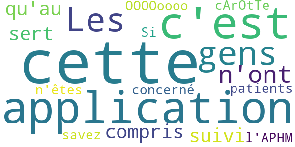

> Les gens n'ont pas compris que cette application ne sert qu'au suivi des patients de l'APHM. Si vous ne savez pas ce que c'est c'est que vous n'êtes pas concerné par cette application.  :date: __2020-09-21 22:23:01__

> OOOOoooo i'm A cArOtTe  :date: __2020-09-10 14:14:34__

#### 3-star reviews

> C'est Bon  :date: __2020-06-02 14:26:24__

> À voir  :date: __2020-04-05 23:13:29__

#### 2-star reviews

> Pareil que l'autre  :date: __2020-08-11 02:14:19__

#### 1-star reviews

> de quelle numéro de dossier s'agît il?????application non adaptée à mon smartphone merci de répondre à cette question  :date: __2021-05-22 11:05:54__

> Quel est donc le numéro de dossier qu'il faut renseigner sur l'application ? Les étiquettes aphm que l'on m'a délivrées pour effectuer le test comportent deux séries de chiffres dont aucun n'est accepté comme numéro de dossier. Il n'a a aucune explication qui permette de trouver ce numéro de dossier. L'application ne me sert donc pas.  :date: __2021-05-12 12:24:24__

> Application nuls 0n nous demande un numéro de dossier que l'on n'a pas  :date: __2021-01-12 11:37:33__

> Cette application est nul. On me demande un numéro de dossier que je n'ai pas. Je ne vous conseille vraiment pas cette application !  :date: __2020-12-22 20:06:01__

> Ons me demande un numéro de dossier, mais lequel? Vous pouvez au moins expliquer! Et après ons nous dit que c'est obligatoire  :date: __2020-11-30 11:36:04__

> Nullissime !  :date: __2020-11-21 10:39:39__

> C'est que des quons .ils veulent toute les infos même le compte banquere pour remplire les poches de macron .  :date: __2020-07-19 10:47:24__

> rien ne marche . pas adapté à mon appareil. On me demande un numéro de dossier sans explication derrière...? Bref c'est nul  :date: __2020-06-02 22:14:05__

> J'ai pas de numéro de dossier?  :date: __2020-06-02 16:38:05__

> Trop nnuuulll il seire à rien il fait sa pour tuer les personnes trop nul je vous le déconseille de téléchargé l'application qui d'accord avec 🙂il et trop nul👎🏻👎🏻  :date: __2020-05-31 11:45:24__

# TousAntiCovid
App version ``2.3.4``

Analyzed with [covid-apps-observer](http://github.com/covid-apps-observer) project, version ``0.1``

## App overview
| | |
|-------------------------|-------------------------| 
| **Name**&nbsp;&nbsp;&nbsp;&nbsp;&nbsp;&nbsp;&nbsp;&nbsp;&nbsp;&nbsp;&nbsp;&nbsp;&nbsp;&nbsp;&nbsp;&nbsp;&nbsp;&nbsp;&nbsp;&nbsp;&nbsp;&nbsp;&nbsp;&nbsp;&nbsp;&nbsp;&nbsp;&nbsp;&nbsp;&nbsp;&nbsp;&nbsp;&nbsp;&nbsp;&nbsp;&nbsp;&nbsp;&nbsp;&nbsp;&nbsp;  | TousAntiCovid |
| **Unique identifier** | fr.gouv.android.stopcovid |
| **Link to Google Play** | [https://play.google.com/store/apps/details?id=fr.gouv.android.stopcovid](https://play.google.com/store/apps/details?id=fr.gouv.android.stopcovid) |
| **Summary**  | Participez à la lutte contre l’épidémie en réduisant les risques de transmission |
| **Privacy policy** | [https://bonjour.tousanticovid.gouv.fr/privacy.html](https://bonjour.tousanticovid.gouv.fr/privacy.html) |
| **Latest version** | 2.3.4 |
| **Last update** | 2021-03-22 18:17:20 |
| **Recent changes** | Nouvelles attestations ! Vous pouvez désormais visualiser l&#39;évolution des chiffres clés, sous forme de graphes ! Et aussi, nouveaux modules vaccination et isolement, attestations de sortie, liens utiles, partage d&#39;infos et chiffres clés, et autres améliorations. |
| **Installs**  | 5 000 000+ |
| **Category** | Médecine |
| **First release** | 29 mai 2020 |
| **Size**  | 24M |
| **Supported Android version**  | 5.0 ou version ultérieure |

### Description
> L'application TousAntiCovid est destinée au territoire français.
 Vous pouvez désormais créer et sauvegarder vos attestations de déplacement dérogatoire directement dans l'application.
 Protégeons nos proches, protégeons-nous et protégeons les autres. 
 TousAntiCovid, c’est simple :
 # J'active l'application
 En utilisant le Bluetooth de votre téléphone, TousAntiCovid détecte les téléphones des autres utilisateurs qui restent à proximité du vôtre.
 # Je reste informé
 Vous serez informé si vous avez été à proximité d’un utilisateur testé positif à la COVID-19. Vous serez informés des derniers chiffres et de l’actualité sur l’épidémie. Vous aurez accès aux conseils personnalisés de Mes Conseils Covid.
 # Je protège mes proches et les autres
 Si vous devez vous faire tester, vous pourrez trouver le laboratoire le plus proche. Si vous êtes diagnostiqué comme un cas de COVID-19, votre laboratoire ou votre médecin vous donneront un code à scanner ou à saisir pour avertir anonymement les utilisateurs que vous avez rencontrés.
 # Mes données sont protégées
 L’application n’utilise à aucun moment la localisation des personnes, et il est impossible de connaître l’identité des utilisateurs.
 Cette application a été réalisée par l'équipe TousAntiCovid, sous la supervision du Ministère des Solidarités et de la Santé et du Secrétariat d'Etat chargé du Numérique.

### User interface
The developers of the app provide the following screenshots in the Google play store.
| | | |
|:-------------------------:|:-------------------------:|:-------------------------:|
 |   |   |   | 
 |   |   |   | 

## Development team
In the following we report the main information provided by the development team in the Google play store.

| | |
|-------------------------|-------------------------|
| **Developer**  | Gouvernement |
| **Website**  | [https://bonjour.tousanticovid.gouv.fr](https://bonjour.tousanticovid.gouv.fr) |
| **Email** | contact@tousanticovid.gouv.fr |
| **Physical address**  | [20 avenue de Ségur 75007 Paris](https://www.google.com/maps/search/20%20avenue%20de%20Ségur%2075007%20Paris) (Google Maps) |
| **Other developed apps**  | [https://play.google.com/store/apps/developer?id=Gouvernement](https://play.google.com/store/apps/developer?id=Gouvernement) |

## Android support

| | |
|-------------------------|-------------------------|
| **Declared target Android version**  | - |
| **Effective target Android version**  | - |
| **Minimum supported Android version**  | Lollipop, version 5.0 (API level 21) |
| **Maximum target Android version**  | - |

The larger the difference between the minimum and maximum supported Android versions, the better. A larger difference means a wider audience. For example, old phones have a very low Android version, so a high minimum supported Android version means that the app cannot be used by users with old phones, thus leading to accessibility problems. 

## Requested permissions

In the following we report the complete list of the permissions requested by the app. 

| **Permission** | **Protection level** | **Description** | 
|-------------------------|-------------------------|-------------------------|
 **android.permission ACCESS_COARSE_LOCATION** | :warning:**Dangerous** | Allows an app to access approximate location. 
 **android.permission ACCESS_FINE_LOCATION** | :warning:**Dangerous** | Allows an app to access precise location. 
 **android.permission ACCESS_NETWORK_STATE** | Normal | Allows applications to access information about networks. 
 **android.permission BLUETOOTH** | Normal | Allows applications to connect to paired bluetooth devices. 
 **android.permission BLUETOOTH_ADMIN** | Normal | Allows applications to discover and pair bluetooth devices. 
 **android.permission CAMERA** | :warning:**Dangerous** | Required to be able to access the camera device. 
 **android.permission FOREGROUND_SERVICE** | Normal | Allows a regular application to use Service.startForeground. 
 **android.permission INTERNET** | Normal | Allows applications to open network sockets. 
 **android.permission RECEIVE_BOOT_COMPLETED** | Normal | Allows an application to receive the Intent.ACTION_BOOT_COMPLETED that is broadcast after the system finishes booting. 
 **android.permission REQUEST_IGNORE_BATTERY_OPTIMIZATIONS** | Normal | Permission an application must hold in order to use Settings.ACTION_REQUEST_IGNORE_BATTERY_OPTIMIZATIONS. 
 **android.permission WAKE_LOCK** | Normal | Allows using PowerManager WakeLocks to keep processor from sleeping or screen from dimming. 

## Mentioned servers

| **Server** | **Registrant** | **Registrant country** | **Creation date** | 
|-------------------------|-------------------------|-------------------------|-------------------------|
 | google.com | Google LLC | :us: US | 1997-09-15 04:00:00 |
 | stopcovid.gouv.fr | Etat francais represente par le Ministere des Solidarites et de la Sante | - | 2020-04-15 12:02:42 |
 | tac.gouv.fr | Etat francais represente par le Ministere des Solidarites et de la Sante | - | 2020-11-24 09:54:22 |
 | tousanticovid.gouv.fr | Etat francais represente par le Ministere des Solidarites et de la Sante | - | 2020-10-19 09:30:28 |

## Security analysis 

Below we report the main security warnings raised by our execution of the [Androwarn](https://github.com/maaaaz/androwarn) security analysis tool.

**Connection interfaces exfiltration**
> - This application reads details about the currently active data network 
> - This application tries to find out if the currently active data network is metered 

**Telephony services abuse**
> - This application makes phone calls 

**Suspicious connection establishment**
> - This application opens a Socket and connects it to the remote address '; port is out of range' on the 'N/A' port  
> - This application opens a Socket and connects it to the remote address 'Lcom/android/tools/r8/GeneratedOutlineSupport;->outline19(Ljava/lang/String;)Ljava/lang/StringBuilder;' on the 'N/A' port  
> - This application opens a Socket and connects it to the remote address 'Ljava/net/Proxy;->type()Ljava/net/Proxy$Type;' on the 'N/A' port  
> - This application opens a Socket and connects it to the remote address 'timeout' on the 'N/A' port  

## User ratings and reviews

Below we provide information about how end users are reacting to the app in terms of ratings and reviews in the Google Play store.

### Ratings

The TousAntiCovid app has been installed by more than **5000000** times. At this time, **50491** rated the app and its average score is **3.9955218**. Below we show the distribution of the ratings across the usual star-based rating of Google Play

:star::star::star::star::star:: 27842

:star::star::star::star:: 9988

:star::star::star:: 3971

:star::star:: 1976

:star:: 6714

### Reviews 

#### 5-star reviews

> Super comme application J aime  :date: __2021-04-12 17:54:05__

> Très utile pour générer l'attestation de déplacement et pour être au courant des dernières actualités.  :date: __2021-04-12 17:24:30__

> Cool  :date: __2021-04-12 12:16:39__

> Application efficace. J'ai été détectée une fois comme cas contact et j'ai pu faire rapidement un dépistage qui s'est heureusement révélé négatif. Sans cette application j'aurai ignoré ce contact et peut-être transmis le virus.  :date: __2021-04-12 08:57:27__

> Super pratique.  :date: __2021-04-12 07:56:21__

> Balai  :date: __2021-04-12 01:29:06__

> Parfaite il faut se battre ....!  :date: __2021-04-11 23:42:50__

> Super merci monsieur macron  :date: __2021-04-11 22:59:46__

> Bien intéressant  :date: __2021-04-11 21:40:46__

> 👍👍👍👍👍  :date: __2021-04-11 16:19:17__

#### 4-star reviews

> Dommage que pour l'instant on ne peut pas s inscrire à la vaccination  :date: __2021-04-12 17:55:05__

> Voilà au bout d'une dizaine de desintallation et autant de redémarrage suite à une mise à jour ; l'application fonctionne de nouveau et je change ma note comme promis mais je ne met que 4 étoiles car ceci n'est pas sérieux ( pendant plusieurs jours voir semaine sans savoir si tout était OK; ayant une maladie auto eMule je compte beaucoup sur cette application) .faites en sorte que sa ne ce reproduise plus. Merci.  :date: __2021-04-12 16:29:30__

> Facile d'utilisation  :date: __2021-04-12 08:35:20__

> Très pratique: attestation préamplie donc très rapide.  :date: __2021-04-12 07:55:48__

> Compte rendu de la situation actuelle et rapidité d'exécution de formulaire excellent  :date: __2021-04-11 22:12:35__

> Très pratique  :date: __2021-04-11 12:59:30__

> Pratique pour les attestation  :date: __2021-04-11 12:15:48__

> Dans les données chiffrées il manque le nombre total de décès et de personnes en réa. Ce sont des chiffres important pour comprendre quand on retrouvera une situation contrôlée (actuellement 5700 en réa : le seuil au atteindre est 3000...)  :date: __2021-04-11 10:36:49__

> Fait le job demané, devient un thermomètre fidèle de l'état et des tendances la pandémie, je conseille  :date: __2021-04-11 01:46:14__

> C, est top pour suivre l epidemie Et ce tenir hors de portée  :date: __2021-04-10 16:29:49__

#### 3-star reviews

> Trop énergivore mais bien pour les attestations  :date: __2021-04-10 18:04:42__

> Satifaite des infos contenu  :date: __2021-04-10 14:39:57__

> Impossible d'activer l'application  :date: __2021-04-09 14:43:29__

> Bof.  :date: __2021-04-09 10:48:02__

> Toujours très en retard dans les chiffres communiqués.  :date: __2021-04-09 09:05:51__

> Ca ne garde pas en memoire les infos remplis c'est pas pratique  :date: __2021-04-09 07:34:32__

> BONJOUR JE PENSE QUE SI TOUS LE MONDE PORTAIT LE MASQUE ANTIVIRUS COVID ET QUE TOUS LES PERSONNES QUI RESPECTENT LES GESTES BARRIÈRE ET LES REGULES SA FEURRAIS LONGTEMPS QUE SE VIRUS SERRAIS EXTERMINER ET QUE ON HEURTAIT UNE VIE COMME AVENT ET SI TOUT SE QUI FOND NIMPORTEQUOI ALLER 15 JOURS A UN MOIS SE OCCUPE DES PERSONNES EN RÉANNIMATION ILS COMPRENDRAIT QUE ILS FONT UN ENFAIRE DE LA VIE DES AUTRES PERSONNES A BONNE ENTENDEUR SALUT 🥶😡😠😈🤬  :date: __2021-04-09 00:35:20__

> A l'heure de l'informatique, appli à la traîne pour la mise à jour des chiffres. Sans parler du peu de téléchargements par rapport aux 60 millions de français. Et que cette appli à dû coûter.  :date: __2021-04-08 20:30:58__

> Manque les vaccinations et qrcode  :date: __2021-04-08 17:58:27__

> Problème, une fois qu'on a reçu une alerte, on en reçoit en permanence pendant des jours sans savoir que faire. Est-ce la même ou pas. Que faire ?  :date: __2021-04-08 17:09:51__

#### 2-star reviews

> J'ai désinstallé cet applicatif car je n'ai jamais croisé un cas contact sur mon chemin… en plus, fonctionnant sous Bluetooth, cela consomme énormément la batterie… il vaut mieux rester prudent, se laver les mains, porter le masque, prendre des vitamines C acérola et D3, des antioxydants et des capsules d'ail, etc… Pour les attestations entre 19h et 6h, il n'y a pas celle qui me convient, donc je dois la rédiger à la main sur papier libre et ce n'est pas plus mal :-)  :date: __2021-04-12 12:38:19__

> il faut des maj qui tardent , pour suivre les évolutions , exemple les attestations.  :date: __2021-04-12 07:31:04__

> Bonne appli mais ce n'est pas une appli qui va stopper le virus  :date: __2021-04-11 23:02:00__

> Je n'arrive pas à utiliser cette application. Elle tourne en boucle ! Sans aucun résultat. Et 6 mois plus tard, je fais le même constat, il faudrait peut-être que je change de téléphone !  :date: __2021-04-11 13:27:52__

> Energivore. Consomme beaucoup de ressources.  :date: __2021-04-11 12:10:34__

> Désolée mais inutile dans mon entourage, le nombre de personnes qui ne doivent pas l'utiliser fais que ça n'a pas d'utilité pour moi  :date: __2021-04-11 10:57:29__

> Alors que ma femme est déclaré positive sur l'application, l'alerte de contact ne fonctionne pas, même 10h après. Est-ce que c'est vraiment fiable ? Les deux étoiles sont uniquement pour les attestations rapides, bien pratique.  :date: __2021-04-11 07:47:02__

> 04/2021 : fonctionne bien avec le Galaxy S6. Bien pour les attestations. Pas très commode pour les rendez-vous vaccin. 11/20 : Mon téléphone, Samsung Galaxy Note 3, est trop ancien. Il n'est pas adapté pour le bluetooth low energy. Il fonctionne : faudrait -il le jeter ? Quand on sait que les + de 65 ans récupèrent souvent les anciens téléphones de leurs enfants, que certains ont un téléphone basique, ça laisse à penser que cette population à risque a du mal à utiliser l'application.  :date: __2021-04-09 15:30:59__

> Très souvent pas à jour  :date: __2021-04-08 21:35:03__

> L'application est nulle. Aucune information concrète!  :date: __2021-04-08 19:01:15__

#### 1-star reviews

> Pas à jour (12/04/2021) pour les prises de rendez-vous pour plus de 55 sans raison médicale.  :date: __2021-04-12 17:02:19__

> Je recommande  :date: __2021-04-12 16:42:02__

> version du 31/03/21 installée, bt activé, suis en 4G, Android v6.0 et impossible de m'enregistrer !  :date: __2021-04-12 10:36:00__

> L application Covid a été installée sur nos téléphone à notre insue par la mise à jour automatique. Cette notification à pour but de contrôler tes données et autres infos te concernant par rapport au COVID19 Tu Peux vérifier 1 Va dans les PARAMETRES du téléphone 2 Clic GOOGLE Puis tu verras " Notifications d'exposition au COVID19" déjà installé dans ton téléphone 3: En Haut a droite il y a 3 petit points , clique dessus puis utilisations et diagnostics désactive le. Partage autour de toi  :date: __2021-04-12 09:12:24__

> Toujours plus de mémoire demandé je ne peux pas le faire  :date: __2021-04-12 04:56:00__

> J'encule le gouvernement, micron et sa famille, baisez vous et tuez vos enfants, merci, sales voleurs  :date: __2021-04-11 21:39:55__

> je possède un HUAWEI P8 Lite, lorsque je lance l'application mon téléphone redémarre systématiquement. Utilisation impossible  :date: __2021-04-11 19:45:11__

> C'est compliqué de faire simple  :date: __2021-04-11 18:21:10__

> La seule chose qui fonctionne c'est pour faire son attestation. Messieurs les concepteur pourquoi nous bloquer les notifications dès qu'elle est activé. Juste pour info nous avons tous d'autres applications. Si elles font toutes pareil on ne retrouve plus rien et le tel bug. Donc pour moi utile pour les attestation et complètement inefficace pour le reste.  :date: __2021-04-11 15:45:38__

> L'application ne fonctionne pas  :date: __2021-04-11 14:15:27__

# Coronapp-HUG
App version ``0.0.68``

Analyzed with [covid-apps-observer](http://github.com/covid-apps-observer) project, version ``0.1``

## App overview
| | |
|-------------------------|-------------------------| 
| **Name**&nbsp;&nbsp;&nbsp;&nbsp;&nbsp;&nbsp;&nbsp;&nbsp;&nbsp;&nbsp;&nbsp;&nbsp;&nbsp;&nbsp;&nbsp;&nbsp;&nbsp;&nbsp;&nbsp;&nbsp;&nbsp;&nbsp;&nbsp;&nbsp;&nbsp;&nbsp;&nbsp;&nbsp;&nbsp;&nbsp;&nbsp;&nbsp;&nbsp;&nbsp;&nbsp;&nbsp;&nbsp;&nbsp;&nbsp;&nbsp;  | Coronapp-HUG |
| **Unique identifier** | com.hug_ge.coronapp |
| **Link to Google Play** | [https://play.google.com/store/apps/details?id=com.hug_ge.coronapp](https://play.google.com/store/apps/details?id=com.hug_ge.coronapp) |
| **Summary**  | Informations sur la pandémie de COVID-19, et participation à l&#39;étude @choum. |
| **Privacy policy** | [http://pedamines.com/coronapp/disclaimer.html](http://pedamines.com/coronapp/disclaimer.html) |
| **Latest version** | 0.0.68 |
| **Last update** | 2021-04-06 23:30:07 |
| **Recent changes** | Amélioration de la présentation de certaines pages d&#39;informations. |
| **Installs**  | 1 000+ |
| **Category** | Médecine |
| **First release** | 12 mars 2020 |
| **Size**  | 19M |
| **Supported Android version**  | 4.4 ou version ultérieure |

### Description
> Cette application développée par les Hôpitaux universitaires de Genève regroupe des informations médicales relatives à la pandémie de COVID-19. 
 Elle permet également de participer à @choum, étude sur la détection précoce des clusters de COVID-19. 
 Qu’est-ce que l’étude @choum ? https://vimeo.com/511052607/b56aa85fb8
 Fonctionnalités : 
   - Informations sur le coronavirus (infos pratiques, FAQ, recommandations de santé, informations sur la vaccination, etc.). Sources : OFSP (Office fédéral de la santé publique) et site des HUG https://www.hug.ch/covid 
   - Coronarisk: outil d’évaluation de la pertinence de passer un test COVID-19. 
   - Informations en temps réel sur l’évolution du nombre de cas en Suisse et en Europe. Sources : Université John Hopkins et openZH. 
   - Participation à l’étude @choum
 @choum est un outil de veille épidémiologique utilisé dans le cadre d’une étude pour surveiller la pandémie de COVID-19. Son but est de détecter de façon précoce les clusters de COVID-19 grâce à la participation citoyenne. L’étude est développée par des chercheurs du Service de médecine de premier recours des HUG (SMPR), de l’Université de Genève (UNIGE) et de l’École polytechnique fédérale de Lausanne (EPFL), en collaboration avec l’Université de Paris. Elle est approuvée par la Commission cantonale d’éthique de la recherche. 
 Conditions de participation:
   - Avoir plus de 18 ans
   - Résider ou travailler dans le canton de Genève 
   - Disposer d’un smartphone et d’une connexion Internet 
 Plus d’infos : hug.plus/atchoum

### User interface
The developers of the app provide the following screenshots in the Google play store.
| | | |
|:-------------------------:|:-------------------------:|:-------------------------:|
 | 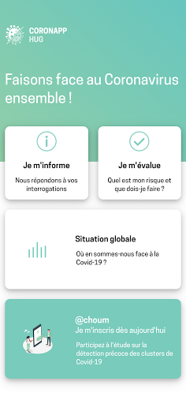  | 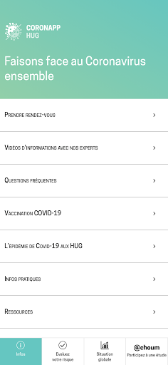  | 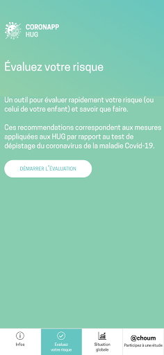  | 
 | 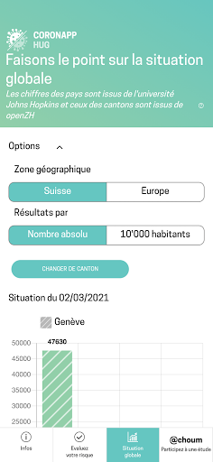  |  

## Development team
In the following we report the main information provided by the development team in the Google play store.

| | |
|-------------------------|-------------------------|
| **Developer**  | HUG Hôpitaux universitaires de Genève |
| **Website**  | [https://www.hug-ge.ch/coronavirus](https://www.hug-ge.ch/coronavirus) |
| **Email** | hopitauxuniversitairegeneve@gmail.com |
| **Physical address**  | [rue Gabrielle Perret Gentil 4 1205 Genève Suisse](https://www.google.com/maps/search/rue%20Gabrielle%20Perret%20Gentil%204%201205%20Genève%20Suisse) (Google Maps) |
| **Other developed apps**  | [https://play.google.com/store/apps/developer?id=HUG+H%C3%B4pitaux+universitaires+de+Gen%C3%A8ve](https://play.google.com/store/apps/developer?id=HUG+H%C3%B4pitaux+universitaires+de+Gen%C3%A8ve) |

## Android support

| | |
|-------------------------|-------------------------|
| **Declared target Android version**  | Pie, version 9 (API level 28) |
| **Effective target Android version**  | Pie, version 9 (API level 28) |
| **Minimum supported Android version**  | KitKat, version 4.4 - 4.4.4 (API level 19) |
| **Maximum target Android version**  | - |

The larger the difference between the minimum and maximum supported Android versions, the better. A larger difference means a wider audience. For example, old phones have a very low Android version, so a high minimum supported Android version means that the app cannot be used by users with old phones, thus leading to accessibility problems. 

## Requested permissions

In the following we report the complete list of the permissions requested by the app. 

| **Permission** | **Protection level** | **Description** | 
|-------------------------|-------------------------|-------------------------|
 **android.permission ACCESS_COARSE_LOCATION** | :warning:**Dangerous** | Allows an app to access approximate location. 
 **android.permission ACCESS_FINE_LOCATION** | :warning:**Dangerous** | Allows an app to access precise location. 
 **android.permission CALL_PHONE** | :warning:**Dangerous** | Allows an application to initiate a phone call without going through the Dialer user interface for the user to confirm the call. 
 **android.permission INTERNET** | Normal | Allows applications to open network sockets. 
 **android.permission WRITE_EXTERNAL_STORAGE** | :warning:**Dangerous** | Allows an application to write to external storage. 

## Mentioned servers

| **Server** | **Registrant** | **Registrant country** | **Creation date** | 
|-------------------------|-------------------------|-------------------------|-------------------------|
 | gstatic.com | Google LLC | :us: US | 2008-02-11 15:31:25 |

## Security analysis 

Below we report the main security warnings raised by our execution of the [Androwarn](https://github.com/maaaaz/androwarn) security analysis tool.

**Telephony identifiers leakage**
> - This application reads the device phone type value 

**Telephony services abuse**
> - This application makes phone calls 

**Suspicious connection establishment**
> - This application opens a Socket and connects it to the remote address '' on the 'N/A' port  
> - This application opens a Socket and connects it to the remote address 'Ljava/lang/StringBuilder;->toString()Ljava/lang/String;' on the ': connect, resolve' port  
> - This application opens a Socket and connects it to the remote address 'Ljava/lang/StringBuilder;->toString()Ljava/lang/String;' on the 'N/A' port  
> - This application opens a Socket and connects it to the remote address 'Ljava/net/Proxy;->type()Ljava/net/Proxy$Type;' on the 'N/A' port  
> - This application opens a Socket and connects it to the remote address 'timeout' on the 'N/A' port  

## User ratings and reviews

Below we provide information about how end users are reacting to the app in terms of ratings and reviews in the Google Play store.

### Ratings

The Coronapp-HUG app has been installed by more than **1000** times. At this time, **5** rated the app and its average score is **4.6**. Below we show the distribution of the ratings across the usual star-based rating of Google Play

:star::star::star::star::star:: 3

:star::star::star::star:: 2

:star::star::star:: 0

:star::star:: 0

:star:: 0

### Reviews 

#### 5-star reviews

No recent reviews available with 5 stars.

#### 4-star reviews

> Pratique et utile mais dommage que les données parfois datent de mars ou avril...certains points ayant changé !  :date: __2020-11-13 14:51:16__

#### 3-star reviews

No recent reviews available with 3 stars.

#### 2-star reviews

No recent reviews available with 2 stars.

#### 1-star reviews

No recent reviews available with 1 stars.

# eSanté BFC
App version ``4.2.8``

Analyzed with [covid-apps-observer](http://github.com/covid-apps-observer) project, version ``0.1``

## App overview
| | |
|-------------------------|-------------------------| 
| **Name**&nbsp;&nbsp;&nbsp;&nbsp;&nbsp;&nbsp;&nbsp;&nbsp;&nbsp;&nbsp;&nbsp;&nbsp;&nbsp;&nbsp;&nbsp;&nbsp;&nbsp;&nbsp;&nbsp;&nbsp;&nbsp;&nbsp;&nbsp;&nbsp;&nbsp;&nbsp;&nbsp;&nbsp;&nbsp;&nbsp;&nbsp;&nbsp;&nbsp;&nbsp;&nbsp;&nbsp;&nbsp;&nbsp;&nbsp;&nbsp;  | eSanté BFC |
| **Unique identifier** | fr.esantebfc.engage |
| **Link to Google Play** | [https://play.google.com/store/apps/details?id=fr.esantebfc.engage](https://play.google.com/store/apps/details?id=fr.esantebfc.engage) |
| **Summary**  | Application mobile patient - Bourgogne-Franche-Comté |
| **Privacy policy** | [https://www.esante-bourgogne.fr/](https://www.esante-bourgogne.fr/) |
| **Latest version** | 4.2.8 |
| **Last update** | 2020-03-14 19:52:11 |
| **Recent changes** | Application mobile à destination des patients pour la région Bourgogne-Franche-Comté |
| **Installs**  | 1 000+ |
| **Category** | Médecine |
| **First release** | 14 mars 2020 |
| **Size**  | 32M |
| **Supported Android version**  | 4.4W ou version ultérieure |

### Description
> Application mobile à destination des patients pour la région Bourgogne-Franche-Comté

### User interface
The developers of the app provide the following screenshots in the Google play store.
| | | |
|:-------------------------:|:-------------------------:|:-------------------------:|
 |   |   |   | 

## Development team
In the following we report the main information provided by the development team in the Google play store.

| | |
|-------------------------|-------------------------|
| **Developer**  | GRADES BFC |
| **Website**  | [https://www.esante-bourgogne.fr/](https://www.esante-bourgogne.fr/) |
| **Email** | contact@esante-bourgogne.fr |
| **Physical address**  | - |
| **Other developed apps**  | [https://play.google.com/store/apps/developer?id=GRADES+BFC](https://play.google.com/store/apps/developer?id=GRADES+BFC) |

## Android support

| | |
|-------------------------|-------------------------|
| **Declared target Android version**  | Pie, version 9 (API level 28) |
| **Effective target Android version**  | Pie, version 9 (API level 28) |
| **Minimum supported Android version**  | KitKat W, version 4.4W - 4.4.4W (API level 20) |
| **Maximum target Android version**  | - |

The larger the difference between the minimum and maximum supported Android versions, the better. A larger difference means a wider audience. For example, old phones have a very low Android version, so a high minimum supported Android version means that the app cannot be used by users with old phones, thus leading to accessibility problems. 

## Requested permissions

In the following we report the complete list of the permissions requested by the app. 

| **Permission** | **Protection level** | **Description** | 
|-------------------------|-------------------------|-------------------------|
 **android.permission ACCESS_COARSE_LOCATION** | :warning:**Dangerous** | Allows an app to access approximate location. 
 **android.permission ACCESS_FINE_LOCATION** | :warning:**Dangerous** | Allows an app to access precise location. 
 **android.permission ACCESS_NETWORK_STATE** | Normal | Allows applications to access information about networks. 
 **android.permission CAMERA** | :warning:**Dangerous** | Required to be able to access the camera device. 
 **android.permission FLASHLIGHT** | - | - 
 **android.permission INTERNET** | Normal | Allows applications to open network sockets. 
 **android.permission READ_APP_BADGE** | - | - 
 **android.permission READ_EXTERNAL_STORAGE** | :warning:**Dangerous** | Allows an application to read from external storage. 
 **android.permission VIBRATE** | Normal | Allows access to the vibrator. 
 **android.permission WAKE_LOCK** | Normal | Allows using PowerManager WakeLocks to keep processor from sleeping or screen from dimming. 
 **android.permission WRITE_EXTERNAL_STORAGE** | :warning:**Dangerous** | Allows an application to write to external storage. 
 **com.anddoes.launcher.permission UPDATE_COUNT** | - | - 
 **com.google.android.c2dm.permission RECEIVE** | - | - 
 **com.htc.launcher.permission READ_SETTINGS** | - | - 
 **com.htc.launcher.permission UPDATE_SHORTCUT** | - | - 
 **com.huawei.android.launcher.permission CHANGE_BADGE** | - | - 
 **com.huawei.android.launcher.permission READ_SETTINGS** | - | - 
 **com.huawei.android.launcher.permission WRITE_SETTINGS** | - | - 
 **com.majeur.launcher.permission UPDATE_BADGE** | - | - 
 **com.oppo.launcher.permission READ_SETTINGS** | - | - 
 **com.oppo.launcher.permission WRITE_SETTINGS** | - | - 
 **com.sec.android.provider.badge.permission READ** | - | - 
 **com.sec.android.provider.badge.permission WRITE** | - | - 
 **com.sonyericsson.home.permission BROADCAST_BADGE** | - | - 
 **com.sonymobile.home.permission PROVIDER_INSERT_BADGE** | - | - 
 **fr.esantebfc.engage.permission C2D_MESSAGE** | - | - 
 **me.everything.badger.permission BADGE_COUNT_READ** | - | - 
 **me.everything.badger.permission BADGE_COUNT_WRITE** | - | - 

## Mentioned servers

| **Server** | **Registrant** | **Registrant country** | **Creation date** | 
|-------------------------|-------------------------|-------------------------|-------------------------|
 | googlesyndication.com | Google LLC | :us: US | 2003-01-21 06:17:24 |
 | google.com | Google LLC | :us: US | 1997-09-15 04:00:00 |
 | app-measurement.com | Google LLC | :us: US | 2015-06-19 20:13:31 |
 | appspot.com | Google LLC | :us: US | 2005-03-10 02:27:55 |
 | gstatic.com | Google LLC | :us: US | 2008-02-11 15:31:25 |
 | googleapis.com | Google LLC | :us: US | 2005-01-25 17:52:26 |

## Security analysis 

Below we report the main security warnings raised by our execution of the [Androwarn](https://github.com/maaaaz/androwarn) security analysis tool.

**Connection interfaces exfiltration**
> - This application reads details about the currently active data network 
> - This application tries to find out if the currently active data network is metered 

**Telephony services abuse**
> - This application makes phone calls 

**Pim data leakage**
> - This application accesses the downloads folder 
> - This application accesses data stored in the clipboard 

**Code execution**
> - This application executes a UNIX command 
> - This application executes a UNIX command containing this argument: 'Ljava/lang/StringBuilder;->toString()Ljava/lang/String;' 

## User ratings and reviews

Below we provide information about how end users are reacting to the app in terms of ratings and reviews in the Google Play store.

### Ratings

The eSanté BFC app has been installed by more than **1000** times. At this time, **-** rated the app and its average score is **0.0**. Below we show the distribution of the ratings across the usual star-based rating of Google Play

:star::star::star::star::star:: 0

:star::star::star::star:: 0

:star::star::star:: 0

:star::star:: 0

:star:: 0

### Reviews 

#### 5-star reviews

No recent reviews available with 5 stars.

#### 4-star reviews

No recent reviews available with 4 stars.

#### 3-star reviews

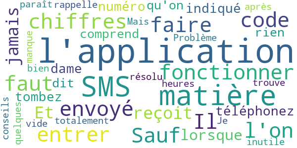

> Il faut entrer un code à 4 chiffres envoyé par SMS pour faire fonctionner l'application . Sauf que l'on ne reçoit jamais de sms. Et lorsque vous téléphonez au numéro indiqué vous tombez sur une dame qui ne comprend rien et dit qu'on vous rappelle. Problème résolu après quelques heures. Mais l'application est totalement inutile  :date: __2020-12-06 20:38:23__

> Je trouve l'application bien en matière de conseils mais elle me paraît vide et manque de matière  :date: __2020-11-26 19:46:55__

#### 2-star reviews

No recent reviews available with 2 stars.

#### 1-star reviews

> Cette application ne sert à rien Juste vous faire croire que vous êtes suivis Vous répondez à des questions bien définies, si vous avez d'autres interrogations vous ne pouvez pas poser vos questions. Complètement nul!!!  :date: __2020-11-17 08:26:06__

# KANOPEE
App version ``6``

Analyzed with [covid-apps-observer](http://github.com/covid-apps-observer) project, version ``0.1``

## App overview
| | |
|-------------------------|-------------------------| 
| **Name**&nbsp;&nbsp;&nbsp;&nbsp;&nbsp;&nbsp;&nbsp;&nbsp;&nbsp;&nbsp;&nbsp;&nbsp;&nbsp;&nbsp;&nbsp;&nbsp;&nbsp;&nbsp;&nbsp;&nbsp;&nbsp;&nbsp;&nbsp;&nbsp;&nbsp;&nbsp;&nbsp;&nbsp;&nbsp;&nbsp;&nbsp;&nbsp;&nbsp;&nbsp;&nbsp;&nbsp;&nbsp;&nbsp;&nbsp;&nbsp;  | KANOPEE |
| **Unique identifier** | com.sanpsy.kanopee |
| **Link to Google Play** | [https://play.google.com/store/apps/details?id=com.sanpsy.kanopee](https://play.google.com/store/apps/details?id=com.sanpsy.kanopee) |
| **Summary**  | Dépistage et suivis sur les troubles du sommeil et les comportements addictifs |
| **Privacy policy** | [http://www.sanpsy.univ-bordeauxsegalen.fr/consentement%20RGPD_application-Kanopee_Store.pdf](http://www.sanpsy.univ-bordeauxsegalen.fr/consentement%20RGPD_application-Kanopee_Store.pdf) |
| **Latest version** | 6 |
| **Last update** | 2020-12-01 19:52:32 |
| **Recent changes** | - ajout de questions sur la présence de symptômes associés à la COVID-19  - ajout de 2 questionnaires réguliers évaluant la fatigue et le moral  - ajout d&#39;une mesure quotidienne de l&#39;activité physique dans l&#39;agenda de sommeil  - adaptation des interfaces pour présenter à l&#39;utilisateur les nouvelles données collectées - Correction bugs mineurs |
| **Installs**  | 1 000+ |
| **Category** | Médecine |
| **First release** | 10 avr. 2020 |
| **Size**  | 86M |
| **Supported Android version**  | 4.4 ou version ultérieure |

### Description
> L’épidémie de COVID-19 impacte nos habitudes de vie et nos rythmes biologiques. Le confinement et le stress actuel ont pu particulièrement fragiliser notre sommeil et modifier nos consommations d’alcool et de tabac, ce qui peut avoir des conséquences psychologiques négatives à moyen et long terme.
  
 Dans ce contexte, l’unité SANPSY, le CHU de Bordeaux et l'université de Bordeaux, ont développé une application permettant de dépister des troubles du sommeil et d’évaluer sa consommation d’alcool et de tabac, afin de proposer un suivi et des recommandations personnalisées pour mieux maitriser son sommeil et ses consommations.
 Vous souhaitez savoir où vous en êtes avec votre sommeil et vos consommations pour mieux affronter les problèmes actuels liés aux déconfinement ? 
 Discutez avec Louise et Jeanne, nos deux compagnons virtuels, pour un bilan rapide de vos consommations et/ou de votre sommeil. 
 En fonction de vos réponses, des solutions personnalisées pour maîtriser vos consommations, et améliorer la qualité de votre sommeil vous seront proposées : des  conseils personnalisés à mettre en place et des outils de suivis (agenda de sommeil et agenda de consommations).
 Vous pourrez ensuite discuter de manière régulière avec Louise et Jeanne pour évaluer ensemble l'évolution de votre sommeil et de vos consommations.
 Si, malgré cet accompagnement, votre consommation ou votre sommeil vous posent toujours problème, nous vous mettrons en lien avec un professionnel de santé de Nouvelle Aquitaine ou nous vous donnerons des contacts pour être pris en charge pour les autres régions afin de vous accompagner. 
 Pensez bien à suivre nos conseils qui mis en application peuvent vous permettre d’améliorer considérablement votre qualité de vie.

### User interface
The developers of the app provide the following screenshots in the Google play store.
| | | |
|:-------------------------:|:-------------------------:|:-------------------------:|
 |   |   |   | 
 | 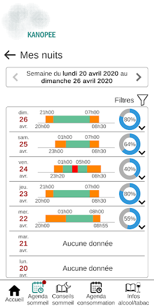  | 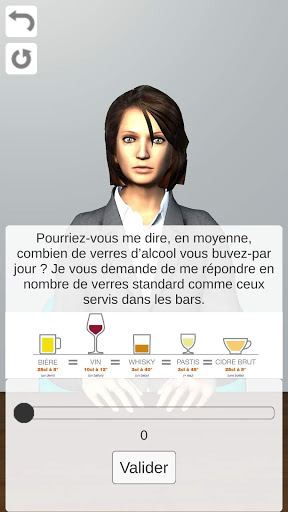  | 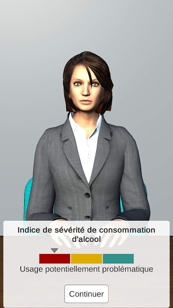  | 
 | 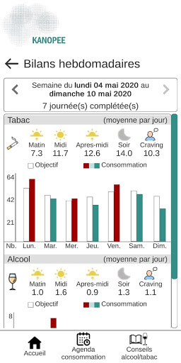  | 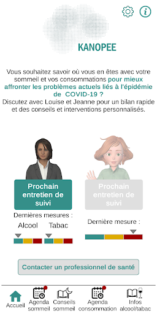 

## Development team
In the following we report the main information provided by the development team in the Google play store.

| | |
|-------------------------|-------------------------|
| **Developer**  | SANPSY |
| **Website**  | [http://www.sanpsy.univ-bordeauxsegalen.fr/](http://www.sanpsy.univ-bordeauxsegalen.fr/) |
| **Email** | kanopee@u-bordeaux.fr |
| **Physical address**  | [Unité de Service et de Recherche USR 3413 SANPSY Hôpital et Université de Bordeaux CHU Pellegrin, Tripode 13ᵉ étage, aile 3 Place Amélie- Raba-Léon 33076 Bordeaux cédex](https://www.google.com/maps/search/Unité%20de%20Service%20et%20de%20Recherche%20USR%203413%20SANPSY%20Hôpital%20et%20Université%20de%20Bordeaux%20CHU%20Pellegrin,%20Tripode%2013ᵉ%20étage,%20aile%203%20Place%20Amélie-%20Raba-Léon%2033076%20Bordeaux%20cédex) (Google Maps) |
| **Other developed apps**  | [https://play.google.com/store/apps/developer?id=SANPSY](https://play.google.com/store/apps/developer?id=SANPSY) |

## Android support

| | |
|-------------------------|-------------------------|
| **Declared target Android version**  | - |
| **Effective target Android version**  | - |
| **Minimum supported Android version**  | KitKat, version 4.4 - 4.4.4 (API level 19) |
| **Maximum target Android version**  | - |

The larger the difference between the minimum and maximum supported Android versions, the better. A larger difference means a wider audience. For example, old phones have a very low Android version, so a high minimum supported Android version means that the app cannot be used by users with old phones, thus leading to accessibility problems. 

## Requested permissions

In the following we report the complete list of the permissions requested by the app. 

| **Permission** | **Protection level** | **Description** | 
|-------------------------|-------------------------|-------------------------|
 **android.permission BLUETOOTH** | Normal | Allows applications to connect to paired bluetooth devices. 
 **android.permission BROADCAST_STICKY** | Normal | Allows an application to broadcast sticky intents. 
 **android.permission INTERNET** | Normal | Allows applications to open network sockets. 
 **android.permission MODIFY_AUDIO_SETTINGS** | Normal | Allows an application to modify global audio settings. 
 **android.permission RECEIVE_BOOT_COMPLETED** | Normal | Allows an application to receive the Intent.ACTION_BOOT_COMPLETED that is broadcast after the system finishes booting. 
 **android.permission RECORD_AUDIO** | :warning:**Dangerous** | Allows an application to record audio. 

## Mentioned servers

| **Server** | **Registrant** | **Registrant country** | **Creation date** | 
|-------------------------|-------------------------|-------------------------|-------------------------|
-

## Security analysis 

Below we report the main security warnings raised by our execution of the [Androwarn](https://github.com/maaaaz/androwarn) security analysis tool.

**Connection interfaces exfiltration**
> - This application reads details about the currently active data network 
> - This application tries to find out if the currently active data network is metered 

**Pim data leakage**
> - This application accesses data stored in the clipboard 

**Code execution**
> - This application loads a native library 
> - This application loads a native library: 'main' 

## User ratings and reviews

Below we provide information about how end users are reacting to the app in terms of ratings and reviews in the Google Play store.

### Ratings

The KANOPEE app has been installed by more than **1000** times. At this time, **34** rated the app and its average score is **3.8235295**. Below we show the distribution of the ratings across the usual star-based rating of Google Play

:star::star::star::star::star:: 15

:star::star::star::star:: 8

:star::star::star:: 5

:star::star:: 2

:star:: 4

### Reviews 

#### 5-star reviews

> Tip-Top👍🤩🙋🏻‍♂  :date: __2021-02-20 15:35:34__

> Excellente application pour faire le point sur son sommeil et reprendre de bonnes habitudes, et un grand merci aux médecins et aux concepteurs pour le développement de cet outil.  :date: __2021-01-04 12:08:42__

> Manquent les cigarettes électroniques pour le tabagisme. Ne fonctionne pas pour les réveils après 12h00.  :date: __2020-06-29 14:10:19__

> Facile à utiliser Permet de faire le point et d'avoir des conseils. Les personnages sont sympathiques.  :date: __2020-05-26 21:08:06__

> Ces supers  :date: __2020-05-06 14:43:43__

> Très bonne appli qui permet de suivre son sommeil. Leur conseil est utile  :date: __2020-04-29 14:36:15__

#### 4-star reviews

> Application très complète seul bemol Pas de possibilité de revnir en arrière si on se teompe.  :date: __2020-12-23 15:07:46__

> Bien mais !!! Si on se trompe sur les données entrée pas moyen de modifié très dommage  :date: __2020-09-15 14:29:27__

> Application fonctionnel. Je trouve juste dommage d'avoir alourdi l'application avec de la 3D qui n'apporte pas grand chose...  :date: __2020-06-23 23:25:34__

> Pour le sommeil c'est intéressant. Juste un bémol : c'est dommage de ne pas proposer des modifications des données. J'ai mal compris l'agenda ce matin. J'ai voulu noter mes horaires de cette nuit, ça me les a datées sur une date antérieure.... Sinon je suis curieuse de voir la suite  :date: __2020-06-03 09:34:35__

> Bien. Juste dommage que l'agenda des consommations ne soit pas intégré au truc. Avec possibilité de le remplir en ligne via l'appli...  :date: __2020-05-13 21:28:20__

> Application utile et agréable, la voix utilisée est parfaite. Pour le contenu, il faudrait juste prendre en compte par exemple que certains ne consomment que peu voir pas du tout la semaine et explosent le compteur le weekend 😅  :date: __2020-05-13 10:37:43__

> Une bonne application pour évaluer le degré de sévérité de ses troubles du sommeil, avant un véritable diagnostic. Elle propose de remplir un agenda du sommeil sur sept jours. En revanche, la partie sur la consommation de tabac et d'alcool est moins au point... Je ne fume pas mais j'ai consommé quelques cigarettes avec des amis, à de rares occasions. Et à partir de mes réponses, Jeanne a estimé que ma consommation de tabac était problématique et que je devais vite arrêter !  :date: __2020-05-03 16:27:10__

#### 3-star reviews

> Dommage qu'il ne soit pas possible de modifier la saisie si on a fait une erreur, et qu'il ne soit pas possible d'ajouter de commentaires par nuit pour savoir ce qu'il s'est passé dans la soirée (consommation d'excitant...) et les raisons des réveils  :date: __2021-03-17 11:17:58__

> Bien mais à améliorer. Dommage de ne pas pouvoir ajouter des commentaires lors de la saisie des nuits (raison des réveils nocturnes par ex). Conseils très simples et déjà connus pour les personnes souffrant de troubles du sommeil. Rien sur les hypersomnies, je dors beaucoup, apparemment bien mais je suis toujours fatiguée, aucune réponse ou proposition dans l'application, dommage. Un lien vers une prise de consultation avec un praticien serait intéressant (en visio ou physique).  :date: __2020-12-23 09:26:03__

> L'application vient de se bloquer aprés le 2nd entretien. Je n'ai donc pas eu le CR de l'analyse des données sur 7 nuits et des réponses au 2nd entretien. L'avatar reste à l'écran et plus rien ne se produit. Dommage. Je retenterai peut être en désinstallant puis en la réinstallant  :date: __2020-12-13 15:21:53__

> Très bonne idée que de pouvoir s'auto évaluer sans craintes de jugements! Malheureusement, lorsque l'on travail de nuit les réponses pouvant être apportés sont limités. Par exemple, concernant le sommeil, je ne peux aller au delà de 14h pour le réveil et le levé... c'est dommage. Nous sommes tellement nombreux à souffrir de trouble du sommeil et à vivre sur ce rythme inversé.  :date: __2020-12-07 09:53:15__

> Trop long  :date: __2020-11-29 19:34:58__

> Pas mal  :date: __2020-08-10 08:22:16__

> Il est dommage que l'on ne puisse pas marquer que on se réveille après midi.. C'est mon cas et du coup ça fausse mes résultats et ne peux pas m'aider.  :date: __2020-06-24 16:40:57__

> Bonjour, je ne trouve pas l'accès à la saisie dans l'agenda journalier des consommations, pouvez-vous m'éclairer ?  :date: __2020-05-07 21:39:49__

#### 2-star reviews

> Vous faites un recensement covid ou quoi ? Et les sous-titres pour les sourds ? Bugs de fonctionnement... Etc etc...  :date: __2021-04-10 12:59:24__

> Pour le tabagisme, peut-être faudrait-il prendre en compte le sevrage tabagique, par exemple, c'est mon cas depuis plus d'un an, je vape avec nicotine et je ne cesse d'augmenter le taux. Je sais que c'est le tabac et la fumée qui sont nocifs, mais je suis très souvent sur ma vape pour avoir "ma dose"  :date: __2021-03-28 13:29:52__

> Permet de faire un suivi sommeil, consommation tabac et alcool. Les conseils sont généralistes (température chambre, limiter la conso café etc) mais ne semble pas relever les anomalies évidentes (sommeil fractionné par exemple) ni conseil associé. Bug sur le suivi conso tabac au bout d'une semaine : lors de l'entretien, impossible de renseigner le niveau d'évaluation (entre 1 et 7) pour la première question.  :date: __2020-12-22 21:54:42__

> Appli très intéressante sur les données du sommeil. Par contre plantage au moment des conseils pour améliorer son sommeil. Re-essai plusieurs fois mais sans succès. Dommage car c'est ce que j'attendais le plus.  :date: __2020-12-14 14:14:19__

> Bonne idée mais on ne peut pas corriger les données quand on fait une erreur de saisie 😭😭  :date: __2020-12-09 21:55:32__

> L'idée est bonne. L'appli pourrait être plus développée. Si on oublie ou on se trompe dans les données de consommation impossible de modifier et de revenir en arrière. Tout est alors faussé. Dommage  :date: __2020-10-17 11:04:59__

> Première impression mauvaise L'assistant virtuel est très bien fait mais deux choses me gênent - on entre ses horaires de sommeil mais les périodes de réveil pendant la nuit sont limitées à une heure par nuit - l'application ne se ferme pas quand on clique sur "revenir en arrière", il n'y a pas de moyen pour sortir de cette appli  :date: __2020-06-24 07:34:38__

#### 1-star reviews

> Idée intéressante mais outil inabouti. Impossible de saisir correctement les heures de sommeil.  :date: __2021-04-11 11:19:25__

> Trop long, impossible de quitter, sachez qu'on ne note pas la durée pendant laquelle on est reveillé en cours de nuit, on attend 'simplement' de pouvoir se rendormir...ou alors il faut regarder son reveil....pas top...  :date: __2021-03-17 07:00:32__

> Problème de fonctionnement, dès que j'arrive à la page ou je dois donner des infos sur les horaires de coucher, lever.. je ne peux plus rien faire il est impossible de noter quoi que ce soit, malgré désinstallation et réinstallation.  :date: __2020-12-25 09:10:53__

> Mon commentaire ayant été supprimé, je le remets : pendant 8 matin, j'ai rempli scrupuleusement le questionnaire Au bout de ces 8 jours, le petit avatar conseillé de faire le point sur mes nuits, Oui et ? Rien, aucun conseil, aucune conclusion virtuelle de l'analyse, juste une récap de mes nuits Cette appli ne sert absolument à rien  :date: __2020-12-14 14:19:42__

> Je viens de terminer une semaine de suivi du sommeil et suis très déçu par les conseils. Rien de nouveau par rapport à la littérature journalistique : proposer en septembre une chambre entre18 et 20° quand la température de nuit, fenêtres ouvertes, ne descendent pas sous 22° c'est juste inapproprié. Respirer par le ventre OK on sais déjà. Pas de café apres 14h00 quelle nouveauté ! Une arnaque déguisée par le CHU de Bordeaux.  :date: __2020-09-21 22:25:13__

> Impossible d entrée les horaires  :date: __2020-05-15 12:07:54__

> Plutôt inutile  :date: __2020-05-06 18:20:29__

> Ne sert strictement à rien pour les gens qui ont un réel problème de sommeil ! Donne juste des conseils que j'applique déjà  :date: __2020-05-02 14:14:38__

# Credits

This project makes use of the following main third-party projects:
* Androguard: [https://github.com/androguard/androguard](https://github.com/androguard/androguard)
* Androwarn: [https://github.com/maaaaz/androwarn](https://github.com/maaaaz/androwarn)
* google_play_scraper: [https://github.com/JoMingyu/google-play-scraper](https://github.com/JoMingyu/google-play-scraper)
* whois: [https://github.com/DannyCork/python-whois](https://github.com/DannyCork/python-whois)
* BeautifulSoup: [https://www.crummy.com/software/BeautifulSoup](https://www.crummy.com/software/BeautifulSoup)

Other open-source projects used in this project include: 

- androguard==3.3.5
- appnope==0.1.0
- asn1crypto==1.3.0
- backcall==0.1.0
- beautifulsoup4==4.9.0
- bs4==0.0.1
- certifi==2020.4.5.1
- cffi==1.14.0
- chardet==3.0.4
- click==7.1.2
- colorama==0.4.3
- cryptography==2.9.2
- cycler==0.10.0
- decorator==4.4.2
- future==0.18.2
- google-play-scraper==0.1.1
- idna==2.9
- ipython==7.13.0
- ipython-genutils==0.2.0
- jedi==0.17.0
- Jinja2==2.11.2
- joblib==0.14.1
- kiwisolver==1.2.0
- lxml==4.5.0
- MarkupSafe==1.1.1
- matplotlib==3.2.1
- networkx==2.4
- nltk==3.5
- numpy==1.18.3
- parso==0.7.0
- pexpect==4.8.0
- pickleshare==0.7.5
- Pillow==7.1.2
- play-scraper==0.6.0
- prompt-toolkit==3.0.5
- ptyprocess==0.6.0
- pycountry==19.8.18
- pycparser==2.20
- pydot==1.4.1
- Pygments==2.6.1
- pyOpenSSL==19.1.0
- pyparsing==2.4.7
- python-dateutil==2.8.1
- regex==2020.4.4
- requests==2.23.0
- requests-futures==1.0.0
- six==1.14.0
- soupsieve==2.0
- tld==0.12.1
- tqdm==4.45.0
- traitlets==4.3.3
- urllib3==1.25.9
- wcwidth==0.1.9
- wordcloud==1.7.0

