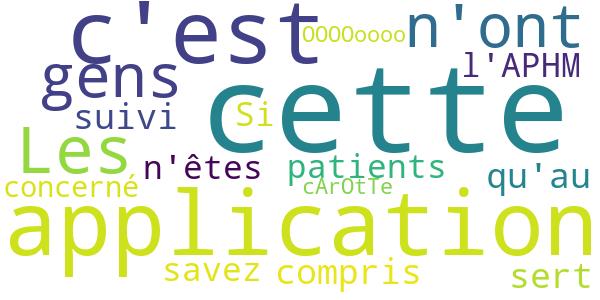
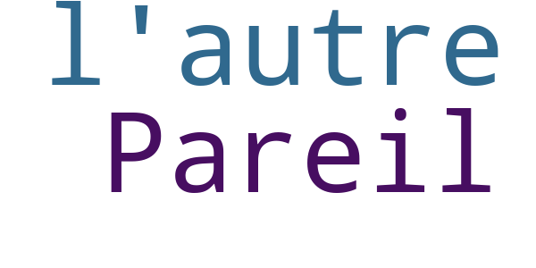

# COVID AP-HM
App version ``1.2.0``

Analyzed with [covid-apps-observer](http://github.com/covid-apps-observer) project, version ``0.1``

## App overview
| | |
|-------------------------|-------------------------| 
| **Name**&nbsp;&nbsp;&nbsp;&nbsp;&nbsp;&nbsp;&nbsp;&nbsp;&nbsp;&nbsp;&nbsp;&nbsp;&nbsp;&nbsp;&nbsp;&nbsp;&nbsp;&nbsp;&nbsp;&nbsp;&nbsp;&nbsp;&nbsp;&nbsp;&nbsp;&nbsp;&nbsp;&nbsp;&nbsp;&nbsp;&nbsp;&nbsp;&nbsp;&nbsp;&nbsp;&nbsp;&nbsp;&nbsp;&nbsp;&nbsp;  | COVID AP-HM |
| **Unique identifier** | com.ambulis.aphm.covid |
| **Link to Google Play** | [https://play.google.com/store/apps/details?id=com.ambulis.aphm.covid](https://play.google.com/store/apps/details?id=com.ambulis.aphm.covid) |
| **Summary**  | Suivi COVID-19 de l&#39;AP-HM |
| **Privacy policy** | [http://domicalis.com/legal/cgu-covid_aphm-android.pdf](http://domicalis.com/legal/cgu-covid_aphm-android.pdf) |
| **Latest version** | 1.2.0 |
| **Last update** | 2020-03-15 02:24:44 |
| **Recent changes** | Corrections de bugs et amélioration des performances. |
| **Installs**  | 10 000+ |
| **Category** | Médecine |
| **First release** | 14 mars 2020 |
| **Size**  | 4,1M |
| **Supported Android version**  | 4.1 ou version ultérieure |

### Description
> *** L'application COVID AP-HM est réservée aux patients suivis par l'AP-HM 
  Assistance Publique - Hôpitaux de Marseille ***
 L’application de l’AP-HM pour visualiser et compléter son suivi COVID-19 directement depuis un mobile pour les personnes confirmées ou co-exposées au coronavirus et dont l'état ne présente pas de danger immédiat.
 RAPPEL - Un numéro vert répond à vos questions sur le Coronavirus COVID-19 en permanence, 24h/24 et 7j/7 : 
 => 0 800 130 000 (appel gratuit) <=
 Solution sécurisée pour garantir la protection des données à caractère personnel, l’application COVID AP-HM repose sur une technologie de l’information et de la communication sans fil au profit des personnes nécessitant un suivi médical après un contact potentiel avec le coronavirus SARS-CoV-2.
 En tant que personnes confirmées ou co-exposées au COVID-19, vous pouvez ainsi mieux appréhender votre suivi en toute autonomie grâce à la prise de constantes, aux conseils et aux formulaires mis au point par les équipes de l’AP-HM .
 COVID AP-HM, c'est :
 - Un outil pour améliorer votre prise en charge en facilitant la communication avec l’établissement
 - Des mesures et un suivi 100% numériques
 - Une interface moderne, rapide et intuitive, facile à prendre en main

### User interface
The developers of the app provide the following screenshots in the Google play store.
| | | |
|:-------------------------:|:-------------------------:|:-------------------------:|
 |   |   |   | 
 |   |   |   | 
 |   |  

## Development team
In the following we report the main information provided by the development team in the Google play store.

| | |
|-------------------------|-------------------------|
| **Developer**  | RADHIUS |
| **Website**  | [http://www.domicalis.com](http://www.domicalis.com) |
| **Email** | contact@domicalis.com |
| **Physical address**  | - |
| **Other developed apps**  | [https://play.google.com/store/apps/developer?id=RADHIUS](https://play.google.com/store/apps/developer?id=RADHIUS) |

## Android support

| | |
|-------------------------|-------------------------|
| **Declared target Android version**  | Pie, version 9 (API level 28) |
| **Effective target Android version**  | Pie, version 9 (API level 28) |
| **Minimum supported Android version**  | Jelly Bean, version 4.1.x (API level 16) |
| **Maximum target Android version**  | - |

The larger the difference between the minimum and maximum supported Android versions, the better. A larger difference means a wider audience. For example, old phones have a very low Android version, so a high minimum supported Android version means that the app cannot be used by users with old phones, thus leading to accessibility problems. 

## Requested permissions

In the following we report the complete list of the permissions requested by the app. 

| **Permission** | **Protection level** | **Description** | 
|-------------------------|-------------------------|-------------------------|
 **android.permission ACCESS_NETWORK_STATE** | Normal | Allows applications to access information about networks. 
 **android.permission INTERNET** | Normal | Allows applications to open network sockets. 
 **android.permission WAKE_LOCK** | Normal | Allows using PowerManager WakeLocks to keep processor from sleeping or screen from dimming. 
 **android.permission WRITE_EXTERNAL_STORAGE** | :warning:**Dangerous** | Allows an application to write to external storage. 
 **com.google.android.c2dm.permission RECEIVE** | - | - 
 **com.google.android.finsky.permission BIND_GET_INSTALL_REFERRER_SERVICE** | - | - 
 **com.google.android.providers.gsf.permission READ_GSERVICES** | - | - 

## Mentioned servers

| **Server** | **Registrant** | **Registrant country** | **Creation date** | 
|-------------------------|-------------------------|-------------------------|-------------------------|
 | google.com | Google LLC | :us: US | 1997-09-15 04:00:00 |
 | app-measurement.com | Google LLC | :us: US | 2015-06-19 20:13:31 |
 | googlesyndication.com | Google LLC | :us: US | 2003-01-21 06:17:24 |
 | googleapis.com | Google LLC | :us: US | 2005-01-25 17:52:26 |

## Security analysis 

Below we report the main security warnings raised by our execution of the [Androwarn](https://github.com/maaaaz/androwarn) security analysis tool.

**Connection interfaces exfiltration**
> - This application reads details about the currently active data network 
> - This application tries to find out if the currently active data network is metered 

**Telephony services abuse**
> - This application makes phone calls 

## User ratings and reviews

Below we provide information about how end users are reacting to the app in terms of ratings and reviews in the Google Play store.

### Ratings

The COVID AP-HM app has been installed by more than **10000** times. At this time, **23** rated the app and its average score is **3.2173913**. Below we show the distribution of the ratings across the usual star-based rating of Google Play

:star::star::star::star::star:: 11

:star::star::star::star:: 0

:star::star::star:: 3

:star::star:: 1

:star:: 8

### Reviews 

#### 5-star reviews

> Bonne maniabilité du jeu ça donne envie de gagner  :date: __2021-07-18 19:38:58__

> Très bien  :date: __2020-07-28 11:28:23__

> Troger noel  :date: __2020-07-05 14:03:49__

> dd  :date: __2020-05-09 21:36:25__

> Très bien  :date: __2020-04-10 20:58:40__

#### 4-star reviews

> Les gens n'ont pas compris que cette application ne sert qu'au suivi des patients de l'APHM. Si vous ne savez pas ce que c'est c'est que vous n'êtes pas concerné par cette application.  :date: __2020-09-21 22:23:01__

> OOOOoooo i'm A cArOtTe  :date: __2020-09-10 14:14:34__

#### 3-star reviews

> C'est Bon  :date: __2020-06-02 14:26:24__

> À voir  :date: __2020-04-05 23:13:29__

#### 2-star reviews

> Pareil que l'autre  :date: __2020-08-11 02:14:19__

#### 1-star reviews

> Impossible entre application tous anti covid  :date: __2021-07-21 18:04:38__

> de quelle numéro de dossier s'agît il?????application non adaptée à mon smartphone merci de répondre à cette question  :date: __2021-05-22 11:05:54__

> Quel est donc le numéro de dossier qu'il faut renseigner sur l'application ? Les étiquettes aphm que l'on m'a délivrées pour effectuer le test comportent deux séries de chiffres dont aucun n'est accepté comme numéro de dossier. Il n'a a aucune explication qui permette de trouver ce numéro de dossier. L'application ne me sert donc pas.  :date: __2021-05-12 12:24:24__

> Application nuls 0n nous demande un numéro de dossier que l'on n'a pas  :date: __2021-01-12 11:37:33__

> Cette application est nul. On me demande un numéro de dossier que je n'ai pas. Je ne vous conseille vraiment pas cette application !  :date: __2020-12-22 20:06:01__

> Ons me demande un numéro de dossier, mais lequel? Vous pouvez au moins expliquer! Et après ons nous dit que c'est obligatoire  :date: __2020-11-30 11:36:04__

> Nullissime !  :date: __2020-11-21 10:39:39__

> C'est que des quons .ils veulent toute les infos même le compte banquere pour remplire les poches de macron .  :date: __2020-07-19 10:47:24__

> rien ne marche . pas adapté à mon appareil. On me demande un numéro de dossier sans explication derrière...? Bref c'est nul  :date: __2020-06-02 22:14:05__

> J'ai pas de numéro de dossier?  :date: __2020-06-02 16:38:05__

