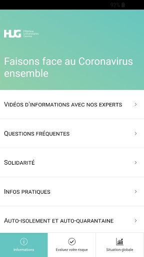
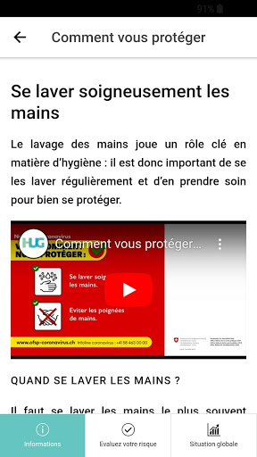
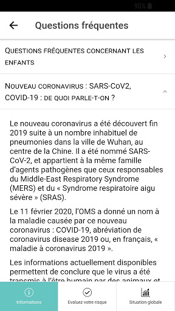
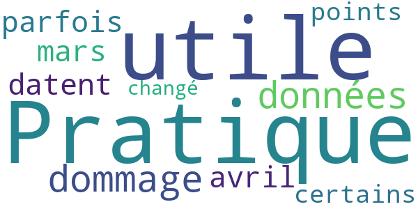

# Coronapp-HUG
App version ``0.0.54``

Analyzed with [covid-apps-observer](http://github.com/covid-apps-observer) project, version ``0.1``

## App overview
| | |
|-------------------------|-------------------------| 
| **Name**&nbsp;&nbsp;&nbsp;&nbsp;&nbsp;&nbsp;&nbsp;&nbsp;&nbsp;&nbsp;&nbsp;&nbsp;&nbsp;&nbsp;&nbsp;&nbsp;&nbsp;&nbsp;&nbsp;&nbsp;&nbsp;&nbsp;&nbsp;&nbsp;&nbsp;&nbsp;&nbsp;&nbsp;&nbsp;&nbsp;&nbsp;&nbsp;&nbsp;&nbsp;&nbsp;&nbsp;&nbsp;&nbsp;&nbsp;&nbsp;  | Coronapp-HUG |
| **Unique identifier** | com.hug_ge.coronapp |
| **Link to Google Play** | [https://play.google.com/store/apps/details?id=com.hug_ge.coronapp](https://play.google.com/store/apps/details?id=com.hug_ge.coronapp) |
| **Summary**  | Application visant à informer les patients et citoyens sur le coronavirus. |
| **Privacy policy** | [http://pedamines.com/coronapp/disclaimer.html](http://pedamines.com/coronapp/disclaimer.html) |
| **Latest version** | 0.0.54 |
| **Last update** | 2021-01-18 11:10:47 |
| **Recent changes** | Test module @choum, seulement disponible pour les entreprises enrôlées, corrections orthographe |
| **Installs**  | 500+ |
| **Category** | Médecine |
| **First release** | 12 mars 2020 |
| **Size**  | 18M |
| **Supported Android version**  | 4.4 ou version ultérieure |

### Description
> Coronapp est une application des HUG (Hôpitaux universitaires de Genève) visant à informer les patients et les citoyens sur les bonnes attitude à adopter face au Coronavirus
 Fonctionnalités:
  - Informations sur le coronavirus et des bonnes pratiques à adopter face à celui-ci, provenant de l'OFSP (Office fédéral de la santé publique) et du site https://www.hug-ge.ch/coronavirus
  - Information en temps réel sur l’évolution du nombre de cas en suisse

### User interface
The developers of the app provide the following screenshots in the Google play store.
| | | |
|:-------------------------:|:-------------------------:|:-------------------------:|
 |   |   |   | 
 |   |  

## Development team
In the following we report the main information provided by the development team in the Google play store.

| | |
|-------------------------|-------------------------|
| **Developer**  | HUG Hôpitaux universitaires de Genève |
| **Website**  | [https://www.hug-ge.ch/coronavirus](https://www.hug-ge.ch/coronavirus) |
| **Email** | hopitauxuniversitairegeneve@gmail.com |
| **Physical address**  | [rue Gabrielle Perret Gentil 4 1205 Genève Suisse](https://www.google.com/maps/search/rue%20Gabrielle%20Perret%20Gentil%204%201205%20Genève%20Suisse) (Google Maps) |
| **Other developed apps**  | [https://play.google.com/store/apps/developer?id=HUG+H%C3%B4pitaux+universitaires+de+Gen%C3%A8ve](https://play.google.com/store/apps/developer?id=HUG+H%C3%B4pitaux+universitaires+de+Gen%C3%A8ve) |

## Android support

| | |
|-------------------------|-------------------------|
| **Declared target Android version**  | Pie, version 9 (API level 28) |
| **Effective target Android version**  | Pie, version 9 (API level 28) |
| **Minimum supported Android version**  | KitKat, version 4.4 - 4.4.4 (API level 19) |
| **Maximum target Android version**  | - |

The larger the difference between the minimum and maximum supported Android versions, the better. A larger difference means a wider audience. For example, old phones have a very low Android version, so a high minimum supported Android version means that the app cannot be used by users with old phones, thus leading to accessibility problems. 

## Requested permissions

In the following we report the complete list of the permissions requested by the app. 

| **Permission** | **Protection level** | **Description** | 
|-------------------------|-------------------------|-------------------------|
 **android.permission ACCESS_COARSE_LOCATION** | :warning:**Dangerous** | Allows an app to access approximate location. 
 **android.permission ACCESS_FINE_LOCATION** | :warning:**Dangerous** | Allows an app to access precise location. 
 **android.permission CALL_PHONE** | :warning:**Dangerous** | Allows an application to initiate a phone call without going through the Dialer user interface for the user to confirm the call. 
 **android.permission INTERNET** | Normal | Allows applications to open network sockets. 
 **android.permission WRITE_EXTERNAL_STORAGE** | :warning:**Dangerous** | Allows an application to write to external storage. 

## Mentioned servers

| **Server** | **Registrant** | **Registrant country** | **Creation date** | 
|-------------------------|-------------------------|-------------------------|-------------------------|
 | gstatic.com | Google LLC | :us: US | 2008-02-11 15:31:25 |

## Security analysis 

Below we report the main security warnings raised by our execution of the [Androwarn](https://github.com/maaaaz/androwarn) security analysis tool.

**Telephony identifiers leakage**
> - This application reads the device phone type value 

**Telephony services abuse**
> - This application makes phone calls 

**Suspicious connection establishment**
> - This application opens a Socket and connects it to the remote address '' on the 'N/A' port  
> - This application opens a Socket and connects it to the remote address 'Ljava/lang/StringBuilder;->toString()Ljava/lang/String;' on the ': connect, resolve' port  
> - This application opens a Socket and connects it to the remote address 'Ljava/lang/StringBuilder;->toString()Ljava/lang/String;' on the 'N/A' port  
> - This application opens a Socket and connects it to the remote address 'Ljava/net/Proxy;->type()Ljava/net/Proxy$Type;' on the 'N/A' port  
> - This application opens a Socket and connects it to the remote address 'timeout' on the 'N/A' port  

## User ratings and reviews

Below we provide information about how end users are reacting to the app in terms of ratings and reviews in the Google Play store.

### Ratings

The Coronapp-HUG app has been installed by more than **500** times. At this time, **-** rated the app and its average score is **0.0**. Below we show the distribution of the ratings across the usual star-based rating of Google Play

:star::star::star::star::star:: 0

:star::star::star::star:: 0

:star::star::star:: 0

:star::star:: 0

:star:: 0

### Reviews 

#### 5-star reviews

No recent reviews available with 5 stars.

#### 4-star reviews

> Pratique et utile mais dommage que les données parfois datent de mars ou avril...certains points ayant changé !  :date: __2020-11-13 14:51:16__

#### 3-star reviews

No recent reviews available with 3 stars.

#### 2-star reviews

No recent reviews available with 2 stars.

#### 1-star reviews

No recent reviews available with 1 stars.
