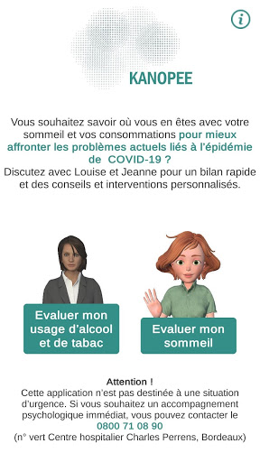
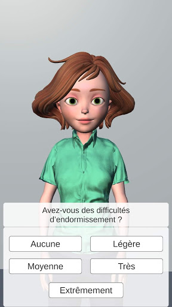
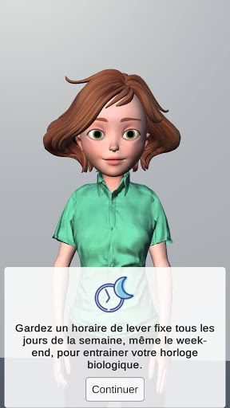
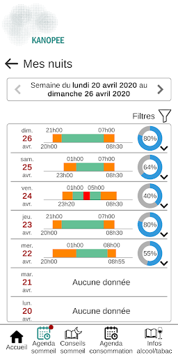
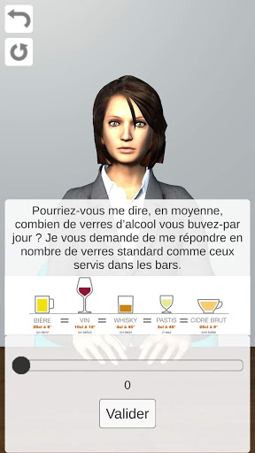
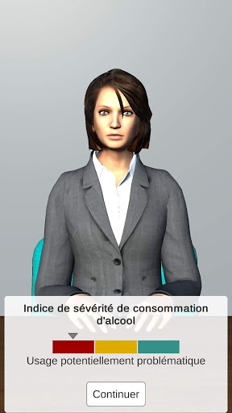
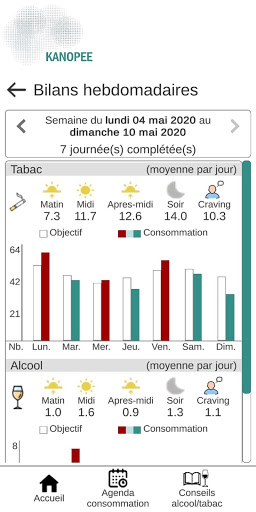
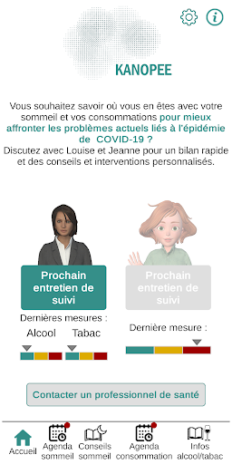
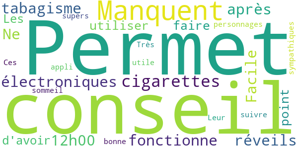
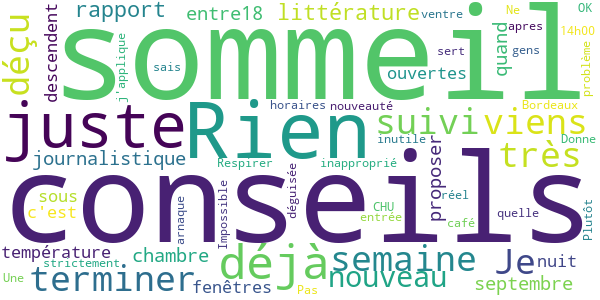

# KANOPEE
App version ``5``

Analyzed with [covid-apps-observer](http://github.com/covid-apps-observer) project, version ``0.1``

## App overview
| | |
|-------------------------|-------------------------| 
| **Name**&nbsp;&nbsp;&nbsp;&nbsp;&nbsp;&nbsp;&nbsp;&nbsp;&nbsp;&nbsp;&nbsp;&nbsp;&nbsp;&nbsp;&nbsp;&nbsp;&nbsp;&nbsp;&nbsp;&nbsp;&nbsp;&nbsp;&nbsp;&nbsp;&nbsp;&nbsp;&nbsp;&nbsp;&nbsp;&nbsp;&nbsp;&nbsp;&nbsp;&nbsp;&nbsp;&nbsp;&nbsp;&nbsp;&nbsp;&nbsp;  | KANOPEE |
| **Unique identifier** | com.sanpsy.kanopee |
| **Link to Google Play** | [https://play.google.com/store/apps/details?id=com.sanpsy.kanopee](https://play.google.com/store/apps/details?id=com.sanpsy.kanopee) |
| **Summary**  | Dépistage et suivis sur les troubles du sommeil et les comportements addictifs |
| **Privacy policy** | [http://www.sanpsy.univ-bordeauxsegalen.fr/consentement%20RGPD_application-Kanopee_Store.pdf](http://www.sanpsy.univ-bordeauxsegalen.fr/consentement%20RGPD_application-Kanopee_Store.pdf) |
| **Latest version** | 5 |
| **Last update** | 2020-09-08 13:57:59 |
| **Recent changes** | - Correction bugs mineurs |
| **Installs**  | 1 000+ |
| **Category** | Médecine |
| **First release** | 10 avr. 2020 |
| **Size**  | 75M |
| **Supported Android version**  | 4.4 ou version ultérieure |

### Description
> L’épidémie de COVID-19 impacte nos habitudes de vie et nos rythmes biologiques. Le confinement et le stress actuel ont pu particulièrement fragiliser notre sommeil et modifier nos consommations d’alcool et de tabac, ce qui peut avoir des conséquences psychologiques négatives à moyen et long terme.
  
 Dans ce contexte, l’unité SANPSY, le CHU de Bordeaux et l'université de Bordeaux, ont développé une application permettant de dépister des troubles du sommeil et d’évaluer sa consommation d’alcool et de tabac, afin de proposer un suivi et des recommandations personnalisées pour mieux maitriser son sommeil et ses consommations.
 Vous souhaitez savoir où vous en êtes avec votre sommeil et vos consommations pour mieux affronter les problèmes actuels liés aux déconfinement ? 
 Discutez avec Louise et Jeanne, nos deux compagnons virtuels, pour un bilan rapide de vos consommations et/ou de votre sommeil. 
 En fonction de vos réponses, des solutions personnalisées pour maîtriser vos consommations, et améliorer la qualité de votre sommeil vous seront proposées : des  conseils personnalisés à mettre en place et des outils de suivis (agenda de sommeil et agenda de consommations).
 Vous pourrez ensuite discuter de manière régulière avec Louise et Jeanne pour évaluer ensemble l'évolution de votre sommeil et de vos consommations.
 Si, malgré cet accompagnement, votre consommation ou votre sommeil vous posent toujours problème, nous vous mettrons en lien avec un professionnel de santé de Nouvelle Aquitaine ou nous vous donnerons des contacts pour être pris en charge pour les autres régions afin de vous accompagner. 
 Pensez bien à suivre nos conseils qui mis en application peuvent vous permettre d’améliorer considérablement votre qualité de vie.

### User interface
The developers of the app provide the following screenshots in the Google play store.
| | | |
|:-------------------------:|:-------------------------:|:-------------------------:|
 |   |   |   | 
 |   |   |   | 
 |   |  

## Development team
In the following we report the main information provided by the development team in the Google play store.

| | |
|-------------------------|-------------------------|
| **Developer**  | SANPSY |
| **Website**  | [http://www.sanpsy.univ-bordeauxsegalen.fr/](http://www.sanpsy.univ-bordeauxsegalen.fr/) |
| **Email** | kanopee@u-bordeaux.fr |
| **Physical address**  | [Unité de Service et de Recherche USR 3413 SANPSY Hôpital et Université de Bordeaux CHU Pellegrin, Tripode 13ᵉ étage, aile 3 Place Amélie- Raba-Léon 33076 Bordeaux cédex](https://www.google.com/maps/search/Unité%20de%20Service%20et%20de%20Recherche%20USR%203413%20SANPSY%20Hôpital%20et%20Université%20de%20Bordeaux%20CHU%20Pellegrin,%20Tripode%2013ᵉ%20étage,%20aile%203%20Place%20Amélie-%20Raba-Léon%2033076%20Bordeaux%20cédex) (Google Maps) |
| **Other developed apps**  | [https://play.google.com/store/apps/developer?id=SANPSY](https://play.google.com/store/apps/developer?id=SANPSY) |

## Android support

| | |
|-------------------------|-------------------------|
| **Declared target Android version**  | - |
| **Effective target Android version**  | - |
| **Minimum supported Android version**  | KitKat, version 4.4 - 4.4.4 (API level 19) |
| **Maximum target Android version**  | - |

The larger the difference between the minimum and maximum supported Android versions, the better. A larger difference means a wider audience. For example, old phones have a very low Android version, so a high minimum supported Android version means that the app cannot be used by users with old phones, thus leading to accessibility problems. 

## Requested permissions

In the following we report the complete list of the permissions requested by the app. 

| **Permission** | **Protection level** | **Description** | 
|-------------------------|-------------------------|-------------------------|
 **android.permission BLUETOOTH** | Normal | Allows applications to connect to paired bluetooth devices. 
 **android.permission BROADCAST_STICKY** | Normal | Allows an application to broadcast sticky intents. 
 **android.permission INTERNET** | Normal | Allows applications to open network sockets. 
 **android.permission MODIFY_AUDIO_SETTINGS** | Normal | Allows an application to modify global audio settings. 
 **android.permission RECEIVE_BOOT_COMPLETED** | Normal | Allows an application to receive the Intent.ACTION_BOOT_COMPLETED that is broadcast after the system finishes booting. 
 **android.permission RECORD_AUDIO** | :warning:**Dangerous** | Allows an application to record audio. 

## Mentioned servers

| **Server** | **Registrant** | **Registrant country** | **Creation date** | 
|-------------------------|-------------------------|-------------------------|-------------------------|
-

## Security analysis 

Below we report the main security warnings raised by our execution of the [Androwarn](https://github.com/maaaaz/androwarn) security analysis tool.

**Connection interfaces exfiltration**
> - This application reads details about the currently active data network 
> - This application tries to find out if the currently active data network is metered 

**Pim data leakage**
> - This application accesses data stored in the clipboard 

**Code execution**
> - This application loads a native library 
> - This application loads a native library: 'main' 

## User ratings and reviews

Below we provide information about how end users are reacting to the app in terms of ratings and reviews in the Google Play store.

### Ratings

The KANOPEE app has been installed by more than **1000** times. At this time, **31** rated the app and its average score is **3.8387096**. Below we show the distribution of the ratings across the usual star-based rating of Google Play

:star::star::star::star::star:: 14

:star::star::star::star:: 8

:star::star::star:: 3

:star::star:: 2

:star:: 4

### Reviews 

#### 5-star reviews

> Manquent les cigarettes électroniques pour le tabagisme. Ne fonctionne pas pour les réveils après 12h00.  :date: __2020-06-29 14:10:19__

> Facile à utiliser Permet de faire le point et d'avoir des conseils. Les personnages sont sympathiques.  :date: __2020-05-26 21:08:06__

> Ces supers  :date: __2020-05-06 14:43:43__

> Très bonne appli qui permet de suivre son sommeil. Leur conseil est utile  :date: __2020-04-29 14:36:15__

#### 4-star reviews

> Bien mais !!! Si on se trompe sur les données entrée pas moyen de modifié très dommage  :date: __2020-09-15 14:29:27__

> Application fonctionnel. Je trouve juste dommage d'avoir alourdi l'application avec de la 3D qui n'apporte pas grand chose...  :date: __2020-06-23 23:25:34__

> Pour le sommeil c'est intéressant. Juste un bémol : c'est dommage de ne pas proposer des modifications des données. J'ai mal compris l'agenda ce matin. J'ai voulu noter mes horaires de cette nuit, ça me les a datées sur une date antérieure.... Sinon je suis curieuse de voir la suite  :date: __2020-06-03 09:34:35__

> Bien. Juste dommage que l'agenda des consommations ne soit pas intégré au truc. Avec possibilité de le remplir en ligne via l'appli...  :date: __2020-05-13 21:28:20__

> Application utile et agréable, la voix utilisée est parfaite. Pour le contenu, il faudrait juste prendre en compte par exemple que certains ne consomment que peu voir pas du tout la semaine et explosent le compteur le weekend 😅  :date: __2020-05-13 10:37:43__

> Une bonne application pour évaluer le degré de sévérité de ses troubles du sommeil, avant un véritable diagnostic. Elle propose de remplir un agenda du sommeil sur sept jours. En revanche, la partie sur la consommation de tabac et d'alcool est moins au point... Je ne fume pas mais j'ai consommé quelques cigarettes avec des amis, à de rares occasions. Et à partir de mes réponses, Jeanne a estimé que ma consommation de tabac était problématique et que je devais vite arrêter !  :date: __2020-05-03 16:27:10__

#### 3-star reviews

> Pas mal  :date: __2020-08-10 08:22:16__

> Il est dommage que l'on ne puisse pas marquer que on se réveille après midi.. C'est mon cas et du coup ça fausse mes résultats et ne peux pas m'aider.  :date: __2020-06-24 16:40:57__

> Bonjour, je ne trouve pas l'accès à la saisie dans l'agenda journalier des consommations, pouvez-vous m'éclairer ?  :date: __2020-05-07 21:39:49__

#### 2-star reviews

> L'idée est bonne. L'appli pourrait être plus développée. Si on oublie ou on se trompe dans les données de consommation impossible de modifier et de revenir en arrière. Tout est alors faussé. Dommage  :date: __2020-10-17 11:04:59__

> Première impression mauvaise L'assistant virtuel est très bien fait mais deux choses me gênent - on entre ses horaires de sommeil mais les périodes de réveil pendant la nuit sont limitées à une heure par nuit - l'application ne se ferme pas quand on clique sur "revenir en arrière", il n'y a pas de moyen pour sortir de cette appli  :date: __2020-06-24 07:34:38__

#### 1-star reviews

> Je viens de terminer une semaine de suivi du sommeil et suis très déçu par les conseils. Rien de nouveau par rapport à la littérature journalistique : proposer en septembre une chambre entre18 et 20° quand la température de nuit, fenêtres ouvertes, ne descendent pas sous 22° c'est juste inapproprié. Respirer par le ventre OK on sais déjà. Pas de café apres 14h00 quelle nouveauté ! Une arnaque déguisée par le CHU de Bordeaux.  :date: __2020-09-21 22:25:13__

> Impossible d entrée les horaires  :date: __2020-05-15 12:07:54__

> Plutôt inutile  :date: __2020-05-06 18:20:29__

> Ne sert strictement à rien pour les gens qui ont un réel problème de sommeil ! Donne juste des conseils que j'applique déjà  :date: __2020-05-02 14:14:38__

