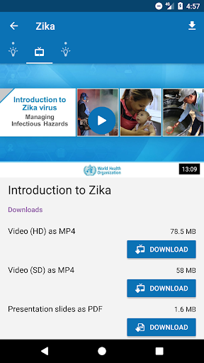

# OpenWHO
App version ``3.7``

Analyzed with [covid-apps-observer](http://github.com/covid-apps-observer) project, version ``0.1``

## App overview
| | |
|-------------------------|-------------------------| 
| **Name**   | OpenWHO |
| **Unique identifier** | de.xikolo.openwho |
| **Link to Google Play** | [https://play.google.com/store/apps/details?id=de.xikolo.openwho](https://play.google.com/store/apps/details?id=de.xikolo.openwho) |
| **Summary**  | Des connaissances en cas d’Urgences Sanitaires |
| **Privacy policy** | [https://openwho.org/pages/privacy](https://openwho.org/pages/privacy) |
| **Latest version** | 3.7 |
| **Last update** | 2020-11-23 13:57:15 |
| **Recent changes** | - Bug fixes and performance improvements |
| **Installs**  | 1 000 000+ |
| **Category** | Enseignement |
| **First release** | 17 mai 2017 |
| **Size**  | 18M |
| **Supported Android version**  | 5.0 ou version ultérieure |

### Description
> OpenWHO est la plateforme interactive de transmission de connaissance de l’Organisation Mondiale de la Santé (OMS) proposant des cours pour améliorer la réponse aux urgences sanitaires. OpenWHO permet à l’Organisation et à ses partenaires clés de transmettre des connaissances pouvant sauver des vies à un grand nombre d’intervenants de première ligne.
 Avec OpenWHO, vous avez la possibilité d’apprendre à votre rythme. Visionnez les courtes vidéos de cours et testez vos connaissances grâce à des auto-évaluations où et quand vous le désirez. Le forum du cours et l’espace de collaboration vous permet d’être en contact avec d’autres participants et experts du monde entier.
 Conçu en premier lieux pour les travailleurs de la santé, les intervenants de première ligne et les décideurs, l’application est aussi une source d’information destinée à ceux touchés par les flambées épidémiques et les urgences sanitaires, ou encore à ceux qui s’intéressent de manière générale au travail de l’OMS en matière d’urgences sanitaires. 
 L’application présente 6 chaînes : 
 - La chaîne Épidémie aborde la gestion des maladies infectieuses et fournit des informations scientifiques pouvant sauver des vies.
 - La chaîne Prêt à Intervenir permet de préparer le personnel qui s’entraîne en vue d’un déploiement à travailler dans des situations d’épidémies et d’urgences sanitaires.
 - La chaîne Faites dans le Social se concentre sur les interventions fondées sur les sciences sociales et aide à communiquer avec les communautés affectées. 
 - La chaîne Préparation en cas de Pandémies rassemble des cours sur divers aspects de la préparation parmi lesquels la surveillance, les mesures de santé publique et la communication sur les risques pendant une pandémie.
 - La chaîne COVID-19 offre des ressources d’apprentissage relatives à l’épidémie de la coronavirus (COVID-19) destinées aux professionnels de la santé, aux décideurs, et au public dans les 6 langues officielles de l’OMS (arabe, chinois, français, russe et espagnol). 
 - La chaîne COVID-19 Langues Nationales offre les mêmes ressources d’apprentissage que celles disponibles sur la chaîne COVID-19 mais dans des langues nationales, telles que l’indonésien, le japonais et le portugais. 
 Les cours sur OpenWHO sont disponibles dans de nombreuses langues, y compris les 6 langues officielles de l’OMS.
 Téléchargez l’application maintenant, et rejoignez la communauté OpenWHO.
 L’application est développée en partenariat avec l’Institut Hasso Plattner et l’OMS. Le contenu d’apprentissage est entièrement géré par l’OMS.

### User interface
The developers of the app provide the following screenshots in the Google play store.
| | | |
|:-------------------------:|:-------------------------:|:-------------------------:|
 |   |   |   | 
 |   |   |   | 

## Development team
In the following we report the main information provided by the development team in the Google play store.

| | |
|-------------------------|-------------------------|
| **Developer**  | HPI Knowledge Engineering Team |
| **Website**  | [https://openwho.org/](https://openwho.org/) |
| **Email** | openwho-support@hpi.de |
| **Physical address**  | [Prof.-Dr.-Helmert-Str.2-3 14482 Potsdam](https://www.google.com/maps/search/Prof.-Dr.-Helmert-Str.2-3%2014482%20Potsdam) (Google Maps) |
| **Other developed apps**  | [https://play.google.com/store/apps/developer?id=7185448023325736337](https://play.google.com/store/apps/developer?id=7185448023325736337) |

## Android support

| | |
|-------------------------|-------------------------|
| **Declared target Android version**  | - |
| **Effective target Android version**  | - |
| **Minimum supported Android version**  | Lollipop, version 5.0 (API level 21) |
| **Maximum target Android version**  | - |

The larger the difference between the minimum and maximum supported Android versions, the better. A larger difference means a wider audience. For example, old phones have a very low Android version, so a high minimum supported Android version means that the app cannot be used by users with old phones, thus leading to accessibility problems. 

## Requested permissions

In the following we report the complete list of the permissions requested by the app. 

| **Permission** | **Protection level** | **Description** | 
|-------------------------|-------------------------|-------------------------|
 **android.permission ACCESS_NETWORK_STATE** | Normal | Allows applications to access information about networks. 
 **android.permission ACCESS_WIFI_STATE** | Normal | Allows applications to access information about Wi-Fi networks. 
 **android.permission DOWNLOAD_WITHOUT_NOTIFICATION** | - | - 
 **android.permission FOREGROUND_SERVICE** | Normal | Allows a regular application to use Service.startForeground. 
 **android.permission INTERNET** | Normal | Allows applications to open network sockets. 
 **android.permission RECEIVE_BOOT_COMPLETED** | Normal | Allows an application to receive the Intent.ACTION_BOOT_COMPLETED that is broadcast after the system finishes booting. 
 **android.permission WAKE_LOCK** | Normal | Allows using PowerManager WakeLocks to keep processor from sleeping or screen from dimming. 
 **android.permission WRITE_EXTERNAL_STORAGE** | :warning:**Dangerous** | Allows an application to write to external storage. 
 **com.google.android.c2dm.permission RECEIVE** | - | - 
 **com.google.android.finsky.permission BIND_GET_INSTALL_REFERRER_SERVICE** | - | - 

## Mentioned servers

| **Server** | **Registrant** | **Registrant country** | **Creation date** | 
|-------------------------|-------------------------|-------------------------|-------------------------|
 | googlesyndication.com | Google LLC | :us: US | 2003-01-21 06:17:24 |
 | google.com | Google LLC | :us: US | 1997-09-15 04:00:00 |
 | apple.com | Apple Inc. | :us: US | 1987-02-19 05:00:00 |
 | aomedia.org | Contact Privacy Inc. Customer 1243324949 | :canada: CA | 2015-08-24 14:07:31 |
 | dashif.org | VTM Group | :us: US | 2012-04-27 13:02:46 |
 | app-measurement.com | Google LLC | :us: US | 2015-06-19 20:13:31 |
 | w3.org | W3C | :us: US | 1994-07-06 04:00:00 |
 | googleapis.com | Google LLC | :us: US | 2005-01-25 17:52:26 |
 | psdev.de | - | - | - |
 | xmlpull.org | WhoisGuard, Inc. | PA | 2001-11-26 20:33:08 |
 | crashlytics.com | Google LLC | :us: US | 2011-01-21 15:30:40 |
 | apache.org | The Apache Software Foundation | :us: US | 1995-04-11 04:00:00 |
 | opensource.org | Open Source Initiative | :us: US | 1998-02-11 05:00:00 |
 | creativecommons.org | Creative Commons Corporation | :canada: CA | 2001-01-15 16:51:44 |
 | eclipse.org | Eclipse.org Foundation, Inc. | :canada: CA | 1997-04-14 04:00:00 |
 | gnu.org | Free Software Foundation | :us: US | 1995-11-24 05:00:00 |
 | mozilla.org | Mozilla Corporation | :us: US | 1998-01-24 05:00:00 |
 | googleadservices.com | Google LLC | :us: US | 2003-06-19 16:34:53 |

## Security analysis 

Below we report the main security warnings raised by our execution of the [Androwarn](https://github.com/maaaaz/androwarn) security analysis tool.

**Telephony identifiers leakage**
> - This application reads the ISO country code equivalent of the current registered operator's MCC (Mobile Country Code) 
> - This application reads the MCC+MNC of the provider of the SIM 

**Connection interfaces exfiltration**
> - This application reads details about the currently active data network 
> - This application tries to find out if the currently active data network is metered 

**Suspicious connection establishment**
> - This application opens a Socket and connects it to the remote address ' returned no addresses for  ; port is out of range' on the 'N/A' port  
> - This application opens a Socket and connects it to the remote address '' on the 'N/A' port  
> - This application opens a Socket and connects it to the remote address 'Ljava/lang/StringBuilder;->toString()Ljava/lang/String;' on the 'N/A' port  
> - This application opens a Socket and connects it to the remote address 'Ljava/net/Proxy;->type()Ljava/net/Proxy$Type;' on the 'N/A' port  
> - This application opens a Socket and connects it to the remote address 'timeout' on the 'N/A' port  

**Code execution**
> - This application loads a native library 

## User ratings and reviews

Below we provide information about how end users are reacting to the app in terms of ratings and reviews in the Google Play store.

### Ratings

The OpenWHO app has been installed by more than **1000000** times. At this time, **3403** rated the app and its average score is **4.2647057**. Below we show the distribution of the ratings across the usual star-based rating of Google Play

:star::star::star::star::star:: 2403

:star::star::star::star:: 370

:star::star::star:: 130

:star::star:: 130

:star:: 370

### Reviews 

#### 5-star reviews

> Enlever masque nez France Allier vichy  :date: __2021-01-18 14:00:27__

> Good  :date: __2020-12-15 04:20:33__

> Cool merci beaucoup pour l'application je me forme chaque fois que je veux,  :date: __2020-10-31 17:17:37__

> Bien bon courage  :date: __2020-10-30 17:25:39__

> Ouverture  :date: __2020-10-15 21:57:46__

> Très spécial WHO  :date: __2020-10-03 01:58:38__

> Super cool  :date: __2020-09-18 15:30:22__

> Je l'aime  :date: __2020-08-29 13:17:38__

> Excellent  :date: __2020-08-24 23:15:20__

> Je suis content de cette application  :date: __2020-08-16 14:08:38__

#### 4-star reviews

> OK.Bien  :date: __2020-07-02 03:23:46__

> Je ne comprend pas qu'il fait écrit  :date: __2020-04-16 19:36:27__

> Je viens de m'inscrire et commence a suivre des cours, format et contenu très intéressant. Si on pouvait avoir encore plus de contenu en Français ce serait top. L'application crash parfois... A voir...  :date: __2020-04-08 17:22:54__

#### 3-star reviews

> Médecin de carrière  :date: __2020-05-29 23:52:47__

> Pensez pour ceux qui parlent exclusivement en français, les documents sont a l'origine en Anglais c'est vrai mais. Les francophones peuvent aussi, éditer des textes à la rédaction pour ne pas avoir des confusions entre la langue Française et l'Anglais. Bravo aux développeurs.  :date: __2020-03-29 17:13:41__

#### 2-star reviews

> Je regrette de cette application est en anglais.Que feront ceux qui ne comprennent que le français.Donc revoir la langue mais aussi regrouper les maladies sous surveillance afin de mieux informer les utilisateurs de l'application.  :date: __2020-04-15 18:23:39__

> Pas satisfais de mesure de couvre feu et de fermeture de lieu de culte  :date: __2020-04-13 15:42:22__

> كان بإمكانكم ترجمتها بالعربية ومع ذالك ساضع لكم نجمتين  :date: __2020-04-10 11:18:37__

> Serais t'il possible s'ils-vous-plais d'avoir à la page d'accueil en langage Français sans l'avoir en anglais ..?!  :date: __2020-03-27 09:09:48__

#### 1-star reviews

> Bien cool  :date: __2020-04-25 18:22:49__

> 🙏🏼Taiwan🙏🏼  :date: __2020-04-14 05:19:51__

> Maove  :date: __2020-04-10 00:09:19__

> Quel est la fontion de cette aplication S.v.p expliqué nous qui non pas compris ce aplication  :date: __2020-04-09 22:04:23__

> C bon  :date: __2020-04-08 22:23:53__

> L englais c'est pas la seule langue au monde  :date: __2020-04-03 00:29:50__

> Nul  :date: __2020-04-02 22:27:28__

> Application après créé compte ne fonctionnait pas même vérifie par moi.  :date: __2020-04-01 17:31:40__

> كلتب وعلاش محيتو لعبة فيروس كورونا  :date: __2020-04-01 13:56:52__

> Inutile , elle n'est qu'en version anglaise !!!! Pour les autres, tapper votre tete sur le mur !!!!  :date: __2020-03-28 08:53:50__

