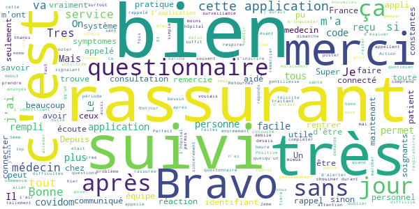

# Covidom Patient
App version ``1.5.21``

Analyzed with [covid-apps-observer](http://github.com/covid-apps-observer) project, version ``0.1``

## App overview
| | |
|-------------------------|-------------------------| 
| **Name**&nbsp;&nbsp;&nbsp;&nbsp;&nbsp;&nbsp;&nbsp;&nbsp;&nbsp;&nbsp;&nbsp;&nbsp;&nbsp;&nbsp;&nbsp;&nbsp;&nbsp;&nbsp;&nbsp;&nbsp;&nbsp;&nbsp;&nbsp;&nbsp;&nbsp;&nbsp;&nbsp;&nbsp;&nbsp;&nbsp;&nbsp;&nbsp;&nbsp;&nbsp;&nbsp;&nbsp;&nbsp;&nbsp;&nbsp;&nbsp;  | Covidom Patient |
| **Unique identifier** | fr.aphp.covidom |
| **Link to Google Play** | [https://play.google.com/store/apps/details?id=fr.aphp.covidom](https://play.google.com/store/apps/details?id=fr.aphp.covidom) |
| **Summary**  | L’assistant de suivi médical pour les patients porteurs du virus COVID-19 |
| **Privacy policy** | [https://www.covidom.fr/politique-confidentialite](https://www.covidom.fr/politique-confidentialite) |
| **Latest version** | 1.5.21 |
| **Last update** | 2020-05-07 11:24:53 |
| **Recent changes** | Vous pouvez désormais activer votre compte Covidom, à l&#39;aide de votre identifiant et du code d&#39;activation transmis, directement sur l&#39;application Android |
| **Installs**  | 10 000+ |
| **Category** | Médecine |
| **First release** | 10 mars 2020 |
| **Size**  | 4,1M |
| **Supported Android version**  | 4.3 ou version ultérieure |

### Description
> *** La solution COVIDOM n'est pas en libre accès et est UNIQUEMENT disponible pour les patients suivis par des services hospitaliers utilisateurs de la plateforme.*** 
 Covidom est une application qui permet aux patients porteurs du virus COVID-19 de bénéficier d’un suivi à distance (ou télésuivi) quotidien. Il peut répondre à des questionnaires médicaux qui sont analysés en temps réel. De son côté, l’équipe soignante sait comment le patient vit au quotidien et est alertée si le patient a besoin d’une attention plus particulière. En cas de besoin, le personnel soignant prend le relais et rentre en contact directement avec le patient pour lui donner ses consignes.

### User interface
The developers of the app provide the following screenshots in the Google play store.
| | | |
|:-------------------------:|:-------------------------:|:-------------------------:|
 |   |   |   | 

## Development team
In the following we report the main information provided by the development team in the Google play store.

| | |
|-------------------------|-------------------------|
| **Developer**  | Assistance Publique - Hôpitaux de paris (AP-HP) |
| **Website**  | [https://www.covidom.fr](https://www.covidom.fr) |
| **Email** | contact.devmobile@aphp.fr |
| **Physical address**  | [AP-HP / DSI / WIND 33 bd de Picpus 75012 Paris France](https://www.google.com/maps/search/AP-HP%20/%20DSI%20/%20WIND%2033%20bd%20de%20Picpus%2075012%20Paris%20France) (Google Maps) |
| **Other developed apps**  | [https://play.google.com/store/apps/developer?id=Assistance+Publique+-+H%C3%B4pitaux+de+paris+(AP-HP)](https://play.google.com/store/apps/developer?id=Assistance+Publique+-+H%C3%B4pitaux+de+paris+(AP-HP)) |

## Android support

| | |
|-------------------------|-------------------------|
| **Declared target Android version**  | Pie, version 9 (API level 28) |
| **Effective target Android version**  | Pie, version 9 (API level 28) |
| **Minimum supported Android version**  | Jelly Bean, version 4.1.x (API level 16) |
| **Maximum target Android version**  | - |

The larger the difference between the minimum and maximum supported Android versions, the better. A larger difference means a wider audience. For example, old phones have a very low Android version, so a high minimum supported Android version means that the app cannot be used by users with old phones, thus leading to accessibility problems. 

## Requested permissions

In the following we report the complete list of the permissions requested by the app. 

| **Permission** | **Protection level** | **Description** | 
|-------------------------|-------------------------|-------------------------|
 **android.permission ACCESS_NETWORK_STATE** | Normal | Allows applications to access information about networks. 
 **android.permission INTERNET** | Normal | Allows applications to open network sockets. 
 **android.permission READ_EXTERNAL_STORAGE** | :warning:**Dangerous** | Allows an application to read from external storage. 
 **android.permission WAKE_LOCK** | Normal | Allows using PowerManager WakeLocks to keep processor from sleeping or screen from dimming. 
 **android.permission WRITE_EXTERNAL_STORAGE** | :warning:**Dangerous** | Allows an application to write to external storage. 
 **com.google.android.c2dm.permission RECEIVE** | - | - 
 **com.google.android.finsky.permission BIND_GET_INSTALL_REFERRER_SERVICE** | - | - 

## Mentioned servers

| **Server** | **Registrant** | **Registrant country** | **Creation date** | 
|-------------------------|-------------------------|-------------------------|-------------------------|
 | google.com | Google LLC | :us: US | 1997-09-15 04:00:00 |
 | googleadservices.com | Google LLC | :us: US | 2003-06-19 16:34:53 |
 | app-measurement.com | Google LLC | :us: US | 2015-06-19 20:13:31 |
 | googleapis.com | Google LLC | :us: US | 2005-01-25 17:52:26 |
 | googlesyndication.com | Google LLC | :us: US | 2003-01-21 06:17:24 |
 | covidom.fr | Nouveal | - | 2020-03-06 20:03:16 |
 | crashlytics.com | Google LLC | :us: US | 2011-01-21 15:30:40 |
 | googleapis.com | Google LLC | :us: US | 2005-01-25 17:52:26 |
 | e-fitback.com | Nouveal | :fr: FR | 2015-11-16 13:24:32 |

## Security analysis 

Below we report the main security warnings raised by our execution of the [Androwarn](https://github.com/maaaaz/androwarn) security analysis tool.

**Connection interfaces exfiltration**
> - This application reads details about the currently active data network 
> - This application tries to find out if the currently active data network is metered 

**Telephony services abuse**
> - This application makes phone calls 

**Suspicious connection establishment**
> - This application opens a Socket and connects it to the remote address ': ; port is out of range' on the 'N/A' port  
> - This application opens a Socket and connects it to the remote address 'Lf/a;->a(Ljava/lang/String;)Ljava/lang/StringBuilder;' on the 'N/A' port  
> - This application opens a Socket and connects it to the remote address 'Ljava/lang/StringBuilder;->toString()Ljava/lang/String;' on the 'N/A' port  
> - This application opens a Socket and connects it to the remote address 'Ljava/net/Proxy;->type()Ljava/net/Proxy$Type;' on the 'N/A' port  
> - This application opens a Socket and connects it to the remote address 'timeout' on the 'N/A' port  

## User ratings and reviews

Below we provide information about how end users are reacting to the app in terms of ratings and reviews in the Google Play store.

### Ratings

The Covidom Patient app has been installed by more than **10000** times. At this time, **100** rated the app and its average score is **3.17**. Below we show the distribution of the ratings across the usual star-based rating of Google Play

:star::star::star::star::star:: 45

:star::star::star::star:: 7

:star::star::star:: 6

:star::star:: 4

:star:: 38

### Reviews 

#### 5-star reviews

> Action réaction. Positive... je remplis mon 2eme questionnaire en signalant des symptomes... une heure aprés on me rappel pour me poser des questions et prendre de mes nouvelles... et on est dimanche matin ! Bravo ce suivis est tellement rassurant...  :date: __2020-10-25 11:37:02__

> Cette application m'as énormément été utile  :date: __2020-09-24 17:23:04__

> Je félicite et remercie tout le personnel du covidom . Ils m'ont suivis durant toute cette difficile période ,sans oublier mon médecin traitant . Ils m'ont aidés physiquement et moralement, bravo à vous tous.  :date: __2020-05-26 14:43:58__

> Tres bien  :date: __2020-05-10 22:51:16__

> Super application je remercie sincèrement toute l équipe qui m a suivi et qui m a beaucoup aidé par leur écoute leur gentillesse et leur bonne humeur  :date: __2020-05-08 14:38:35__

> Bonne  :date: __2020-05-02 16:55:43__

> Très pratique il suffit de penser à rentrer le code fourni par son médecin  :date: __2020-04-24 11:44:22__

> Bonne appli, j'ai bien reçu mes identifiants envoyés par le médecin. Le questonnaire quotidien est facile à compléter et c'est rassurant d'être suivi et sous surveillance.  :date: __2020-04-23 14:50:40__

> Je n'ai pu accéder au service que après avoir reçu un code et un identifiant Uns fois connecté c'est facile et ça a l'air de bien marcher Faites attention à vous !  :date: __2020-04-23 12:32:15__

> Un jeu d'enfant avec l'identifiant communiqué par mon medecin. Tres rassurant de se sentir suivi.  :date: __2020-04-23 12:17:18__

#### 4-star reviews

> Super  :date: __2020-10-06 06:51:47__

> C'est trés bien , très bonne initiative Mille mercis encore On vous soutient tous !!!!!!!!  :date: __2020-05-28 00:30:08__

> J'habite en Bretagne Ilya pas la Bretagne  :date: __2020-04-05 20:24:42__

> Bonjour , Une application je me sens en surveillance mais c'est dommage personne vous appelle seulement votre médecin traitant après peut être qu'ils sont débordés avec les autres personnes malades.  :date: __2020-04-03 09:02:14__

> Fonctionne bien quand on s'aperçoit au bout de plusieurs jours que les liens arrivent en courrier indésirable. Quand on est malade c'est difficile d'être réactif  :date: __2020-04-02 20:00:23__

> ! A télécharger seulement si le centre de dépistage a envoyé le code ! ... Et réservé pour nous les covid+. Les autres, ne soyez pas jaloux, votre tour viendra. Seul bémol, 24h00 pour envoyer le code ( soit J+5 post symptômes ) ... et déjà plus de fièvre. Dommage. En attendant je reste chez moi.  :date: __2020-03-26 11:43:51__

#### 3-star reviews

> Très pratique et simple d'utilisation. Mais depuis 16/05 ne peut plus entres mes constante.  :date: __2020-05-17 15:13:38__

> Je reçois des SMS alors que je ne suis pas inclus dans le suivi  :date: __2020-04-08 09:06:01__

> Bonjour je pense que tout le monde devrait pouvoir se connecter à cette application, pour ma part je voudrais savoir si nous avons un moyen pour signaler que j'ai été malade avec en partie les mêmes symptômes en date du 7 mars avec des tempet à plus de 40° et qu'au bout de 1 semaine j'allais mieux, à qui pouvons nous nous retourner, et est ce que mon information peut permettre à faire avancer les recherches?!? Cordialement.  :date: __2020-04-07 22:50:00__

> Très bonne idée d'application, sauf que les questionnaires s'arrêtent a 17h. Alors que ma fièvre augmente très largement le soir, plus de 39 et du coup ça on peut pas le dire.  :date: __2020-03-25 07:42:42__

> Pour arriver à me connecter sur l'application je suis allée sur mon compte AP-HP et j'ai envoyé un mail depuis mon espace pour demander l'activation de mon compte, service très réactif dans l'heure j'ai reçu un SMS avec mon identifiant et un lien de première connexion. Bravo à tous ceux qui œuvrent au quotidien dans la lutte contre le virus. J'espère que mon avis aidera d'autres personnes.  :date: __2020-03-21 21:53:30__

#### 2-star reviews

> Difficile à installer. Même après une première utilisation il faut renseigner la région qui n'est pas mémoriser.je n'ai réussi à installer avec play store sur l'écran d'accueil. Ce produit n'est pas testé.  :date: __2020-10-24 18:01:28__

> Même chose ma date de naissance ne passe pas.Mais déjà au tel une dame de la caisse assurance maladie avait pour moi dans son logiciel 1935 pour ma date de naissance alors que je suis née en 1959...ma fille m a indiquée cas contact en donnant mon tel portable .Elle 24 ans..Si j étais née 1935 je l aurais eue à quel âge? Ça fait peur....bonjour la logistique....  :date: __2020-10-16 10:01:11__

> C'est nul on ne peut pas changer la date ni quoi que ce soit pas pratique  :date: __2020-08-11 02:13:59__

> Je veux  :date: __2020-05-29 16:29:13__

> J'essaie d'inscrire pour le suivi mon père de 78 ans et de l'aider comme je peux avec son téléphone, un identifiant lui a été communiqué à l'oral, mais impossible de procéder à l'activation. C'est très compliqué. Idem , j'ai essayé de lui créer un compte sur l'AP-HP, sans succès. Du coup, je ne sais même pas à qui m'adresser pour demander la redemander le n° d'identification. Dommage...  :date: __2020-04-04 19:45:01__

#### 1-star reviews

> Une fois installée je n arrive pas à voir les documents. Donc impossible de remplir les documents.  :date: __2020-10-27 14:15:54__

> Application nulle, je n'arrive pas à me connecter.  :date: __2020-10-26 14:04:39__

> Impossible de me connecter : me demande ma date de naissance pour confirmer et me dit qu'elle ne correspond pas !!!  :date: __2020-10-16 13:42:32__

> Le système est très nul on ne comprend rien c'est horrible  :date: __2020-10-13 09:58:32__

> Dommage, j ai beau mettre ma date de naissance pour activer , on me répond que ce n est pas la bonne. Du coup on est privé de la aide qui devait nous être proposée concernant le covid  :date: __2020-10-09 19:35:30__

> Utilité de l'application ? ...  :date: __2020-09-20 20:35:22__

> Application très mal finie , web et Android. Par un pré-apprenti stagiaire ? Impossible d'ajouter un document PDF, seules les photos sont acceptées. Pas moyen d'enlever un document envoyé par erreur ! Sur la version web, je suis de sexe indéterminé, je ne peux pas corriger. Sur Android, je suis une femme. Depuis quand ? Je suis né avec un zizi il y a un peu plus de 59 ans, je l'ai toujours et n'ai jamais voulu m'en défaire. Merci de corriger.  :date: __2020-09-02 00:04:31__

> J'ai activé mon compte mais je n'arrive pas a faire le questionnaire de suivi. Comment dois-je faire ?  :date: __2020-09-01 00:20:57__

> Aussitôt installée aussitôt desinstallee, ne fonctionne pas avec les codes reçus par SMS, APPLI totalement inutile donc. Pas de temps à perdre àvec un truc qui ne fonctionne pas  :date: __2020-08-25 10:17:58__

> J'ai été en contact avec une personne testée positive, j'ai reçu mes codes, mais à aucun moment il y a la question: avez vous fait le dépistage ? Je l'ai fait je suis négative et je dois remplir le questionnaire comme si j'étais positive... Incohérent !  :date: __2020-08-18 10:48:21__

