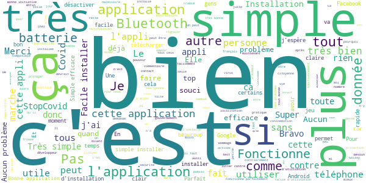
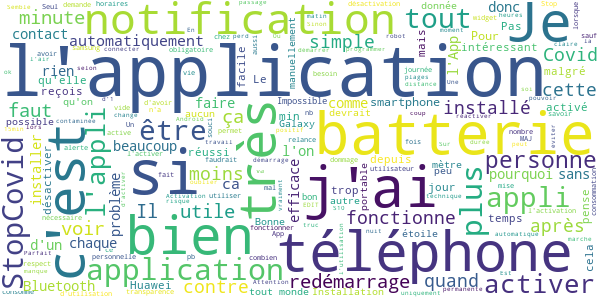
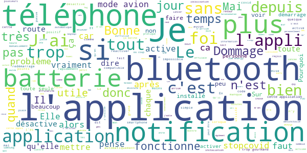
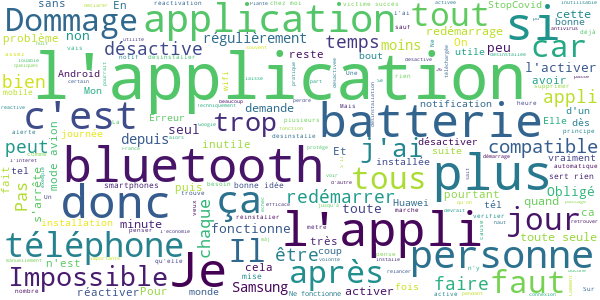
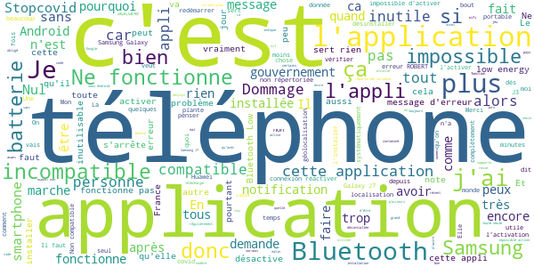

# StopCovid France
App version ``1.0.1``

Analyzed with [covid-apps-observer](http://github.com/covid-apps-observer) project, version ``0.1``

## App overview
| | |
|-------------------------|-------------------------| 
| **Name**&nbsp;&nbsp;&nbsp;&nbsp;&nbsp;&nbsp;&nbsp;&nbsp;&nbsp;&nbsp;&nbsp;&nbsp;&nbsp;&nbsp;&nbsp;&nbsp;&nbsp;&nbsp;&nbsp;&nbsp;&nbsp;&nbsp;&nbsp;&nbsp;&nbsp;&nbsp;&nbsp;&nbsp;&nbsp;&nbsp;&nbsp;&nbsp;&nbsp;&nbsp;&nbsp;&nbsp;&nbsp;&nbsp;&nbsp;&nbsp;  | StopCovid France |
| **Unique identifier** | fr.gouv.android.stopcovid |
| **Link to Google Play** | [https://play.google.com/store/apps/details?id=fr.gouv.android.stopcovid](https://play.google.com/store/apps/details?id=fr.gouv.android.stopcovid) |
| **Summary**  | Protégeons nos proches, protégeons-nous et protégeons les autres |
| **Privacy policy** | [https://bonjour.stopcovid.gouv.fr/privacy.html](https://bonjour.stopcovid.gouv.fr/privacy.html) |
| **Latest version** | 1.0.1 |
| **Last update** | 2020-06-05 22:08:27 |
| **Recent changes** | Améliorations et corrections. |
| **Installs**  | 500 000+ |
| **Category** | Médecine |
| **First release** | 29 mai 2020 |
| **Size**  | 17M |
| **Supported Android version**  | 5.0 ou version ultérieure |

### Description
> Avec StopCovid, participez à la protection de vos proches, de vous-même et de tous en étant alerté si vous avez été à proximité d’un utilisateur testé positif.
 Protégeons nos proches, protégeons-nous et protégeons les autres. 
 StopCovid, c’est simple :
 # J'active l'application
 En utilisant le Bluetooth de votre téléphone, StopCovid détecte les téléphones des autres utilisateurs qui restent à proximité du vôtre.
 # Je reste informé
 Vous serez informé si vous avez été à proximité d’un utilisateur testé positif au COVID-19.
 # Je protège mes proches et les autres
 Si vous effectuez un test COVID-19 et qu’il est positif, votre laboratoire vous donnera un code à scanner ou à saisir pour avertir anonymement les utilisateurs que vous avez rencontrés.
 #  Mes données sont protégées
 L’application n’utilise à aucun moment la localisation des personnes, et il est impossible de connaître l’identité des utilisateurs
 .
 Cette application a été réalisée par l'équipe StopCovid, sous la supervision du Ministère des Solidarités et de la Santé et du Secrétariat d'Etat chargé du Numérique.

### User interface
The developers of the app provide the following screenshots in the Google play store.
| | | |
|:-------------------------:|:-------------------------:|:-------------------------:|
 |   |   |   | 
 |   |   |   | 

## Development team
In the following we report the main information provided by the development team in the Google play store.

| | |
|-------------------------|-------------------------|
| **Developer**  | Gouvernement |
| **Website**  | [https://stopcovid.gouv.fr](https://stopcovid.gouv.fr) |
| **Email** | contact@stopcovid.gouv.fr |
| **Physical address**  | [20 avenue de Ségur 75007 Paris](https://www.google.com/maps/search/20%20avenue%20de%20Ségur%2075007%20Paris) (Google Maps) |
| **Other developed apps**  | [https://play.google.com/store/apps/developer?id=Gouvernement](https://play.google.com/store/apps/developer?id=Gouvernement) |

## Android support

| | |
|-------------------------|-------------------------|
| **Declared target Android version**  | Android10, version 10 (API level 29) |
| **Effective target Android version**  | Android10, version 10 (API level 29) |
| **Minimum supported Android version**  | Lollipop, version 5.0 (API level 21) |
| **Maximum target Android version**  | - |

The larger the difference between the minimum and maximum supported Android versions, the better. A larger difference means a wider audience. For example, old phones have a very low Android version, so a high minimum supported Android version means that the app cannot be used by users with old phones, thus leading to accessibility problems. 

## Requested permissions

In the following we report the complete list of the permissions requested by the app. 

| **Permission** | **Protection level** | **Description** | 
|-------------------------|-------------------------|-------------------------|
 **android.permission ACCESS_COARSE_LOCATION** | :warning:**Dangerous** | Allows an app to access approximate location. 
 **android.permission ACCESS_FINE_LOCATION** | :warning:**Dangerous** | Allows an app to access precise location. 
 **android.permission ACCESS_NETWORK_STATE** | Normal | Allows applications to access information about networks. 
 **android.permission BLUETOOTH** | Normal | Allows applications to connect to paired bluetooth devices. 
 **android.permission BLUETOOTH_ADMIN** | Normal | Allows applications to discover and pair bluetooth devices. 
 **android.permission CAMERA** | :warning:**Dangerous** | Required to be able to access the camera device. 
 **android.permission FOREGROUND_SERVICE** | Normal | Allows a regular application to use Service.startForeground. 
 **android.permission INTERNET** | Normal | Allows applications to open network sockets. 
 **android.permission RECEIVE_BOOT_COMPLETED** | Normal | Allows an application to receive the Intent.ACTION_BOOT_COMPLETED that is broadcast after the system finishes booting. 
 **android.permission REQUEST_IGNORE_BATTERY_OPTIMIZATIONS** | Normal | Permission an application must hold in order to use Settings.ACTION_REQUEST_IGNORE_BATTERY_OPTIMIZATIONS. 
 **android.permission WAKE_LOCK** | Normal | Allows using PowerManager WakeLocks to keep processor from sleeping or screen from dimming. 

## Mentioned servers

| **Server** | **Registrant** | **Registrant country** | **Creation date** | 
|-------------------------|-------------------------|-------------------------|-------------------------|
 | stopcovid.gouv.fr | Etat francais represente par le Ministere de l Economie et des Finances de l Action et des Comptes publics | - | 2020-04-15 12:02:42 |

## Security analysis 

Below we report the main security warnings raised by our execution of the [Androwarn](https://github.com/maaaaz/androwarn) security analysis tool.

**Connection interfaces exfiltration**
> - This application reads details about the currently active data network 
> - This application tries to find out if the currently active data network is metered 

**Telephony services abuse**
> - This application makes phone calls 

**Suspicious connection establishment**
> - This application opens a Socket and connects it to the remote address '; port is out of range' on the 'N/A' port  
> - This application opens a Socket and connects it to the remote address 'Lcom/android/tools/r8/GeneratedOutlineSupport;->outline17(Ljava/lang/String;)Ljava/lang/StringBuilder;' on the 'N/A' port  
> - This application opens a Socket and connects it to the remote address 'Ljava/net/Proxy;->type()Ljava/net/Proxy$Type;' on the 'N/A' port  
> - This application opens a Socket and connects it to the remote address 'Ljava/net/Socket;->isConnected()Z' on the 'N/A' port  
> - This application opens a Socket and connects it to the remote address 'Only InetSocketAddress is supported.' on the 'N/A' port  
> - This application opens a Socket and connects it to the remote address 'Wrapped socket should already be bound' on the 'N/A' port  
> - This application opens a Socket and connects it to the remote address 'Wrapped socket should already be connected' on the 'N/A' port  
> - This application opens a Socket and connects it to the remote address 'timeout' on the 'N/A' port  

## User ratings and reviews

Below we provide information about how end users are reacting to the app in terms of ratings and reviews in the Google Play store.

### Ratings

The StopCovid France app has been installed by more than **500000** times. At this time, **4072** rated the app and its average score is **3.5807292**. Below we show the distribution of the ratings across the usual star-based rating of Google Play

:star::star::star::star::star:: 2163

:star::star::star::star:: 424

:star::star::star:: 180

:star::star:: 222

:star:: 1081

### Reviews 

#### 5-star reviews

> Installez tous l'application. C génial !!!!  :date: __2020-06-14 20:47:41__

> Super appli je la recommande toujours là pour vous avertir!!  :date: __2020-06-14 19:51:02__

> Filecitation virus malheureurs riche sur terre pas plus ya pas miellheurs  :date: __2020-06-14 18:59:18__

> Tout marche bien. Des efforts ont été fait sur la transparence du fonctionnement de l'application. (Dans cette même démarche il serait intéressant de mettre les sources de l'application en libre accès sur le web)  :date: __2020-06-14 18:41:32__

> Que tous ceux qui nous expliquent que l'application est pourrie, qu'elle se désactive toute seule... commencez par régler les paramètres de votre smartphone en autorisant en arrière-plan l'application ainsi que son démarrage automatique selon les téléphones. Vous verrez, ça marche beaucoup mieux ! 😉  :date: __2020-06-14 12:22:01__

> Soyons responsable et fraternels  :date: __2020-06-14 12:17:09__

> 👍  :date: __2020-06-14 11:19:17__

> Bien.  :date: __2020-06-14 07:38:40__

> Bien  :date: __2020-06-14 03:31:02__

> Le geste barrière électronique indispensable.  :date: __2020-06-14 01:57:02__

#### 4-star reviews

> Pas d infornation depuis mon inscription  :date: __2020-06-14 09:15:24__

> l'App se met en arrière plan et disparaît à l'écran d'une manière intempestive. Ne sais pas pourquoi ! Dommage que son source ne soit en Open Source pour vérifier ce qu'affirme le gouvernement...  :date: __2020-06-13 22:16:32__

> Ne reste pas allumé quand on la ferme malgres l'autorisation du fonctionnement en arrière plan.  :date: __2020-06-13 19:58:41__

> La 1ere version ne fonctionnait pas sur mon téléphone en Android 9. La nouvelle version de semble fonctionner  :date: __2020-06-13 15:20:29__

> J'étais vraiment septique et je fait très attention à l'utilisation de mes donnés mais force est de reconnaître qu'un bel effort à été fait sur cette application. En revanche l'impact sur la batterie est vraiment significatif. Et j'aurais voulu un petit compteur de personnes croisées car on n'a pas de feedback sur ce que fait l'application.  :date: __2020-06-13 14:20:52__

> Application bien utile. L'application s'arrête parfois sans qu'on sache pourquoi. Il faut alors la relancer manuellement.  :date: __2020-06-13 08:03:28__

> Très Bien mais il géolocalise et voit se que l'on fait  :date: __2020-06-12 17:47:33__

> Mettez un compteur de gens croisés, un compteur uptime, ou un truc marrant. Ca apporterait un intérêt a l'application et du coup plus de gens l'utiliserait..  :date: __2020-06-12 11:12:41__

> Bonjour j'ai installé cette application qui selon moi est top à voir avec le temps.  :date: __2020-06-12 10:23:07__

> Pas assez d'utilisateurs  :date: __2020-06-11 21:30:11__

#### 3-star reviews

> Bonne initiative, bonne démarche mais... lourd ! Le téléphone est considérablement ralenti et les validations par double authentification en pâtissent lourdement. Dès que vous aurez allégez le fonctionnement, n'hésitez pas à communiquer, je referais un essai. Bonne continuation  :date: __2020-06-14 17:51:46__

> Mon avis a disparu... Je le réécris... C'est quoi ces notifications plusieurs fois par jour pour dire que l'application est activée??? Je n'espère pas de réponse, je n'en vois pas sous les autres avis...  :date: __2020-06-14 10:02:55__

> Application simple, originale dans le sens où on ne sait pas d'avance si elle nous sera personnellement utile....en revanche, je ne doute pas de son utilité collective. J'utilise de nombreux appareils bluetooth qu' Il m'arrive parfois de de desactiver. A plusieurs reprise stopCovid s'est également désactivé sans que je m'en aperçoive, ce qui la rend inutile. Pourriez vous trouver une solution pour qu'elle reste active tant que l'utilisateur ne la desactive pas volontairement.  :date: __2020-06-13 22:10:00__

> l'application se déconnecte tout sol  :date: __2020-06-13 17:22:08__

> Plantages successifs Dommage. Il semble que l'appli plante systématiquement depuis que je l'ai lancée depuis ma voiture. Sûrement un problème lié au bluetooth de ma voiture mais même en l'éteignant le problème persiste après.  :date: __2020-06-13 16:21:16__

> Se désactive toute seule semble t il (3x en 2j) donc je ne vais pas la réactiver toutes les heures ???  :date: __2020-06-13 14:01:51__

> Il faut réactiver l'application a chaque fois que le Bluetooth a ete eteint ou que le tel a ete mis en mode avion du coup j'oublie tout le temps de la mettre en route ..... ce n'est pas pratique du tout et je me dit que beaucoup de gens feront comme moi du lappli ne sert pas à grand chose. .... Je desinstalle 😣😢😭  :date: __2020-06-13 11:50:05__

> Depuis quelques jours l'application me dit que c'est désactivé alors que mon blutooth est activé. J'ai désinstallé et réinstaller et toujours le même problème...  :date: __2020-06-12 21:31:43__

> La notification permanente de l'activation est vraiment pénible... Si je désinstalle l'appli ce sera pour cette unique raison...  :date: __2020-06-12 20:32:17__

> Ma batterie dure deux fois moins longtemps depuis que j'ai installé cette application. Je l'ai désactivée, et j'ai observé un retour à la normale.  :date: __2020-06-12 15:51:40__

#### 2-star reviews

> L'application ne cesse de se désactiver. Il n'y a aucune alerte particulière et l'icone de l'application reste présente en haut de l'écran. Donc on ne sait pas que l’application s'est désactivée sauf en l'ouvrant....Comment dans ce cas peut-elle être utile ?  :date: __2020-06-14 17:51:45__

> Impossible de l'activer, l'appli est donc inutile.  :date: __2020-06-14 10:00:50__

> A améliorer svp  :date: __2020-06-14 08:23:24__

> Trop gourmand Désolé, plus de batterie en fin de journée  :date: __2020-06-13 19:52:38__

> Il semblerait que personne ne veuille se "déclarer"! Pourtant cela pourrait être bien utile. En France, nous avons un état d'esprit exécrable  :date: __2020-06-13 14:28:05__

> L'application se désinstalle à chaque fois  :date: __2020-06-13 14:13:21__

> Obligé de relancer l'application tous les jours en pas très pratique. Elle devrait se lancer et s activité toute seul.. cela serait plus simple et plus sur pour tout le monde...  :date: __2020-06-13 14:11:13__

> Pas top, obligé de réinstaller au bout de 72h car impossible à redémarrer après un arrêt automatique et non demandé ......  :date: __2020-06-13 10:52:43__

> Il faut l'allumer tous le temps car elle s'éteint ou bout d'un certain temps , du coup inutile 🤔  :date: __2020-06-13 09:03:27__

> 4500 personnes ont télécharger l'application je trouve ça très peu comparer au nombre de personnes qui font les tests à voir par la suite.  :date: __2020-06-12 22:23:42__

#### 1-star reviews

> Trop tard, dommage. Très mauvaise communication, dommage. Coût exorbitant, un copain a faire travailler ? Ceci aurait dû être développé au niveau européen mais bon déjà pas foutu de se mettre d'accord, chacun à tirer la couverture à soit pas un pour rattraper les autres. Encore une gestion catastrophique à en dégoûter les peuples de l'Europe 😓  :date: __2020-06-14 20:14:38__

> L'application plante et impossible à redémarrer. Je l'ai réinstallée mais cela n'a pas l'air très abouti. Pompe la batterie  :date: __2020-06-14 17:58:41__

> Après quelques jours de fonctionnement, l'appli me demande d'activer la géolocalisation. Bien sûr c'est déjà fait mais impossible de lui faire comprendre 🤬🤬 Je vais la désinstaller et réessayer ! Et si c'est toujours pareil tant pis ! Dommage  :date: __2020-06-14 17:08:29__

> Trop de bug Un jour ça fonctionne et 2 jours après on ne peut plus l'activer Je désinstalle  :date: __2020-06-14 14:52:32__

> L'application ne se lance pas automatiquement suite au redémarrage du smartphone. Je me suis aperçu qu elle était désactivée depuis plusieurs jours. Mais qu'on ne compte pas sur moi pour l'activer manuellement à chaque redémarrage de mon smartphone.  :date: __2020-06-14 13:22:46__

> L'application ne reste pas activée  :date: __2020-06-14 12:23:16__

> Sérieusement.. il faut que je réactive l'application à chaque sortie  :date: __2020-06-14 12:16:56__

> Seul le SDK est open-source, dommage que l'application ne le soit pas, donc impossible de vérifier la bonne foi de cette app.  :date: __2020-06-14 12:01:50__

> Désinstallé très rapidement quand j'ai constaté que la batterie se déchargeait à la vitesse de la lumière.  :date: __2020-06-14 11:34:57__

> Un vrai fiasco ! Combien ça a coûté aux contribuables encore cette fameuse et extraordinaire application victime de son succès qui ne fonctionne même pas correctement ?  :date: __2020-06-14 11:23:06__

