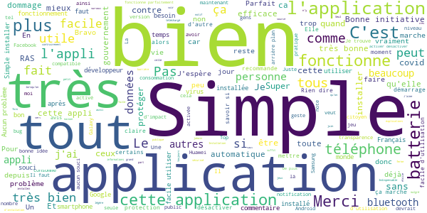
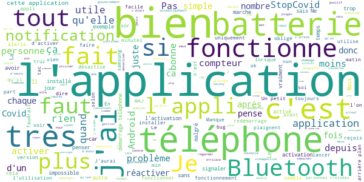
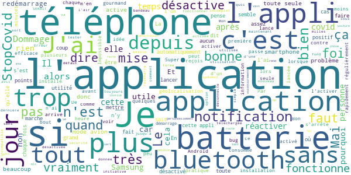
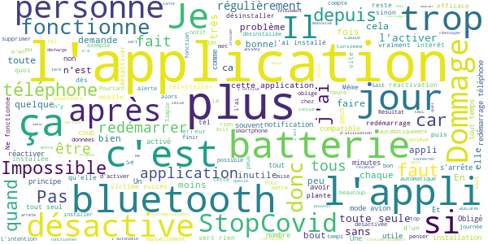

# StopCovid France
App version ``1.0.4``

Analyzed with [covid-apps-observer](http://github.com/covid-apps-observer) project, version ``0.1``

## App overview
| | |
|-------------------------|-------------------------| 
| **Name**&nbsp;&nbsp;&nbsp;&nbsp;&nbsp;&nbsp;&nbsp;&nbsp;&nbsp;&nbsp;&nbsp;&nbsp;&nbsp;&nbsp;&nbsp;&nbsp;&nbsp;&nbsp;&nbsp;&nbsp;&nbsp;&nbsp;&nbsp;&nbsp;&nbsp;&nbsp;&nbsp;&nbsp;&nbsp;&nbsp;&nbsp;&nbsp;&nbsp;&nbsp;&nbsp;&nbsp;&nbsp;&nbsp;&nbsp;&nbsp;  | StopCovid France |
| **Unique identifier** | fr.gouv.android.stopcovid |
| **Link to Google Play** | [https://play.google.com/store/apps/details?id=fr.gouv.android.stopcovid](https://play.google.com/store/apps/details?id=fr.gouv.android.stopcovid) |
| **Summary**  | Protégeons nos proches, protégeons-nous et protégeons les autres |
| **Privacy policy** | [https://bonjour.stopcovid.gouv.fr/privacy.html](https://bonjour.stopcovid.gouv.fr/privacy.html) |
| **Latest version** | 1.0.4 |
| **Last update** | 2020-06-17 11:18:32 |
| **Recent changes** | Améliorations et corrections. |
| **Installs**  | 500 000+ |
| **Category** | Médecine |
| **First release** | 29 mai 2020 |
| **Size**  | 17M |
| **Supported Android version**  | 5.0 ou version ultérieure |

### Description
> Avec StopCovid, participez à la protection de vos proches, de vous-même et de tous en étant alerté si vous avez été à proximité d’un utilisateur testé positif.
 Protégeons nos proches, protégeons-nous et protégeons les autres. 
 StopCovid, c’est simple :
 # J'active l'application
 En utilisant le Bluetooth de votre téléphone, StopCovid détecte les téléphones des autres utilisateurs qui restent à proximité du vôtre.
 # Je reste informé
 Vous serez informé si vous avez été à proximité d’un utilisateur testé positif au COVID-19.
 # Je protège mes proches et les autres
 Si vous effectuez un test COVID-19 et qu’il est positif, votre laboratoire vous donnera un code à scanner ou à saisir pour avertir anonymement les utilisateurs que vous avez rencontrés.
 #  Mes données sont protégées
 L’application n’utilise à aucun moment la localisation des personnes, et il est impossible de connaître l’identité des utilisateurs
 .
 Cette application a été réalisée par l'équipe StopCovid, sous la supervision du Ministère des Solidarités et de la Santé et du Secrétariat d'Etat chargé du Numérique.

### User interface
The developers of the app provide the following screenshots in the Google play store.
| | | |
|:-------------------------:|:-------------------------:|:-------------------------:|
 |   |   |   | 
 |   |   |   | 

## Development team
In the following we report the main information provided by the development team in the Google play store.

| | |
|-------------------------|-------------------------|
| **Developer**  | Gouvernement |
| **Website**  | [https://stopcovid.gouv.fr](https://stopcovid.gouv.fr) |
| **Email** | contact@stopcovid.gouv.fr |
| **Physical address**  | [20 avenue de Ségur 75007 Paris](https://www.google.com/maps/search/20%20avenue%20de%20Ségur%2075007%20Paris) (Google Maps) |
| **Other developed apps**  | [https://play.google.com/store/apps/developer?id=Gouvernement](https://play.google.com/store/apps/developer?id=Gouvernement) |

## Android support

| | |
|-------------------------|-------------------------|
| **Declared target Android version**  | Android10, version 10 (API level 29) |
| **Effective target Android version**  | Android10, version 10 (API level 29) |
| **Minimum supported Android version**  | Lollipop, version 5.0 (API level 21) |
| **Maximum target Android version**  | - |

The larger the difference between the minimum and maximum supported Android versions, the better. A larger difference means a wider audience. For example, old phones have a very low Android version, so a high minimum supported Android version means that the app cannot be used by users with old phones, thus leading to accessibility problems. 

## Requested permissions

In the following we report the complete list of the permissions requested by the app. 

| **Permission** | **Protection level** | **Description** | 
|-------------------------|-------------------------|-------------------------|
 **android.permission ACCESS_COARSE_LOCATION** | :warning:**Dangerous** | Allows an app to access approximate location. 
 **android.permission ACCESS_FINE_LOCATION** | :warning:**Dangerous** | Allows an app to access precise location. 
 **android.permission ACCESS_NETWORK_STATE** | Normal | Allows applications to access information about networks. 
 **android.permission BLUETOOTH** | Normal | Allows applications to connect to paired bluetooth devices. 
 **android.permission BLUETOOTH_ADMIN** | Normal | Allows applications to discover and pair bluetooth devices. 
 **android.permission CAMERA** | :warning:**Dangerous** | Required to be able to access the camera device. 
 **android.permission FOREGROUND_SERVICE** | Normal | Allows a regular application to use Service.startForeground. 
 **android.permission INTERNET** | Normal | Allows applications to open network sockets. 
 **android.permission RECEIVE_BOOT_COMPLETED** | Normal | Allows an application to receive the Intent.ACTION_BOOT_COMPLETED that is broadcast after the system finishes booting. 
 **android.permission REQUEST_IGNORE_BATTERY_OPTIMIZATIONS** | Normal | Permission an application must hold in order to use Settings.ACTION_REQUEST_IGNORE_BATTERY_OPTIMIZATIONS. 
 **android.permission WAKE_LOCK** | Normal | Allows using PowerManager WakeLocks to keep processor from sleeping or screen from dimming. 

## Mentioned servers

| **Server** | **Registrant** | **Registrant country** | **Creation date** | 
|-------------------------|-------------------------|-------------------------|-------------------------|
 | stopcovid.gouv.fr | Etat francais represente par le Ministere de l Economie et des Finances de l Action et des Comptes publics | - | 2020-04-15 12:02:42 |

## Security analysis 

Below we report the main security warnings raised by our execution of the [Androwarn](https://github.com/maaaaz/androwarn) security analysis tool.

**Connection interfaces exfiltration**
> - This application reads details about the currently active data network 
> - This application tries to find out if the currently active data network is metered 

**Telephony services abuse**
> - This application makes phone calls 

**Suspicious connection establishment**
> - This application opens a Socket and connects it to the remote address '; port is out of range' on the 'N/A' port  
> - This application opens a Socket and connects it to the remote address 'Lcom/android/tools/r8/GeneratedOutlineSupport;->outline18(Ljava/lang/String;)Ljava/lang/StringBuilder;' on the 'N/A' port  
> - This application opens a Socket and connects it to the remote address 'Ljava/net/Proxy;->type()Ljava/net/Proxy$Type;' on the 'N/A' port  
> - This application opens a Socket and connects it to the remote address 'Only InetSocketAddress is supported.' on the 'N/A' port  
> - This application opens a Socket and connects it to the remote address 'Wrapped socket should already be bound' on the 'N/A' port  
> - This application opens a Socket and connects it to the remote address 'Wrapped socket should already be connected' on the 'N/A' port  
> - This application opens a Socket and connects it to the remote address 'timeout' on the 'N/A' port  

## User ratings and reviews

Below we provide information about how end users are reacting to the app in terms of ratings and reviews in the Google Play store.

### Ratings

The StopCovid France app has been installed by more than **500000** times. At this time, **5105** rated the app and its average score is **2.8221345**. Below we show the distribution of the ratings across the usual star-based rating of Google Play

:star::star::star::star::star:: 1674

:star::star::star::star:: 464

:star::star::star:: 343

:star::star:: 524

:star:: 2098

### Reviews 

#### 5-star reviews

> Application très bonne, installez la  :date: __2020-06-21 18:00:16__

> Cool merci  :date: __2020-06-21 12:57:02__

> Bonne initiative. Il faut néanmoins que tout le monde joue le jeu. Pas d'accès aux données personnelles: Voir code source.  :date: __2020-06-21 12:54:56__

> Facile à l'installation. Simple d'utilisation  :date: __2020-06-20 23:20:37__

> Application qui est très peu gourmande en batterie, je la laisse (et le bluetooth) allumé toute la journée et il n'y a aucun souci.  :date: __2020-06-20 20:21:22__

> 👍😷  :date: __2020-06-20 17:54:08__

> Fonctionnement OK sur Galaxy S9  :date: __2020-06-20 16:14:21__

> C'est une question de civisme  :date: __2020-06-20 15:32:21__

> Bonne idée  :date: __2020-06-20 14:13:23__

> Installation simple, explications très complètes...  :date: __2020-06-20 00:17:40__

#### 4-star reviews

> Je sais pas  :date: __2020-06-21 15:46:13__

> Un petit bug la première fois mais en insistant on finit par avoir les captcha qui s'ouvrent  :date: __2020-06-21 14:12:29__

> S'inactive parfois mais une notification nous alerte qu'il faut la réactiver. Bien mieux que au lancement. Concernant la consommation de batterie, pas plus que avec une activation permanente du Bluetooth.  :date: __2020-06-21 09:12:14__

> Obligé de s'y reprendre a plusieurs fois pour l'activation a mon avis pour trop de activation en même temps, mais ça marche ensuite cette application est pour nous et les autres que l'ont croisent. Au paranos de la vie privée je suis sûr qu'ils en partagent plus sur Google ou Facebook. A voir a l'usage en espérant que le covid soit terminé une bonne fois pour toute Il faut penser a réactiver l'application car après la coupure du Bluetooth par exemple a domicile en veille l'application ne redémar  :date: __2020-06-20 19:24:51__

> Necessaire donc très content. Probleme: Parfois, elle se désactive, il faut donc penser à regarder régulièrement pour la réactiver.  :date: __2020-06-20 11:59:05__

> L'application marche correctement sur mon samsung A51, pas de bug à signaler. Le seul défaut est que j'ai remarqué que lorsque l'appli est en fonctionnement, la batterie de mon téléphone s'épuise plus rapidement qu'habituellement. Mais je pense que cela n'est pas dû à l'appli en soi mais au fait qu'elle utilise le bluetooth.  :date: __2020-06-19 20:54:30__

> Dommage que l'application ne soit pas basée sur les API proposées par google et apple. Mais c'est tout de même positif de mettre la technologie au service de la santé.  :date: __2020-06-19 13:58:45__

> Huawei P20 Pro. Pas de gros bug observé, par contre grosses interférences lors de l'utilisation de l'audio Bluetooth : casque ou voiture. Ne comprenant pas d'où provenaient ces tac tac tac répétitifs apparus depuis 1 ou 2 semaines, j'ai essayé de désactiver StopCovid. Les claquements ont immédiatement disparu...  :date: __2020-06-19 13:44:01__

> Peut être très utile..  :date: __2020-06-19 08:19:11__

> Petit problème l'application se déconnecte dès qu'une autre application utilise le Bluetooth, par exemple oreillette.  :date: __2020-06-18 21:55:01__

#### 3-star reviews

> Semble fonctionner correctement sur Samsung S7 edge. Mais se désactive régulièrement probablement suite aux mises à jour. C'est fort gênant d'autant que rien ne signale cette désactivation. À peaufiner d'ici le covid-20. 😉  :date: __2020-06-21 13:48:29__

> Utilise trop de batterie  :date: __2020-06-21 11:18:11__

> Bien, mais elle se "deconnecte" souvent sans que l'on le sache..  :date: __2020-06-21 10:38:21__

> Siphone la batterie !  :date: __2020-06-20 21:51:38__

> Installation sans accros. Par contre, devrait nous dire au moins si l'on bip des personnes no-covid ayants l'appli, car on ne sait pas si cela marche et pas envie de le découvrir quand c'est pour me dire que j'ai été à proximité d'une personne diagnostiquée positive.  :date: __2020-06-20 18:14:38__

> Bonne innitiative (mes si on C pas se qui fond de nos data) mais cette appli déconne il faut retourner dans l'appli pour l'activer si elle ne les pas et comment elle se désactivé sa j'en C rien du tout....  :date: __2020-06-20 17:41:51__

> l'application une fois téléchargée se déconnecte régulièrement  :date: __2020-06-20 00:07:21__

> SERAIT VRAIMENT UTILE SI ELLE SERAIT PLUS TÉLÉCHARGÉE  :date: __2020-06-19 21:23:37__

> Normalement l'application n'utilise pas la géolocalisation mais lors du paramétrage de celle-ci, avant la première utilisation, quand il est dit qu'elle a besoin du Bluetooth du téléphone pour fonctionner, et que aucune donnée de géolocalisation n'est échangée ou enregistrée, ensuite il est précisé que Android va demander l'accès à la position de l'appareil mais pourquoi avoir l'accès à la position si elle n'est pas utilisée ?  :date: __2020-06-19 14:38:01__

> Fonctionnait très bien jusqu'à la dernière mise à jour de sécurité de mon Wiko harry 2 (Android 8.1) le 5 juin. Depuis, StopCovid s'arrête au bout de quelques secondes chaque fois que je le lance. Les dernières mises à jour de StopCovid n'y changent rien.  :date: __2020-06-19 10:44:07__

#### 2-star reviews

> Consomme trop de batterie....  :date: __2020-06-21 12:36:11__

> Un problème : je n'utilise pas systématiquement le bluetooth . Résultat : j'oublie de me connecter à l'application . Quand je m'en rends compte , j'ai pu croiser au moins une personne . Résultats totalement faussés en conséquence . Simple à installer . Simple d'utilisation si j'utilise une note pour me rappeler de l'activer !  :date: __2020-06-21 12:30:17__

> Application de santé en public. Cesse de fonctionner au bout de quelques jours. Impossible de la redémarrer. Re installation nécessaire. Dommage. 2 étoiles pour le principe si respect vie privée.  :date: __2020-06-21 08:21:47__

> Consomme trop d'énergie, se désactive de manière intempestive, et cerise sur le gâteau : la CNIL admet que la version publiée n'est pas celle qui lui a été soumise, et qu'elle remonte plus de data que prévu... Quand la France sera-t-elle efficace dans l'IT ?  :date: __2020-06-20 20:43:10__

> Diminue trop l'autonomie du téléphone  :date: __2020-06-20 17:22:51__

> Depuis que j'ai installé l'application StopCovid, j'ai l'impression que mon téléphone se décharge considérablement plus vite. J'hésite, mais suis bien tenté de désinstaller. Un lien est-il possible entre l'appli et l'usage de la batterie ?  :date: __2020-06-20 08:43:12__

> Après 5 tentatives, l'application a fini par être activé... Pour le reste... Après 15 jours d'utilisation... Pas si nrjvore que ça. L'appli plante souvent. Je dois la relancer plusieurs fois par jour. Il serait bon de pouvoir la programmer pour quelle s'active à certaines plage horaire sans avoir à le faire manuellement.  :date: __2020-06-19 22:01:42__

> StopCovid s'est arrêté et ne veut pas redémarrer  :date: __2020-06-19 17:37:49__

> L'application ne sert à rien, elle se désactive tout le temps,. De plus une détection via Bluetooth, quel est l’intérêt, peu de personne ne l'utilise en marchant ! ? L'étude initiale a été mal menée!  :date: __2020-06-19 11:35:48__

> N'est pas compatible avec tous les téléphones, dommage, mauvaise expérience.  :date: __2020-06-19 10:31:10__

#### 1-star reviews

> J' avait téléchargé l'application stopcovidFrance , mes toute les minutes mon téléphone a sonné stopcovid actif a chaque Fois donc a force sait soûlant donc j'ai désactivé cette application qui m 'ennuis plutôt qu'autre chose  :date: __2020-06-21 23:37:39__

> Non utilisée je ne veux pas laisser mon bluetooth activé  :date: __2020-06-21 22:46:23__

> Prend trop de batterie par rapport à mes besoins. Le téléphone risque de s'éteindre. De plus j'ai considéré que cette application n'avait de sens que dans un cadre plus général d'application d'une prévention sanitaire sérieuse, crédible et cohérente de la part du gouvernement. Si des comportements interdits sont fréquemment tolérés, alors il n'y a pas de devoir pour moi d'en faire plus que ce que la loi exige.  :date: __2020-06-21 21:05:19__

> Fonctionne pas frérot  :date: __2020-06-21 17:16:06__

> Depuis la dernière mise à jour, l'appli plante au démarrage. Impossible de la lancer  :date: __2020-06-21 16:29:57__

> Pas moyen de télécharger l'application C'est bien la peine de dépenser des millions pour un truc qui ne marche pas Vive la France  :date: __2020-06-21 15:35:36__

> Ça veut pas s'activer  :date: __2020-06-21 14:16:42__

> Apres 1 semainede fonctionnement, l'appli plante systématiquement au moment de l'activation... Deguouté d'avoir payé pour cette application absolument inutile  :date: __2020-06-21 11:30:41__

> SUPER..... NUL ..... AÏE la batterie , application complètement bâclée, gros fiasco . Des personnes autour de moi positives au Covid19 ( jai été tester personnellement négatif) et aucune information de ces personnes positives. D'ailleurs sur la population, pas beaucoup d'utilisateurs...... de la poudre aux yeux... Vive la france 🇨🇵 , franchement, on nous prends pour des molusques . Sinon jolie placébo.  :date: __2020-06-21 09:06:35__

> Ne fonctionne plus depuis la mise à jour du logiciel téléphone  :date: __2020-06-21 08:41:41__

