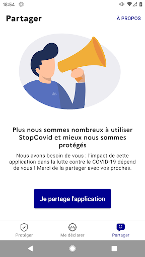
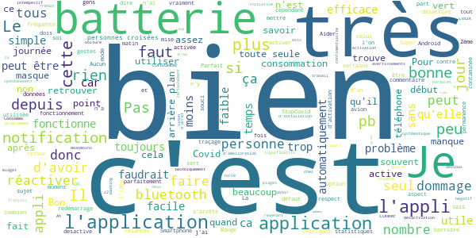
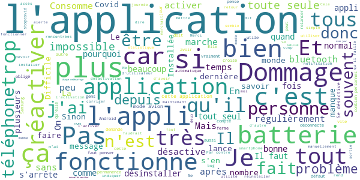
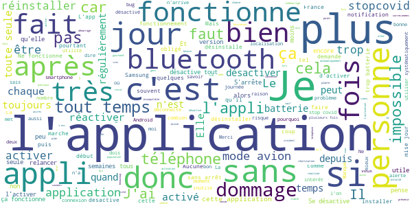

# StopCovid France
App version ``1.1.2``

Analyzed with [covid-apps-observer](http://github.com/covid-apps-observer) project, version ``0.1``

## App overview
| | |
|-------------------------|-------------------------| 
| **Name**&nbsp;&nbsp;&nbsp;&nbsp;&nbsp;&nbsp;&nbsp;&nbsp;&nbsp;&nbsp;&nbsp;&nbsp;&nbsp;&nbsp;&nbsp;&nbsp;&nbsp;&nbsp;&nbsp;&nbsp;&nbsp;&nbsp;&nbsp;&nbsp;&nbsp;&nbsp;&nbsp;&nbsp;&nbsp;&nbsp;&nbsp;&nbsp;&nbsp;&nbsp;&nbsp;&nbsp;&nbsp;&nbsp;&nbsp;&nbsp;  | StopCovid France |
| **Unique identifier** | fr.gouv.android.stopcovid |
| **Link to Google Play** | [https://play.google.com/store/apps/details?id=fr.gouv.android.stopcovid](https://play.google.com/store/apps/details?id=fr.gouv.android.stopcovid) |
| **Summary**  | Protégeons nos proches, protégeons-nous et protégeons les autres |
| **Privacy policy** | [https://bonjour.stopcovid.gouv.fr/privacy.html](https://bonjour.stopcovid.gouv.fr/privacy.html) |
| **Latest version** | 1.1.2 |
| **Last update** | 2020-08-07 10:56:14 |
| **Recent changes** | Améliorations et corrections. |
| **Installs**  | 1 000 000+ |
| **Category** | Médecine |
| **First release** | 29 mai 2020 |
| **Size**  | 19M |
| **Supported Android version**  | 5.0 ou version ultérieure |

### Description
> L'application StopCovid est destinée au territoire français.
 Avec StopCovid, participez à la protection de vos proches, de vous-même et de tous en étant alerté si vous avez été à proximité d’un utilisateur testé positif.
 Protégeons nos proches, protégeons-nous et protégeons les autres. 
 StopCovid, c’est simple :
 # J'active l'application
 En utilisant le Bluetooth de votre téléphone, StopCovid détecte les téléphones des autres utilisateurs qui restent à proximité du vôtre.
 # Je reste informé
 Vous serez informé si vous avez été à proximité d’un utilisateur testé positif au COVID-19.
 # Je protège mes proches et les autres
 Si vous effectuez un test COVID-19 et qu’il est positif, votre laboratoire vous donnera un code à scanner ou à saisir pour avertir anonymement les utilisateurs que vous avez rencontrés.
 #  Mes données sont protégées
 L’application n’utilise à aucun moment la localisation des personnes, et il est impossible de connaître l’identité des utilisateurs.
 Cette application de suivi de chaîne de transmission de la Covid-19 a été réalisée par l'équipe StopCovid, sous la supervision du Ministère des Solidarités et de la Santé et du Secrétariat d'Etat chargé du Numérique.

### User interface
The developers of the app provide the following screenshots in the Google play store.
| | | |
|:-------------------------:|:-------------------------:|:-------------------------:|
 |   |   |   | 
 |   |   |   | 

## Development team
In the following we report the main information provided by the development team in the Google play store.

| | |
|-------------------------|-------------------------|
| **Developer**  | Gouvernement |
| **Website**  | [https://stopcovid.gouv.fr](https://stopcovid.gouv.fr) |
| **Email** | contact@stopcovid.gouv.fr |
| **Physical address**  | [20 avenue de Ségur 75007 Paris](https://www.google.com/maps/search/20%20avenue%20de%20Ségur%2075007%20Paris) (Google Maps) |
| **Other developed apps**  | [https://play.google.com/store/apps/developer?id=Gouvernement](https://play.google.com/store/apps/developer?id=Gouvernement) |

## Android support

| | |
|-------------------------|-------------------------|
| **Declared target Android version**  | Android10, version 10 (API level 29) |
| **Effective target Android version**  | Android10, version 10 (API level 29) |
| **Minimum supported Android version**  | Lollipop, version 5.0 (API level 21) |
| **Maximum target Android version**  | - |

The larger the difference between the minimum and maximum supported Android versions, the better. A larger difference means a wider audience. For example, old phones have a very low Android version, so a high minimum supported Android version means that the app cannot be used by users with old phones, thus leading to accessibility problems. 

## Requested permissions

In the following we report the complete list of the permissions requested by the app. 

| **Permission** | **Protection level** | **Description** | 
|-------------------------|-------------------------|-------------------------|
 **android.permission ACCESS_COARSE_LOCATION** | :warning:**Dangerous** | Allows an app to access approximate location. 
 **android.permission ACCESS_FINE_LOCATION** | :warning:**Dangerous** | Allows an app to access precise location. 
 **android.permission ACCESS_NETWORK_STATE** | Normal | Allows applications to access information about networks. 
 **android.permission BLUETOOTH** | Normal | Allows applications to connect to paired bluetooth devices. 
 **android.permission BLUETOOTH_ADMIN** | Normal | Allows applications to discover and pair bluetooth devices. 
 **android.permission CAMERA** | :warning:**Dangerous** | Required to be able to access the camera device. 
 **android.permission FOREGROUND_SERVICE** | Normal | Allows a regular application to use Service.startForeground. 
 **android.permission INTERNET** | Normal | Allows applications to open network sockets. 
 **android.permission RECEIVE_BOOT_COMPLETED** | Normal | Allows an application to receive the Intent.ACTION_BOOT_COMPLETED that is broadcast after the system finishes booting. 
 **android.permission REQUEST_IGNORE_BATTERY_OPTIMIZATIONS** | Normal | Permission an application must hold in order to use Settings.ACTION_REQUEST_IGNORE_BATTERY_OPTIMIZATIONS. 
 **android.permission WAKE_LOCK** | Normal | Allows using PowerManager WakeLocks to keep processor from sleeping or screen from dimming. 

## Mentioned servers

| **Server** | **Registrant** | **Registrant country** | **Creation date** | 
|-------------------------|-------------------------|-------------------------|-------------------------|
 | stopcovid.gouv.fr | Etat francais represente par le Ministere de l Economie et des Finances de l Action et des Comptes publics | - | 2020-04-15 12:02:42 |

## Security analysis 

Below we report the main security warnings raised by our execution of the [Androwarn](https://github.com/maaaaz/androwarn) security analysis tool.

**Connection interfaces exfiltration**
> - This application reads details about the currently active data network 
> - This application tries to find out if the currently active data network is metered 

**Telephony services abuse**
> - This application makes phone calls 

**Suspicious connection establishment**
> - This application opens a Socket and connects it to the remote address '; port is out of range' on the 'N/A' port  
> - This application opens a Socket and connects it to the remote address 'Lcom/android/tools/r8/GeneratedOutlineSupport;->outline18(Ljava/lang/String;)Ljava/lang/StringBuilder;' on the 'N/A' port  
> - This application opens a Socket and connects it to the remote address 'Ljava/net/Proxy;->type()Ljava/net/Proxy$Type;' on the 'N/A' port  
> - This application opens a Socket and connects it to the remote address 'Only InetSocketAddress is supported.' on the 'N/A' port  
> - This application opens a Socket and connects it to the remote address 'Wrapped socket should already be bound' on the 'N/A' port  
> - This application opens a Socket and connects it to the remote address 'Wrapped socket should already be connected' on the 'N/A' port  
> - This application opens a Socket and connects it to the remote address 'timeout' on the 'N/A' port  

## User ratings and reviews

Below we provide information about how end users are reacting to the app in terms of ratings and reviews in the Google Play store.

### Ratings

The StopCovid France app has been installed by more than **1000000** times. At this time, **9066** rated the app and its average score is **2.800885**. Below we show the distribution of the ratings across the usual star-based rating of Google Play

:star::star::star::star::star:: 2838

:star::star::star::star:: 902

:star::star::star:: 772

:star::star:: 722

:star:: 3830

### Reviews 

#### 5-star reviews

> Devrez être obligatoire dans les lieux confinés comme le port du masque.  :date: __2020-08-17 14:00:01__

> À installer  :date: __2020-08-16 18:51:06__

> Avec la dernière mise à jour, l'application plante lorsqu'on l'active. Il faut désinstaller et réinstaller l'application. Un petit widget Android avec juste un bouton pour activer/désactiver StopCovid ce serait super pratique ... :)  :date: __2020-08-15 23:07:30__

> 100% RGPD, pas de données demandées pour la démarrage, uniquement accès au bluetooth selon les standards de "contact tracking"  :date: __2020-08-15 16:29:42__

> Pas de problème, ni pour le téléchargement ni pour l'exécution. Comme souvent en informatique, le problème est l'utilisateur... Nous acceptons de multiples contrainte dû au Covid et la moins gênante, StopCovid, est boycottée pour de mauvaises raisons. 🙄  :date: __2020-08-14 08:38:09__

> Très bien, très clair.  :date: __2020-08-12 23:02:10__

> Utile.  :date: __2020-08-12 19:00:22__

> Je ne sais pas mais je pense inutilr cartout lemonde 'ne l' a pas accepter  :date: __2020-08-12 14:20:31__

> Simple  :date: __2020-08-12 00:03:37__

> Le meilleur idée  :date: __2020-08-11 22:16:46__

#### 4-star reviews

> Cette appli part d une bonne initiative, mais il serait peut être bien d avoir une option/application pour savoir dans quelle rue mettre le masque.  :date: __2020-08-15 12:03:23__

> Consommé beaucoup de batterie. Sinon, l'idée est bonne.  :date: __2020-08-14 08:10:14__

> Pas de retour techniquement negatif. Le travail est bien fait. Les avertissements sont clairs. Neanmoins, il y a deux axes d'amélioration significatifs car je desactive l'application en revenant chez moi ou dans la voiture. - Activation programmée par plages horaires - Widget d'activation et de desactivation pour activer plus spontanément l'application.  :date: __2020-08-14 07:46:59__

> Aucun pb de fonctionnement sur moto z2 force. Pas de pb de consommation de batterie, pas de pb d'arrêt/relance intempestif, pas de pb de confidentialité, très facile d'installation... Ah si un gros pb: c'est français. D'où très certainement le french bashing des commentaires un peu trop systématique ci dessous. En fait le seul vrai pb , c'est l'égoïsme de certains qui rejoint celui de ceux qui ne veulent pas porter de masque.  :date: __2020-08-13 09:04:14__

> Bie  :date: __2020-08-12 22:40:54__

> POUR L'INSTANT pas recu d'alerte et tant 😉😷  :date: __2020-08-11 21:55:29__

> Mange de la batterie et n'est pas assez utilisée pour être vraiment efficace.  :date: __2020-08-11 19:28:02__

> L'idée est excellente. Cette application repose sur la bonne volonté de chacun d'entre nous, sur la solidarité.... civilité et respect en cette période compliquée. Voyons les aspects positifs toujours avant les critiques.... c'est tellement facile les critiques ! C'est donc une solution utile... mais qu'il faut peut-être améliorer sur certains points. Voilà. Bonne journée à tous.  :date: __2020-08-11 19:21:24__

> Aider dans la possibilité à faire reculer et même à stopper le Covid19. Il faut y croire. Il y va de notre salut.  :date: __2020-08-11 09:45:58__

> Très simple, très bien.  :date: __2020-08-11 01:11:54__

#### 3-star reviews

> L'application pourrait être utile peut-être si elle ne se fermait pas régulièrement. Il faut penser à la relancer. Je ne parle pas du message dans les notifications "Stop Covid a besoin de votre action" pour le réactiver, là dessus pas de souci. J'ai vérifié les autorisations et comparé par rapport à une autre appli qui fonctionne parfaitement en arrière plan, les autorisations sont pourtant les mêmes. Quant à l'utilité pas sur que beaucoup de gens se déclarent... mais si on n'essaie pas...  :date: __2020-08-16 10:55:02__

> Pas de statistique disponible ( combien de personnes ayant l'appli ai je croisé ?) Et si peu de gens l'ont elle ne sert a rien. C'est étrange que tous le monde accepte des appli comme f...Book / twi.../ Snap../.... Qui nous espionne 24/24 sur des montagnes de parametres et que peu de gens activent stopcovid au prétexte que ça nous espionne sur 1 seul paramètre pour notre bien commun.  :date: __2020-08-15 10:50:07__

> L'idée est bonne mais elle se base sur la bonne volonté de chacun ce qui n'est visiblement pas le cas et c'est dommage. Il faut cependant que l'appli soit améliorée car il y a plusieurs disfonctionnements : l'application se désactive en mode économie d'énergie ce qui est normal compte tenu de la désactivation du bt. Par contre, on ne devrait pas devoir la réactiver manuellement. Ensuite, la dernière maj crash l'appli au démarrage. A retravailler donc  :date: __2020-08-15 10:21:11__

> Installée elle se déconnecte du jour au lendemain. Malheureux on s'en rend compte au bout d'une semaine qu'elle était déconnectée.  :date: __2020-08-14 19:28:10__

> Consomme trop la batterie.  :date: __2020-08-10 21:17:38__

> Se desactive souvent  :date: __2020-08-08 20:29:13__

> Difficile à évaluer car il n'est pas possible de quantifié le service rendu (ex : nombre de personnes que l'on a croisés)  :date: __2020-08-07 09:45:41__

> Pas d'information  :date: __2020-08-07 09:24:39__

> Ça à l'air de fonctionner, mais avec si peu d'utilisateur ça va être difficile de voir des alertes.  :date: __2020-08-05 09:36:54__

> Aplli certainement utile, simple et claire. Installée dès le 1et jour en 3 min chrono sur Samsung A6. MAIS: 1)Consomme trop de batterie.. 2) pourquoi les utilisateurs d'android n'ont pas de message quotidien comme sur Apple sur le fait d'avoir croisé ou non des personnes infectées? On a l'impression que l'appli ne fonctionne pas... 3) conflit avec les autres appareils bluetooth : notamment android auto (très désagréable en voiture). Obligé de la réactiver en sortant de la voiture (oubli)!  :date: __2020-08-04 11:06:20__

#### 2-star reviews

> S'arrête immédiatement C'est la troisième fois que je dois installer  :date: __2020-08-16 20:59:30__

> Ne fonctionne pas du tout sur mes 2 telephones qui n'ont pas le "BLE". j'aurai accepte de vider ma batterie plus vite. La sante n'a pas de prix et comme je sors tres peu, ce n'est vraiment pas genant que temporairement la batterie se vide plus vite. Parfois j'emmene ma tablette sur laquelle stopcovid fonctionne mais c'est lourd et encombrant. Je vais devoir acheter un new tel en esperant que ca fonctionne dessus... A quand la version qui ignore l'absence de " BLE" ?  :date: __2020-08-16 19:03:28__

> Ne fonctionne plus. Démarrage avec beaucoup d'avertissement a valider. Non convivial. N'averti pas de l'arrêt de l'appli si BT désactivé. Déçu. Un outil qui n'aura pas d'impact positif contre le Covid en France  :date: __2020-08-16 18:38:30__

> Je ne comprends pas pourquoi l'application ne peut pas d'elle-même activer le bluetooth lors alors qu'il est désactivé (permissions Android 10 ?)  :date: __2020-08-16 16:30:14__

> 22e 2 je 2020 e  :date: __2020-08-16 12:32:46__

> Ne fonctionne qu'en France et n'est pas obligatoire. Aucun intérêt du coup  :date: __2020-08-16 11:37:24__

> J'attend la compatibilité " notification d'exposition " - Widget activation/désactivation de stop covid  :date: __2020-08-15 23:23:10__

> Se désactive à chaque fois que l'on met le mode avion... pourquoi? Donc très régulièrement j'oublie de la remettre en route... c'est nul! L'appli Swisscovid elle reste allumée tout le temps... plus besoin d'y penser...  :date: __2020-08-14 13:25:49__

> L'application épuise bcp trop ma batterie. Mon téléphone qui tenait 2 jours, ne tiens même plus une journée complète avec l'application...  :date: __2020-08-13 17:00:48__

> Troisième fois depuis son installation que l'application plante systématiquement à l'activation, et qu'il faut donc effacer les données (et perdre les contacts enregistrés) pour qu'elle refonctionne.  :date: __2020-08-12 23:54:56__

#### 1-star reviews

> 3ème édition de mon avis, après une déception au bout d'une semaine d'utilisation, une 2nde chance chance donnée quelques temps après et là, la confirmation que c'est encore bugué. Pourtant j'y ai crû, je lui ai laissé du temps, j'en ai même parlé autour de moi... Mais tant pis. Énième bug qui m'oblige à la désinstaller car crash systématique au lancement. Depuis quand ? Aucune idée, j'avais pas fait gaffe évidemment ! Quel gâchis alors que ça aurait pu être si utile... ☹️  :date: __2020-08-17 07:55:42__

> Une fois l'appli téléchargée impossible de l'activer. Elle s'arrête systématiquement lorsque l'activation est demandée. Pour moi appli qui ne fonctionne absolument pas donc je l'ai malheureusement désinstallee  :date: __2020-08-16 19:28:18__

> Impossible de démarrer l'application. Elle crash dès qu'on essaye de l'activer.  :date: __2020-08-16 14:42:23__

> Inutile tous comme le masque il y a environ 1 millions de microve et de virus au mètre carré de soit c est juste un virus que le corp doit apprendre a se défendre et se n est surtout pas le masque qui vas arrangé les il nous rend plus faible.  :date: __2020-08-16 10:13:14__

> Consommation batterie énorme.  :date: __2020-08-15 22:15:24__

> Tout le temps désactivée ! Et refuse de se remettre en fonction ! Inutile en montagne ça ne fonctionne pas ! Et ailleurs pas tout le temps . A quoi peut bien servir cette appli qui fonctionne a temps partiel ?!....et ça continue impossible de réactiver bluetooth bien en fonction ça fait 3 jours et je dois a nouveau désinstaller et réinstaller ! Très Bof !  :date: __2020-08-15 18:51:00__

> plante au démarrage... inutilisable  :date: __2020-08-14 23:23:16__

> L'application a fonctionné une journée. Le deuxième jour, elle s'arrête automatiquement. Impossible de la reconnecter. Et pourtant elle était paramétrée en arrière plan le premier jour. Pitoyable ! Encore une application de l'état développé à l'arrache !! Et ils insistent pour que les gens l'installent...  :date: __2020-08-14 21:43:39__

> Se déconnecte sans arrêt. Manque de fiabilité. Posez des questions sur son look ne rend pas cette appli meilleure.  :date: __2020-08-14 18:01:22__

> Stop dépenses, non compatible Europe, Android : inutile pour 100k€/mois... J'invite tous les Français à utiliser une app de nos voisins compatibles (perso j'ai l'application allemande corona-warn) !  :date: __2020-08-14 17:29:55__

