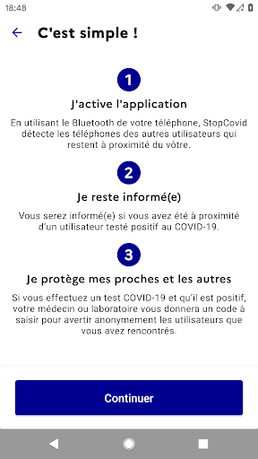
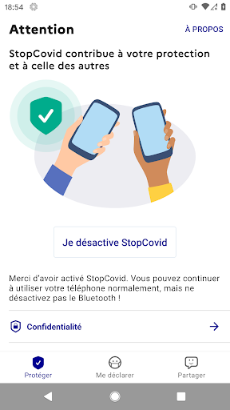
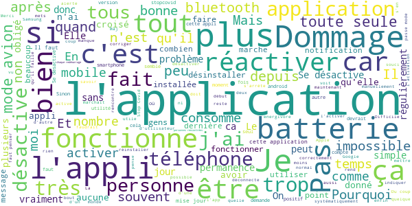
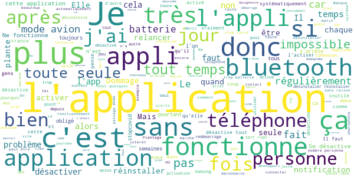
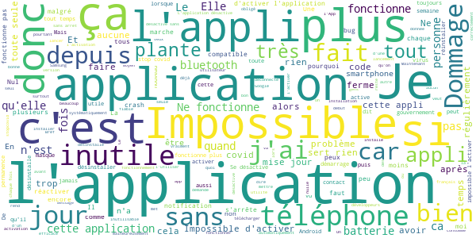

# StopCovid France
App version ``1.1.3``

Analyzed with [covid-apps-observer](http://github.com/covid-apps-observer) project, version ``0.1``

## App overview
| | |
|-------------------------|-------------------------| 
| **Name**&nbsp;&nbsp;&nbsp;&nbsp;&nbsp;&nbsp;&nbsp;&nbsp;&nbsp;&nbsp;&nbsp;&nbsp;&nbsp;&nbsp;&nbsp;&nbsp;&nbsp;&nbsp;&nbsp;&nbsp;&nbsp;&nbsp;&nbsp;&nbsp;&nbsp;&nbsp;&nbsp;&nbsp;&nbsp;&nbsp;&nbsp;&nbsp;&nbsp;&nbsp;&nbsp;&nbsp;&nbsp;&nbsp;&nbsp;&nbsp;  | StopCovid France |
| **Unique identifier** | fr.gouv.android.stopcovid |
| **Link to Google Play** | [https://play.google.com/store/apps/details?id=fr.gouv.android.stopcovid](https://play.google.com/store/apps/details?id=fr.gouv.android.stopcovid) |
| **Summary**  | Protégeons nos proches, protégeons-nous et protégeons les autres |
| **Privacy policy** | [https://bonjour.stopcovid.gouv.fr/privacy.html](https://bonjour.stopcovid.gouv.fr/privacy.html) |
| **Latest version** | 1.1.3 |
| **Last update** | 2020-08-07 10:56:14 |
| **Recent changes** | Améliorations et corrections. |
| **Installs**  | 1 000 000+ |
| **Category** | Médecine |
| **First release** | 29 mai 2020 |
| **Size**  | 20M |
| **Supported Android version**  | 5.0 ou version ultérieure |

### Description
> L'application StopCovid est destinée au territoire français.
 Avec StopCovid, participez à la protection de vos proches, de vous-même et de tous en étant alerté si vous avez été à proximité d’un utilisateur testé positif.
 Protégeons nos proches, protégeons-nous et protégeons les autres. 
 StopCovid, c’est simple :
 # J'active l'application
 En utilisant le Bluetooth de votre téléphone, StopCovid détecte les téléphones des autres utilisateurs qui restent à proximité du vôtre.
 # Je reste informé
 Vous serez informé si vous avez été à proximité d’un utilisateur testé positif au COVID-19.
 # Je protège mes proches et les autres
 Si vous effectuez un test COVID-19 et qu’il est positif, votre laboratoire vous donnera un code à scanner ou à saisir pour avertir anonymement les utilisateurs que vous avez rencontrés.
 #  Mes données sont protégées
 L’application n’utilise à aucun moment la localisation des personnes, et il est impossible de connaître l’identité des utilisateurs.
 Cette application de suivi de chaîne de transmission de la Covid-19 a été réalisée par l'équipe StopCovid, sous la supervision du Ministère des Solidarités et de la Santé et du Secrétariat d'Etat chargé du Numérique.

### User interface
The developers of the app provide the following screenshots in the Google play store.
| | | |
|:-------------------------:|:-------------------------:|:-------------------------:|
 |   |   |   | 
 |   |   |   | 

## Development team
In the following we report the main information provided by the development team in the Google play store.

| | |
|-------------------------|-------------------------|
| **Developer**  | Gouvernement |
| **Website**  | [https://stopcovid.gouv.fr](https://stopcovid.gouv.fr) |
| **Email** | contact@stopcovid.gouv.fr |
| **Physical address**  | [20 avenue de Ségur 75007 Paris](https://www.google.com/maps/search/20%20avenue%20de%20Ségur%2075007%20Paris) (Google Maps) |
| **Other developed apps**  | [https://play.google.com/store/apps/developer?id=Gouvernement](https://play.google.com/store/apps/developer?id=Gouvernement) |

## Android support

| | |
|-------------------------|-------------------------|
| **Declared target Android version**  | Android10, version 10 (API level 29) |
| **Effective target Android version**  | Android10, version 10 (API level 29) |
| **Minimum supported Android version**  | Lollipop, version 5.0 (API level 21) |
| **Maximum target Android version**  | - |

The larger the difference between the minimum and maximum supported Android versions, the better. A larger difference means a wider audience. For example, old phones have a very low Android version, so a high minimum supported Android version means that the app cannot be used by users with old phones, thus leading to accessibility problems. 

## Requested permissions

In the following we report the complete list of the permissions requested by the app. 

| **Permission** | **Protection level** | **Description** | 
|-------------------------|-------------------------|-------------------------|
 **android.permission ACCESS_COARSE_LOCATION** | :warning:**Dangerous** | Allows an app to access approximate location. 
 **android.permission ACCESS_FINE_LOCATION** | :warning:**Dangerous** | Allows an app to access precise location. 
 **android.permission ACCESS_NETWORK_STATE** | Normal | Allows applications to access information about networks. 
 **android.permission BLUETOOTH** | Normal | Allows applications to connect to paired bluetooth devices. 
 **android.permission BLUETOOTH_ADMIN** | Normal | Allows applications to discover and pair bluetooth devices. 
 **android.permission CAMERA** | :warning:**Dangerous** | Required to be able to access the camera device. 
 **android.permission FOREGROUND_SERVICE** | Normal | Allows a regular application to use Service.startForeground. 
 **android.permission INTERNET** | Normal | Allows applications to open network sockets. 
 **android.permission RECEIVE_BOOT_COMPLETED** | Normal | Allows an application to receive the Intent.ACTION_BOOT_COMPLETED that is broadcast after the system finishes booting. 
 **android.permission REQUEST_IGNORE_BATTERY_OPTIMIZATIONS** | Normal | Permission an application must hold in order to use Settings.ACTION_REQUEST_IGNORE_BATTERY_OPTIMIZATIONS. 
 **android.permission WAKE_LOCK** | Normal | Allows using PowerManager WakeLocks to keep processor from sleeping or screen from dimming. 

## Mentioned servers

| **Server** | **Registrant** | **Registrant country** | **Creation date** | 
|-------------------------|-------------------------|-------------------------|-------------------------|
 | stopcovid.gouv.fr | Etat francais represente par le Ministere de l Economie et des Finances de l Action et des Comptes publics | - | 2020-04-15 12:02:42 |

## Security analysis 

Below we report the main security warnings raised by our execution of the [Androwarn](https://github.com/maaaaz/androwarn) security analysis tool.

**Connection interfaces exfiltration**
> - This application reads details about the currently active data network 
> - This application tries to find out if the currently active data network is metered 

**Telephony services abuse**
> - This application makes phone calls 

**Suspicious connection establishment**
> - This application opens a Socket and connects it to the remote address '; port is out of range' on the 'N/A' port  
> - This application opens a Socket and connects it to the remote address 'Lcom/android/tools/r8/GeneratedOutlineSupport;->outline18(Ljava/lang/String;)Ljava/lang/StringBuilder;' on the 'N/A' port  
> - This application opens a Socket and connects it to the remote address 'Ljava/net/Proxy;->type()Ljava/net/Proxy$Type;' on the 'N/A' port  
> - This application opens a Socket and connects it to the remote address 'Only InetSocketAddress is supported.' on the 'N/A' port  
> - This application opens a Socket and connects it to the remote address 'Wrapped socket should already be bound' on the 'N/A' port  
> - This application opens a Socket and connects it to the remote address 'Wrapped socket should already be connected' on the 'N/A' port  
> - This application opens a Socket and connects it to the remote address 'timeout' on the 'N/A' port  

## User ratings and reviews

Below we provide information about how end users are reacting to the app in terms of ratings and reviews in the Google Play store.

### Ratings

The StopCovid France app has been installed by more than **1000000** times. At this time, **9182** rated the app and its average score is **2.878821**. Below we show the distribution of the ratings across the usual star-based rating of Google Play

:star::star::star::star::star:: 3017

:star::star::star::star:: 932

:star::star::star:: 801

:star::star:: 781

:star:: 3648

### Reviews 

#### 5-star reviews

> Je ne suis pas malade mais malheurs qu'aussi de gens l'ont téléchargés  :date: __2020-09-15 02:10:50__

> Très bien sous Android 11. Du fait qu'elle est Open Source et du traitement des données, elle très respectueuse de la vie privée, même si j'en ai rien à foutre de votre rgpd de mrd.  :date: __2020-09-14 21:04:43__

> Moi personnellement, je ne suis pas embêter , je suis bien contente de l avoir.  :date: __2020-09-13 13:19:13__

> Grave à cette application je n'ai plus le Covid! Merci aux développeurs 👏🏾👏🏾👏🏾  :date: __2020-09-13 04:09:39__

> Zero 0 🦴😵😠😠🙁☹️😰😨☠️  :date: __2020-09-12 14:55:43__

> Elle est superbe cette application 👏👏👏👏 !!!  :date: __2020-09-11 07:59:16__

> Je les mis sur mon telephonne  :date: __2020-09-10 23:27:22__

> Aucun problème 👍  :date: __2020-09-10 16:25:58__

> Très bien  :date: __2020-09-10 14:51:07__

> Contrairement aux avis négatifs, l'appli ne se désactive pas toute seule... Et pourtant je joue à des jeux très souvent. Je viens même de redémarrer mon tel pour voir si ça desactivait l'app. Ben.. non. Lol. Il.y"a peut-être eu une mise à jour. En tout cas j'ai autorisé l'appli à activer le bluetooth. Je ne l'avais pas activé avant de la télécharger. Tel samsung. Je me sens rassurée .Et pourtant je sors et je reste aussi longtemps chez moi. Pour répondre à une personne qui a mis 1* ...  :date: __2020-09-10 08:42:26__

#### 4-star reviews

> Fonctionne bien, elle se désactivait toute seule au début mais ça va mieux maintenant, notification présente en permanence mais heureusement mon OS permet de la cacher.  :date: __2020-09-14 20:19:20__

> Possible d'avoir un icône de notification différent, qui interpelle davantage, quand l'application a besoin de notre intervention pour être réactivée ?  :date: __2020-09-12 21:19:39__

> Contrairement à ce que j'ai pu lire, pas de problème de batterie. Elle tient la journée et pas de problème de déconnexion. A voir à l'usage  :date: __2020-09-12 13:45:32__

> Bonjour, Comme beaucoup de personnes, je mets mon téléphone en mode avion pendant la nuit, mais il faut réactiver stocovid chaque jour. C'est gênant et surtout on oublie... Sinon l'application est très utile. Les trops nombreuses personnes qui critiquent son aspect invasif depuis leur smartphone ouverts à tous les vents me font bien rigoler...  :date: __2020-09-11 10:39:30__

> À un très bon potentielle, à améliorer  :date: __2020-09-10 14:12:57__

> Semble bien fonctionné  :date: __2020-09-09 00:21:35__

> L'appli est très chargée en messages destinés à rassurer les utilisateurs sur la protection de la vie privée. Il y en a même trop à mon goût, j'aimerais pouvoir oublier que cette application est installée, et ne pas avoir à la réactiver quand je sors du mode 'avion'. Les droits demandés sont normaux. Il n'y a pas de sur-utilisation de la batterie.  :date: __2020-09-07 06:34:05__

> Améliorée le 5 août. Se réactive bien après mode avion et après redémarrage.  :date: __2020-09-05 05:16:53__

> Le disign et les graphismes sont juste impressionnent j'ai été déçu par le gameplay qui devient untres peu palpitant au fil du temps j'ai fait top 1 que 4 fois en un semaine. Mais il reste très très jouable  :date: __2020-09-03 07:24:29__

> Fonctionne très bien. Une amélioration serait de connaître le nombre de téléphone utilisant l appli croisé dans la semaine, le mois, par jour. Ça aiderai chacun à percevoir l utilité de son action en installant cette appli  :date: __2020-08-31 01:18:42__

#### 3-star reviews

> A partir du moment où on la télécharge, elle devrait toute seule activer le Bluetooth avec option désactiver et non pas l'inverse car on oublie souvent. En tout cas moi  :date: __2020-09-14 17:27:17__

> Se désactive fréquemment. Inefficace si on oublie de le réactiver (mon cas). Et pourtant, mon mobile reste allumé en permanence. Je ne passe pas en mode avion, ni l'éteint.  :date: __2020-09-14 09:51:16__

> Application qui se désactive souvent toute seule... J'ai du coup passer plusieurs heures sans pouvoir avoir de notifications au cas où...  :date: __2020-09-11 21:11:03__

> Se desactive régulièrement et souvent sans avertissements.  :date: __2020-09-09 07:55:49__

> L app se desactive par elle même après le mode avion...pas pratique...  :date: __2020-09-08 21:57:47__

> Je  :date: __2020-09-07 16:34:07__

> L. Application ne fonctionne plus  :date: __2020-09-07 15:40:12__

> Pourquoi était il désactivé ? Je viens de m'apercevoir que l'application était désactivée. Depuis quand ? Pourquoi ? Je n'en sais rien. Ce serait bien plus simple que l'application démarre en même temps que le téléphone et qu'elle reste active jusqu'à ce qu'on décide du contraire.  :date: __2020-09-07 12:24:50__

> L'appli fait sûrement son boulot, mais ça n'est juste pas possible de demander systématiquement à l'utilisateur la réactivation après une mise en mode avion... 🥴  :date: __2020-09-06 08:11:32__

> L'application se désactive toute seule systématiquement au bout de quelques jours... C'est assez ennuyeux : peut elle vraiment servir à quelque chose dans ces circonstances ? En ce qui concerne l'icone d'application qui s'affiche dans la barre en haut, c'est indispensable sur un système android pour avoir la permission d'exécution en tâche de fond en permanence (je répond à une critique lue dans les commentaires).  :date: __2020-09-04 08:29:04__

#### 2-star reviews

> consomme de la batterie sans savoir si l'application est utile.en effet on ne sait pas le nombre de personnes que l'on a croisé ayant installé l'app  :date: __2020-09-15 12:32:07__

> Application très energivore, bluetooth et géolocalisation. Désinstallé après 24h.  :date: __2020-09-15 12:21:36__

> Heureusement aucun cas contact jusqu'à présent ! Manque d'utilisateurs, distance sociale respectée = pas de connexion bluetooth....? Voilà peut être une dépense sur le budget de l'État français qui n'aura pas eût l'effet attendu donc inutile ? C'est une question que je me pose et non un avis ! Je ne l'aurais pas installée sinon ! D'ailleurs je n'en entend plus parler à toutes les échelles des autorités compétentes. Affaires à suivre. Bien à vous.  :date: __2020-09-15 10:13:08__

> Assez nul. Ça s'arrête toujours.  :date: __2020-09-14 17:11:55__

> Re installations régulières obligatoire dûes à l impossibilité de redémarrer l application.  :date: __2020-09-14 10:58:50__

> Au bout de quelques jours, l'appli se coupe. Quand je veux la relancer, ça plante en boucle. Seul moyen que j'ai trouvé, c'est la désinstaller et la réinstaller. Faites quelque chose, c'est vraiment pas sérieux de proposer une appli avec ce niveau de qualité...  :date: __2020-09-14 10:08:34__

> Ne comprends pas comment ça marche. Télécharge mais pas utilisé  :date: __2020-09-13 15:37:19__

> Je l'avais installée par civisme, mais ma batterie se vide trop vite. Je desinstalle.  :date: __2020-09-12 23:45:29__

> Je me demande vraiment qui sont les gens qui ont pensé que c'était une bonne idée de mettre par défaut une notification épinglée H24 dans la barre de notifications alors qu'il n'y a aucune alerte pertinente (par exemple cas contact), juste pour dire que l'application est active ! Ce n'est absolument pas évident et intuitif de trouver où retirer cette notification permanente et je suis persuadée que ça a motivé beaucoup de personnes a désinstaller ou désactiver l'application juste pour ça...  :date: __2020-09-12 22:49:02__

> Sur mon Xiaomi (redmi 4x), l'appli crashe au lancement! inutilisable!  :date: __2020-09-12 17:05:17__

#### 1-star reviews

> Se désactive tout seul et en plus n'est pas compatible avec une solution européenne  :date: __2020-09-15 15:21:56__

> L application plante au démarrage...  :date: __2020-09-15 12:45:25__

> Sa ne sert pas a grand chose  :date: __2020-09-15 08:31:18__

> Se referme dès l'ouverture en permanence. Je désinstalle !  :date: __2020-09-15 08:10:22__

> Utilité ?  :date: __2020-09-15 08:06:07__

> Vraiment nul  :date: __2020-09-15 08:05:25__

> Je ne pense pas au Bluetooth... Et inutile... Trop peu utilisée  :date: __2020-09-15 03:04:00__

> L'activation échoue sur le message : "une erreur ROBERT non répertoriée est survenue". Inutilisable ! Toujours inutilisable 3+ mois après, la seule modification est l'ajout d'un Captcha pour rendre l'échec de l'activation encore plus agaçant.  :date: __2020-09-14 19:32:52__

> Cette application ne sert à rien, pas de notification et je ne pense pas que j en aurai étant donné que les gens qui ont le covid sont isolés chez eux donc on ne risque pas de les croiser  :date: __2020-09-14 11:10:25__

> L'appli ce desactive tte seule et obligé de des installer et réinstaller sinon impossible d'activité l'appli, c'est dommage car elle pourrait être très utile  :date: __2020-09-14 09:54:41__

