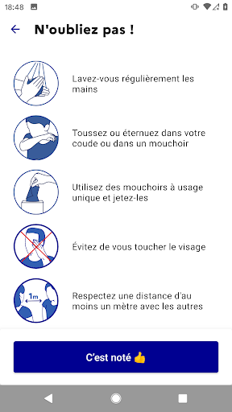
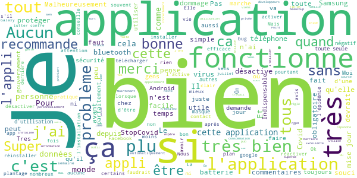
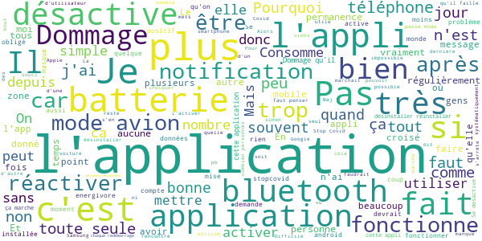
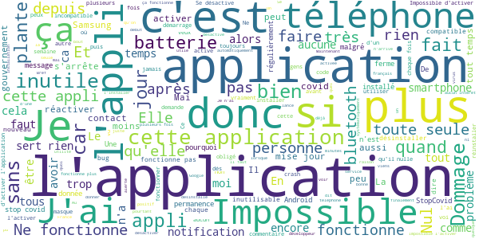

# StopCovid France
App version ``1.1.4``

Analyzed with [covid-apps-observer](http://github.com/covid-apps-observer) project, version ``0.1``

## App overview
| | |
|-------------------------|-------------------------| 
| **Name**&nbsp;&nbsp;&nbsp;&nbsp;&nbsp;&nbsp;&nbsp;&nbsp;&nbsp;&nbsp;&nbsp;&nbsp;&nbsp;&nbsp;&nbsp;&nbsp;&nbsp;&nbsp;&nbsp;&nbsp;&nbsp;&nbsp;&nbsp;&nbsp;&nbsp;&nbsp;&nbsp;&nbsp;&nbsp;&nbsp;&nbsp;&nbsp;&nbsp;&nbsp;&nbsp;&nbsp;&nbsp;&nbsp;&nbsp;&nbsp;  | StopCovid France |
| **Unique identifier** | fr.gouv.android.stopcovid |
| **Link to Google Play** | [https://play.google.com/store/apps/details?id=fr.gouv.android.stopcovid](https://play.google.com/store/apps/details?id=fr.gouv.android.stopcovid) |
| **Summary**  | Protégeons nos proches, protégeons-nous et protégeons les autres |
| **Privacy policy** | [https://bonjour.stopcovid.gouv.fr/privacy.html](https://bonjour.stopcovid.gouv.fr/privacy.html) |
| **Latest version** | 1.1.4 |
| **Last update** | 2020-09-15 15:47:01 |
| **Recent changes** | Améliorations et corrections. |
| **Installs**  | 1 000 000+ |
| **Category** | Médecine |
| **First release** | 29 mai 2020 |
| **Size**  | 20M |
| **Supported Android version**  | 5.0 ou version ultérieure |

### Description
> L'application StopCovid est destinée au territoire français.
 Avec StopCovid, participez à la protection de vos proches, de vous-même et de tous en étant alerté si vous avez été à proximité d’un utilisateur testé positif.
 Protégeons nos proches, protégeons-nous et protégeons les autres. 
 StopCovid, c’est simple :
 # J'active l'application
 En utilisant le Bluetooth de votre téléphone, StopCovid détecte les téléphones des autres utilisateurs qui restent à proximité du vôtre.
 # Je reste informé
 Vous serez informé si vous avez été à proximité d’un utilisateur testé positif au COVID-19.
 # Je protège mes proches et les autres
 Si vous effectuez un test COVID-19 et qu’il est positif, votre laboratoire vous donnera un code à scanner ou à saisir pour avertir anonymement les utilisateurs que vous avez rencontrés.
 #  Mes données sont protégées
 L’application n’utilise à aucun moment la localisation des personnes, et il est impossible de connaître l’identité des utilisateurs.
 Cette application de suivi de chaîne de transmission de la Covid-19 a été réalisée par l'équipe StopCovid, sous la supervision du Ministère des Solidarités et de la Santé et du Secrétariat d'Etat chargé du Numérique.

### User interface
The developers of the app provide the following screenshots in the Google play store.
| | | |
|:-------------------------:|:-------------------------:|:-------------------------:|
 |   |   |   | 
 |   |   |   | 

## Development team
In the following we report the main information provided by the development team in the Google play store.

| | |
|-------------------------|-------------------------|
| **Developer**  | Gouvernement |
| **Website**  | [https://stopcovid.gouv.fr](https://stopcovid.gouv.fr) |
| **Email** | contact@stopcovid.gouv.fr |
| **Physical address**  | [20 avenue de Ségur 75007 Paris](https://www.google.com/maps/search/20%20avenue%20de%20Ségur%2075007%20Paris) (Google Maps) |
| **Other developed apps**  | [https://play.google.com/store/apps/developer?id=Gouvernement](https://play.google.com/store/apps/developer?id=Gouvernement) |

## Android support

| | |
|-------------------------|-------------------------|
| **Declared target Android version**  | Android10, version 10 (API level 29) |
| **Effective target Android version**  | Android10, version 10 (API level 29) |
| **Minimum supported Android version**  | Lollipop, version 5.0 (API level 21) |
| **Maximum target Android version**  | - |

The larger the difference between the minimum and maximum supported Android versions, the better. A larger difference means a wider audience. For example, old phones have a very low Android version, so a high minimum supported Android version means that the app cannot be used by users with old phones, thus leading to accessibility problems. 

## Requested permissions

In the following we report the complete list of the permissions requested by the app. 

| **Permission** | **Protection level** | **Description** | 
|-------------------------|-------------------------|-------------------------|
 **android.permission ACCESS_COARSE_LOCATION** | :warning:**Dangerous** | Allows an app to access approximate location. 
 **android.permission ACCESS_FINE_LOCATION** | :warning:**Dangerous** | Allows an app to access precise location. 
 **android.permission ACCESS_NETWORK_STATE** | Normal | Allows applications to access information about networks. 
 **android.permission BLUETOOTH** | Normal | Allows applications to connect to paired bluetooth devices. 
 **android.permission BLUETOOTH_ADMIN** | Normal | Allows applications to discover and pair bluetooth devices. 
 **android.permission CAMERA** | :warning:**Dangerous** | Required to be able to access the camera device. 
 **android.permission FOREGROUND_SERVICE** | Normal | Allows a regular application to use Service.startForeground. 
 **android.permission INTERNET** | Normal | Allows applications to open network sockets. 
 **android.permission RECEIVE_BOOT_COMPLETED** | Normal | Allows an application to receive the Intent.ACTION_BOOT_COMPLETED that is broadcast after the system finishes booting. 
 **android.permission REQUEST_IGNORE_BATTERY_OPTIMIZATIONS** | Normal | Permission an application must hold in order to use Settings.ACTION_REQUEST_IGNORE_BATTERY_OPTIMIZATIONS. 
 **android.permission WAKE_LOCK** | Normal | Allows using PowerManager WakeLocks to keep processor from sleeping or screen from dimming. 

## Mentioned servers

| **Server** | **Registrant** | **Registrant country** | **Creation date** | 
|-------------------------|-------------------------|-------------------------|-------------------------|
 | stopcovid.gouv.fr | Etat francais represente par le Ministere de l Economie et des Finances de l Action et des Comptes publics | - | 2020-04-15 12:02:42 |

## Security analysis 

Below we report the main security warnings raised by our execution of the [Androwarn](https://github.com/maaaaz/androwarn) security analysis tool.

**Connection interfaces exfiltration**
> - This application reads details about the currently active data network 
> - This application tries to find out if the currently active data network is metered 

**Telephony services abuse**
> - This application makes phone calls 

**Suspicious connection establishment**
> - This application opens a Socket and connects it to the remote address '; port is out of range' on the 'N/A' port  
> - This application opens a Socket and connects it to the remote address 'Lcom/android/tools/r8/GeneratedOutlineSupport;->outline18(Ljava/lang/String;)Ljava/lang/StringBuilder;' on the 'N/A' port  
> - This application opens a Socket and connects it to the remote address 'Ljava/net/Proxy;->type()Ljava/net/Proxy$Type;' on the 'N/A' port  
> - This application opens a Socket and connects it to the remote address 'Only InetSocketAddress is supported.' on the 'N/A' port  
> - This application opens a Socket and connects it to the remote address 'Wrapped socket should already be bound' on the 'N/A' port  
> - This application opens a Socket and connects it to the remote address 'Wrapped socket should already be connected' on the 'N/A' port  
> - This application opens a Socket and connects it to the remote address 'timeout' on the 'N/A' port  

## User ratings and reviews

Below we provide information about how end users are reacting to the app in terms of ratings and reviews in the Google Play store.

### Ratings

The StopCovid France app has been installed by more than **1000000** times. At this time, **9728** rated the app and its average score is **2.7793815**. Below we show the distribution of the ratings across the usual star-based rating of Google Play

:star::star::star::star::star:: 2999

:star::star::star::star:: 832

:star::star::star:: 842

:star::star:: 1133

:star:: 3922

### Reviews 

#### 5-star reviews

> Pas d'expérience pour l'instant mais j'approuve ce procédé.  :date: __2020-09-22 08:10:24__

> Très bonne idée, mais StopCovid se désactive tout le temps ! Et on ne pense pas toujours à le réactiver quand on sort...  :date: __2020-09-21 18:11:54__

> Essentiellel  :date: __2020-09-19 09:53:42__

> A utiliser ou si une personne de votre famille meurs tu fermera ta bouche  :date: __2020-09-18 20:10:12__

> Ça fonctionne apparemment. Et c'est transparent. Rien a redire ... Il serait bon sur un plan épidémiologique que ce soit plus utilisé comme appli !  :date: __2020-09-18 19:57:09__

> Grâce à cette application, j'ai plus faire fermer des lycées.  :date: __2020-09-17 09:30:12__

> Bien  :date: __2020-09-16 23:12:38__

> Fonctionne correctement. Mais il faudrait que ce soit intégré via android pour qu'il y ait plus de monde  :date: __2020-09-16 22:21:58__

> Super appli fonctionne très bien  :date: __2020-09-16 22:12:47__

> Excellente et pas de peur de flicage au regard de notre pb actuel ! Parfaitement opérationnelle et pratique, aucune instabilité et elle demande de faire attention à la consommation mais ce n'est quand même pas si compliqué. Je recommande son utilisation dans la période actuelle et espère que nous seront plus nombreux à l'utiliser pour qu'elle devienne pertinente.  :date: __2020-09-16 21:51:30__

#### 4-star reviews

> Une application bien dans l'ensemble, simple d'utilisation. Néanmoins, l'application ce désactive beaucoup de fois et des oublies de réactivation sont faits.  :date: __2020-09-22 21:51:21__

> Pour l'instant je trouve que ça consomme beaucoup trop de batterie, vraiment beaucoup. Par contre côté protection des données, on peut difficilement faire mieux ! Et les quatre étoiles sont pour ça. J'attends de voir si beaucoup de gens la téléchargent, il y aura un réel intérêt pour cette appli  :date: __2020-09-22 17:43:47__

> Faute de mieux...  :date: __2020-09-22 16:18:03__

> L'appli se stoppe une fois de temps en temps, c'est assez rare et l'icône de notification disparaît, il est donc facile de s'en apercevoir et de relancer. Je ne comprends toujours pas pourquoi si peu de personnes dont tourner cette application bien moins contraignante que le masque ou le confinement... Bien moins intrusive que Facebook et autres...  :date: __2020-09-22 06:20:39__

> Bien. Mais obliger de réactiver après un passage en mode avion.  :date: __2020-09-21 22:50:48__

> Décharge la batterie plus rapidement  :date: __2020-09-17 14:20:07__

> Non référencée par Google qui ne trouve aucune appli utilisable en France malgré ce qu'il annonce. Résultat, ce sont de nombreuse applis d'arnaque qu'on voit à la place. Stupide de la part de Google qui vend ses pubs aux applis malveillantes.  :date: __2020-09-16 18:32:48__

> Application simple à utiliser. Seul bémol, obligé de réactivité l'application près avoir enlevé le blutoot. C'est une infime perte de temps, je le conçois, vu le temps perdu sur des réseaux sociaux inutiles 😉  :date: __2020-09-16 14:30:44__

> Bien  :date: __2020-09-16 08:41:11__

> Fonctionne bien, elle se désactivait toute seule au début mais ça va mieux maintenant, notification présente en permanence mais heureusement mon OS permet de la cacher.  :date: __2020-09-14 20:19:20__

#### 3-star reviews

> C'est bien de pouvoir la mettre en œuvre à la demande, ce serait encore mieux qu'elle n'oblige pas, quelques fois, à la désinstaller pour la réinstaller pour la lancer.  :date: __2020-09-22 13:47:46__

> Pourquoi, via son message d'accueil, l'application m'informe-t-elle du fait que je ne j'ai pas activée ? Dès le téléchargement j'ai fait tout ce qu'il faut !..  :date: __2020-09-21 17:09:19__

> Pb bluetooth pour la connection du tel dans la voiture et des écouteurs bluetooth depuis l'installation de l'appli. Alors je l'ai désinstallé. Dommage.  :date: __2020-09-21 12:39:07__

> Très peux utiliser donc inefficace Dommage qu'il n'y a pas la carte de progression du covid-19 et des zones ou le masque est obligatoire avec une petite notification vous devez mettre votre masque zone obligatoire ou nous vous conseillons de mettre votre masque zone a forte affluence. L'application doit gagner en interactivité. Pour être utilisé.  :date: __2020-09-20 09:44:29__

> Application simple, respectueuse de la vie privée et qui a le mérite d'exister, requérant l'usage du Bluetooth, mais qui plante très régulièrement, et notamment après des périodes de non utilisation plus ou moins prolongées. Seule solution : effacer le stockage de l'application, et donc recommencer le paramétrage initial. Au rayon des autres regrets : notification persistante agaçante et non paramétrable, absence d'interopérabilité avec les applications développées par les autres pays européens.  :date: __2020-09-18 18:25:38__

> Inconvenient : energivore. s'éteind régulièrement sans motif et il faut le remarquer pour relancer l'app: On peut passer des heures à croiser des gens avec l'app etteind sans s'en rendre compte.  :date: __2020-09-18 09:03:28__

> Mais pourquoi ne pas avoir utilisé l'API de traçage de Google & Apple comme dans les autres pays de l'UE ? Leurs devise : Pourquoi faire simple quand on peut faire compliqué.  :date: __2020-09-18 08:08:02__

> Application gourmande en énergie. La batterie est très sollicitée.  :date: __2020-09-18 06:55:05__

> C'est aussi la n ième fois que je crois que l'application me protège mais qu'en fait elle s'est arrêtée. Je viens de la désinstaller et de la réinstaller sans l'activer: je me serais attendue à avoir une pastille de notification sur l'icône pour me prévenir que l'application ne me protège pas, mais non, il n'y a rien. De même, on a une notification permanente dès qu'on active l'application, mais lorsqu'on la désactive, aucune notification pour prévenir qu'on n'est plus protégé.  :date: __2020-09-17 09:18:49__

> Comme le disent beaucoup, l'application s'arrête tout le temps (le mode avion mis un peu trop longtemps, ou un bug avec le bluetooth et hop ça marche plus). Alors au départ je ne voulait pas de cette notification permanente qui dit que l'appli marche, mais finalement on en as besoin pour les cas où ça marche plus. Et pour l'installation, les explication sur la protection des données n'intéresse pas tout le monde (il faudrait un truc du genre "Êtes vous intéressé par la protection des données?")  :date: __2020-09-15 21:37:16__

#### 2-star reviews

> Personnellement j'ai du mal a comprendre que les données ne soient prise en compte qu'après 15min de contact. Je continue et il faut l'utiliser mais je trouve l'intérêt restreint  :date: __2020-09-23 13:48:54__

> L'application s'arrête tout le temps faut passer son temps a surveiller si elle est bien active ... dommage  :date: __2020-09-21 19:44:52__

> J'ai finalement désinstaller cette application elle a fini par bloquer mon bluetooth. Je vais attendre la prochaine mise à jour que les problèmes de déconnexion automatique et des bugs seront résolus  :date: __2020-09-19 18:52:01__

> La consommation de batterie me semble énorme (5%). Des optimisations sont à faire sinon petsonne ne voudra plus l'utiliser.  :date: __2020-09-18 16:07:21__

> Appli trop énergivore. 2h d'utilisation, 33% de batterie consommée. En mode nomade, je vais pas me mettre en quête d'une prise pour recharger 2 fois dans la journée.  :date: __2020-09-18 09:17:41__

> Appli utile (soyons citoyens !) mais un défaut majeur : comme je me mets en mode avion chaque nuit, il faut que je réactive l'appli tous les matins. Ce n'est pas pratique, cela devrait se faire automatiquement comme pour les autres applis. J'oublie 9 fois sur 10. Ce qui limite l'utilité... Corrigez ce défaut, svp ! Je vois que tout le monde ici ou presque dit la même chose que moi et... Aucune réaction, aucune réponse, aucune correction des concepteurs. C'est décourageant !  :date: __2020-09-18 07:51:05__

> Application bleu blanc rouge... Mais qui s'exprime en anglais ! Et comme I not find comment confidured in French, I desinstaled.  :date: __2020-09-17 21:22:59__

> Ne marche pas mouline mouline mais ne s'active jamais ???  :date: __2020-09-17 20:31:46__

> Bonne idée cette app mais impossible à activer. Je desinstalle.  :date: __2020-09-17 20:26:42__

> Plante souvent. On est obligé de désinstaller et de réinstaller l'appli. Du coup, elle ne fonctionne quasiment jamais...  :date: __2020-09-17 20:22:53__

#### 1-star reviews

> J'ai essayé de jouer le jeu, mais cette appli est impossible à utiliser... Elle se désactive toute seule très souvent. Honnêtement, elle a dû rester activée que 20 minutes au mieux de sa forme. Maintenant, quand je clique sur "activer", elle crashe carrément. Il ne me reste qu'à désinstaller. Dommage !  :date: __2020-09-23 15:26:41__

> Ne marche pas et bouffe de la batterie  :date: __2020-09-23 13:47:03__

> Se mets hors service toute seule, bizarre. Et après on s'étonne que les gens l'utilise peu...  :date: __2020-09-23 06:43:09__

> Même message que beaucoup d'autres, quand je veux activer la surveillance : "Une erreur non répertoriée est survenue". Sinon, tout est clair et simple... Mais j'espère que je n'aurai jamais à utiliser cette appli plus en détails ! 😅 Ajout : j'ai désinstallé et réinstallé en coupant la connexion Wifi. Là, j'ai pu activer la surveillance (et j'ai réactivé le wifi ensuite). Après plusieurs mois d'utilisation, je n'arrive plus à activer l'appli, qui plante dès que j'essaie de le faire.  :date: __2020-09-22 19:10:07__

> Dommage de ne pas avoir choisi l'API Google...  :date: __2020-09-22 18:51:02__

> Je n'arrive pas à y allé  :date: __2020-09-22 18:20:19__

> Ça se désactive trop!! Tjs désactivé!!!  :date: __2020-09-22 13:30:17__

> Nul sert à rien  :date: __2020-09-22 13:09:45__

> Ne sert a rien  :date: __2020-09-22 13:08:35__

> Ça sert a rien  :date: __2020-09-22 13:07:26__

