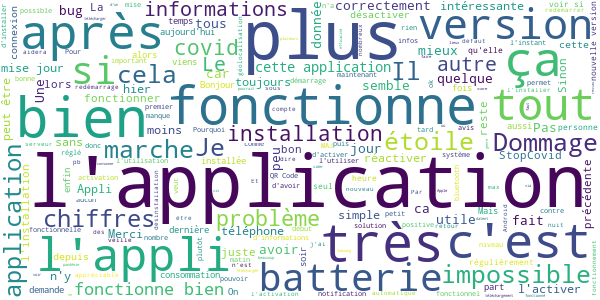
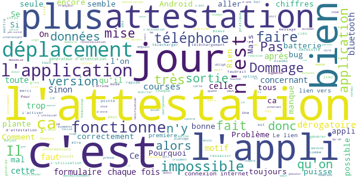
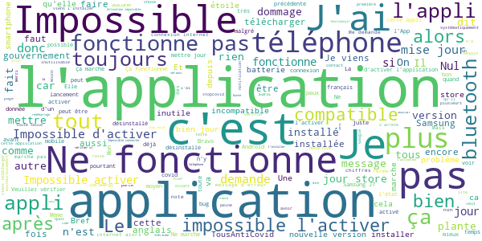

# TousAntiCovid
App version ``2.0.1``

Analyzed with [covid-apps-observer](http://github.com/covid-apps-observer) project, version ``0.1``

## App overview
| | |
|-------------------------|-------------------------| 
| **Name**&nbsp;&nbsp;&nbsp;&nbsp;&nbsp;&nbsp;&nbsp;&nbsp;&nbsp;&nbsp;&nbsp;&nbsp;&nbsp;&nbsp;&nbsp;&nbsp;&nbsp;&nbsp;&nbsp;&nbsp;&nbsp;&nbsp;&nbsp;&nbsp;&nbsp;&nbsp;&nbsp;&nbsp;&nbsp;&nbsp;&nbsp;&nbsp;&nbsp;&nbsp;&nbsp;&nbsp;&nbsp;&nbsp;&nbsp;&nbsp;  | TousAntiCovid |
| **Unique identifier** | fr.gouv.android.stopcovid |
| **Link to Google Play** | [https://play.google.com/store/apps/details?id=fr.gouv.android.stopcovid](https://play.google.com/store/apps/details?id=fr.gouv.android.stopcovid) |
| **Summary**  | Protégeons nos proches, protégeons-nous et protégeons les autres |
| **Privacy policy** | [https://bonjour.stopcovid.gouv.fr/privacy.html](https://bonjour.stopcovid.gouv.fr/privacy.html) |
| **Latest version** | 2.0.1 |
| **Last update** | 2020-10-22 13:00:24 |
| **Recent changes** | Améliorations et corrections. |
| **Installs**  | 1 000 000+ |
| **Category** | Médecine |
| **First release** | 29 mai 2020 |
| **Size**  | 21M |
| **Supported Android version**  | 5.0 ou version ultérieure |

### Description
> L'application TousAntiCovid est destinée au territoire français.
 Protégeons nos proches, protégeons-nous et protégeons les autres. 
 TousAntiCovid, c’est simple :
 # J'active l'application
 En utilisant le Bluetooth de votre téléphone, TousAntiCovid détecte les téléphones des autres utilisateurs qui restent à proximité du vôtre.
 # Je reste informé
 Vous serez informé si vous avez été à proximité d’un utilisateur testé positif à la COVID-19. Vous serez informés des derniers chiffres et de l’actualité sur l’épidémie. Vous aurez accès aux conseils personnalisés de Mes Conseils Covid.
 # Je protège mes proches et les autres
 Si vous devez vous faire tester, vous pourrez trouver le laboratoire le plus proche. Si vous êtes diagnostiqué comme un cas de COVID-19, votre laboratoire ou votre médecin vous donneront un code à scanner ou à saisir pour avertir anonymement les utilisateurs que vous avez rencontrés.
 # Mes données sont protégées
 L’application n’utilise à aucun moment la localisation des personnes, et il est impossible de connaître l’identité des utilisateurs.
 Cette application a été réalisée par l'équipe TousAntiCovid, sous la supervision du Ministère des Solidarités et de la Santé et du Secrétariat d'Etat chargé du Numérique.

### User interface
The developers of the app provide the following screenshots in the Google play store.
| | | |
|:-------------------------:|:-------------------------:|:-------------------------:|
 |   |   |   | 
 |   |   |   | 

## Development team
In the following we report the main information provided by the development team in the Google play store.

| | |
|-------------------------|-------------------------|
| **Developer**  | Gouvernement |
| **Website**  | [https://stopcovid.gouv.fr](https://stopcovid.gouv.fr) |
| **Email** | contact@stopcovid.gouv.fr |
| **Physical address**  | [20 avenue de Ségur 75007 Paris](https://www.google.com/maps/search/20%20avenue%20de%20Ségur%2075007%20Paris) (Google Maps) |
| **Other developed apps**  | [https://play.google.com/store/apps/developer?id=Gouvernement](https://play.google.com/store/apps/developer?id=Gouvernement) |

## Android support

| | |
|-------------------------|-------------------------|
| **Declared target Android version**  | - |
| **Effective target Android version**  | - |
| **Minimum supported Android version**  | Lollipop, version 5.0 (API level 21) |
| **Maximum target Android version**  | - |

The larger the difference between the minimum and maximum supported Android versions, the better. A larger difference means a wider audience. For example, old phones have a very low Android version, so a high minimum supported Android version means that the app cannot be used by users with old phones, thus leading to accessibility problems. 

## Requested permissions

In the following we report the complete list of the permissions requested by the app. 

| **Permission** | **Protection level** | **Description** | 
|-------------------------|-------------------------|-------------------------|
 **android.permission ACCESS_COARSE_LOCATION** | :warning:**Dangerous** | Allows an app to access approximate location. 
 **android.permission ACCESS_FINE_LOCATION** | :warning:**Dangerous** | Allows an app to access precise location. 
 **android.permission ACCESS_NETWORK_STATE** | Normal | Allows applications to access information about networks. 
 **android.permission BLUETOOTH** | Normal | Allows applications to connect to paired bluetooth devices. 
 **android.permission BLUETOOTH_ADMIN** | Normal | Allows applications to discover and pair bluetooth devices. 
 **android.permission CAMERA** | :warning:**Dangerous** | Required to be able to access the camera device. 
 **android.permission FOREGROUND_SERVICE** | Normal | Allows a regular application to use Service.startForeground. 
 **android.permission INTERNET** | Normal | Allows applications to open network sockets. 
 **android.permission RECEIVE_BOOT_COMPLETED** | Normal | Allows an application to receive the Intent.ACTION_BOOT_COMPLETED that is broadcast after the system finishes booting. 
 **android.permission REQUEST_IGNORE_BATTERY_OPTIMIZATIONS** | Normal | Permission an application must hold in order to use Settings.ACTION_REQUEST_IGNORE_BATTERY_OPTIMIZATIONS. 
 **android.permission WAKE_LOCK** | Normal | Allows using PowerManager WakeLocks to keep processor from sleeping or screen from dimming. 

## Mentioned servers

| **Server** | **Registrant** | **Registrant country** | **Creation date** | 
|-------------------------|-------------------------|-------------------------|-------------------------|
 | google.com | Google LLC | :us: US | 1997-09-15 04:00:00 |
 | stopcovid.gouv.fr | Etat francais represente par le Ministere des Solidarites et de la Sante | - | 2020-04-15 12:02:42 |

## Security analysis 

Below we report the main security warnings raised by our execution of the [Androwarn](https://github.com/maaaaz/androwarn) security analysis tool.

**Connection interfaces exfiltration**
> - This application reads details about the currently active data network 
> - This application tries to find out if the currently active data network is metered 

**Telephony services abuse**
> - This application makes phone calls 

**Suspicious connection establishment**
> - This application opens a Socket and connects it to the remote address '; port is out of range' on the 'N/A' port  
> - This application opens a Socket and connects it to the remote address 'Lcom/android/tools/r8/GeneratedOutlineSupport;->outline19(Ljava/lang/String;)Ljava/lang/StringBuilder;' on the 'N/A' port  
> - This application opens a Socket and connects it to the remote address 'Ljava/net/Proxy;->type()Ljava/net/Proxy$Type;' on the 'N/A' port  
> - This application opens a Socket and connects it to the remote address 'timeout' on the 'N/A' port  

## User ratings and reviews

Below we provide information about how end users are reacting to the app in terms of ratings and reviews in the Google Play store.

### Ratings

The TousAntiCovid app has been installed by more than **1000000** times. At this time, **15221** rated the app and its average score is **3.1827297**. Below we show the distribution of the ratings across the usual star-based rating of Google Play

:star::star::star::star::star:: 6530

:star::star::star::star:: 1560

:star::star::star:: 882

:star::star:: 661

:star:: 5588

### Reviews 

#### 5-star reviews

> Pour le moment tout fonctionne parfaitement, je reçois régulièrement les stats covid mis à jour, l'appli reste connectée continuellement. Ma vieille batterie de tel tient très bien avec cette appli supplémentaire. Aucun soucis et pas de cas contact autour de moi pour le moment, croisons les doigts.  :date: __2020-10-24 09:37:39__

> Je n'ai pas eu de problème pour lancer l'application Elle fonctionne bien : la localisation, le Bluetooth marche, je reçois des notifications pour m'avertir des derniers informations sur le Covid-19, la carte des endroit de dépistage son indiqué. ¯\_(ツ)_/¯ Pour moi, c'est 5 étoiles.  :date: __2020-10-24 09:36:26__

> TB! Installée hier soir. Elle fonctionne en continu. Aucun pb à signaler jusqu'à présent.  :date: __2020-10-24 09:29:45__

> Fonctionne bien sans problème sur mon téléphone mais aucun signalement depuis que je l'ai activée (2 mois déjà) alors que Rennes est en zone rouge...suis-je le seul à utiliser cette appli? Modification de mon avis après la mise à jour: fonctionne toujours sans problèmes et sans ce que signalent d'autres personnes qui disent devoir desinstaller/réinstaller. Pourvu que cette appli soit utilisée par beaucoup plus de personnes!  :date: __2020-10-24 09:27:54__

> Interactive et facile à utiliser Sera t-elle efficace ?  :date: __2020-10-24 09:26:30__

> Fonctionne parfaitement. Faisons tous cet acte citoyen en installant cette appli  :date: __2020-10-24 09:16:33__

> Très bien  :date: __2020-10-24 09:12:34__

> Tous ce qu'il faut savoir sur le covid très simplement, très bon outil .  :date: __2020-10-24 09:02:23__

> Fonctionne parfaitement. Merci.  :date: __2020-10-24 08:56:05__

> Galère lors du changement d'app, mais finalement ok. J'aimerais plus d'info maj sur les données et des courbes. Des données de 4 jours sont obsolètes... 1 jour max, 12h seraient mieux. Si pas maj plus régulièrement, obligé d'aller voir ailleurs pour se renseigner, et donc appli de nouveau à faible intérêt sur cette partie. Svp, nous avons besoin de plus de réactivité et de maj des data ! Je laisse 5 étoiles pour aider sur l'aspect détection, mais sans cela, je l'aurais déjà supprimée.  :date: __2020-10-24 08:52:23__

#### 4-star reviews

> Plus tard  :date: __2020-10-24 09:35:21__

> Une notification qui reste impossible de l'enlever. Sinon ça fonctionne très bien.  :date: __2020-10-24 09:34:19__

> Installation initiale (je n'avais pas StopCovid). Installation sans pb, l'application semble fonctionner correctement (A7, sous Android 10).  :date: __2020-10-24 09:25:27__

> J'avais la 1ère version. La MAJ s'est faite en automatique et lors du démarrage s'il a fallu 30s pour quelle demarre et fonctionne correctement c'est le max... Pensez à redémarrer votre téléphone après l'installation ce qui aidera au bon fonctionnement de l'appli dès le départ.  :date: __2020-10-24 09:15:55__

> Appli plus riche que la précédente, mais toujours le même défaut : elle ne se réactive pas automatiquement après un mode avion prolongé (une nuit, par exemple).  :date: __2020-10-24 09:12:44__

> Plus d'informations avec la nouvelle version. Dommage que la liste des départements en couvre-feu ne soit pas donnée.  :date: __2020-10-24 09:07:03__

> L'application fonctionne bien. J'aurais juste aimer avoir les chiffres départementaux.  :date: __2020-10-24 08:36:50__

> La souplesse d'activer ou de désactiver cette application grâce à l'activation/désactivation du Bluetooth est très appréciable. Pas de géolocalisation et le QR-CODE permet de rassurer pour la confidentialité des données. Pas d'usure intempestive de la batterie. Je ne mets pas 5 car pas assez de retour d'expérience. Cette application n'est pas la panacée, elle est un complément aux gestes barrières. Tousanticovid sera utile si nous sommes nombreux à l'utiliser, elle est là pour nous aider.  :date: __2020-10-24 08:27:28__

> La mise à jour depuis StopCovid a été un peu galère et il y'a eu un pb de serveur hier mais maintenant tout est de nouveau fonctionnel.  :date: __2020-10-24 08:20:56__

> Que veut dire la question êtes vous satisfaits des réseaux sociaux disponibles ??? Twitter , facebook etc ??? A clarifier d'urgence, merci  :date: __2020-10-24 07:25:42__

#### 3-star reviews

> Et les infirmiers libéraux plus de 600000 en France peuvent faire les tests et vous n en parlez pas 🙄🤔  :date: __2020-10-24 09:12:21__

> C'est une application qui fonctionne sans problème. Plus : + Interface fluide et intuitive Moins : - Les données épidémiologiques doivent êtres mises à jour plus souvent, sinon à quoi servent-elles ? Nouveaux cas : Date de deux jours R effectif : La valeur date d'une semaine Taux d'incidence : Mis à jour il y a cinq jours Taux de positivité : Mis à jour il y a cinq jours Je ne mets que trois étoiles à cause de cette absence de mise à jour  :date: __2020-10-24 05:58:35__

> Incompatible avec mon téléphone.Pour sauver le monde il faut un bluetooth "low energy".  :date: __2020-10-24 03:57:29__

> Ne se lance toujours pas au démarrage du téléphone dommage. A l'air plus fiable que l'ancienne version  :date: __2020-10-24 02:05:22__

> Une carte de localisation des cas devrais être intéressant.  :date: __2020-10-24 00:30:24__

> Il manque une chose essentielle à mon avis dans le paramétrage : Une reconnextion automatique lorsque je bouge géographiquement car les trois quart du temp j'oublie de l'activité que je sors de chez moi... 🤭  :date: __2020-10-24 00:00:45__

> Installé dès "stop covid", marre des notifications en pleine nuit pour dire que le Bluetooth n'est pas activé  :date: __2020-10-23 23:50:07__

> Les chiffres clés ne sont pas mis à jour suffisamment fréquemment. Cette application gagnerait en intérêt si vous donneriez ces chiffres en exclusivité sur cette application ? Dommage qu'elle ne soit pas plus installé  :date: __2020-10-23 23:49:57__

> Il faut souvent désinstaller l'application car elle ne s'ouvre plus. C'est bien dommage que depuis la création de cette application ce problème ne soit pas résolu  :date: __2020-10-23 23:26:28__

> Enfin installée, plus par curiosité de constater si ça fonctionne que par conviction... Pour le moment pas grand chose à y redire, pas reçu d'alerte. Par contre je trouve dommage de constater qu'aux dires journaliers on dépasse les 40.000 cas positifs et de ne trouver que 15.600 cas déclarés :\  :date: __2020-10-23 23:04:04__

#### 2-star reviews

> consomme quand même assez de batterie, peut-être que la prochaine mise à jour résoudra le problème  :date: __2020-10-24 09:34:29__

> Ne sert à rien  :date: __2020-10-24 09:26:31__

> Il manque des informations importantes concernant les zones à masque obligatoire et de couvre-feu.  :date: __2020-10-24 08:33:32__

> Dès que j''active Tous Anti Covid, le bluetooth de mon téléphone plante. J'ai d'abord installé la mise a jour. Puis j'ai essayé d'installer/désinstaller mais le pb persiste. J'ai un téléphone LG G6 avec la version d'android 8.0  :date: __2020-10-24 08:06:06__

> Ne fonctionne tout simplement pas, l'application crash au moment de l'activation. Obligé de la réinitialiser pour que cela remarche.  :date: __2020-10-24 07:59:38__

> Prévoir une réactivation automatique par défaut ! Ex: après désactivation du mode avion, l'application signale bien sagement qu'elle a "besoin de moi" pour réactiver. Si j'oublie de le faire, ça ne sert à rien... Rendez là vraiment facile au point de l'oublier !!!  :date: __2020-10-24 07:51:23__

> Sérieusement, je doute de l'efficacité d'une application qui nécessite que l'utilisateur note lui même s'il est positif ou non. 400 notifications au total alors qu'on est a 20000+ cas par jour, c'est pas terrible. Failure modes : 1- appli pas installée, 2-appli pas activée (bluetooth bouffe les piles, c'est monstrueux), 3- statut covid pas renseigné, 4- détection bluetooth pas reussie (apple/android). Dès le départ, on sait que c'est pas fiable. Donnez plus de pouvoir aux scientifiques.  :date: __2020-10-24 04:26:04__

> Je viens de l'installer. J'attends de voir  :date: __2020-10-24 03:34:52__

> Bug... refuse de s'ouvrir...non mais là il faut faire quelque chose ; c'est grave vu la situation actuelle de mettre une application qui est sensée sauver des vies et que n'ai pu faire fonctionner qu'hier à son installation à la place de l'ancienne avec quand même des difficultés qu'on ne retrouve pas sur la majorité des applications de différentes sortes !!!  :date: __2020-10-23 21:44:22__

> Superbe application pour cette période, elle sécurise nos donner. Seule problème, on ne peux pas le télécharger sur les iPhones 5  :date: __2020-10-23 20:42:43__

#### 1-star reviews

> Se désactive tout le temps comme la précédente !!!!! Cela ne sera pas un échec mais cela ne marchera pas !!!!!! Bande d'incapables !!!!!  :date: __2020-10-24 09:39:10__

> Impossible de l'activer  :date: __2020-10-24 09:37:29__

> Vous ne comprenez toujours pas que le bluetooth personne ne l'utilise alors que la position tout le monde la active  :date: __2020-10-24 09:34:55__

> Impossible d'"activer tous anticovid" sur l'appli sur Galaxy note 8. Appuyez sur ce bouton, fait apparaître une popup que demande de relancer l'appli. Mais même topo une fois relancée. Inutile.  :date: __2020-10-24 09:28:06__

> Sur GalaxyS5 plantage à la 1ere install. À la 2ème en cherchant un site de dépistage, position ok et bluetooth ok, plantage dans boucle "autoriser". Seule solution : sortir de l'application. On attend une version pleinement opérationnelle qui ne vide pas trop vite la batterie.  :date: __2020-10-24 09:23:12__

> Application NUL, pondu par des énarques idiots et surtout pour nous ficher !!!!! Necouter pas les médias, c'est inutile et dangereux pour nos libertés.  :date: __2020-10-24 09:19:57__

> Impossible de la télécharger  :date: __2020-10-24 09:18:13__

> PUE LE CACA 💩 💩 💩 💩 💩 💩 💩 💩 J'AI CHAUD J'AI FROID J'AI L'CORONA  :date: __2020-10-24 09:16:24__

> La nouvelle fonctionnait hier Ce matin elle s'arrêtait juste après le lancement Après re-installation j'ai dû réactiver Les chiffres ont 4 jours d'ancienneté C'est pas sérieux, trouvez de meilleurs développeurs  :date: __2020-10-24 09:16:14__

> Une application aussi importante qui ne peux pas fonctionner sur tous les mobiles équipé de bluetooth. C`est n`imporque quoi !!!!!!!  :date: __2020-10-24 09:14:26__

