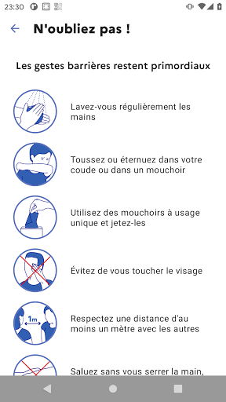

# TousAntiCovid
App version ``2.1.1``

Analyzed with [covid-apps-observer](http://github.com/covid-apps-observer) project, version ``0.1``

## App overview
| | |
|-------------------------|-------------------------| 
| **Name**&nbsp;&nbsp;&nbsp;&nbsp;&nbsp;&nbsp;&nbsp;&nbsp;&nbsp;&nbsp;&nbsp;&nbsp;&nbsp;&nbsp;&nbsp;&nbsp;&nbsp;&nbsp;&nbsp;&nbsp;&nbsp;&nbsp;&nbsp;&nbsp;&nbsp;&nbsp;&nbsp;&nbsp;&nbsp;&nbsp;&nbsp;&nbsp;&nbsp;&nbsp;&nbsp;&nbsp;&nbsp;&nbsp;&nbsp;&nbsp;  | TousAntiCovid |
| **Unique identifier** | fr.gouv.android.stopcovid |
| **Link to Google Play** | [https://play.google.com/store/apps/details?id=fr.gouv.android.stopcovid](https://play.google.com/store/apps/details?id=fr.gouv.android.stopcovid) |
| **Summary**  | Protégeons nos proches, protégeons-nous et protégeons les autres |
| **Privacy policy** | [https://bonjour.stopcovid.gouv.fr/privacy.html](https://bonjour.stopcovid.gouv.fr/privacy.html) |
| **Latest version** | 2.1.1 |
| **Last update** | 2020-11-04 18:09:10 |
| **Recent changes** | Attestations de sortie, tendances des chiffres clés, partage d&#39;infos et chiffres clés, et autres améliorations. |
| **Installs**  | 1 000 000+ |
| **Category** | Médecine |
| **First release** | 29 mai 2020 |
| **Size**  | 22M |
| **Supported Android version**  | 5.0 ou version ultérieure |

### Description
> L'application TousAntiCovid est destinée au territoire français.
 Vous pouvez désormais créer et sauvegarder vos attestations de déplacement dérogatoire directement dans l'application.
 Protégeons nos proches, protégeons-nous et protégeons les autres. 
 TousAntiCovid, c’est simple :
 # J'active l'application
 En utilisant le Bluetooth de votre téléphone, TousAntiCovid détecte les téléphones des autres utilisateurs qui restent à proximité du vôtre.
 # Je reste informé
 Vous serez informé si vous avez été à proximité d’un utilisateur testé positif à la COVID-19. Vous serez informés des derniers chiffres et de l’actualité sur l’épidémie. Vous aurez accès aux conseils personnalisés de Mes Conseils Covid.
 # Je protège mes proches et les autres
 Si vous devez vous faire tester, vous pourrez trouver le laboratoire le plus proche. Si vous êtes diagnostiqué comme un cas de COVID-19, votre laboratoire ou votre médecin vous donneront un code à scanner ou à saisir pour avertir anonymement les utilisateurs que vous avez rencontrés.
 # Mes données sont protégées
 L’application n’utilise à aucun moment la localisation des personnes, et il est impossible de connaître l’identité des utilisateurs.
 Cette application a été réalisée par l'équipe TousAntiCovid, sous la supervision du Ministère des Solidarités et de la Santé et du Secrétariat d'Etat chargé du Numérique.

### User interface
The developers of the app provide the following screenshots in the Google play store.
| | | |
|:-------------------------:|:-------------------------:|:-------------------------:|
 |   |   |   | 
 |   |   |   | 

## Development team
In the following we report the main information provided by the development team in the Google play store.

| | |
|-------------------------|-------------------------|
| **Developer**  | Gouvernement |
| **Website**  | [https://bonjour.tousanticovid.gouv.fr](https://bonjour.tousanticovid.gouv.fr) |
| **Email** | contact@tousanticovid.gouv.fr |
| **Physical address**  | [20 avenue de Ségur 75007 Paris](https://www.google.com/maps/search/20%20avenue%20de%20Ségur%2075007%20Paris) (Google Maps) |
| **Other developed apps**  | [https://play.google.com/store/apps/developer?id=Gouvernement](https://play.google.com/store/apps/developer?id=Gouvernement) |

## Android support

| | |
|-------------------------|-------------------------|
| **Declared target Android version**  | - |
| **Effective target Android version**  | - |
| **Minimum supported Android version**  | Lollipop, version 5.0 (API level 21) |
| **Maximum target Android version**  | - |

The larger the difference between the minimum and maximum supported Android versions, the better. A larger difference means a wider audience. For example, old phones have a very low Android version, so a high minimum supported Android version means that the app cannot be used by users with old phones, thus leading to accessibility problems. 

## Requested permissions

In the following we report the complete list of the permissions requested by the app. 

| **Permission** | **Protection level** | **Description** | 
|-------------------------|-------------------------|-------------------------|
 **android.permission ACCESS_COARSE_LOCATION** | :warning:**Dangerous** | Allows an app to access approximate location. 
 **android.permission ACCESS_FINE_LOCATION** | :warning:**Dangerous** | Allows an app to access precise location. 
 **android.permission ACCESS_NETWORK_STATE** | Normal | Allows applications to access information about networks. 
 **android.permission BLUETOOTH** | Normal | Allows applications to connect to paired bluetooth devices. 
 **android.permission BLUETOOTH_ADMIN** | Normal | Allows applications to discover and pair bluetooth devices. 
 **android.permission CAMERA** | :warning:**Dangerous** | Required to be able to access the camera device. 
 **android.permission FOREGROUND_SERVICE** | Normal | Allows a regular application to use Service.startForeground. 
 **android.permission INTERNET** | Normal | Allows applications to open network sockets. 
 **android.permission RECEIVE_BOOT_COMPLETED** | Normal | Allows an application to receive the Intent.ACTION_BOOT_COMPLETED that is broadcast after the system finishes booting. 
 **android.permission REQUEST_IGNORE_BATTERY_OPTIMIZATIONS** | Normal | Permission an application must hold in order to use Settings.ACTION_REQUEST_IGNORE_BATTERY_OPTIMIZATIONS. 
 **android.permission WAKE_LOCK** | Normal | Allows using PowerManager WakeLocks to keep processor from sleeping or screen from dimming. 

## Mentioned servers

| **Server** | **Registrant** | **Registrant country** | **Creation date** | 
|-------------------------|-------------------------|-------------------------|-------------------------|
 | google.com | Google LLC | :us: US | 1997-09-15 04:00:00 |
 | stopcovid.gouv.fr | Etat francais represente par le Ministere des Solidarites et de la Sante | - | 2020-04-15 12:02:42 |

## Security analysis 

Below we report the main security warnings raised by our execution of the [Androwarn](https://github.com/maaaaz/androwarn) security analysis tool.

**Connection interfaces exfiltration**
> - This application reads details about the currently active data network 
> - This application tries to find out if the currently active data network is metered 

**Telephony services abuse**
> - This application makes phone calls 

**Suspicious connection establishment**
> - This application opens a Socket and connects it to the remote address '; port is out of range' on the 'N/A' port  
> - This application opens a Socket and connects it to the remote address 'Lcom/android/tools/r8/GeneratedOutlineSupport;->outline19(Ljava/lang/String;)Ljava/lang/StringBuilder;' on the 'N/A' port  
> - This application opens a Socket and connects it to the remote address 'Ljava/net/Proxy;->type()Ljava/net/Proxy$Type;' on the 'N/A' port  
> - This application opens a Socket and connects it to the remote address 'timeout' on the 'N/A' port  

## User ratings and reviews

Below we provide information about how end users are reacting to the app in terms of ratings and reviews in the Google Play store.

### Ratings

The TousAntiCovid app has been installed by more than **1000000** times. At this time, **24624** rated the app and its average score is **3.3473938**. Below we show the distribution of the ratings across the usual star-based rating of Google Play

:star::star::star::star::star:: 10092

:star::star::star::star:: 3732

:star::star::star:: 2035

:star::star:: 2170

:star:: 6595

### Reviews 

#### 5-star reviews

> Enfin cela ressemble à une app ! J'apprécie particulièrement le lien avec l'attestation couvre-feu pré-remplie. J'invite tout le monde à la télécharger et surtout à l'utiliser !  :date: __2020-11-08 13:57:01__

> Rien à redire génial  :date: __2020-11-08 13:53:02__

> Très bien  :date: __2020-11-08 13:31:21__

> C'est pas parfait mais ça s'améliore, les attestations peuvent se faire depuis l'app maintenant. Pas d'impact sur la batterie. Si ça peut sauver des vies, autant l'installer !  :date: __2020-11-08 13:18:11__

> Rien à voir avec la première version. C'est nettement mieux et consomme moins la batterie.  :date: __2020-11-08 12:47:05__

> Super, l'attestation de sortie est inclus. Possibilité de le désactiver lorsque l'on reste à la maison, pour éviter d'user la batterie.  :date: __2020-11-08 12:06:16__

> Integration des attestations pré remplies -> superbe idée. Cela nous facilite la vie en ces moments compliqués. Restez masqués.  :date: __2020-11-08 11:56:29__

> J'avais déjà publié un avis négatif à propos de cette nouvelle version de l'appli car il fallait remplir chaque fois les mêmes rubriques d'identité. L'appli a été corrigée et toutes les infos restent en mémoire. C'est donc parfait maintenant. Je ne souhaite toutefois pas vérifier moi même son efficacité en terme de contamination donc je lui accorde le bénéfice du doute.  :date: __2020-11-08 11:12:41__

> Parfait pour attestation...  :date: __2020-11-08 10:10:44__

> Super  :date: __2020-11-08 09:41:33__

#### 4-star reviews

> Dans la liste des applications sur huawei p30 pro. Pratique pour les attestations et quelques données épidémique. Le nom de l'appli dans la liste des applis est Anticovid qui ne correspond pas au nom donné TousAntiCovid. Cela devrait être documenté directement.. C'est le B A BA...  :date: __2020-11-08 13:21:45__

> La nouvelle appli est moins bâclée que l'ancienne. Manque la courbe de l'évolution des hospitalisations journalières et des cas en EPAD ou un lien vers un site du gvt. Je trouve aussi le filtre de 15 MN trop long!  :date: __2020-11-08 13:06:13__

> Utile !Toutes ces initiatives sont les bienvenues  :date: __2020-11-08 13:04:48__

> L'accès rapide aux attestations est très bien vu, il manquerait juste un widget pour activer/désactiver l'appli sans rentrer dedans.  :date: __2020-11-08 12:37:12__

> La nlle maj semble avoir corrigé les bugs d'activation récurrents. La délivrance de l'attestation est très pratique. Dommage que cette appli ne soit utilisée que par les convaincus!  :date: __2020-11-08 12:05:10__

> Ne marche pas  :date: __2020-11-08 11:43:34__

> Ça marche de mieux en mieux. RAS pour le moment.  :date: __2020-11-08 10:50:06__

> Utile, fonctionnelle comparée à ses débuts... Actualités sur la pandémie à jour sérieusement... Je suis entièrement pour que cette appli serve à toutes les personnes high tech.  :date: __2020-11-08 10:29:24__

> Application très bien,bien plus utile que la première version ! Je la recommande et 3ssaie de la faire installer a mon entourage. Je pense qu'elle est plus utile que tous ces gens qui vont se faire tester sans raison et qui vont faire allonger le déficit de la sécurité sociale !  :date: __2020-11-08 09:27:00__

> Cette application fonctionne très bien. Mais le nombre de '' R effectif '' n'a pas été mis à jour depuis le 31 octobre à 13h00..  :date: __2020-11-08 09:06:02__

#### 3-star reviews

> L'application s'arrête souvent. Quand je m'en aperçois, je dois autoriser à nouveau l'utilisation en arrière plan et l'activer. Du coup on se sait pas vraiment quand elle marche ou pas. L'application perd de son intérêt.  :date: __2020-11-08 13:56:46__

> L application ne cesse de signaler ...désactivée....et cependant fonctionne pour générer une attestation . Pour la réactiver il faut la supprimer et la télécharger une nouvelle fois ...c est lassant !  :date: __2020-11-08 13:52:22__

> Bien puis moyenne depuis 3 jour me demande de la réactiver et plantes à chaque réactivation mais continue à me donner des infos et me permettre de faire des attestations  :date: __2020-11-08 13:27:07__

> L'attestation générée pour achat de produits première nécessité expire après 1 heure ce qui est anormal  :date: __2020-11-08 12:43:21__

> Je l'ai installé pour une utilisation ponctuelle, j'habite à la campagne et ne sort pratiquement pas de chez-moi. Pourquoi la soi disant mise à jour des chiffres ne se fait pas quotidiennement, contrairement à ce qui est marqué ?  :date: __2020-11-08 11:12:17__

> L'application me paraissait bien. J'essaie en vain de déclarer un cas covid,.. Code barre pas bon, je n'ai que celui de mon dossier, pas eu par médecin ou labo d'autre numéro. Bref si on ne peut pas déclarer facilement un cas positif ca sert à quoi ?  :date: __2020-11-08 10:13:08__

> L'appli est simple et pratique à utiliser. Pourquoi je suis furieuse : Le Taux de Contamination affiché en grand est de "1,1 en baisse" daté d'Octobre alors qu'en cherchant bien dans le fin fond d'un article, on trouve le chiffre de 1,3, et encore, datant d'il y a 8 jours. Je suis furieuse, et cela discrédite tous les autres chiffres. Arrêtez de nous prendre pour des c♤ns et réactualisez !  :date: __2020-11-08 10:10:49__

> Les chiffres ne sont pas mis à jour quiotidiennement  :date: __2020-11-08 09:28:44__

> Ça serait sympa que les notifications avec les nouveau chiffres clés n'arrivent pas en pleine nuit. Je suis a deux doigts de désinstaller ça fait 3 nuits de suite.  :date: __2020-11-08 00:47:09__

> Je suis positif, mon QR code ne fonctionne pas. Je ne peux pas me déclarer comme positif au Covid.  :date: __2020-11-07 22:19:39__

#### 2-star reviews

> Bonjour, l'appli est bien simple à utiliser au niveau des attestations à générer, mais quand j'active le traçage GPS/Bluetooth de TousAntiCovid, l'application rame et se ferme. Pourquoi ?  :date: __2020-11-08 12:32:52__

> Plante régulièrement et ne veut pas fonctionner ... Beaucoup de com autour mais un grand amateurisme dans la réalisation. Problème plusieurs fois signalé et toujours pas résolu.  :date: __2020-11-08 12:10:45__

> C'est dommage qu'elle ne peut être installé que sur des téléphones récent, c'est le cas de mon père qui a un téléphone qui à quatre ans, dommage  :date: __2020-11-08 11:33:02__

> À part la génération rapide de l'attestation de sortie, je ne vois aucun intérêt. Infos non mises à jour en temps réel, on voit que ce sont des fonctionnaires derrière. Consomme énormément de batterie pour peu de résultats.  :date: __2020-11-08 11:30:52__

> Il y a un bug dans l'application TousAntiCovid qui s'arrête toute seule et après c'est impossible de la réactiver, sur mon téléphone Xiaomi. Je suis obligé de désinstaller et de réinstaller puis ça recommence au bout de quelques jours. Ça fait déjà 2 fois.  :date: __2020-11-08 11:06:58__

> Consommation de la batterie abusive  :date: __2020-11-08 11:01:35__

> Trop instable ,désinstallé et réiinstallée a plusieurs reprises sans plus de résultats fonctionne quelques heures et plante à nouveau  :date: __2020-11-08 10:52:37__

> Application intéressante mais qui plante au bout d'un moment et dès que l'on essaye de la reactiver elle se ferme toute seule ☹️. Obligé d'installer et de réinstaller. Du coup j'abondonne.... Vraiment inadmissible d'avoir une application du gouvernement qui ne fonctionne pas.  :date: __2020-11-08 10:20:59__

> Comme pas mal d'utilisateurs impossible d'activer l'application au bout de quelques jours... Elle tourne bien en arrière plan mais désactivée et des que l'on souhaite l'activer elle plante... La génération de formulaire est très pratique, mais bon une application de santé publique, éditée par le gouvernement et censée permettre de sauver des vies se résumant à un générateur de formulaire c'est quand même, comment dire... dommage...  :date: __2020-11-08 10:11:50__

> Obligée de désinstaller et réinstaller l'application qui se ferme systématiquement lorsque je veux l'activer... Pas commode vu l'usage qu'on est censé en faire. Dommage. Sinon pratique pour générer des attestations rapidement.  :date: __2020-11-08 09:47:14__

#### 1-star reviews

> Depuis la dernière mise à jour, ne fonctionne plus  :date: __2020-11-08 14:05:08__

> J'ai déclaré mon fils positif il y a 20 heures et je n'ai toujours pas reçu de notification m'informant que je suis cas contact.... idem pour mes filles et ma femme. Super la réactivité pour contrôler l épidémie ! Mes impôts sont bien utilisés. Si vous n'aviez pas rajouté la génération d attestation qui garde en mémoire les informations, j'aurais désinstallé.  :date: __2020-11-08 13:45:25__

> Après avoir désinstallé et réinstallé 3 fois l'appli : toujours ce pb d'activation  :date: __2020-11-08 13:45:15__

> "TousAntiCovid a cessé de fonctionner" C'est tout ce que ce truc" sait faire. D'accord, l'appli génère des attestations sans ressaisir chaque fois les mêmes informations (spécialité française), mais ça aurait pu être fait sur le site il y a 6 mois ! Rendez l'argent et donnez-le aux soignants.  :date: __2020-11-08 13:19:19__

> Depuis la dernière mise à jour, l'appli s'arrête des que je veux l'activer...  :date: __2020-11-08 12:57:10__

> L'application se ferme toute seule, lorsque j'appuie sur Activer TousAntiCovid.  :date: __2020-11-08 12:54:37__

> Pendant quelques jours ça tourne bien, sans trop consommer de batterie. Et puis un beau matin ça plante. Il faut effacer les données et se ré-inscrire pour que ça remarche, et donc j'imagine qu'on perd tout son historique de contacts. Et comme ça arrive tous les 2 à 7 jours, cette appli ne sert à rien. Désinstallation.  :date: __2020-11-08 12:21:45__

> L'application ne se lance plus un jour sur deux et doit être réinstallée. Vraiment pas sérieux... J'ajoute que s'enregistrer comme patient Covid ne fonctionne pas chez moi. Malgré le QRcode et le code AN...  :date: __2020-11-08 12:18:08__

> Obligé de la réinstaller régulièrement car elle se ferme automatiquement au bout d'un moment  :date: __2020-11-08 12:02:50__

> Impossible d'activer l'application sur mon smartphone Xiaomi redmi note 5 !!!!  :date: __2020-11-08 11:43:57__

