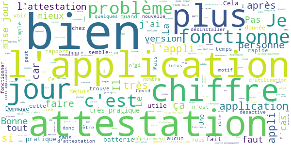

# TousAntiCovid
App version ``2.1.5``

Analyzed with [covid-apps-observer](http://github.com/covid-apps-observer) project, version ``0.1``

## App overview
| | |
|-------------------------|-------------------------| 
| **Name**&nbsp;&nbsp;&nbsp;&nbsp;&nbsp;&nbsp;&nbsp;&nbsp;&nbsp;&nbsp;&nbsp;&nbsp;&nbsp;&nbsp;&nbsp;&nbsp;&nbsp;&nbsp;&nbsp;&nbsp;&nbsp;&nbsp;&nbsp;&nbsp;&nbsp;&nbsp;&nbsp;&nbsp;&nbsp;&nbsp;&nbsp;&nbsp;&nbsp;&nbsp;&nbsp;&nbsp;&nbsp;&nbsp;&nbsp;&nbsp;  | TousAntiCovid |
| **Unique identifier** | fr.gouv.android.stopcovid |
| **Link to Google Play** | [https://play.google.com/store/apps/details?id=fr.gouv.android.stopcovid](https://play.google.com/store/apps/details?id=fr.gouv.android.stopcovid) |
| **Summary**  | Protégeons nos proches, protégeons-nous et protégeons les autres |
| **Privacy policy** | [https://bonjour.stopcovid.gouv.fr/privacy.html](https://bonjour.stopcovid.gouv.fr/privacy.html) |
| **Latest version** | 2.1.5 |
| **Last update** | 2020-11-13 22:06:42 |
| **Recent changes** | Attestations de sortie,  liens utiles, partage d&#39;infos et chiffres clés, et autres améliorations. |
| **Installs**  | 5 000 000+ |
| **Category** | Médecine |
| **First release** | 29 mai 2020 |
| **Size**  | 22M |
| **Supported Android version**  | 5.0 ou version ultérieure |

### Description
> L'application TousAntiCovid est destinée au territoire français.
 Vous pouvez désormais créer et sauvegarder vos attestations de déplacement dérogatoire directement dans l'application.
 Protégeons nos proches, protégeons-nous et protégeons les autres. 
 TousAntiCovid, c’est simple :
 # J'active l'application
 En utilisant le Bluetooth de votre téléphone, TousAntiCovid détecte les téléphones des autres utilisateurs qui restent à proximité du vôtre.
 # Je reste informé
 Vous serez informé si vous avez été à proximité d’un utilisateur testé positif à la COVID-19. Vous serez informés des derniers chiffres et de l’actualité sur l’épidémie. Vous aurez accès aux conseils personnalisés de Mes Conseils Covid.
 # Je protège mes proches et les autres
 Si vous devez vous faire tester, vous pourrez trouver le laboratoire le plus proche. Si vous êtes diagnostiqué comme un cas de COVID-19, votre laboratoire ou votre médecin vous donneront un code à scanner ou à saisir pour avertir anonymement les utilisateurs que vous avez rencontrés.
 # Mes données sont protégées
 L’application n’utilise à aucun moment la localisation des personnes, et il est impossible de connaître l’identité des utilisateurs.
 Cette application a été réalisée par l'équipe TousAntiCovid, sous la supervision du Ministère des Solidarités et de la Santé et du Secrétariat d'Etat chargé du Numérique.

### User interface
The developers of the app provide the following screenshots in the Google play store.
| | | |
|:-------------------------:|:-------------------------:|:-------------------------:|
 |   |   |   | 
 |   |   |   | 

## Development team
In the following we report the main information provided by the development team in the Google play store.

| | |
|-------------------------|-------------------------|
| **Developer**  | Gouvernement |
| **Website**  | [https://bonjour.tousanticovid.gouv.fr](https://bonjour.tousanticovid.gouv.fr) |
| **Email** | contact@tousanticovid.gouv.fr |
| **Physical address**  | [20 avenue de Ségur 75007 Paris](https://www.google.com/maps/search/20%20avenue%20de%20Ségur%2075007%20Paris) (Google Maps) |
| **Other developed apps**  | [https://play.google.com/store/apps/developer?id=Gouvernement](https://play.google.com/store/apps/developer?id=Gouvernement) |

## Android support

| | |
|-------------------------|-------------------------|
| **Declared target Android version**  | - |
| **Effective target Android version**  | - |
| **Minimum supported Android version**  | Lollipop, version 5.0 (API level 21) |
| **Maximum target Android version**  | - |

The larger the difference between the minimum and maximum supported Android versions, the better. A larger difference means a wider audience. For example, old phones have a very low Android version, so a high minimum supported Android version means that the app cannot be used by users with old phones, thus leading to accessibility problems. 

## Requested permissions

In the following we report the complete list of the permissions requested by the app. 

| **Permission** | **Protection level** | **Description** | 
|-------------------------|-------------------------|-------------------------|
 **android.permission ACCESS_COARSE_LOCATION** | :warning:**Dangerous** | Allows an app to access approximate location. 
 **android.permission ACCESS_FINE_LOCATION** | :warning:**Dangerous** | Allows an app to access precise location. 
 **android.permission ACCESS_NETWORK_STATE** | Normal | Allows applications to access information about networks. 
 **android.permission BLUETOOTH** | Normal | Allows applications to connect to paired bluetooth devices. 
 **android.permission BLUETOOTH_ADMIN** | Normal | Allows applications to discover and pair bluetooth devices. 
 **android.permission CAMERA** | :warning:**Dangerous** | Required to be able to access the camera device. 
 **android.permission FOREGROUND_SERVICE** | Normal | Allows a regular application to use Service.startForeground. 
 **android.permission INTERNET** | Normal | Allows applications to open network sockets. 
 **android.permission RECEIVE_BOOT_COMPLETED** | Normal | Allows an application to receive the Intent.ACTION_BOOT_COMPLETED that is broadcast after the system finishes booting. 
 **android.permission REQUEST_IGNORE_BATTERY_OPTIMIZATIONS** | Normal | Permission an application must hold in order to use Settings.ACTION_REQUEST_IGNORE_BATTERY_OPTIMIZATIONS. 
 **android.permission WAKE_LOCK** | Normal | Allows using PowerManager WakeLocks to keep processor from sleeping or screen from dimming. 

## Mentioned servers

| **Server** | **Registrant** | **Registrant country** | **Creation date** | 
|-------------------------|-------------------------|-------------------------|-------------------------|
 | google.com | Google LLC | :us: US | 1997-09-15 04:00:00 |
 | stopcovid.gouv.fr | Etat francais represente par le Ministere des Solidarites et de la Sante | - | 2020-04-15 12:02:42 |

## Security analysis 

Below we report the main security warnings raised by our execution of the [Androwarn](https://github.com/maaaaz/androwarn) security analysis tool.

**Connection interfaces exfiltration**
> - This application reads details about the currently active data network 
> - This application tries to find out if the currently active data network is metered 

**Telephony services abuse**
> - This application makes phone calls 

**Suspicious connection establishment**
> - This application opens a Socket and connects it to the remote address '; port is out of range' on the 'N/A' port  
> - This application opens a Socket and connects it to the remote address 'Lcom/android/tools/r8/GeneratedOutlineSupport;->outline19(Ljava/lang/String;)Ljava/lang/StringBuilder;' on the 'N/A' port  
> - This application opens a Socket and connects it to the remote address 'Ljava/net/Proxy;->type()Ljava/net/Proxy$Type;' on the 'N/A' port  
> - This application opens a Socket and connects it to the remote address 'timeout' on the 'N/A' port  

## User ratings and reviews

Below we provide information about how end users are reacting to the app in terms of ratings and reviews in the Google Play store.

### Ratings

The TousAntiCovid app has been installed by more than **5000000** times. At this time, **26159** rated the app and its average score is **3.2370229**. Below we show the distribution of the ratings across the usual star-based rating of Google Play

:star::star::star::star::star:: 9645

:star::star::star::star:: 3994

:star::star::star:: 2725

:star::star:: 2506

:star:: 7289

### Reviews 

#### 5-star reviews

> Fonctionne très bien ; en tout cas, les améliorations depuis la première version font du bien.  :date: __2020-11-16 08:50:46__

> Très bien pour mon utilisation !  :date: __2020-11-16 07:17:52__

> La nouvelle version dispo depuis fin octobre a enfin corrigé les dysfonctionnements. Maintenant, l'appli ne se désactive plus, les chiffres clés sont facilement accessibles, et surtout, surtout, le formulaire de sortie, qui permet de mémoriser ses données : juste besoin de modifier le motif, le reste est conservé. Même l'heure de sortie est pré rempli. Bref, beau travail !  :date: __2020-11-16 07:10:05__

> J'apprécie le sens de cette appli  :date: __2020-11-15 23:20:27__

> Jai installer application tout ce passais bien mais maintenant plus moyen f avoir les attestation depuis l application je pence que je vais la désinstaller si il ne corrige pas cette erreur  :date: __2020-11-15 20:20:12__

> Très bien  :date: __2020-11-15 19:42:54__

> Facile à utiliser notamment pour les attestations de déplacements et suivi des données nationales simple et efficace.  :date: __2020-11-15 19:06:37__

> correcte  :date: __2020-11-15 18:28:19__

> Très bonne application  :date: __2020-11-15 18:12:37__

> Salut sa va bien et toi  :date: __2020-11-15 17:20:19__

#### 4-star reviews

> En essai  :date: __2020-11-16 06:53:34__

> Application très bien pensée. Permet de protéger nos proches et de visualiser la propagation du virus par le biais de chiffres continuellement mis à jour. Simplifie également la création des attestations. Ce serait par contre sympa de pouvoir voir le rayon des 1km autour de notre domicile sur une carte...  :date: __2020-11-15 23:51:56__

> C'est simple, je passe la présentation et tout, mais au moment de lancer l'app c'est juste impossible, j'arrive pas à la démarrer. Update : j'ai réessayé c'est bon ça fonctionne niquel  :date: __2020-11-15 23:41:33__

> Fait le job. Seul bémol l'application ne se réactive pas automatiquement quand on sort du mode avion. C'est dommage car quand on dort en mode avion il arrive d'oublier de la réactiver le matin. Le générateur d'attestation est très pratique. Et en plus elle le code est ouvert, ça donne confiance.  :date: __2020-11-15 19:56:12__

> Très bonne application. Facile à utiliser et très didactique. Dommage qu'elle occasionne une consommation de la batterie assez importante.  :date: __2020-11-15 17:48:47__

> Bon, ça fonctionne. J'ai attendu quelques jours pour éviter le rush et je crois que j'ai bien fait.... Finalement au bout de 15 jours impossible de lancer l'appli qui plante. Mon téléphone est un Android 10 de 2018... Après désinstallation et réinstallation ça fonctionne, mais bon...  :date: __2020-11-15 15:28:52__

> Ne s'active pas  :date: __2020-11-15 14:11:46__

> ne s'active pas malgré l'acceptation des autorisations  :date: __2020-11-15 13:03:32__

> Attestation rapide. c'est chouette !  :date: __2020-11-15 11:36:18__

> Super application, simple d'utilisation, depuis la mise à jour on peut faire l'attestation direct sur le portable sans passer par internet. Ce qui serait mieux c'est quil y es une touche pour que la date et l'heure ce mette automatiquement. Je recommande.  :date: __2020-11-15 10:18:10__

#### 3-star reviews

> L'application s'installe bien. Mais depuis que les attestations sont générées dans l'application, le QR n'est valable qu'une heure, quelque soit le motif sélectionné. Hors seul les motifs d'activités sportives et balades des animaux sont limités à une heure. Merci de corriger ce point là...  :date: __2020-11-16 09:31:09__

> Application fonctionnelle et utiles, aucun bugs mais juste à relancer de temps à autre et à bien surveillé dans les notifications pour être certain qu'elle soit active. Le plus gros problème est qu'il y a trop peu d'utilisateur ce qui rends l'application quasiment inutile même quand nous sommes positif au Covid-19 ! Il y a possibilité de se déclarer depuis l'application mais il faut un code (ou QR Code) donné par le laboratoire, hors la majorité des labo de dépistage ne procurent pas ce code ! Dommage et navrant ! Le suivie devrait être plus cohérent ! Personnellement, à choisir entre les restrictions de mes libertés humaines et social (France, "droit de l'Homme", tout ça...) et l'application je choisi l'application sans hésitation !  :date: __2020-11-16 07:26:45__

> Le bluetooth ne fonctionne, je ne peux donc pas activer l'appli ... Mais je peux faire mes attestations avec donc c'est quand même utile.  :date: __2020-11-16 00:40:36__

> Ne se connecte pas !  :date: __2020-11-15 23:08:38__

> Depuis la dernière mise à jour je ne peux plus activer l'application qui se ferme j'ai du la désinstaller et l'installer à nouveau pour la troisième fois!!  :date: __2020-11-15 19:37:27__

> Mieux pensée que la première mais gros problème, au bout de quelques jours je ne peux plus l'activer et je dois la désinstaller et la réinstaller. A part ça, elle fait le job. Toujours pas malade quand même...  :date: __2020-11-15 13:42:48__

> La version 2.1.2 de l'application se désactivait constamment. Edit du 15.11.20 : la version 2.1.5 semble fonctionner correctement. Je remonte donc ma note de 1 à 3.  :date: __2020-11-15 11:51:37__

> Cette appli mange énormément de batterie, mon téléphone qui tient normalement deux jours à du mal à finir la journée Aussi, l'appli dit qu'elle prévient si on a été contact avec quelqu'un qui a le covid si on a passé 15min à moins d'un mètre, ce qui évite de paniquer pour rien Après, très pratique pour les attestations & il y a beaucoup de données, l'interface est pas mal Je ne sais pas si je vais la garder même si plus on est mieux c'est :/  :date: __2020-11-15 11:35:46__

> Depuis la mise à jour je n'ai plus d'attestation à remplir directement sur le smartphone. Je voudrais revenir à l'ancienne application.  :date: __2020-11-15 11:16:35__

> Application malheureusement nécessaire, plutôt bien faite et complète (les chiffres restent anxiogènes). Corriger EN URGENCE : le repérage se coupe souvent et ne veut pas se relancer. Impossible à résoudre sans redémarrer le téléphone. Ça rend l'appli inutile parce qu'elle ne repère plus rien, je peux passer 3 heures avec quelqu'un d'infecté, je ne le saurai jamais ! Aussi, l'icône de notif est la même quand l'appli marche et quand elle "a besoin moi". Non ! Une telle appli doit être parfaite.  :date: __2020-11-15 11:10:54__

#### 2-star reviews

> Ou sont passé les flèches de tandance sur la pages des chiffres ?  :date: __2020-11-16 10:18:32__

> Depuis la mise à jour l'application plante. Elle se deconnecte.  :date: __2020-11-15 23:18:48__

> Au 30 novembre, les attestations ne sont pas à jour. C tristr La mise à jour est faite mais on ne peut pas faire des choix multiples  :date: __2020-11-15 20:50:13__

> Il n'y apparaît pas l'attestation  :date: __2020-11-15 16:21:39__

> L'appli se ferme quand j'essaie de l'activer. Sinon pratique pour créer des attestations.  :date: __2020-11-15 14:42:46__

> Fonction "activer" inutilisable, fait planter l appli systématiquement ... Android 7.1 MIUI 11 . Pratique pour les attestations néanmoins  :date: __2020-11-15 10:57:47__

> Seul intérêt pratique, générer son attestation sans avoir à renseigner ses infos à chaque fois. Je désactive tout le reste et c'est très bien.  :date: __2020-11-15 10:32:52__

> Pourquoi avoir supprimé l attestation hors ligne ? Faut être vicieux pour lavoir fait. Ce qui veux dire qu'il faut être connecté si on a pas le formulaire papier ! Donnez moi une explication svp.  :date: __2020-11-15 09:10:22__

> À chaque mise à jour, je suis obligé de désinstaller et réinstaller l'application. Cela fait la troisième fois en trois semaines. Si je ne le fais pas, l'application s'arrête dès que j'appuie sur le bouton activer. Pour les points positifs, je trouve pratique le générateur d'attestation car il peut retenir nos informations personnelles (uniquement stockées en local). C'est bien mieux que le formulaire sur le site du gouvernement comme il y avait avant.  :date: __2020-11-15 08:22:48__

> L'appli se désactive au bout de quelques jours et au bout d'une dizaine de jours pas possible de la relancer. Il faut la désinstaller et réinstaller pour pouvoir l'activer. Pas fiable  :date: __2020-11-15 08:17:42__

#### 1-star reviews

> A fonctionné environ 1 semaine et depuis impossible d'activer  :date: __2020-11-16 10:20:41__

> L appli ne fonctionne pas souvent..  :date: __2020-11-16 10:09:59__

> La pseudo start-up nation autoproclamée qui n'est même pas foutue de faire une application stable et qui fonctionne. Et ça s'étonne que personne ne l'a !  :date: __2020-11-16 10:00:44__

> Plantages à répétition ! Régulièrement l'application ne fonctionne plus, il est impossible de l'activer. Il faut procéder à chaque fois à sa réinstallation. Inadmissible !  :date: __2020-11-16 09:57:57__

> Null  :date: __2020-11-16 09:55:23__

> ÇA PLANTE AU REDÉMARRAGE UNE FOIS QU'ON L'A ÉTEINTE UNE PREMIÈRE FOIS ! IL FAIUT LA RÉINSTALLER SYSTÉMATIQUEMENT... PB À RÉGLER D'URGENCE.... Et 15 jours plus tard toujours pareil, honteux  :date: __2020-11-16 09:47:21__

> Application qui fonctionne pendant quelques jours et après elle plante. Quand j'appuie sur "Activer" l'application se ferme. Obligé de désinstaller et réinstaller l'appli à chaque fois. Pas pratique 👎  :date: __2020-11-16 09:36:18__

> Depuis le 13 novembre, plantage dès que j'active l'application. Obligé de désinstaller et de réinstaller pour pouvoir l'activer sans erreur. Un petit effort pour mieux gérer les montées de version serait le minimum...  :date: __2020-11-16 09:35:20__

> Impossible d'activer l'application : elle plante systématiquement et se ferme. Quel intérêt d'insister autant pour qu'on télécharge cette appli si elle ne fonctionne même pas?  :date: __2020-11-16 09:23:56__

> Se désactive en permanence, ne fonctionne pas, je ne peux pas m'en servir  :date: __2020-11-16 09:05:36__

