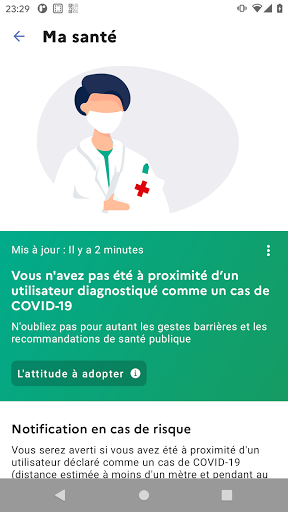
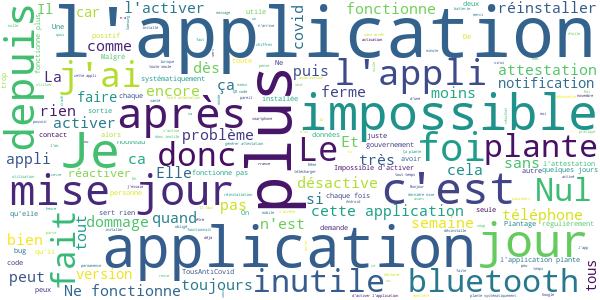

# TousAntiCovid
App version ``2.1.7``

Analyzed with [covid-apps-observer](http://github.com/covid-apps-observer) project, version ``0.1``

## App overview
| | |
|-------------------------|-------------------------| 
| **Name**&nbsp;&nbsp;&nbsp;&nbsp;&nbsp;&nbsp;&nbsp;&nbsp;&nbsp;&nbsp;&nbsp;&nbsp;&nbsp;&nbsp;&nbsp;&nbsp;&nbsp;&nbsp;&nbsp;&nbsp;&nbsp;&nbsp;&nbsp;&nbsp;&nbsp;&nbsp;&nbsp;&nbsp;&nbsp;&nbsp;&nbsp;&nbsp;&nbsp;&nbsp;&nbsp;&nbsp;&nbsp;&nbsp;&nbsp;&nbsp;  | TousAntiCovid |
| **Unique identifier** | fr.gouv.android.stopcovid |
| **Link to Google Play** | [https://play.google.com/store/apps/details?id=fr.gouv.android.stopcovid](https://play.google.com/store/apps/details?id=fr.gouv.android.stopcovid) |
| **Summary**  | Protégeons nos proches, protégeons-nous et protégeons les autres |
| **Privacy policy** | [https://bonjour.stopcovid.gouv.fr/privacy.html](https://bonjour.stopcovid.gouv.fr/privacy.html) |
| **Latest version** | 2.1.7 |
| **Last update** | 2020-11-20 13:50:59 |
| **Recent changes** | Attestations de sortie,  liens utiles, partage d&#39;infos et chiffres clés, et autres améliorations. |
| **Installs**  | 5 000 000+ |
| **Category** | Médecine |
| **First release** | 29 mai 2020 |
| **Size**  | 22M |
| **Supported Android version**  | 5.0 ou version ultérieure |

### Description
> L'application TousAntiCovid est destinée au territoire français.
 Vous pouvez désormais créer et sauvegarder vos attestations de déplacement dérogatoire directement dans l'application.
 Protégeons nos proches, protégeons-nous et protégeons les autres. 
 TousAntiCovid, c’est simple :
 # J'active l'application
 En utilisant le Bluetooth de votre téléphone, TousAntiCovid détecte les téléphones des autres utilisateurs qui restent à proximité du vôtre.
 # Je reste informé
 Vous serez informé si vous avez été à proximité d’un utilisateur testé positif à la COVID-19. Vous serez informés des derniers chiffres et de l’actualité sur l’épidémie. Vous aurez accès aux conseils personnalisés de Mes Conseils Covid.
 # Je protège mes proches et les autres
 Si vous devez vous faire tester, vous pourrez trouver le laboratoire le plus proche. Si vous êtes diagnostiqué comme un cas de COVID-19, votre laboratoire ou votre médecin vous donneront un code à scanner ou à saisir pour avertir anonymement les utilisateurs que vous avez rencontrés.
 # Mes données sont protégées
 L’application n’utilise à aucun moment la localisation des personnes, et il est impossible de connaître l’identité des utilisateurs.
 Cette application a été réalisée par l'équipe TousAntiCovid, sous la supervision du Ministère des Solidarités et de la Santé et du Secrétariat d'Etat chargé du Numérique.

### User interface
The developers of the app provide the following screenshots in the Google play store.
| | | |
|:-------------------------:|:-------------------------:|:-------------------------:|
 |   |   |   | 
 |   |   |   | 

## Development team
In the following we report the main information provided by the development team in the Google play store.

| | |
|-------------------------|-------------------------|
| **Developer**  | Gouvernement |
| **Website**  | [https://bonjour.tousanticovid.gouv.fr](https://bonjour.tousanticovid.gouv.fr) |
| **Email** | contact@tousanticovid.gouv.fr |
| **Physical address**  | [20 avenue de Ségur 75007 Paris](https://www.google.com/maps/search/20%20avenue%20de%20Ségur%2075007%20Paris) (Google Maps) |
| **Other developed apps**  | [https://play.google.com/store/apps/developer?id=Gouvernement](https://play.google.com/store/apps/developer?id=Gouvernement) |

## Android support

| | |
|-------------------------|-------------------------|
| **Declared target Android version**  | - |
| **Effective target Android version**  | - |
| **Minimum supported Android version**  | Lollipop, version 5.0 (API level 21) |
| **Maximum target Android version**  | - |

The larger the difference between the minimum and maximum supported Android versions, the better. A larger difference means a wider audience. For example, old phones have a very low Android version, so a high minimum supported Android version means that the app cannot be used by users with old phones, thus leading to accessibility problems. 

## Requested permissions

In the following we report the complete list of the permissions requested by the app. 

| **Permission** | **Protection level** | **Description** | 
|-------------------------|-------------------------|-------------------------|
 **android.permission ACCESS_COARSE_LOCATION** | :warning:**Dangerous** | Allows an app to access approximate location. 
 **android.permission ACCESS_FINE_LOCATION** | :warning:**Dangerous** | Allows an app to access precise location. 
 **android.permission ACCESS_NETWORK_STATE** | Normal | Allows applications to access information about networks. 
 **android.permission BLUETOOTH** | Normal | Allows applications to connect to paired bluetooth devices. 
 **android.permission BLUETOOTH_ADMIN** | Normal | Allows applications to discover and pair bluetooth devices. 
 **android.permission CAMERA** | :warning:**Dangerous** | Required to be able to access the camera device. 
 **android.permission FOREGROUND_SERVICE** | Normal | Allows a regular application to use Service.startForeground. 
 **android.permission INTERNET** | Normal | Allows applications to open network sockets. 
 **android.permission RECEIVE_BOOT_COMPLETED** | Normal | Allows an application to receive the Intent.ACTION_BOOT_COMPLETED that is broadcast after the system finishes booting. 
 **android.permission REQUEST_IGNORE_BATTERY_OPTIMIZATIONS** | Normal | Permission an application must hold in order to use Settings.ACTION_REQUEST_IGNORE_BATTERY_OPTIMIZATIONS. 
 **android.permission WAKE_LOCK** | Normal | Allows using PowerManager WakeLocks to keep processor from sleeping or screen from dimming. 

## Mentioned servers

| **Server** | **Registrant** | **Registrant country** | **Creation date** | 
|-------------------------|-------------------------|-------------------------|-------------------------|
 | google.com | Google LLC | :us: US | 1997-09-15 04:00:00 |
 | stopcovid.gouv.fr | Etat francais represente par le Ministere des Solidarites et de la Sante | - | 2020-04-15 12:02:42 |

## Security analysis 

Below we report the main security warnings raised by our execution of the [Androwarn](https://github.com/maaaaz/androwarn) security analysis tool.

**Connection interfaces exfiltration**
> - This application reads details about the currently active data network 
> - This application tries to find out if the currently active data network is metered 

**Telephony services abuse**
> - This application makes phone calls 

**Suspicious connection establishment**
> - This application opens a Socket and connects it to the remote address '; port is out of range' on the 'N/A' port  
> - This application opens a Socket and connects it to the remote address 'Lcom/android/tools/r8/GeneratedOutlineSupport;->outline19(Ljava/lang/String;)Ljava/lang/StringBuilder;' on the 'N/A' port  
> - This application opens a Socket and connects it to the remote address 'Ljava/net/Proxy;->type()Ljava/net/Proxy$Type;' on the 'N/A' port  
> - This application opens a Socket and connects it to the remote address 'timeout' on the 'N/A' port  

## User ratings and reviews

Below we provide information about how end users are reacting to the app in terms of ratings and reviews in the Google Play store.

### Ratings

The TousAntiCovid app has been installed by more than **5000000** times. At this time, **27007** rated the app and its average score is **3.3023171**. Below we show the distribution of the ratings across the usual star-based rating of Google Play

:star::star::star::star::star:: 10310

:star::star::star::star:: 4360

:star::star::star:: 2682

:star::star:: 2493

:star:: 7162

### Reviews 

#### 5-star reviews

> Bien et sûr. Fiable.  :date: __2020-11-23 09:32:09__

> Applications complète, facile d'emploi et qui permet de générer ET de stoker les attestations, sans avoir à rentrer les différents éléments à chaque réédition.  :date: __2020-11-22 23:43:37__

> Bof  :date: __2020-11-22 22:53:59__

> Très bien  :date: __2020-11-22 20:15:08__

> Excellente application !!! Attestation disponible de suite, et l on sait si l'on a été en contact avec une personne positive.  :date: __2020-11-22 18:26:15__

> Bien faite, il faut que tout le monde s'y mette. Permet de faire des attestations très rapidement et simplement.  :date: __2020-11-22 17:22:51__

> Application a priori utile, l'avenir me le dira 😏 🔮 🤞 1️⃣ 3️⃣ 🤔 ! Par contre, elle indique toujours " Désactivé " sur l'écran d'accueil même quand celle-ci est activée 🙄 🤪 !!! Copie programmes à revoir, les informaticiens 😋 !  :date: __2020-11-22 17:07:00__

> OK  :date: __2020-11-22 16:57:30__

> Satisfaite👌💖😷  :date: __2020-11-22 15:40:17__

> Très bonne application  :date: __2020-11-22 13:21:47__

#### 4-star reviews

> J'ai téléchargé l'app notamment pour la partie attestation. Et jen étais ravie car ça gardait en mémoire la raison de la sortie et comme je ne sors quasi que pour aller amener et chercher mon ptit chez la nounou c'était tres pratique he navais que l'heure à renseigner. Et depuis qql jours lheure est renseignée mais le motif disparait à chaque fois. Du coup je suis déçue et idem pour l'emplacement de la fonctionnalité qui nest plus en bas de la homepage et etait facile a trouver...  :date: __2020-11-23 08:12:18__

> Super pour l'attestation, sympa les news et statistiques, mais le moteur de tracing bluetooth plante après qq jours sur une erreur crypto. Pathétique de nullité technique... On aurait du utiliser d'DP3T... Plantage genre chaque semaine, et je dois tout effacer. Le tracing est une foirage technique indigbe d'un pays du tiers monde. Embauchez des Indonésiens,ou cooiz l'application Suisse...  :date: __2020-11-22 17:25:25__

> Toujours bien avoir une application qui et pratique.  :date: __2020-11-22 17:22:54__

> Cette appli est trop cooooool  :date: __2020-11-22 17:05:21__

> Enfin une mise à jour qui s'installe sur mon téléphone. C'est pas trop tôt  :date: __2020-11-22 16:57:11__

> Bonjour, l'appli est très bien mais on pourrait rajouter quelques options supplémentaires : un widget pour créer son attestation plus rapidement  :date: __2020-11-22 14:44:07__

> Fonctionne plutôt bien, mais de temps en temps, ça se désactive, et un message d'erreur s'affiche disant qu' il faut redémarrer le téléphone pour réactiver le Bluetooth.  :date: __2020-11-22 11:52:48__

> Simple, pédagogique et très ergonomique. La dernière mise a jour est excellente avec la génération de l'attestation dans l'application avec la sauvegarde des données. Problème, au bout d'un certain temps il est impossible de l'activer sans qu'elle plante. Réinstallation nécessaire...  :date: __2020-11-22 11:22:57__

> Les mises à jour successives ont considérablement amélioré la fiabilité de l'application et la gamme des fonctionnalités offertes (telle que l'attestation dérogatoire de déplacement, désormais simple et rapide à remplir avec une sauvegarde automatique des champs). Toujours un point de regret en matière d'absence d'interopérabilité avec les applications des autres pays européens.  :date: __2020-11-22 11:02:29__

> Pour l'instant fonctionne correctement. Pas de problème particulier, peut toujours être améliorée. Application qui devrait disparaître avec le temps et le COVID.  :date: __2020-11-22 10:58:51__

#### 3-star reviews

> Ça s'ameliore... Peut Peut-être qu'elle fonctionnera parfaitement pour la prochaine épidémie...  :date: __2020-11-23 10:49:21__

> Dommage de ne pas avoir la courbes dans le temps lorsque l'on clique sur un chiffre clé. Dommage de ne pas pouvoir voir l'évolution de la situation.  :date: __2020-11-23 09:33:26__

> L'appli fonctionne enfin pour mon vieux téléphone, par contre il va falloir que je le recharge 2 à 3x par jour si je l'active en permanence! (En mode avion durant la nuit)  :date: __2020-11-23 08:13:58__

> Instable au possible. Fonctionne parfaitement un coup et à la mise à jour suivante plus du tout  :date: __2020-11-22 22:36:27__

> Comment la positionner sur les bureaux de l'écran ?. Je ne la trouve que dans la liste du play store. On a vu plus ergonomique.  :date: __2020-11-22 20:24:21__

> Jusqu'à ce jour tout fonctionnait correctement et depuis le 22/11 Impossible de me connecter sur l appli Inconcevable !!!  :date: __2020-11-22 18:14:49__

> J'aurais aimé que pour compléter l'application, il y ait une fonction qui calcule le périmètre des 1kms, au lieu d'aller chercher sur différents sites  :date: __2020-11-22 12:39:59__

> Je ne sais pas si c'est cette application mais depuis que je l'ai installée la batterie de mon téléphone se vide à vitesse grand V ! Quelqu'un a t il fait ce même constat ?  :date: __2020-11-22 12:38:29__

> Nouvelle version stable Plante  :date: __2020-11-22 10:57:44__

> Pratique pour les attestations mais se désactive tout le temps....  :date: __2020-11-22 10:49:56__

#### 2-star reviews

> Se désactive toute seule. Déjà peu de personnes l'ont installée mais si en plus elle est inactive...  :date: __2020-11-23 07:57:04__

> Elle se désactive sans arrêt et ça, sans même le notifier. Du coup, je doute réellement de son efficacité. Ce problème existe depuis le début. Ce problème existe sur les 3 téléphonds du foyer donc j'imagine bien qu'on est pas les seuls.  :date: __2020-11-23 07:01:57__

> Utilisation simple , générer une attestation simple , malheureusement dès que je veux l'activer l'application se ferme, j'espère que le problème va être rapidement résolu, sinon L'application perd son intérêt premier. La seule solution , pour le moment, procéder a une désinstallation et réinstaller l'application.  :date: __2020-11-22 23:18:47__

> Dommage mon stop covid ne se connecte pas même avec le bluetooth allumé même avec la mise à jour automatique que faire ? Je peux remplir mon attestation c'est déjà ça mais je préférais que ça fonctionne...  :date: __2020-11-22 23:16:56__

> Comme beaucoup :l'appli fonctionne bien quelques jours puis, après une sortie de mode avion a priori, elle se met à planter systématiquement. Pour qu'elle fonctionne à nouveau, soit deinstaller/réinstaller, soit supprimer toutes les données. Ce qui demande une nouvelle inscription, donc vraisemblablement un nouvel identifiant et on perd tout l'historique d'éventuels contacts qui se déclareraient... Fonctionne depuis 1 semaine et 1 maj, gagne 1 étoile...  :date: __2020-11-22 22:23:40__

> Quel dommage ! Depuis la mise à jour du 21 novembre, il n'y a plus la possibilité de générer une attestation. C'est dingue non ? Pourquoi supprimer cette facilité de l'application ?! Sinon les infos, les chiffres actualisés, c'est plutôt bien.  :date: __2020-11-22 20:51:35__

> O là là...compliqué puissance 10,🦁🤢🤢🤢  :date: __2020-11-22 19:54:45__

> Cette application demande tout le temps à se connecter. Quand on arrive enfin à avoir le mot " Activé " en haut à gauche, dès que l'on passe sur une autre appli, elle se désactive !!! Impossible de conserver l'activation de cette appli.  :date: __2020-11-22 18:20:56__

> Fonctionnait bien avant la mise à jour 2.1.0. depuis, elle ne se lance qu'une seule fois après désinstallation et réinstallation. Ensuite elle se ferme toute seule . Message à chaque lancement : Anticovid a cessé de fonctionner. Celle ci plante des que l'on a enregistré ses coordonnées dans l'attestation. - la version 2.0.1 fonctionne. - les versions 2.1.x (testé avec x = 0,1 4,5,6,7) ne fonctionnent pas.  :date: __2020-11-22 18:03:15__

> Se désactive sans prévenir. (Autorisations accordées : 1. activer Bluetooth, 2. fonctionnement en arrière plan. 3. notifications ++)  :date: __2020-11-22 15:10:57__

#### 1-star reviews

> Au moins la dizieme fois que je suis obligé de désinstaller l''appli, arrêter le smartphone, réinstaller l'appli pour réussir à ce qu'elle fonctionne (pendant 3 ou 4 jours). Pas étonnant qu'il n'y ait pas plus d'utilisateurs !  :date: __2020-11-23 10:17:32__

> Techniquement effroyable. N'utilise pas l'API du compte Google pour les notifications aux expositions Covid. En plus de cela, l'autonomie de la batterie a été divisée par 3. Même pas capable de tourner en arrière-plan !  :date: __2020-11-23 10:09:42__

> La honte. Malgré la dernière mise à jour, mon téléphone se plante encore. Je pense que le virus sera éradiqué avant celui de mon tél. Application bien francaise ... une étoile pour cette bouse c'est ma journée de grande bonté.  :date: __2020-11-23 08:42:03__

> Le mode sombre est géré mais pas la migration de la DB à chaque mise à jour... On parle bien d'une application critique de santé publique ?  :date: __2020-11-23 07:50:44__

> Ne s'installe pas tourne en boucle me demande sans arrêt de m'identifier (sans erreur d'identification))?????  :date: __2020-11-23 07:35:03__

> L'application se désactive toute seule après une mise à jour. Pour la réactiver il faut la réinstaller. Nous devrions arriver rapidement à 20 millions enregistrements...  :date: __2020-11-23 06:48:23__

> Ne fonctionne pas. Seulement une journée  :date: __2020-11-23 06:14:15__

> Plusieurs personnes de ma famille avec qui j'ai ete en contact plus d'une heure on été testé positives. Elles l'ont déclaré sur l'application. J'attends toujours la notification (c'etait il y a 3 semaines). Ca plus les plantages dernierement, j'ai désinstallé sans regrets.  :date: __2020-11-22 23:00:54__

> nique ta race  :date: __2020-11-22 21:33:29__

> Obligée de le réinstaller tous les 2 jours. Ils ne s'ouvrent plus. Nul !  :date: __2020-11-22 21:03:02__

